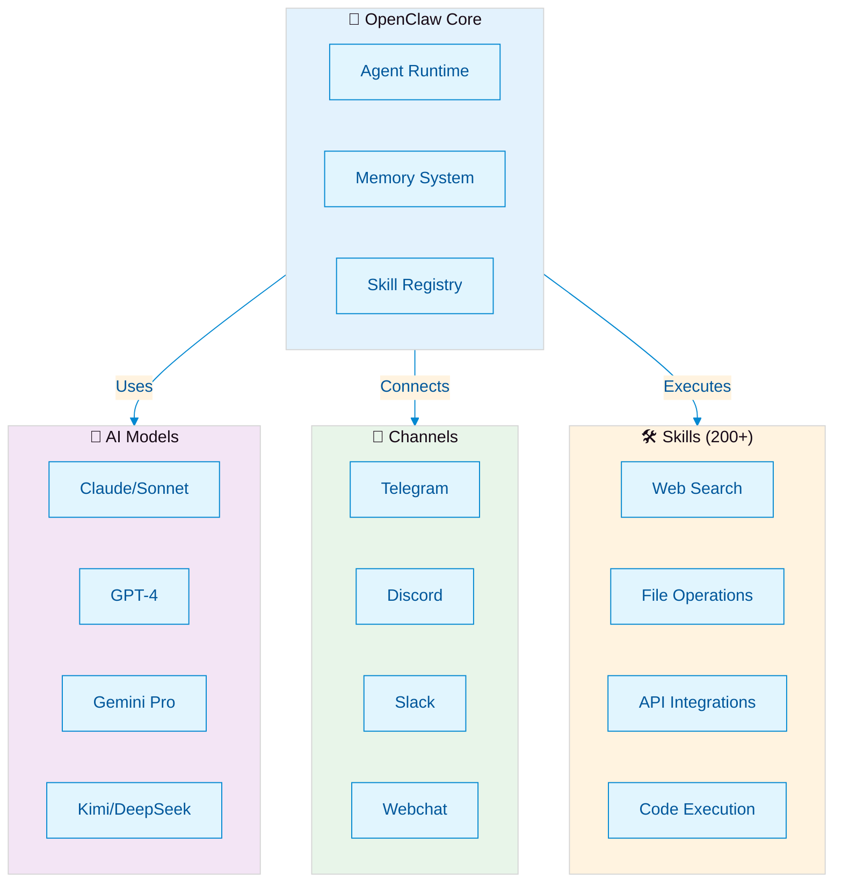

  
  
  
  

# 🤖 OpenClaw Sumopod — Tutorial Hub

> Repositori komunitas Indonesia untuk belajar [OpenClaw](https://github.com/openclaw/openclaw) — AI agent framework yang powerful dan fleksible.

  <b>Sumopod Server</b> — Komunitas pengguna OpenClaw di Indonesia 🌏

---

## 🏗️ OpenClaw Architecture

*OpenClaw's modular architecture connects AI models, integrations, and a growing ecosystem of 200+ skills.*

---

## 📚 Tutorials

Kumpulan 37 tutorial praktis untuk membangun automation dengan OpenClaw, dikelompokkan per kategori.

---

### 1. 🚀 Getting Started

Panduan instalasi, setup awal, dan konfigurasi dasar.

- **[OpenClaw + Alibaba Cloud Coding Plan: 8 Model AI dengan 1 API Key (Mulai $5/bulan)](https://github.com/fanani-radian/openclaw-sumopod/blob/main/tutorials/openclaw-alibaba-coding-plan.md)** — Setup hemat akses 8 model AI frontier lewat satu API key
- **[⚠️ JANGAN Update ke OpenClaw 2026.3.7 - 2026.3.10 — Kimi 2.5 Tool Calling BROKEN!](https://github.com/fanani-radian/openclaw-sumopod/blob/main/tutorials/avoid-openclaw-2026-3-7-kimi-bug.md)** — Guide versi yang bermasalah dan solusi upgrade ke 2026.3.11
- **[Upgrade OpenClaw ke 2026.3.31 + Fix Exec Approvals](https://github.com/fanani-radian/openclaw-sumopod/blob/main/tutorials/upgrade-openclaw-2026-3-31.md)** — Panduan upgrade dan fix exec approval yang lebih ketat

---

### 2. ⚡ Multi-Agent & Orchestration

Bangun sistem multi-agent dengan spesialisasi dan shared memory.

- **[Multi-Agent System dengan OpenClaw](https://github.com/fanani-radian/openclaw-sumopod/blob/main/tutorials/openclaw-multi-agent-system.md)** — Setup multi-agent dengan spesialisasi, context, dan memory terpisah
- **[🧠 Multi-Agent Shared Memory System](https://github.com/fanani-radian/openclaw-sumopod/blob/main/tutorials/multi-agent-shared-memory.md)** — Multiple agent sharing knowledge lewat GitHub sync
- **[🏗️ Membangun AI Agent Skill Ecosystem dari 15+ GitHub Repos](https://github.com/fanani-radian/openclaw-sumopod/blob/main/tutorials/openclaw-skill-ecosystem.md)** — Analisis 500K+ stars repos, 16 composite skills, SHARP framework, 324 total skills
- **[🔄 OpenClaw 2026.4.2 — Task Flow Kembali, YOLO Mode, Breaking Changes](https://github.com/fanani-radian/openclaw-sumopod/blob/main/tutorials/openclaw-2026-4-2.md)** — Review update: Task Flow restoration, managed/mirrored sync, YOLO exec default, security overhaul 50+ fixes

---

### 3. 📧 Email & Communication

Otomasi Gmail, triage email, dan komunikasi WhatsApp.

- **[📧 Gmail Auto-Label & Smart Triage Tutorial](https://github.com/fanani-radian/openclaw-sumopod/blob/main/tutorials/gmail-auto-label-triage.md)** — Auto-classify email dengan 7 label berbasis AI
- **[📧 Smart Email Forward with PDF Data Extraction](https://github.com/fanani-radian/openclaw-sumopod/blob/main/tutorials/smart-email-forward-pdf.md)** — Forward email otomatis + extract data dari PDF lampiran
- **[Smart Email Triage](https://github.com/fanani-radian/openclaw-sumopod/blob/main/tutorials/smart-email-triage.md)** — AI-powered inbox management: auto-sort, prioritas, dan draft respons
- **[Voice Memo to Action Items](https://github.com/fanani-radian/openclaw-sumopod/blob/main/tutorials/voice-memo-to-action.md)** — Ubah voice message WhatsApp jadi task terorganisir

---

### 4. 📊 Dashboard & Monitoring

Bangun dashboard, monitoring, dan sistem notifikasi real-time.

- **[🚀 Membangun AI Agent Dashboard — Tutorial Lengkap (Bagian 1)](https://github.com/fanani-radian/openclaw-sumopod/blob/main/tutorials/building-ai-agent-dashboard.md)** — Next.js 14 + Tailwind + shadcn/ui + Recharts dari nol
- **[🏥 Service Health Dashboard with Auto-Retry](https://github.com/fanani-radian/openclaw-sumopod/blob/main/tutorials/service-health-dashboard.md)** — Monitor layanan 24/7 + auto-retry + alert Telegram
- **[Real-Time Notification System di Next.js dengan Auto-Health Checks](https://github.com/fanani-radian/openclaw-sumopod/blob/main/tutorials/notification-system-nextjs-health-checks.md)** — Dashboard bell yang hidup dengan health check otomatis
- **[Visual Data Alert](https://github.com/fanani-radian/openclaw-sumopod/blob/main/tutorials/visual-data-alert.md)** — Transformasi data spreadsheet jadi chart yang dikirim ke Telegram
- **[Konsolidasi Dashboard: Dari Flask ke Next.js](https://github.com/fanani-radian/openclaw-sumopod/blob/main/tutorials/consolidate-vps-dashboard-nextjs.md)** — Pindahkan semua dashboard Flask ke satu codebase Next.js

---

### 5. 🔗 Integrations

Hubungkan OpenClaw dengan layanan eksternal dan workflow automation.

- **[🔍 gog CLI — Google Workspace dari Terminal](https://github.com/fanani-radian/openclaw-sumopod/blob/main/tutorials/gog-cli-google-workspace.md)** — Kontrol Gmail, Drive, Docs, Sheets, Calendar via command line
- **[OpenClaw + n8n Integration Tutorial](https://github.com/fanani-radian/openclaw-sumopod/blob/main/tutorials/n8n-integration.md)** — Hubungkan ke 400+ app lewat n8n workflow tanpa coding
- **[Integrating External Services with OpenClaw](https://github.com/fanani-radian/openclaw-sumopod/blob/main/tutorials/integrating-external-services-openclaw.md)** — Panduan umum integrasi API dan layanan eksternal
- **[Voicenotes Integration with OpenClaw](https://github.com/fanani-radian/openclaw-sumopod/blob/main/tutorials/voicenotes-integration-openclaw.md)** — Hubungkan Voicenotes untuk voice-based productivity
- **[⚡ Redis Caching Pattern for Speed](https://github.com/fanani-radian/openclaw-sumopod/blob/main/tutorials/redis-caching-pattern.md)** — Percepat automasi 20x (dari 1 detik ke 50ms) pakai Redis

---

### 6. 🛠️ DevOps & Deployment

Pipeline deployment, process management, dan infrastruktur.

- **[Deployment Butler](https://github.com/fanani-radian/openclaw-sumopod/blob/main/tutorials/deployment-butler.md)** — Pipeline otomatis: GitHub → VPS dengan zero-downtime dan instant rollback
- **[Deploying and Publishing with OpenClaw](https://github.com/fanani-radian/openclaw-sumopod/blob/main/tutorials/deploying-nextjs-supabase-pm2-openclaw.md)** — Panduan deployment Next.js + Supabase + PM2
- **[Migrasi Data Absensi Karyawan ke Supabase + Cron Sync Harian](https://github.com/fanani-radian/openclaw-sumopod/blob/main/tutorials/absensi-migration-supabase-cron.md)** — Migrasi dari API lama ke Supabase dengan auto-sync pagi

---

### 7. 🎨 Content & Social Media

Otomasi konten, social media posting, dan creative tools.

- **[Auto-Post to Website from Images](https://github.com/fanani-radian/openclaw-sumopod/blob/main/tutorials/auto-post-website.md)** — Transform foto jadi website post otomatis dengan AI
- **[🧵 Auto-Post ke Threads dengan OpenClaw + Repliz](https://github.com/fanani-radian/openclaw-sumopod/blob/main/tutorials/repliz-threads-automation.md)** — Posting otomatis ke Threads via perintah Telegram
- **[🎬 Auto-Generate Video dengan AI dan Upload ke Cloud Storage](https://github.com/fanani-radian/openclaw-sumopod/blob/main/tutorials/ai-video-generation-pipeline.md)** — Pipeline generate video AI lalu upload ke cloud
- **[OpenClaw + Excalidraw Tutorial](https://github.com/fanani-radian/openclaw-sumopod/blob/main/tutorials/excalidraw-diagram-generation.md)** — Generate diagram hand-drawn style untuk dokumentasi

---

### 8. 🌐 Web Development & Blogging

Panduan membangun website dan blog dengan framework modern.

- **[🌙 Dark Mode + Search dengan Library GitHub di Nuxt 3](https://github.com/fanani-radian/openclaw-sumopod/blob/main/tutorials/dark-mode-search-nuxt-github-libraries.md)** — Tambahkan dark mode (Darkmode.js) dan fuzzy search (Fuse.js) via CDN ke blog Nuxt 3
- **[📝 Build Blog Statis dengan Nuxt Content + Tailwind CSS](https://github.com/fanani-radian/openclaw-sumopod/blob/main/tutorials/build-blog-nuxt-content-tailwind.md)** — Blog statis lengkap: markdown, syntax highlighting, copy code, RSS, share buttons, newsletter
- **[🤖 AI Agent Dashboard dengan OpenClaw + Sumopod VPS](https://github.com/fanani-radian/openclaw-sumopod/blob/main/tutorials/ai-agent-dashboard-openclaw-sumopod-vps.md)** — Tutorial lengkap bikin AI agent 24/7 dengan dashboard real-time, Telegram integration, n8n automation, dan AI model routing strategy

- **[🛡️ OpenClaw Ops — Self-Healing Gateway + Security Hardening](https://github.com/fanani-radian/openclaw-sumopod/blob/main/tutorials/openclaw-ops-self-healing-openclaw.md)** — Auto-repair gateway abis update, watchdog 24/7, security scanning, exec approval two-layer fix
---

### 9. 🧩 Advanced Patterns

Pattern lanjutan: error handling, file management, dan optimasi arsitektur.

- **[Dashboard Widget Error Boundary Pattern untuk Next.js](https://github.com/fanani-radian/openclaw-sumopod/blob/main/tutorials/dashboard-error-boundary-nextjs.md)** — Satu widget error, dashboard tetap aman dengan graceful fallback
- **[File Manager dengan Google Docs-Style Search: Highlight, Navigate, Copy](https://github.com/fanani-radian/openclaw-sumopod/blob/main/tutorials/file-manager-search-highlight-nextjs.md)** — Pencarian konten file dengan highlight aktif dan navigasi keyboard
- **[Smart File Butler](https://github.com/fanani-radian/openclaw-sumopod/blob/main/tutorials/smart-file-butler.md)** — Auto-organize folder Downloads dengan AI

---

### 10. 🐛 Troubleshooting

Masalah umum, bug fixes, dan panduan troubleshooting.

- **[Common Issues and Solutions (2026-04-01)](https://github.com/fanani-radian/openclaw-sumopod/blob/main/tutorials/common-issues-and-solutions-2026-04-01md.md)** — Daftar masalah dan solusi terbaru
- **[Common Issues and Solutions](https://github.com/fanani-radian/openclaw-sumopod/blob/main/tutorials/common-issues-solutions-openclaw.md)** — Troubleshooting umum OpenClaw
- **[OpenClaw vs Hermes Agent — Comprehensive Comparison Guide (2026)](https://github.com/fanani-radian/openclaw-sumopod/blob/main/tutorials/openclaw-vs-hermes-agent-2026.md)** — Perbandingan detail OpenClaw vs Hermes Agent

---

### 11. 💼 Business

Layanan profesional dan jasa setup.

- **[Jasa Install OpenClaw Profesional — Panduan Lengkap 2026](https://github.com/fanani-radian/openclaw-sumopod/blob/main/tutorials/jasa-install-openclaw-profesional-2026.md)** — Setup production-ready OpenClaw dalam 2-5 hari kerja

---

## 🔧 Quick Start

1. **Install OpenClaw**: `npm i -g openclaw`
2. **Clone repo ini**: `git clone https://github.com/fanani-radian/openclaw-sumopod.git`
3. **Buka tutorial** yang sesuai kebutuhan di folder `tutorials/`
4. **Copy & adapt** konfigurasi dan kode ke environment kamu
5. **Join komunitas** untuk tanya jawab dan kolaborasi

> 💡 Setiap tutorial standalone — bisa diikuti urutan manapun sesuai kebutuhan.

---

## 🤝 Contributing

Kita terima kontribusi dari siapa saja! Caranya:

1. **Fork** repo ini
2. **Buat branch**: `git checkout -b tutorial/nama-tutorial`
3. **Tulis tutorial** di `tutorials/` — format Markdown, bahasa Indonesia atau English
4. **Commit**: `git commit -m "Add: nama tutorial"`
5. **Push & PR**: `git push` lalu buat Pull Request

### Kontribusi yang Diterima

- ✅ Tutorial baru (automation, integrasi, deployment, dll)
- ✅ Perbaikan atau update tutorial yang sudah ada
- ✅ Tips & tricks
- ✅ Use cases dari pengalaman nyata
- ✅ Translation Indonesia ↔ English

---

## 💬 Join Komunitas

- **Discord**: [Sumopod OpenClaw](#)
- **Telegram**: [@sumopod](#)

---

## 📄 License

Konten repo ini dilisensikan under [MIT License](./LICENSE).

---

  Dibuat dengan ❤️ oleh komunitas Sumopod

