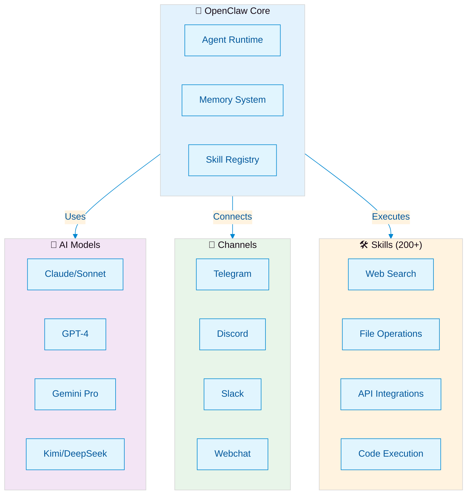
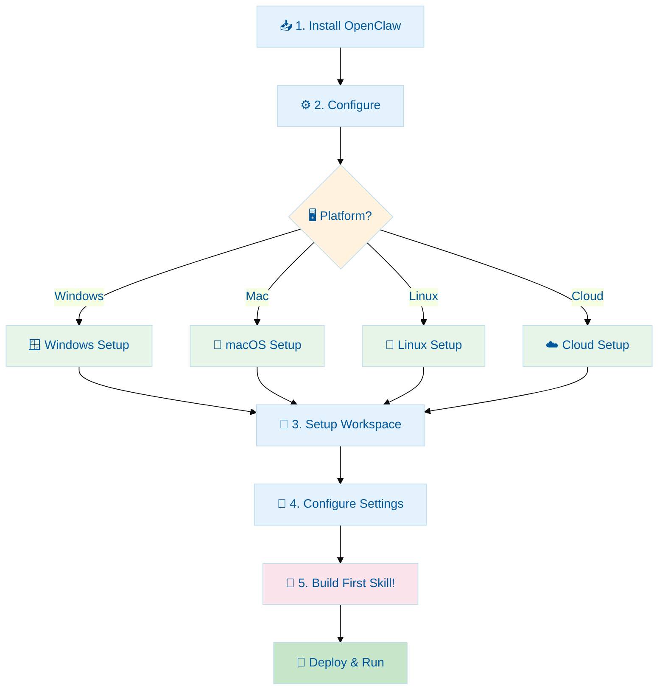
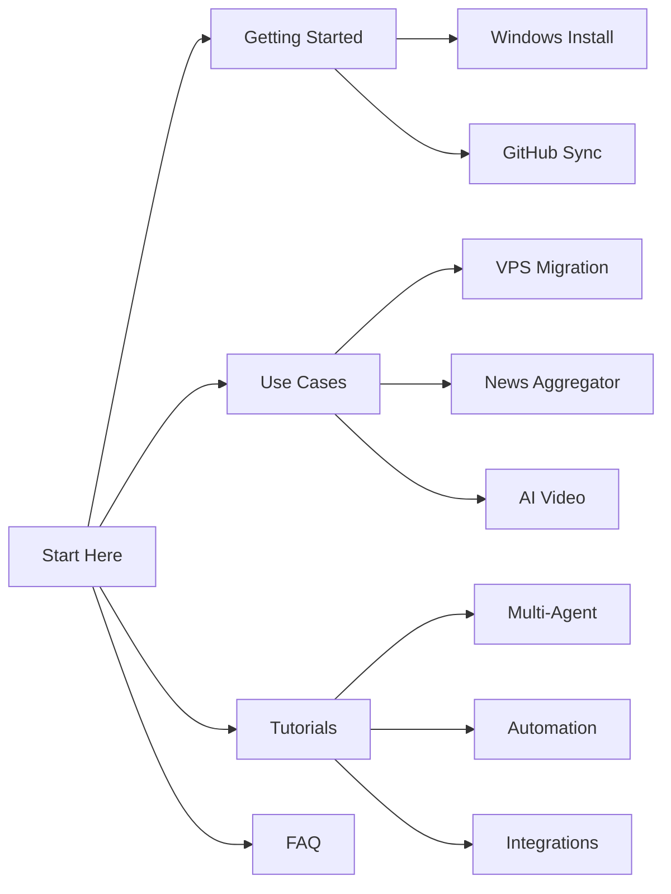
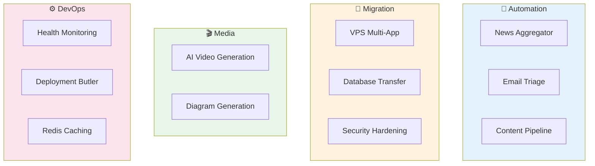
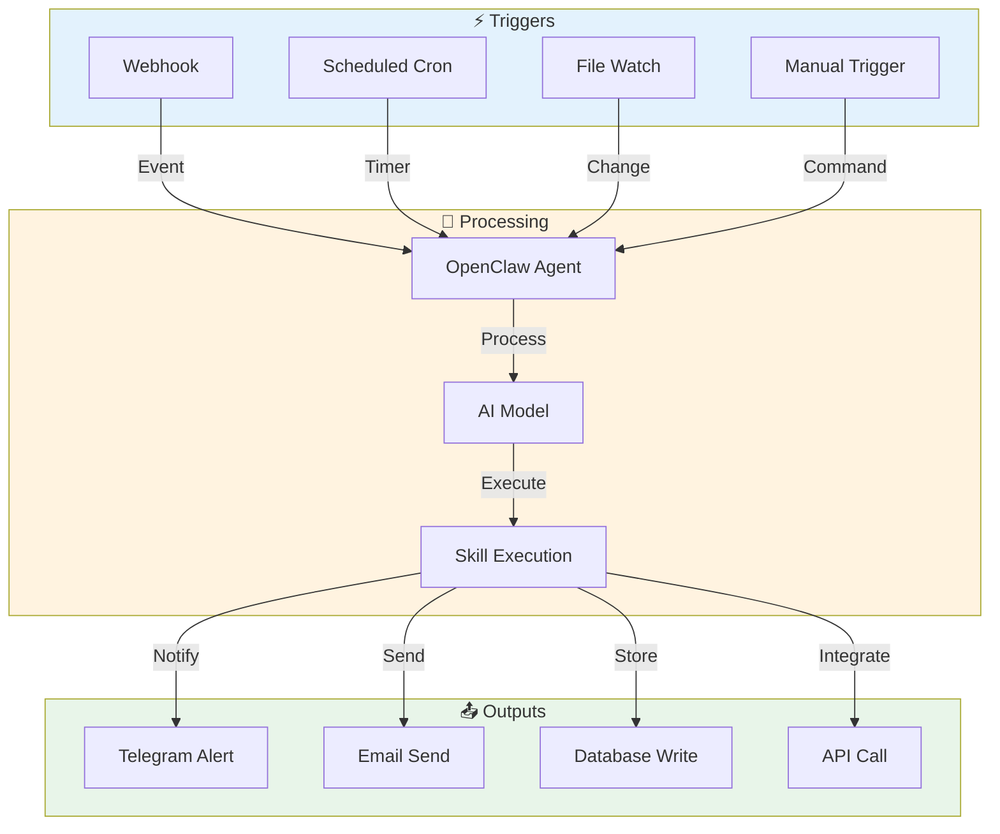
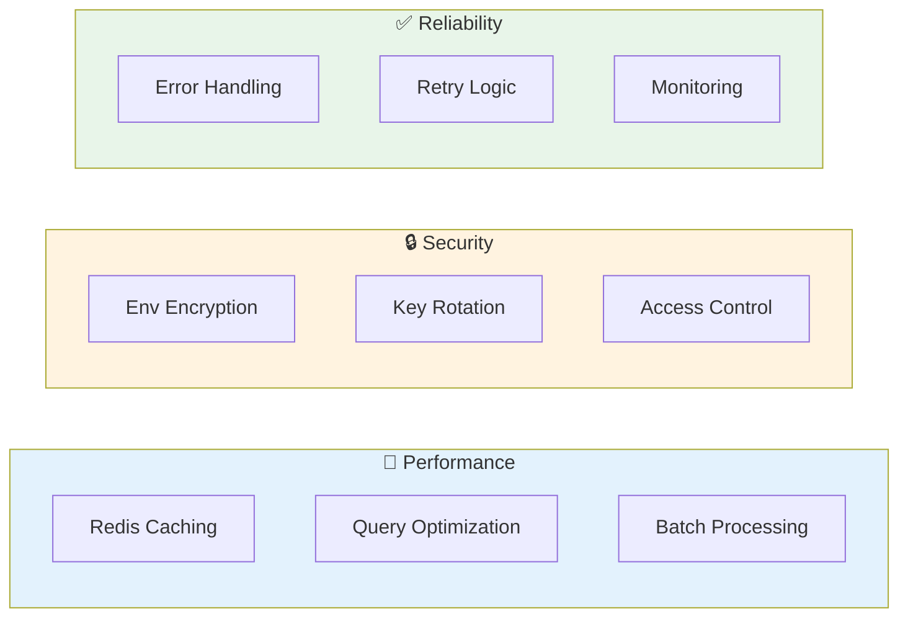

# 🤖 OpenClaw Sumopod

Repositori komunitas untuk belajar, berbagi, dan berkolaborasi tentang [OpenClaw](https://github.com/openclaw/openclaw) — AI agent framework yang powerful dan fleksibel.

> **Sumopod Server**: Komunitas pengguna OpenClaw di Indonesia 🌏

---

## 🏗️ OpenClaw Architecture



*OpenClaw's modular architecture connects AI models, integrations, and a growing ecosystem of 200+ skills.*

---

## ✅ UPDATE: Kimi 2.5 Fixed di OpenClaw 2026.3.11!

```
┌──────────────────────────────────────────────────────────┐
│  ✅ GOOD NEWS: OpenClaw 2026.3.11 FIXES KIMI 2.5!       │
│                                                          │
│  🎉 Tool calling BERFUNGSI kembali                      │
│  🎉 Infinite loop issue RESOLVED                        │
│  🎉 Kimi K2.5 bisa dipakai lagi                         │
│                                                          │
│  ✅ UPDATE: npm i -g openclaw@latest                    │
│  📖 Release: https://github.com/openclaw/openclaw/      │
│              releases/tag/v2026.3.11                    │
│                                                          │
│  ⚠️  NOTE: Versi 2026.3.7 - 2026.3.10 masih buggy       │
│       Skip langsung ke 2026.3.11 atau lebih baru        │
└──────────────────────────────────────────────────────────┘
```

---

## 🚀 Getting Started Flowchart



*Follow these steps to get OpenClaw running on your platform of choice.*

---

## 📚 Navigasi Cepat



| Section | Deskripsi |
|---------|-----------|
| [🚀 Getting Started](./docs/getting-started/README.md) | Panduan instalasi dan setup pertama |
| [🖥️ Windows Install](./docs/getting-started/windows-install.md) | Tutorial lengkap Windows + auto-start + management |
| [🔄 Sync Memory ke GitHub](./docs/getting-started/github-sync.md) | Sinkronisasi memory antar device/PC/VPS |
| [💡 Use Cases](#-use-cases) | Contoh penggunaan real-world dengan diagram |
| [📖 Tutorials](#-tutorials) | Kumpulan tutorial praktis OpenClaw |
| [🎯 Tips & Tricks](#-tips--tricks) | Trik optimize OpenClaw |
| [❓ FAQ](./faq/README.md) | Pertanyaan yang sering ditanyakan |
| [⚙️ Config](./docs/config/README.md) | Konfigurasi dan templates |
| [🎥 Resources](./resources/README.md) | Video, link, dan referensi |
| [💰 API Providers](./resources/api-providers.md) | Daftar provider AI API murah & free tier |

---

## 📖 Tutorials

Kumpulan tutorial praktis untuk membangun automation dengan OpenClaw.

### 🎓 Getting Started
| Tutorial | Deskripsi | Level |
|----------|-----------|-------|
| [☁️ Alibaba Cloud Coding Plan](./tutorials/openclaw-alibaba-coding-plan.md) | 8 model AI dengan 1 API key mulai $5/bulan | Beginner |
| [🖥️ Windows Install](./docs/getting-started/windows-install.md) | Instalasi lengkap Windows + auto-start | Beginner |
| [⚠️ OpenClaw Version Guide](./tutorials/avoid-openclaw-2026-3-7-kimi-bug.md) | Update guide: Kimi 2.5 fixed in 2026.3.11 | **CRITICAL** |

### 🤖 AI Automation
| Tutorial | Deskripsi | Level |
|----------|-----------|-------|
| [📝 Auto-Post ke Website](./tutorials/auto-post-website.md) | Foto → AI content → Auto-post ke website | Intermediate |
| [🎙️ Voice Memo to Action](./tutorials/voice-memo-to-action.md) | WhatsApp voice → Whisper → Tasks | Intermediate |
| [📧 Smart Email Forward PDF](./tutorials/smart-email-forward-pdf.md) | Forward email + extract PDF data otomatis | Intermediate |
| [🏷️ Gmail Auto-Label Triage](./tutorials/gmail-auto-label-triage.md) | Auto-classify emails dengan 7 label | Intermediate |
| [📰 Multi-Agent System](./tutorials/openclaw-multi-agent-system.md) | Setup brothers (Radit, Raka, Rama, Rafi) | Advanced |
| [🧠 Multi-Agent Shared Memory](./tutorials/multi-agent-shared-memory.md) | Multiple agents sharing knowledge via GitHub | Advanced |

### 📊 Data & Monitoring
| Tutorial | Deskripsi | Level |
|----------|-----------|-------|
| [📊 Visual Data Alert](./tutorials/visual-data-alert.md) | Spreadsheet → Charts → Telegram | Intermediate |
| [📧 Smart Email Triage](./tutorials/smart-email-triage.md) | AI classify inbox + auto-actions | Intermediate |
| [🗂️ Smart File Butler](./tutorials/smart-file-butler.md) | Auto-organize Downloads dengan AI | Beginner |
| [⚡ Redis Caching Pattern](./tutorials/redis-caching-pattern.md) | Speed up 20x dengan Redis cache | Beginner |
| [🏥 Service Health Dashboard](./tutorials/service-health-dashboard.md) | Monitor services + auto-retry alerts | Intermediate |

### ☁️ Infrastructure & Migration
| Tutorial | Deskripsi | Level |
|----------|-----------|-------|
| [🖥️ VPS Multi-App Migration](./docs/use-cases/vps-multi-app-migration.md) | Lengkap: Replit→VPS + Security + SSL | **NEW** |
| [⚡ Redis Caching Pattern](./tutorials/redis-caching-pattern.md) | Speed up 20x dengan Redis cache | Beginner |
| [🏥 Service Health Dashboard](./tutorials/service-health-dashboard.md) | Monitor services + auto-retry alerts | Intermediate |
| [🚀 Deployment Butler](./tutorials/deployment-butler.md) | GitHub webhook → Auto-deploy + rollback | Advanced |

### ☁️ Integrations
| Tutorial | Deskripsi | Level |
|----------|-----------|-------|
| [🔍 gog CLI Google Workspace](./tutorials/gog-cli-google-workspace.md) | Gmail, Drive, Docs, Sheets via CLI | Intermediate |
| [⚡ n8n Integration](./tutorials/n8n-integration.md) | Workflow automation dengan n8n | Intermediate |
| [🧵 Repliz Threads Automation](./tutorials/repliz-threads-automation.md) | Auto-post ke Threads via Telegram | Intermediate |

### 🎨 Content Creation
| Tutorial | Deskripsi | Level |
|----------|-----------|-------|
| [🎨 Excalidraw Diagram Generation](./tutorials/excalidraw-diagram-generation.md) | Generate diagram dari teks | Beginner |
| [🎬 AI Video Generation Pipeline](./tutorials/ai-video-generation-pipeline.md) | Generate video AI → Upload ke Drive | Intermediate |

---

## 💡 Use Cases



*Real-world use cases powered by OpenClaw skills and integrations.*

### 🚚 Migration & Deployment
| Use Case | Deskripsi | Link |
|----------|-----------|------|
| [🖥️ VPS Multi-App Migration](./docs/use-cases/vps-multi-app-migration.md) | Migrate Replit/Cloud apps ke VPS dengan security produksi | [Read](./docs/use-cases/vps-multi-app-migration.md) |
| [📊 VPS Migration Diagrams](./docs/use-cases/vps-migration-diagrams.md) | Visual guides: Mermaid diagrams untuk migration workflow | [Read](./docs/use-cases/vps-migration-diagrams.md) |

### 🤖 Content & Automation
| Use Case | Deskripsi | Link |
|----------|-----------|------|
| [📰 News Aggregator](./docs/use-cases/news-aggregator.md) | Aggregasi berita otomatis dengan AI | [Read](./docs/use-cases/news-aggregator.md) |
| [🎬 AI Video Generation](./docs/use-cases/ai-video-generation.md) | Otomatisasi pembuatan video dengan AI | [Read](./docs/use-cases/ai-video-generation.md) |

---

## 🔗 Integration Patterns



*Common integration patterns for connecting OpenClaw with external systems and services.*

---

## 🎯 Tips & Tricks



Trik dan best practices untuk optimize OpenClaw.

| Topic | Deskripsi | Link |
|-------|-----------|------|
| [🚀 Performance Optimization](./docs/tips-tricks/README.md) | Best practices untuk speed dan efisiensi | [Read](./docs/tips-tricks/README.md) |

---

## 🎬 YouTube Playlist

- 📺 [OpenClaw Tutorial Series](#) - *Coming soon*
- 📺 [Sumopod Community Showcase](#) - *Coming soon*

---

## 🤝 Cara Berkontribusi

1. **Fork** repo ini
2. **Clone** ke lokal: `git clone https://github.com/fanani-radian/openclaw-sumopod.git`
3. Buat **branch baru**: `git checkout -b feature/nama-fitur`
4. **Commit** perubahan: `git commit -m "Add: deskripsi singkat"`
5. **Push** ke branch: `git push origin feature/nama-fitur`
6. Buat **Pull Request**

### Kontribusi yang Diterima

- ✅ Tips & tricks baru
- ✅ Use cases dari pengalaman nyata
- ✅ Konfigurasi yang bisa dishare
- ✅ Jawaban untuk FAQ
- ✅ Translation (Bahasa Indonesia / English)
- ✅ Video tutorials

---

## 💬 Join Komunitas

- **Discord**: [Sumopod OpenClaw](#)
- **Telegram**: [@sumopod](#)

---

## 📄 Lisensi

Konten repo ini dilisensikan under [MIT License](./LICENSE).

---

<p align="center">
  <sub>Dibuat dengan ❤️ oleh komunitas Sumopod</sub>
</p>
