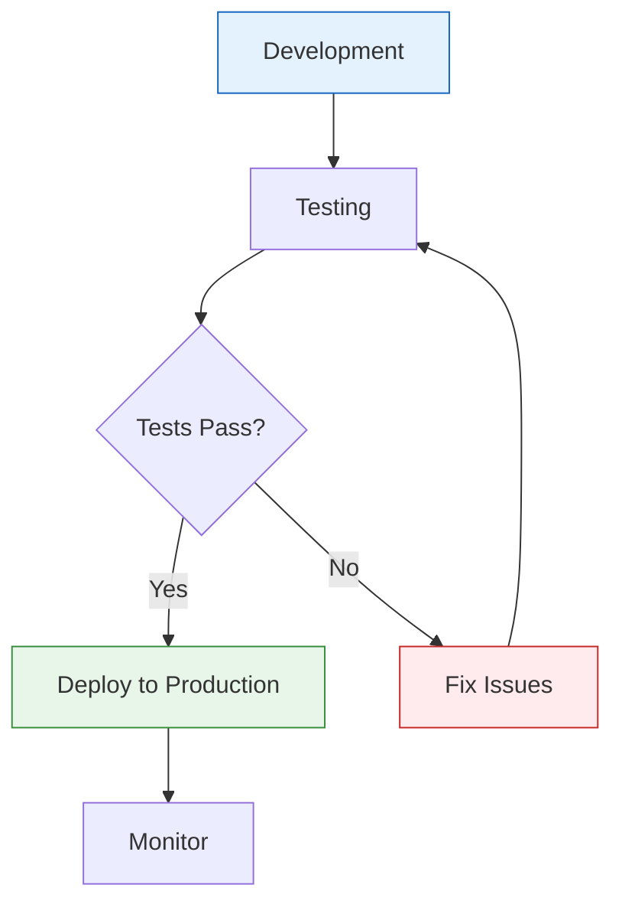

# Deploying and Publishing with OpenClaw

> 📅 Generated: 2026-03-15 | Type: deployment | ID: deployment-1773546013

---

## Metadata

- **Level**: intermediate
- **Time Required**: 25-35 min
- **Prerequisites**: Git basics, Basic deployment concepts

---

## Overview

In this tutorial, you'll learn how to **Deploying and Publishing with OpenClaw**. This guide will walk you through the complete process from setup to implementation.

### What You'll Build

By the end of this tutorial, you will have:

- ✅ Understanding of the core concepts
- ✅ A working implementation
- ✅ Best practices for production use
- ✅ Troubleshooting skills

**Context from today's work:**
> Deployment strategies and CI/CD pipelines

---

## Architecture

The following diagram illustrates the flow and components:



---

## Step-by-Step Instructions

### Step 1: Prerequisites

Before starting, ensure you have:

- [ ] Required tools installed
- [ ] Access to necessary resources
- [ ] Basic understanding of Git basics

### Step 2: Setup

Create the necessary directory structure:

```bash
mkdir -p my-project/{src,config,tests}
cd my-project
```

### Step 3: Implementation

Here's the core implementation:

```bash
#!/bin/bash
# example.sh

echo "Your code here"
```

### Step 4: Configuration

Create a configuration file:

```bash
cat > config/settings.json << 'CONFIG'
{
  "name": "my-project",
  "version": "1.0.0",
  "environment": "production"
}
CONFIG
```

### Step 5: Testing

Run tests to verify everything works:

```bash
# Test the implementation
bash test.sh

# Or run manually
bash script.sh --dry-run
```

### Step 6: Deployment

Deploy to production:

```bash
# Make executable
chmod +x script.sh

# Run
./script.sh
```

---

## Troubleshooting

### Common Issues

| Issue | Cause | Solution |
|-------|-------|----------|
| Permission denied | File not executable | Run `chmod +x script.sh` |
| Command not found | Missing dependency | Install required packages |
| Connection failed | Network/API issue | Check connectivity and credentials |

### Debug Mode

Enable debug output:
```bash
bash -x script.sh
```

### Getting Help

- Check logs: `tail -f /var/log/your-app.log`
- Review documentation: `cat SKILL.md`
- Open an issue on GitHub

---

## Next Steps

- [ ] Explore advanced features
- [ ] Customize for your use case
- [ ] Share your implementation
- [ ] Contribute improvements

---

## References

- [OpenClaw Documentation](https://github.com/openclaw/sumopod)
- [Memory Reference: 2026-03-15](memory/2026-03-15.md)

---

*Generated by Tutorial Generator Skill*  
*Status: DRAFT - Pending Review*  
*⚠️ Verify Mermaid diagram renders correctly on GitHub before finalizing*
