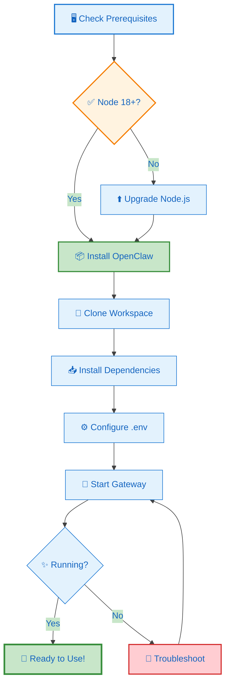
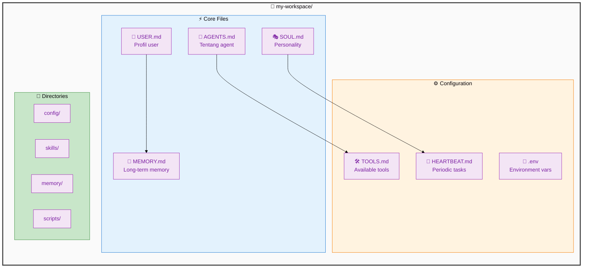
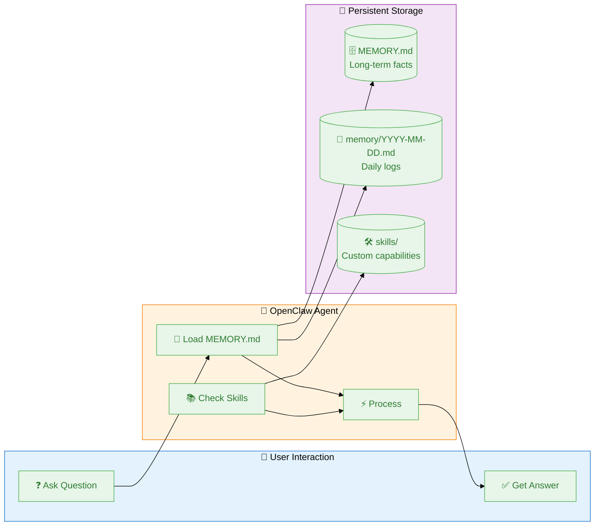

# 🚀 Getting Started

## Instalasi OpenClaw

### Prerequisites

- Node.js 18+ / Python 3.10+
- Git
- (Optional) Docker

### Install via npm

```bash
npm install -g openclaw
```

### 📊 Installation Flowchart



### Setup Pertama

1. **Clone workspace template:**
   ```bash
   git clone https://github.com/openclaw/workspace-template my-workspace
   cd my-workspace
   ```

2. **Install dependencies:**
   ```bash
   npm install
   ```

3. **Configure environment:**
   ```bash
   cp .env.example .env
   # Edit .env dengan API keys yang diperlukan
   ```

4. **Start OpenClaw:**
   ```bash
   openclaw gateway start
   ```

---

## 📂 Workspace Structure Diagram



---

## Struktur Workspace

```
my-workspace/
├── AGENTS.md          # Tentang agent kamu
├── USER.md            # Profil user
├── SOUL.md            # Personality agent
├── MEMORY.md          # Memori jangka panjang
├── TOOLS.md           # Tools yang tersedia
├── HEARTBEAT.md       # Task periodic
├── config/            # Konfigurasi
├── skills/            # Custom skills
├── memory/            # Daily logs
└── scripts/           # Automation scripts
```

---

## Konsep Dasar

### 1. Skills
Skills adalah kemampuan spesifik yang bisa dipelajari agent.

Contoh struktur skill:
```
skills/my-skill/
├── SKILL.md           # Dokumentasi skill
├── README.md          # Cara pakai
└── scripts/
    └── run.sh         # Entry point
```

### 2. Memory System

- **MEMORY.md** - Memori jangka panjang (loaded di main session)
- **memory/YYYY-MM-DD.md** - Daily logs
- **HEARTBEAT.md** - Task yang dicek secara periodic

### 3. Sub-agents

Untuk tugas kompleks, spawn sub-agents:

```bash
# Contoh dari dalam session
sessions_spawn with runtime="subagent" untuk parallel execution
```

---

## 🔄 Memory & Skills Flow



---

## Next Steps

- [🤖 Setup Kimi AI](./kimi-setup.md) - Dapatkan API Key Kimi dengan harga $0.99/month!
- [🔧 Setup Gog CLI](./gog-setup.md) - Integrasi Google Workspace (Gmail, Calendar, Drive)!
- [📱 Setup Telegram Bot](./telegram-setup.md) - Hubungkan OpenClaw dengan Telegram!
- [🖥️ Install di Windows](./windows-install.md) - Tutorial lengkap Windows install + auto-start + management!
- [🔄 Sync Memory ke GitHub](./github-sync.md) - Sinkronisasi memory antar device/PC/VPS!
- [Konfigurasi Skills](../config/README.md)
- [Contoh Use Cases](../use-cases/README.md)
- [Tips & Tricks](../tips-tricks/README.md)
