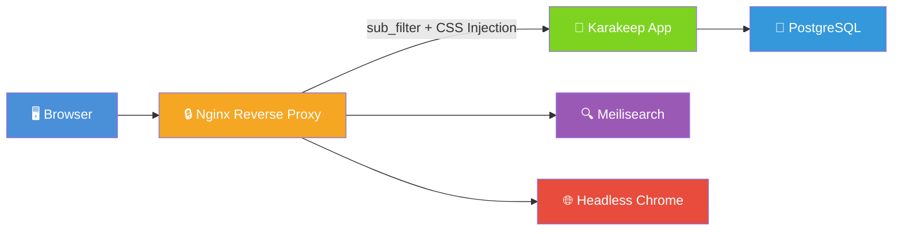
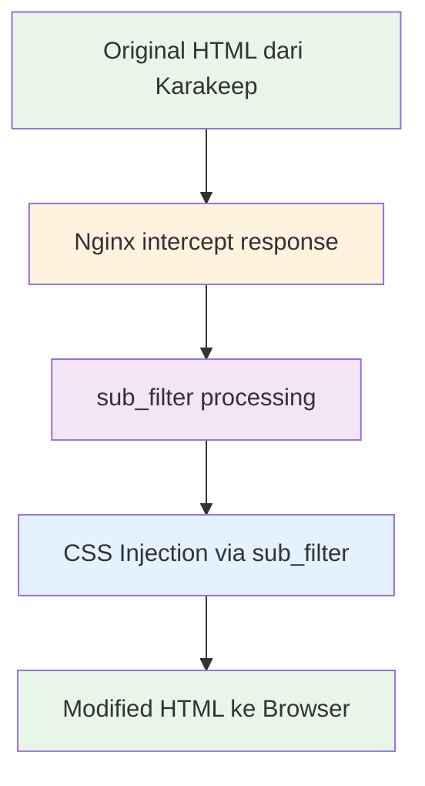

> 📖 Tutorial ini juga dipublish di blog: [blog.fanani.co](https://blog.fanani.co/posts/simpen-bookmark-manager)
> 
> 

---

Pernah pakai bookmark browser dan merasa "ini doang?" — nggak bisa diakses dari device lain, nggak ada tag, nggak bisa search. Atau pakai layanan bookmark online tapi khawatir privacy? Self-hosted bookmark manager jawabannya.

Di tutorial ini, aku bahas setup **Karakeep** — open-source bookmark manager yang feature-complete — dan trik **custom branding via Nginx `sub_filter`** tanpa edit satu baris pun kode source-nya.

## 🤔 Kenapa Self-Host Bookmark Manager?

Beberapa alasan kenapa self-host lebih masuk akal buat personal atau team use:

- **Privacy** — data kamu nggak dijual atau dianalisis pihak ketiga
- **Control** — kamu yang tentukan fitur, UI, dan branding
- **No vendor lock-in** — data ada di server sendiri, export kapan aja
- **Full-text search** — dengan Meilisearch, cari bookmark by content, bukan cuma judul
- **AI-powered tagging** — Karakeep bisa auto-tag pakai AI

## 📌 Apa itu Karakeep?

**Karakeep** (sebelumnya Hoarder) adalah open-source bookmark manager yang support:

- Bookmark URL, text notes, dan media
- Auto-tagging pakai AI (OpenAI, Ollama, dll)
- Full-text search via Meilisearch
- Browser extension (Chrome/Firefox)
- Clean UI dengan dark mode
- REST API

Repo: [github.com/karakeep-app/karakeep](https://github.com/karakeep-app/karakeep)

## 🏗️ Architecture

Diagram berikut menunjukkan bagaimana stack ini bekerja:



**Komponen:**
- **Nginx** — reverse proxy + SSL + custom branding via `sub_filter`
- **Karakeep** — main app (Next.js)
- **Meilisearch** — full-text search engine
- **Chrome/Chromium** — headless browser untuk render bookmark preview
- **PostgreSQL** — database utama

## 🚀 Docker Compose Setup

Buat folder project dan `docker-compose.yml`:

```yaml
version: "3.8"

services:
  app:
    image: ghcr.io/karakeep-app/karakeep:latest
    restart: unless-stopped
    ports:
      - "3000:3000"
    environment:
      - NEXT_PUBLIC_URL=https://bookmarks.example.com
      - NEXT_PUBLIC_DISABLE_SIGNUP=false
      - MEILI_ADDR=http://meilisearch:7700
      - DATA_DIR=/data
      - NEXTAUTH_SECRET=changeme-to-random-string
      - NEXTAUTH_URL=https://bookmarks.example.com
    volumes:
      - app-data:/data
    depends_on:
      meilisearch:
        condition: service_healthy
      chrome:
        condition: service_started
      db:
        condition: service_healthy

  meilisearch:
    image: getmeili/meilisearch:v1.6
    restart: unless-stopped
    volumes:
      - meili-data:/meili_data
    environment:
      - MEILI_ENV=production
      - MEILI_MASTER_KEY=changeme-master-key
    healthcheck:
      test: ["CMD", "wget", "--spider", "-q", "http://localhost:7700/health"]
      interval: 10s
      timeout: 5s
      retries: 5

  chrome:
    image: ghcr.io/browserless/chromium:v2
    restart: unless-stopped
    environment:
      - TIMEOUT=30000
      - MAX_CONCURRENT_SESSIONS=4

  db:
    image: postgres:16-alpine
    restart: unless-stopped
    environment:
      - POSTGRES_USER=karakeep
      - POSTGRES_PASSWORD=changeme-db-password
      - POSTGRES_DB=karakeep
    volumes:
      - db-data:/var/lib/postgresql/data
    healthcheck:
      test: ["CMD-SHELL", "pg_isready -U karakeep"]
      interval: 10s
      timeout: 5s
      retries: 5

volumes:
  app-data:
  meili-data:
  db-data:
```

> ⚠️ **Penting:** Ganti semua `changeme-*` value dengan string random yang kuat. Bisa generate pakai `openssl rand -hex 32`.

Jalankan:

```bash
docker compose up -d
```

Cek semua container running:

```bash
docker compose ps
```

## 🔧 Nginx Reverse Proxy

Selanjutnya setup Nginx sebagai reverse proxy dengan SSL. Ini juga tempat kita taruh magic custom branding.

```nginx
server {
    listen 80;
    server_name bookmarks.example.com;
    return 301 https://$host$request_uri;
}

server {
    listen 443 ssl http2;
    server_name bookmarks.example.com;

    ssl_certificate     /etc/letsencrypt/live/bookmarks.example.com/fullchain.pem;
    ssl_certificate_key /etc/letsencrypt/live/bookmarks.example.com/privkey.pem;

    client_max_body_size 50M;

    location / {
        proxy_pass http://127.0.0.1:3000;
        proxy_set_header Host $host;
        proxy_set_header X-Real-IP $remote_addr;
        proxy_set_header X-Forwarded-For $proxy_add_x_forwarded_for;
        proxy_set_header X-Forwarded-Proto $scheme;

        # --- CUSTOM BRANDING ---
        proxy_set_header Accept-Encoding "";
        sub_filter '</head>' '<link rel="stylesheet" href="/custom-branding.css"><style>.custom-logo{display:none !important}</style></head>';
        sub_filter '<title>Karakeep' '<title>MyMarks';
        sub_filter 'Karakeep' 'MyMarks';
        sub_filter_once off;
        sub_filter_types text/html text/css application/javascript application/json;
    }

    location /custom-branding.css {
        alias /var/www/bookmarks/custom-branding.css;
        expires 1d;
    }
}
```

> 💡 **Tips:** Untuk SSL, bisa pakai Certbot: `certbot --nginx -d bookmarks.example.com`

## 🎨 Custom Branding via sub_filter

Ini adalah bagian paling menarik dari tutorial ini. Dengan Nginx `sub_filter`, kita bisa mengubah branding aplikasi **tanpa menyentuh source code** sama sekali.

### Bagaimana sub_filter Bekerja?



**Key steps:**

1. **Disable compression** — `proxy_set_header Accept-Encoding "";` supaya Nginx bisa baca dan modify response body
2. **Text replacement** — `sub_filter 'Karakeep' 'MyMarks'` mengganti semua occurrence
3. **CSS injection** — inject custom stylesheet ke `<head>` untuk override styling
4. **Recursive replacement** — `sub_filter_once off` memastikan semua occurrence diganti

### File custom-branding.css

Buat file `/var/www/bookmarks/custom-branding.css`:

```css
/* === MyMarks Custom Branding === */

/* Override logo */
.logo-container img {
    content: url("https://bookmarks.example.com/logo.svg");
    height: 32px;
}

/* Override app name in header */
header .app-name {
    font-family: 'Inter', sans-serif;
    font-weight: 700;
    letter-spacing: -0.5px;
}

/* Custom brand colors */
:root {
    --brand-primary: #6366f1;
    --brand-secondary: #8b5cf6;
}

/* Override primary buttons */
button.primary,
a.primary-btn {
    background-color: var(--brand-primary) !important;
    border-color: var(--brand-primary) !important;
}

/* Favicon (limited - needs separate approach) */
/* See tips section below for favicon handling */
```

### ⚡ Tips: Favicon & OG Image

`sub_filter` bisa inject favicon alternatif:

```nginx
# Di dalam location block, tambahkan:
sub_filter '<link rel="icon"' '<link rel="icon" href="https://bookmarks.example.com/favicon.ico"';
```

Untuk OG image (preview di social media), ini biasanya meta tag — bisa juga di-sub_filter:

```nginx
sub_filter '<meta property="og:image"' '<meta property="og:image" content="https://bookmarks.example.com/og-image.jpg"';
```

### 🌙 Dark Mode Considerations

> ⚠️ **Warning:** Jangan override CSS variables secara agresif di dark mode! Karakeep sudah punya dark mode bawaan yang cukup baik.

Tips untuk dark mode:

```css
/* Hanya override yang perlu, sisakan ke app default */
@media (prefers-color-scheme: dark) {
    /* Cukup override brand color, jangan semua */
    button.primary {
        background-color: #818cf8 !important;
    }
}

/* JANGAN lakukan ini (anti-pattern): */
/* * { background: #000 !important; color: #fff !important; } */
/* Ini akan break UI dan overwrite user preference */
```

**Best practice:**
- Override minimal — logo, nama app, brand color saja
- Biarkan dark/light mode toggle dari app yang handle
- Test kedua mode setelah apply custom CSS

## ✅ Verifikasi

Setelah semua setup, cek beberapa hal:

```bash
# 1. Cek Nginx config valid
nginx -t

# 2. Reload Nginx
systemctl reload nginx

# 3. Test response header (pastikan tidak compressed)
curl -I https://bookmarks.example.com

# 4. Verify sub_filter working
curl -s https://bookmarks.example.com | grep -i "mymarks"
```

Kalau semuanya OK, buka `https://bookmarks.example.com` di browser — kamu akan melihat branding custom "MyMarks" tanpa edit satu baris kode Karakeep.

## 🎯 Kesimpulan

Dengan setup ini kamu dapat:

- ✅ Bookmark manager self-hosted yang full-featured
- ✅ Custom branding tanpa fork atau edit source code
- ✅ Full-text search dengan Meilisearch
- ✅ AI auto-tagging support
- ✅ SSL via Let's Encrypt
- ✅ Mudah di-update (pull image baru, branding tetap karena di Nginx layer)

**Keuntungan pendekatan `sub_filter`:**
- Update Karakeep ke versi baru? Branding kamu tetap aman
- Nggak perlu maintain fork
- Bisa revert branding instant (hapus config Nginx)
- Layer terpisah — app tetap clean, branding di proxy layer

Kalau kamu punya multiple self-hosted apps, pendekatan ini bisa di-reuse untuk semua — tinggal sesuaikan `sub_filter` rules masing-masing app.

Happy self-hosting! 🚀
