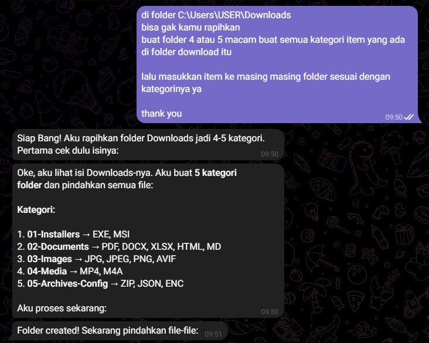

# 💡 Use Cases - Contoh Penggunaan

Kumpulan contoh penggunaan OpenClaw dari komunitas Sumopod.

---

## 🖥️ Windows PC Organizer

**Use Case:** Auto-organize file Downloads di Windows by category

### Overview

Bosan dengan folder Downloads yang berantakan? OpenClaw bisa bantu rapikan otomatis! 

Bot akan:
1. **Scan** isi folder Downloads
2. **Buat kategori folder** (Installers, Documents, Images, Media, Archives)
3. **Pindahkan file** ke folder sesuai tipe file-nya



### Kategori Folder

| Folder | File Types |
|--------|------------|
| **01-Installers** | EXE, MSI (installer apps) |
| **02-Documents** | PDF, DOCX, XLSX, HTML, MD |
| **03-Images** | JPG, JPEG, PNG, AVIF |
| **04-Media** | MP4, M4A (video/audio) |
| **05-Archives-Config** | ZIP, JSON, ENC |

### Cara Pakai

**Via Telegram/Chat:**
```
Di folder C:\Users\[USERNAME]\Downloads
Bisa gak kamu rapikan? Buat folder 4-5 macam untuk semua kategori item yang ada di folder download itu
Lalu masukkan item ke masing-masing folder sesuai dengan kategorinya
```

**OpenClaw akan:**
1. Cek isi Downloads
2. Buat 5 folder kategori
3. Pindahkan semua file otomatis

### Setup di Windows

1. **Install OpenClaw di Windows:**
   ```powershell
   npm install -g openclaw@latest
   ```

2. **Start Gateway:**
   ```powershell
   openclaw gateway start
   ```

3. **Connect Telegram Bot** (optional tapi recommended)
   - Bikin bot di @BotFather
   - Connect ke OpenClaw
   - Chat dari HP untuk kontrol PC

### Keuntungan

- ✅ Downloads folder selalu rapi
- ✅ Cari file lebih gampang
- ✅ Bisa jalanin dari HP (via Telegram)
- ✅ Bisa schedule otomatis (mingguan/bulanan)

---

## 🎬 AI Video Generation & Editing

**Use Case:** Generate dan edit video menggunakan AI — low cost, optimized, practical!

### Overview

Buat video AI dengan harga murah (mulai dari FREE) dan edit menggunakan FFmpeg (GRATIS). Cocok untuk:
- Social media content (Instagram Reels, TikTok)
- Product showcase
- Meme videos
- Auto-subtitle untuk podcast/video

### 💰 Cost Comparison

| Workflow | Cost/5s | Kualitas |
|----------|---------|----------|
| **Image-to-Video (Kling)** | ~$0.015 | ⭐⭐⭐⭐ |
| **Text-to-Video (Kling)** | ~$0.02 | ⭐⭐⭐⭐ |
| **Hedra (FREE)** | $0 | ⭐⭐⭐ |
| **Runway** | ~$0.10 | ⭐⭐⭐⭐⭐ |
| **FFmpeg Editing** | FREE | N/A |

### 🛠️ APIs yang Dibutuhkan

**Tier 1 (FREE/Ultra Low Cost):**
- **Hedra** — Image-to-Video, FREE unlimited (watermark)
- **Viggle** — Character animation, FREE
- **FFmpeg** — Video editing, FREE local

**Tier 2 (Best Value):**
- **Kling AI** — ~$0.02/video, realistic motion ⭐ Recommended
- **Luma Dream Machine** — ~$0.05/video, fast generation

### 🚀 Quick Start

```bash
# 1. Install FFmpeg (REQUIRED)
sudo apt install ffmpeg

# 2. Get API Key (Kling - cheapest)
# Signup: https://klingai.com

# 3. Generate video from text
video-generate "sunset over Bali beach" --duration 5 --provider kling

# 4. Edit video (FREE)
video-edit output.mp4 compress final.mp4
```

### 📁 Resources

- [Tutorial Lengkap](./ai-video-generation.md)
- Sample scripts: `skills/video-generate/`, `skills/video-edit/`
- API signup links included

---

**By:** @fanani-radian  
**Use Case:** Track harga emas dengan multiple fallback methods

### Overview
Sistem cek harga emas yang robust dengan **4-layer fallback**. Kalau satu method gagal, otomatis pindah ke method berikutnya:

```
Priority 1: Scrapling (LogamMulia.com) ✅ Most reliable
Priority 2: Python (HargaEmas.com)
Priority 3: Curl (direct fetch)
Priority 4: Smart-search (fallback)
Priority 5: Playwright (last resort)
```

**Why multiple methods?**
- LogamMulia.com punya Cloudflare protection → perlu Scrapling
- HargaEmas.com bisa di-fetch biasa → Python/curl
- Kalau semua gagal → Smart-search sebagai backup

### Tools Used
- **Scrapling** - Bypass Cloudflare Turnstile
- **Python + BeautifulSoup** - HTML parsing
- **Curl** - Direct HTTP fetch
- **Smart-search skill** - Multi-provider search fallback
- **Redis** - Caching (5 min TTL)

### Key Script
```python
# scripts/fetch-gold-scrapling.py
from scrapling import StealthyFetcher

fetcher = StealthyFetcher()
page = fetcher.get('https://www.logammulia.com/id/harga-emas-hari-ini')
price = page.css('td:contains("1 gr")').text
```

```bash
# scripts/quick-gold.sh - Full fallback chain
fetch_scrapling() || fetch_python() || fetch_curl() || fetch_smartsearch() || fetch_playwright()
```

### Cron Schedule
```bash
# Check 4x daily (WITA)
0 7 * * *   /scripts/gold-price-monitor.sh   # 07:00 - Morning
0 8 * * *   /scripts/gold-price-monitor.sh   # 08:00 - Update
10 10 * * * /scripts/gold-price-monitor.sh   # 10:10 - Midday
0 18 * * *  /scripts/gold-price-monitor.sh   # 18:00 - Evening
```

### Output Format
```
📊 ANTAM GOLD PRICE - 02 Mar 2026
💰 IDR 3.135.000/gram
🟢 UP +IDR 50.000 (+1.62%)
🏦 Pegadaian: IDR 3.092.000/gr
📍 Source: LogamMulia.com (Scrapling)
```

### Files
- [fetch-gold-scrapling.py](./examples/gold-monitor/)
- [fetch-gold-python.py](./examples/gold-monitor/)
- [quick-gold.sh](./examples/gold-monitor/)

---

## 🔍 Smart Search Multi-Provider

**By:** @fanani-radian  
**Use Case:** Web search dengan auto-fallback antar provider

### Overview
Skill `smart-search` yang intelligently memilih provider berdasarkan availability dan rate limits. Kalau satu provider fail/down, otomatis switch ke provider lain.

```
Provider Priority:
1. Serper API (Google Search)    - Fastest, most accurate
2. Kimi Web Search               - Good fallback
3. GLM Web Search                - Alternative
4. Perplexity API                - Deep search
5. Tavily API                    - Research-focused
```

### Why Multi-Provider?
| Provider | Strengths | Use Case |
|----------|-----------|----------|
| **Serper** | Real-time Google results | News, current events |
| **Kimi** | Chinese + English sources | Asia-focused queries |
| **Perplexity** | Deep research, citations | Complex questions |
| **Tavily** | AI-optimized extraction | Research tasks |

### Key Config
```yaml
# skills/smart-search/config/providers.yaml
providers:
  serper:
    api_key: ${SERPER_API_KEY}
    priority: 1
    rate_limit: 100/day
    
  kimi:
    api_key: ${MOONSHOT_API_KEY}
    priority: 2
    rate_limit: 1000/day
    
  perplexity:
    api_key: ${PERPLEXITY_API_KEY}
    priority: 3
    rate_limit: 150/day
    
  tavily:
    api_key: ${TAVILY_API_KEY}
    priority: 4
    rate_limit: 1000/month

fallback_chain:
  - serper
  - kimi
  - glm
  - perplexity
  - tavily
```

### Usage
```bash
# Simple search
bash skills/smart-search/scripts/search.sh "harga emas hari ini"

# With provider preference
bash skills/smart-search/scripts/search.sh "berita terkini" --provider serper

# JSON output
bash skills/smart-search/scripts/search.sh "query" --json
```

### Response Format
```json
{
  "query": "harga emas hari ini",
  "provider": "serper",
  "results": [
    {
      "title": "Harga Emas Hari Ini",
      "url": "https://hargaemas.com",
      "snippet": "Harga emas Antam hari ini Rp 3.135.000/gram"
    }
  ],
  "fallback_used": false,
  "latency_ms": 850
}
```

### Cost Optimization
```yaml
# config/smart-search-budget.yaml
tier_1: [serper, kimi]        # Cheap, fast
  max_cost_per_query: $0.001

tier_2: [perplexity]          # Medium cost  
  max_cost_per_query: $0.005
  use_for: [complex_queries]

tier_3: [tavily]              # Higher cost
  max_cost_per_query: $0.01
  use_for: [research_tasks]
```

### Files
- [smart-search.sh](./examples/smart-search/)
- [provider-manager.py](./examples/smart-search/)
- [rate-limiter.js](./examples/smart-search/)

---

## 📧 Email Automation

**By:** @fanani-radian  
**Use Case:** Auto-process email masuk, classify, dan buat tasks

### Overview
Agent membaca Gmail setiap 5 menit, classify email (invoice, support, general), dan otomatis:
- Forward invoice ke finance
- Extract data ke Google Sheets
- Buat tasks di Google Tasks
- Draft reply dengan ghostwriter persona

### Tools Used
- Gmail (read/send)
- Google Drive
- Google Sheets
- Google Tasks

### Key Config
```yaml
# config/email-automation.yaml
scan_interval: 5m
classifiers:
  - invoice: ["invoice", "tagihan", "payment"]
  - support: ["help", "issue", "error"]
  - general: ["default"]
actions:
  invoice:
    - forward_to: finance@company.com
    - extract_to_sheets: true
    - upload_to_drive: true
```

### Files
- [email-processor.js](./examples/email-automation/)
- [invoice-extractor.py](./examples/email-automation/)

---

## 🔒 Security Monitoring

**By:** @fanani-radian  
**Use Case:** 24/7 server monitoring

### Overview
- Brute force detection (SSH failed logins)
- SSL certificate expiry check
- Service health monitoring (auto-restart if down)
- SSH login monitoring (alert new IPs)

### Tools Used
- fail2ban
- UFW firewall
- Systemd service checks
- Telegram alerts

### Key Scripts
```bash
# cron jobs
*/15 * * * * /scripts/brute-force-monitor.sh
*/5 * * * *  /scripts/service-health-check.sh
* * * * *    /scripts/ssh-login-monitor.sh
```

---

## 🤖 Multi-Agent Coordination

**Use Case:** Multiple agents dengan spesialisasi berbeda

### Overview
| Agent | Role | Tasks |
|-------|------|-------|
| **Main** | Orchestrator | General, coordination |
| **Creative** | Creative | Content, marketing, copywriting |
| **Analytical** | Analytical | Data analysis, research |
| **Technical** | Technical | Coding, infrastructure |

### Routing Logic
```yaml
# config/multi-agent-routing.yaml
routes:
  creative: ["content", "marketing", "social media", "copy"]
  analytical: ["data", "research", "report", "analysis"]
  technical: ["code", "deploy", "server", "bug"]
  default: "main"
```

---

## 🇮🇩 Indonesian Daily Life Use Cases

Use case yang relevan untuk kehidupan sehari-hari di Indonesia.

---

### 🌤️ Cuaca BMKG & Gempa Alert

**Use Case:** Pantau cuaca dan gempa real-time untuk lokasi proyek/lokasi tinggal

**Overview:**
- Fetch data cuaca dari BMKG API
- Alert gempa magnitude >5.0 di wilayah terdekat
- Notifikasi hujan deras, banjir, atau cuaca ekstrem

**Tools:**
- BMKG API (bmkg.go.id)
- Telegram Bot (notifikasi)
- Cron (check setiap 30 menit)

**Key Script:**
```bash
# Check cuaca dan gempa
python3 bmkg-monitor.py --locations "Jakarta,Bandung,Surabaya"
```

**Output:**
```
🌤️ Cuaca Jakarta: 32°C, Berawan
🌡️ Feels like: 36°C
🌧️ Hujan: 20% chance (15:00-17:00)

⚠️ Gempa terkini:
📍 Laut 50km barat Sumatera
📊 M4.2 - Tidak berpotensi tsunami
🕐 10 menit yang lalu
```

---

### 📱 Cek Pulsa & Kuota Otomatis

**Use Case:** Monitor pulsa dan kuota internet dari provider (Telkomsel, XL, Indosat)

**Overview:**
- Auto-refresh USSD/mySMS untuk cek pulsa
- Alert kalau pulsa < Rp 10.000
- Alert kalau kuota < 1GB
- Auto-buy paket kalau habis (via API provider)

**Tools:**
- Provider API (Telkomsel, XL, Indosat)
- SMS Gateway (Twilio/ local)
- Telegram notifications

**Key Config:**
```yaml
# config/pulsa-monitor.yaml
providers:
  telkomsel:
    api_key: ${TELKOMSEL_API_KEY}
    phone: "0812xxxxxxxxx"
    alert_threshold:
      pulsa: 10000  # Rp
      kuota: 1024   # MB
```

---

### 🏦 Cek Saldo Rekening Multi-Bank

**Use Case:** Aggregate saldo dari beberapa bank (BCA, BNI, Mandiri, etc)

**Overview:**
- Connect ke API/ scraping e-banking
- Daily summary total saldo
- Alert untuk transaksi masuk/keluar besar
- Track cash flow bulanan otomatis

**Tools:**
- Bank API (jika tersedia)
- Playwright scraping (e-banking)
- Google Sheets (log transaksi)

**Output:**
```
💰 Ringkasan Saldo - 02 Mar 2026

🏦 BCA     : Rp 12.450.000
🏦 BNI     : Rp  8.320.000  
🏦 Mandiri : Rp  5.100.000
━━━━━━━━━━━━━━━
💵 Total   : Rp 25.870.000

🔄 Transaksi hari ini:
➖ Rp 150.000 - Transfer ke BCA
➕ Rp 500.000 - Gaji masuk
```

---

### 🛒 Harga BBM & Indomaret/Alfamat Tracker

**Use Case:** Track harga BBM Pertamina dan promo Indomaret/Alfamart

**Overview:**
- Scrape harga BBM dari Pertamina website
- Track promo diskon Indomaret/Alfamart
- Alert untuk promo beras, minyak goreng, dll
- Compare harga antar minimarket

**Tools:**
- Web scraping (BeautifulSoup)
- Image OCR (untuk promo banner)
- Telegram channel broadcast

---

### 🎫 Tiket Kereta & Pesawat Price Alert

**Use Case:** Pantau harga tiket KAI/Traveloka untuk liburan

**Overview:**
- Monitor harga tiket KAI (kereta api)
- Track harga pesawat dari Traveloka/Tiket.com
- Alert kalau harga turun di bawah threshold
- Compare harga antar tanggal

**Tools:**
- KAI Access API
- Traveloka/Tiket.com scraping
- Cron check 2x sehari

**Key Script:**
```bash
# Cek harga Jakarta-Surabaya
python3 ticket-monitor.py \
  --route "JKTA-SBY" \
  --date "2026-03-15" \
  --alert-below 500000
```

---

### 📦 Tracking Paket JNE/J&T/SiCepat

**Use Case:** Auto-track paket dari marketplace (Tokopedia, Shopee, Lazada)

**Overview:**
- Input resi otomatis dari email notifikasi marketplace
- Track status paket via API ekspedisi
- Alert status perubahan (dikirim, transit, sampai)
- Forward ke WhatsApp/Telegram

**Tools:**
- JNE API, J&T API, SiCepat API
- Gmail API (auto-extract resi)
- WhatsApp/Telegram Bot

**Output:**
```
📦 Update Paket

Resi: JNE1234567890
Toko: Tokopedia - Elektronik Shop
Status: 🚚 Dalam Perjalanan
📍 Lokasi: Jakarta Hub
⏰ Estimasi: 1-2 hari lagi
```

---

### 🍽️ Menu Kantin/Restoran Harian

**Use Case:** Bot yang ngasih tau menu kantin/restoran favorit hari ini

**Overview:**
- Scrape menu dari Instagram kantin/restoran
- Daily menu broadcast ke group WhatsApp/Telegram
- Vote makan siang bersama tim
- Alert kalau ada menu favorit

**Tools:**
- Instagram scraping
- Telegram Bot
- Voting system (poll)

---

### 📺 Jadwal Bioskop XXI/CGV

**Use Case:** Pantau jadwal film baru dan harga tiket bioskop

**Overview:**
- Scrape jadwal dari XXI/CGV website
- Track film baru release
- Compare harga antar lokasi bioskop
- Alert untuk early bird promo

**Tools:**
- Web scraping (XXI/CGV)
- Telegram notifications
- Google Calendar integration (reminder nonton)

---

### ⚽ Jadwal Liga Inggris & Livescore

**Use Case:** Notifikasi jadwal pertandingan bola favorit (Arsenal, MU, Liverpool)

**Overview:**
- Fetch jadwal dari football-data.org API
- Notifikasi H-24 jam sebelum match
- Livescore update saat match berlangsung
- Goal alert untuk tim favorit

**Tools:**
- football-data.org API
- Telegram Bot
- Cron (check setiap jam)

**Output:**
```
⚽ Match Day!

Arsenal vs Manchester United
🏟️ Emirates Stadium
🕐 22:30 WIB
📺 Streaming: Mola TV

Prediksi: Arsenal 60% - MU 40%
```

---

### 💡 Token PLN & Tagihan Listrik

**Use Case:** Monitor tagihan listrik dan beli token otomatis

**Overview:**
- Cek tagihan listrik PLN bulanan
- Alert sebelum jatuh tempo
- Auto-buy token listrik kalau habis
- Track penggunaan kWh harian

**Tools:**
- PLN API (atau scraping)
- Payment gateway (Midtrans, etc)
- Telegram notifications

---

## 🏢 Private/Company Use Cases

> 📝 **Note:** Use cases berikut bersifat private/company-specific dan **TIDAK** ada di repo public.
> Contoh: Attendance Report, Custom ERP Integration, dll.

---

## Share Your Use Case!

Punya use case menarik? [Tambahkan ke repo ini](../../issues/new?template=use-case.md) dengan format:

```markdown
## [Nama Use Case]
**By:** @username
**Use Case:** [Deskripsi singkat]

### Overview
[Penjelasan detail]

### Tools Used
- [tool1]
- [tool2]

### Key Config
[config atau code snippet]

### Files
- [link ke script/config]
```

---

*Last updated: March 2026*
