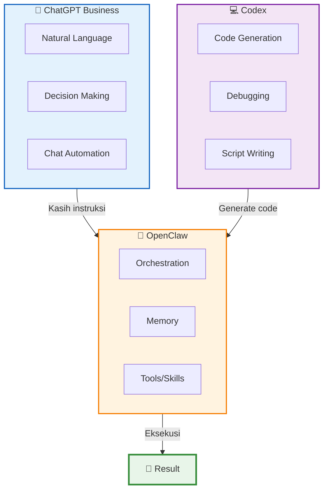
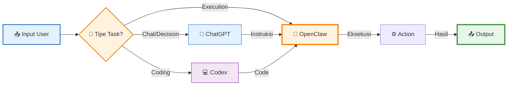
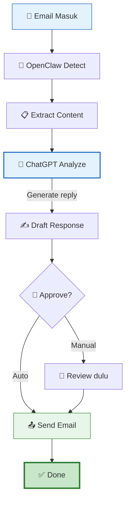
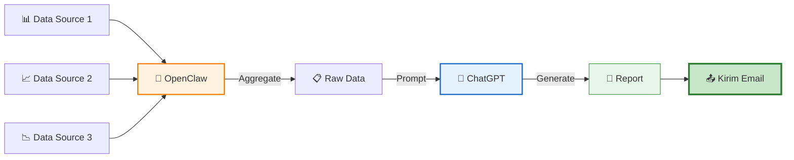
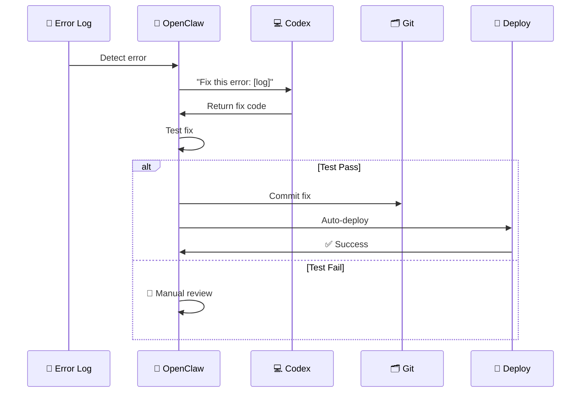
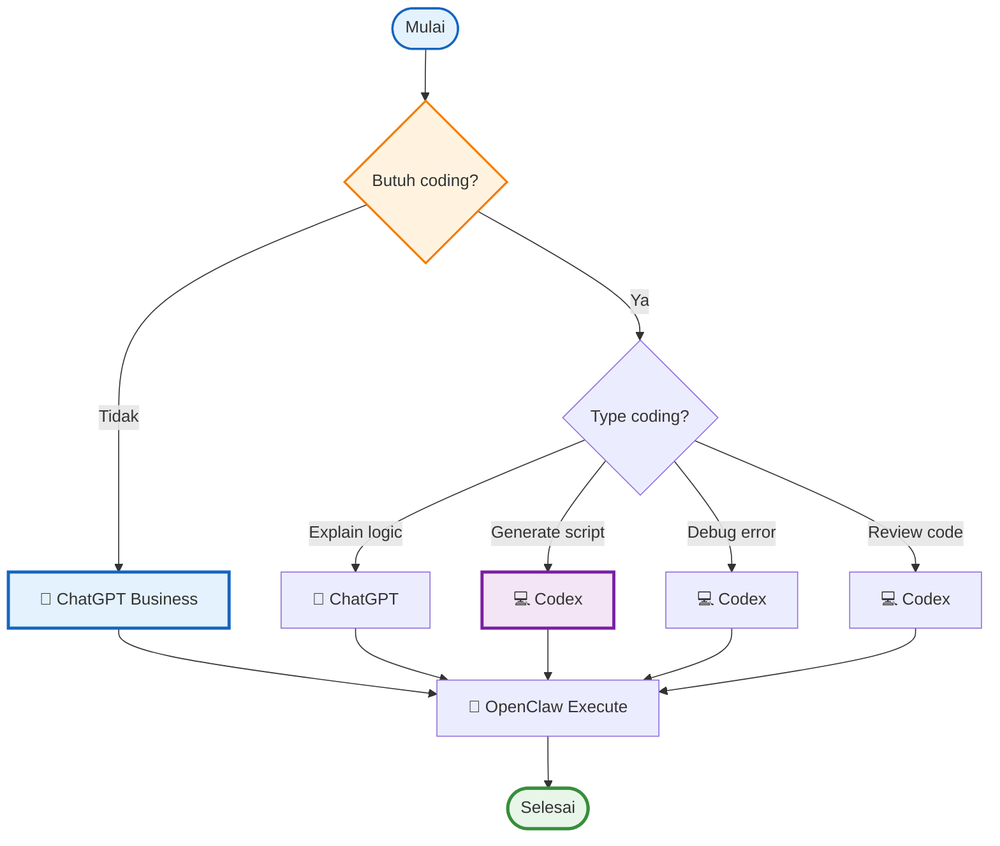

# 🤖 ChatGPT Business + Codex untuk OpenClaw

Panduan lengkap integrasi ChatGPT Business dan Codex dengan OpenClaw — bahasa Indonesia, simpel, banyak diagram!

---

## 📋 Metadata

- **Level**: 🟡 Menengah  
- **Waktu**: 30-45 menit  
- **Perlu tahu**: Python dasar, API basics  
- **Tools**: ChatGPT Business, OpenClaw, Terminal

---

## 🎯 Apa yang Bakal Kamu Buat?

Kamu bakal punya **AI agent tambahan** yang kerja sama sama OpenClaw:
- ChatGPT Business → buat otomasi chat & decision making
- Codex → buat coding, debugging, generate scripts

**Hasil akhir**: Sistem yang bisa auto-reply email, generate code, fix bug, dll — semua terintegrasi dengan OpenClaw!

---

## 🏢 ChatGPT Business vs Codex: Bedanya Apa?

### 1️⃣ Gambaran Perbandingan



### 2️⃣ Detail Perbedaan

| Fitur | ChatGPT Business | Codex |
|-------|------------------|-------|
| **Cocok untuk** | Chat, decision, creative tasks | Coding, debugging, scripts |
| **Input** | Natural language | Code + comments |
| **Output** | Text, decisions | Working code |
| **Harga** | $20-25/bulan | Usage-based ($0.03/1K tokens) |
| **Integrasi** | API + Webhooks | API only |

---

## 🔗 Cara Kerja Integrasi

### 3️⃣ Alur Data



---

## ⚙️ Setup Step-by-Step

### Step 1: Dapetin API Key 🔑

**ChatGPT Business:**
1. Login ke https://chat.openai.com
2. Pilih "ChatGPT Business" plan
3. Ke Settings → API Keys
4. Copy API key-nya

**Codex:**
1. Masuk ke OpenAI Platform: https://platform.openai.com
2. Ke API Keys → Create new secret key
3. Simpan key-nya (cuma muncul sekali!)

### Step 2: Simpan API Key di OpenClaw 📝

```bash
# Tambahin ke .env file
cat >> ~/.openclaw/.env << 'EOF'
OPENAI_API_KEY="sk-your-chatgpt-key"
CODEX_API_KEY="sk-your-codex-key"
EOF

# Reload environment
source ~/.openclaw/.env
```

### Step 3: Buat Skill Wrapper 🛠️

```bash
# Buat folder skill
mkdir -p ~/.openclaw/workspace/skills/chatgpt-codex/scripts

# Buat script wrapper
cat > ~/.openclaw/workspace/skills/chatgpt-codex/scripts/call-api.sh << 'SCRIPT'
#!/bin/bash
# call-api.sh - Wrapper buat panggil ChatGPT/Codex

API_KEY="${OPENAI_API_KEY}"
PROMPT="$1"
MODEL="${2:-gpt-4}"  # default: gpt-4

curl -s https://api.openai.com/v1/chat/completions \\
  -H "Authorization: Bearer $API_KEY" \\
  -H "Content-Type: application/json" \\
  -d "{
    \"model\": \"$MODEL\",
    \"messages\": [{\"role\": \"user\", \"content\": \"$PROMPT\"}]
  }" | jq -r '.choices[0].message.content'
SCRIPT

chmod +x ~/.openclaw/workspace/skills/chatgpt-codex/scripts/call-api.sh
```

### Step 4: Test Integration ✅

```bash
# Test ChatGPT
bash ~/.openclaw/workspace/skills/chatgpt-codex/scripts/call-api.sh \
  "Hello, apa kabar?"

# Test Codex (generate code)
bash ~/.openclaw/workspace/skills/chatgpt-codex/scripts/call-api.sh \
  "Buatkan script bash untuk backup folder" \
  "gpt-4"
```

### Step 5: Integrasi ke OpenClaw 🤝

Tambahin ke `SOUL.md` atau `USER.md`:

```markdown
## ChatGPT/Codex Integration

Buat panggil ChatGPT atau Codex, pakai:
```
bash skills/chatgpt-codex/scripts/call-api.sh "prompt"
```

Contoh penggunaan:
- "Generate script untuk fetch email"
- "Explain error log ini"
- "Buatkan regex untuk pattern X"
```

---

## 💡 3 Use Case Examples

### Use Case 1: Auto-Reply Email Customer 📧

**Skenario**: Email masuk → ChatGPT analyze → Auto-reply



**Script:**
```bash
#!/bin/bash
# auto-reply.sh

EMAIL_CONTENT="$1"

# ChatGPT generate reply
REPLY=$(bash skills/chatgpt-codex/scripts/call-api.sh \
  "Generate professional reply for: $EMAIL_CONTENT")

# Send email (via gog or sendemail)
echo "$REPLY" | gog gmail send \
  --to="customer@example.com" \
  --subject="Re: Your Inquiry" \
  --body="$REPLY"
```

### Use Case 2: Daily Report Generation 📊

**Skenario**: Data dari beberapa source → Codex analyze → Generate report



**Script:**
```bash
#!/bin/bash
# daily-report.sh

# Ambil data dari berbagai source
DATA=$(collect-data.sh)

# ChatGPT generate report
REPORT=$(bash skills/chatgpt-codex/scripts/call-api.sh \
  "Generate daily report from this data: $DATA")

# Save dan kirim
echo "$REPORT" > report-$(date +%Y%m%d).txt
gog gmail send --to="boss@company.com" --subject="Daily Report" --body="$REPORT"
```

### Use Case 3: Auto-Fix Bug dari Log 🐛

**Skenario**: Error log → Codex analyze → Generate fix → Test → Deploy



**Script:**
```bash
#!/bin/bash
# auto-fix.sh

LOG_FILE="$1"

# Codex analyze dan generate fix
FIX=$(bash skills/chatgpt-codex/scripts/call-api.sh \
  "Fix this error: $(cat $LOG_FILE)")

# Apply fix
echo "$FIX" > fix.patch
git apply fix.patch

# Test
if bash test.sh; then
    git add .
    git commit -m "auto: Fix bug via Codex"
    git push
    echo "✅ Auto-fix deployed!"
else
    echo "❌ Test failed, perlu manual review"
fi
```

---

## 🎯 Decision Tree: Kapan Pake Apa?



---

## 🔧 Troubleshooting

| Masalah | Kenapa? | Solusi |
|---------|---------|--------|
| ❌ API key invalid | Salah copy atau expired | Generate ulang di dashboard OpenAI |
| ❌ Rate limit | Terlalu banyak request | Tambahin delay atau upgrade plan |
| ❌ Timeout | Response lama | Coba model yang lebih cepat (gpt-3.5-turbo) |
| ❌ Output aneh | Prompt kurang jelas | Buat prompt lebih spesifik |
| ❌ Integration fail | Path salah | Cek path script wrapper |

---

## 💰 Estimasi Biaya

| Usage | ChatGPT Business | Codex | Total |
|-------|------------------|-------|-------|
| **Light** (100 requests/hari) | $20/bulan | ~$5 | **$25/bulan** |
| **Medium** (500 requests/hari) | $20/bulan | ~$20 | **$40/bulan** |
| **Heavy** (2000 requests/hari) | $20/bulan | ~$80 | **$100/bulan** |

---

## 🚀 Next Steps

- [ ] Setup API keys dulu
- [ ] Test basic integration
- [ ] Pilih use case yang paling urgent
- [ ] Implementasi pelan-pelan
- [ ] Monitor usage & cost

---

## 📚 Referensi

- [OpenAI API Docs](https://platform.openai.com/docs)
- [OpenClaw Documentation](https://github.com/openclaw/openclaw)
- [ChatGPT Business](https://openai.com/chatgpt/business)
- [Codex Guide](https://platform.openai.com/docs/guides/code)

---

*Dibuat dengan ❤️ untuk komunitas OpenClaw Sumopod*  
*Last updated: March 15, 2026*