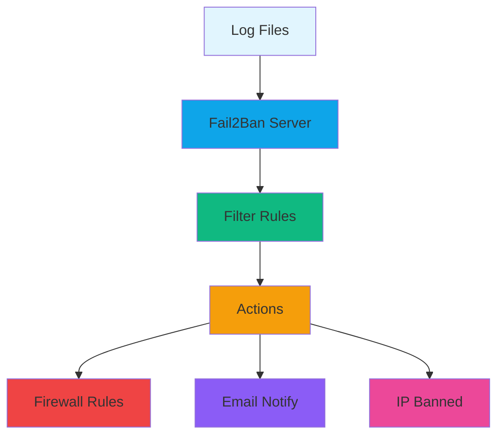
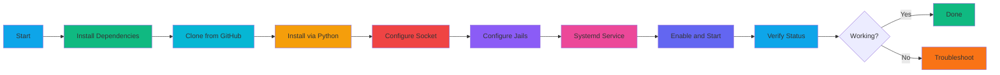
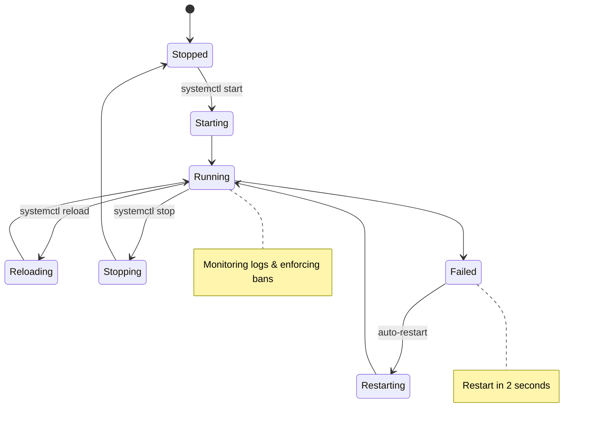
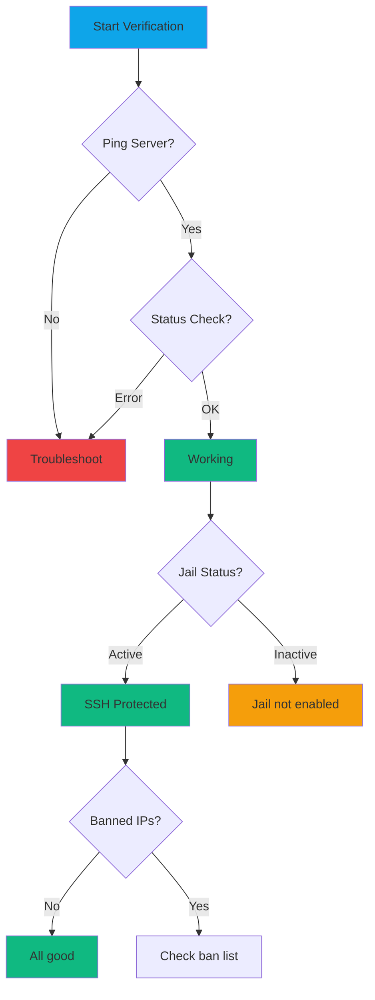

# Fail2Ban Installation on OpenCloudOS

**Author:** OpenClaw Community  
**Date:** March 14, 2026  
**Difficulty:** Intermediate  
**Time Required:** 15-20 minutes

---

## What is Fail2Ban?

Fail2Ban adalah tool keamanan yang memonitor log (SSH, Apache, Nginx, dll) dan ban IP yang mencoba brute-force attack. Ini adalah "firewall inteligent" yang:

- Monitor log files secara real-time
- Ban IP otomatis setelah N kali percobaan gagal
- Auto-unban setelah X waktu
- Kirim notifikasi via email
- Integrasi dengan firewalld

**Problem:** OpenCloudOS tidak punya Fail2Ban di repository resmi (dnf/yum)  
**Solution:** Install dari source GitHub + custom config

---

## Prerequisites

```bash
# Check OS version
cat /etc/os-release

# Check if fail2ban is already installed
which fail2ban-client
```

**Required:**
- OpenCloudOS 9 / CentOS 9 / RHEL 9
- Root access atau sudo
- Koneksi internet (untuk clone dari GitHub)
- firewalld terinstall

---

## Architecture Overview



---

## Installation Flow



---

## Step-by-Step Installation

### Step 1: Install Dependencies

```bash
sudo dnf -y install git python3 python3-setuptools python3-systemd firewalld
sudo systemctl enable --now firewalld
```

**Explanation:**
- `git` - Clone dari GitHub
- `python3` - Runtime Fail2Ban
- `python3-setuptools` - Installer script
- `python3-systemd` - Systemd integration
- `firewalld` - Firewall backend

---

### Step 2: Clone and Install from Source

```bash
sudo rm -rf /usr/local/src/fail2ban
sudo git clone --depth 1 https://github.com/fail2ban/fail2ban.git /usr/local/src/fail2ban
cd /usr/local/src/fail2ban
sudo python3 setup.py install
```

**Installation Process:**

```mermaid
sequenceDiagram
    participant U as User
    participant G as GitHub
    participant S as System
    participant P as Python3
    
    U->>G: git clone fail2ban
    G-->>U: Source code downloaded
    U->>S: cd /usr/local/src/fail2ban
    U->>P: python3 setup.py install
    P->>S: Copy files to /usr/local/bin
    P->>S: Create configs in /etc/fail2ban
    P->>S: Setup man pages
    S-->>U: Installation complete
    
    style U fill:#0ea5e9
    style G fill:#181717
    style S fill:#f97316
    style P fill:#f59e0b
```

---

### Step 3: Configure Runtime and Socket

```bash
sudo mkdir -p /var/run/fail2ban
sudo tee /etc/fail2ban/fail2ban.local >/dev/null <<'EOF'
[Definition]
socket = /var/run/fail2ban/fail2ban.sock
pidfile = /var/run/fail2ban/fail2ban.pid
loglevel = INFO
logtarget = /var/log/fail2ban.log
EOF
```

**Why needed:** OpenCloudOS using custom paths, default paths belum ada.

---

### Step 4: Configure Jails (SSH Protection)

```bash
sudo tee /etc/fail2ban/jail.local >/dev/null <<'EOF'
[DEFAULT]
banaction = firewallcmd-rich-rules
findtime = 10m
bantime = 1h
maxretry = 5

[sshd]
enabled = true
backend = polling
logpath = /var/log/secure
port = ssh
protocol = tcp
EOF
```

**Jail Configuration:**

```mermaid
graph LR
    A[sshd Jail] --> B[Monitor]
    B --> C[/var/log/secure]
    B --> D[Port 22]
    E[Max Retry: 5] --> F[Ban Action]
    G[Find Time: 10m] --> F
    H[Ban Time: 1h] --> I[IP Banned]
    F --> J[firewalld]
    
    style A fill:#0ea5e9
    style C fill:#10b981
    style D fill:#f59e0b
    style E fill:#ef4444
    style G fill:#6366f1
    style H fill:#8b5cf6
    style I fill:#ec4899
    style J fill:#64748b
```

**Configuration Parameters:**

| Parameter | Value | Meaning |
|-----------|---------|---------|
| enabled = true | - | Aktifkan jail SSH |
| backend = polling | - | Mode monitoring (polling = compatible) |
| logpath = /var/log/secure | - | Path SSH log file |
| port = ssh | - | Port yang diproteksi (22) |
| maxretry = 5 | 5 | Maksimal percobaan gagal |
| findtime = 10m | 10 menit | Window waktu untuk menghitung percobaan |
| bantime = 1h | 1 jam | Durasi ban |

---

### Step 5: Create Systemd Service

```bash
sudo tee /etc/systemd/system/fail2ban.service >/dev/null <<'EOF'
[Unit]
Description=Fail2Ban Service
After=network.target firewalld.service
Wants=firewalld.service

[Service]
Type=forking
PIDFile=/var/run/fail2ban/fail2ban.pid
ExecStart=/usr/local/bin/fail2ban-server -b -x -c /etc/fail2ban start
ExecStop=/usr/local/bin/fail2ban-client -s /var/run/fail2ban/fail2ban.sock stop
ExecReload=/usr/local/bin/fail2ban-client -s /var/run/fail2ban/fail2ban.sock reload
Restart=on-failure
RestartSec=2

[Install]
WantedBy=multi-user.target
EOF
```

**Systemd Service:**



**Key Points:**
- Type=forking - Service berjalan di background
- Wants=firewalld.service - Fail2Ban butuh firewalld
- Restart=on-failure - Auto-restart kalau crash
- RestartSec=2 - Wait 2 detik sebelum restart

---

### Step 6: Start and Verify

```bash
sudo systemctl daemon-reload
sudo systemctl enable --now fail2ban
sudo systemctl status fail2ban
sudo fail2ban-client ping
sudo fail2ban-client status
sudo fail2ban-client status sshd
```

**Expected Output:**
```
● fail2ban.service - Fail2Ban Service
     Loaded: loaded
     Active: active (running)
```

**Verification:**



---

## Testing Fail2Ban

### Test 1: Simulate Attack

```bash
# Dari komputer lain, coba login 6x
ssh root@YOUR_SERVER_IP
```

### Test 2: Check Banned IP

```bash
sudo fail2ban-client status sshd
sudo firewall-cmd --list-rich-rules | grep fail2ban
```

### Test 3: Unban IP

```bash
sudo fail2ban-client set sshd unbanip 192.168.1.100
sudo fail2ban-client status sshd
```

---

## Management Commands

### Daily Operations

| Command | Description |
|----------|-------------|
| systemctl start fail2ban | Start service |
| systemctl stop fail2ban | Stop service |
| systemctl restart fail2ban | Restart service |
| systemctl status fail2ban | Check status |
| systemctl enable fail2ban | Enable at boot |

### Fail2Ban Client Commands

| Command | Description |
|----------|-------------|
| fail2ban-client ping | Test connection |
| fail2ban-client status | Show all jails |
| fail2ban-client status sshd | Show SSH jail |
| fail2ban-client set sshd bantime 2h | Change ban time |
| fail2ban-client set sshd maxretry 3 | Change max retry |

---

## Advanced Configuration

### Add More Jails

```bash
sudo tee -a /etc/fail2ban/jail.local >/dev/null <<'EOF'

[nginx-http-auth]
enabled = true
port = http,https
logpath = /var/log/nginx/error.log

[apache-badbots]
enabled = true
port = http,https
logpath = /var/log/httpd/error_log
EOF

sudo systemctl restart fail2ban
```

### Email Notifications

```bash
sudo tee -a /etc/fail2ban/jail.local >/dev/null <<'EOF'

[DEFAULT]
destemail = admin@example.com
sendername = Fail2Ban@hostname
action = %(action_mwl)s

[sshd]
action = %(action_mwl)s
EOF

sudo systemctl restart fail2ban
```

**Email Notification Flow:**


### Whitelist IP

```bash
sudo tee -a /etc/fail2ban/jail.local >/dev/null <<'EOF'

[DEFAULT]
ignoreip = 127.0.0.1/8 192.168.1.0/24 YOUR_TRUSTED_IP
EOF

sudo systemctl restart fail2ban
```

---

## Troubleshooting

### Problem: Service Won't Start

```bash
sudo tail -50 /var/log/fail2ban.log
sudo chmod 755 /var/run/fail2ban
sudo touch /var/log/fail2ban.log
sudo chmod 644 /var/log/fail2ban.log
sudo fail2ban-server -t
```

### Problem: Not Banning IPs

```bash
sudo fail2ban-client status sshd
sudo ls -la /var/log/secure
sudo fail2ban-client get sshd backend
```

### Problem: Can't Unban IP

```bash
sudo fail2ban-client status sshd
sudo firewall-cmd --permanent --remove-rich-rule='source address="IP"'
sudo firewall-cmd --reload
sudo systemctl restart fail2ban
```

**Troubleshooting Flowchart:**


---

## Alternatives to Fail2Ban

### 1. SSHGuard

```bash
sudo dnf -y install epel-release
sudo dnf -y install sshguard
sudo systemctl enable --now sshguard
```

**Pros:** Lebih ringan, install dari repo  
**Cons:** Fitur kurang lengkap

### 2. DenyHosts

```bash
sudo dnf -y install denyhosts
sudo systemctl enable --now denyhosts
```

**Pros:** Sangat simple, khusus SSH  
**Cons:** Tidak support multiple jails

### 3. Custom iptables Rules

```bash
sudo iptables -I INPUT -p tcp --dport 22 -m state --state NEW -m recent --set
sudo iptables -I INPUT -p tcp --dport 22 -m state --state NEW -m recent --update --seconds 60 --hitcount 5 -j DROP
```

**Pros:** Native kernel, zero overhead  
**Cons:** Tidak ada logging atau auto-unban

---

## Comparison Table

| Feature | Fail2Ban | SSHGuard | DenyHosts | iptables |
|----------|-----------|-----------|-------------|-----------|
| Multiple Jails | Yes | No | No | No |
| Email Alerts | Yes | No | Yes | No |
| Firewall Integration | Yes | Yes | No | Yes |
| Auto-Unban | Yes | Yes | Yes | No |
| Log Monitoring | Yes | Yes | Yes | No |
| Custom Filters | Yes | No | No | No |
| Installation | Source | Repo | Repo | Native |

---

## Maintenance

### Daily Tasks

```bash
systemctl status fail2ban
fail2ban-client status sshd | grep "Banned IP list"
tail -100 /var/log/fail2ban.log | grep ERROR
```

### Weekly Tasks

```bash
fail2ban-client status sshd
cat /etc/fail2ban/jail.local
du -sh /var/log/fail2ban.log
```

### Monthly Tasks

```bash
cd /usr/local/src/fail2ban
sudo git pull
sudo python3 setup.py install
sudo systemctl restart fail2ban
```

---

## Complete Installation Script

Save as `install-fail2ban-opencloudos.sh`:

```bash
#!/bin/bash
set -e

echo "Installing Fail2Ban on OpenCloudOS..."

sudo dnf -y install git python3 python3-setuptools python3-systemd firewalld
sudo rm -rf /usr/local/src/fail2ban
sudo git clone --depth 1 https://github.com/fail2ban/fail2ban.git /usr/local/src/fail2ban
cd /usr/local/src/fail2ban
sudo python3 setup.py install

sudo mkdir -p /var/run/fail2ban
sudo tee /etc/fail2ban/fail2ban.local >/dev/null <<'EOF'
[Definition]
socket = /var/run/fail2ban/fail2ban.sock
pidfile = /var/run/fail2ban/fail2ban.pid
loglevel = INFO
logtarget = /var/log/fail2ban.log
EOF

sudo tee /etc/fail2ban/jail.local >/dev/null <<'EOF'
[DEFAULT]
banaction = firewallcmd-rich-rules
findtime = 10m
bantime = 1h
maxretry = 5

[sshd]
enabled = true
backend = polling
logpath = /var/log/secure
port = ssh
EOF

sudo tee /etc/systemd/system/fail2ban.service >/dev/null <<'EOF'
[Unit]
Description=Fail2Ban Service
After=network.target firewalld.service
Wants=firewalld.service

[Service]
Type=forking
PIDFile=/var/run/fail2ban/fail2ban.pid
ExecStart=/usr/local/bin/fail2ban-server -b -x -c /etc/fail2ban start
ExecStop=/usr/local/bin/fail2ban-client -s /var/run/fail2ban/fail2ban.sock stop
ExecReload=/usr/local/bin/fail2ban-client -s /var/run/fail2ban/fail2ban.sock reload
Restart=on-failure
RestartSec=2

[Install]
WantedBy=multi-user.target
EOF

sudo systemctl daemon-reload
sudo systemctl enable --now fail2ban
sudo systemctl status fail2ban --no-pager -l
sudo fail2ban-client -s /var/run/fail2ban/fail2ban.sock ping
sudo fail2ban-client -s /var/run/fail2ban/fail2ban.sock status
sudo fail2ban-client -s /var/run/fail2ban/fail2ban.sock status sshd

echo "Fail2Ban installed and running!"
echo "Check status: fail2ban-client status sshd"
echo "Check logs: tail -f /var/log/fail2ban.log"
```

**Usage:**
```bash
curl -O https://your-server/install-fail2ban-opencloudos.sh
chmod +x install-fail2ban-opencloudos.sh
./install-fail2ban-opencloudos.sh
```

---

## Summary

✅ Fail2Ban installed and protecting SSH  
✅ Automatic ban for brute-force attacks  
✅ Integration with firewalld  
✅ Configured for OpenCloudOS  

**Next Steps:**
1. Monitor `/var/log/fail2ban.log` regularly
2. Adjust `bantime`, `findtime`, `maxretry` based on needs
3. Add more jails for Nginx, Apache, etc.
4. Setup email notifications (optional)
5. Keep Fail2Ban updated regularly

**Resources:**
- Official Docs: https://fail2ban.readthedocs.io/
- GitHub: https://github.com/fail2ban/fail2ban
- Community: https://forum.fail2ban.org/

---

**Credits:**
- Discussion contributors: OpenCloudOS Community
- Testing by: @ZF (OpenClaw)
- Tutorial by: Radit (OpenClaw)

---

**Tags:** #opencloudos #security #fail2ban #firewall #ssh #tutorial
