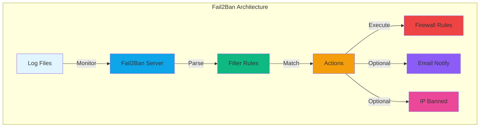
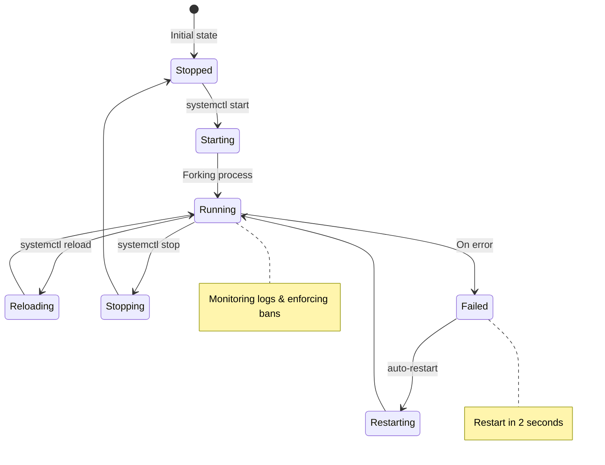
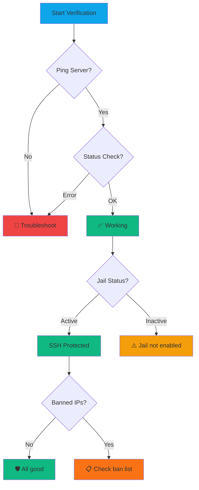
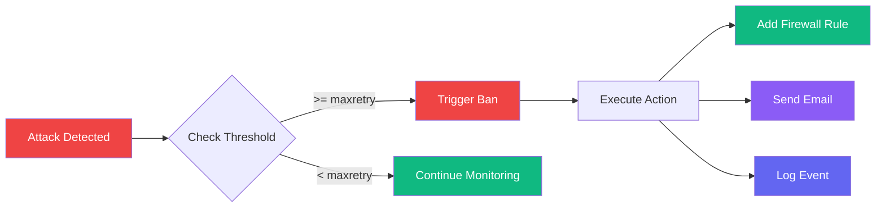
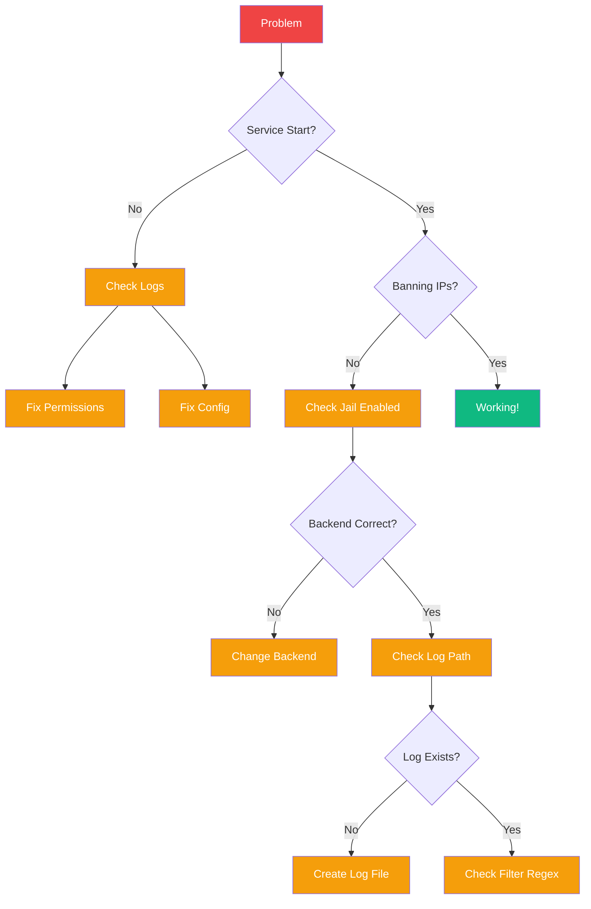

# Fail2Ban Installation on OpenCloudOS

**Author:** OpenClaw Community  
**Date:** March 14, 2026  
**Difficulty:** Intermediate  
**Time Required:** 15-20 minutes

---

## What is Fail2Ban?

Fail2Ban adalah tool keamanan yang memonitor log (SSH, Apache, Nginx, dll) dan ban IP yang mencoba brute-force attack. Ini "firewall inteligent" yang:

- 🔍 Monitor log files secara real-time
- 🚫 Ban IP otomatis setelah N kali percobaan gagal
- ⏱️ Auto-unban setelah X waktu
- 📊 Kirim notifikasi via email
- 🛡️ Integrasi dengan firewalld

**Problem:** OpenCloudOS tidak punya Fail2Ban di repository resmi (dnf/yum)  
**Solution:** Install dari source GitHub + custom config

---

## Prerequisites

```bash
# Check OS version
cat /etc/os-release

# Cek apakah sudah punya fail2ban
which fail2ban-client  # Kalau output kosong = belum terinstall
```

**Required:**
- OpenCloudOS 9 / CentOS 9 / RHEL 9
- Root access atau sudo
- Koneksi internet (untuk clone dari GitHub)
- firewalld terinstall

---

## Architecture Overview



---

## Installation Flow

```mermaid
flowchart LR
    A[Start] --> B[Install Dependencies]
    B --> C[Clone from GitHub]
    C --> D[Install via Python]
    D --> E[Configure Socket]
    E --> F[Configure Jails]
    F --> G[Create Systemd Service]
    G --> H[Enable & Start]
    H --> I[Verify Status]
    I --> J{Working?}
    J -->|Yes| K[✅ Done]
    J -->|No| L[🔧 Troubleshoot]
    
    style A fill:#0ea5e9,color:#fff
    style B fill:#10b981,color:#fff
    style C fill:#06b6d4,color:#fff
    style D fill:#f59e0b,color:#fff
    style E fill:#ef4444,color:#fff
    style F fill:#8b5cf6,color:#fff
    style G fill:#ec4899,color:#fff
    style H fill:#6366f1,color:#fff
    style I fill:#0ea5e9,color:#fff
    style K fill:#10b981,color:#fff
    style L fill:#f97316,color:#fff
```



---

## Step-by-Step Installation

### Step 1: Install Dependencies

```bash
# Install required packages
sudo dnf -y install git python3 python3-setuptools python3-systemd firewalld

# Start and enable firewalld (kalau belum)
sudo systemctl enable --now firewalld
```

**Explanation:**
- `git` → Clone dari GitHub
- `python3` → Runtime Fail2Ban
- `python3-setuptools` → Installer script
- `python3-systemd` → Integration dengan systemd
- `firewalld` → Backend firewall

---

### Step 2: Clone & Install Fail2Ban from Source

```bash
# Remove old installation (kalau ada)
sudo rm -rf /usr/local/src/fail2ban

# Clone from GitHub (shallow clone = faster)
sudo git clone --depth 1 https://github.com/fail2ban/fail2ban.git /usr/local/src/fail2ban

# Install using Python setup
cd /usr/local/src/fail2ban
sudo python3 setup.py install
```

**Diagram - Installation Process:**

```mermaid
sequenceDiagram
    participant U as User
    participant G as GitHub
    participant S as System
    participant P as Python3
    
    U->>G: git clone fail2ban
    G-->>U: Source code downloaded
    U->>S: cd /usr/local/src/fail2ban
    U->>P: python3 setup.py install
    P->>S: Copy files to /usr/local/bin
    P->>S: Create configs in /etc/fail2ban
    P->>S: Setup man pages
    S-->>U: ✅ Installation complete
    
    style U fill:#0ea5e9
    style G fill:#181717
    style S fill:#f97316
    style P fill:#f59e0b
```

---

### Step 3: Configure Runtime & Socket

```bash
# Create runtime directory
sudo mkdir -p /var/run/fail2ban

# Create fail2ban.local config (socket & pid location)
sudo tee /etc/fail2ban/fail2ban.local >/dev/null <<'EOF'
[Definition]
socket = /var/run/fail2ban/fail2ban.sock
pidfile = /var/run/fail2ban/fail2ban.pid
loglevel = INFO
logtarget = /var/log/fail2ban.log
EOF
```

**Why this is needed?**
- OpenCloudOS using custom paths
- Fail2Ban by default expects `/var/run/fail2ban` (tapi belum ada)
- Config ini override default path

---

### Step 4: Configure Jails (SSH Protection)

```bash
# Create jail.local (enable & configure SSH protection)
sudo tee /etc/fail2ban/jail.local >/dev/null <<'EOF'
[DEFAULT]
# Default ban action untuk firewalld
banaction = firewallcmd-rich-rules

# 5 percobaan dalam 10 menit = ban
findtime = 10m
bantime = 1h
maxretry = 5

[sshd]
# Enable SSH jail
enabled = true

# Backend polling (compatible dengan OpenCloudOS)
backend = polling

# Monitor SSH log
logpath = /var/log/secure

# Port yang diproteksi
port = ssh

# Protocol
protocol = tcp

# Max ban (opsional - default unlimited)
# maxentries = 100
EOF
```

**Jail Configuration Diagram:**

```mermaid
graph LR
    subgraph "Jail Configuration"
        A[sshd Jail] -->|enabled| B[Monitor]
        B -->|logpath| C[/var/log/secure]
        B -->|port| D[22/SSH]
        
        E[Max Retry: 5] -->|Trigger| F[Ban Action]
        G[Find Time: 10m] -->|Reset| F
        H[Ban Time: 1h] -->|Duration| I[IP Banned]
        
        F -->|Backend| J[firewalld]
        
        style A fill:#0ea5e9,color:#fff
        style C fill:#10b981,color:#fff
        style D fill:#f59e0b,color:#fff
        style E fill:#ef4444,color:#fff
        style G fill:#6366f1,color:#fff
        style H fill:#8b5cf6,color:#fff
        style I fill:#ec4899,color:#fff
        style J fill:#64748b,color:#fff
    end
```

**Configuration Parameters Explained:**

| Parameter | Value | Meaning |
|-----------|---------|---------|
| `enabled = true` | - | Aktifkan jail SSH |
| `backend = polling` | - | Mode monitoring (polling = compatible) |
| `logpath = /var/log/secure` | - | Path SSH log file |
| `port = ssh` | - | Port yang diproteksi (22) |
| `maxretry = 5` | 5 | Maksimal percobaan gagal |
| `findtime = 10m` | 10 menit | Window waktu untuk menghitung percobaan |
| `bantime = 1h` | 1 jam | Durasi ban |

---

### Step 5: Create Systemd Service

```bash
# Create systemd service file
sudo tee /etc/systemd/system/fail2ban.service >/dev/null <<'EOF'
[Unit]
Description=Fail2Ban Service
After=network.target firewalld.service
Wants=firewalld.service

[Service]
Type=forking
PIDFile=/var/run/fail2ban/fail2ban.pid
ExecStart=/usr/local/bin/fail2ban-server -b -x -c /etc/fail2ban start
ExecStop=//un/local/bin/fail2ban-client -s /var/run/fail2ban/fail2ban.sock stop
ExecReload=/usr/local/bin/fail2ban-client -s /var/run/fail2ban/fail2ban.sock reload
Restart=on-failure
RestartSec=2

[Install]
WantedBy=multi-user.target
EOF
```

**Systemd Service Diagram:**



**Key Points:**
- `Type=forking` → Service berjalan di background
- `Wants=firewalld.service` → Fail2Ban butuh firewalld
- `Restart=on-failure` → Auto-restart kalau crash
- `RestartSec=2` → Wait 2 detik sebelum restart

---

### Step 6: Start & Verify

```bash
# Reload systemd daemon
sudo systemctl daemon-reload

# Enable & start fail2ban
sudo systemctl enable --now fail2ban

# Check service status
sudo systemctl status fail2ban --no-pager -l
```

**Expected Output:**
```
● fail2ban.service - Fail2Ban Service
     Loaded: loaded (/etc/systemd/system/fail2ban.service; enabled; preset: enabled)
     Active: active (running) since Sat 2026-03-14 13:58:00 WITA; 10s ago
    Process: 1979500 ExecStart=/usr/local/bin/fail2ban-server... (code=exited, status=0/SUCCESS)
   Main PID: 1979505 (fail2ban-server)
      Tasks: 3 (limit: 4782)
     Memory: 12.5M
        CPU: 0.5%
     CGroup: /system.slice/fail2ban.service
             ├─1979505 /usr/local/bin/fail2ban-server -b -x -c /etc/fail2ban start
             └─1979508 /usr/local/bin/fail2ban-server -b -x -c /etc/fail2ban start
```

**Ping test:**
```bash
# Test fail2ban server response
sudo /usr/local/bin/fail2ban-client -s /var/run/fail2ban/fail2ban.sock ping

# Check overall status
sudo /usr/local/bin/fail2ban-client -s /var/run/fail2ban/fail2ban.sock status

# Check SSH jail status
sudo /usr/local/bin/fail2ban-client -s /var/run/fail2ban/fail2ban.sock status sshd
```

**Verification Diagram:**



---

## Testing Fail2Ban

### Test 1: Simulate Attack (from another machine)

```bash
# Dari komputer lain, coba login 6x (harusnya ke-6 diblok)
ssh root@YOUR_SERVER_IP

# Setelah ke-6 gagal, coba lagi
# Harusnya connection refused / timeout
```

### Test 2: Check Banned IP

```bash
# Cek IP yang di-ban
sudo /usr/local/bin/fail2ban-client -s /var/run/fail2ban/fail2ban.sock status sshd

# Cek firewall rules (firewalld)
sudo firewall-cmd --list-rich-rules | grep fail2ban
```

**Expected Output:**
```
Status for the jail: sshd
|- Filter
|  |- Currently failed: 6
|  |- Total failed:     6
|  `- File list:       /var/log/secure
`- Actions
   |- Currently banned: 1
   |- Total banned:     1
   `- Banned IP list:  192.168.1.100
```

### Test 3: Unban IP

```bash
# Unban spesifik IP
sudo /usr/local/bin/fail2ban-client -s /var/run/fail2ban/fail2ban.sock set sshd unbanip 192.168.1.100

# Verifikasi
sudo /usr/local/bin/fail2ban-client -s /var/run/fail2ban/fail2ban.sock status sshd
```

---

## Management Commands

### Daily Operations

| Command | Description |
|----------|-------------|
| `systemctl start fail2ban` | Start service |
| `systemctl stop fail2ban` | Stop service |
| `systemctl restart fail2ban` | Restart service |
| `systemctl status fail2ban` | Check status |
| `systemctl enable fail2ban` | Enable at boot |
| `systemctl disable fail2ban` | Disable at boot |

### Fail2Ban Client Commands

| Command | Description |
|----------|-------------|
| `fail2ban-client ping` | Test connection |
| `fail2ban-client status` | Show all jails |
| `fail2ban-client status sshd` | Show SSH jail status |
| `fail2ban-client set sshd bantime 2h` | Change ban time |
| `fail2ban-client set sshd maxretry 3` | Change max retry |
| `fail2ban-client set sshd unbanip IP` | Unban IP |

### Log Monitoring

```bash
# Real-time monitoring fail2ban log
sudo tail -f /var/log/fail2ban.log

# Cek ban history
sudo grep "Ban " /var/log/fail2ban.log

# Cek unban history
sudo grep "Unban " /var/log/fail2ban.log
```

---

## Advanced Configuration

### Add More Jails (Nginx, Apache, etc.)

```bash
# Add to jail.local
sudo tee -a /etc/fail2ban/jail.local >/dev/null <<'EOF'

[nginx-http-auth]
enabled = true
port = http,https
logpath = /var/log/nginx/error.log
maxretry = 5

[apache-badbots]
enabled = true
port = http,https
logpath = /var/log/httpd/error_log
maxretry = 3
EOF

# Restart fail2ban
sudo systemctl restart fail2ban
```

### Email Notifications

```bash
# Add to jail.local
sudo tee -a /etc/fail2ban/jail.local >/dev/null <<'EOF'

[DEFAULT]
# Email configuration
destemail = admin@example.com
sendername = Fail2Ban@$(hostname)
sender = fail2ban@example.com
mta = sendmail
action = %(action_)s
              %(mta)s-whois[name=%(__name__)s, dest="%(destemail)s"]

action_mwl = %(banaction)s
              %(mta)s-whois[name=%(__name__)s, dest="%(destemail)s"]
              %(mta)s-whois[name=%(__name__)s, dest="%(destemail)s"]

[sshd]
action = %(action_mwl)s
EOF

# Restart fail2ban
sudo systemctl restart fail2ban
```

**Email Notification Flow:**



### Whitelist IP (Never Ban)

```bash
# Add to jail.local
sudo tee -a /etc/fail2ban/jail.local >/dev/null <<'EOF'

[DEFAULT]
# Whitelist (space-separated)
ignoreip = 127.0.0.1/8 192.168.1.0/24 YOUR_TRUSTED_IP
EOF

# Restart fail2ban
sudo systemctl restart fail2ban
```

---

## Troubleshooting

### Problem: Service Won't Start

**Symptom:** `systemctl start fail2ban` fails  
**Solution:**
```bash
# Check error log
sudo tail -50 /var/log/fail2ban.log

# Common issues:
# 1. Socket permission
sudo chmod 755 /var/run/fail2ban

# 2. Log file not found
sudo touch /var/log/fail2ban.log
sudo chmod 644 /var/log/fail2ban.log

# 3. Config syntax error
sudo /usr/local/bin/fail2ban-server -t
```

### Problem: Not Banning IPs

**Symptom:** Attacks continue, no bans  
**Solution:**
```bash
# Check if jail is enabled
sudo fail2ban-client status sshd

# Check log path exists
sudo ls -la /var/log/secure

# Check backend
sudo fail2ban-client get sshd backend

# Test filter manually
sudo fail2ban-regex /var/log/secure /etc/fail2ban/filter.d/sshd.conf
```

### Problem: Can't Unban IP

**Symptom:** `unbanip` command fails  
**Solution:**
```bash
# Check IP is actually banned
sudo fail2ban-client status sshd

# Remove from firewalld directly
sudo firewall-cmd --permanent --remove-rich-rule='rule family="ipv4" source address="IP" reject'
sudo firewall-cmd --reload

# Restart fail2ban
sudo systemctl restart fail2ban
```

**Troubleshooting Flowchart:**



---

## Alternatives to Fail2Ban

### 1. SSHGuard

**Install:**
```bash
sudo dnf -y install epel-release
sudo dnf -y install sshguard
```

**Pros:**
- Lebih ringan
- Install dari repo (no source compile)
- Konfigurasi lebih simple

**Cons:**
- Fitur kurang lengkap
- Kurang komunitas support

### 2. DenyHosts

**Install:**
```bash
sudo dnf -y install denyhosts
sudo systemctl enable --now denyhosts
```

**Pros:**
- Sangat simple
- Khusus SSH protection

**Cons:**
- Tidak support multiple jails
- Tidak integrasi firewall langsung

### 3. Custom iptables Rules

```bash
# Limit SSH connection rate
sudo iptables -I INPUT -p tcp --dport 22 -m state --state NEW -m recent --set
sudo iptables -I INPUT -p tcp --dport 22 -m state --state NEW -m recent --update --seconds 60 --hitcount 5 -j DROP
```

**Pros:**
- Native kernel module
- Zero overhead

**Cons:**
- Tidak ada logging
- Tidak ada unban otomatis

---

## Comparison Table

| Feature | Fail2Ban | SSHGuard | DenyHosts | Custom iptables |
|----------|-----------|-----------|-------------|------------------|
| Multiple Jails | ✅ | ❌ | ❌ | ❌ |
| Email Alerts | ✅ | ❌ | ✅ | ❌ |
| Firewall Integration | ✅ | ✅ | ❌ | ✅ (native) |
| Auto-Unban | ✅ | ✅ | ✅ | ❌ |
| Log Monitoring | ✅ | ✅ | ✅ | ❌ |
| Custom Filters | ✅ | ❌ | ❌ | ❌ |
| Installation | Source | Repo | Repo | Native |
| Complexity | Medium | Low | Low | High |

---

## Maintenance

### Daily Tasks

```bash
# Check service status
systemctl status fail2ban

# Check ban count
fail2ban-client status sshd | grep "Banned IP"

# Review log for errors
tail -100 /var/log/fail2ban.log | grep ERROR
```

### Weekly Tasks

```bash
# Check ban list
fail2ban-client status sshd

# Review configuration
cat /etc/fail2ban/jail.local

# Check log file size
du -sh /var/log/fail2ban.log

# Rotate logs (kalau > 50MB)
sudo mv /var/log/fail2ban.log /var/log/fail2ban.log.old
sudo touch /var/log/fail2ban.log
sudo chmod 644 /var/log/fail2ban.log
sudo systemctl restart fail2ban
```

### Monthly Tasks

```bash
# Update fail2ban source
cd /usr/local/src/fail2ban
sudo git pull
sudo python3 setup.py install
sudo systemctl restart fail2ban

# Review and adjust ban times
sudo tee /etc/fail2ban/jail.local >/dev/null <<'EOF'
[DEFAULT]
findtime = 10m
bantime = 7d  # Increase for persistent attackers
maxretry = 3  # Lower for stricter security
EOF

sudo systemctl restart fail2ban
```

---

## Security Best Practices

### 1. Use Strong SSH Configuration

```bash
# Edit /etc/ssh/sshd_config
sudo tee -a /etc/ssh/sshd_config >/dev/null <<'EOF'

# Disable root login
PermitRootLogin no

# Use key-based auth only
PasswordAuthentication no

# Change default port
Port 2222

# Limit users
AllowUsers admin
EOF

# Restart SSH
sudo systemctl restart sshd
```

### 2. Monitor Fail2Ban Regularly

```bash
# Create monitoring script
cat > ~/check-fail2ban.sh <<'EOF'
#!/bin/bash
BANNED=$(sudo fail2ban-client status sshd | grep "Banned IP list" | awk '{print $4}')
if [ ! -z "$BANNED" ]; then
    echo "⚠️ Fail2Ban Alert: $BANNED IP(s) banned!"
    # Send alert via Telegram/email/Slack
fi
EOF

chmod +x ~/check-fail2ban.sh

# Add to crontab (every 10 minutes)
(crontab -l 2>/dev/null; echo "*/10 * * * * ~/check-fail2ban.sh") | crontab -
```

### 3. Keep Fail2Ban Updated

```bash
# Create update script
cat > ~/update-fail2ban.sh <<'EOF'
#!/bin/bash
cd /usr/local/src/fail2ban
git fetch --tags
TAG=$(git describe --tags `git rev-list --tags --max-count=1`)
git checkout $TAG
python3 setup.py install
systemctl restart fail2ban
EOF

chmod +x ~/update-fail2ban.sh

# Run monthly (via crontab)
```

---

## Complete Installation Script

Save as `install-fail2ban-opencloudos.sh`:

```bash
#!/bin/bash
set -e

echo "🚀 Installing Fail2Ban on OpenCloudOS..."

# ===== 1) Dependencies + source install =====
sudo dnf -y install git python3 python3-setuptools python3-systemd firewalld
sudo rm -rf /usr/local/src/fail2ban
sudo git clone --depth 1 https://github.com/fail2ban/fail2ban.git /usr/local/src/fail2ban
cd /usr/local/src/fail2ban
sudo python3 setup.py install

# ===== 2) Runtime/socket config =====
sudo mkdir -p /var/run/fail2ban
sudo tee /etc/fail2ban/fail2ban.local >/dev/null <<'EOF'
[Definition]
socket = /var/run/fail2ban/fail2ban.sock
pidfile = /var/run/fail2ban/fail2ban.pid
loglevel = INFO
logtarget = /var/log/fail2ban.log
EOF

# ===== 3) Jail config (working on OpenCloudOS) =====
sudo tee /etc/fail2ban/jail.local >/dev/null <<'EOF'
[DEFAULT]
banaction = firewallcmd-rich-rules
findtime = 10m
bantime = 1h
maxretry = 5

[sshd]
enabled = true
backend = polling
logpath = /var/log/secure
port = ssh
EOF

# ===== 4) Systemd service =====
sudo tee /etc/systemd/system/fail2ban.service >/dev/null <<'EOF'
[Unit]
Description=Fail2Ban Service
After=network.target firewalld.service
Wants=firewalld.service

[Service]
Type=forking
PIDFile=/var/run/fail2ban/fail2ban.pid
ExecStart=/usr/local/bin/fail2ban-server -b -x -c /etc/fail2ban start
ExecStop=/usr/local/bin/fail2ban-client -s /var/run/fail2ban/fail2ban.sock stop
ExecReload=/usr/local/bin/fail2ban-client -s /var/run/fail2ban/fail2ban.sock reload
Restart=on-failure
RestartSec=2

[Install]
WantedBy=multi-user.target
EOF

# ===== 5) Start + verify =====
sudo systemctl daemon-reload
sudo systemctl enable --now fail2ban
sudo systemctl status fail2ban --no-pager -l
sudo /usr/local/bin/fail2ban-client -s /var/run/fail2ban/fail2ban.sock ping
sudo /usr/local/bin/fail2ban-client -s /var/run/fail2ban/fail2ban.sock status
sudo /usr/local/bin/fail2ban-client -s /var/run/fail2ban/fail2ban.sock status sshd

echo "✅ Fail2Ban installed and running!"
echo "📊 Check status: fail2ban-client status sshd"
echo "📝 Check logs: tail -f /var/log/fail2ban.log"
```

**Usage:**
```bash
# Download script
curl -O https://your-server/install-fail2ban-opencloudos.sh

# Make executable
chmod +x install-fail2ban-opencloudos.sh

# Run
./install-fail2ban-opencloudos.sh
```

---

## Summary

✅ **Fail2Ban installed and protecting SSH**  
✅ **Automatic ban for brute-force attacks**  
✅ **Integration with firewalld**  
✅ **Configured for OpenCloudOS**  

**Next Steps:**
1. Monitor `/var/log/fail2ban.log` regularly
2. Adjust `bantime`, `findtime`, `maxretry` based on needs
3. Add more jails for Nginx, Apache, etc.
4. Setup email notifications (optional)
5. Keep Fail2Ban updated regularly

**Resources:**
- Official Docs: https://fail2ban.readthedocs.io/
- GitHub: https://github.com/fail2ban/fail2ban
- Community: https://forum.fail2ban.org/

---

**Credits:**
- Discussion contributors: OpenCloudOS Community
- Testing by: @ZF (OpenClaw)
- Tutorial by: Radit (OpenClaw)

---

**Tags:** #opencloudos #security #fail2ban #firewall #ssh #tutorial
