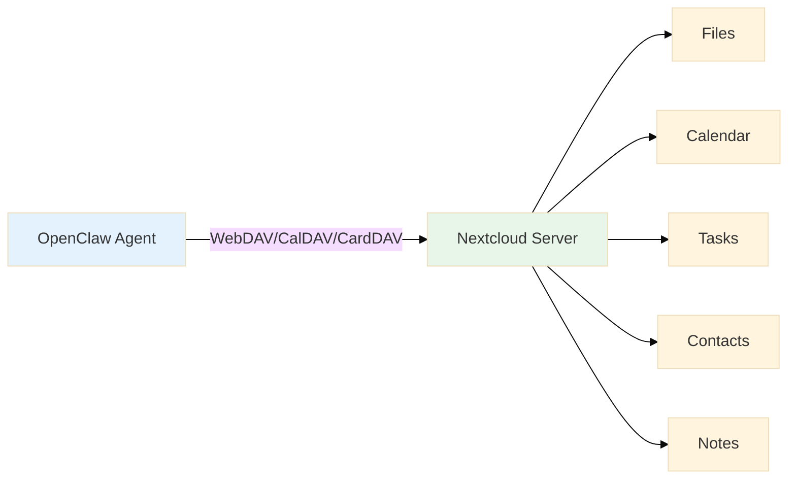
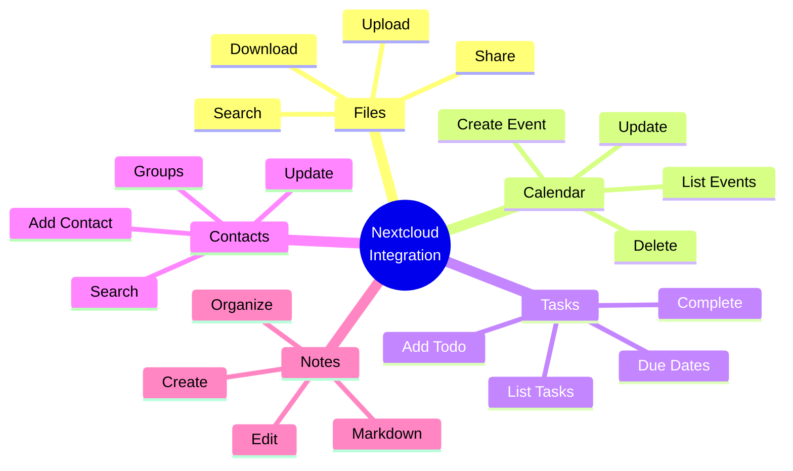
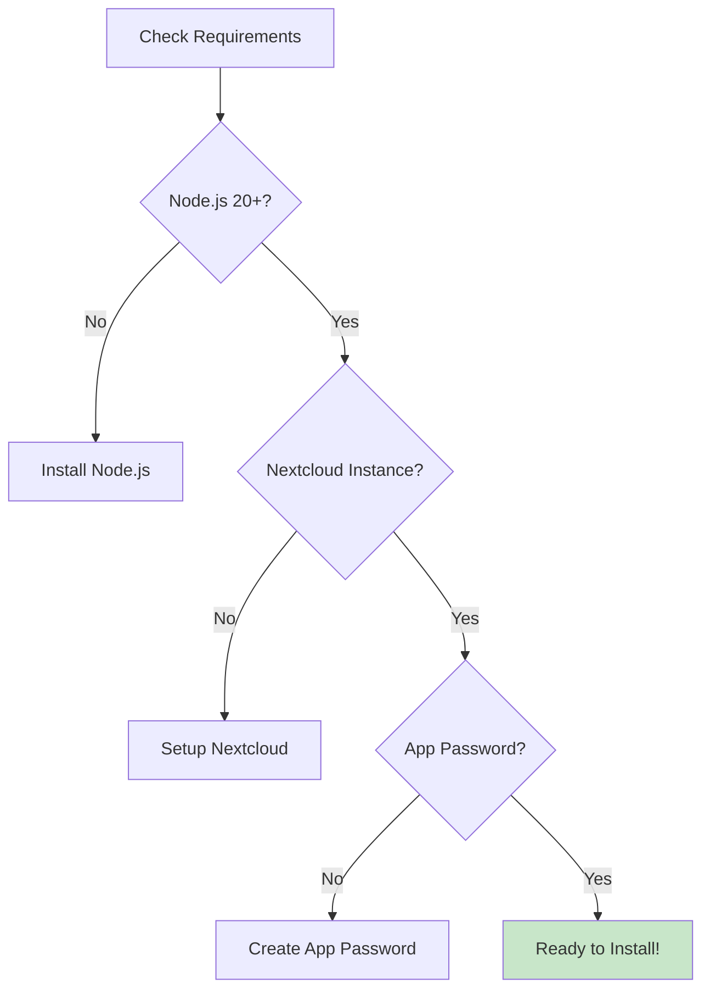
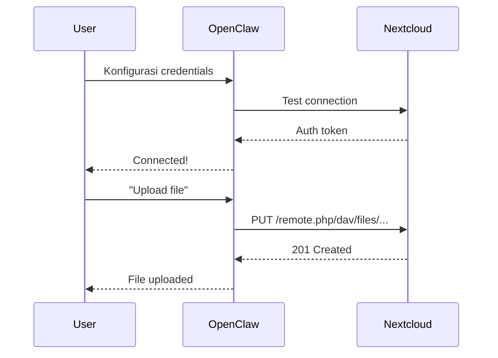
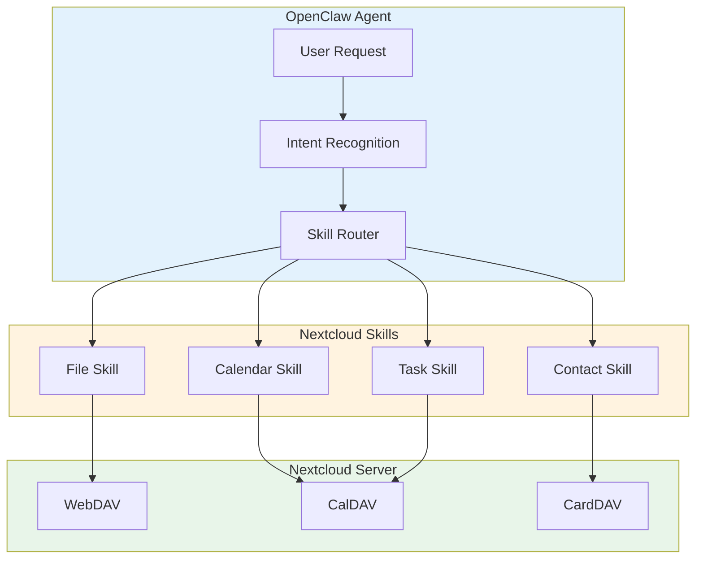
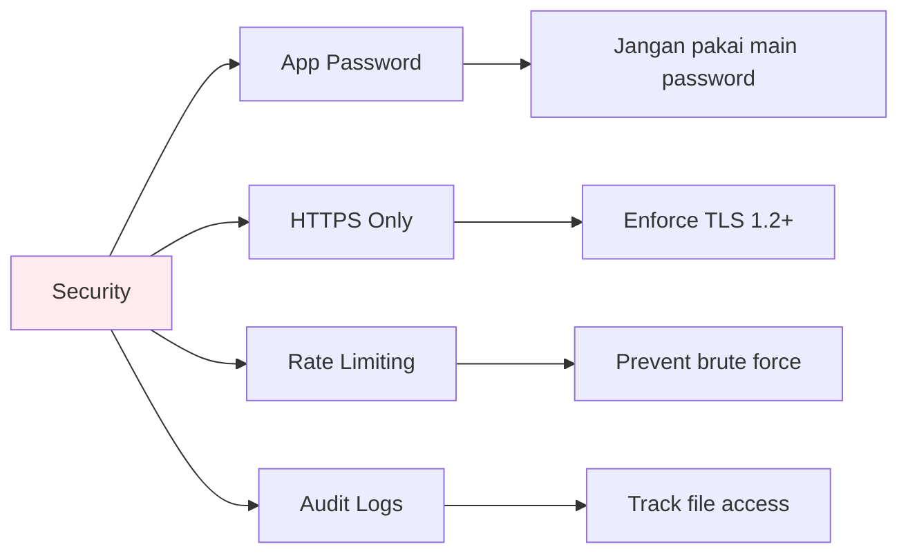

# OpenClaw + Nextcloud Integration

Tutorial lengkap integrasi OpenClaw dengan Nextcloud untuk manajemen file, catatan, tugas, kalender, dan kontak.

> **Credit:** @ZF ini bang Sy kontribusi — https://github.com/far-ux/openclaw-nextcloud-integration  
> untuk yang butuh drive buat agent OpenClaw-nya, pengganti workspace Google.

---

## Apa itu Nextcloud Integration?

Integrasi ini memungkinkan OpenClaw untuk mengakses dan mengelola data di Nextcloud instance kamu — self-hosted cloud storage alternative ke Google Drive/Dropbox.



---

## Fitur yang Didukung

| Fitur | Protocol | Deskripsi |
|-------|----------|-----------|
| Files | WebDAV | Upload, download, cari file |
| Calendar | CalDAV | Buat & kelola acara |
| Tasks | CalDAV | Todo list management |
| Contacts | CardDAV | Buku alamat |
| Notes | WebDAV | Catatan & dokumen |



---

## Prerequisites



1. **Node.js 20+** installed
2. **Nextcloud instance** running (self-hosted atau managed)
3. **App Password** dari Nextcloud (Settings → Security → App Passwords)
4. **User credentials** dengan permission yang cukup

---

## Installation

### Step 1: Clone Repository

```bash
git clone https://github.com/far-ux/openclaw-nextcloud-integration.git
cd openclaw-nextcloud-integration
```

### Step 2: Install Dependencies

```bash
npm install
```

### Step 3: Configure Environment

```bash
cp .env.example .env
```

Edit `.env`:

```env
NEXTCLOUD_URL=https://cloud.yourdomain.com
NEXTCLOUD_USERNAME=your_username
NEXTCLOUD_APP_PASSWORD=your_app_password
```



---

## Usage Examples

### File Management

```javascript
// Upload file
await nextcloud.files.upload('/Documents/report.pdf', buffer);

// Download file
const file = await nextcloud.files.download('/Documents/report.pdf');

// Search files
const results = await nextcloud.files.search('report');

// List directory
const files = await nextcloud.files.list('/Documents');
```

### Calendar Management

```javascript
// Create event
await nextcloud.calendar.createEvent({
  summary: 'Meeting dengan Client',
  start: '2026-03-20T10:00:00',
  end: '2026-03-20T11:00:00',
  description: 'Diskusi project baru'
});

// List events
const events = await nextcloud.calendar.listEvents('2026-03-01', '2026-03-31');
```

### Task Management

```javascript
// Add task
await nextcloud.tasks.create({
  summary: 'Review proposal',
  due: '2026-03-15',
  priority: 1
});

// Complete task
await nextcloud.tasks.complete('task-id');

// List tasks
const tasks = await nextcloud.tasks.list();
```

### Contact Management

```javascript
// Add contact
await nextcloud.contacts.create({
  fn: 'John Doe',
  email: 'john@example.com',
  tel: '+628123456789'
});

// Search contacts
const contacts = await nextcloud.contacts.search('John');
```

### Notes

```javascript
// Create note
await nextcloud.notes.create('Ide Project', '## Brainstorming\n\n- Fitur A\n- Fitur B');

// Get note
const note = await nextcloud.notes.get('note-id');
```

---

## Integration dengan OpenClaw Skills



### Contoh Skill Integration

```javascript
// skills/nextcloud-file/index.js
export default {
  name: 'nextcloud-file',
  
  async handle(intent, context) {
    const { action, filename, content } = intent;
    
    switch(action) {
      case 'upload':
        return await nextcloud.files.upload(filename, content);
      case 'download':
        return await nextcloud.files.download(filename);
      case 'search':
        return await nextcloud.files.search(filename);
      default:
        throw new Error('Unknown action');
    }
  }
};
```

---

## Security Best Practices



1. **Gunakan App Password** — Jangan pakai main Nextcloud password
2. **HTTPS Only** — Selalu enkripsi connection
3. **Rate Limiting** — Prevent abuse
4. **Audit Logging** — Track semua file operations
5. **Regular Rotation** — Rotate app passwords periodically

---

## Troubleshooting

### Common Issues

| Problem | Solution |
|---------|----------|
| `401 Unauthorized` | Check app password masih valid |
| `404 Not Found` | Path file/folder salah |
| `Connection timeout` | Check Nextcloud server status |
| `CORS error` | Enable CORS di Nextcloud config |

### Debug Mode

```bash
DEBUG=nextcloud:* npm start
```

---

## Reference

- **Original Repo**: [far-ux/openclaw-nextcloud-integration](https://github.com/far-ux/openclaw-nextcloud-integration)
- **Nextcloud API Docs**: https://docs.nextcloud.com/
- **WebDAV RFC**: https://tools.ietf.org/rfc/rfc4918.txt
- **CalDAV RFC**: https://tools.ietf.org/rfc/rfc4791.txt
- **CardDAV RFC**: https://tools.ietf.org/rfc/rfc6352.txt

---

## License

MIT License — See original repository for details.
