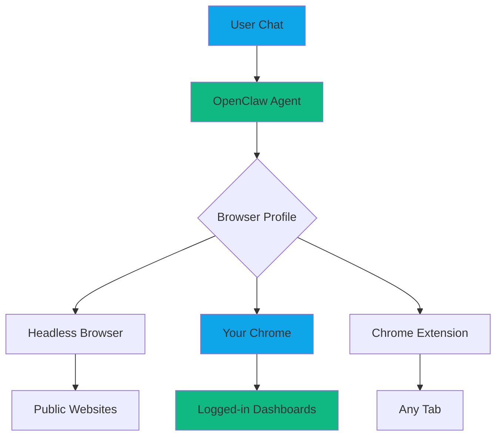
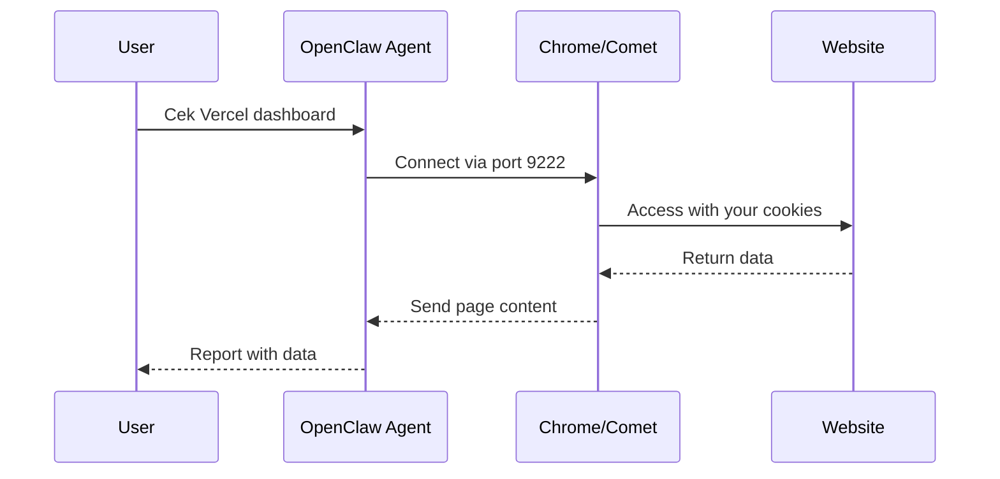
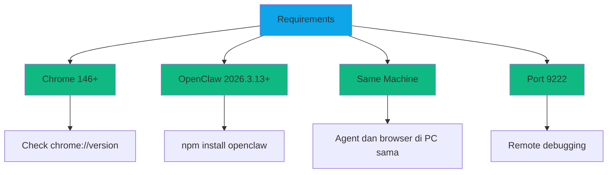
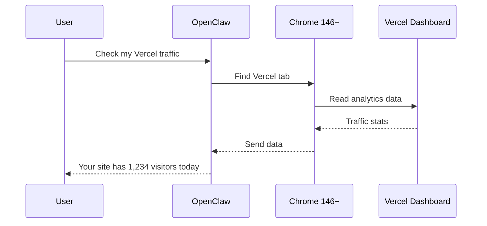
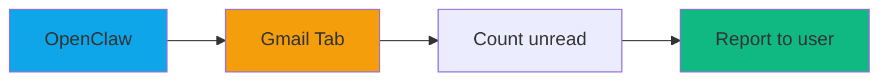
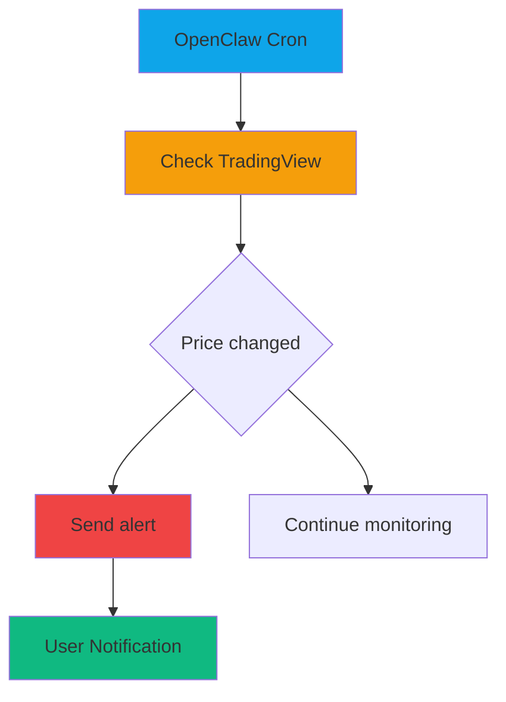
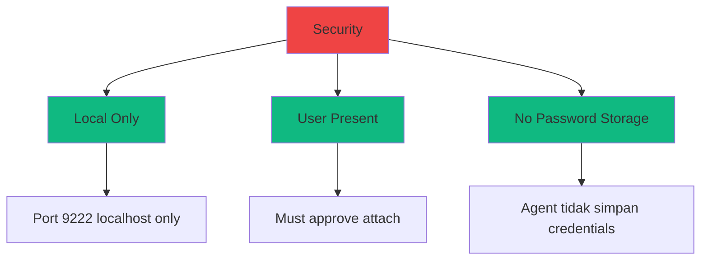
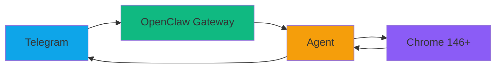

# OpenClaw 3.13: Live Chrome Attach Tutorial

**Feature:** Connect OpenClaw to your real browser  
**Version:** OpenClaw 2026.3.13+  
**Chrome Version:** 146+ (required for remote debugging)  
**Difficulty:** Beginner  
**Time:** 10 minutes setup  
**Updated:** March 2026

---

## What is Live Chrome Attach?

Live Chrome Attach adalah fitur baru di OpenClaw 3.13 yang memungkinkan agent **terhubung langsung ke browser kamu yang sedang berjalan** (Chrome, Chromium, Brave, Edge, atau Comet).

**Before 3.13:**
- Agent pakai headless browser (terpisah)
- Harus login ulang ke setiap website
- Perlu screenshot untuk lihat hasil

**After 3.13:**
- Agent pakai browser yang sudah kamu buka
- Cookies dan session sudah tersimpan
- Baca data langsung dari tab yang sudah login

---

## How It Works



**The Magic:** Agent bisa "melihat" apa yang kamu lihat di browser!

---

## Browser Profiles Explained

OpenClaw 3.13 punya 3 browser profiles:

| Profile | Browser Type | Use Case |
|---------|--------------|----------|
| `openclaw` | Isolated headless | Scraping, automation, VPS |
| `user` | **Your real browser** | Dashboards, logged-in sites |
| `chrome-relay` | Via extension | Legacy support |

**Kita fokus ke `user` profile karena ini yang baru di 3.13!**

---

## Architecture



**Key Point:** Agent membaca data dari browser yang sudah login!

---

## Prerequisites



### Check Chrome Version

1. Buka Chrome
2. Ketik di address bar: `chrome://version`
3. Cek **Google Chrome:** harus **146.0.xxxx.xxx** atau lebih baru

**Kalau versi lama:** Update Chrome dulu!

---

## Step-by-Step Setup

### Step 1: Check OpenClaw Version

```bash
openclaw --version
```

**Should show:** `OpenClaw 2026.3.13` or newer

**If outdated:**
```bash
npm install -g openclaw@latest
```

---

### Step 2: Enable Remote Debugging

**Option A: Launch with Flag (Recommended)**

**Windows:**
```bash
# Chrome 146+
"C:\Program Files\Google\Chrome\Application\chrome.exe" --remote-debugging-port=9222

# Comet
"C:\Program Files\Comet\comet.exe" --remote-debugging-port=9222

# Brave
"C:\Program Files\BraveSoftware\Brave-Browser\Application\brave.exe" --remote-debugging-port=9222

# Edge
"C:\Program Files (x86)\Microsoft\Edge\Application\msedge.exe" --remote-debugging-port=9222
```

**macOS:**
```bash
# Chrome 146+
/Applications/Google\ Chrome.app/Contents/MacOS/Google\ Chrome --remote-debugging-port=9222

# Brave
/Applications/Brave\ Browser.app/Contents/MacOS/Brave\ Browser --remote-debugging-port=9222
```

**Linux:**
```bash
# Chrome 146+
google-chrome --remote-debugging-port=9222

# Chromium
chromium --remote-debugging-port=9222
```

---

**Option B: Create Shortcut (Windows)**

1. Right-click desktop → New → Shortcut
2. Browse to browser executable
3. Add ` --remote-debugging-port=9222` at the end
4. Example target:
   ```
   "C:\Program Files\Google\Chrome\Application\chrome.exe" --remote-debugging-port=9222
   ```

---

### Step 3: Configure OpenClaw

Edit OpenClaw config file:

**Windows:**
```bash
notepad %USERPROFILE%\.openclaw\openclaw.json
```

**macOS/Linux:**
```bash
nano ~/.openclaw/openclaw.json
```

**Add this config:**
```json
{
  "browser": {
    "defaultProfile": "user"
  }
}
```

**Full example:**
```json
{
  "browser": {
    "defaultProfile": "user",
    "enabled": true
  },
  "gateway": {
    "bind": "127.0.0.1",
    "port": 18789
  }
}
```

---

### Step 4: Start Gateway

```bash
openclaw gateway start
```

Or with verbose logging:
```bash
openclaw gateway start --verbose
```

---

### Step 5: Verify Connection

Open new terminal:

```bash
openclaw browser --browser-profile user status
```

**Expected output:**
```
profile: user
enabled: true
running: true
transport: cdp
cdpPort: 9222
cdpUrl: http://127.0.0.1:9222
browser: chrome
detectedBrowser: chrome
```

---

### Step 6: Test Browser Control

```bash
# Open a website
openclaw browser --browser-profile user open https://example.com

# Take screenshot
openclaw browser --browser-profile user snapshot

# List tabs
openclaw browser --browser-profile user tabs
```

---

## Usage Examples

### Example 1: Check Analytics Dashboard



**Command:**
```bash
openclaw agent --message "Check Vercel dashboard for traffic data"
```

**Result:** Agent reads data dari tab yang sudah login!

---

### Example 2: Read Email Summary



**Command:**
```bash
openclaw agent --message "Check Gmail for unread emails and summarize"
```

---

### Example 3: Monitor Stock Prices



---

## Available Commands

### Browser Commands

```bash
# Check status
openclaw browser --browser-profile user status

# Start browser connection
openclaw browser --browser-profile user start

# Stop browser connection
openclaw browser --browser-profile user stop

# Open URL
openclaw browser --browser-profile user open https://example.com

# List tabs
openclaw browser --browser-profile user tabs

# Take screenshot
openclaw browser --browser-profile user snapshot

# Focus tab
openclaw browser --browser-profile user focus --tab-id 1

# Close tab
openclaw browser --browser-profile user close --tab-id 2
```

### Agent with Browser

```bash
# Ask agent to use browser
openclaw agent --message "Go to GitHub and check my notifications"

# With specific browser action
openclaw agent --message "Screenshot the current page"
```

---

## Troubleshooting

### Problem: "Browser not found"

**Cause:** Chrome not running with remote debugging

**Fix:**
```bash
# Check if port 9222 is open
netstat -an | grep 9222

# Restart Chrome with flag
chrome --remote-debugging-port=9222
```

---

### Problem: "Connection refused"

**Cause:** Wrong profile or gateway not running

**Fix:**
```bash
# Check gateway status
openclaw gateway status

# Restart gateway
openclaw gateway restart

# Verify profile
openclaw browser profiles
```

---

### Problem: "Chrome version too old"

**Cause:** Chrome version di bawah 146

**Fix:**
```bash
# Check version
chrome --version

# Update Chrome ke versi terbaru
# Buka Chrome → Settings → About Chrome
```

**Minimum required: Chrome 146+**

---

### Problem: "Cannot attach to browser"

**Cause:** Permission denied or wrong Chrome instance

**Fix:**
```bash
# Kill all Chrome processes first
taskkill /F /IM chrome.exe  # Windows
pkill -f chrome             # macOS/Linux

# Restart with admin/sudo if needed
chrome --remote-debugging-port=9222
```

---

### Problem: "No supported browser found"

**Cause:** Browser not in PATH or not installed

**Fix:**
```bash
# Check if browser is installed
which google-chrome  # Linux
where chrome         # Windows

# Or specify full path in config
{
  "browser": {
    "defaultProfile": "user",
    "chromePath": "C:\\Program Files\\Google\\Chrome\\Application\\chrome.exe"
  }
}
```

---

## Security Considerations



**Important:**
- ✅ Port 9222 hanya accessible dari localhost
- ✅ Kamu harus di komputer untuk approve attach
- ✅ Agent tidak menyimpan password atau cookies
- ✅ Session hanya berlaku selama browser nyala

---

## Comparison: Before vs After 3.13

| Task | Before 3.13 (Headless) | After 3.13 (Live Attach) |
|------|------------------------|--------------------------|
| Check Vercel | Screenshot login page → Manual login → Screenshot data | Direct access to logged-in tab |
| Read Gmail | Login with credentials → Scrape | Use existing Gmail tab |
| Check Analytics | Provide API key → Query API | Read from dashboard directly |
| Screenshots | Always needed | Not needed for data extraction |
| Speed | Slow (multi-step) | Fast (direct access) |
| Setup | Complex auth | Simple: just open browser |

---

## Advanced Configuration

### Custom Port

```json
{
  "browser": {
    "defaultProfile": "user",
    "cdpPort": 9333
  }
}
```

Launch Chrome:
```bash
chrome --remote-debugging-port=9333
```

---

### Multiple Profiles

```json
{
  "browser": {
    "profiles": {
      "work": {
        "cdpPort": 9222,
        "color": "#FF4500"
      },
      "personal": {
        "cdpPort": 9223,
        "color": "#00FF00"
      }
    }
  }
}
```

---

### Auto-Start Browser

```json
{
  "browser": {
    "defaultProfile": "user",
    "autoStart": true,
    "chromePath": "/usr/bin/google-chrome"
  }
}
```

---

## Integration with Channels

Connect from anywhere via Telegram/WhatsApp:



**Setup:**
1. Configure Telegram/WhatsApp channel
2. Send message from phone
3. Agent controls PC browser
4. Get result back on phone

---

## Best Practices

1. **Always use HTTPS websites** when possible
2. **Close sensitive tabs** when not needed
3. **Review agent actions** before approving
4. **Keep browser updated** to Chrome 146+
5. **Use separate Chrome profile** for automation

---

## Summary

✅ **Live Chrome Attach** = Agent pakai browser kamu yang sudah login  
✅ **Chrome Version** = 146+ required  
✅ **Setup** = Chrome flag + OpenClaw config  
✅ **Use case** = Dashboards, analytics, email, any logged-in site  
✅ **Security** = Local only, user approval required  
✅ **Benefit** = No more screenshots, no more manual logins  

---

## Quick Reference Card

```bash
# Check Chrome version (must be 146+)
chrome --version

# Setup
chrome --remote-debugging-port=9222

# Config
{
  "browser": { "defaultProfile": "user" }
}

# Commands
openclaw browser --browser-profile user status
openclaw browser --browser-profile user open URL
openclaw browser --browser-profile user snapshot

# Use
openclaw agent --message "Check my dashboard"
```

---

**Tutorial by:** OpenClaw Community  
**Tested on:** OpenClaw 2026.3.13, Chrome 146+, Windows 11 / macOS / Linux  
**Chrome Version Required:** 146.0.7680.80+  
**Tags:** #openclaw #chrome #browser #automation #tutorial #313 #live-attach
