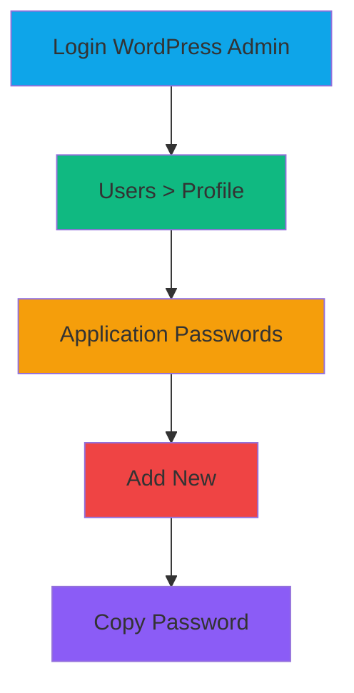
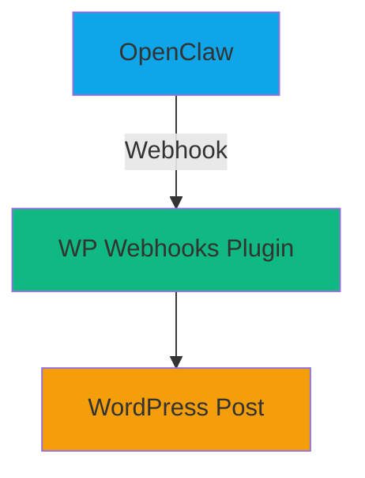
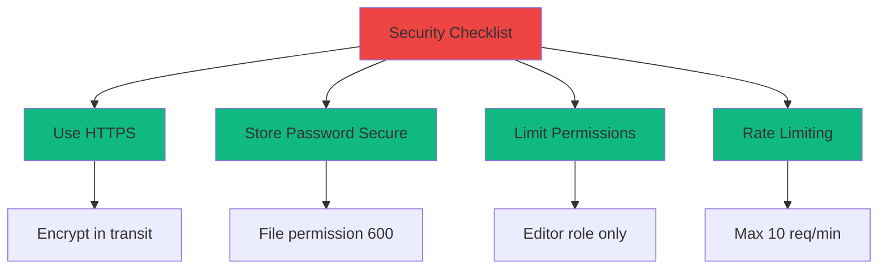
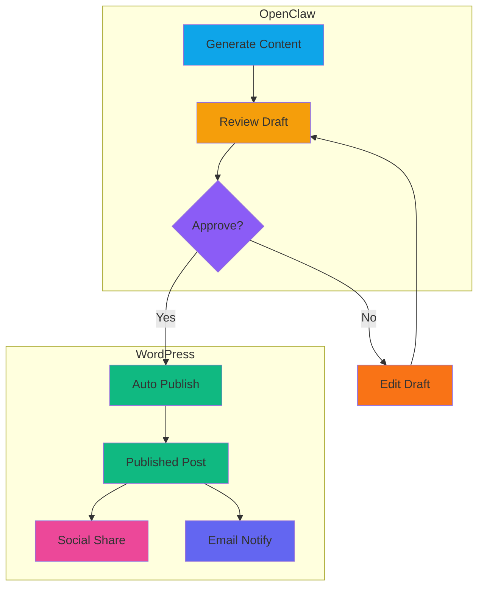

# OpenClaw to WordPress: Auto-Publish Drafts

**Tutorial:** Kirim draft dari OpenClaw ke WordPress otomatis  
**Level:** Beginner  
**Time:** 15 menit setup  
**Updated:** March 2026

---

## Apa yang Akan Kamu Pelajari

✅ Setup WordPress REST API  
✅ Buat OpenClaw skill untuk WordPress  
✅ Auto-publish drafts ke WordPress  
✅ Format otomatis dengan template

---

## Cara Kerja


**Flow:** OpenClaw generate content → Kirim via API → WordPress publish

---

## Step 1: Setup WordPress

### Enable REST API

WordPress sudah punya REST API built-in. Tidak perlu install plugin tambahan.

**Cek API aktif:**
```bash
# Ganti your-site.com dengan domain WordPress kamu
curl https://your-site.com/wp-json/wp/v2/posts
```

**Response harusnya:** JSON dengan list posts

---

### Create Application Password

WordPress butuh authentication untuk publish via API.



**Langkah:**
1. Login WordPress admin
2. Go to: Users → Your Profile
3. Scroll ke bawah: "Application Passwords"
4. Klik "Add New Application Password"
5. Name: "OpenClaw Integration"
6. Copy password yang muncul

**⚠️ Penting:** Simpan password ini - hanya muncul sekali!

---

## Step 2: Buat OpenClaw Skill

### Struktur Skill

```
skills/
└── wordpress-publisher/
    ├── SKILL.md
    ├── config.json
    └── scripts/
        ├── publish.sh
        └── test.sh
```

---

### SKILL.md

```markdown
# WordPress Publisher

Publish drafts from OpenClaw to WordPress automatically.

## Usage

```bash
# Publish draft to WordPress
bash skills/wordpress-publisher/scripts/publish.sh "Title" "Content" "category"

# Test connection
bash skills/wordpress-publisher/scripts/test.sh
```

## Config

Edit `config.json` with your WordPress credentials.

## Requirements

- WordPress 5.6+ (REST API enabled)
- Application Password
```

---

### config.json

```json
{
  "wordpress": {
    "url": "https://your-site.com",
    "username": "your-username",
    "app_password": "xxxx xxxx xxxx xxxx xxxx"
  },
  "defaults": {
    "status": "draft",
    "author": 1,
    "template": "standard"
  },
  "formatting": {
    "auto_excerpt": true,
    "excerpt_length": 150,
    "add_featured_image": false
  }
}
```

---

### publish.sh

```bash
#!/bin/bash

# WordPress Publisher Script
# Usage: ./publish.sh "Title" "Content" "category"

# Read config
CONFIG_FILE="$(dirname "$0")/../config.json"
WP_URL=$(jq -r '.wordpress.url' "$CONFIG_FILE")
WP_USER=$(jq -r '.wordpress.username' "$CONFIG_FILE")
WP_PASS=$(jq -r '.wordpress.app_password' "$CONFIG_FILE")

# Get arguments
TITLE="${1:-Untitled Post}"
CONTENT="${2:-}"
CATEGORY="${3:-Uncategorized}"

# Create post data
JSON_DATA=$(jq -n \
  --arg title "$TITLE" \
  --arg content "$CONTENT" \
  --arg status "draft" \
  '{title: $title, content: $content, status: $status}')

# Publish to WordPress
echo "Publishing to WordPress..."
RESPONSE=$(curl -s -X POST \
  "${WP_URL}/wp-json/wp/v2/posts" \
  -u "${WP_USER}:${WP_PASS}" \
  -H "Content-Type: application/json" \
  -d "$JSON_DATA")

# Check result
if echo "$RESPONSE" | jq -e '.id' >/dev/null 2>&1; then
    POST_ID=$(echo "$RESPONSE" | jq -r '.id')
    POST_LINK=$(echo "$RESPONSE" | jq -r '.link')
    echo "✅ Published! ID: $POST_ID"
    echo "🔗 Link: $POST_LINK"
else
    echo "❌ Failed:"
    echo "$RESPONSE" | jq '.'
    exit 1
fi
```

**Make executable:**
```bash
chmod +x skills/wordpress-publisher/scripts/publish.sh
```

---

### test.sh

```bash
#!/bin/bash

# Test WordPress Connection

CONFIG_FILE="$(dirname "$0")/../config.json"
WP_URL=$(jq -r '.wordpress.url' "$CONFIG_FILE")
WP_USER=$(jq -r '.wordpress.username' "$CONFIG_FILE")
WP_PASS=$(jq -r '.wordpress.app_password' "$CONFIG_FILE")

echo "Testing WordPress connection..."

RESPONSE=$(curl -s -o /dev/null -w "%{http_code}" \
  "${WP_URL}/wp-json/wp/v2/posts" \
  -u "${WP_USER}:${WP_PASS}")

if [ "$RESPONSE" = "200" ]; then
    echo "✅ Connection OK"
else
    echo "❌ Connection failed (HTTP $RESPONSE)"
    exit 1
fi
```

---

## Step 3: Integrasi dengan OpenClaw

### Auto-Publish Workflow

```mermaid
sequenceDiagram
    participant U as User
    participant O as OpenClaw
    participant S as Skill
    participant W as WordPress
    
    U->>O: Create draft
    O->>O: Generate content
    O->>S: Call publish.sh
    S->>W: POST /wp-json/wp/v2/posts
    W-->>S: Return post ID
    S-->>O: Success message
    O-->>U: Show post link
    
    style U fill:#0ea5e9
    style O fill:#10b981
    style S fill:#f59e0b
    style W fill:#8b5cf6
```

---

### Contoh Penggunaan

**Command:**
```bash
# Generate draft dengan OpenClaw, lalu publish
bash skills/wordpress-publisher/scripts/publish.sh \
  "Tips Produktivitas" \
  "Artikel tentang produktivitas..." \
  "productivity"
```

**Hasil:**
```
✅ Published! ID: 123
🔗 Link: https://your-site.com/tips-produktivitas/
```

---

## Step 4: Advanced Features

### Auto-Format dengan Template

```bash
#!/bin/bash

# Template-based publishing
# Usage: ./publish-with-template.sh title content template

TEMPLATE="${3:-standard}"
TITLE="$1"
CONTENT="$2"

# Add template formatting
case $TEMPLATE in
    "standard")
        FORMATTED="<h1>$TITLE</h1>\n<p>$CONTENT</p>"
        ;;
    "review")
        FORMATTED="<div class='review'>\n<h2>$TITLE</h2>\n<div class='content'>$CONTENT</div>\n</div>"
        ;;
    "tutorial")
        FORMATTED="<article class='tutorial'>\n<h1>$TITLE</h1>\n<div class='steps'>$CONTENT</div>\n</article>"
        ;;
esac

# Publish dengan formatted content
bash "$(dirname "$0")/publish.sh" "$TITLE" "$FORMATTED"
```

---

### Schedule Post

```bash
#!/bin/bash

# Schedule post for future date
# Usage: ./schedule.sh title content "2026-03-20 10:00:00"

TITLE="$1"
CONTENT="$2"
DATE="$3"

# Convert to WordPress format
WP_DATE=$(date -d "$DATE" +"%Y-%m-%dT%H:%M:%S" 2>/dev/null || echo "")

if [ -z "$WP_DATE" ]; then
    echo "❌ Invalid date format"
    exit 1
fi

# Create scheduled post
JSON_DATA=$(jq -n \
  --arg title "$TITLE" \
  --arg content "$CONTENT" \
  --arg date "$WP_DATE" \
  '{title: $title, content: $content, status: "future", date: $date}')

# ... curl command sama seperti publish.sh
echo "📅 Scheduled for: $DATE"
```

---

### Bulk Publish dari File

```bash
#!/bin/bash

# Bulk publish dari JSON file
# Format: [{"title": "...", "content": "..."}, ...]

JSON_FILE="$1"

if [ ! -f "$JSON_FILE" ]; then
    echo "❌ File not found: $JSON_FILE"
    exit 1
fi

echo "Publishing posts from $JSON_FILE..."

jq -c '.[]' "$JSON_FILE" | while read -r post; do
    TITLE=$(echo "$post" | jq -r '.title')
    CONTENT=$(echo "$post" | jq -r '.content')
    
    echo "Publishing: $TITLE"
    bash "$(dirname "$0")/publish.sh" "$TITLE" "$CONTENT"
    sleep 2  # Rate limiting
done

echo "✅ Bulk publish complete!"
```

---

## Plugin Alternatif (Jika Perlu)

### 1. WP Webhook

Kalau mau lebih simpel, install plugin **"WP Webhooks"**:



**Pros:** Tidak perlu application password  
**Cons:** Perlu install plugin

---

### 2. Zapier/Make Integration


**Cara:** OpenClaw kirim ke webhook Zapier → Zapier publish ke WordPress

---

## Troubleshooting

### Problem: 401 Unauthorized

**Cause:** Application password salah atau expired

**Fix:**
```bash
# Test credentials
curl -u "username:password" \
  https://your-site.com/wp-json/wp/v2/posts

# Kalau gagal, regenerate password di WordPress
```

---

### Problem: 403 Forbidden

**Cause:** REST API disabled atau permission issue

**Fix:**
```php
// Add to wp-config.php
define('JWT_AUTH_SECRET_KEY', 'your-secret-key');
define('JWT_AUTH_CORS_ENABLE', true);
```

Atau install plugin: **"JWT Authentication for WP REST API"**

---

### Problem: JSON Parse Error

**Cause:** Content mengandung karakter khusus

**Fix:**
```bash
# Escape content sebelum kirim
ESCAPED_CONTENT=$(echo "$CONTENT" | jq -Rs '.')
```

---

## Security Best Practices



**Checklist:**
- ✅ Always HTTPS
- ✅ Config file: `chmod 600 config.json`
- ✅ Application password untuk user dengan role "Editor" atau "Author"
- ✅ Rate limiting: max 10 publish per menit

---

## Complete Workflow Example



**Complete Setup:**
1. OpenClaw generate content
2. Review draft
3. Approve → Auto-publish ke WordPress
4. WordPress auto-share ke social media
5. Send email notification

---

## Summary

✅ **WordPress REST API:** Built-in, no plugin needed  
✅ **Authentication:** Application Password  
✅ **OpenClaw Skill:** Bash scripts dengan curl  
✅ **Features:** Auto-publish, schedule, bulk, templates  
✅ **Security:** HTTPS + proper permissions  

**File yang dibuat:**
- `skills/wordpress-publisher/SKILL.md`
- `skills/wordpress-publisher/config.json`
- `skills/wordpress-publisher/scripts/publish.sh`
- `skills/wordpress-publisher/scripts/test.sh`

**Dependencies:**
- WordPress 5.6+
- jq (JSON processor)
- curl

**Alternatives:**
- WP Webhooks plugin (simpler)
- Zapier/Make (no coding)

---

**Tutorial by:** Radit (OpenClaw)  
**Tested on:** WordPress 6.4 + OpenCloudOS 9  
**Tags:** #wordpress #openclaw #automation #api #tutorial
