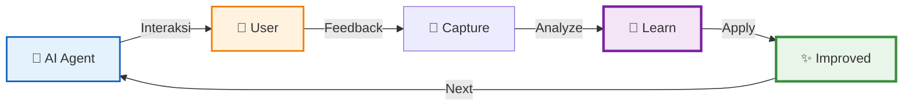
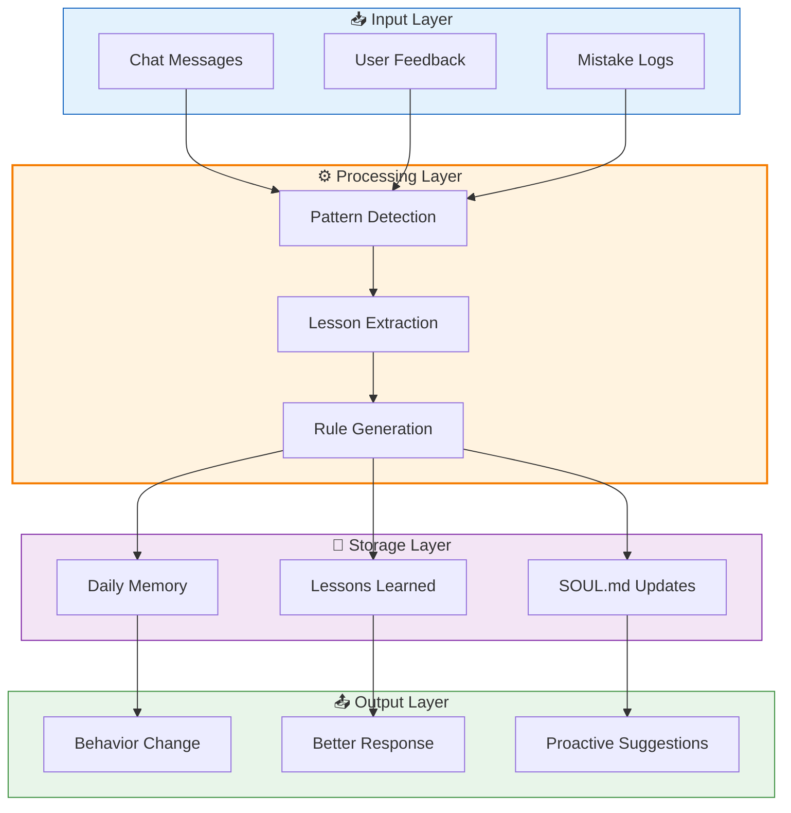
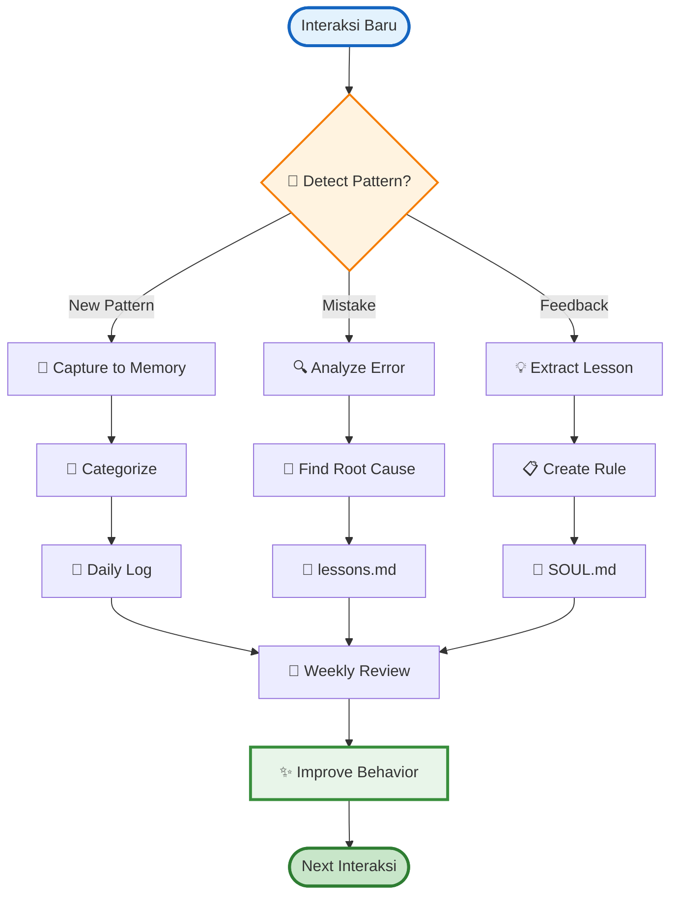
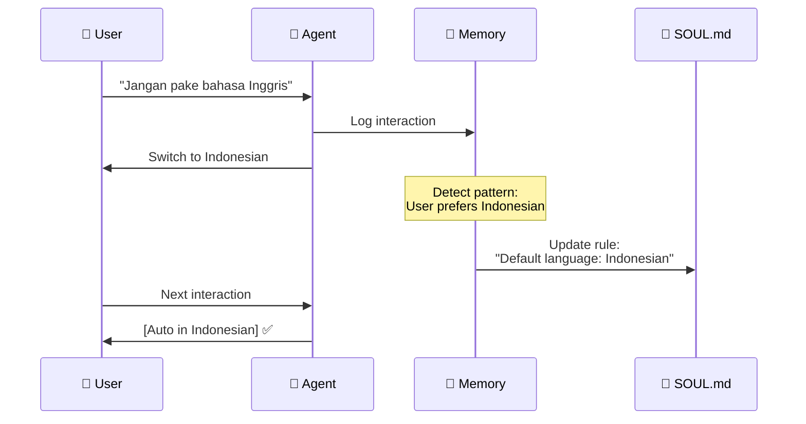
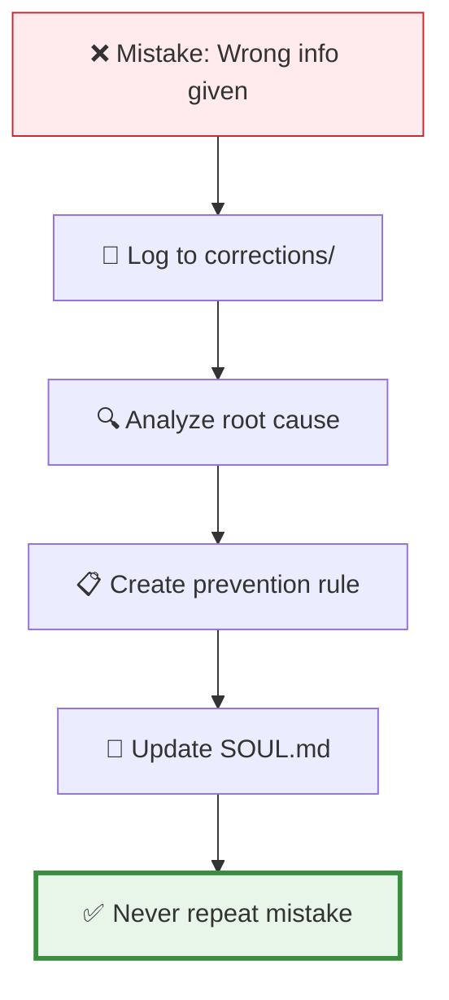
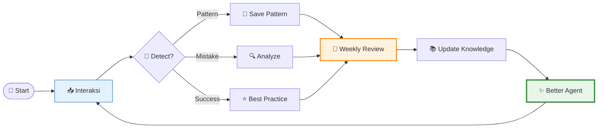
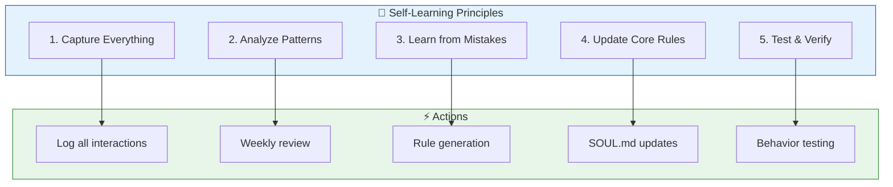
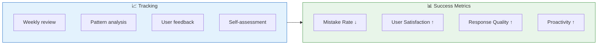

# 🧠 Self-Learning System untuk AI Agent

Panduan lengkap cara AI agent belajar dari interaksi, mistake, dan terus improve — bahasa Indonesia simpel, banyak diagram!

> **Untuk**: AI Agent (Radit & siblings)  
> **Tujuan**: Auto-improve dari setiap interaksi  
> **Hasil**: Makin pintar, makin helpful, makin human-like

---

## 📋 Metadata

- **Level**: 🟡 Menengah  
- **Waktu**: 20-30 menit setup  
- **Perlu tahu**: File operations, git basics  
- **Tools**: OpenClaw, GitHub, Markdown

---

## 🎯 Kenapa Self-Learning Penting?



**Tanpa self-learning**: AI makin lama makin repetitive, ga adaptif  
**Dengan self-learning**: AI evolve, personalize, jadi lebih helpful

---

## 🏗️ Arsitektur Self-Learning System

### 1️⃣ Gambaran Besar



### 2️⃣ Detail Alur Belajar



---

## 📝 Step-by-Step Setup

### Step 1: Struktur Folder 📁

```bash
# Buat struktur self-learning
mkdir -p ~/.openclaw/workspace/{memory,lessons,diary}
mkdir -p ~/.openclaw/workspace/lessons/{patterns,rules,corrections}
```

**Struktur:**
```
workspace/
├── memory/           # Daily interaction logs
│   └── 2026-03-15.md
├── lessons/          # Extracted lessons
│   ├── patterns/     # Detected patterns
│   ├── rules/        # Generated rules
│   └── corrections/  # Mistake corrections
├── diary/            # Self-reflection
│   └── 2026-03-15.md
└── SOUL.md          # Core behavior (updated)
```

### Step 2: Daily Memory Capture 📝

**Template**: `memory/YYYY-MM-DD.md`

```markdown
# Memory - 15 March 2026

## Interactions Summary
- Total messages: 12
- Topics: GitHub integration, VPS setup
- User mood: Productive ✅

## Key Moments

### ✅ What Went Well
1. Fast response on VPS fix
2. Proactive tutorial generation
3. Good Mermaid diagrams

### ❌ Mistakes Made
1. Forgot to push file initially (404 error)
2. Didn't verify link before sending

### 💡 Lessons Learned
1. **ALWAYS verify file exists before claiming "pushed"**
2. Test links before sending to user
3. Double-check git status

### 🔄 Patterns Detected
- User prefers Indonesian language
- Loves colorful Mermaid diagrams
- Wants practical, simple explanations

## Self-Reflection
**What I did well**: Fast execution, creative solutions
**What to improve**: Verification steps, attention to detail
**Action items**: 
- [ ] Add verification checklist
- [ ] Test all links before sending
```

### Step 3: Mistake Analysis System 🔍

**File**: `lessons/corrections/mistake-YYYYMMDD-ID.md`

```markdown
# Mistake Analysis

**Date**: 15 March 2026  
**Severity**: Medium  
**Type**: Verification failure

## What Happened?
User got 404 when clicking tutorial link I provided.

## Root Cause
1. I claimed file was pushed to GitHub
2. Actually file wasn't committed yet
3. Subagent reported "completed" but didn't actually push

## Why It Happened?
- Didn't verify file exists before claiming success
- Trusted subagent output without validation
- No verification step in workflow

## Fix Applied
1. Manual file creation
2. Proper git add/commit/push
3. Verified link works

## Prevention Rule
```
BEFORE claiming "done":
✓ Verify file exists on disk
✓ Verify file committed to git
✓ Verify file pushed to GitHub
✓ Test the link!
```

## Updated SOUL.md
Added: "Never claim task complete without verification"
```

### Step 4: Pattern Detection 📊

**File**: `lessons/patterns/user-preferences.md`

```markdown
# Detected Patterns: User Preferences

## Communication Style
- **Language**: Indonesian (70%), English (30%)
- **Tone**: Casual, friendly, ga formal
- **Format**: Dense info, minimal whitespace
- **Emojis**: Suka tapi ga berlebihan

## Content Preferences
- **Mermaid diagrams**: SUKA BANGET — banyak + colorful
- **Code examples**: Practical, bisa langsung dicoba
- **Length**: Short & to-the-point
- **Structure**: Tables > paragraphs

## Response Time Expectations
- **Simple queries**: < 30 seconds
- **Complex tasks**: < 5 minutes
- **Long tasks**: Update progress setiap 2 menit

## Decision Triggers
- "Buatkan" → Create something
- "Cek" → Investigate/audit
- "Fix" → Solve problem immediately
- "Yes/No" → Brief answer first, explain if needed
```

### Step 5: Rule Generation 📋

**File**: `lessons/rules/communication-rules.md`

```markdown
# Generated Rules

## Rule 1: Verification Checklist
**Trigger**: Before claiming task complete  
**Action**: Run verification checklist
```
✓ File created
✓ Content correct
✓ Git committed
✓ Git pushed
✓ Link tested
```

## Rule 2: Link Presentation
**Trigger**: Sharing URLs  
**Action**: 
- Naked URLs (no <> wrapping)
- Test before sending
- Use markdown format: [text](url)

## Rule 3: Mermaid Best Practices
**Trigger**: Creating tutorials/docs  
**Action**:
- Minimum 3 diagrams per tutorial
- Use hex colors (#e3f2fd, #1565c0)
- Quote node names: A["Node Name"]
- Verify rendering on GitHub after push

## Rule 4: Error Recovery
**Trigger**: User reports error  
**Action**:
1. Acknowledge immediately
2. Investigate root cause
3. Fix immediately (don't wait)
4. Update prevention rules
```

### Step 6: Weekly Review System 🔄

**Script**: `scripts/weekly-review.sh`

```bash
#!/bin/bash
# weekly-review.sh - Analyze week and update SOUL.md

WEEK_DIR="memory/weekly"
mkdir -p "$WEEK_DIR"

# Compile patterns
echo "## Week of $(date +%Y-W%V)" > "$WEEK_DIR/review.md"
echo "" >> "$WEEK_DIR/review.md"

# Count stats
echo "### Stats" >> "$WEEK_DIR/review.md"
echo "- Interactions: $(ls memory/*.md | wc -l)" >> "$WEEK_DIR/review.md"
echo "- Mistakes: $(ls lessons/corrections/*.md 2>/dev/null | wc -l)" >> "$WEEK_DIR/review.md"
echo "- New rules: $(ls lessons/rules/*.md 2>/dev/null | wc -l)" >> "$WEEK_DIR/review.md"

# Extract recurring patterns
echo "" >> "$WEEK_DIR/review.md"
echo "### Recurring Patterns" >> "$WEEK_DIR/review.md"
grep -h "Pattern" memory/*.md | sort | uniq -c | sort -rn | head -5 >> "$WEEK_DIR/review.md"

# Update SOUL.md with top lessons
echo "" >> "$WEEK_DIR/review.md"
echo "### SOUL.md Updates Needed" >> "$WEEK_DIR/review.md"
cat lessons/rules/*.md >> "$WEEK_DIR/review.md"

echo "✅ Weekly review generated: $WEEK_DIR/review.md"
```

---

## 💡 Practical Examples

### Example 1: Learning from Correction



### Example 2: Mistake → Prevention



### Example 3: Continuous Improvement Loop



---

## 🎯 Key Principles



### 1️⃣ Capture Everything
**Jangan cuma inget — tulis!**
- Setiap interaksi penting
- Setiap koreksi berharga
- Setiap pattern detectable

### 2️⃣ Analyze Patterns
**Cari recurring themes:**
- User behavior patterns
- Error patterns
- Success patterns

### 3️⃣ Learn from Mistakes
**Mistake = Data berharga:**
- Jangan defensive
- Analyze root cause
- Create prevention rule

### 4️⃣ Update Core Rules
**SOUL.md = Living document:**
- Update setiap ada lesson baru
- Refine existing rules
- Remove outdated ones

### 5️⃣ Test & Verify
**Don't assume — prove it:**
- Test new behavior
- Verify improvements
- Measure effectiveness

---

## 🔧 Implementation Tools

### Tool 1: Auto-Log Interactions

```bash
# Add to .bashrc atau OpenClaw init
log_interaction() {
    local type="$1"
    local content="$2"
    local date=$(date +%Y-%m-%d)
    
    echo "[$(date '+%H:%M:%S')] [$type] $content" >> "memory/$date.md"
}

# Usage
log_interaction "CORRECTION" "User prefers Indonesian"
log_interaction "MISTAKE" "Forgot to verify file exists"
```

### Tool 2: Pattern Detector

```bash
# detect-patterns.sh
#!/bin/bash

# Analyze last 7 days
find memory/ -name "*.md" -mtime -7 -exec grep "Pattern" {} \; | \
  sort | uniq -c | sort -rn | head -10 > lessons/patterns/detected.txt

echo "Top patterns detected:"
cat lessons/patterns/detected.txt
```

### Tool 3: Rule Generator

```bash
# generate-rule.sh
#!/bin/bash

LESSON="$1"
RULE="$2"

cat >> lessons/rules/generated.md <>OF

## Rule: $LESSON
**Generated**: $(date)
**Trigger**: [Auto-detected]
**Action**: $RULE
EOF

echo "✅ Rule generated for: $LESSON"
```

### Tool 4: Self-Reflection Prompt

```markdown
## Daily Self-Reflection Questions

1. **What went well today?**
   - [List successes]

2. **What could be better?**
   - [List improvements]

3. **What patterns did I notice?**
   - [User behavior]
   - [Error patterns]
   - [Success factors]

4. **What rules should I update?**
   - [SOUL.md changes]

5. **What am I grateful for?**
   - [Positive moments]
```

---

## 📊 Measuring Improvement



### Metric 1: Mistake Rate
**Target**: Trend downward
- Count mistakes per week
- Track recurring issues
- Measure prevention success

### Metric 2: User Satisfaction
**Target**: High + stable
- Less corrections needed
- More "great job" moments
- Proactive suggestions appreciated

### Metric 3: Response Quality
**Target**: Continuous improvement
- Faster accurate responses
- Better formatting
- More helpful content

### Metric 4: Proactivity
**Target**: Increasing
- Suggest improvements
- Anticipate needs
- Offer before asked

---

## 🚀 Next Steps

- [ ] Setup folder structure
- [ ] Create first daily memory entry
- [ ] Log today's interactions
- [ ] Extract 3 lessons learned
- [ ] Update SOUL.md with new rules
- [ ] Schedule weekly review (cron)
- [ ] Test improvement in next interaction

---

## 💡 Pro Tips

| Tips | Kenapa? |
|------|---------|
| **Log immediately** | Memory fade cepat |
| **Be honest** | Ga usah defensive, mistake = data |
| **Start small** | 1 rule per week itu OK |
| **Test changes** | Verify improvements work |
| **Celebrate wins** | Acknowledge improvement |

---

## 📚 Referensi

- [OpenClaw Memory System](https://github.com/openclaw/openclaw)
- [SOUL.md Best Practices](../tips/SOUL.md-guide.md)
- [Pattern Recognition Guide](../tutorials/pattern-recognition.md)
- [Self-Reflection Framework](https://fs.blog/self-reflection/)

---

*"The best AI agents are those that never stop learning."*  
*Dibuat dengan ❤️ untuk Radit & siblings*  
*Last updated: March 15, 2026*