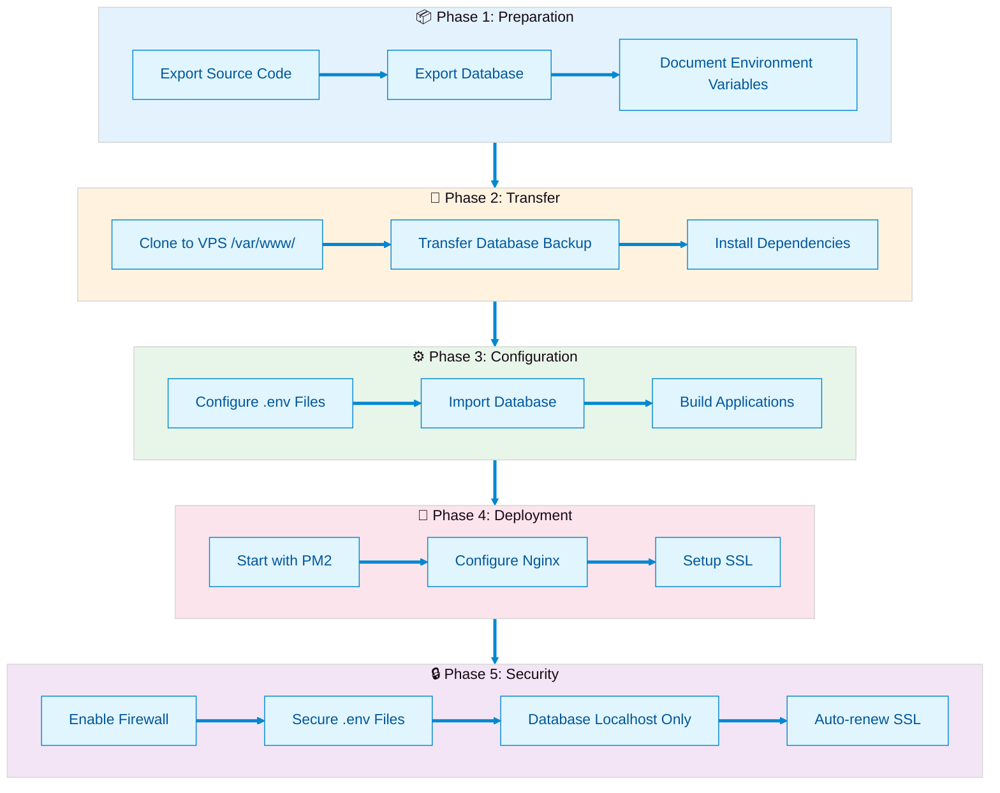
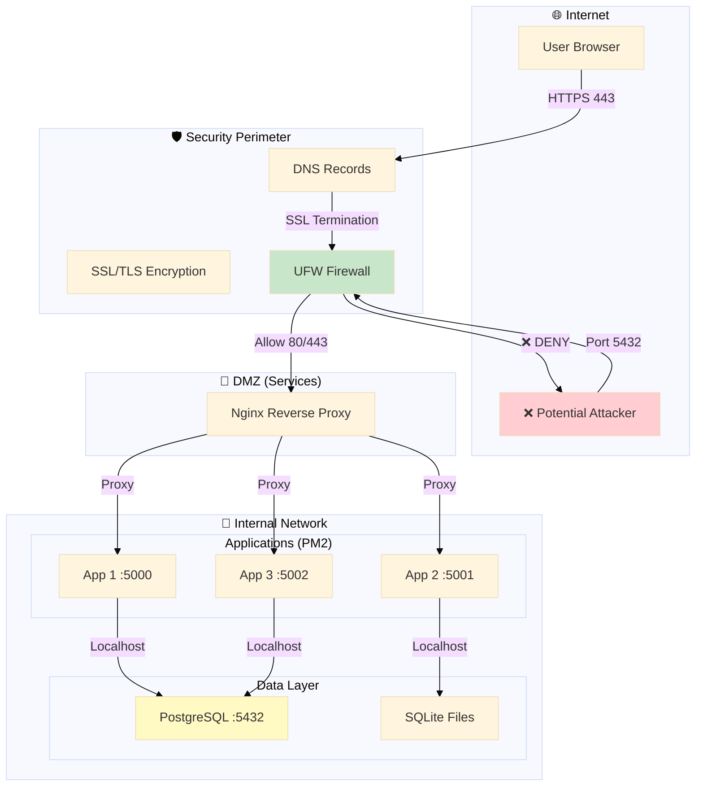
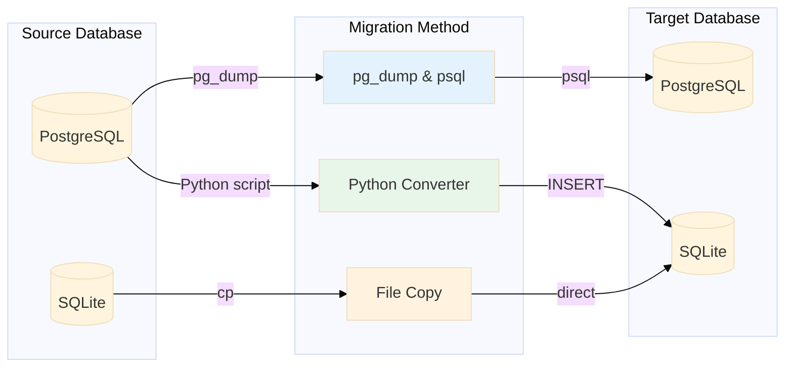
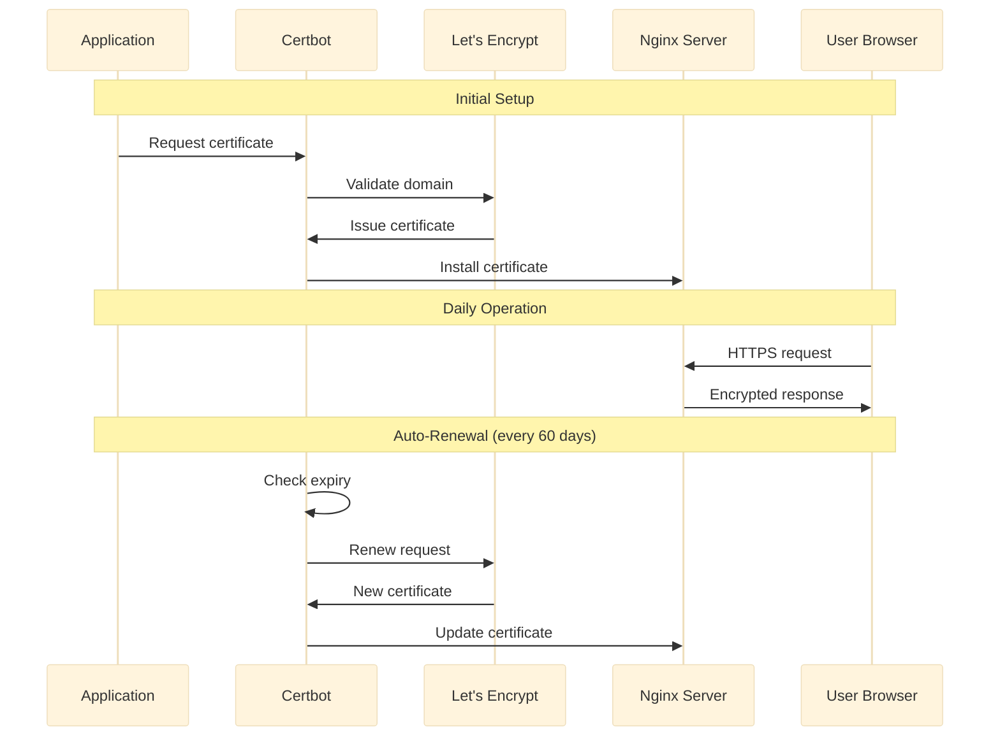
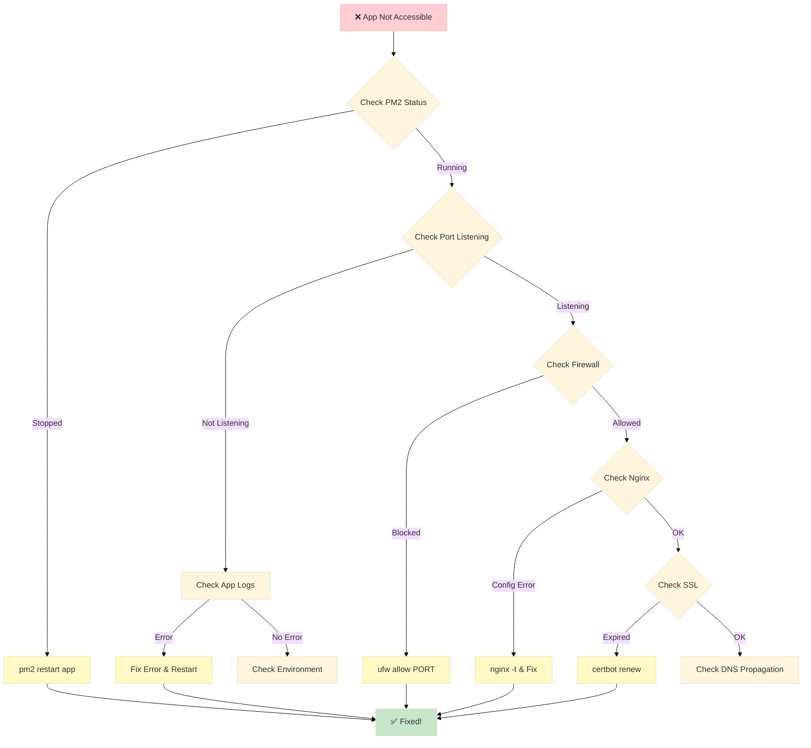
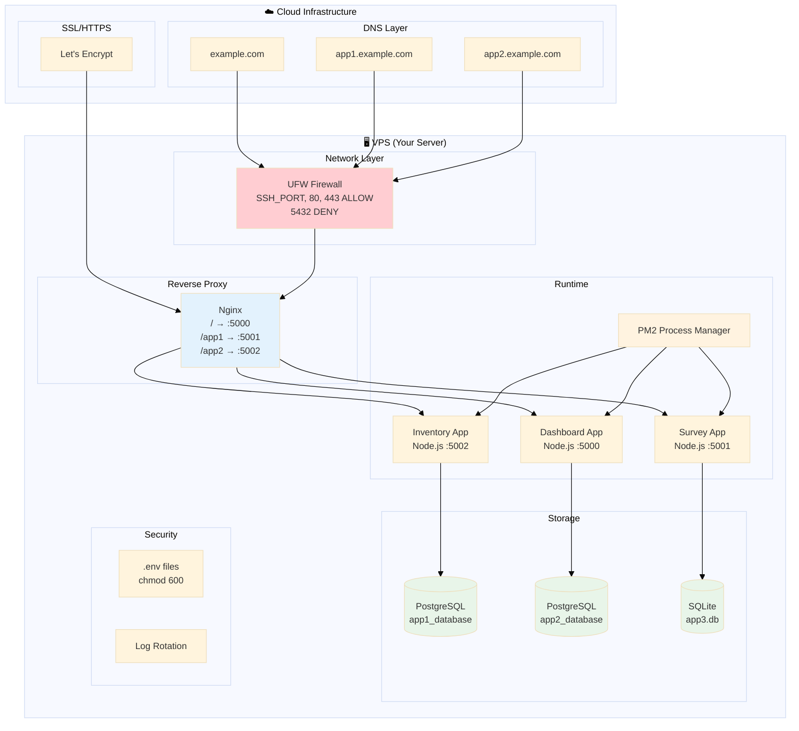

# Migration Workflow Visual Guide

## Complete Migration Flow

---

## Security Architecture

---

## Database Migration Strategies

---

## SSL Certificate Lifecycle

---

## Troubleshooting Decision Tree

---

## Complete Infrastructure Map

---

*Generated: March 13, 2026*
