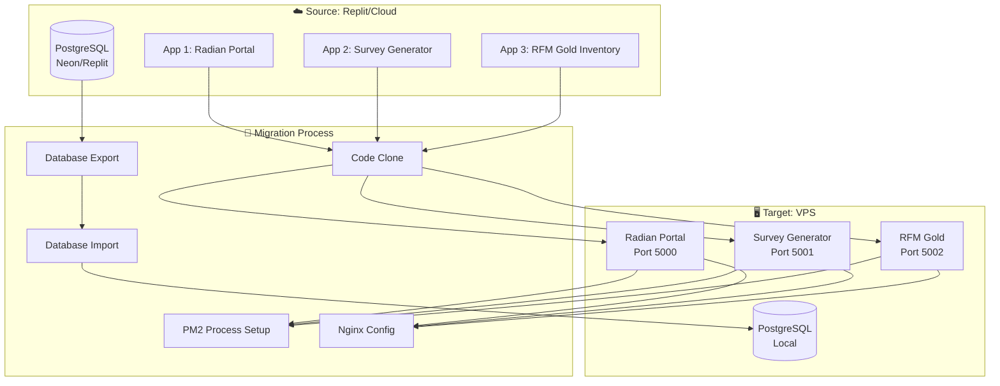
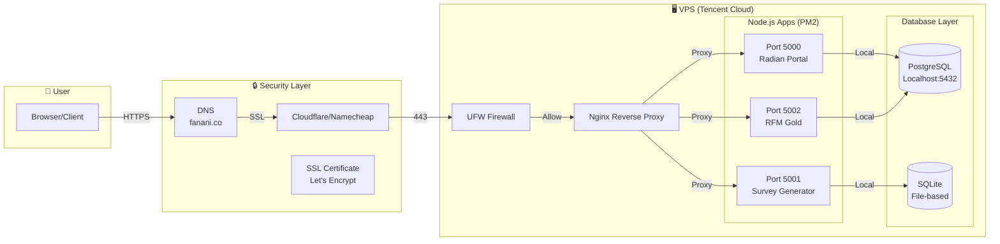
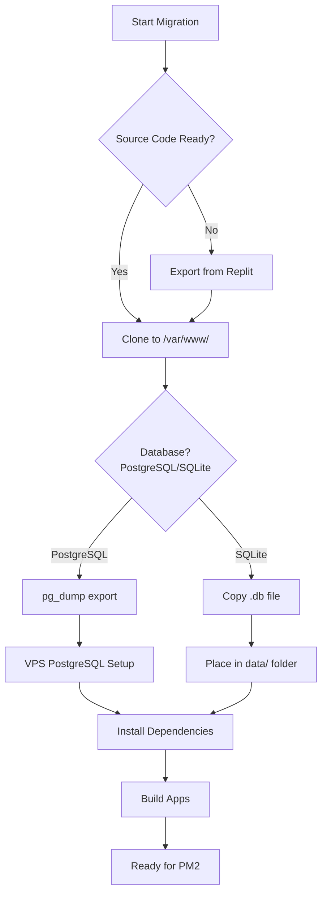
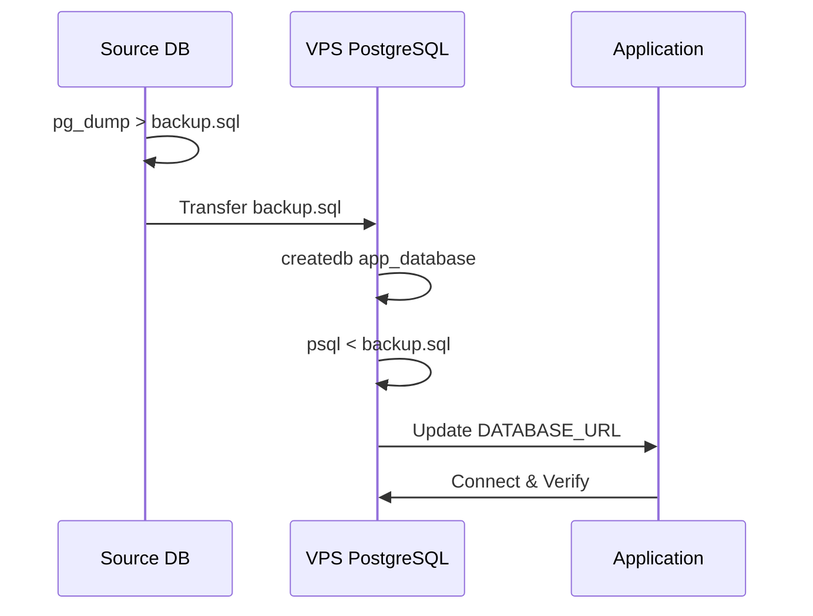
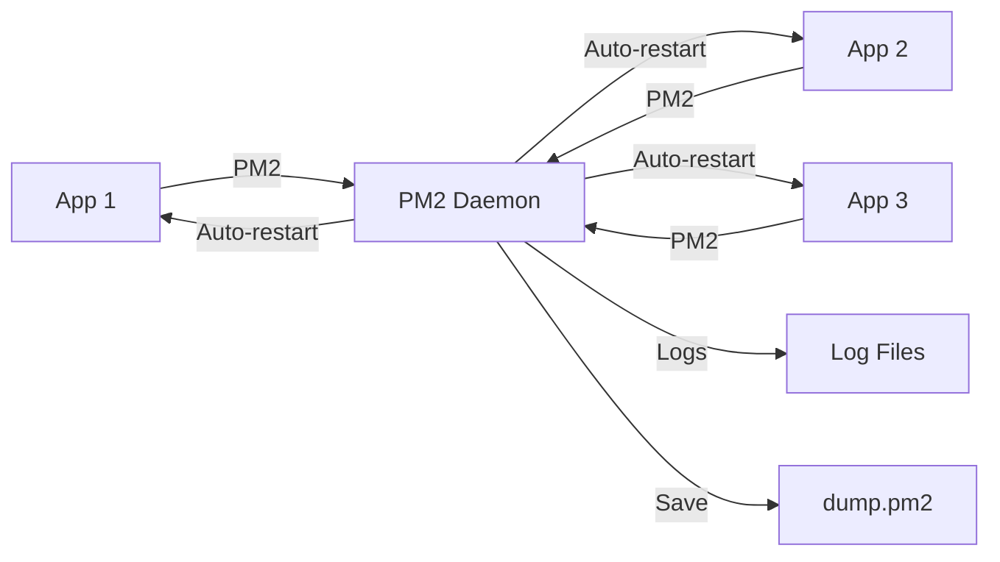
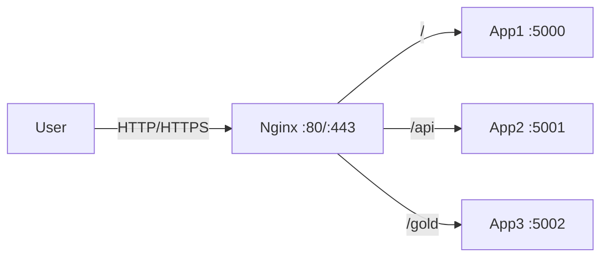
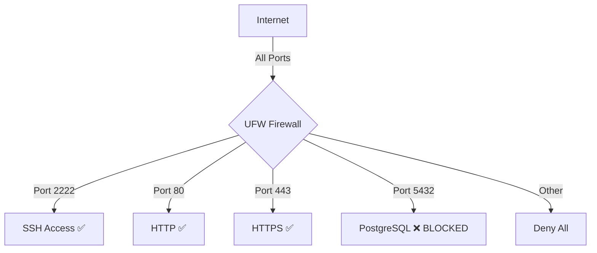
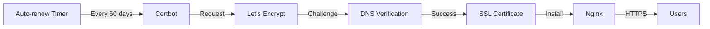
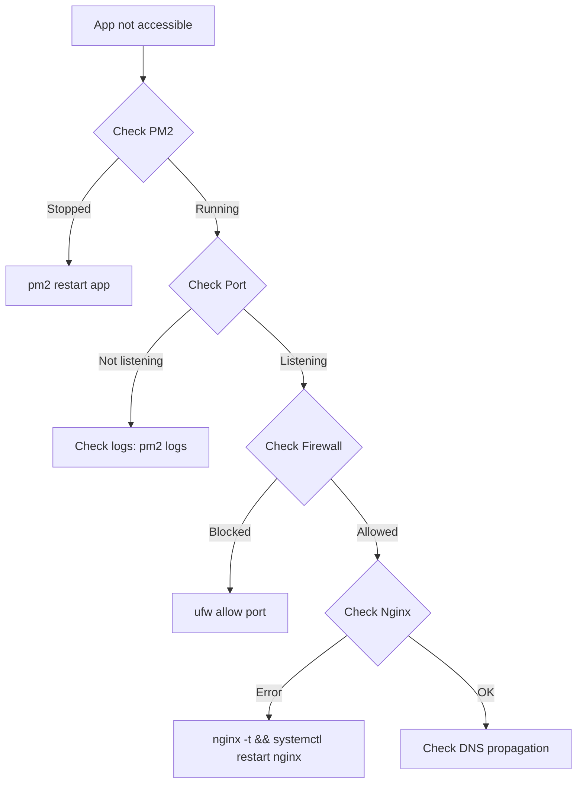
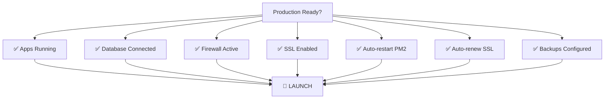

# Use Case: Multi-App VPS Migration with Security Hardening

> **Scenario:** Migrate multiple applications from Replit/cloud to self-hosted VPS with production-grade security.



---

## Architecture Overview



---

## Step 1: Pre-Migration Checklist



### Commands:
```bash
# 1. Clone apps
sudo mkdir -p /var/www
cd /var/www
git clone <repo> app-name

# 2. Install dependencies
cd app-name
npm install
npm run build

# 3. Environment setup
cp .env.example .env
# Edit .env with production values
```

---

## Step 2: Database Migration

### PostgreSQL Migration



```bash
# Export from source
pg_dump -h source-host -U user -d database > backup.sql

# Import to VPS
sudo -u postgres createdb app_database
sudo -u postgres psql app_database < backup.sql

# Verify
sudo -u postgres psql app_database -c "\dt"
```

### SQLite Migration

```bash
# Simply copy the database file
cp source/data/app.db /var/www/app-name/data/

# Ensure permissions
chmod 644 /var/www/app-name/data/app.db
```

---

## Step 3: PM2 Process Management



```bash
# Start apps with PM2
cd /var/www/app1 && pm2 start npm --name "app1" -- start
cd /var/www/app2 && pm2 start dist/index.cjs --name "app2"
cd /var/www/app3 && pm2 start npm --name "app3" -- start

# Save PM2 config
pm2 save
pm2 startup systemd
```

---

## Step 4: Nginx Reverse Proxy



```nginx
# /etc/nginx/conf.d/app1.conf
server {
    listen 80;
    server_name app1.yourdomain.com;
    
    location / {
        proxy_pass http://localhost:5000;
        proxy_http_version 1.1;
        proxy_set_header Upgrade $http_upgrade;
        proxy_set_header Connection 'upgrade';
        proxy_set_header Host $host;
        proxy_cache_bypass $http_upgrade;
    }
}
```

---

## Step 5: Security Hardening

### Firewall Configuration



```bash
# Install UFW
sudo dnf install -y ufw

# Configure rules
sudo ufw default deny incoming
sudo ufw default allow outgoing
sudo ufw allow 2222/tcp comment 'SSH'
sudo ufw allow 80/tcp comment 'HTTP'
sudo ufw allow 443/tcp comment 'HTTPS'
sudo ufw deny 5432/tcp comment 'Block PostgreSQL external'

# Enable
sudo ufw enable
```

### PostgreSQL Security

```bash
# Edit postgresql.conf
sudo nano /var/lib/pgsql/data/postgresql.conf

# Change:
# listen_addresses = '*'     # ❌ Dangerous
listen_addresses = '127.0.0.1'  # ✅ Safe (localhost only)

# Restart
sudo systemctl restart postgresql
```

### File Permissions

```bash
# Secure .env files
sudo chmod 600 /var/www/*/ .env

# Verify
ls -la /var/www/*/ .env
# Should show: -rw------- (owner read/write only)
```

---

## Step 6: SSL with Let's Encrypt



```bash
# Install Certbot
sudo dnf install -y certbot python3-certbot-nginx

# Generate certificates
sudo certbot --nginx \
  -d yourdomain.com \
  -d app1.yourdomain.com \
  -d app2.yourdomain.com \
  --agree-tos \
  --email admin@yourdomain.com \
  --redirect

# Auto-renewal
sudo systemctl enable certbot-renew.timer
```

---

## Troubleshooting

### Common Issues



### Database Connection Issues

| Error | Cause | Fix |
|-------|-------|-----|
| `ECONNREFUSED` | Wrong host/port | Check DATABASE_URL |
| `password authentication failed` | Wrong credentials | Verify .env |
| `database does not exist` | DB not created | Run createdb |
| `role does not exist` | User missing | Create PostgreSQL user |

---

## Production Checklist



- [ ] Apps running under PM2
- [ ] Databases migrated and verified
- [ ] Firewall active (UFW/iptables)
- [ ] SSL certificates installed
- [ ] Auto-renewal configured
- [ ] .env files secured (chmod 600)
- [ ] PostgreSQL localhost-only
- [ ] Log rotation configured
- [ ] Monitoring/alerts setup
- [ ] Backup strategy implemented

---

## Files Generated

| File | Purpose |
|------|---------|
| `/tmp/secure-vps.sh` | Security hardening script |
| `/tmp/setup-ssl.sh` | SSL automation script |
| `/tmp/sqlite_import.sql` | Database conversion |

---

## References

- [PM2 Documentation](https://pm2.keymetrics.io/)
- [Nginx Reverse Proxy](https://docs.nginx.com/nginx/admin-guide/web-server/reverse-proxy/)
- [Let's Encrypt Certbot](https://certbot.eff.org/)
- [PostgreSQL Security](https://www.postgresql.org/docs/current/auth-pg-hba-conf.html)

---

*Generated from real-world migration: Replit → VPS (March 13, 2026)*
