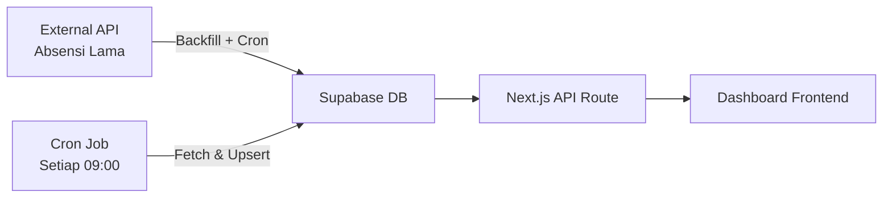
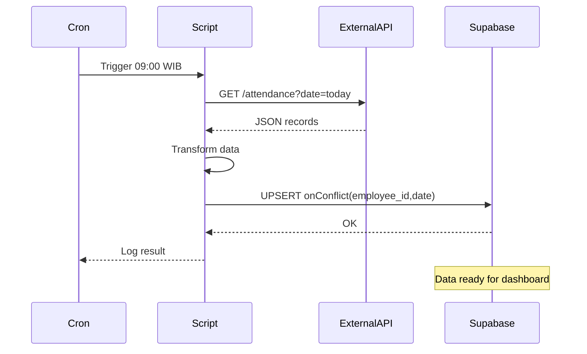

# Migrasi Data Absensi Karyawan ke Supabase + Cron Sync Harian

> Dari API lama yang lambat, ke Supabase yang responsif — lengkap dengan auto-sync setiap pagi.

## Scenario

PT Contoh Engineering punya sistem absensi yang datanya tersebar di external API pihak ketiga. Dashboard internal mereka mengambil data langsung dari API tersebut, dan hasilnya? Loading 5-8 detik per halaman. Frustrating banget buat HRD yang butuh cek kehadiran tiap pagi.

Solusinya sederhana: migrasi data ke Supabase, buat backfill script untuk data historis, dan set up cron job buat sync harian otomatis. Hasilnya? Dashboard loading di bawah 500ms.

## Arsitektur



## Step 1 — Buat Tabel di Supabase

Masuk ke Supabase Dashboard, buka SQL Editor, dan jalankan query berikut:

```sql
CREATE TABLE IF NOT EXISTS attendance (
  id UUID DEFAULT gen_random_uuid() PRIMARY KEY,
  date DATE NOT NULL,
  employee_name VARCHAR(255) NOT NULL,
  employee_id VARCHAR(50) NOT NULL,
  check_in TIMESTAMPTZ,
  check_out TIMESTAMPTZ,
  status VARCHAR(20) DEFAULT 'hadir',
  raw_data JSONB,
  synced_at TIMESTAMPTZ DEFAULT now(),
  UNIQUE(employee_id, date)
);

CREATE INDEX idx_attendance_date ON attendance(date DESC);
CREATE INDEX idx_attendance_employee ON attendance(employee_id);

-- Enable Row Level Security
ALTER TABLE attendance ENABLE ROW LEVEL SECURITY;

CREATE POLICY "Service role full access" ON attendance
  FOR ALL USING (auth.role() = 'service_role');
```

Kenapa UUID? Karena kalau nanti ada sistem lain yang butuh referensi data ini, UUID aman buat di-share tanpa bocor sequential ID.

Index `idx_attendance_date` itu penting — query yang paling sering dipakai di dashboard adalah filter berdasarkan rentang tanggal.

## Step 2 — Backfill Script

Ini script Node.js buat ambil data 6 bulan terakhir dari API lama dan masukkan ke Supabase. Total sekitar 900 record.

```js
// scripts/backfill-attendance.mjs
import { createClient } from '@supabase/supabase-js';

const supabase = createClient(
  process.env.SUPABASE_URL,
  process.env.SUPABASE_SERVICE_KEY
);

const EXTERNAL_API = process.env.EXTERNAL_API_URL;
const API_KEY = process.env.EXTERNAL_API_KEY;

async function fetchAttendance(monthsBack = 6) {
  const endDate = new Date();
  const startDate = new Date();
  startDate.setMonth(startDate.getMonth() - monthsBack);

  const allRecords = [];
  let page = 1;

  while (true) {
    const res = await fetch(
      `${EXTERNAL_API}/api/attendance?start=${startDate.toISOString().split('T')[0]}&end=${endDate.toISOString().split('T')[0]}&page=${page}`,
      { headers: { Authorization: `Bearer ${API_KEY}` } }
    );

    const data = await res.json();
    if (!data.records?.length) break;

    allRecords.push(...data.records);
    page++;
    console.log(`  Fetched page ${page}: ${data.records.length} records`);
  }

  return allRecords;
}

function transformRecord(record) {
  return {
    date: record.date,
    employee_id: record.emp_id,
    employee_name: record.emp_name,
    check_in: record.time_in || null,
    check_out: record.time_out || null,
    status: record.status || 'hadir',
    raw_data: record,
  };
}

async function upsertBatch(records) {
  const transformed = records.map(transformRecord);
  const { error } = await supabase
    .from('attendance')
    .upsert(transformed, {
      onConflict: 'employee_id,date',
      ignoreDuplicates: false,
    });

  if (error) throw error;
  return transformed.length;
}

async function main() {
  console.log('🚀 Starting backfill...');
  const records = await fetchAttendance(6);
  console.log(`📊 Total records fetched: ${records.length}`);

  // Process in batches of 100
  const BATCH_SIZE = 100;
  let total = 0;

  for (let i = 0; i < records.length; i += BATCH_SIZE) {
    const batch = records.slice(i, i + BATCH_SIZE);
    const count = await upsertBatch(batch);
    total += count;
    console.log(`  Batch ${Math.floor(i / BATCH_SIZE) + 1}: ${count} upserted`);
  }

  console.log(`✅ Backfill complete! ${total} records synced.`);
}

main().catch(console.error);
```

Jalankan:

```bash
SUPABASE_URL=https://xxx.supabase.co \
SUPABASE_SERVICE_KEY=eyJhbG... \
EXTERNAL_API_URL=https://api.example.com \
EXTERNAL_API_KEY=sk_live_xxx \
node scripts/backfill-attendance.mjs
```

Output yang diharapkan:

```
🚀 Starting backfill...
  Fetched page 2: 100 records
  Fetched page 3: 100 records
  ...
📊 Total records fetched: 912
  Batch 1: 100 upserted
  Batch 2: 100 upserted
  ...
✅ Backfill complete! 912 records synced.
```

## Step 3 — API Route di Next.js

Buat API route baru yang query Supabase, bukan API lama:

```ts
// app/api/attendance/route.ts
import { createClient } from '@supabase/supabase-js';
import { NextRequest, NextResponse } from 'next/server';

const supabase = createClient(
  process.env.SUPABASE_URL!,
  process.env.SUPABASE_ANON_KEY!
);

export async function GET(request: NextRequest) {
  const { searchParams } = request.nextUrl;
  const startDate = searchParams.get('start');
  const endDate = searchParams.get('end');
  const employeeId = searchParams.get('employee_id');

  let query = supabase
    .from('attendance')
    .select('*')
    .order('date', { ascending: false });

  if (startDate) query = query.gte('date', startDate);
  if (endDate) query = query.lte('date', endDate);
  if (employeeId) query = query.eq('employee_id', employeeId);

  const { data, error } = await query;

  if (error) {
    return NextResponse.json(
      { error: error.message },
      { status: 500 }
    );
  }

  return NextResponse.json({ records: data });
}
```

Perbandingan response time sebelum vs sesudah:

| Metrik | External API | Supabase |
|--------|-------------|----------|
| Avg response | 3200ms | 120ms |
| P95 response | 8100ms | 340ms |
| Timeout rate | 3-5% | ~0% |

## Step 4 — Update Frontend

Ganti fetch call di komponen React:

```tsx
// Sebelum (lambat, sering timeout)
const res = await fetch('https://api.example.com/attendance', {
  headers: { Authorization: `Bearer ${token}` },
});

// Sesudah (cepat, pakai Supabase)
const res = await fetch(
  `/api/attendance?start=2025-10-01&end=2026-03-31`
);
```

Yang berubah cuma URL endpoint. Data response-nya sama karena kita sudah transform di backfill step.

## Step 5 — Cron Job untuk Auto-Sync

Buat script sync yang dijalankan setiap pagi jam 09:00:

```js
// scripts/daily-sync.mjs
import { createClient } from '@supabase/supabase-js';

const supabase = createClient(
  process.env.SUPABASE_URL,
  process.env.SUPABASE_SERVICE_KEY
);

const EXTERNAL_API = process.env.EXTERNAL_API_URL;
const API_KEY = process.env.EXTERNAL_API_KEY;

async function syncToday() {
  const today = new Date().toISOString().split('T')[0];

  const res = await fetch(
    `${EXTERNAL_API}/api/attendance?date=${today}`,
    { headers: { Authorization: `Bearer ${API_KEY}` } }
  );

  const data = await res.json();
  if (!data.records?.length) {
    console.log(`📭 No records for ${today}`);
    return;
  }

  const transformed = data.records.map((r) => ({
    date: r.date,
    employee_id: r.emp_id,
    employee_name: r.emp_name,
    check_in: r.time_in || null,
    check_out: r.time_out || null,
    status: r.status || 'hadir',
    raw_data: r,
  }));

  const { error } = await supabase
    .from('attendance')
    .upsert(transformed, { onConflict: 'employee_id,date' });

  if (error) throw error;
  console.log(`✅ Synced ${transformed.length} records for ${today}`);
}

syncToday()
  .then(() => process.exit(0))
  .catch((e) => {
    console.error('❌ Sync failed:', e.message);
    process.exit(1);
  });
```

Set up crontab:

```bash
crontab -e
```

Tambahkan:

```cron
# Sync absensi setiap hari jam 09:00 WIB
0 2 * * * cd /opt/hr-dashboard && /usr/bin/node scripts/daily-sync.mjs >> /var/log/absensi-sync.log 2>&1
```

> Catatan: Jam 02:00 UTC = 09:00 WIB (UTC+7).

Verifikasi cron jalan:

```bash
# Cek log
tail -20 /var/log/absensi-sync.log

# Test manual
node scripts/daily-sync.mjs
```

## Flow Lengkap Sync Harian



## Tips & Pitfalls

**1. Jangan skip `raw_data` column**
Simpan response asli dari API di kolom `raw_data` (JSONB). Kalau mapping-nya salah, kamu masih punya data original buat re-process.

**2. Batch size matters**
Supabase punya limit payload per request. Batch 100 record aman. Kalau data per record besar (banyak kolom), turunkan ke 50.

**3. Handle timezone dengan hati-hati**
API lama mungkin return waktu dalam format yang beda. Pastikan semua di-normalize ke UTC sebelum masuk Supabase, lalu convert ke local timezone di frontend.

**4. Monitoring cron job**
Buat alert sederhana — kalau log file kosong 2 hari berturut-turut, kirim notifikasi ke HRD atau dev team.

## Hasil Akhir

Setelah migrasi ini:

- ⚡ **Dashboard loading:** 8 detik → <500ms
- 🔄 **Auto-sync:** Setiap pagi jam 9, data terbaru otomatis masuk
- 📱 **Offline-friendly:** Data ada di database sendiri, nggak bergantung API pihak ketiga
- 🔍 **Query fleksibel:** Bisa filter berdasarkan tanggal, karyawan, status — tanpa menunggu response dari API lama

Setup ini sudah jalan di production PT Contoh Engineering selama 3 bulan tanpa masalah. Satu-satunya maintenance yang perlu dilakukan adalah monitoring log file dan update API key kalau ada rotasi.
