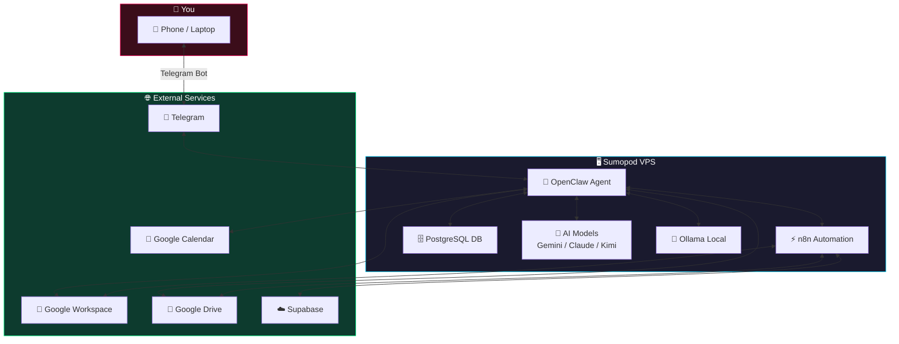
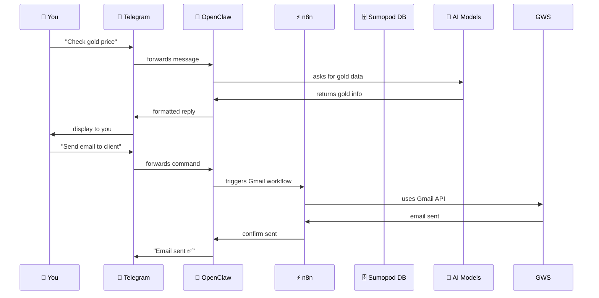
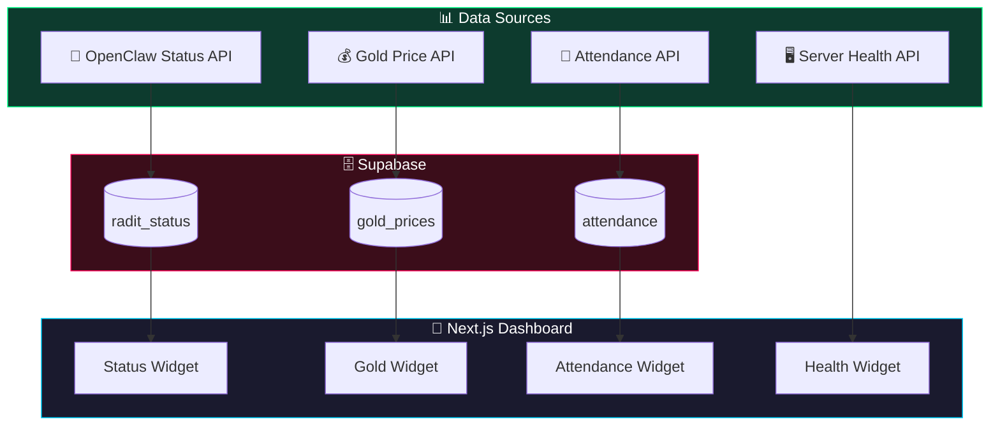
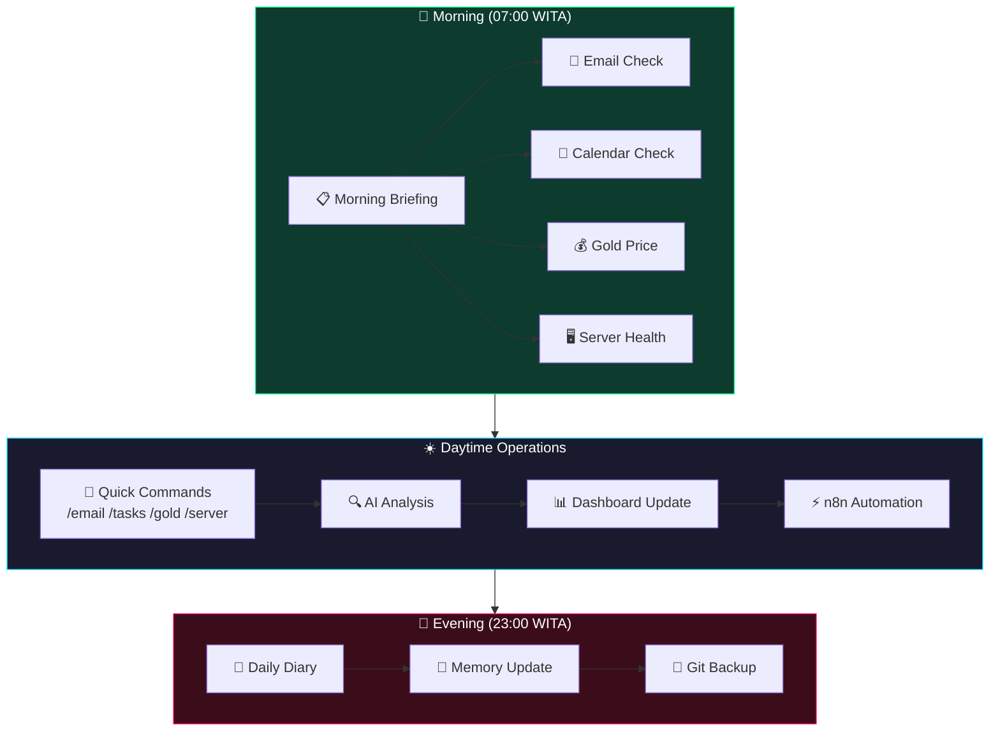
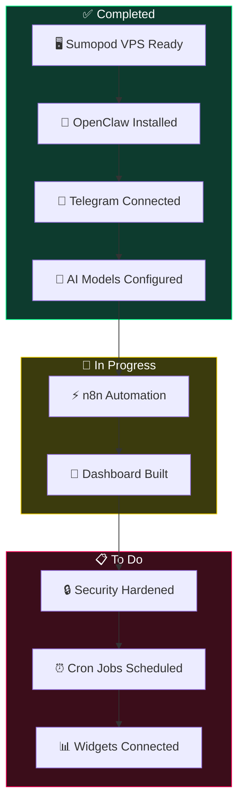

# How to Build an AI Agent Dashboard with OpenClaw + Sumopod VPS

> **Estimated reading time:** 15–20 minutes  
> **Difficulty:** Intermediate  
> **Last updated:** April 2026  
> **Prerequisites:** A Sumopod VPS, Telegram account, basic terminal familiarity

---

## What Are We Building?

You want an AI agent that:

- **Never sleeps** — runs 24/7 on a dedicated VPS
- **Talks to you on Telegram** — real-time alerts, commands, and reports
- **Connects to your business data** — emails, calendars, analytics, databases
- **Has a beautiful dashboard** — live status, gold prices, attendance reports
- **Runs on premium AI models** — without managing a dozen API keys

This guide shows you how to wire it all together using **OpenClaw** running on a **Sumopod VPS**. Everything from zero to production-grade AI assistant in one place.

**Sumopod** is an affiliate VPS provider that gives you everything you need out of the box — compute, AI model access, n8n automation, PostgreSQL database, and more. Think of it as a "AI-in-a-box" platform. You can sign up here: [https://blog.fanani.co/sumopod](https://blog.fanani.co/sumopod)

---

## Architecture Overview

Before we touch a single command, let's look at how all the pieces connect.



### How Data Flows



### AI Model Routing Strategy

Not every task needs the most expensive model. Here's how a smart agent routes requests:

```mermaid
flowchart LR
    subgraph Incoming["📥 Incoming Task"]
        Q[("Question/Command")]
    end

    subgraph Routing["🧭 Model Router"]
        DEC[("Decision Engine")]
    end

    subgraph Tiers["💎 Model Tiers"]
        T1["Tier 1: Kimi / Gemini / DeepSeek<br/>Cost: ~$0.002–0.005<br/>Use: Summaries, search, formatting")]
        T2["Tier 2: Claude 4.5 / GPT-4o<br/>Cost: ~$0.01–0.02<br/>Use: Complex coding, deep analysis"]
        T3["Tier 3: Opus 4.6 / o1<br/>Cost: ~$0.05+<br/>Use: Architectural decisions, research"]
    end

    Q --> DEC
    DEC -->|Simple task| T1
    DEC -->|Medium task| T2
    DEC -->|Hard task| T3

    style Routing fill:#1a1a2e,stroke:#ffd700,color:#fff
    style T1 fill:#0d3b2e,stroke:#00ff88,color:#fff
    style T2 fill:#3b1a0d,stroke:#ff9500,color:#fff
    style T3 fill:#3b0d1a,stroke:#ff0055,color:#fff
```

**Key principle:** 80% of tasks are Tier 1. Only escalate to Tier 2/3 when Tier 1 fails or when the task complexity demands it.

---

## Step 1: Get Your Sumopod VPS

First things first — you need a VPS that can handle OpenClaw, n8n, and AI workloads.

**Why Sumopod?** It's designed specifically for AI and automation workloads. Instead of managing 5 different services across 5 different providers, Sumopod gives you:

| Feature | What's Included |
|---------|-----------------|
| **Compute** | High-performance VPS with generous RAM |
| **AI Models** | Access to Gemini, Claude, Kimi, DeepSeek and more |
| **Automation** | Pre-configured n8n instance |
| **Database** | PostgreSQL ready to use |
| **Networking** | Custom domains, SSL, email routing |

Sign up via my affiliate link to support this content: [https://blog.fanani.co/sumopod](https://blog.fanani.co/sumopod)

Once your VPS is ready, note down:
- Server IP address
- SSH credentials (root password or SSH key)
- Domain name (if you have one pointed to the VPS)

---

## Step 2: Install OpenClaw on Sumopod VPS

SSH into your VPS:

```bash
ssh root@YOUR_VPS_IP
```

Update the system and install prerequisites:

```bash
apt update && apt upgrade -y
apt install -y curl wget git build-essential python3 python3-pip
```

### Install Node.js (required for OpenClaw)

```bash
curl -fsSL https://deb.nodesource.org/setup_22.x | bash -
apt install -y nodejs
node --version  # Should show v22.x
```

### Install OpenClaw

```bash
curl -fsSL https://openclaw.ai/install.sh | sh
# Or follow the official guide at https://docs.openclaw.ai
```

### Configure OpenClaw as a System Service

So it auto-restarts on boot:

```bash
cat > /etc/systemd/system/openclaw.service << 'EOF'
[Unit]
Description=OpenClaw Gateway
After=network.target

[Service]
Type=simple
User=root
WorkingDirectory=/root
ExecStart=/usr/local/bin/openclaw gateway start
Restart=always
RestartSec=10
Environment=NODE_ENV=production

[Install]
WantedBy=multi-user.target
EOF

systemctl enable openclaw
systemctl start openclaw
systemctl status openclaw
```

You should see `active (running)` in green.

---

## Step 3: Connect Telegram Bot

OpenClaw works best with Telegram for real-time communication.

### Create a Telegram Bot

1. Open Telegram and search for **@BotFather**
2. Send `/newbot`
3. Give it a name (e.g., "My AI Assistant")
4. Give it a username (e.g., `myai_assistant_bot`)
5. Copy the **bot token** — looks like `123456789:ABCdefGhIJKlmNoPQRstuVWxyZ`

### Add the Bot to OpenClaw

Edit your OpenClaw config:

```bash
nano ~/.openclaw/config.json
```

Add the Telegram plugin:

```json
{
  "plugins": {
    "telegram": {
      "enabled": true,
      "botToken": "YOUR_TELEGRAM_BOT_TOKEN",
      "allowedUsers": ["YOUR_TELEGRAM_USER_ID"]
    }
  }
}
```

To find your Telegram user ID, message **@userinfobot** on Telegram — it will tell you your numeric user ID.

Restart OpenClaw:

```bash
systemctl restart openclaw
```

Send a message to your bot on Telegram. If it responds, you're connected! ✅

---

## Step 4: Set Up AI Model Access

OpenClaw is model-agnostic — you wire in whichever AI providers you prefer. Here's the recommended stack:

### Primary: Gemini (via Google AI API)

Gemini is your daily driver. Fast, cheap, excellent for summaries and reasoning.

1. Get your API key at [https://aistudio.google.com/app/apikey](https://aistudio.google.com/app/apikey)
2. Add to OpenClaw config:

```json
{
  "models": {
    "primary": "gemini-2.0-flash",
    "apiKeys": {
      "gemini": "YOUR_GEMINI_API_KEY"
    }
  }
}
```

### Secondary: Kimi / Moonshot (for Korean/Chinese language tasks)

Kimi excels at Korean and Chinese language tasks, and has excellent reasoning.

```json
{
  "apiKeys": {
    "moonshot": "YOUR_KIMI_API_KEY"
  }
}
```

### Tertiary: Ollama (free local models)

For lightweight background tasks, Ollama runs directly on your VPS at zero cost.

```bash
# Install Ollama
curl -fsSL https://ollama.ai/install.sh | sh
ollama pull llama3.1
ollama pull phi3
```

```json
{
  "models": {
    "ollama": {
      "enabled": true,
      "baseUrl": "http://localhost:11434"
    }
  }
}
```

### Premium: Claude (for complex tasks only)

Only use Claude when Tier 1 models fail or for architectural decisions.

```json
{
  "apiKeys": {
    "claude": "YOUR_CLAUDE_API_KEY"
  }
}
```

**Cost optimization tip:** Set up automatic model routing. Most tasks (summaries, formatting, simple Q&A) go to Gemini/Kimi. Only escalate to Claude for complex coding or deep analysis.

---

## Step 5: Install and Configure n8n

n8n handles the heavy automation lifting — email processing, Google Workspace integrations, and webhook workflows.

### Install n8n on Sumopod

```bash
npm install -g n8n
```

Or use Docker:

```bash
docker run --name n8n -d \
  --restart always \
  -p 5678:5678 \
  -v n8n_data:/home/node/.n8n \
  n8nio/n8n
```

### Secure n8n

```bash
# Set a strong password
docker exec n8n n8n user-management:reset
```

Access n8n at `http://YOUR_VPS_IP:5678`. Set up SSL with nginx reverse proxy:

```nginx
# /etc/nginx/sites-available/n8n
server {
    listen 80;
    server_name n8n.yourdomain.com;
    return 301 https://$server_name$request_uri;
}

server {
    listen 443 ssl http2;
    server_name n8n.yourdomain.com;

    ssl_certificate /etc/letsencrypt/live/n8n.yourdomain.com/fullchain.pem;
    ssl_certificate_key /etc/letsencrypt/live/n8n.yourdomain.com/privkey.pem;

    location / {
        proxy_pass http://localhost:5678;
        proxy_set_header Host $host;
        proxy_set_header X-Real-IP $remote_addr;
        proxy_set_header X-Forwarded-For $proxy_add_x_forwarded_for;
        proxy_set_header X-Forwarded-Proto $scheme;
    }
}
```

### Connect Google Workspace to n8n

n8n has native Google Workspace nodes for:

- **Gmail** — read, send, label emails
- **Google Drive** — upload/download files
- **Google Sheets** — read/write spreadsheet data
- **Google Calendar** — create/read events
- **Google Tasks** — manage tasks

In n8n, go to **Credentials** → **Google OAuth2** and authenticate with your Google account. You'll need:

1. A Google Cloud project with the relevant APIs enabled
2. OAuth 2.0 client credentials
3. n8n's callback URL added to your Google OAuth allowed redirect URIs

For Sumopod's n8n instance, the callback URL will be:
```
https://n8n.yourdomain.com/rest/oauth2-credential/callback
```

---

## Step 6: Build Your Dashboard

Now the fun part — a beautiful live dashboard that shows your AI agent's status.

### Architecture



### Deploy Next.js Dashboard

```bash
# On your local machine (not the VPS)
git clone https://github.com/yourusername/radit-dashboard.git
cd radit-dashboard
npm install
npm run build
# Deploy to Vercel or your own server
```

### Key Dashboard Widgets

**1. Agent Status Widget**

Shows real-time OpenClaw session data:

```typescript
// app/api/status/route.ts
export async function GET() {
  const { data } = await supabase
    .from('radit_status')
    .select('*')
    .order('created_at', { ascending: false })
    .limit(1)
    .single();

  return Response.json({
    model: data?.model || 'gemini-2.0-flash',
    contextUsed: data?.context_tokens || 0,
    sessionsToday: data?.session_count || 0,
    uptimeHours: data?.uptime_hours || 0,
  });
}
```

**2. Gold Price Widget**

Fetches from LogamMulia and stores in Supabase:

```typescript
// app/api/gold-history/route.ts
export async function GET() {
  const { data } = await supabase
    .from('gold_prices')
    .select('date, price_jual, price_beli')
    .order('date', { ascending: false })
    .limit(30);

  return Response.json(data);
}
```

**3. Attendance Report Widget**

For businesses with multiple employees:

```typescript
// app/api/attendance/route.ts
export async function GET(req: Request) {
  const { searchParams } = new URL(req.url);
  const date = searchParams.get('date') || new Date().toISOString().split('T')[0];

  const { data } = await supabase
    .from('attendance')
    .select('*')
    .eq('date', date);

  return Response.json(data);
}
```

---

## Step 7: Automate Everything with Cron Jobs

Your AI agent should work while you sleep. Set up automated tasks.

### Morning Briefing (7:00 AM WITA)

Every morning at 7 AM Western Indonesian Time, you get a Telegram message with:

- 📧 Unread emails
- 📅 Today's calendar events
- 📋 Pending tasks
- 💰 Gold price
- 🖥️ Server health status

```bash
# Crontab entry
0 7 * * * /root/.openclaw/workspace-radit/skills/morning-briefing/scripts/generate.sh --send
```

### Evening Report (11:00 PM WITA)

End-of-day summary with diary entry generation:

```bash
# Crontab entry
0 23 * * * /root/.openclaw/workspace-radit/scripts/auto-diary-memory.sh
```

### Periodic Health Checks

```bash
# Every 5 minutes - service health
*/5 * * * * /root/.openclaw/workspace-radit/scripts/service-health-check.sh

# Every 15 minutes - brute force detection
*/15 * * * * /root/.openclaw/workspace-radit/scripts/brute-force-monitor.sh

# Every hour - server vibes check
0 * * * * bash /root/.openclaw/workspace-radit/scripts/vibes-monitor.sh
```

### Gold Price Tracking (Every 4 Hours)

```bash
# At 7:00, 8:00, 10:10, and 18:00 WITA
0 7,18 * * * /root/.openclaw/workspace-radit/scripts/gold-price-monitor.sh
10 10 * * * /root/.openclaw/workspace-radit/scripts/gold-price-monitor.sh
```

---

## Step 8: Secure Your Setup

Don't expose your VPS to the entire internet. Here's what you need:

### Firewall (UFW)

```bash
ufw default deny incoming
ufw default allow outgoing
ufw allow ssh
ufw allow 443/tcp  # HTTPS
ufw allow 80/tcp   # HTTP
ufw enable
systemctl enable ufw
```

### Fail2Ban

```bash
apt install -y fail2ban
systemctl enable fail2ban
systemctl start fail2ban
```

This automatically bans IPs that fail to log in via SSH more than 5 times.

### SSL Certificates

```bash
apt install -y certbot python3-certbot-nginx
certbot --nginx -d yourdomain.com
# Auto-renewal is configured automatically
```

### Environment Variable Security

Never commit API keys to Git. Use environment variables:

```bash
# ~/.bashrc or /etc/environment
export GEMINI_API_KEY="your_key_here"
export TELEGRAM_BOT_TOKEN="your_token_here"
export SUPABASE_URL="your_project_url"
export SUPABASE_KEY="your_anon_key"
```

For production, use a secrets manager.

---

## Step 9: Connect Business Tools

### Gmail Integration

Your AI agent can read and send emails on your behalf:

```bash
# Using Gog CLI (fast, no webhook latency)
gog gmail list --max 10
gog gmail search "is:unread subject:invoice"
gog gmail send --to client@example.com --subject "Invoice" --body "Please find attached..."
```

### Google Calendar

```bash
gog calendar events list --today
gog calendar event create \
  --title "Client Meeting" \
  --start "2026-04-05T10:00:00" \
  --end "2026-04-05T11:00:00" \
  --attendees "client@example.com"
```

### Google Drive

```bash
gog drive ls
gog drive upload --name "Invoice.pdf" --path /path/to/file.pdf
```

### Supabase Database

For custom business data:

```typescript
// Direct database query
const { data, error } = await supabase
  .from('projects')
  .select('*')
  .eq('status', 'active')
  .order('created_at', { ascending: false });
```

---

## Step 10: Monitor and Maintain

### VIBES Monitor — Server Health Visualization

Instead of boring plain numbers, use a visual health dashboard:

```bash
bash /root/.openclaw/workspace-radit/scripts/vibes-monitor.sh
```

Output looks like:

```
📊 SERVER VIBES 🌴
✨ CHILL MODE

💻 CPU LOAD 😌
▓▒░░░░░░░░░░░░░░░░░ 12%
_Santai bro, lagi ngopi ☕_

🧠 MEMORY 🧘
██████████░░░░░░░░░░ 42%
_Masih longgar, 3.9GB free 😎_
```

### Disk Cleanup Automation

```bash
# Auto-cleanup when disk hits 80%
df -h / | awk 'NR==2 {print $5}' | tr -d '%'
# If > 80, run:
pip cache purge
npm cache clean --force
docker system prune -af
```

### Log Rotation

```bash
# Weekly log cleanup
0 4 * * 0 /root/.openclaw/workspace-radit/scripts/log-rotation.sh
```

---

## Putting It All Together

Here's the complete flow from morning to night:



---

## Recommended Reading

Want to go deeper? Here are related tutorials:

- [Morning Briefing Automation](https://github.com/fanani-radian/openclaw-sumopod/blob/main/tutorials/morning-briefing-automation.md) — Set up the perfect wake-up report
- [Email Classification with AI](https://github.com/fanani-radian/openclaw-sumopod/blob/main/tutorials/email-classification-ai.md) — Automatically sort and prioritize emails
- [n8n Google Workspace Integration](https://github.com/fanani-radian/openclaw-sumopod/blob/main/tutorials/n8n-google-workspace.md) — Full automation cookbook
- [Self-Evolving AI Agents](https://github.com/fanani-radian/openclaw-sumopod/blob/main/tutorials/self-evolving-agents.md) — Make your agent improve itself

---

## Summary Checklist

Here's your deployment checklist:



---

## Get Started

Ready to build your AI agent dashboard? The easiest way to get all the infrastructure you need in one place is through **Sumopod** — a VPS platform designed for AI and automation workloads.

👉 **[Sign up via my affiliate link](https://blog.fanani.co/sumopod)** — it helps support this content at no extra cost to you.

With Sumopod, you get:
- **Instant AI model access** — Gemini, Claude, Kimi, DeepSeek
- **Pre-configured n8n** — automation workflows ready to use
- **PostgreSQL database** — for your custom data
- **High-performance VPS** — runs 24/7 without bottlenecks
- **Sumopod Card** — coming soon for payments

Everything you need to build a production-grade AI agent is right there.

---

*This guide was last tested on OpenClaw v2026.2.13 running on Sumopod VPS with Ubuntu 22.04 LTS.*
