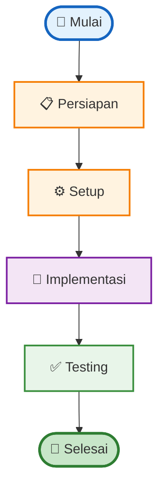
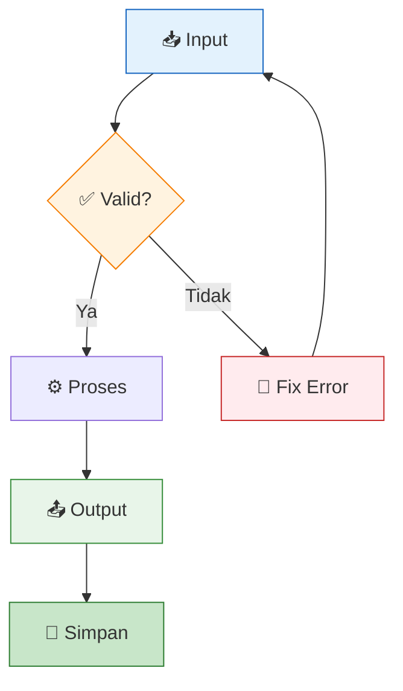
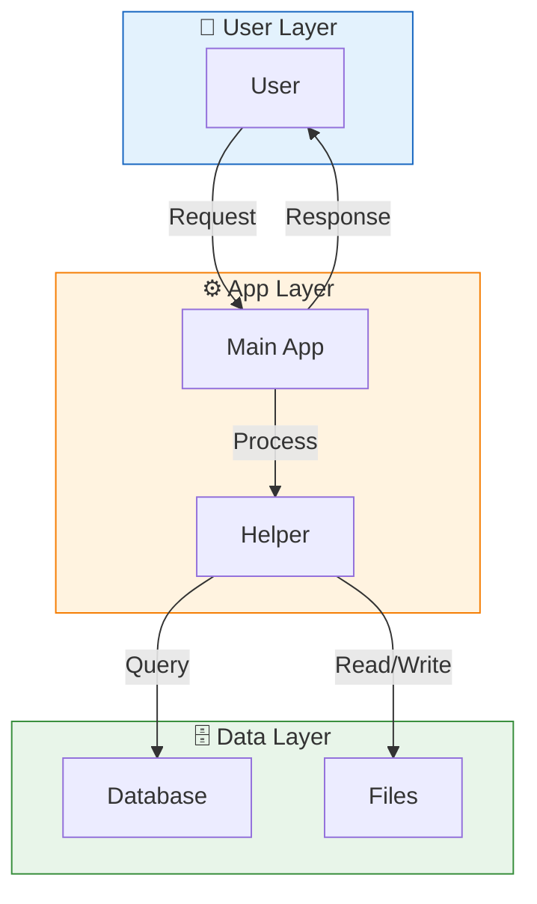

# Architecture Patterns for OpenClaw

📅 Dibuat: 2026-04-03 | Tipe: architecture | ID: architecture-1775228405

---

## 📋 Metadata

- **Level**: 🔴 Lanjut
- **Waktu**: 40-50 min
- **Perlu tahu dulu**: Software design experience, Understanding of patterns

---

## 🎯 Apa yang Bakal Kamu Buat?

Design patterns and structural decisions

Setelah ikutin tutorial ini, kamu bakal bisa:
- ✅ Paham konsep dasarnya
- ✅ Punya implementasi yang jalan
- ✅ Tau best practices-nya
- ✅ Bisa troubleshoot kalau ada error

---

## 🏗️ Arsitektur / Alur

### 1️⃣ Gambaran Besar



### 2️⃣ Detail Alur



### 3️⃣ Arsitektur Sistem



---

## 📝 Langkah-langkah

### Step 1: Persiapan 📋

Sebelum mulai, pastikan:
- [ ] Tools sudah keinstall
- [ ] Punya akses ke resources yang perlu
- [ ] Paham dasar dari: Software design experience

### Step 2: Setup ⚙️

Buat struktur folder:

```bash
mkdir -p my-project/{src,config,tests}
cd my-project
```

### Step 3: Implementasi 🔧

Ini kode utama:

```bash
#!/bin/bash
# script.sh

echo "Hello World!"
```

### Step 4: Konfigurasi ⚡

Buat file config:

```bash
cat > config/settings.json << 'CONFIG'
{
  "nama": "my-project",
  "versi": "1.0.0",
  "env": "production"
}
CONFIG
```

### Step 5: Testing ✅

Cara ngetes:

```bash
# Test manual
bash script.sh --dry-run

# Atau run test suite
bash tests/test.sh
```

### Step 6: Deploy 🚀

Jalankan di production:

```bash
# Bikin executable
chmod +x script.sh

# Jalankan
./script.sh
```

---

## 🔧 Troubleshooting

### Masalah Umum

| Masalah | Penyebab | Solusi |
|---------|----------|--------|
| ❌ Permission denied | File belum executable | `chmod +x script.sh` |
| ❌ Command not found | Dependency belum install | Install dulu package-nya |
| ❌ Connection failed | Network/API error | Cek koneksi internet |

### Mode Debug

Lihat detail error:
```bash
bash -x script.sh
```

### Dapet Bantuan

- Cek log: `tail -f /var/log/app.log`
- Baca docs: `cat SKILL.md`
- Buka issue di GitHub

---

## 🚀 Next Steps

- [ ] Explore fitur lanjutan
- [ ] Customize sesuai kebutuhan
- [ ] Share hasilnya
- [ ] Kontribusi improvement

---

## 📚 Referensi

- [OpenClaw Sumopod](https://github.com/fanani-radian/openclaw-sumopod)
- [Memory: 2026-04-03](memory/2026-04-03.md)
