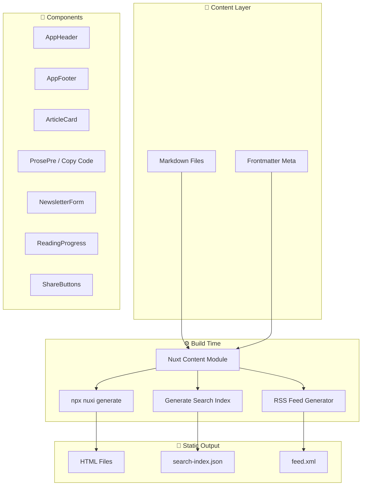
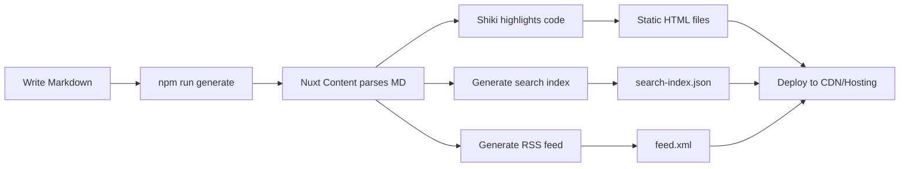

# 📝 Build Blog Statis dengan Nuxt Content + Tailwind CSS

> Panduan lengkap membangun blog statis menggunakan Nuxt 3, Nuxt Content, dan Tailwind CSS — dari nol sampai deploy.

**Live demo:** [blog.fanani.co](https://blog.fanani.co)

---

## 🎯 Apa yang Akan Dibangun

Blog statis dengan fitur:

- 📝 **Markdown Content** — Tulis artikel dalam format markdown dengan frontmatter
- 🎨 **Tailwind CSS** — Styling modern dan responsif
- 🌙 **Dark Mode** — Via [Darkmode.js](https://github.com/sandoche/Darkmode.js) (CDN)
- 🔍 **Fuzzy Search** — Via [Fuse.js](https://github.com/fusejs/fuse.js) (CDN)
- 📊 **Reading Progress Bar** — Progress bar di atas halaman saat scroll
- 📋 **Copy Code Button** — Satu klik copy untuk semua code block
- 📧 **Newsletter Form** — Form subscribe newsletter
- 📡 **RSS Feed** — Feed XML di `/feed.xml`
- 📤 **Share Buttons** — WhatsApp, Twitter, LinkedIn, copy link
- 🏷️ **Article Cards** — Card dengan reading time, tags, dan tanggal
- 💡 **Syntax Highlighting** — Shiki dengan tema one-dark-pro

---

## 🏗️ Architecture



---

## 📁 Project Structure

```
blog-fanani/
├── content/
│   ├── tech/              # Tech articles (markdown)
│   └── eng/               # Engineering articles (markdown)
├── components/
│   ├── AppHeader.vue
│   ├── AppFooter.vue
│   ├── ArticleCard.vue
│   ├── NewsletterForm.vue
│   ├── ReadingProgress.vue
│   ├── ShareButtons.vue
│   └── content/
│       └── ProsePre.vue   # Override: copy code button
├── pages/
│   ├── index.vue
│   ├── search.vue
│   ├── about.vue
│   ├── tech/[slug].vue
│   └── eng/[slug].vue
├── public/
│   └── search-index.json
├── nuxt.config.ts
└── tailwind.config.ts
```

---

## 🛠️ Step-by-Step

### Step 1: Inisialisasi Project

```bash
npx nuxi init blog-fanani
cd blog-fanani
npm install @nuxt/content @nuxtjs/tailwindcss
```

---

### Step 2: Konfigurasi Nuxt

`nuxt.config.ts`:

```typescript
export default defineNuxtConfig({
  modules: ['@nuxt/content', '@nuxtjs/tailwindcss'],
  
  content: {
    sources: {
      tech: { driver: 'local', base: '/content/tech' },
      eng: { driver: 'local', base: '/content/eng' },
    },
    highlight: {
      theme: 'one-dark-pro',
      langs: ['javascript', 'typescript', 'python', 'bash', 'json', 'vue'],
    },
  },
  
  app: {
    head: {
      script: [
        {
          src: 'https://cdn.jsdelivr.net/npm/darkmode-js@1.5.7/lib/darkmode-js.min.js',
          defer: true,
        },
        {
          innerHTML: `
            window.addEventListener('load', function() {
              new Darkmode({
                saveInCookies: true,
                label: '🌓',
                autoMatchOsTheme: true,
                time: '0.3s'
              }).showWidget();
            });
          `,
          type: 'text/javascript',
        },
      ],
      link: [
        {
          rel: 'stylesheet',
          href: 'https://cdn.jsdelivr.net/npm/darkmode-js@1.5.7/lib/darkmode-js.min.css',
        },
      ],
    },
  },
  
  nitro: {
    prerender: { routes: ['/feed.xml'] },
  },
})
```

---

### Step 3: Tailwind Config

`tailwind.config.ts`:

```typescript
export default {
  darkMode: 'class',
  content: [
    './components/**/*.{js,vue,ts}',
    './layouts/**/*.vue',
    './pages/**/*.vue',
  ],
  theme: {
    extend: {},
  },
  plugins: [],
}
```

---

### Step 4: Tulis Konten Markdown

Buat artikel di `content/tech/setup-nuxt3-tailwind.md`:

```markdown
---
title: "Setup Nuxt 3 dengan Tailwind CSS"
description: "Panduan lengkap setup Nuxt 3 dengan Tailwind CSS dari nol"
date: "2026-04-01"
tags: ["nuxt3", "tailwind", "frontend"]
author: "Fanani"
---

## Pendahuluan

Nuxt 3 adalah framework Vue.js yang powerful...

## Instalasi

```bash
npx nuxi init my-blog
cd my-blog
npm install
```
```

---

### Step 5: Component — Article Card

`components/ArticleCard.vue`:

```vue
<template>
  <NuxtLink :to="article._path" 
    class="block p-5 rounded-xl border border-gray-200 hover:border-blue-400 
           hover:shadow-lg transition-all duration-300 group">
    <div class="flex items-center gap-3 mb-3">
      <span class="px-2.5 py-0.5 text-xs font-medium rounded-full 
                   bg-blue-100 text-blue-700">
        {{ article.type || 'tech' }}
      </span>
      <span class="text-sm text-gray-400">{{ article.date }}</span>
      <span class="text-sm text-gray-400">{{ readingTime }} min read</span>
    </div>
    <h2 class="text-xl font-bold text-gray-800 group-hover:text-blue-600 mb-2">
      {{ article.title }}
    </h2>
    <p class="text-gray-600 text-sm leading-relaxed mb-3">
      {{ article.description }}
    </p>
    <div class="flex flex-wrap gap-2">
      <span v-for="tag in article.tags" :key="tag"
        class="text-xs px-2 py-0.5 rounded-full bg-gray-100 text-gray-600">
        #{{ tag }}
      </span>
    </div>
  </NuxtLink>
</template>

<script setup>
const props = defineProps({ article: Object })
const readingTime = computed(() => {
  if (!props.article?.body) return 1
  const words = props.article.body.plaintext?.split(/\s+/).length || 0
  return Math.max(1, Math.ceil(words / 200))
})
</script>
```

---

### Step 6: Component — Copy Code Button

`components/content/ProsePre.vue`:

```vue
<template>
  <div class="relative group">
    <button @click="copyCode"
      class="absolute top-2 right-2 px-2 py-1 text-xs rounded bg-gray-700 
             text-gray-300 hover:bg-gray-600 opacity-0 group-hover:opacity-100 
             transition-opacity">
      {{ copied ? '✅ Copied!' : '📋 Copy' }}
    </button>
    <pre><code v-html="code" /></pre>
  </div>
</template>

<script setup>
const props = defineProps({ code: String })
const copied = ref(false)

const copyCode = async () => {
  await navigator.clipboard.writeText(props.code)
  copied.value = true
  setTimeout(() => copied.value = false, 2000)
}
</script>
```

---

### Step 7: Component — Reading Progress

`components/ReadingProgress.vue`:

```vue
<template>
  <div class="fixed top-0 left-0 w-full h-1 z-50">
    <div class="h-full bg-blue-500 transition-all duration-150"
         :style="{ width: progress + '%' }" />
  </div>
</template>

<script setup>
const progress = ref(0)
onMounted(() => {
  window.addEventListener('scroll', () => {
    const scrollTop = window.scrollY
    const docHeight = document.documentElement.scrollHeight - window.innerHeight
    progress.value = docHeight > 0 ? (scrollTop / docHeight) * 100 : 0
  })
})
</script>
```

---

### Step 8: Component — Share Buttons

`components/ShareButtons.vue`:

```vue
<template>
  <div class="flex items-center gap-3 py-4 border-t">
    <span class="text-sm text-gray-500">Share:</span>
    <a :href="whatsappUrl" target="_blank"
       class="px-3 py-1 text-sm rounded bg-green-500 text-white hover:bg-green-600">
      WhatsApp
    </a>
    <a :href="twitterUrl" target="_blank"
       class="px-3 py-1 text-sm rounded bg-blue-400 text-white hover:bg-blue-500">
      Twitter
    </a>
    <a :href="linkedinUrl" target="_blank"
       class="px-3 py-1 text-sm rounded bg-blue-700 text-white hover:bg-blue-800">
      LinkedIn
    </a>
    <button @click="copyLink"
       class="px-3 py-1 text-sm rounded bg-gray-500 text-white hover:bg-gray-600">
      {{ copied ? '✅' : '📋' }} Copy
    </button>
  </div>
</template>

<script setup>
const props = defineProps({ title: String, slug: String })
const copied = ref(false)
const url = computed(() => `https://blog.fanani.co${props.slug}`)

const whatsappUrl = computed(() => 
  `https://wa.me/?text=${encodeURIComponent(props.title + ' ' + url.value)}`)
const twitterUrl = computed(() => 
  `https://twitter.com/intent/tweet?text=${encodeURIComponent(props.title)}&url=${encodeURIComponent(url.value)}`)
const linkedinUrl = computed(() => 
  `https://www.linkedin.com/sharing/share-offsite/?url=${encodeURIComponent(url.value)}`)

const copyLink = () => {
  navigator.clipboard.writeText(url.value)
  copied.value = true
  setTimeout(() => copied.value = false, 2000)
}
</script>
```

---

### Step 9: Halaman Artikel Dynamic

`pages/tech/[slug].vue`:

```vue
<template>
  <main class="max-w-3xl mx-auto px-4 py-12">
    <ReadingProgress />
    
    <article>
      <header class="mb-8">
        <div class="flex items-center gap-2 mb-3">
          <span class="px-2 py-0.5 text-xs rounded-full bg-blue-100 text-blue-700">
            tech
          </span>
          <span class="text-sm text-gray-400">{{ article.date }}</span>
          <span class="text-sm text-gray-400">{{ readingTime }} min read</span>
        </div>
        <h1 class="text-3xl font-bold text-gray-800 mb-2">{{ article.title }}</h1>
        <p class="text-gray-600">{{ article.description }}</p>
        <div class="flex gap-2 mt-3">
          <span v-for="tag in article.tags" :key="tag"
            class="text-sm px-2 py-0.5 rounded-full bg-gray-100 text-gray-600">
            #{{ tag }}
          </span>
        </div>
      </header>
      
      <ContentRenderer :value="article" class="prose prose-lg max-w-none" />
      
      <ShareButtons :title="article.title" :slug="article._path" />
    </article>
    
    <NewsletterForm />
  </main>
</template>

<script setup>
const route = useRoute()
const { data: article } = await useAsyncData(route.path, () =>
  queryContent('/tech/' + route.params.slug).findOne()
)

const readingTime = computed(() => {
  if (!article.value?.body) return 1
  const words = article.value.body.plaintext?.split(/\s+/).length || 0
  return Math.max(1, Math.ceil(words / 200))
})

useHead({ title: article.value?.title })
</script>
```

---

### Step 10: RSS Feed

Buat `server/routes/feed.xml.ts`:

```typescript
export default defineEventHandler(async (event) => {
  const docs = await queryContent('/tech').sort({ date: -1 }).limit(20).find()
  
  const feed = `<?xml version="1.0" encoding="UTF-8"?>
<rss version="2.0">
  <channel>
    <title>Blog Fanani</title>
    <link>https://blog.fanani.co</link>
    <description>Tech & Engineering Blog</description>
    ${docs.map(doc => `
    <item>
      <title>${doc.title}</title>
      <link>https://blog.fanani.co${doc._path}</link>
      <description>${doc.description}</description>
      <pubDate>${new Date(doc.date).toUTCString()}</pubDate>
      <guid>https://blog.fanani.co${doc._path}</guid>
    </item>`).join('')}
  </channel>
</rss>`
  
  event.node.res.setHeader('Content-Type', 'application/xml')
  return feed
})
```

---

### Step 11: Static Generation & Deploy

```bash
# Generate static files
npx nuxi generate

# Output di .output/public/
# Deploy ke hosting manapun (Vercel, Netlify, Cloudflare Pages, VPS)
```

---

## 📊 Build Flow



---

## ✅ Hasil Akhir

| Feature | Detail |
|---------|--------|
| 📝 Content | Markdown + frontmatter, auto-parsed oleh Nuxt Content |
| 🎨 Styling | Tailwind CSS, fully responsive |
| 💡 Syntax | Shiki highlight, tema one-dark-pro |
| 📋 Copy Code | Hover code block → click copy |
| 📊 Progress | Blue progress bar saat scroll artikel |
| 🌙 Dark Mode | Darkmode.js CDN, persist di cookies |
| 🔍 Search | Fuse.js fuzzy search + filter tag + sort |
| 📡 RSS | Auto-generated XML feed |
| 📤 Share | WhatsApp, Twitter, LinkedIn, copy link |
| 📧 Newsletter | Subscribe form (integrate dengan backend) |
| ⚡ Performance | Static HTML, zero JS framework overhead |

---

## 🔧 Customization Tips

### Tambah Kategori Baru

```bash
# 1. Buat folder content baru
mkdir content/tutorial

# 2. Tambah source di nuxt.config.ts
sources: {
  tutorial: { driver: 'local', base: '/content/tutorial' },
}

# 3. Buat halaman pages/tutorial/[slug].vue
```

### Ganti Tema Syntax Highlighting

```typescript
// nuxt.config.ts
highlight: {
  theme: 'github-dark', // atau 'nord', 'dracula', 'vitesse-dark'
}
```

---

## 🆘 Troubleshooting

| Problem | Solution |
|---------|----------|
| Content tidak muncul | Pastikan file `.md` ada di folder `content/` yang sesuai source |
| Search index kosong | Jalankan `npm run generate:index` sebelum `nuxi generate` |
| Dark mode tidak kerja | Cek CDN script di `nuxt.config.ts` (lihat tutorial Dark Mode) |
| Copy button tidak muncul | Pastikan `components/content/ProsePre.vue` ada (override default) |
| RSS feed 404 | Pastikan route ada di `server/routes/` dan `nitro.prerender.routes` |

---

> 💡 **Pro Tip:** Nuxt Content + Tailwind = blog statis yang gampang dikelola. Tulis markdown, generate, deploy. Done. Dark mode dan search dari CDN artinya bundle size tetap kecil.

**Live demo:** [blog.fanani.co](https://blog.fanani.co) 🚀
