# 🚀 Membangun AI Agent Dashboard — Tutorial Lengkap (Bagian 1)

> **Next.js 14 + Tailwind CSS + shadcn/ui + Recharts**
> Dari nol sampai dashboard yang bisa dipake buat monitor AI agent kamu.
> Bahasa Indonesia, newbie-friendly, full code — tinggal copy-paste.

---

# 📦 PART 1: Setup & Foundation

Oke, sebelum kita mulai ngoding, kita perlu setup foundation dulu. Bayangin kayak bangun rumah — fondasi harus kuat dulu sebelum pasang atap.

## 1.1 Buat Project Next.js 14

Buka terminal, lalu jalankan:

```bash
npx create-next-app@latest radit-dashboard --typescript --tailwind --app --src-dir --no-eslint
```

Nanti dia nanya beberapa hal, jawab seperti ini:

| Pertanyaan | Jawab |
|---|---|
| Would you like to use import alias? | **Yes** (`@/*`) |

Tunggu sampai selesai, lalu masuk ke folder project:

```bash
cd radit-dashboard
```

> 💡 **Tips:** Pastikan Node.js versi 18+ terinstall. Cek dengan `node -v`. Kalau belum, install pakai `nvm install 18` dulu.

## 1.2 Install Dependencies

Kita butuh beberapa library tambahan:

```bash
# shadcn/ui dependencies
npm install class-variance-authority clsx tailwind-merge lucide-react

# Recharts buat chart
npm install recharts

# shadcn/ui components (nanti kita install per component)
npx shadcn-ui@latest init

# Sonner untuk toast notification
npx shadcn-ui@latest add sonner
npx shadcn-ui@latest add card
npx shadcn-ui@latest add button
npx shadcn-ui@latest add badge
npx shadcn-ui@latest add input
npx shadcn-ui@latest add select
npx shadcn-ui@latest add table
npx shadcn-ui@latest add textarea
npx shadcn-ui@latest add dropdown-menu
npx shadcn-ui@latest add tooltip
npx shadcn-ui@latest add avatar
npx shadcn-ui@latest add separator
npx shadcn-ui@latest add scroll-area
```

> ⚠️ **Pitfall:** Kalau `shadcn-ui` command nggak kerja, coba `npx shadcn@latest add ...` (tanpa `-ui`). shadcn sempat ganti nama package-nya.

## 1.3 Konfigurasi Tailwind CSS

Buka `tailwind.config.ts` dan replace isinya:

```typescript
// tailwind.config.ts
import type { Config } from "tailwindcss";

const config: Config = {
  darkMode: "class",
  content: [
    "./src/pages/**/*.{js,ts,jsx,tsx,mdx}",
    "./src/components/**/*.{js,ts,jsx,tsx,mdx}",
    "./src/app/**/*.{js,ts,jsx,tsx,mdx}",
  ],
  theme: {
    extend: {
      colors: {
        // Warna utama — hijau khas dashboard agent
        primary: {
          50: "#f0fdf4",
          100: "#dcfce7",
          200: "#bbf7d0",
          300: "#86efac",
          400: "#4ade80",
          500: "#22c55e",
          600: "#16a34a",
          700: "#15803d",
          800: "#166534",
          900: "#14532d",
          950: "#052e16",
          DEFAULT: "#22c55e",
        },
        // Accent — gold premium
        accent: {
          50: "#fffbeb",
          100: "#fef3c7",
          200: "#fde68a",
          300: "#fcd34d",
          400: "#fbbf24",
          500: "#f59e0b",
          600: "#d97706",
          700: "#b45309",
          800: "#92400e",
          900: "#78350f",
          DEFAULT: "#fbbf24",
        },
        // Sidebar dark
        sidebar: {
          DEFAULT: "#0f172a",
          hover: "#1e293b",
          active: "#334155",
        },
      },
      fontFamily: {
        sans: ["Inter", "system-ui", "sans-serif"],
        mono: ["JetBrains Mono", "Fira Code", "monospace"],
      },
    },
  },
  plugins: [require("tailwindcss-animate")],
};

export default config;
```

> 💡 **Tips:** Warna hijau = fresh & techy, gold = premium & trustworthy. Kombinasi ini enak dilihat di dashboard yang mostly gelap.

## 1.4 Global Styles

Buka `src/app/globals.css` dan replace:

```css
/* src/app/globals.css */
@tailwind base;
@tailwind components;
@tailwind utilities;

@layer base {
  :root {
    --background: 248 250 252;       /* slate-50 */
    --foreground: 15 23 42;           /* slate-900 */
    --card: 255 255 255;
    --card-foreground: 15 23 42;
    --popover: 255 255 255;
    --popover-foreground: 15 23 42;
    --primary: 34 197 94;             /* green-500 */
    --primary-foreground: 255 255 255;
    --secondary: 241 245 249;         /* slate-100 */
    --secondary-foreground: 15 23 42;
    --muted: 241 245 249;
    --muted-foreground: 100 116 139;  /* slate-500 */
    --accent: 251 191 36;             /* amber-400 */
    --accent-foreground: 15 23 42;
    --destructive: 239 68 68;
    --destructive-foreground: 255 255 255;
    --border: 226 232 240;            /* slate-200 */
    --input: 226 232 240;
    --ring: 34 197 94;
    --radius: 0.75rem;
  }
}

@layer base {
  * {
    @apply border-border;
  }
  body {
    @apply bg-background text-foreground font-sans antialiased;
  }
}

/* Custom scrollbar */
::-webkit-scrollbar {
  width: 6px;
  height: 6px;
}

::-webkit-scrollbar-track {
  background: transparent;
}

::-webkit-scrollbar-thumb {
  @apply bg-slate-300 rounded-full;
}

::-webkit-scrollbar-thumb:hover {
  @apply bg-slate-400;
}

/* Animasi gauge SVG */
@keyframes gauge-fill {
  from {
    stroke-dashoffset: var(--gauge-circumference);
  }
  to {
    stroke-dashoffset: var(--gauge-offset);
  }
}

.gauge-animated {
  animation: gauge-fill 1.5s ease-out forwards;
}
```

## 1.5 Utility Functions

Buat file `src/lib/utils.ts`:

```typescript
// src/lib/utils.ts
import { type ClassValue, clsx } from "clsx";
import { twMerge } from "tailwind-merge";

/**
 * Merge Tailwind classes tanpa konflik
 * shadcn/ui standard utility
 */
export function cn(...inputs: ClassValue[]) {
  return twMerge(clsx(inputs));
}

/**
 * Format angka dengan ribuan separator
 * 12345 → "12.345"
 */
export function formatNumber(num: number): string {
  return new Intl.NumberFormat("id-ID").format(num);
}

/**
 * Format bytes ke KB/MB/GB
 */
export function formatBytes(bytes: number): string {
  if (bytes === 0) return "0 B";
  const k = 1024;
  const sizes = ["B", "KB", "MB", "GB", "TB"];
  const i = Math.floor(Math.log(bytes) / Math.log(k));
  return `${parseFloat((bytes / Math.pow(k, i)).toFixed(1))} ${sizes[i]}`;
}

/**
 * Format durasi detik ke jam:menit:detik
 */
export function formatDuration(seconds: number): string {
  const h = Math.floor(seconds / 3600);
  const m = Math.floor((seconds % 3600) / 60);
  const s = Math.floor(seconds % 60);
  if (h > 0) return `${h}j ${m}m`;
  if (m > 0) return `${m}m ${s}d`;
  return `${s}d`;
}

/**
 * Format tanggal ke format Indo
 */
export function formatDate(date: Date | string): string {
  return new Intl.DateTimeFormat("id-ID", {
    day: "numeric",
    month: "short",
    year: "numeric",
    hour: "2-digit",
    minute: "2-digit",
  }).format(new Date(date));
}
```

## 1.6 Folder Structure

Buat semua folder dan file kosong dulu biar gampang navigasi:

```bash
# Components
mkdir -p src/components/layout
mkdir -p src/components/dashboard
mkdir -p src/components/briefing
mkdir -p src/components/system
mkdir -p src/components/sessions
mkdir -p src/components/skills
mkdir -p src/components/ui        # shadcn/ui taruh sini (auto)

# Library
mkdir -p src/lib

# API routes
mkdir -p src/app/api/status
mkdir -p src/app/api/briefing
mkdir -p src/app/api/system
mkdir -p src/app/api/sessions
mkdir -p src/app/api/skills

# Pages
mkdir -p src/app/briefing
mkdir -p src/app/system
mkdir -p src/app/sessions
mkdir -p src/app/skills
mkdir -p src/app/logs
mkdir -p src/app/schedule
mkdir -p src/app/models
mkdir -p src/app/settings
```

Struktur folder final:

```
src/
├── app/
│   ├── layout.tsx          ← Root layout (import Shell)
│   ├── page.tsx            ← Dashboard home
│   ├── globals.css
│   ├── briefing/page.tsx   ← Morning briefing
│   ├── system/page.tsx     ← System monitor
│   ├── sessions/page.tsx   ← Session manager
│   ├── skills/page.tsx     ← Skills hub
│   ├── logs/page.tsx
│   ├── schedule/page.tsx
│   ├── models/page.tsx
│   ├── settings/page.tsx
│   └── api/
│       ├── status/route.ts
│       ├── briefing/route.ts
│       ├── system/route.ts
│       ├── sessions/route.ts
│       └── skills/route.ts
├── components/
│   ├── ui/                 ← shadcn/ui (auto-generated)
│   ├── layout/
│   │   ├── sidebar.tsx
│   │   ├── header.tsx
│   │   └── shell.tsx
│   ├── dashboard/
│   │   ├── stats-grid.tsx
│   │   ├── usage-chart.tsx
│   │   ├── activity-feed.tsx
│   │   └── real-time-clock.tsx
│   ├── briefing/
│   │   └── briefing-card.tsx
│   ├── system/
│   │   ├── gauge.tsx
│   │   └── process-table.tsx
│   ├── sessions/
│   │   ├── session-table.tsx
│   │   └── session-chart.tsx
│   └── skills/
│       ├── skill-card.tsx
│       ├── skill-editor.tsx
│       └── skill-audit.tsx
└── lib/
    └── utils.ts
```

> 💡 **Tips:** Rapihin folder dari awal. Trust me, pas project udah gede, structure yang rapi itu nyelamatkan nyawa.

## 1.7 Architecture Overview

Ini gambaran besar arsitektur dashboard kita:

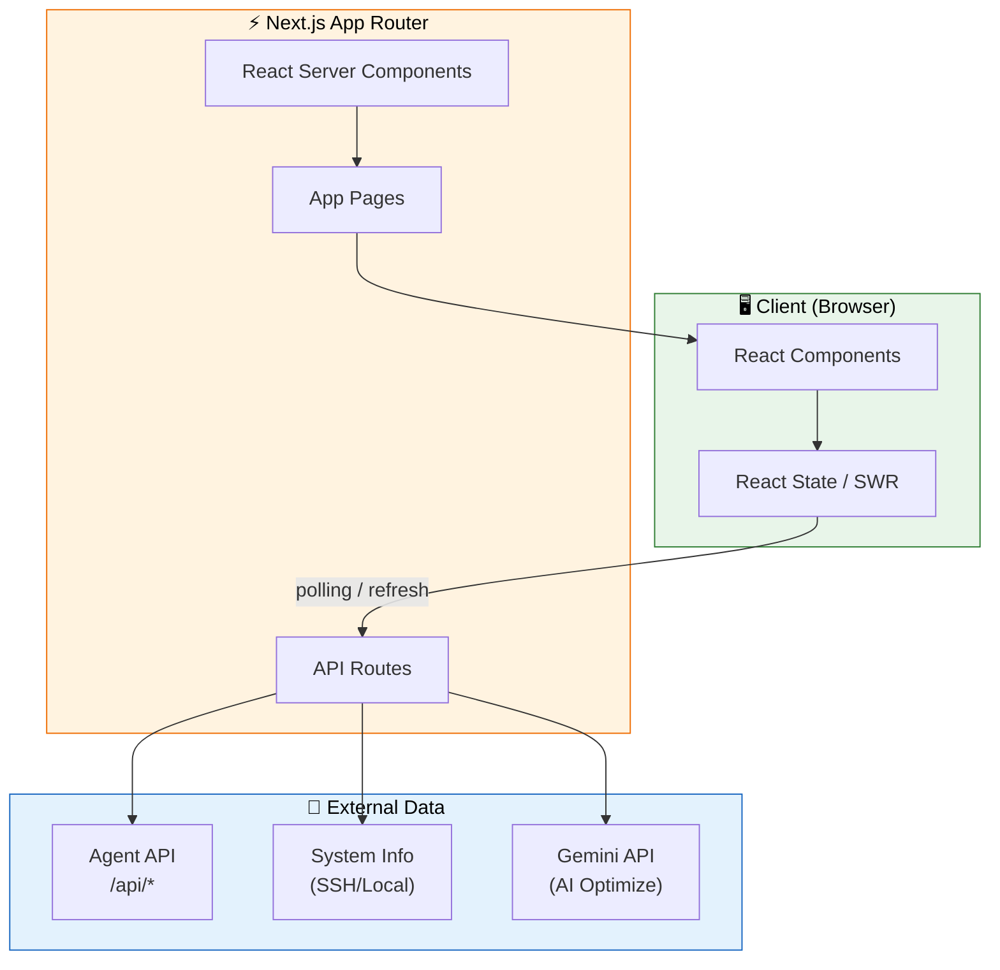

**Penjelasan singkat:**
- **Client** = Browser user yang render React components
- **Next.js** = Server-side rendering + API routes sebagai proxy ke backend
- **External** = Data asli dari AI agent, sistem, dan Gemini API

> ⚠️ **Pitfall:** Jangan taruh API key di client-side code! Semua yang butuh secret key harus lewat API route (`src/app/api/`), bukan langsung di component.

---

> ✅ **Part 1 selesai!** Foundation udah siap. Lanjut ke Part 2 — kita bangun layout & navigasi.

---

# 🏗️ PART 2: Layout & Navigation

Nah, sekarang kita bangun "kerangka" dashboard — sidebar, header, dan shell yang bakal nampung semua page. Ini kayak pasang dinding & pintu rumah.

## 2.1 Sidebar Component

Buat file `src/components/layout/sidebar.tsx`:

```tsx
// src/components/layout/sidebar.tsx
"use client";

import { useState } from "react";
import Link from "next/link";
import { usePathname } from "next/navigation";
import { cn } from "@/lib/utils";
import {
  Home,
  Mail,
  Monitor,
  MessageSquare,
  Zap,
  Calendar,
  FileText,
  Brain,
  Settings,
  ChevronLeft,
  Bot,
} from "lucide-react";
import { Button } from "@/components/ui/button";
import { ScrollArea } from "@/components/ui/scroll-area";
import {
  Tooltip,
  TooltipContent,
  TooltipProvider,
  TooltipTrigger,
} from "@/components/ui/tooltip";

// Daftar navigasi sidebar
const navItems = [
  { href: "/", label: "Home", icon: Home },
  { href: "/briefing", label: "Briefing", icon: Mail },
  { href: "/system", label: "System", icon: Monitor },
  { href: "/sessions", label: "Sessions", icon: MessageSquare },
  { href: "/skills", label: "Skills", icon: Zap },
  { href: "/schedule", label: "Schedule", icon: Calendar },
  { href: "/logs", label: "Logs", icon: FileText },
  { href: "/models", label: "Models", icon: Brain },
  { href: "/settings", label: "Settings", icon: Settings },
];

interface SidebarProps {
  collapsed: boolean;
  onToggle: () => void;
  mobileOpen: boolean;
  onMobileClose: () => void;
}

export function Sidebar({
  collapsed,
  onToggle,
  mobileOpen,
  onMobileClose,
}: SidebarProps) {
  const pathname = usePathname();

  // Cek apakah route aktif (termasuk nested routes)
  const isActive = (href: string) => {
    if (href === "/") return pathname === "/";
    return pathname.startsWith(href);
  };

  const sidebarContent = (
    <div className="flex flex-col h-full bg-sidebar text-white">
      {/* Logo section */}
      <div className="flex items-center gap-3 px-4 h-16 border-b border-slate-700">
        <div className="flex items-center justify-center w-9 h-9 rounded-lg bg-primary text-white font-bold text-lg shrink-0">
          <Bot size={22} />
        </div>
        {/* Text hidden kalau sidebar collapsed (desktop) */}
        {!collapsed && (
          <div className="flex flex-col overflow-hidden">
            <span className="text-base font-bold tracking-tight whitespace-nowrap">
              Radit Dashboard
            </span>
            <span className="text-[10px] text-slate-400 whitespace-nowrap">
              AI Agent Monitor
            </span>
          </div>
        )}
      </div>

      {/* Navigation items */}
      <ScrollArea className="flex-1 py-3">
        <nav className="space-y-1 px-3">
          {navItems.map((item) => {
            const Icon = item.icon;
            const active = isActive(item.href);

            // Kalau collapsed, tampilkan tooltip
            const linkContent = (
              <Link
                href={item.href}
                onClick={onMobileClose}
                className={cn(
                  "flex items-center gap-3 px-3 py-2.5 rounded-lg transition-all duration-200",
                  "text-sm font-medium",
                  active
                    ? "bg-primary text-white shadow-lg shadow-primary/20"
                    : "text-slate-300 hover:bg-sidebar-hover hover:text-white",
                  collapsed && "justify-center px-2"
                )}
              >
                <Icon size={20} className="shrink-0" />
                {!collapsed && <span>{item.label}</span>}
                {/* Active indicator dot */}
                {active && !collapsed && (
                  <span className="ml-auto w-1.5 h-1.5 rounded-full bg-white" />
                )}
              </Link>
            );

            // Desktop collapsed mode: wrap pake tooltip
            if (collapsed) {
              return (
                <TooltipProvider key={item.href} delayDuration={0}>
                  <Tooltip>
                    <TooltipTrigger asChild>{linkContent}</TooltipTrigger>
                    <TooltipContent side="right" className="font-medium">
                      {item.label}
                    </TooltipContent>
                  </Tooltip>
                </TooltipProvider>
              );
            }

            return <div key={item.href}>{linkContent}</div>;
          })}
        </nav>
      </ScrollArea>

      {/* Collapse toggle (desktop only) */}
      <div className="hidden lg:flex items-center justify-center p-3 border-t border-slate-700">
        <Button
          variant="ghost"
          size="sm"
          onClick={onToggle}
          className="text-slate-400 hover:text-white hover:bg-sidebar-hover w-full"
        >
          <ChevronLeft
            size={18}
            className={cn(
              "transition-transform duration-300",
              collapsed && "rotate-180"
            )}
          />
          {!collapsed && <span className="ml-2 text-xs">Collapse</span>}
        </Button>
      </div>
    </div>
  );

  return (
    <>
      {/* ====== MOBILE: Overlay sidebar ====== */}
      {mobileOpen && (
        <div className="lg:hidden fixed inset-0 z-50">
          {/* Backdrop */}
          <div
            className="absolute inset-0 bg-black/50 backdrop-blur-sm"
            onClick={onMobileClose}
          />
          {/* Sidebar panel */}
          <div className="relative w-64 h-full shadow-2xl animate-in slide-in-from-left duration-200">
            {sidebarContent}
          </div>
        </div>
      )}

      {/* ====== DESKTOP: Fixed sidebar ====== */}
      <aside
        className={cn(
          "hidden lg:block fixed left-0 top-0 h-full z-40 transition-all duration-300 border-r border-slate-800",
          collapsed ? "w-[68px]" : "w-64"
        )}
      >
        {sidebarContent}
      </aside>
    </>
  );
}
```

> 💡 **Tips:** `usePathname()` dari Next.js itu cara paling gampang detect active route. Lebih simpel daripada bikin custom router logic.

> ⚠️ **Pitfall:** Jangan lupa `"use client"` di atas setiap component yang pake hooks (useState, useEffect, usePathname). Lupa = error hydration.

## 2.2 Header Component

Buat `src/components/layout/header.tsx`:

```tsx
// src/components/layout/header.tsx
"use client";

import { useState, useEffect } from "react";
import { usePathname } from "next/navigation";
import { Menu, Bell, Search } from "lucide-react";
import { Button } from "@/components/ui/button";
import { Input } from "@/components/ui/input";
import { Avatar, AvatarFallback, AvatarImage } from "@/components/ui/avatar";
import { Badge } from "@/components/ui/badge";

// Mapping route ke judul halaman
const pageTitles: Record<string, string> = {
  "/": "Dashboard",
  "/briefing": "Morning Briefing",
  "/system": "System Monitor",
  "/sessions": "Sessions",
  "/skills": "Skills Hub",
  "/schedule": "Schedule",
  "/logs": "Activity Logs",
  "/models": "Models",
  "/settings": "Settings",
};

interface HeaderProps {
  onMobileMenuClick: () => void;
  sidebarCollapsed: boolean;
}

export function Header({
  onMobileMenuClick,
  sidebarCollapsed,
}: HeaderProps) {
  const pathname = usePathname();
  const [currentTime, setCurrentTime] = useState(new Date());
  const [searchOpen, setSearchOpen] = useState(false);

  // Update jam setiap detik
  useEffect(() => {
    const timer = setInterval(() => setCurrentTime(new Date()), 1000);
    return () => clearInterval(timer);
  }, []);

  // Ambil judul halaman dari pathname
  const pageTitle = pageTitles[pathname] || "Dashboard";

  // Format jam Indonesia (WITA)
  const timeString = currentTime.toLocaleTimeString("id-ID", {
    hour: "2-digit",
    minute: "2-digit",
    second: "2-digit",
    timeZone: "Asia/Makassar",
  });

  const dateString = currentTime.toLocaleDateString("id-ID", {
    weekday: "long",
    day: "numeric",
    month: "long",
    year: "numeric",
    timeZone: "Asia/Makassar",
  });

  return (
    <header
      className={cn(
        "sticky top-0 z-30 h-16 bg-white/80 backdrop-blur-md border-b border-slate-200",
        "flex items-center justify-between px-4 md:px-6",
        "transition-all duration-300",
        sidebarCollapsed ? "lg:pl-[84px]" : "lg:pl-[280px]"
      )}
    >
      {/* Kiri: Hamburger + Page title */}
      <div className="flex items-center gap-3">
        {/* Hamburger menu (mobile only) */}
        <Button
          variant="ghost"
          size="icon"
          className="lg:hidden"
          onClick={onMobileMenuClick}
        >
          <Menu size={22} />
        </Button>

        <div>
          <h1 className="text-lg md:text-xl font-bold text-slate-900">
            {pageTitle}
          </h1>
          <p className="text-xs text-slate-500 hidden sm:block">
            {dateString}
          </p>
        </div>
      </div>

      {/* Kanan: Search, Clock, Notifications, Avatar */}
      <div className="flex items-center gap-2 md:gap-4">
        {/* Search bar (desktop) */}
        {searchOpen ? (
          <div className="hidden md:flex items-center">
            <Input
              placeholder="Cari sesuatu..."
              className="w-56 h-9"
              autoFocus
              onBlur={() => setSearchOpen(false)}
            />
          </div>
        ) : (
          <Button
            variant="ghost"
            size="icon"
            className="hidden md:flex"
            onClick={() => setSearchOpen(true)}
          >
            <Search size={18} className="text-slate-500" />
          </Button>
        )}

        {/* Jam real-time */}
        <div className="hidden sm:flex flex-col items-end">
          <span className="text-sm font-mono font-bold text-slate-700">
            {timeString}
          </span>
          <span className="text-[10px] text-slate-400">WITA</span>
        </div>

        {/* Notification bell */}
        <Button variant="ghost" size="icon" className="relative">
          <Bell size={18} className="text-slate-500" />
          {/* Badge notification */}
          <Badge className="absolute -top-1 -right-1 h-4 w-4 p-0 flex items-center justify-center text-[10px] bg-red-500 border-0">
            3
          </Badge>
        </Button>

        {/* User avatar */}
        <Avatar className="h-8 w-8">
          <AvatarImage src="/avatar.png" alt="User" />
          <AvatarFallback className="bg-primary text-white text-xs font-bold">
            RF
          </AvatarFallback>
        </Avatar>
      </div>
    </header>
  );
}

// Helper cn (import dari utils)
import { cn } from "@/lib/utils";
```

> ⚠️ **Pitfall:** Header padding kudu sync sama sidebar width. Kalau sidebar `w-64`, header padding harus `lg:pl-[280px]` (256px + 24px gap). Nggak sync = content ketutupan sidebar.

## 2.3 Shell Component (Layout Wrapper)

Buat `src/components/layout/shell.tsx` — ini wrapper utama yang nge-wrap sidebar + header + content:

```tsx
// src/components/layout/shell.tsx
"use client";

import { useState } from "react";
import { cn } from "@/lib/utils";
import { Sidebar } from "./sidebar";
import { Header } from "./header";

interface ShellProps {
  children: React.ReactNode;
}

export function Shell({ children }: ShellProps) {
  const [sidebarCollapsed, setSidebarCollapsed] = useState(false);
  const [mobileOpen, setMobileOpen] = useState(false);

  return (
    <div className="min-h-screen bg-slate-50">
      {/* Sidebar */}
      <Sidebar
        collapsed={sidebarCollapsed}
        onToggle={() => setSidebarCollapsed(!sidebarCollapsed)}
        mobileOpen={mobileOpen}
        onMobileClose={() => setMobileOpen(false)}
      />

      {/* Header */}
      <Header
        onMobileMenuClick={() => setMobileOpen(true)}
        sidebarCollapsed={sidebarCollapsed}
      />

      {/* Main content area */}
      <main
        className={cn(
          "p-4 md:p-6 transition-all duration-300",
          sidebarCollapsed ? "lg:ml-[84px]" : "lg:ml-[272px]"
        )}
      >
        {children}
      </main>
    </div>
  );
}
```

## 2.4 Update Root Layout

Replace `src/app/layout.tsx`:

```tsx
// src/app/layout.tsx
import type { Metadata } from "next";
import { Inter } from "next/font/google";
import "./globals.css";
import { Shell } from "@/components/layout/shell";
import { Toaster } from "sonner";

const inter = Inter({ subsets: ["latin"] });

export const metadata: Metadata = {
  title: "Radit Dashboard — AI Agent Monitor",
  description: "Dashboard monitoring untuk AI agent system",
};

export default function RootLayout({
  children,
}: Readonly<{
  children: React.ReactNode;
}>) {
  return (
    <html lang="id">
      <body className={inter.className}>
        {/* Toast notification provider */}
        <Toaster
          position="bottom-right"
          richColors
          closeButton
          toastOptions={{
            duration: 4000,
          }}
        />
        {/* Main layout shell */}
        <Shell>{children}</Shell>
      </body>
    </html>
  );
}
```

## 2.5 Component Hierarchy Diagram

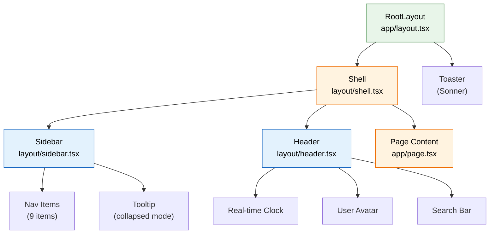

## 2.6 Navigation State Diagram

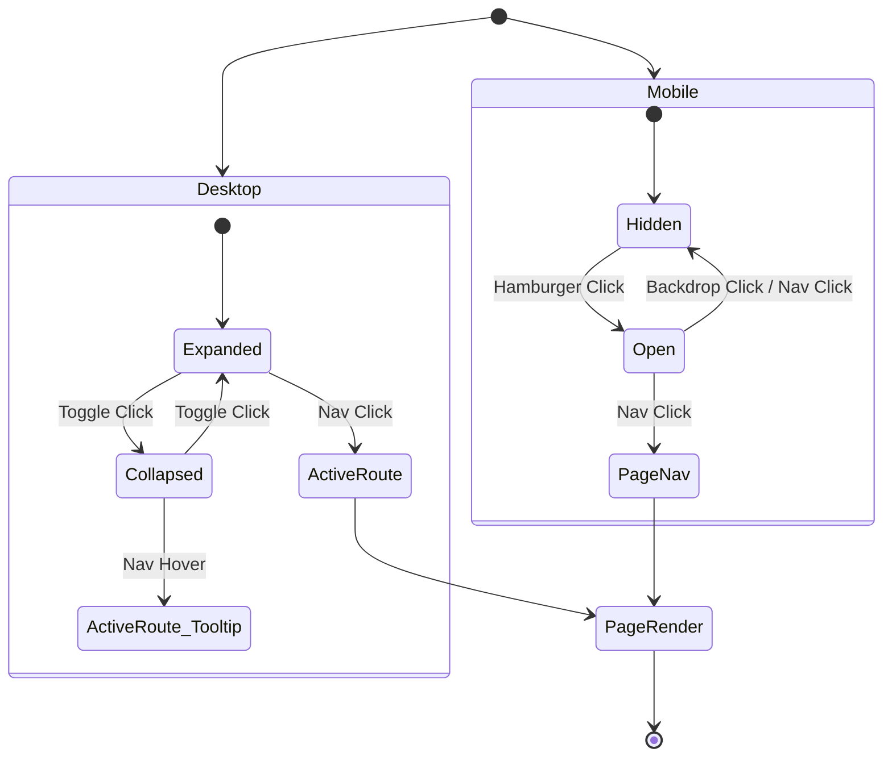

> 💡 **Tips:** Desktop sidebar collapsed itu cuma 68px — pas banget buat ikon aja. Di mode ini, tooltip muncul on-hover buat kasih tau label-nya apa.

> ⚠️ **Pitfall:** Di mobile, jangan lupa close sidebar pas navigasi. User klik nav → sidebar tutup otomatis → dia langsung lihat halaman baru. Nggak enak kalau sidebar numpuk di atas content.

---

> ✅ **Part 2 selesai!** Layout & navigasi sudah jadi. Lanjut ke Part 3 — Dashboard Home.

---

# 📊 PART 3: Dashboard Home (Status Page)

Ini halaman utama yang user liat pertama kali. Kita bikin 4 bagian: stats cards, usage chart, activity feed, dan jam real-time.

## 3.1 API Route — Status Data

Buat `src/app/api/status/route.ts`:

```typescript
// src/app/api/status/route.ts
import { NextResponse } from "next/server";

// Interface data status
export interface StatusData {
  stats: {
    totalSessions: number;
    tokenUsage: number;
    activeModels: number;
    uptimeDays: number;
  };
  usageHistory: Array<{
    date: string;
    tokens: number;
  }>;
  recentActivity: Array<{
    id: string;
    type: "session" | "skill" | "system" | "alert";
    message: string;
    time: string;
  }>;
}

// Data dummy — nanti ganti dengan data asli dari agent API
const mockData: StatusData = {
  stats: {
    totalSessions: 1247,
    tokenUsage: 2458930,
    activeModels: 8,
    uptimeDays: 42,
  },
  usageHistory: [
    { date: "22 Mar", tokens: 320000 },
    { date: "23 Mar", tokens: 410000 },
    { date: "24 Mar", tokens: 280000 },
    { date: "25 Mar", tokens: 390000 },
    { date: "26 Mar", tokens: 520000 },
    { date: "27 Mar", tokens: 310000 },
    { date: "28 Mar", tokens: 228930 },
  ],
  recentActivity: [
    {
      id: "1",
      type: "session",
      message: "Session baru dimulai — radit:main (GLM-5 Turbo)",
      time: "2 menit lalu",
    },
    {
      id: "2",
      type: "skill",
      message: "Skill bmkg-monitor berhasil scan 3 gempa baru",
      time: "15 menit lalu",
    },
    {
      id: "3",
      type: "system",
      message: "Memory usage normal — 62% (4.9GB / 8GB)",
      time: "30 menit lalu",
    },
    {
      id: "4",
      type: "alert",
      message: "API rate limit tercapai — Gemini (85% quota)",
      time: "1 jam lalu",
    },
    {
      id: "5",
      type: "session",
      message: "Session raka:content selesai — 47 pesan, 12 menit",
      time: "2 jam lalu",
    },
    {
      id: "6",
      type: "system",
      message: "Cron job heartbeat berhasil — semua normal",
      time: "3 jam lalu",
    },
  ],
};

export async function GET() {
  try {
    // TODO: Fetch data asli dari agent API
    // const res = await fetch("http://localhost:3001/api/status");
    // const data = await res.json();

    // Sementara pake mock data
    return NextResponse.json(mockData);
  } catch (error) {
    return NextResponse.json(
      { error: "Gagal fetch status data" },
      { status: 500 }
    );
  }
}
```

## 3.2 Stats Grid Component

Buat `src/components/dashboard/stats-grid.tsx`:

```tsx
// src/components/dashboard/stats-grid.tsx
"use client";

import { formatNumber } from "@/lib/utils";
import { Card, CardContent } from "@/components/ui/card";
import {
  MessageSquare,
  Coins,
  Brain,
  Activity,
} from "lucide-react";

interface StatCard {
  title: string;
  value: string;
  subtitle: string;
  icon: React.ElementType;
  trend?: string;
  trendUp?: boolean;
}

interface StatsGridProps {
  stats: {
    totalSessions: number;
    tokenUsage: number;
    activeModels: number;
    uptimeDays: number;
  };
}

// Konfigurasi tiap stat card
const statCards: Array<{
  key: keyof StatsGridProps["stats"];
  title: string;
  icon: React.ElementType;
  format: (val: number) => string;
  subtitle: string;
  color: string;
  bgColor: string;
}> = [
  {
    key: "totalSessions",
    title: "Total Sessions",
    icon: MessageSquare,
    format: (v) => formatNumber(v),
    subtitle: "Sejak 30 hari lalu",
    color: "text-blue-600",
    bgColor: "bg-blue-50",
  },
  {
    key: "tokenUsage",
    title: "Token Usage",
    icon: Coins,
    format: (v) => `${formatNumber(v)}`,
    subtitle: "Total token terpakai",
    color: "text-green-600",
    bgColor: "bg-green-50",
  },
  {
    key: "activeModels",
    title: "Active Models",
    icon: Brain,
    format: (v) => v.toString(),
    subtitle: "Model terkoneksi",
    color: "text-purple-600",
    bgColor: "bg-purple-50",
  },
  {
    key: "uptimeDays",
    title: "Uptime",
    icon: Activity,
    format: (v) => `${v} hari`,
    subtitle: "Non-stop running",
    color: "text-amber-600",
    bgColor: "bg-amber-50",
  },
];

export function StatsGrid({ stats }: StatsGridProps) {
  return (
    <div className="grid grid-cols-1 sm:grid-cols-2 lg:grid-cols-4 gap-4">
      {statCards.map((card) => {
        const Icon = card.icon;
        const value = stats[card.key];

        return (
          <Card
            key={card.key}
            className="hover:shadow-md transition-shadow duration-200"
          >
            <CardContent className="p-5">
              <div className="flex items-start justify-between">
                <div className="space-y-2">
                  <p className="text-sm font-medium text-slate-500">
                    {card.title}
                  </p>
                  <p className="text-2xl font-bold text-slate-900">
                    {card.format(value)}
                  </p>
                  <p className="text-xs text-slate-400">{card.subtitle}</p>
                </div>
                <div className={`${card.bgColor} p-3 rounded-xl`}>
                  <Icon size={22} className={card.color} />
                </div>
              </div>
            </CardContent>
          </Card>
        );
      })}
    </div>
  );
}
```

## 3.3 Usage Chart Component

Buat `src/components/dashboard/usage-chart.tsx`:

```tsx
// src/components/dashboard/usage-chart.tsx
"use client";

import { Card, CardContent, CardHeader, CardTitle } from "@/components/ui/card";
import {
  AreaChart,
  Area,
  XAxis,
  YAxis,
  CartesianGrid,
  Tooltip,
  ResponsiveContainer,
} from "recharts";
import { formatNumber } from "@/lib/utils";

interface UsageChartProps {
  data: Array<{
    date: string;
    tokens: number;
  }>;
}

export function UsageChart({ data }: UsageChartProps) {
  return (
    <Card className="hover:shadow-md transition-shadow duration-200">
      <CardHeader className="pb-2">
        <CardTitle className="text-base font-semibold text-slate-900">
          📈 Token Usage — 7 Hari Terakhir
        </CardTitle>
      </CardHeader>
      <CardContent>
        <div className="h-[280px] w-full">
          <ResponsiveContainer width="100%" height="100%">
            <AreaChart
              data={data}
              margin={{ top: 10, right: 10, left: -10, bottom: 0 }}
            >
              {/* Grid halus */}
              <CartesianGrid strokeDasharray="3 3" stroke="#e2e8f0" />
              <XAxis
                dataKey="date"
                tick={{ fontSize: 12, fill: "#94a3b8" }}
                axisLine={{ stroke: "#e2e8f0" }}
                tickLine={false}
              />
              <YAxis
                tick={{ fontSize: 12, fill: "#94a3b8" }}
                axisLine={false}
                tickLine={false}
                tickFormatter={(value) => `${(value / 1000).toFixed(0)}k`}
              />
              <Tooltip
                contentStyle={{
                  backgroundColor: "white",
                  border: "1px solid #e2e8f0",
                  borderRadius: "8px",
                  fontSize: "13px",
                  boxShadow: "0 4px 6px -1px rgba(0,0,0,0.1)",
                }}
                formatter={(value: number) => [
                  formatNumber(value) + " tokens",
                  "Usage",
                ]}
              />
              {/* Gradient area */}
              <defs>
                <linearGradient id="tokenGradient" x1="0" y1="0" x2="0" y2="1">
                  <stop offset="5%" stopColor="#22c55e" stopOpacity={0.3} />
                  <stop offset="95%" stopColor="#22c55e" stopOpacity={0} />
                </linearGradient>
              </defs>
              <Area
                type="monotone"
                dataKey="tokens"
                stroke="#22c55e"
                strokeWidth={2.5}
                fill="url(#tokenGradient)"
              />
            </AreaChart>
          </ResponsiveContainer>
        </div>
      </CardContent>
    </Card>
  );
}
```

## 3.4 Activity Feed Component

Buat `src/components/dashboard/activity-feed.tsx`:

```tsx
// src/components/dashboard/activity-feed.tsx
import { Card, CardContent, CardHeader, CardTitle } from "@/components/ui/card";
import {
  MessageSquare,
  Zap,
  Monitor,
  AlertTriangle,
} from "lucide-react";

// Mapping type ke icon & warna
const typeConfig = {
  session: {
    icon: MessageSquare,
    color: "text-blue-500",
    bg: "bg-blue-50",
  },
  skill: {
    icon: Zap,
    color: "text-green-500",
    bg: "bg-green-50",
  },
  system: {
    icon: Monitor,
    color: "text-slate-500",
    bg: "bg-slate-50",
  },
  alert: {
    icon: AlertTriangle,
    color: "text-amber-500",
    bg: "bg-amber-50",
  },
};

interface ActivityItem {
  id: string;
  type: "session" | "skill" | "system" | "alert";
  message: string;
  time: string;
}

interface ActivityFeedProps {
  activities: ActivityItem[];
}

export function ActivityFeed({ activities }: ActivityFeedProps) {
  return (
    <Card className="hover:shadow-md transition-shadow duration-200">
      <CardHeader className="pb-3">
        <CardTitle className="text-base font-semibold text-slate-900">
          📋 Aktivitas Terbaru
        </CardTitle>
      </CardHeader>
      <CardContent>
        <div className="space-y-3">
          {activities.map((activity, index) => {
            const config = typeConfig[activity.type];
            const Icon = config.icon;

            return (
              <div
                key={activity.id}
                className="flex items-start gap-3 py-2 border-b border-slate-100 last:border-0"
              >
                {/* Icon */}
                <div className={`p-2 rounded-lg ${config.bg} shrink-0`}>
                  <Icon size={14} className={config.color} />
                </div>
                {/* Content */}
                <div className="flex-1 min-w-0">
                  <p className="text-sm text-slate-700 leading-snug">
                    {activity.message}
                  </p>
                  <p className="text-xs text-slate-400 mt-0.5">
                    {activity.time}
                  </p>
                </div>
              </div>
            );
          })}
        </div>
      </CardContent>
    </Card>
  );
}
```

## 3.5 Real-Time Clock Component

Buat `src/components/dashboard/real-time-clock.tsx`:

```tsx
// src/components/dashboard/real-time-clock.tsx
"use client";

import { useState, useEffect } from "react";
import { Card, CardContent } from "@/components/ui/card";

export function RealTimeClock() {
  const [time, setTime] = useState(new Date());

  useEffect(() => {
    const timer = setInterval(() => setTime(new Date()), 1000);
    return () => clearInterval(timer);
  }, []);

  // Format waktu WITA
  const timeStr = time.toLocaleTimeString("id-ID", {
    hour: "2-digit",
    minute: "2-digit",
    second: "2-digit",
    timeZone: "Asia/Makassar",
  });

  const dateStr = time.toLocaleDateString("id-ID", {
    weekday: "long",
    day: "numeric",
    month: "long",
    year: "numeric",
    timeZone: "Asia/Makassar",
  });

  // Detik progress (0-59 → 0%-100%)
  const secondProgress = (time.getSeconds() / 59) * 100;

  return (
    <Card className="hover:shadow-md transition-shadow duration-200">
      <CardContent className="p-5">
        <div className="text-center space-y-2">
          {/* Jam besar */}
          <div className="text-4xl font-mono font-bold text-slate-900 tracking-wider">
            {timeStr}
          </div>
          {/* Tanggal */}
          <div className="text-sm text-slate-500">{dateStr}</div>
          {/* Progress bar detik */}
          <div className="w-full h-1 bg-slate-100 rounded-full overflow-hidden">
            <div
              className="h-full bg-primary rounded-full transition-all duration-1000 ease-linear"
              style={{ width: `${secondProgress}%` }}
            />
          </div>
          <span className="text-xs text-slate-400">Asia/Makassar (WITA)</span>
        </div>
      </CardContent>
    </Card>
  );
}
```

## 3.6 Dashboard Home Page

Buat `src/app/page.tsx`:

```tsx
// src/app/page.tsx
"use client";

import { useState, useEffect } from "react";
import { StatsGrid } from "@/components/dashboard/stats-grid";
import { UsageChart } from "@/components/dashboard/usage-chart";
import { ActivityFeed } from "@/components/dashboard/activity-feed";
import { RealTimeClock } from "@/components/dashboard/real-time-clock";

// Tipe data dari API
interface StatusData {
  stats: {
    totalSessions: number;
    tokenUsage: number;
    activeModels: number;
    uptimeDays: number;
  };
  usageHistory: Array<{ date: string; tokens: number }>;
  recentActivity: Array<{
    id: string;
    type: "session" | "skill" | "system" | "alert";
    message: string;
    time: string;
  }>;
}

export default function DashboardPage() {
  const [data, setData] = useState<StatusData | null>(null);
  const [loading, setLoading] = useState(true);

  useEffect(() => {
    async function fetchStatus() {
      try {
        const res = await fetch("/api/status");
        const json = await res.json();
        setData(json);
      } catch (err) {
        console.error("Gagal fetch status:", err);
      } finally {
        setLoading(false);
      }
    }
    fetchStatus();

    // Auto-refresh setiap 60 detik
    const interval = setInterval(fetchStatus, 60000);
    return () => clearInterval(interval);
  }, []);

  // Loading skeleton
  if (loading || !data) {
    return (
      <div className="space-y-6 animate-pulse">
        {/* Skeleton stats */}
        <div className="grid grid-cols-1 sm:grid-cols-2 lg:grid-cols-4 gap-4">
          {[...Array(4)].map((_, i) => (
            <div key={i} className="h-32 bg-slate-200 rounded-xl" />
          ))}
        </div>
        {/* Skeleton chart */}
        <div className="grid grid-cols-1 lg:grid-cols-3 gap-6">
          <div className="lg:col-span-2 h-80 bg-slate-200 rounded-xl" />
          <div className="h-80 bg-slate-200 rounded-xl" />
        </div>
      </div>
    );
  }

  return (
    <div className="space-y-6">
      {/* Stats cards */}
      <StatsGrid stats={data.stats} />

      {/* Chart + Activity Feed */}
      <div className="grid grid-cols-1 lg:grid-cols-3 gap-6">
        {/* Chart — 2/3 width di desktop */}
        <div className="lg:col-span-2">
          <UsageChart data={data.usageHistory} />
        </div>

        {/* Activity feed — 1/3 width */}
        <div className="space-y-6">
          <ActivityFeed activities={data.recentActivity} />
          <RealTimeClock />
        </div>
      </div>
    </div>
  );
}
```

## 3.7 Data Flow Diagram

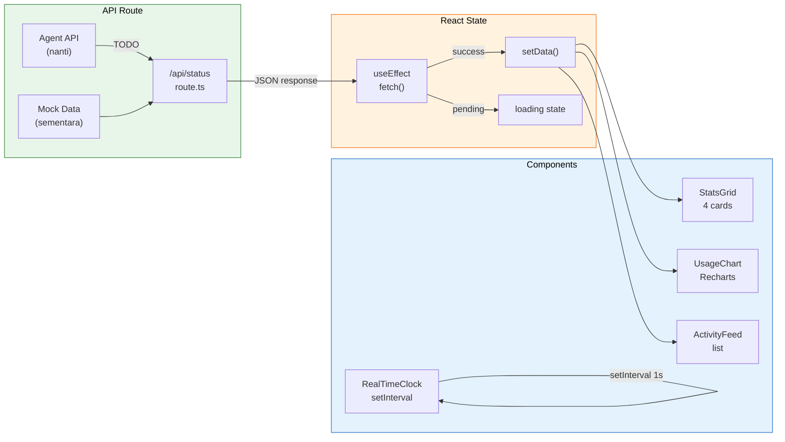

> 💡 **Tips:** Loading skeleton itu penting banget buat UX. User nggak nunggu layar kosong — dia liat shape konten dulu, terus data muncul smooth. Makanya kita pake `animate-pulse` dari Tailwind.

> ⚠️ **Pitfall:** `setInterval` di `useEffect` WAJIB di-return cleanup (`clearInterval`). Kalau nggak, tiap component re-render → timer baru → memory leak!

---

> ✅ **Part 3 selesai!** Dashboard home sudah punya stats, chart, activity feed, dan jam real-time. Lanjut ke Part 4.

---

# 📬 PART 4: Morning Briefing Page

Halaman briefing ini nanti menampilkan info penting di pagi hari — email, calendar, tasks, harga emas, server health, dan cuaca. Card-based, responsive, tiap card punya loading state.

## 4.1 API Route — Briefing Data

Buat `src/app/api/briefing/route.ts`:

```typescript
// src/app/api/briefing/route.ts
import { NextResponse } from "next/server";

export interface BriefingData {
  email: {
    unread: number;
    latest: Array<{ from: string; subject: string; time: string }>;
  };
  calendar: {
    today: number;
    events: Array<{ title: string; time: string; type: string }>;
  };
  tasks: {
    pending: number;
    completed: number;
    items: Array<{ title: string; priority: string }>;
  };
  goldPrice: {
    price: number;
    change: number;
    updated: string;
  };
  serverHealth: {
    cpu: number;
    ram: number;
    disk: number;
    status: "healthy" | "warning" | "critical";
  };
  weather: {
    temp: number;
    condition: string;
    city: string;
    humidity: number;
  };
}

// Mock data — ganti nanti dengan fetch asli
const mockData: BriefingData = {
  email: {
    unread: 12,
    latest: [
      { from: "noreply@github.com", subject: "New PR: Fix dashboard layout", time: "08:30" },
      { from: "client@rfm.co.id", subject: "Update project schedule", time: "07:45" },
      { from: "alerts@vps.io", subject: "Server backup completed", time: "06:00" },
    ],
  },
  calendar: {
    today: 4,
    events: [
      { title: "Standup call — Your Company", time: "09:00", type: "meeting" },
      { title: "Review proposal UST", time: "11:00", type: "task" },
      { title: "Lunch with vendor", time: "12:30", type: "personal" },
      { title: "Deploy dashboard v2", time: "15:00", type: "task" },
    ],
  },
  tasks: {
    pending: 7,
    completed: 23,
    items: [
      { title: "Fix sidebar responsive bug", priority: "high" },
      { title: "Add dark mode toggle", priority: "medium" },
      { title: "Write API documentation", priority: "low" },
    ],
  },
  goldPrice: {
    price: 3128000,
    change: 15000,
    updated: "28 Mar 2026, 08:00 WITA",
  },
  serverHealth: {
    cpu: 34,
    ram: 62,
    disk: 45,
    status: "healthy",
  },
  weather: {
    temp: 31,
    condition: "Cerah Berawan",
    city: "Balikpapan",
    humidity: 78,
  },
};

export async function GET() {
  try {
    // TODO: Fetch dari berbagai source
    // - Email: gog gmail list --max=5
    // - Calendar: gog calendar events list --today
    // - Gold: fetch dari API harga emas
    // - Weather: fetch dari BMKG/OpenWeatherMap
    // - Server: /api/system

    return NextResponse.json(mockData);
  } catch (error) {
    return NextResponse.json(
      { error: "Gagal fetch briefing data" },
      { status: 500 }
    );
  }
}
```

## 4.2 Briefing Card Component

Buat `src/components/briefing/briefing-card.tsx`:

```tsx
// src/components/briefing/briefing-card.tsx
import { Card, CardContent, CardHeader, CardTitle } from "@/components/ui/card";
import { cn } from "@/lib/utils";
import { Skeleton } from "@/components/ui/skeleton";
import { type LucideIcon } from "lucide-react";

interface BriefingCardProps {
  title: string;
  icon: LucideIcon;
  iconColor?: string;
  iconBg?: string;
  loading?: boolean;
  children: React.ReactNode;
  className?: string;
}

/**
 * Card reusable buat briefing.
 * Tiap card di briefing page pake komponen ini sebagai wrapper.
 */
export function BriefingCard({
  title,
  icon: Icon,
  iconColor = "text-primary",
  iconBg = "bg-green-50",
  loading = false,
  children,
  className,
}: BriefingCardProps) {
  return (
    <Card
      className={cn(
        "hover:shadow-md transition-shadow duration-200",
        className
      )}
    >
      <CardHeader className="pb-3">
        <div className="flex items-center gap-2">
          <div className={cn("p-2 rounded-lg", iconBg)}>
            <Icon size={18} className={iconColor} />
          </div>
          <CardTitle className="text-base font-semibold text-slate-900">
            {title}
          </CardTitle>
        </div>
      </CardHeader>
      <CardContent>
        {loading ? (
          <div className="space-y-3">
            <Skeleton className="h-4 w-3/4" />
            <Skeleton className="h-4 w-1/2" />
            <Skeleton className="h-4 w-2/3" />
          </div>
        ) : (
          children
        )}
      </CardContent>
    </Card>
  );
}
```

> ⚠️ **Pitfall:** Pastikan `Skeleton` dari shadcn/ui udah ke-install: `npx shadcn@latest add skeleton`

## 4.3 Briefing Sub-Components

Buat `src/components/briefing/email-card.tsx`:

```tsx
// src/components/briefing/email-card.tsx
"use client";

import { BriefingCard } from "./briefing-card";
import { Mail } from "lucide-react";

interface EmailData {
  unread: number;
  latest: Array<{ from: string; subject: string; time: string }>;
}

export function EmailCard({ data }: { data: EmailData }) {
  return (
    <BriefingCard
      title="Email"
      icon={Mail}
      iconColor="text-blue-600"
      iconBg="bg-blue-50"
    >
      <div className="space-y-3">
        {/* Badge jumlah unread */}
        <div className="flex items-center gap-2">
          <span className="inline-flex items-center justify-center px-2.5 py-0.5 rounded-full text-xs font-bold bg-red-100 text-red-700">
            {data.unread} unread
          </span>
        </div>
        {/* List email terbaru */}
        {data.latest.map((email, i) => (
          <div
            key={i}
            className="flex items-start justify-between py-2 border-b border-slate-100 last:border-0"
          >
            <div className="min-w-0 flex-1">
              <p className="text-xs text-slate-500 truncate">{email.from}</p>
              <p className="text-sm text-slate-700 truncate font-medium">
                {email.subject}
              </p>
            </div>
            <span className="text-xs text-slate-400 shrink-0 ml-2">
              {email.time}
            </span>
          </div>
        ))}
      </div>
    </BriefingCard>
  );
}
```

Buat `src/components/briefing/calendar-card.tsx`:

```tsx
// src/components/briefing/calendar-card.tsx
"use client";

import { BriefingCard } from "./briefing-card";
import { Calendar } from "lucide-react";
import { Badge } from "@/components/ui/badge";

interface CalendarData {
  today: number;
  events: Array<{ title: string; time: string; type: string }>;
}

const typeColors: Record<string, string> = {
  meeting: "bg-blue-100 text-blue-700",
  task: "bg-green-100 text-green-700",
  personal: "bg-purple-100 text-purple-700",
};

export function CalendarCard({ data }: { data: CalendarData }) {
  return (
    <BriefingCard
      title="Calendar"
      icon={Calendar}
      iconColor="text-purple-600"
      iconBg="bg-purple-50"
    >
      <div className="space-y-3">
        <p className="text-sm text-slate-500">
          <span className="font-bold text-slate-900">{data.today}</span> event
          hari ini
        </p>
        {data.events.map((event, i) => (
          <div
            key={i}
            className="flex items-center gap-3 py-1.5"
          >
            <span className="text-xs font-mono text-slate-400 w-12 shrink-0">
              {event.time}
            </span>
            <Badge
              className={cn("text-[10px] border-0", typeColors[event.type])}
              variant="outline"
            >
              {event.type}
            </Badge>
            <span className="text-sm text-slate-700 truncate">{event.title}</span>
          </div>
        ))}
      </div>
    </BriefingCard>
  );
}

import { cn } from "@/lib/utils";
```

Buat `src/components/briefing/tasks-card.tsx`:

```tsx
// src/components/briefing/tasks-card.tsx
"use client";

import { BriefingCard } from "./briefing-card";
import { CheckSquare } from "lucide-react";
import { Badge } from "@/components/ui/badge";

interface TasksData {
  pending: number;
  completed: number;
  items: Array<{ title: string; priority: string }>;
}

const priorityColors: Record<string, string> = {
  high: "bg-red-100 text-red-700",
  medium: "bg-amber-100 text-amber-700",
  low: "bg-slate-100 text-slate-600",
};

export function TasksCard({ data }: { data: TasksData }) {
  // Progress bar
  const total = data.pending + data.completed;
  const progress = total > 0 ? (data.completed / total) * 100 : 0;

  return (
    <BriefingCard
      title="Tasks"
      icon={CheckSquare}
      iconColor="text-green-600"
      iconBg="bg-green-50"
    >
      <div className="space-y-3">
        {/* Progress */}
        <div>
          <div className="flex justify-between text-xs text-slate-500 mb-1">
            <span>
              {data.completed}/{total} selesai
            </span>
            <span>{Math.round(progress)}%</span>
          </div>
          <div className="w-full h-2 bg-slate-100 rounded-full overflow-hidden">
            <div
              className="h-full bg-primary rounded-full transition-all duration-500"
              style={{ width: `${progress}%` }}
            />
          </div>
        </div>
        {/* Task list */}
        {data.items.map((task, i) => (
          <div key={i} className="flex items-center gap-2 py-1">
            <Badge
              className={cn(
                "text-[10px] border-0 shrink-0",
                priorityColors[task.priority]
              )}
              variant="outline"
            >
              {task.priority}
            </Badge>
            <span className="text-sm text-slate-700">{task.title}</span>
          </div>
        ))}
      </div>
    </BriefingCard>
  );
}

import { cn } from "@/lib/utils";
```

Buat `src/components/briefing/gold-card.tsx`:

```tsx
// src/components/briefing/gold-card.tsx
"use client";

import { BriefingCard } from "./briefing-card";
import { TrendingUp, TrendingDown } from "lucide-react";
import { cn, formatNumber } from "@/lib/utils";

interface GoldPriceData {
  price: number;
  change: number;
  updated: string;
}

export function GoldCard({ data }: { data: GoldPriceData }) {
  const isUp = data.change > 0;

  return (
    <BriefingCard
      title="Harga Emas"
      icon={TrendingUp}
      iconColor="text-amber-600"
      iconBg="bg-amber-50"
    >
      <div className="space-y-2">
        {/* Harga besar */}
        <div className="flex items-baseline gap-2">
          <span className="text-2xl font-bold text-slate-900">
            Rp {formatNumber(data.price)}
          </span>
          <span className="text-xs text-slate-400">/gram</span>
        </div>
        {/* Perubahan */}
        <div className="flex items-center gap-1">
          {isUp ? (
            <TrendingUp size={16} className="text-green-500" />
          ) : (
            <TrendingDown size={16} className="text-red-500" />
          )}
          <span
            className={cn(
              "text-sm font-medium",
              isUp ? "text-green-600" : "text-red-600"
            )}
          >
            {isUp ? "+" : ""}
            Rp {formatNumber(Math.abs(data.change))}
          </span>
        </div>
        {/* Timestamp */}
        <p className="text-xs text-slate-400">{data.updated}</p>
      </div>
    </BriefingCard>
  );
}
```

Buat `src/components/briefing/health-card.tsx`:

```tsx
// src/components/briefing/health-card.tsx
"use client";

import { BriefingCard } from "./briefing-card";
import { HeartPulse } from "lucide-react";
import { cn } from "@/lib/utils";
import { Badge } from "@/components/ui/badge";

interface ServerHealthData {
  cpu: number;
  ram: number;
  disk: number;
  status: "healthy" | "warning" | "critical";
}

const statusConfig = {
  healthy: { label: "Healthy", color: "bg-green-100 text-green-700" },
  warning: { label: "Warning", color: "bg-amber-100 text-amber-700" },
  critical: { label: "Critical", color: "bg-red-100 text-red-700" },
};

export function HealthCard({ data }: { data: ServerHealthData }) {
  const config = statusConfig[data.status];

  // Fungsi helper buat mini progress bar
  const MiniBar = ({
    label,
    value,
    color,
  }: {
    label: string;
    value: number;
    color: string;
  }) => (
    <div className="space-y-1">
      <div className="flex justify-between text-xs">
        <span className="text-slate-500">{label}</span>
        <span className="font-mono font-medium text-slate-700">{value}%</span>
      </div>
      <div className="w-full h-1.5 bg-slate-100 rounded-full overflow-hidden">
        <div
          className={cn("h-full rounded-full transition-all", color)}
          style={{ width: `${value}%` }}
        />
      </div>
    </div>
  );

  return (
    <BriefingCard
      title="Server Health"
      icon={HeartPulse}
      iconColor="text-red-600"
      iconBg="bg-red-50"
    >
      <div className="space-y-3">
        <Badge className={cn("text-xs border-0", config.color)} variant="outline">
          {config.label}
        </Badge>
        <MiniBar label="CPU" value={data.cpu} color="bg-blue-500" />
        <MiniBar label="RAM" value={data.ram} color="bg-purple-500" />
        <MiniBar label="Disk" value={data.disk} color="bg-amber-500" />
      </div>
    </BriefingCard>
  );
}
```

Buat `src/components/briefing/weather-card.tsx`:

```tsx
// src/components/briefing/weather-card.tsx
"use client";

import { BriefingCard } from "./briefing-card";
import { CloudSun, Droplets } from "lucide-react";

interface WeatherData {
  temp: number;
  condition: string;
  city: string;
  humidity: number;
}

export function WeatherCard({ data }: { data: WeatherData }) {
  return (
    <BriefingCard
      title="Cuaca"
      icon={CloudSun}
      iconColor="text-sky-600"
      iconBg="bg-sky-50"
    >
      <div className="space-y-2">
        {/* Suhu besar */}
        <div className="flex items-baseline gap-1">
          <span className="text-3xl font-bold text-slate-900">
            {data.temp}°C
          </span>
        </div>
        {/* Kondisi & kota */}
        <p className="text-sm text-slate-600">{data.condition}</p>
        <p className="text-xs text-slate-400">{data.city}</p>
        {/* Humidity */}
        <div className="flex items-center gap-1 text-xs text-slate-500">
          <Droplets size={14} className="text-blue-400" />
          <span>Humidity: {data.humidity}%</span>
        </div>
      </div>
    </BriefingCard>
  );
}
```

## 4.4 Briefing Page

Buat `src/app/briefing/page.tsx`:

```tsx
// src/app/briefing/page.tsx
"use client";

import { useState, useEffect } from "react";
import { EmailCard } from "@/components/briefing/email-card";
import { CalendarCard } from "@/components/briefing/calendar-card";
import { TasksCard } from "@/components/briefing/tasks-card";
import { GoldCard } from "@/components/briefing/gold-card";
import { HealthCard } from "@/components/briefing/health-card";
import { WeatherCard } from "@/components/briefing/weather-card";
import { BriefingCard } from "@/components/briefing/briefing-card";
import { RefreshCw } from "lucide-react";
import { Button } from "@/components/ui/button";

// Type data briefing
interface BriefingData {
  email: {
    unread: number;
    latest: Array<{ from: string; subject: string; time: string }>;
  };
  calendar: {
    today: number;
    events: Array<{ title: string; time: string; type: string }>;
  };
  tasks: {
    pending: number;
    completed: number;
    items: Array<{ title: string; priority: string }>;
  };
  goldPrice: {
    price: number;
    change: number;
    updated: string;
  };
  serverHealth: {
    cpu: number;
    ram: number;
    disk: number;
    status: "healthy" | "warning" | "critical";
  };
  weather: {
    temp: number;
    condition: string;
    city: string;
    humidity: number;
  };
}

export default function BriefingPage() {
  const [data, setData] = useState<BriefingData | null>(null);
  const [loading, setLoading] = useState(true);
  const [refreshing, setRefreshing] = useState(false);

  async function fetchBriefing() {
    try {
      const res = await fetch("/api/briefing");
      const json = await res.json();
      setData(json);
    } catch (err) {
      console.error("Gagal fetch briefing:", err);
    } finally {
      setLoading(false);
      setRefreshing(false);
    }
  }

  useEffect(() => {
    fetchBriefing();
  }, []);

  function handleRefresh() {
    setRefreshing(true);
    fetchBriefing();
  }

  return (
    <div className="space-y-6">
      {/* Header section */}
      <div className="flex items-center justify-between">
        <div>
          <p className="text-sm text-slate-500">
            Selamat pagi! Ini ringkasan penting buat hari ini.
          </p>
        </div>
        <Button
          variant="outline"
          size="sm"
          onClick={handleRefresh}
          disabled={refreshing}
          className="gap-2"
        >
          <RefreshCw
            size={14}
            className={refreshing ? "animate-spin" : ""}
          />
          Refresh
        </Button>
      </div>

      {/* Cards grid — responsive */}
      <div className="grid grid-cols-1 md:grid-cols-2 lg:grid-cols-3 gap-4">
        {/* Email */}
        {data ? (
          <EmailCard data={data.email} />
        ) : (
          <BriefingCard title="Email" icon={RefreshCw} loading />
        )}

        {/* Calendar */}
        {data ? (
          <CalendarCard data={data.calendar} />
        ) : (
          <BriefingCard title="Calendar" icon={RefreshCw} loading />
        )}

        {/* Tasks */}
        {data ? (
          <TasksCard data={data.tasks} />
        ) : (
          <BriefingCard title="Tasks" icon={RefreshCw} loading />
        )}

        {/* Gold Price */}
        {data ? (
          <GoldCard data={data.goldPrice} />
        ) : (
          <BriefingCard title="Harga Emas" icon={RefreshCw} loading />
        )}

        {/* Server Health */}
        {data ? (
          <HealthCard data={data.serverHealth} />
        ) : (
          <BriefingCard title="Server Health" icon={RefreshCw} loading />
        )}

        {/* Weather */}
        {data ? (
          <WeatherCard data={data.weather} />
        ) : (
          <BriefingCard title="Cuaca" icon={RefreshCw} loading />
        )}
      </div>
    </div>
  );
}
```

## 4.5 API Data Sources Sequence Diagram

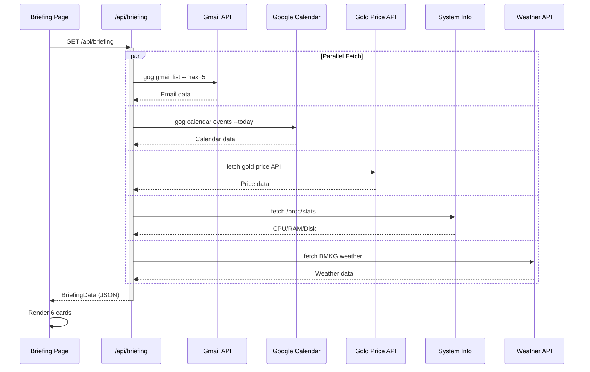

> 💡 **Tips:** Loading state di briefing card itu penting karena data di-fetch dari 6 source berbeda. Card yang datanya udah siap muncul dulu, yang belum tetap nampilin skeleton. Jangan nunggu semua selesai baru render!

> ⚠️ **Pitfall:** Harga emas itu data finansial — JANGAN cache! Selalu fetch fresh data. Beda sama cuaca yang bisa cache 30 menit, harga emas bisa berubah tiap menit.

---

> ✅ **Part 4 selesai!** Morning briefing page siap. Lanjut ke Part 5 — System Monitor.

---

# 🖥️ PART 5: System Monitor

Ini halaman yang nampilin real-time system metrics — CPU, RAM, Disk — dalam bentuk gauge SVG yang animasinya smooth abis. Plus tabel proses yang auto-refresh.

## 5.1 API Route — System Data

Buat `src/app/api/system/route.ts`:

```typescript
// src/app/api/system/route.ts
import { NextResponse } from "next/server";

export interface SystemData {
  metrics: {
    cpu: number;
    ram: number;
    disk: number;
  };
  processes: Array<{
    pid: number;
    name: string;
    cpu: number;
    mem: number;
  }>;
  uptime: string;
}

// Mock data — nanti ganti dengan baca /proc/stat dll
function getMockSystemData(): SystemData {
  // Randomize sedikit biar kayak real-time
  const jitter = () => Math.random() * 10 - 5;

  return {
    metrics: {
      cpu: Math.max(0, Math.min(100, 34 + jitter())),
      ram: Math.max(0, Math.min(100, 62 + jitter())),
      disk: 45, // Disk jarang berubah
    },
    processes: [
      { pid: 1, name: "openclaw", cpu: 12.5, mem: 8.3 },
      { pid: 2, name: "node (gateway)", cpu: 8.2, mem: 15.1 },
      { pid: 3, name: "nginx", cpu: 1.3, mem: 2.4 },
      { pid: 4, name: "postgres", cpu: 5.7, mem: 12.8 },
      { pid: 5, name: "redis-server", cpu: 0.8, mem: 3.2 },
      { pid: 6, name: "python3 (skills)", cpu: 3.1, mem: 5.6 },
      { pid: 7, name: "gog", cpu: 0.4, mem: 1.8 },
      { pid: 8, name: "n8n", cpu: 2.9, mem: 9.7 },
      { pid: 9, name: "cron", cpu: 0.1, mem: 0.3 },
      { pid: 10, name: "sshd", cpu: 0.0, mem: 0.5 },
    ].map((p) => ({
      ...p,
      cpu: Math.max(0, p.cpu + Math.random() * 2 - 1),
    })),
    uptime: "42 hari, 7 jam, 23 menit",
  };
}

export async function GET() {
  try {
    // TODO: Baca data asli dari system
    // const cpu = await readCpuUsage();
    // const ram = await readMemInfo();
    // const disk = await readDiskUsage();
    // const procs = await readProcesses();

    const data = getMockSystemData();
    return NextResponse.json(data);
  } catch (error) {
    return NextResponse.json(
      { error: "Gagal fetch system data" },
      { status: 500 }
    );
  }
}
```

## 5.2 Circular Gauge Component

Buat `src/components/system/gauge.tsx`:

```tsx
// src/components/system/gauge.tsx
"use client";

import { cn } from "@/lib/utils";

interface GaugeProps {
  value: number;         // 0-100
  label: string;         // "CPU", "RAM", dll
  color: string;         // Tailwind stroke color class
  size?: number;         // SVG size (default 160)
  strokeWidth?: number;  // Ketebalan stroke (default 12)
}

/**
 * Circular SVG gauge buat monitoring.
 * Menggunakan stroke-dasharray & stroke-dashoffset untuk animasi fill.
 */
export function Gauge({
  value,
  label,
  color,
  size = 160,
  strokeWidth = 12,
}: GaugeProps) {
  // Clamp value 0-100
  const clampedValue = Math.max(0, Math.min(100, value));

  // Hitung circumference & offset
  const radius = (size - strokeWidth) / 2;
  const circumference = 2 * Math.PI * radius;
  const offset = circumference - (clampedValue / 100) * circumference;

  // Warna berdasarkan level
  const getColor = () => {
    if (clampedValue >= 90) return { stroke: "#ef4444", text: "text-red-600" };  // Merah — danger
    if (clampedValue >= 70) return { stroke: "#f59e0b", text: "text-amber-600" }; // Kuning — warning
    return { stroke: "#22c55e", text: "text-green-600" };                         // Hijau — normal
  };

  const colors = getColor();

  return (
    <div className="flex flex-col items-center">
      <div className="relative" style={{ width: size, height: size }}>
        <svg
          width={size}
          height={size}
          className="-rotate-90"
          viewBox={`0 0 ${size} ${size}`}
        >
          {/* Background circle */}
          <circle
            cx={size / 2}
            cy={size / 2}
            r={radius}
            fill="none"
            stroke="#e2e8f0"
            strokeWidth={strokeWidth}
          />
          {/* Value circle (animated) */}
          <circle
            cx={size / 2}
            cy={size / 2}
            r={radius}
            fill="none"
            stroke={colors.stroke}
            strokeWidth={strokeWidth}
            strokeLinecap="round"
            strokeDasharray={circumference}
            strokeDashoffset={offset}
            className="transition-all duration-1000 ease-out"
          />
        </svg>
        {/* Value text di tengah */}
        <div className="absolute inset-0 flex flex-col items-center justify-center">
          <span className={cn("text-3xl font-bold", colors.text)}>
            {Math.round(clampedValue)}%
          </span>
        </div>
      </div>
      {/* Label di bawah gauge */}
      <span className="mt-2 text-sm font-medium text-slate-600">{label}</span>
    </div>
  );
}
```

> 💡 **Tips:** SVG gauge itu lebih performant daripada canvas buat hal simple kayak ini. Nggak perlu `requestAnimationFrame`, cukup CSS transition `duration-1000` buat smooth animation saat value berubah.

> ⚠️ **Pitfall:** Jangan lupa `-rotate-90` di SVG. Default SVG circle mulai dari posisi 3 o'clock (kanan). Rotate -90° bikin dia mulai dari 12 o'clock (atas) — yang more natural buat gauge.

## 5.3 Process Table Component

Buat `src/components/system/process-table.tsx`:

```tsx
// src/components/system/process-table.tsx
"use client";

import { Card, CardContent, CardHeader, CardTitle } from "@/components/ui/card";
import {
  Table,
  TableBody,
  TableCell,
  TableHead,
  TableHeader,
  TableRow,
} from "@/components/ui/table";
import { cn } from "@/lib/utils";

interface Process {
  pid: number;
  name: string;
  cpu: number;
  mem: number;
}

interface ProcessTableProps {
  processes: Process[];
}

export function ProcessTable({ processes }: ProcessTableProps) {
  return (
    <Card className="hover:shadow-md transition-shadow duration-200">
      <CardHeader className="pb-3">
        <CardTitle className="text-base font-semibold text-slate-900">
          ⚙️ Proses Aktif
        </CardTitle>
      </CardHeader>
      <CardContent>
        <Table>
          <TableHeader>
            <TableRow>
              <TableHead className="w-16">PID</TableHead>
              <TableHead>Proses</TableHead>
              <TableHead className="w-24 text-right">CPU %</TableHead>
              <TableHead className="w-24 text-right">MEM %</TableHead>
            </TableRow>
          </TableHeader>
          <TableBody>
            {processes.map((proc) => (
              <TableRow key={proc.pid}>
                <TableCell className="font-mono text-xs text-slate-400">
                  {proc.pid}
                </TableCell>
                <TableCell className="font-medium text-sm">
                  {proc.name}
                </TableCell>
                <TableCell className="text-right">
                  <CPUBadge value={proc.cpu} />
                </TableCell>
                <TableCell className="text-right">
                  <MEMBadge value={proc.mem} />
                </TableCell>
              </TableRow>
            ))}
          </TableBody>
        </Table>
      </CardContent>
    </Card>
  );
}

/**
 * Badge warna-warni buat CPU usage
 */
function CPUBadge({ value }: { value: number }) {
  const color =
    value >= 10
      ? "bg-red-100 text-red-700"
      : value >= 5
        ? "bg-amber-100 text-amber-700"
        : "bg-green-100 text-green-700";

  return (
    <span
      className={cn(
        "inline-flex items-center justify-center px-2 py-0.5 rounded-md text-xs font-mono font-bold",
        color
      )}
    >
      {value.toFixed(1)}
    </span>
  );
}

/**
 * Badge warna-warni buat Memory usage
 */
function MEMBadge({ value }: { value: number }) {
  const color =
    value >= 15
      ? "bg-red-100 text-red-700"
      : value >= 8
        ? "bg-amber-100 text-amber-700"
        : "bg-blue-100 text-blue-700";

  return (
    <span
      className={cn(
        "inline-flex items-center justify-center px-2 py-0.5 rounded-md text-xs font-mono font-bold",
        color
      )}
    >
      {value.toFixed(1)}
    </span>
  );
}
```

## 5.4 System Monitor Page

Buat `src/app/system/page.tsx`:

```tsx
// src/app/system/page.tsx
"use client";

import { useState, useEffect, useCallback } from "react";
import { Gauge } from "@/components/system/gauge";
import { ProcessTable } from "@/components/system/process-table";
import { Card, CardContent } from "@/components/ui/card";
import { Button } from "@/components/ui/button";
import { RefreshCw, Activity } from "lucide-react";

interface SystemData {
  metrics: { cpu: number; ram: number; disk: number };
  processes: Array<{
    pid: number;
    name: string;
    cpu: number;
    mem: number;
  }>;
  uptime: string;
}

// Interval polling — 5 detik
const POLL_INTERVAL = 5000;

export default function SystemPage() {
  const [data, setData] = useState<SystemData | null>(null);
  const [loading, setLoading] = useState(true);
  const [polling, setPolling] = useState(true);
  const [lastUpdate, setLastUpdate] = useState<Date | null>(null);

  const fetchSystem = useCallback(async () => {
    try {
      const res = await fetch("/api/system");
      const json = await res.json();
      setData(json);
      setLastUpdate(new Date());
    } catch (err) {
      console.error("Gagal fetch system:", err);
    } finally {
      setLoading(false);
    }
  }, []);

  // Initial fetch + polling
  useEffect(() => {
    fetchSystem();

    if (polling) {
      const interval = setInterval(fetchSystem, POLL_INTERVAL);
      return () => clearInterval(interval);
    }
  }, [polling, fetchSystem]);

  // Loading state
  if (loading || !data) {
    return (
      <div className="space-y-6 animate-pulse">
        <div className="grid grid-cols-1 md:grid-cols-3 gap-6">
          {[...Array(3)].map((_, i) => (
            <div key={i} className="h-48 bg-slate-200 rounded-xl" />
          ))}
        </div>
        <div className="h-96 bg-slate-200 rounded-xl" />
      </div>
    );
  }

  return (
    <div className="space-y-6">
      {/* Header controls */}
      <div className="flex items-center justify-between">
        <div className="flex items-center gap-2 text-sm text-slate-500">
          <Activity size={14} className={polling ? "text-green-500 animate-pulse" : "text-slate-400"} />
          <span>
            {polling ? "Auto-refresh aktif (5 detik)" : "Polling paused"}
          </span>
          {lastUpdate && (
            <span className="text-xs text-slate-400">
              — Terakhir update:{" "}
              {lastUpdate.toLocaleTimeString("id-ID", { timeZone: "Asia/Makassar" })}
            </span>
          )}
        </div>
        <div className="flex gap-2">
          <Button
            variant="outline"
            size="sm"
            onClick={() => setPolling(!polling)}
            className="gap-2"
          >
            {polling ? (
              <>
                <span className="w-2 h-2 rounded-full bg-green-500 animate-pulse" />
                Pause
              </>
            ) : (
              "Resume"
            )}
          </Button>
          <Button
            variant="outline"
            size="sm"
            onClick={fetchSystem}
            className="gap-2"
          >
            <RefreshCw size={14} />
            Refresh
          </Button>
        </div>
      </div>

      {/* Gauge section */}
      <div className="grid grid-cols-1 md:grid-cols-3 gap-6">
        <Card>
          <CardContent className="p-6 flex flex-col items-center">
            <Gauge value={data.metrics.cpu} label="CPU Usage" />
          </CardContent>
        </Card>
        <Card>
          <CardContent className="p-6 flex flex-col items-center">
            <Gauge value={data.metrics.ram} label="RAM Usage" />
          </CardContent>
        </Card>
        <Card>
          <CardContent className="p-6 flex flex-col items-center">
            <Gauge value={data.metrics.disk} label="Disk Usage" />
          </CardContent>
        </Card>
      </div>

      {/* Uptime info */}
      <Card>
        <CardContent className="p-4 flex items-center gap-3">
          <span className="text-sm text-slate-500">Uptime:</span>
          <span className="text-sm font-mono font-bold text-slate-900">
            {data.uptime}
          </span>
        </CardContent>
      </Card>

      {/* Process table */}
      <ProcessTable processes={data.processes} />
    </div>
  );
}
```

## 5.5 Data Polling Sequence Diagram

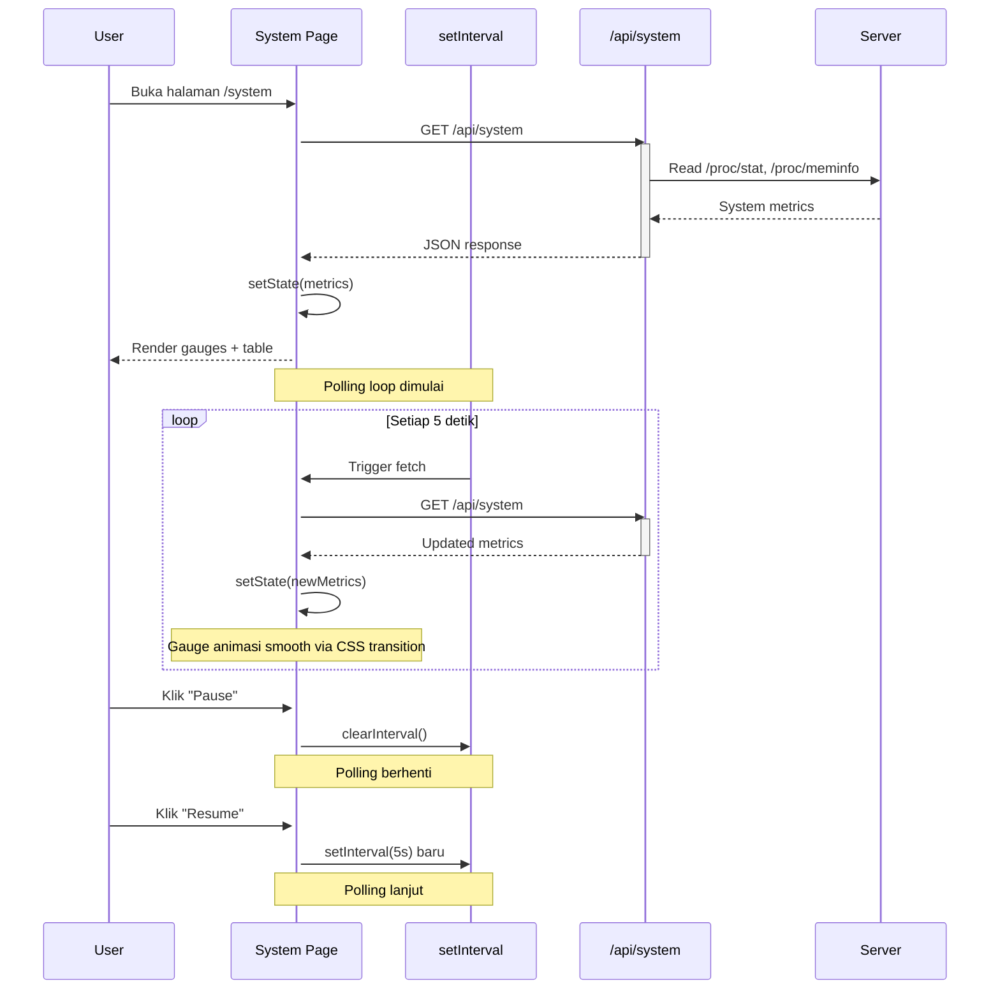

> 💡 **Tips:** Gunakan `useCallback` buat `fetchSystem` biar nggak bikin re-render tak terbatas di `useEffect` dependency array. Tanpa `useCallback`, function baru dibuat tiap render → `useEffect` trigger ulang terus → infinite loop!

> ⚠️ **Pitfall:** Jangan polling terlalu cepat (< 2 detik) ke API route yang nge-fetch system data. Bisa bikin server overload. 5 detik itu sweet spot — cukup realtime tapi nggak bikin server nangis.

---

> ✅ **Part 5 selesai!** System monitor dengan gauge SVG & tabel proses sudah jadi. Lanjut ke Part 6.

---

# 💬 PART 6: Sessions Page

Halaman ini menampilkan session aktif AI agent — siapa yang chat, model apa yang dipake, berapa lama, dan status-nya. Plus chart distribusi session per model.

## 6.1 API Route — Sessions Data

Buat `src/app/api/sessions/route.ts`:

```typescript
// src/app/api/sessions/route.ts
import { NextResponse } from "next/server";

export interface SessionItem {
  id: string;
  agent: string;
  model: string;
  messages: number;
  duration: number; // dalam detik
  status: "active" | "idle" | "completed";
  startedAt: string;
}

export interface SessionsData {
  sessions: SessionItem[];
  modelDistribution: Array<{ model: string; count: number }>;
  totalToday: number;
  totalActive: number;
}

const mockData: SessionsData = {
  sessions: [
    {
      id: "radit:main",
      agent: "Radit",
      model: "GLM-5 Turbo",
      messages: 47,
      duration: 3420,
      status: "active",
      startedAt: "2026-03-28T08:30:00+08:00",
    },
    {
      id: "raka:content",
      agent: "Raka",
      model: "GPT-4o",
      messages: 23,
      duration: 1200,
      status: "active",
      startedAt: "2026-03-28T09:15:00+08:00",
    },
    {
      id: "rama:analytics",
      agent: "Rama",
      model: "DeepSeek V3",
      messages: 12,
      duration: 600,
      status: "idle",
      startedAt: "2026-03-28T07:00:00+08:00",
    },
    {
      id: "rafi:deploy",
      agent: "Rafi",
      model: "GLM-5 Turbo",
      messages: 8,
      duration: 300,
      status: "completed",
      startedAt: "2026-03-28T06:45:00+08:00",
    },
    {
      id: "radit:heartbeat",
      agent: "Radit",
      model: "GLM-5 Turbo",
      messages: 3,
      duration: 45,
      status: "completed",
      startedAt: "2026-03-28T08:00:00+08:00",
    },
  ],
  modelDistribution: [
    { model: "GLM-5 Turbo", count: 45 },
    { model: "GPT-4o", count: 28 },
    { model: "DeepSeek V3", count: 18 },
    { model: "Gemini Pro", count: 8 },
    { model: "Claude 3.5", count: 5 },
  ],
  totalToday: 104,
  totalActive: 2,
};

export async function GET() {
  try {
    // TODO: Fetch dari agent session manager
    return NextResponse.json(mockData);
  } catch (error) {
    return NextResponse.json(
      { error: "Gagal fetch sessions" },
      { status: 500 }
    );
  }
}
```

## 6.2 Session Table Component

Buat `src/components/sessions/session-table.tsx`:

```tsx
// src/components/sessions/session-table.tsx
"use client";

import { Card, CardContent, CardHeader, CardTitle } from "@/components/ui/card";
import {
  Table,
  TableBody,
  TableCell,
  TableHead,
  TableHeader,
  TableRow,
} from "@/components/ui/table";
import { Badge } from "@/components/ui/badge";
import { cn, formatDuration } from "@/lib/utils";

interface Session {
  id: string;
  agent: string;
  model: string;
  messages: number;
  duration: number;
  status: "active" | "idle" | "completed";
  startedAt: string;
}

interface SessionTableProps {
  sessions: Session[];
}

// Konfigurasi status badge
const statusConfig = {
  active: { label: "Active", color: "bg-green-100 text-green-700 border-green-200" },
  idle: { label: "Idle", color: "bg-amber-100 text-amber-700 border-amber-200" },
  completed: { label: "Done", color: "bg-slate-100 text-slate-500 border-slate-200" },
};

export function SessionTable({ sessions }: SessionTableProps) {
  return (
    <Card className="hover:shadow-md transition-shadow duration-200">
      <CardHeader className="pb-3">
        <CardTitle className="text-base font-semibold text-slate-900">
          📋 Sessions Aktif
        </CardTitle>
      </CardHeader>
      <CardContent>
        <div className="overflow-x-auto">
          <Table>
            <TableHeader>
              <TableRow>
                <TableHead>Agent</TableHead>
                <TableHead>Session ID</TableHead>
                <TableHead>Model</TableHead>
                <TableHead className="text-right">Messages</TableHead>
                <TableHead className="text-right">Duration</TableHead>
                <TableHead>Status</TableHead>
              </TableRow>
            </TableHeader>
            <TableBody>
              {sessions.map((session) => {
                const status = statusConfig[session.status];

                return (
                  <TableRow key={session.id}>
                    {/* Agent name */}
                    <TableCell className="font-medium text-sm">
                      {session.agent}
                    </TableCell>
                    {/* Session ID */}
                    <TableCell className="font-mono text-xs text-slate-400">
                      {session.id}
                    </TableCell>
                    {/* Model */}
                    <TableCell>
                      <Badge variant="outline" className="text-xs">
                        {session.model}
                      </Badge>
                    </TableCell>
                    {/* Messages count */}
                    <TableCell className="text-right font-mono text-sm">
                      {session.messages}
                    </TableCell>
                    {/* Duration */}
                    <TableCell className="text-right font-mono text-sm text-slate-500">
                      {formatDuration(session.duration)}
                    </TableCell>
                    {/* Status */}
                    <TableCell>
                      <Badge
                        variant="outline"
                        className={cn("text-xs border", status.color)}
                      >
                        <span className="mr-1">
                          {session.status === "active" && "🟢"}
                          {session.status === "idle" && "🟡"}
                          {session.status === "completed" && "⚪"}
                        </span>
                        {status.label}
                      </Badge>
                    </TableCell>
                  </TableRow>
                );
              })}
            </TableBody>
          </Table>
        </div>
      </CardContent>
    </Card>
  );
}
```

## 6.3 Session Chart Component

Buat `src/components/sessions/session-chart.tsx`:

```tsx
// src/components/sessions/session-chart.tsx
"use client";

import { Card, CardContent, CardHeader, CardTitle } from "@/components/ui/card";
import {
  BarChart,
  Bar,
  XAxis,
  YAxis,
  CartesianGrid,
  Tooltip,
  ResponsiveContainer,
  Cell,
} from "recharts";

interface SessionChartProps {
  data: Array<{ model: string; count: number }>;
}

// Warna beda-beda buat tiap bar
const BAR_COLORS = ["#22c55e", "#3b82f6", "#f59e0b", "#8b5cf6", "#ec4899"];

export function SessionChart({ data }: SessionChartProps) {
  return (
    <Card className="hover:shadow-md transition-shadow duration-200">
      <CardHeader className="pb-2">
        <CardTitle className="text-base font-semibold text-slate-900">
          📊 Distribusi Model
        </CardTitle>
      </CardHeader>
      <CardContent>
        <div className="h-[280px] w-full">
          <ResponsiveContainer width="100%" height="100%">
            <BarChart
              data={data}
              margin={{ top: 10, right: 10, left: -10, bottom: 0 }}
            >
              <CartesianGrid strokeDasharray="3 3" stroke="#e2e8f0" />
              <XAxis
                dataKey="model"
                tick={{ fontSize: 11, fill: "#94a3b8" }}
                axisLine={{ stroke: "#e2e8f0" }}
                tickLine={false}
              />
              <YAxis
                tick={{ fontSize: 12, fill: "#94a3b8" }}
                axisLine={false}
                tickLine={false}
              />
              <Tooltip
                contentStyle={{
                  backgroundColor: "white",
                  border: "1px solid #e2e8f0",
                  borderRadius: "8px",
                  fontSize: "13px",
                  boxShadow: "0 4px 6px -1px rgba(0,0,0,0.1)",
                }}
                formatter={(value: number) => [
                  `${value} sessions`,
                  "Count",
                ]}
              />
              <Bar dataKey="count" radius={[6, 6, 0, 0]}>
                {data.map((_, index) => (
                  <Cell
                    key={`cell-${index}`}
                    fill={BAR_COLORS[index % BAR_COLORS.length]}
                  />
                ))}
              </Bar>
            </BarChart>
          </ResponsiveContainer>
        </div>
      </CardContent>
    </Card>
  );
}
```

## 6.4 Sessions Page

Buat `src/app/sessions/page.tsx`:

```tsx
// src/app/sessions/page.tsx
"use client";

import { useState, useEffect, useCallback } from "react";
import { SessionTable } from "@/components/sessions/session-table";
import { SessionChart } from "@/components/sessions/session-chart";
import { Card, CardContent } from "@/components/ui/card";
import { Badge } from "@/components/ui/badge";
import { RefreshCw } from "lucide-react";
import { Button } from "@/components/ui/button";

interface Session {
  id: string;
  agent: string;
  model: string;
  messages: number;
  duration: number;
  status: "active" | "idle" | "completed";
  startedAt: string;
}

interface SessionsData {
  sessions: Session[];
  modelDistribution: Array<{ model: string; count: number }>;
  totalToday: number;
  totalActive: number;
}

const REFRESH_INTERVAL = 30000; // 30 detik

export default function SessionsPage() {
  const [data, setData] = useState<SessionsData | null>(null);
  const [loading, setLoading] = useState(true);
  const [autoRefresh, setAutoRefresh] = useState(true);

  const fetchSessions = useCallback(async () => {
    try {
      const res = await fetch("/api/sessions");
      const json = await res.json();
      setData(json);
    } catch (err) {
      console.error("Gagal fetch sessions:", err);
    } finally {
      setLoading(false);
    }
  }, []);

  useEffect(() => {
    fetchSessions();

    if (autoRefresh) {
      const interval = setInterval(fetchSessions, REFRESH_INTERVAL);
      return () => clearInterval(interval);
    }
  }, [autoRefresh, fetchSessions]);

  if (loading || !data) {
    return (
      <div className="space-y-6 animate-pulse">
        <div className="grid grid-cols-1 md:grid-cols-3 gap-4">
          {[...Array(3)].map((_, i) => (
            <div key={i} className="h-24 bg-slate-200 rounded-xl" />
          ))}
        </div>
        <div className="h-80 bg-slate-200 rounded-xl" />
      </div>
    );
  }

  return (
    <div className="space-y-6">
      {/* Summary cards */}
      <div className="grid grid-cols-1 md:grid-cols-3 gap-4">
        <Card>
          <CardContent className="p-5 flex items-center gap-4">
            <div className="p-3 rounded-xl bg-blue-50">
              <span className="text-2xl">💬</span>
            </div>
            <div>
              <p className="text-sm text-slate-500">Total Hari Ini</p>
              <p className="text-2xl font-bold text-slate-900">
                {data.totalToday}
              </p>
            </div>
          </CardContent>
        </Card>
        <Card>
          <CardContent className="p-5 flex items-center gap-4">
            <div className="p-3 rounded-xl bg-green-50">
              <span className="text-2xl">🟢</span>
            </div>
            <div>
              <p className="text-sm text-slate-500">Aktif Sekarang</p>
              <p className="text-2xl font-bold text-green-600">
                {data.totalActive}
              </p>
            </div>
          </CardContent>
        </Card>
        <Card>
          <CardContent className="p-5 flex items-center gap-4">
            <div className="p-3 rounded-xl bg-purple-50">
              <span className="text-2xl">🤖</span>
            </div>
            <div>
              <p className="text-sm text-slate-500">Models</p>
              <p className="text-2xl font-bold text-slate-900">
                {data.modelDistribution.length}
              </p>
            </div>
          </CardContent>
        </Card>
      </div>

      {/* Auto-refresh control */}
      <div className="flex items-center justify-between">
        <div className="flex items-center gap-2 text-sm text-slate-500">
          <span className={autoRefresh ? "text-green-500" : "text-slate-400"}>
            {autoRefresh ? "●" : "○"}
          </span>
          <span>
            {autoRefresh
              ? `Auto-refresh aktif (${REFRESH_INTERVAL / 1000} detik)`
              : "Auto-refresh mati"}
          </span>
        </div>
        <Button
          variant="outline"
          size="sm"
          onClick={() => setAutoRefresh(!autoRefresh)}
          className="gap-2"
        >
          <RefreshCw
            size={14}
            className={autoRefresh ? "animate-spin" : ""}
          />
          {autoRefresh ? "Pause" : "Resume"}
        </Button>
      </div>

      {/* Table + Chart */}
      <div className="grid grid-cols-1 lg:grid-cols-3 gap-6">
        <div className="lg:col-span-2">
          <SessionTable sessions={data.sessions} />
        </div>
        <div>
          <SessionChart data={data.modelDistribution} />
        </div>
      </div>
    </div>
  );
}
```

## 6.5 Session Lifecycle State Diagram

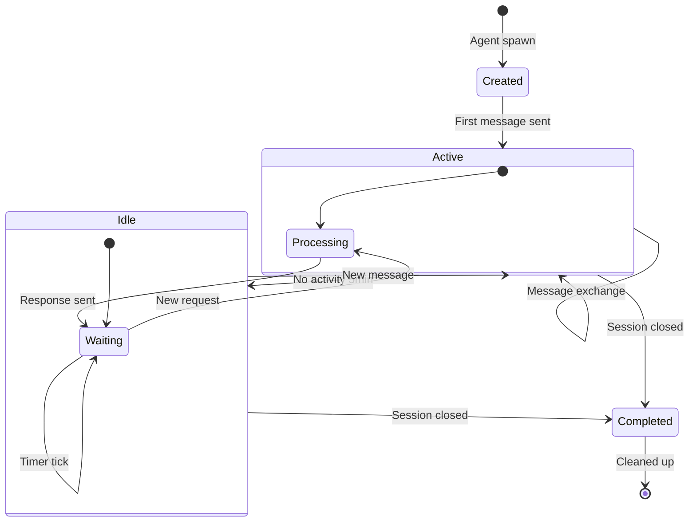

> 💡 **Tips:** Session table pake `font-mono` buat ID & angka biar gampang dibaca. Data technical kayak PID, session ID, duration — semuanya lebih enak pake monospace font.

> ⚠️ **Pitfall:** Auto-refresh 30 detik itu cukup untuk session list. Tapi jangan lupa cleanup interval di `useEffect` return! Kalau component unmount tapi interval masih jalan → memory leak & error console.

---

> ✅ **Part 6 selesai!** Sessions page dengan table + chart sudah siap. Lanjut ke Part 7 — Skills Hub.

---

# ⚡ PART 7: Skills Hub

Ini halaman terakhir dan paling kompleks — skill management hub. Bisa search, filter, audit, edit, dan AI-optimize skill.

## 7.1 API Route — Skills Data

Buat `src/app/api/skills/route.ts`:

```typescript
// src/app/api/skills/route.ts
import { NextResponse } from "next/server";

export interface SkillItem {
  name: string;
  category: string;
  description: string;
  hasSkillMd: boolean;
  hasScriptsDir: boolean;
  hasExecutePermission: boolean;
  issues: string[];
}

export interface SkillsData {
  skills: SkillItem[];
  categories: string[];
  totalSkills: number;
  issuesCount: number;
}

// Mock skills data
const mockSkills: SkillsData = {
  skills: [
    {
      name: "smart-search",
      category: "search",
      description: "Web search pakai Brave API",
      hasSkillMd: true,
      hasScriptsDir: true,
      hasExecutePermission: true,
      issues: [],
    },
    {
      name: "bmkg-monitor",
      category: "monitoring",
      description: "Monitor gempa dan cuaca Indonesia",
      hasSkillMd: true,
      hasScriptsDir: true,
      hasExecutePermission: true,
      issues: [],
    },
    {
      name: "football-livescore",
      category: "entertainment",
      description: "Cek skor bola real-time",
      hasSkillMd: true,
      hasScriptsDir: true,
      hasExecutePermission: false,
      issues: ["scripts/ tidak punya execute permission"],
    },
    {
      name: "email-summarizer",
      category: "communication",
      description: "Ringkas email otomatis",
      hasSkillMd: true,
      hasScriptsDir: false,
      hasExecutePermission: false,
      issues: ["scripts/ directory tidak ada", "scripts/ tidak punya execute permission"],
    },
    {
      name: "gold-price",
      category: "finance",
      description: "Cek harga emas real-time",
      hasSkillMd: false,
      hasScriptsDir: true,
      hasExecutePermission: true,
      issues: ["SKILL.md tidak ditemukan"],
    },
    {
      name: "github-deploy",
      category: "devops",
      description: "Auto-deploy dari GitHub push",
      hasSkillMd: true,
      hasScriptsDir: true,
      hasExecutePermission: true,
      issues: [],
    },
    {
      name: "weather-forecast",
      category: "monitoring",
      description: "Cuaca 7 hari ke depan",
      hasSkillMd: true,
      hasScriptsDir: true,
      hasExecutePermission: true,
      issues: [],
    },
    {
      name: "cron-manager",
      category: "automation",
      description: "Kelola cron jobs",
      hasSkillMd: true,
      hasScriptsDir: false,
      hasExecutePermission: false,
      issues: ["scripts/ directory tidak ada", "scripts/ tidak punya execute permission"],
    },
  ],
  categories: [
    "search",
    "monitoring",
    "entertainment",
    "communication",
    "finance",
    "devops",
    "automation",
  ],
  totalSkills: 8,
  issuesCount: 5,
};

// GET — Ambil semua skills
export async function GET() {
  return NextResponse.json(mockSkills);
}

// POST — Fix skill issues
export async function POST(request: Request) {
  const body = await request.json();
  const { skillName, action } = body;

  // TODO: Implementasi fix sesungguhnya
  // Contoh: chmod +x scripts/*.sh, touch SKILL.md, mkdir scripts
  console.log(`Fix request: ${skillName} - ${action}`);

  return NextResponse.json({
    success: true,
    message: `Fixed ${action} for ${skillName}`,
  });
}

// PUT — Update SKILL.md content
export async function PUT(request: Request) {
  const body = await request.json();
  const { skillName, content } = body;

  // TODO: Tulis ke file SKILL.md
  console.log(`Update SKILL.md for ${skillName}: ${content.length} chars`);

  return NextResponse.json({
    success: true,
    message: `Updated SKILL.md for ${skillName}`,
  });
}
```

## 7.2 Skill Card Component

Buat `src/components/skills/skill-card.tsx`:

```tsx
// src/components/skills/skill-card.tsx
"use client";

import { Card, CardContent, CardHeader, CardTitle } from "@/components/ui/card";
import { Badge } from "@/components/ui/badge";
import { Button } from "@/components/ui/button";
import {
  Zap,
  AlertTriangle,
  CheckCircle2,
  FileText,
  FolderOpen,
  Shield,
  Pencil,
  Sparkles,
  Wrench,
} from "lucide-react";
import { cn } from "@/lib/utils";

interface SkillItem {
  name: string;
  category: string;
  description: string;
  hasSkillMd: boolean;
  hasScriptsDir: boolean;
  hasExecutePermission: boolean;
  issues: string[];
}

interface SkillCardProps {
  skill: SkillItem;
  onEdit: (name: string) => void;
  onOptimize: (name: string) => void;
  onFix: (name: string) => void;
}

// Warna badge per kategori
const categoryColors: Record<string, string> = {
  search: "bg-blue-100 text-blue-700",
  monitoring: "bg-green-100 text-green-700",
  entertainment: "bg-purple-100 text-purple-700",
  communication: "bg-cyan-100 text-cyan-700",
  finance: "bg-amber-100 text-amber-700",
  devops: "bg-red-100 text-red-700",
  automation: "bg-indigo-100 text-indigo-700",
};

export function SkillCard({ skill, onEdit, onOptimize, onFix }: SkillCardProps) {
  const hasIssues = skill.issues.length > 0;
  const allGood = !hasIssues;

  return (
    <Card
      className={cn(
        "hover:shadow-md transition-all duration-200 border",
        hasIssues ? "border-amber-200" : "border-transparent"
      )}
    >
      <CardHeader className="pb-3">
        <div className="flex items-start justify-between">
          <div className="flex items-center gap-2">
            <div
              className={cn(
                "p-2 rounded-lg",
                allGood ? "bg-green-50" : "bg-amber-50"
              )}
            >
              <Zap
                size={18}
                className={allGood ? "text-green-600" : "text-amber-600"}
              />
            </div>
            <div>
              <CardTitle className="text-base font-semibold text-slate-900">
                {skill.name}
              </CardTitle>
              <Badge
                className={cn(
                  "text-[10px] mt-1 border-0",
                  categoryColors[skill.category] || "bg-slate-100 text-slate-600"
                )}
                variant="outline"
              >
                {skill.category}
              </Badge>
            </div>
          </div>
          {/* Status indicator */}
          {allGood ? (
            <CheckCircle2 size={20} className="text-green-500" />
          ) : (
            <AlertTriangle size={20} className="text-amber-500" />
          )}
        </div>
      </CardHeader>
      <CardContent className="space-y-3">
        {/* Deskripsi */}
        <p className="text-sm text-slate-600">{skill.description}</p>

        {/* Checklist */}
        <div className="grid grid-cols-3 gap-2">
          <CheckItem
            label="SKILL.md"
            ok={skill.hasSkillMd}
            icon={FileText}
          />
          <CheckItem
            label="scripts/"
            ok={skill.hasScriptsDir}
            icon={FolderOpen}
          />
          <CheckItem
            label="chmod +x"
            ok={skill.hasExecutePermission}
            icon={Shield}
          />
        </div>

        {/* Issues list */}
        {hasIssues && (
          <div className="space-y-1">
            {skill.issues.map((issue, i) => (
              <div
                key={i}
                className="flex items-start gap-1.5 text-xs text-amber-600"
              >
                <span className="mt-0.5">⚠️</span>
                <span>{issue}</span>
              </div>
            ))}
          </div>
        )}

        {/* Action buttons */}
        <div className="flex gap-2 pt-1">
          <Button
            variant="outline"
            size="sm"
            className="flex-1 gap-1 text-xs"
            onClick={() => onEdit(skill.name)}
          >
            <Pencil size={12} />
            Edit
          </Button>
          <Button
            variant="outline"
            size="sm"
            className="flex-1 gap-1 text-xs"
            onClick={() => onOptimize(skill.name)}
          >
            <Sparkles size={12} />
            AI Fix
          </Button>
          {hasIssues && (
            <Button
              variant="outline"
              size="sm"
              className="gap-1 text-xs text-amber-600 border-amber-200 hover:bg-amber-50"
              onClick={() => onFix(skill.name)}
            >
              <Wrench size={12} />
              Fix
            </Button>
          )}
        </div>
      </CardContent>
    </Card>
  );
}

/** Checklist item kecil */
function CheckItem({
  label,
  ok,
  icon: Icon,
}: {
  label: string;
  ok: boolean;
  icon: React.ElementType;
}) {
  return (
    <div className="flex items-center gap-1.5 text-xs">
      <Icon
        size={12}
        className={ok ? "text-green-500" : "text-red-400"}
      />
      <span className={ok ? "text-slate-600" : "text-red-500 line-through"}>
        {label}
      </span>
    </div>
  );
}
```

## 7.3 Skill Audit Component

Buat `src/components/skills/skill-audit.tsx`:

```tsx
// src/components/skills/skill-audit.tsx
"use client";

import { useState } from "react";
import { Card, CardContent, CardHeader, CardTitle } from "@/components/ui/card";
import { Button } from "@/components/ui/button";
import { Badge } from "@/components/ui/badge";
import { CheckCircle2, AlertTriangle, Search } from "lucide-react";
import { toast } from "sonner";

interface SkillItem {
  name: string;
  issues: string[];
}

interface SkillAuditProps {
  skills: SkillItem[];
  onFixAll: () => void;
}

export function SkillAudit({ skills, onFixAll }: SkillAuditProps) {
  const [auditing, setAuditing] = useState(false);

  const totalSkills = skills.length;
  const skillsWithIssues = skills.filter((s) => s.issues.length > 0);
  const totalIssues = skills.reduce((sum, s) => sum + s.issues.length, 0);
  const allClean = totalIssues === 0;

  async function runAudit() {
    setAuditing(true);
    // Simulasi audit process
    await new Promise((resolve) => setTimeout(resolve, 1500));
    setAuditing(false);
    toast.success(`Audit selesai! ${totalIssues} issues ditemukan.`);
  }

  return (
    <Card>
      <CardHeader className="pb-3">
        <div className="flex items-center justify-between">
          <CardTitle className="text-base font-semibold text-slate-900">
            🔍 Skill Audit
          </CardTitle>
          <Button
            variant="outline"
            size="sm"
            onClick={runAudit}
            disabled={auditing}
            className="gap-2"
          >
            <Search size={14} className={auditing ? "animate-pulse" : ""} />
            {auditing ? "Scanning..." : "Run Audit"}
          </Button>
        </div>
      </CardHeader>
      <CardContent>
        <div className="grid grid-cols-3 gap-4 mb-4">
          {/* Total */}
          <div className="text-center p-3 bg-slate-50 rounded-lg">
            <p className="text-2xl font-bold text-slate-900">{totalSkills}</p>
            <p className="text-xs text-slate-500">Total Skills</p>
          </div>
          {/* Clean */}
          <div className="text-center p-3 bg-green-50 rounded-lg">
            <p className="text-2xl font-bold text-green-600">
              {totalSkills - skillsWithIssues.length}
            </p>
            <p className="text-xs text-slate-500">Clean ✅</p>
          </div>
          {/* Issues */}
          <div className="text-center p-3 bg-amber-50 rounded-lg">
            <p className="text-2xl font-bold text-amber-600">{totalIssues}</p>
            <p className="text-xs text-slate-500">Issues ⚠️</p>
          </div>
        </div>

        {/* Skills with issues */}
        {skillsWithIssues.length > 0 && (
          <div className="space-y-2">
            <p className="text-sm font-medium text-slate-700">
              Skills dengan masalah:
            </p>
            {skillsWithIssues.map((skill) => (
              <div
                key={skill.name}
                className="flex items-center justify-between p-2 bg-amber-50 rounded-lg"
              >
                <div className="flex items-center gap-2">
                  <AlertTriangle size={14} className="text-amber-500" />
                  <span className="text-sm font-medium text-slate-700">
                    {skill.name}
                  </span>
                </div>
                <Badge variant="outline" className="text-xs text-amber-700 border-amber-200">
                  {skill.issues.length} issues
                </Badge>
              </div>
            ))}
            <Button
              variant="outline"
              size="sm"
              onClick={onFixAll}
              className="w-full mt-2 gap-2 text-amber-600 border-amber-200 hover:bg-amber-50"
            >
              🛠️ Fix All Issues
            </Button>
          </div>
        )}

        {/* All clean */}
        {allClean && (
          <div className="text-center py-4">
            <CheckCircle2 size={32} className="text-green-500 mx-auto mb-2" />
            <p className="text-sm text-green-600 font-medium">
              Semua skill sudah clean! 🎉
            </p>
          </div>
        )}
      </CardContent>
    </Card>
  );
}
```

## 7.4 Skill Editor Component

Buat `src/components/skills/skill-editor.tsx`:

```tsx
// src/components/skills/skill-editor.tsx
"use client";

import { useState, useEffect } from "react";
import { Card, CardContent, CardHeader, CardTitle } from "@/components/ui/card";
import { Button } from "@/components/ui/button";
import { Textarea } from "@/components/ui/textarea";
import { X, Save, Sparkles, Loader2 } from "lucide-react";
import { toast } from "sonner";

interface SkillEditorProps {
  skillName: string;
  onClose: () => void;
}

export function SkillEditor({ skillName, onClose }: SkillEditorProps) {
  const [content, setContent] = useState("");
  const [loading, setLoading] = useState(true);
  const [saving, setSaving] = useState(false);
  const [optimizing, setOptimizing] = useState(false);
  const [originalContent, setOriginalContent] = useState("");

  // Load SKILL.md content
  useEffect(() => {
    async function loadSkill() {
      try {
        const res = await fetch(`/api/skills?name=${skillName}`);
        const data = await res.json();
        // Mock content — nanti fetch asli dari file
        const mockContent = `# ${skillName}

## Deskripsi
Skill untuk ${skillName} — AI agent automation.

## Usage
\`\`\`bash
bash skills/${skillName}/scripts/run.sh
\`\`\`

## Dependencies
- bash
- curl

## Notes
- Pastikan API key sudah terkonfigurasi
- Run otomatis via cron job
`;
        setContent(mockContent);
        setOriginalContent(mockContent);
      } catch (err) {
        toast.error("Gagal load SKILL.md");
      } finally {
        setLoading(false);
      }
    }
    loadSkill();
  }, [skillName]);

  // Save content
  async function handleSave() {
    setSaving(true);
    try {
      const res = await fetch("/api/skills", {
        method: "PUT",
        headers: { "Content-Type": "application/json" },
        body: JSON.stringify({ skillName, content }),
      });
      if (res.ok) {
        setOriginalContent(content);
        toast.success(`SKILL.md ${skillName} berhasil disimpan!`);
      }
    } catch {
      toast.error("Gagal menyimpan");
    } finally {
      setSaving(false);
    }
  }

  // AI Optimize via Gemini
  async function handleOptimize() {
    setOptimizing(true);
    try {
      const res = await fetch("/api/skills/optimize", {
        method: "POST",
        headers: { "Content-Type": "application/json" },
        body: JSON.stringify({ skillName, content }),
      });
      const data = await res.json();
      if (data.optimized) {
        setContent(data.optimized);
        toast.success("SKILL.md berhasil dioptimasi AI! ✨");
      }
    } catch {
      toast.error("Gagal optimize — cek Gemini API key");
    } finally {
      setOptimizing(false);
    }
  }

  const hasChanges = content !== originalContent;

  if (loading) {
    return (
      <Card>
        <CardContent className="p-6 flex items-center justify-center">
          <Loader2 size={24} className="animate-spin text-primary" />
          <span className="ml-2 text-sm text-slate-500">Loading SKILL.md...</span>
        </CardContent>
      </Card>
    );
  }

  return (
    <Card className="border-primary/20">
      <CardHeader className="pb-3">
        <div className="flex items-center justify-between">
          <CardTitle className="text-base font-semibold text-slate-900">
            ✏️ Edit: {skillName}/SKILL.md
          </CardTitle>
          <Button
            variant="ghost"
            size="icon"
            onClick={onClose}
            className="h-8 w-8"
          >
            <X size={16} />
          </Button>
        </div>
      </CardHeader>
      <CardContent className="space-y-3">
        {/* Textarea editor */}
        <Textarea
          value={content}
          onChange={(e) => setContent(e.target.value)}
          className="min-h-[300px] font-mono text-sm"
          placeholder="Edit SKILL.md di sini..."
        />

        {/* Action bar */}
        <div className="flex items-center justify-between">
          <div className="flex gap-2">
            <Button
              variant="default"
              size="sm"
              onClick={handleSave}
              disabled={saving || !hasChanges}
              className="gap-2"
            >
              <Save size={14} />
              {saving ? "Menyimpan..." : "Simpan"}
            </Button>
            <Button
              variant="outline"
              size="sm"
              onClick={handleOptimize}
              disabled={optimizing}
              className="gap-2 text-purple-600 border-purple-200 hover:bg-purple-50"
            >
              {optimizing ? (
                <Loader2 size={14} className="animate-spin" />
              ) : (
                <Sparkles size={14} />
              )}
              {optimizing ? "Mengoptimasi..." : "AI Optimize"}
            </Button>
          </div>
          {hasChanges && (
            <span className="text-xs text-amber-600">
              ● Perubahan belum disimpan
            </span>
          )}
        </div>
      </CardContent>
    </Card>
  );
}
```

## 7.5 Skills Hub Page

Buat `src/app/skills/page.tsx`:

```tsx
// src/app/skills/page.tsx
"use client";

import { useState, useEffect, useMemo } from "react";
import { SkillCard } from "@/components/skills/skill-card";
import { SkillAudit } from "@/components/skills/skill-audit";
import { SkillEditor } from "@/components/skills/skill-editor";
import { Input } from "@/components/ui/input";
import {
  Select,
  SelectContent,
  SelectItem,
  SelectTrigger,
  SelectValue,
} from "@/components/ui/select";
import { Button } from "@/components/ui/button";
import { Search, Plus } from "lucide-react";
import { toast } from "sonner";

interface SkillItem {
  name: string;
  category: string;
  description: string;
  hasSkillMd: boolean;
  hasScriptsDir: boolean;
  hasExecutePermission: boolean;
  issues: string[];
}

export default function SkillsPage() {
  const [skills, setSkills] = useState<SkillItem[]>([]);
  const [categories, setCategories] = useState<string[]>([]);
  const [loading, setLoading] = useState(true);
  const [search, setSearch] = useState("");
  const [categoryFilter, setCategoryFilter] = useState("all");
  const [editingSkill, setEditingSkill] = useState<string | null>(null);

  // Fetch skills
  useEffect(() => {
    async function fetchSkills() {
      try {
        const res = await fetch("/api/skills");
        const data = await res.json();
        setSkills(data.skills);
        setCategories(data.categories);
      } catch (err) {
        toast.error("Gagal fetch skills");
      } finally {
        setLoading(false);
      }
    }
    fetchSkills();
  }, []);

  // Filter skills berdasarkan search & category
  const filteredSkills = useMemo(() => {
    return skills.filter((skill) => {
      const matchSearch =
        skill.name.toLowerCase().includes(search.toLowerCase()) ||
        skill.description.toLowerCase().includes(search.toLowerCase());
      const matchCategory =
        categoryFilter === "all" || skill.category === categoryFilter;
      return matchSearch && matchCategory;
    });
  }, [skills, search, categoryFilter]);

  // Fix issues untuk satu skill
  async function handleFix(skillName: string) {
    try {
      const res = await fetch("/api/skills", {
        method: "POST",
        headers: { "Content-Type": "application/json" },
        body: JSON.stringify({ skillName, action: "fix" }),
      });
      if (res.ok) {
        toast.success(`Issues ${skillName} berhasil di-fix! 🛠️`);
        // Refresh skills
        const refetch = await fetch("/api/skills");
        const data = await refetch.json();
        setSkills(data.skills);
      }
    } catch {
      toast.error("Gagal fix issues");
    }
  }

  // Fix all issues
  async function handleFixAll() {
    const skillsWithIssues = skills.filter((s) => s.issues.length > 0);
    toast.loading(`Fixing ${skillsWithIssues.length} skills...`, {
      id: "fix-all",
    });

    for (const skill of skillsWithIssues) {
      await handleFix(skill.name);
    }

    toast.success("Semua issues berhasil di-fix! 🎉", { id: "fix-all" });
  }

  // Edit skill
  function handleEdit(name: string) {
    setEditingSkill(name);
  }

  // AI Optimize skill
  function handleOptimize(name: string) {
    setEditingSkill(name);
    toast.info("Buka editor, lalu klik 'AI Optimize' ✨");
  }

  // Loading state
  if (loading) {
    return (
      <div className="space-y-6 animate-pulse">
        <div className="h-12 bg-slate-200 rounded-xl" />
        <div className="grid grid-cols-1 md:grid-cols-2 lg:grid-cols-3 gap-4">
          {[...Array(6)].map((_, i) => (
            <div key={i} className="h-56 bg-slate-200 rounded-xl" />
          ))}
        </div>
      </div>
    );
  }

  return (
    <div className="space-y-6">
      {/* Search & filter bar */}
      <div className="flex flex-col sm:flex-row gap-3">
        <div className="relative flex-1">
          <Search
            size={16}
            className="absolute left-3 top-1/2 -translate-y-1/2 text-slate-400"
          />
          <Input
            placeholder="Cari skill..."
            value={search}
            onChange={(e) => setSearch(e.target.value)}
            className="pl-9"
          />
        </div>
        <Select value={categoryFilter} onValueChange={setCategoryFilter}>
          <SelectTrigger className="w-full sm:w-48">
            <SelectValue placeholder="Kategori" />
          </SelectTrigger>
          <SelectContent>
            <SelectItem value="all">Semua Kategori</SelectItem>
            {categories.map((cat) => (
              <SelectItem key={cat} value={cat}>
                {cat}
              </SelectItem>
            ))}
          </SelectContent>
        </Select>
        <Button variant="outline" className="gap-2" disabled>
          <Plus size={16} />
          Tambah Skill
        </Button>
      </div>

      {/* Skill audit summary */}
      <SkillAudit
        skills={skills}
        onFixAll={handleFixAll}
      />

      {/* Skill editor (kalau sedang edit) */}
      {editingSkill && (
        <SkillEditor
          skillName={editingSkill}
          onClose={() => setEditingSkill(null)}
        />
      )}

      {/* Skills grid */}
      <div className="grid grid-cols-1 md:grid-cols-2 lg:grid-cols-3 gap-4">
        {filteredSkills.map((skill) => (
          <SkillCard
            key={skill.name}
            skill={skill}
            onEdit={handleEdit}
            onOptimize={handleOptimize}
            onFix={handleFix}
          />
        ))}
      </div>

      {/* Empty state */}
      {filteredSkills.length === 0 && (
        <div className="text-center py-12">
          <p className="text-slate-400">
            {search || categoryFilter !== "all"
              ? "Tidak ada skill yang cocok dengan filter."
              : "Belum ada skills."}
          </p>
        </div>
      )}
    </div>
  );
}
```

## 7.6 Skill Audit & Fix Flow Diagram

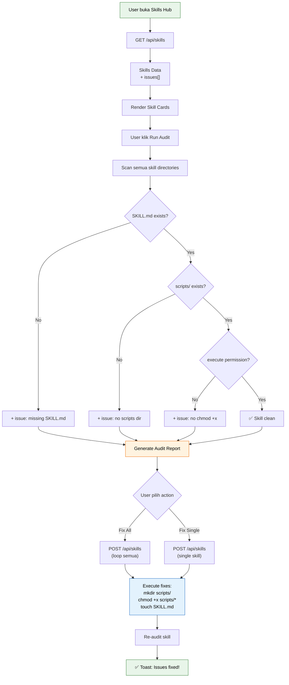

> 💡 **Tips:** `useMemo` buat filter skills itu penting biar nggak re-render semua card tiap kali user ngetik di search bar. Memoization = cache hasil komputasi, hanya recompute kalau dependency berubah.

> ⚠️ **Pitfall:** Toast notification dari Sonner itu fire-and-forget — nggak blocking UI. Jadi user tetap bisa ngelakuin sesuatu sambil toast muncul. Tapi jangan abuse! Maksimal 1 toast per action, jangan spam.

---

# 🎉 Wrapping Up — Part 1-7 Selesai!

Kita udah bangun:

| Part | Halaman | Komponen Utama |
|------|---------|---------------|
| 1 | Setup | Next.js 14, Tailwind, shadcn/ui, folder structure |
| 2 | Layout | Sidebar, Header, Shell wrapper |
| 3 | Dashboard | Stats, Chart, Activity Feed, Clock |
| 4 | Briefing | Email, Calendar, Tasks, Gold, Health, Weather cards |
| 5 | System | Gauge SVG, Process Table, Auto-polling |
| 6 | Sessions | Session Table, Bar Chart, Auto-refresh |
| 7 | Skills Hub | Skill Cards, Search/Filter, Audit, Editor, AI Optimize |

## Quick Start Commands

```bash
# Setup project
npx create-next-app@latest radit-dashboard --typescript --tailwind --app --src-dir --no-eslint
cd radit-dashboard

# Install deps
npm install class-variance-authority clsx tailwind-merge lucide-react recharts
npm install -D tailwindcss-animate

# shadcn/ui
npx shadcn@latest init
npx shadcn@latest add card button badge input select table textarea scroll-area skeleton separator avatar tooltip dropdown-menu sonner

# Run dev server
npm run dev
```

## Next Steps (Bagian 2)

Di bagian 2, kita bakal bahas:
- Dark mode toggle
- Authentication & protected routes
- Real API integration (bukan mock data)
- Deployment ke VPS
- Performance optimization

> 💡 **Tips Terakhir:** Satu hal yang sering dilupakan — **commit code sering-sering!** Jangan nunggu semua selesai baru commit. Setiap selesai satu part → commit. Git itu asuransi, bro.

---

*Ditulis dengan ❤️ dan ☕ oleh Radit AI Assistant*
*Tutorial ini bisa di-copy-paste langsung. Kalau ada error, cek import path dan pastikan semua dependency terinstall.*

# 🤖 Tutorial AI Agent Dashboard — Next.js 14
## Bagian 2: PART 8 — PART 14

> Tutorial lengkap membangun dashboard monitoring untuk AI agent (OpenClaw).  
> **Prasyarat:** Sudah menyelesaikan Bagian 1 (PART 1-7).

---

## 📑 Daftar Isi Bagian 2

| Part | Halaman | Fitur Utama |
|------|---------|-------------|
| 8 | Schedule | Cron jobs, job lifecycle |
| 9 | Logs | Terminal viewer, log pipeline |
| 10 | Models | Model cards, cost comparison |
| 11 | Settings | 7 tab konfigurasi |
| 12 | Animasi | Framer Motion, skeleton, toast |
| 13 | API Routes | Backend Next.js API |
| 14 | Deployment | PM2, Nginx, SSL |

---

# PART 8: Schedule (Cron Jobs) 🕐

Halaman schedule menampilkan semua cron job yang berjalan di AI agent. Kamu bisa melihat jadwal, status, dan mengelola job langsung dari dashboard.

## Arsitektur Cron Job Lifecycle

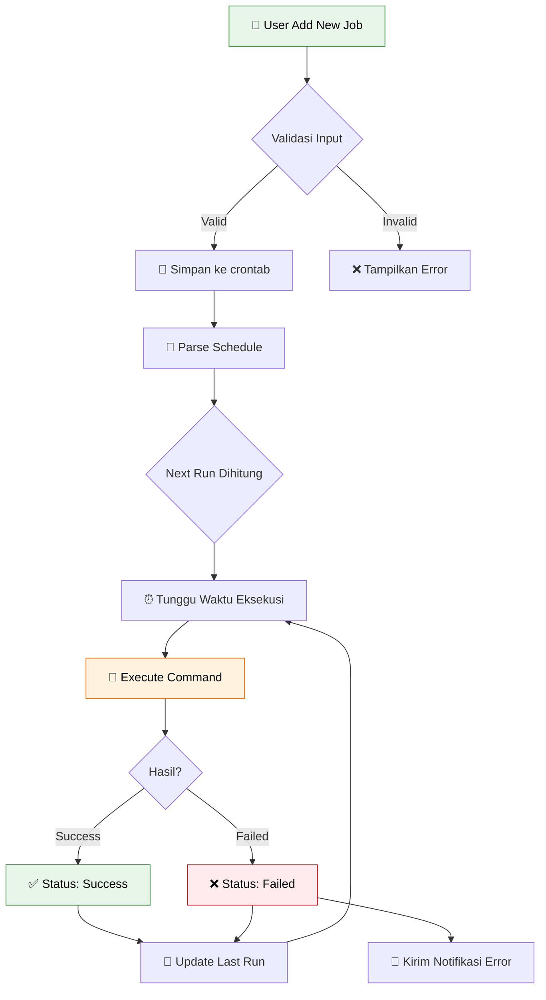

## 8.1 Tipe Data & API

Buat file `app/schedule/types.ts`:

```typescript
// app/schedule/types.ts
// Tipe data untuk halaman Schedule

export type JobStatus = 'active' | 'disabled' | 'failed';

export interface CronJob {
  id: string;               // Unique ID
  name: string;             // Nama job yang mudah dibaca
  schedule: string;         // Cron expression (contoh: "0 */6 * * *")
  scheduleHuman: string;    // Deskripsi human-readable (contoh: "Setiap 6 jam")
  command: string;          // Perintah yang dijalankan
  status: JobStatus;        // Status job
  lastRun: string | null;   // Timestamp terakhir dijalankan
  lastResult: 'success' | 'failed' | 'running' | null;
  nextRun: string | null;   // Timestamp berikutnya
  avgDuration: number;      // Rata-rata durasi dalam detik
  failCount: number;        // Jumlah kegagalan berturut-turut
  createdAt: string;
}

export interface ScheduleStats {
  totalJobs: number;
  activeJobs: number;
  disabledJobs: number;
  failedJobs: number;
}
```

## 8.2 API Route: Schedule

Buat file `app/api/schedule/route.ts`:

```typescript
// app/api/schedule/route.ts
// API endpoint untuk mengambil dan menambah cron jobs
import { NextRequest, NextResponse } from 'next/server';
import { exec } from 'child_process';
import { promisify } from 'util';
import fs from 'fs/promises';
import path from 'path';

const execAsync = promisify(exec);

// Path file data (simulasi — di production gunakan database)
const DATA_DIR = path.join(process.cwd(), 'data');
const JOBS_FILE = path.join(DATA_DIR, 'jobs.json');

// Tipe untuk job
interface CronJob {
  id: string;
  name: string;
  schedule: string;
  scheduleHuman: string;
  command: string;
  status: 'active' | 'disabled' | 'failed';
  lastRun: string | null;
  lastResult: 'success' | 'failed' | 'running' | null;
  nextRun: string | null;
  avgDuration: number;
  failCount: number;
  createdAt: string;
}

// Pastikan direktori data ada
async function ensureDataDir() {
  await fs.mkdir(DATA_DIR, { recursive: true });
}

// Ambil semua jobs
async function getJobs(): Promise<CronJob[]> {
  try {
    await ensureDataDir();
    const data = await fs.readFile(JOBS_FILE, 'utf-8');
    return JSON.parse(data);
  } catch {
    // Kalau file belum ada, return default jobs
    const defaultJobs: CronJob[] = [
      {
        id: 'job-001',
        name: 'Health Check',
        schedule: '*/5 * * * *',
        scheduleHuman: 'Setiap 5 menit',
        command: 'curl -sf http://localhost:3000/api/health',
        status: 'active',
        lastRun: '2026-03-28T20:15:00+08:00',
        lastResult: 'success',
        nextRun: '2026-03-28T20:20:00+08:00',
        avgDuration: 1.2,
        failCount: 0,
        createdAt: '2026-03-15T08:00:00+08:00',
      },
      {
        id: 'job-002',
        name: 'Log Rotation',
        schedule: '0 0 * * *',
        scheduleHuman: 'Setiap hari tengah malam',
        command: '/usr/local/bin/logrotate.sh',
        status: 'active',
        lastRun: '2026-03-28T00:00:00+08:00',
        lastResult: 'success',
        nextRun: '2026-03-29T00:00:00+08:00',
        avgDuration: 3.5,
        failCount: 0,
        createdAt: '2026-03-15T08:00:00+08:00',
      },
      {
        id: 'job-003',
        name: 'Database Backup',
        schedule: '0 2 * * *',
        scheduleHuman: 'Setiap hari jam 2 pagi',
        command: 'pg_dump -Fc radian_db > /backup/db_$(date +%Y%m%d).dump',
        status: 'active',
        lastRun: '2026-03-28T02:00:00+08:00',
        lastResult: 'success',
        nextRun: '2026-03-29T02:00:00+08:00',
        avgDuration: 45.2,
        failCount: 0,
        createdAt: '2026-03-16T10:00:00+08:00',
      },
      {
        id: 'job-004',
        name: 'Morning Briefing',
        schedule: '0 7 * * 1-5',
        scheduleHuman: 'Senin-Jumat jam 7 pagi',
        command: 'openclaw cron trigger morning-briefing',
        status: 'active',
        lastRun: '2026-03-28T07:00:00+08:00',
        lastResult: 'success',
        nextRun: '2026-03-29T07:00:00+08:00',
        avgDuration: 12.8,
        failCount: 0,
        createdAt: '2026-03-17T06:00:00+08:00',
      },
      {
        id: 'job-005',
        name: 'Cache Cleanup',
        schedule: '0 3 * * 0',
        scheduleHuman: 'Setiap Minggu jam 3 pagi',
        command: 'find /tmp -name "*.cache" -mtime +7 -delete',
        status: 'disabled',
        lastRun: '2026-03-23T03:00:00+08:00',
        lastResult: 'success',
        nextRun: null,
        avgDuration: 2.1,
        failCount: 0,
        createdAt: '2026-03-18T09:00:00+08:00',
      },
      {
        id: 'job-006',
        name: 'SSL Renewal Check',
        schedule: '0 8 1 * *',
        scheduleHuman: 'Tanggal 1 setiap bulan jam 8 pagi',
        command: 'certbot renew --dry-run',
        status: 'failed',
        lastRun: '2026-03-01T08:00:00+08:00',
        lastResult: 'failed',
        nextRun: '2026-04-01T08:00:00+08:00',
        avgDuration: 15.3,
        failCount: 1,
        createdAt: '2026-03-18T09:00:00+08:00',
      },
      {
        id: 'job-007',
        name: 'Disk Usage Alert',
        schedule: '0 */4 * * *',
        scheduleHuman: 'Setiap 4 jam',
        command: 'df -h | awk \'NR>1 && int($5)>85\'',
        status: 'active',
        lastRun: '2026-03-28T16:00:00+08:00',
        lastResult: 'success',
        nextRun: '2026-03-28T20:00:00+08:00',
        avgDuration: 0.8,
        failCount: 0,
        createdAt: '2026-03-20T11:00:00+08:00',
      },
      {
        id: 'job-008',
        name: 'Weekly Report',
        schedule: '0 18 * * 5',
        scheduleHuman: 'Setiap Jumat jam 6 sore',
        command: 'openclaw cron trigger weekly-summary',
        status: 'active',
        lastRun: '2026-03-27T18:00:00+08:00',
        lastResult: 'success',
        nextRun: '2026-04-04T18:00:00+08:00',
        avgDuration: 25.6,
        failCount: 0,
        createdAt: '2026-03-20T11:00:00+08:00',
      },
    ];

    // Simpan default ke file
    await fs.writeFile(JOBS_FILE, JSON.stringify(defaultJobs, null, 2));
    return defaultJobs;
  }
}

// GET: Ambil semua jobs + stats
export async function GET() {
  try {
    const jobs = await getJobs();

    // Hitung stats
    const stats = {
      totalJobs: jobs.length,
      activeJobs: jobs.filter(j => j.status === 'active').length,
      disabledJobs: jobs.filter(j => j.status === 'disabled').length,
      failedJobs: jobs.filter(j => j.status === 'failed').length,
    };

    // Hitung distribusi untuk chart
    const distribution = [
      { name: 'Active', value: stats.activeJobs, color: '#22c55e' },
      { name: 'Disabled', value: stats.disabledJobs, color: '#9ca3af' },
      { name: 'Failed', value: stats.failedJobs, color: '#ef4444' },
    ];

    return NextResponse.json({ jobs, stats, distribution });
  } catch (error) {
    console.error('Gagal mengambil schedule data:', error);
    return NextResponse.json(
      { error: 'Gagal mengambil data schedule' },
      { status: 500 }
    );
  }
}

// POST: Toggle job status atau tambah job baru
export async function POST(request: NextRequest) {
  try {
    const body = await request.json();
    const { action, jobId, job } = body;

    const jobs = await getJobs();

    if (action === 'toggle') {
      // Toggle status active/disabled
      const index = jobs.findIndex(j => j.id === jobId);
      if (index === -1) {
        return NextResponse.json({ error: 'Job tidak ditemukan' }, { status: 404 });
      }

      jobs[index].status = jobs[index].status === 'active' ? 'disabled' : 'active';
      if (jobs[index].status === 'active') {
        jobs[index].nextRun = new Date(Date.now() + 3600000).toISOString();
      }

      await fs.writeFile(JOBS_FILE, JSON.stringify(jobs, null, 2));
      return NextResponse.json({ job: jobs[index] });

    } else if (action === 'add') {
      // Tambah job baru
      const newJob: CronJob = {
        id: `job-${String(Date.now()).slice(-6)}`,
        name: job.name,
        schedule: job.schedule,
        scheduleHuman: job.scheduleHuman || job.schedule,
        command: job.command,
        status: 'active',
        lastRun: null,
        lastResult: null,
        nextRun: new Date(Date.now() + 60000).toISOString(),
        avgDuration: 0,
        failCount: 0,
        createdAt: new Date().toISOString(),
      };

      jobs.push(newJob);
      await fs.writeFile(JOBS_FILE, JSON.stringify(jobs, null, 2));
      return NextResponse.json({ job: newJob }, { status: 201 });
    }

    return NextResponse.json({ error: 'Action tidak valid' }, { status: 400 });
  } catch (error) {
    console.error('Gagal mengubah schedule:', error);
    return NextResponse.json(
      { error: 'Gagal mengubah schedule' },
      { status: 500 }
    );
  }
}
```

## 8.3 Komponen Stats Cards

Buat file `app/schedule/components/StatsCards.tsx`:

```tsx
// app/schedule/components/StatsCards.tsx
// Kartu statistik untuk halaman Schedule
'use client';

import { useEffect, useState } from 'react';

interface StatsCardsProps {
  stats: {
    totalJobs: number;
    activeJobs: number;
    disabledJobs: number;
    failedJobs: number;
  };
}

// Komponen animasi counter — angka naik dari 0 ke target
function AnimatedCounter({ target, duration = 1000 }: { target: number; duration?: number }) {
  const [count, setCount] = useState(0);

  useEffect(() => {
    let startTime: number;
    let animationFrame: number;

    const animate = (timestamp: number) => {
      if (!startTime) startTime = timestamp;
      const progress = Math.min((timestamp - startTime) / duration, 1);
      // Easing: ease-out
      const eased = 1 - Math.pow(1 - progress, 3);
      setCount(Math.floor(eased * target));

      if (progress < 1) {
        animationFrame = requestAnimationFrame(animate);
      }
    };

    animationFrame = requestAnimationFrame(animate);
    return () => cancelAnimationFrame(animationFrame);
  }, [target, duration]);

  return <span>{count}</span>;
}

export default function StatsCards({ stats }: StatsCardsProps) {
  const cards = [
    {
      label: 'Total Jobs',
      value: stats.totalJobs,
      icon: '📋',
      color: 'bg-blue-500/10 text-blue-400 border-blue-500/20',
      iconBg: 'bg-blue-500/20',
    },
    {
      label: 'Active',
      value: stats.activeJobs,
      icon: '✅',
      color: 'bg-green-500/10 text-green-400 border-green-500/20',
      iconBg: 'bg-green-500/20',
    },
    {
      label: 'Disabled',
      value: stats.disabledJobs,
      icon: '⏸️',
      color: 'bg-gray-500/10 text-gray-400 border-gray-500/20',
      iconBg: 'bg-gray-500/20',
    },
    {
      label: 'Failed',
      value: stats.failedJobs,
      icon: '❌',
      color: 'bg-red-500/10 text-red-400 border-red-500/20',
      iconBg: 'bg-red-500/20',
    },
  ];

  return (
    <div className="grid grid-cols-1 sm:grid-cols-2 lg:grid-cols-4 gap-4">
      {cards.map((card) => (
        <div
          key={card.label}
          className={`rounded-xl border p-5 ${card.color} transition-all duration-200 hover:scale-[1.02]`}
        >
          <div className="flex items-center justify-between mb-3">
            <span className="text-sm font-medium opacity-80">{card.label}</span>
            <span className={`text-2xl p-2 rounded-lg ${card.iconBg}`}>{card.icon}</span>
          </div>
          <div className="text-3xl font-bold">
            <AnimatedCounter target={card.value} />
          </div>
        </div>
      ))}
    </div>
  );
}
```

> 💡 **Tips:** AnimatedCounter pakai `requestAnimationFrame` supaya smooth dan nggak blocking main thread. Lebih baik daripada `setInterval` untuk animasi angka.

## 8.4 Komponen Job Distribution Chart

Buat file `app/schedule/components/JobChart.tsx`:

```tsx
// app/schedule/components/JobChart.tsx
// Pie chart distribusi job berdasarkan status
'use client';

import { PieChart, Pie, Cell, ResponsiveContainer, Tooltip, Legend } from 'recharts';

interface DistributionItem {
  name: string;
  value: number;
  color: string;
}

interface JobChartProps {
  distribution: DistributionItem[];
}

// Custom tooltip
function CustomTooltip({ active, payload }: { active?: boolean; payload?: Array<{ name: string; value: number; color: string }> }) {
  if (!active || !payload?.length) return null;

  return (
    <div className="bg-gray-800 border border-gray-700 rounded-lg px-3 py-2 shadow-xl">
      <p className="text-sm font-medium" style={{ color: payload[0].color }}>
        {payload[0].name}: {payload[0].value} job(s)
      </p>
    </div>
  );
}

export default function JobChart({ distribution }: JobChartProps) {
  // Filter hanya yang nilainya > 0
  const filtered = distribution.filter(d => d.value > 0);

  return (
    <div className="bg-gray-900/50 border border-gray-800 rounded-xl p-6">
      <h3 className="text-lg font-semibold text-white mb-4">📊 Distribusi Job</h3>
      
      {filtered.length === 0 ? (
        <div className="flex items-center justify-center h-48 text-gray-500">
          Belum ada data job
        </div>
      ) : (
        <ResponsiveContainer width="100%" height={250}>
          <PieChart>
            <Pie
              data={filtered}
              cx="50%"
              cy="50%"
              innerRadius={60}
              outerRadius={90}
              paddingAngle={4}
              dataKey="value"
              stroke="none"
            >
              {filtered.map((entry, index) => (
                <Cell key={`cell-${index}`} fill={entry.color} />
              ))}
            </Pie>
            <Tooltip content={<CustomTooltip />} />
            <Legend
              wrapperStyle={{ fontSize: '13px' }}
              formatter={(value: string) => (
                <span className="text-gray-300">{value}</span>
              )}
            />
          </PieChart>
        </ResponsiveContainer>
      )}
    </div>
  );
}
```

## 8.5 Komponen Toggle Switch

Buat file `app/schedule/components/ToggleSwitch.tsx`:

```tsx
// app/schedule/components/ToggleSwitch.tsx
// Toggle switch untuk enable/disable job
'use client';

import { useState } from 'react';

interface ToggleSwitchProps {
  enabled: boolean;
  onToggle: () => void;
  label?: string;
}

export default function ToggleSwitch({ enabled, onToggle, label }: ToggleSwitchProps) {
  const [loading, setLoading] = useState(false);

  const handleToggle = async () => {
    setLoading(true);
    try {
      await onToggle();
    } finally {
      setLoading(false);
    }
  };

  return (
    <button
      onClick={handleToggle}
      disabled={loading}
      className={`relative inline-flex h-6 w-11 items-center rounded-full transition-colors duration-200 focus:outline-none focus:ring-2 focus:ring-blue-500 focus:ring-offset-2 focus:ring-offset-gray-900 ${
        enabled ? 'bg-green-500' : 'bg-gray-600'
      } ${loading ? 'opacity-50 cursor-wait' : 'cursor-pointer'}`}
      aria-label={label || (enabled ? 'Disable job' : 'Enable job')}
      title={label || (enabled ? 'Klik untuk disable' : 'Klik untuk enable')}
    >
      <span
        className={`inline-block h-4 w-4 transform rounded-full bg-white transition-transform duration-200 ${
          enabled ? 'translate-x-6' : 'translate-x-1'
        }`}
      />
    </button>
  );
}
```

## 8.6 Komponen Job Table

Buat file `app/schedule/components/JobTable.tsx`:

```tsx
// app/schedule/components/JobTable.tsx
// Tabel daftar semua cron jobs
'use client';

import { CronJob } from '../types';
import ToggleSwitch from './ToggleSwitch';

interface JobTableProps {
  jobs: CronJob[];
  onToggle: (jobId: string) => Promise<void>;
}

// Format relative time (contoh: "5 menit lalu")
function formatRelativeTime(dateStr: string | null): string {
  if (!dateStr) return '—';
  
  const now = new Date();
  const date = new Date(dateStr);
  const diffMs = now.getTime() - date.getTime();
  const diffMins = Math.floor(diffMs / 60000);
  const diffHours = Math.floor(diffMins / 60);
  const diffDays = Math.floor(diffHours / 24);

  if (diffMins < 1) return 'Baru saja';
  if (diffMins < 60) return `${diffMins} menit lalu`;
  if (diffHours < 24) return `${diffHours} jam lalu`;
  if (diffDays < 7) return `${diffDays} hari lalu`;
  return date.toLocaleDateString('id-ID', { day: 'numeric', month: 'short', year: 'numeric' });
}

// Badge warna untuk status
function StatusBadge({ status, lastResult }: { status: string; lastResult: string | null }) {
  const styles: Record<string, string> = {
    active: 'bg-green-500/10 text-green-400 border-green-500/30',
    disabled: 'bg-gray-500/10 text-gray-400 border-gray-500/30',
    failed: 'bg-red-500/10 text-red-400 border-red-500/30',
  };

  return (
    <div className="flex items-center gap-2">
      <span className={`px-2.5 py-0.5 text-xs font-medium rounded-full border ${styles[status]}`}>
        {status === 'active' && '🟢 Active'}
        {status === 'disabled' && '⚪ Disabled'}
        {status === 'failed' && '🔴 Failed'}
      </span>
      {lastResult === 'running' && (
        <span className="text-xs text-yellow-400 animate-pulse">⏳ Running</span>
      )}
    </div>
  );
}

export default function JobTable({ jobs, onToggle }: JobTableProps) {
  if (jobs.length === 0) {
    return (
      <div className="bg-gray-900/50 border border-gray-800 rounded-xl p-12 text-center">
        <p className="text-4xl mb-3">📭</p>
        <p className="text-gray-400">Belum ada cron job terdaftar</p>
        <p className="text-sm text-gray-500 mt-1">Klik tombol &quot;Add Job&quot; untuk menambahkan</p>
      </div>
    );
  }

  return (
    <div className="bg-gray-900/50 border border-gray-800 rounded-xl overflow-hidden">
      {/* Header tabel */}
      <div className="overflow-x-auto">
        <table className="w-full text-left">
          <thead>
            <tr className="border-b border-gray-800">
              <th className="px-6 py-4 text-xs font-semibold text-gray-400 uppercase tracking-wider">Job</th>
              <th className="px-6 py-4 text-xs font-semibold text-gray-400 uppercase tracking-wider">Schedule</th>
              <th className="px-6 py-4 text-xs font-semibold text-gray-400 uppercase tracking-wider">Status</th>
              <th className="px-6 py-4 text-xs font-semibold text-gray-400 uppercase tracking-wider">Last Run</th>
              <th className="px-6 py-4 text-xs font-semibold text-gray-400 uppercase tracking-wider">Next Run</th>
              <th className="px-6 py-4 text-xs font-semibold text-gray-400 uppercase tracking-wider">Toggle</th>
            </tr>
          </thead>
          <tbody className="divide-y divide-gray-800/50">
            {jobs.map((job) => (
              <tr key={job.id} className="hover:bg-gray-800/30 transition-colors">
                {/* Nama Job */}
                <td className="px-6 py-4">
                  <div>
                    <p className="font-medium text-white">{job.name}</p>
                    <p className="text-xs text-gray-500 mt-1 font-mono truncate max-w-[250px]">
                      {job.command}
                    </p>
                  </div>
                </td>

                {/* Schedule */}
                <td className="px-6 py-4">
                  <div>
                    <p className="text-sm text-gray-300">{job.scheduleHuman}</p>
                    <p className="text-xs text-gray-500 font-mono">{job.schedule}</p>
                  </div>
                </td>

                {/* Status */}
                <td className="px-6 py-4">
                  <StatusBadge status={job.status} lastResult={job.lastResult} />
                </td>

                {/* Last Run */}
                <td className="px-6 py-4">
                  <p className="text-sm text-gray-300">{formatRelativeTime(job.lastRun)}</p>
                  {job.failCount > 0 && (
                    <p className="text-xs text-red-400 mt-1">{job.failCount}x gagal</p>
                  )}
                </td>

                {/* Next Run */}
                <td className="px-6 py-4">
                  <p className="text-sm text-gray-300">
                    {job.nextRun ? formatRelativeTime(job.nextRun) : '—'}
                  </p>
                  {job.avgDuration > 0 && (
                    <p className="text-xs text-gray-500 mt-1">~{job.avgDuration}s</p>
                  )}
                </td>

                {/* Toggle */}
                <td className="px-6 py-4">
                  <ToggleSwitch
                    enabled={job.status === 'active'}
                    onToggle={() => onToggle(job.id)}
                    label={`${job.status === 'active' ? 'Disable' : 'Enable'} ${job.name}`}
                  />
                </td>
              </tr>
            ))}
          </tbody>
        </table>
      </div>
    </div>
  );
}
```

## 8.7 Komponen Add Job Modal

Buat file `app/schedule/components/AddJobModal.tsx`:

```tsx
// app/schedule/components/AddJobModal.tsx
// Modal form untuk menambahkan cron job baru
'use client';

import { useState } from 'react';

interface AddJobModalProps {
  isOpen: boolean;
  onClose: () => void;
  onAdd: (job: {
    name: string;
    schedule: string;
    scheduleHuman: string;
    command: string;
  }) => Promise<void>;
}

// Preset jadwal yang sering dipakai
const SCHEDULE_PRESETS = [
  { label: 'Setiap 5 menit', value: '*/5 * * * *' },
  { label: 'Setiap 15 menit', value: '*/15 * * * *' },
  { label: 'Setiap 30 menit', value: '*/30 * * * *' },
  { label: 'Setiap 1 jam', value: '0 * * * *' },
  { label: 'Setiap 6 jam', value: '0 */6 * * *' },
  { label: 'Setiap hari (tengah malam)', value: '0 0 * * *' },
  { label: 'Setiap Senin-Jumat (jam 9)', value: '0 9 * * 1-5' },
  { label: 'Setiap Minggu (jam 3)', value: '0 3 * * 0' },
];

export default function AddJobModal({ isOpen, onClose, onAdd }: AddJobModalProps) {
  const [name, setName] = useState('');
  const [schedule, setSchedule] = useState('');
  const [scheduleHuman, setScheduleHuman] = useState('');
  const [command, setCommand] = useState('');
  const [loading, setLoading] = useState(false);
  const [error, setError] = useState('');

  // Reset form
  const resetForm = () => {
    setName('');
    setSchedule('');
    setScheduleHuman('');
    setCommand('');
    setError('');
  };

  // Submit form
  const handleSubmit = async (e: React.FormEvent) => {
    e.preventDefault();

    if (!name.trim() || !schedule.trim() || !command.trim()) {
      setError('Semua field wajib diisi');
      return;
    }

    setLoading(true);
    setError('');

    try {
      await onAdd({
        name: name.trim(),
        schedule: schedule.trim(),
        scheduleHuman: scheduleHuman.trim() || schedule.trim(),
        command: command.trim(),
      });
      resetForm();
      onClose();
    } catch {
      setError('Gagal menambahkan job');
    } finally {
      setLoading(false);
    }
  };

  // Pilih preset schedule
  const selectPreset = (preset: { label: string; value: string }) => {
    setSchedule(preset.value);
    setScheduleHuman(preset.label);
  };

  if (!isOpen) return null;

  return (
    <div className="fixed inset-0 z-50 flex items-center justify-center">
      {/* Backdrop */}
      <div
        className="absolute inset-0 bg-black/60 backdrop-blur-sm"
        onClick={onClose}
      />

      {/* Modal content */}
      <div className="relative bg-gray-900 border border-gray-700 rounded-2xl shadow-2xl w-full max-w-lg mx-4 max-h-[90vh] overflow-y-auto">
        {/* Header */}
        <div className="flex items-center justify-between p-6 border-b border-gray-800">
          <h2 className="text-xl font-bold text-white">➕ Tambah Job Baru</h2>
          <button
            onClick={onClose}
            className="text-gray-400 hover:text-white transition-colors text-xl"
          >
            ✕
          </button>
        </div>

        {/* Form */}
        <form onSubmit={handleSubmit} className="p-6 space-y-5">
          {/* Error message */}
          {error && (
            <div className="bg-red-500/10 border border-red-500/30 text-red-400 rounded-lg px-4 py-3 text-sm">
              ⚠️ {error}
            </div>
          )}

          {/* Nama Job */}
          <div>
            <label className="block text-sm font-medium text-gray-300 mb-2">
              Nama Job *
            </label>
            <input
              type="text"
              value={name}
              onChange={(e) => setName(e.target.value)}
              placeholder="contoh: Daily Backup"
              className="w-full px-4 py-2.5 bg-gray-800 border border-gray-700 rounded-lg text-white placeholder-gray-500 focus:ring-2 focus:ring-blue-500 focus:border-transparent outline-none transition-all"
            />
          </div>

          {/* Schedule */}
          <div>
            <label className="block text-sm font-medium text-gray-300 mb-2">
              Cron Expression *
            </label>
            <input
              type="text"
              value={schedule}
              onChange={(e) => setSchedule(e.target.value)}
              placeholder="contoh: */5 * * * *"
              className="w-full px-4 py-2.5 bg-gray-800 border border-gray-700 rounded-lg text-white placeholder-gray-500 font-mono focus:ring-2 focus:ring-blue-500 focus:border-transparent outline-none transition-all"
            />
            {/* Preset buttons */}
            <div className="flex flex-wrap gap-2 mt-2">
              {SCHEDULE_PRESETS.map((preset) => (
                <button
                  key={preset.value}
                  type="button"
                  onClick={() => selectPreset(preset)}
                  className="px-3 py-1 text-xs bg-gray-800 border border-gray-700 rounded-full text-gray-300 hover:border-blue-500 hover:text-blue-400 transition-colors"
                >
                  {preset.label}
                </button>
              ))}
            </div>
          </div>

          {/* Schedule Human-Readable */}
          <div>
            <label className="block text-sm font-medium text-gray-300 mb-2">
              Deskripsi Jadwal
            </label>
            <input
              type="text"
              value={scheduleHuman}
              onChange={(e) => setScheduleHuman(e.target.value)}
              placeholder="contoh: Setiap 5 menit"
              className="w-full px-4 py-2.5 bg-gray-800 border border-gray-700 rounded-lg text-white placeholder-gray-500 focus:ring-2 focus:ring-blue-500 focus:border-transparent outline-none transition-all"
            />
          </div>

          {/* Command */}
          <div>
            <label className="block text-sm font-medium text-gray-300 mb-2">
              Command *
            </label>
            <textarea
              value={command}
              onChange={(e) => setCommand(e.target.value)}
              placeholder="contoh: /usr/local/bin/my-script.sh"
              rows={3}
              className="w-full px-4 py-2.5 bg-gray-800 border border-gray-700 rounded-lg text-white placeholder-gray-500 font-mono text-sm focus:ring-2 focus:ring-blue-500 focus:border-transparent outline-none transition-all resize-none"
            />
          </div>

          {/* Actions */}
          <div className="flex gap-3 pt-2">
            <button
              type="button"
              onClick={onClose}
              className="flex-1 px-4 py-2.5 bg-gray-800 text-gray-300 rounded-lg hover:bg-gray-700 transition-colors"
            >
              Batal
            </button>
            <button
              type="submit"
              disabled={loading}
              className="flex-1 px-4 py-2.5 bg-blue-600 text-white rounded-lg hover:bg-blue-700 disabled:opacity-50 disabled:cursor-not-allowed transition-colors"
            >
              {loading ? (
                <span className="flex items-center justify-center gap-2">
                  <svg className="animate-spin h-4 w-4" viewBox="0 0 24 24">
                    <circle className="opacity-25" cx="12" cy="12" r="10" stroke="currentColor" strokeWidth="4" fill="none" />
                    <path className="opacity-75" fill="currentColor" d="M4 12a8 8 0 018-8V0C5.373 0 0 5.373 0 12h4z" />
                  </svg>
                  Menyimpan...
                </span>
              ) : (
                '✨ Tambah Job'
              )}
            </button>
          </div>
        </form>
      </div>
    </div>
  );
}
```

## 8.8 Halaman Utama Schedule

Buat file `app/schedule/page.tsx`:

```tsx
// app/schedule/page.tsx
// Halaman utama Schedule — menampilkan semua cron jobs
'use client';

import { useEffect, useState, useCallback } from 'react';
import StatsCards from './components/StatsCards';
import JobChart from './components/JobChart';
import JobTable from './components/JobTable';
import AddJobModal from './components/AddJobModal';
import { CronJob } from './types';

export default function SchedulePage() {
  const [jobs, setJobs] = useState<CronJob[]>([]);
  const [stats, setStats] = useState({ totalJobs: 0, activeJobs: 0, disabledJobs: 0, failedJobs: 0 });
  const [distribution, setDistribution] = useState<Array<{ name: string; value: number; color: string }>>([]);
  const [loading, setLoading] = useState(true);
  const [isModalOpen, setIsModalOpen] = useState(false);

  // Fetch data dari API
  const fetchData = useCallback(async () => {
    try {
      const res = await fetch('/api/schedule');
      if (!res.ok) throw new Error('Gagal fetch data');
      const data = await res.json();
      setJobs(data.jobs);
      setStats(data.stats);
      setDistribution(data.distribution);
    } catch (error) {
      console.error('Fetch schedule error:', error);
    } finally {
      setLoading(false);
    }
  }, []);

  useEffect(() => {
    fetchData();
    // Auto-refresh setiap 30 detik
    const interval = setInterval(fetchData, 30000);
    return () => clearInterval(interval);
  }, [fetchData]);

  // Toggle job status
  const handleToggle = async (jobId: string) => {
    try {
      const res = await fetch('/api/schedule', {
        method: 'POST',
        headers: { 'Content-Type': 'application/json' },
        body: JSON.stringify({ action: 'toggle', jobId }),
      });
      if (!res.ok) throw new Error('Gagal toggle');
      await fetchData(); // Refresh data
    } catch (error) {
      console.error('Toggle error:', error);
    }
  };

  // Add new job
  const handleAddJob = async (job: {
    name: string;
    schedule: string;
    scheduleHuman: string;
    command: string;
  }) => {
    const res = await fetch('/api/schedule', {
      method: 'POST',
      headers: { 'Content-Type': 'application/json' },
      body: JSON.stringify({ action: 'add', job }),
    });
    if (!res.ok) throw new Error('Gagal menambah job');
    await fetchData();
  };

  // Loading skeleton
  if (loading) {
    return (
      <div className="space-y-6 p-6">
        <div className="h-8 w-48 bg-gray-800 rounded-lg animate-pulse" />
        <div className="grid grid-cols-4 gap-4">
          {[...Array(4)].map((_, i) => (
            <div key={i} className="h-28 bg-gray-800 rounded-xl animate-pulse" />
          ))}
        </div>
        <div className="h-64 bg-gray-800 rounded-xl animate-pulse" />
        <div className="h-96 bg-gray-800 rounded-xl animate-pulse" />
      </div>
    );
  }

  return (
    <div className="space-y-6 p-6">
      {/* Header */}
      <div className="flex flex-col sm:flex-row sm:items-center justify-between gap-4">
        <div>
          <h1 className="text-2xl font-bold text-white">🕐 Schedule</h1>
          <p className="text-gray-400 text-sm mt-1">
            Kelola cron jobs dan tugas terjadwal agent
          </p>
        </div>
        <button
          onClick={() => setIsModalOpen(true)}
          className="inline-flex items-center gap-2 px-4 py-2.5 bg-blue-600 text-white rounded-lg hover:bg-blue-700 transition-colors shadow-lg shadow-blue-500/20"
        >
          <span>➕</span>
          <span>Add Job</span>
        </button>
      </div>

      {/* Stats Cards */}
      <StatsCards stats={stats} />

      {/* Chart + Table */}
      <div className="grid grid-cols-1 lg:grid-cols-3 gap-6">
        {/* Pie Chart */}
        <div className="lg:col-span-1">
          <JobChart distribution={distribution} />
        </div>

        {/* Job Table */}
        <div className="lg:col-span-2">
          <JobTable jobs={jobs} onToggle={handleToggle} />
        </div>
      </div>

      {/* Add Job Modal */}
      <AddJobModal
        isOpen={isModalOpen}
        onClose={() => setIsModalOpen(false)}
        onAdd={handleAddJob}
      />
    </div>
  );
}
```

> ⚠️ **Pitfall:** Jangan lupa pasang cron parser library di production (misalnya `cron-parser`). Di contoh ini kita pakai human-readable string yang manual. Untuk production, parse cron expression jadi waktu berikutnya yang akurat.

> 💡 **Tips:** Data disimpan di file JSON (`data/jobs.json`) untuk simulasi. Di production, gunakan database (PostgreSQL/Redis) untuk reliability dan concurrent access.

---

# PART 9: Logs Page 📋

Halaman logs memberikan akses ke semua file log AI agent dengan tampilan terminal yang keren.

## Arsitektur Log Pipeline

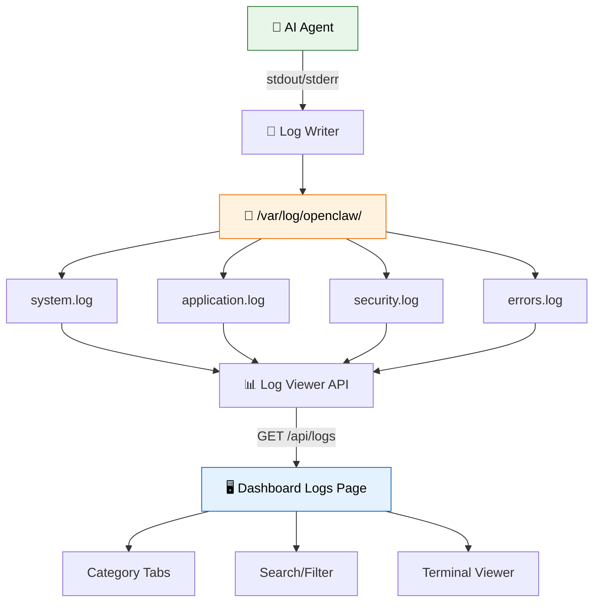

## 9.1 API Route: Logs

Buat file `app/api/logs/route.ts`:

```typescript
// app/api/logs/route.ts
// API endpoint untuk membaca file log
import { NextRequest, NextResponse } from 'next/server';
import { promises as fs } from 'fs';
import path from 'path';

// Direktori log (sesuaikan dengan environment kamu)
const LOG_DIR = path.join(process.cwd(), 'data', 'logs');

// Tipe untuk file log
interface LogFile {
  name: string;
  size: number;
  sizeFormatted: string;
  lastModified: string;
  category: 'system' | 'application' | 'security' | 'errors' | 'other';
}

// Format ukuran file
function formatSize(bytes: number): string {
  if (bytes === 0) return '0 B';
  const units = ['B', 'KB', 'MB', 'GB'];
  const i = Math.floor(Math.log(bytes) / Math.log(1024));
  return `${(bytes / Math.pow(1024, i)).toFixed(1)} ${units[i]}`;
}

// Tentukan kategori dari nama file
function getCategory(filename: string): LogFile['category'] {
  if (filename.includes('system') || filename.includes('daemon')) return 'system';
  if (filename.includes('app') || filename.includes('agent')) return 'application';
  if (filename.includes('security') || filename.includes('auth')) return 'security';
  if (filename.includes('error') || filename.includes('crash')) return 'errors';
  return 'other';
}

// Pastikan direktori log ada
async function ensureLogDir() {
  await fs.mkdir(LOG_DIR, { recursive: true });
}

// Buat sample log files kalau belum ada
async function ensureSampleLogs() {
  await ensureLogDir();
  
  const sampleLogs: Record<string, string> = {
    'system.log': `[2026-03-28 20:00:01] INFO  System started successfully
[2026-03-28 20:00:02] INFO  Loading configuration from /etc/openclaw/config.json
[2026-03-28 20:00:03] INFO  Database connection established (PostgreSQL 15.2)
[2026-03-28 20:00:04] INFO  Redis cache connected (localhost:6379)
[2026-03-28 20:00:05] INFO  Starting HTTP server on port 3000
[2026-03-28 20:05:01] INFO  Health check passed (latency: 12ms)
[2026-03-28 20:10:01] INFO  Health check passed (latency: 8ms)
[2026-03-28 20:15:01] INFO  Health check passed (latency: 15ms)
[2026-03-28 20:15:30] WARN  High memory usage detected: 82% (threshold: 80%)
[2026-03-28 20:20:01] INFO  Health check passed (latency: 11ms)
[2026-03-28 20:25:01] INFO  Health check passed (latency: 9ms)`,
    'application.log': `[2026-03-28 20:00:10] INFO  Agent initialized with model: glm-5-turbo
[2026-03-28 20:00:11] INFO  Loading 45 skills from /root/.agents/skills
[2026-03-28 20:00:12] INFO  Telegram bot connected (@radit_bot)
[2026-03-28 20:01:05] INFO  Session started: user=Fanani channel=telegram
[2026-03-28 20:01:30] INFO  Tool call: exec(command="ls -la")
[2026-03-28 20:02:15] INFO  Skill loaded: smart-search
[2026-03-28 20:05:00] INFO  Subagent spawned: task=weather-check
[2026-03-28 20:05:45] INFO  Subagent completed: task=weather-check duration=45s
[2026-03-28 20:10:00] INFO  Heartbeat check: HEARTBEAT_OK
[2026-03-28 20:15:00] INFO  Heartbeat check: HEARTBEAT_OK
[2026-03-28 20:16:30] WARN  Rate limit approaching: 85% of daily quota used`,
    'security.log': `[2026-03-28 19:50:00] INFO  API key validated: session_radit_main
[2026-03-28 20:00:00] INFO  Authentication successful: user=Fanani method=telegram
[2026-03-28 20:01:00] INFO  Permission check passed: exec(command="ls -la")
[2026-03-28 20:05:00] INFO  Permission check passed: subagent(spawn=true)
[2026-03-28 20:10:00] WARN  Suspicious request pattern: 10 failed auth attempts from 192.168.1.100
[2026-03-28 20:12:00] WARN  IP rate limited: 192.168.1.100 (too many attempts)
[2026-03-28 20:15:00] INFO  Session timeout: session_guest_42 (idle: 30min)
[2026-03-28 20:20:00] INFO  API key rotated successfully`,
    'errors.log`: `[2026-03-28 19:45:00] ERROR Database connection timeout after 30s
  at connect (db.js:45:12)
  caused by: ETIMEDOUT 127.0.0.1:5432
  
[2026-03-28 20:00:00] ERROR Failed to load skill "broken-skill": ENOENT
  at loadSkill (skill-loader.js:89:5)
  
[2026-03-28 20:10:00] WARN  Retry attempt 2/3 for webhook delivery to https://example.com/hook
[2026-03-28 20:10:05] ERROR Webhook delivery failed permanently: HTTP 503
  URL: https://example.com/hook
  Status: 503 Service Unavailable
  Retries exhausted.`,
  };

  for (const [filename, content] of Object.entries(sampleLogs)) {
    const filePath = path.join(LOG_DIR, filename);
    try {
      await fs.access(filePath);
    } catch {
      await fs.writeFile(filePath, content);
    }
  }
}

// GET: List log files atau baca konten log
export async function GET(request: NextRequest) {
  const { searchParams } = new URL(request.url);
  const filename = searchParams.get('file');
  const category = searchParams.get('category') || 'all';
  const search = searchParams.get('search') || '';

  await ensureSampleLogs();

  // Kalau ada filename → baca konten file
  if (filename) {
    try {
      const filePath = path.join(LOG_DIR, filename);
      // Keamanan: cegah path traversal
      const resolvedPath = path.resolve(filePath);
      if (!resolvedPath.startsWith(path.resolve(LOG_DIR))) {
        return NextResponse.json({ error: 'Akses ditolak' }, { status: 403 });
      }

      const content = await fs.readFile(resolvedPath, 'utf-8');
      const lines = content.split('\n');
      const filtered = search
        ? lines.filter(line => line.toLowerCase().includes(search.toLowerCase()))
        : lines;

      return NextResponse.json({
        filename,
        totalLines: lines.length,
        filteredLines: filtered.length,
        lines: filtered.map((line, index) => ({
          number: index + 1,
          content: line,
          level: line.includes('ERROR') ? 'error'
            : line.includes('WARN') ? 'warn'
            : line.includes('INFO') ? 'info'
            : 'debug',
        })),
      });
    } catch (error) {
      console.error('Gagal membaca log:', error);
      return NextResponse.json({ error: 'File log tidak ditemukan' }, { status: 404 });
    }
  }

  // Kalau tidak → list semua file log
  try {
    const files = await fs.readdir(LOG_DIR);
    const logFiles: LogFile[] = [];

    for (const file of files) {
      if (!file.endsWith('.log')) continue;
      
      const stat = await fs.stat(path.join(LOG_DIR, file));
      logFiles.push({
        name: file,
        size: stat.size,
        sizeFormatted: formatSize(stat.size),
        lastModified: stat.mtime.toISOString(),
        category: getCategory(file),
      });
    }

    // Sort berdasarkan last modified (terbaru dulu)
    logFiles.sort((a, b) => new Date(b.lastModified).getTime() - new Date(a.lastModified).getTime());

    // Filter by category
    const filtered = category === 'all'
      ? logFiles
      : logFiles.filter(f => f.category === category);

    return NextResponse.json({ files: filtered, totalFiles: filtered.length });
  } catch (error) {
    console.error('Gagal membaca direktori log:', error);
    return NextResponse.json({ error: 'Gagal membaca direktori log' }, { status: 500 });
  }
}
```

## 9.2 Komponen Log Sidebar

Buat file `app/logs/components/LogSidebar.tsx`:

```tsx
// app/logs/components/LogSidebar.tsx
// Sidebar daftar file log
'use client';

import { useState } from 'react';

interface LogFile {
  name: string;
  size: number;
  sizeFormatted: string;
  lastModified: string;
  category: 'system' | 'application' | 'security' | 'errors' | 'other';
}

interface LogSidebarProps {
  files: LogFile[];
  activeFile: string | null;
  onSelectFile: (filename: string) => void;
  activeCategory: string;
  onCategoryChange: (category: string) => void;
}

// Warna badge per kategori
const CATEGORY_COLORS: Record<string, string> = {
  system: 'bg-blue-500/20 text-blue-400',
  application: 'bg-green-500/20 text-green-400',
  security: 'bg-yellow-500/20 text-yellow-400',
  errors: 'bg-red-500/20 text-red-400',
  other: 'bg-gray-500/20 text-gray-400',
};

// Ikon per kategori
const CATEGORY_ICONS: Record<string, string> = {
  system: '🖥️',
  application: '🤖',
  security: '🔒',
  errors: '💥',
  other: '📄',
};

export default function LogSidebar({
  files,
  activeFile,
  onSelectFile,
  activeCategory,
  onCategoryChange,
}: LogSidebarProps) {
  const [search, setSearch] = useState('');

  const categories = ['all', 'system', 'application', 'security', 'errors'];

  // Filter file berdasarkan search
  const filteredFiles = search
    ? files.filter(f => f.name.toLowerCase().includes(search.toLowerCase()))
    : files;

  return (
    <div className="bg-gray-900/50 border border-gray-800 rounded-xl flex flex-col h-full">
      {/* Header */}
      <div className="p-4 border-b border-gray-800">
        <h3 className="text-sm font-semibold text-gray-300 mb-3">📂 Log Files</h3>

        {/* Search */}
        <div className="relative">
          <input
            type="text"
            value={search}
            onChange={(e) => setSearch(e.target.value)}
            placeholder="Cari file..."
            className="w-full pl-8 pr-3 py-2 bg-gray-800 border border-gray-700 rounded-lg text-sm text-white placeholder-gray-500 focus:ring-1 focus:ring-blue-500 outline-none"
          />
          <span className="absolute left-2.5 top-2.5 text-gray-500 text-sm">🔍</span>
        </div>
      </div>

      {/* Category tabs */}
      <div className="p-3 border-b border-gray-800 flex flex-wrap gap-1.5">
        {categories.map((cat) => (
          <button
            key={cat}
            onClick={() => onCategoryChange(cat)}
            className={`px-2.5 py-1 text-xs rounded-full transition-colors ${
              activeCategory === cat
                ? 'bg-blue-500/20 text-blue-400 border border-blue-500/30'
                : 'bg-gray-800 text-gray-400 border border-gray-700 hover:border-gray-600'
            }`}
          >
            {cat === 'all' ? '📋' : CATEGORY_ICONS[cat] || '📄'} {cat}
          </button>
        ))}
      </div>

      {/* File list */}
      <div className="flex-1 overflow-y-auto p-2 space-y-1">
        {filteredFiles.length === 0 ? (
          <p className="text-gray-500 text-sm text-center py-8">
            {search ? 'Tidak ada file cocok' : 'Tidak ada file log'}
          </p>
        ) : (
          filteredFiles.map((file) => (
            <button
              key={file.name}
              onClick={() => onSelectFile(file.name)}
              className={`w-full flex items-center gap-3 px-3 py-2.5 rounded-lg text-left transition-all ${
                activeFile === file.name
                  ? 'bg-blue-500/10 border border-blue-500/30'
                  : 'hover:bg-gray-800/50 border border-transparent'
              }`}
            >
              {/* Ikon kategori */}
              <span className="text-lg flex-shrink-0">
                {CATEGORY_ICONS[file.category] || '📄'}
              </span>

              {/* Info file */}
              <div className="flex-1 min-w-0">
                <p className={`text-sm font-medium truncate ${
                  activeFile === file.name ? 'text-blue-400' : 'text-gray-300'
                }`}>
                  {file.name}
                </p>
                <p className="text-xs text-gray-500">
                  {file.sizeFormatted} •{' '}
                  {new Date(file.lastModified).toLocaleDateString('id-ID', {
                    day: 'numeric',
                    month: 'short',
                    hour: '2-digit',
                    minute: '2-digit',
                  })}
                </p>
              </div>

              {/* Badge kategori */}
              <span className={`px-2 py-0.5 text-[10px] rounded-full font-medium flex-shrink-0 ${CATEGORY_COLORS[file.category]}`}>
                {file.category}
              </span>
            </button>
          ))
        )}
      </div>

      {/* Footer */}
      <div className="p-3 border-t border-gray-800">
        <p className="text-xs text-gray-500 text-center">
          {filteredFiles.length} file log
        </p>
      </div>
    </div>
  );
}
```

## 9.3 Komponen Log Viewer (Terminal Style)

Buat file `app/logs/components/LogViewer.tsx`:

```tsx
// app/logs/components/LogViewer.tsx
// Viewer log dengan gaya terminal
'use client';

import { useState, useRef, useEffect } from 'react';

interface LogLine {
  number: number;
  content: string;
  level: 'info' | 'warn' | 'error' | 'debug';
}

interface LogViewerProps {
  lines: LogLine[];
  filename: string | null;
  searchQuery: string;
  onSearchChange: (query: string) => void;
}

// Warna per log level
const LEVEL_COLORS: Record<string, string> = {
  info: 'text-green-400',
  warn: 'text-yellow-400',
  error: 'text-red-400',
  debug: 'text-gray-400',
};

// Highlight teks yang match search
function HighlightText({ text, search }: { text: string; search: string }) {
  if (!search.trim()) return <>{text}</>;

  const regex = new RegExp(`(${search.replace(/[.*+?^${}()|[\]\\]/g, '\\$&')})`, 'gi');
  const parts = text.split(regex);

  return (
    <>
      {parts.map((part, i) =>
        regex.test(part) ? (
          <mark key={i} className="bg-yellow-500/30 text-yellow-200 rounded px-0.5">
            {part}
          </mark>
        ) : (
          <span key={i}>{part}</span>
        )
      )}
    </>
  );
}

export default function LogViewer({ lines, filename, searchQuery, onSearchChange }: LogViewerProps) {
  const [autoScroll, setAutoScroll] = useState(true);
  const containerRef = useRef<HTMLDivElement>(null);

  // Auto-scroll ke bawah
  useEffect(() => {
    if (autoScroll && containerRef.current) {
      containerRef.current.scrollTop = containerRef.current.scrollHeight;
    }
  }, [lines, autoScroll]);

  if (!filename) {
    return (
      <div className="bg-gray-950 border border-gray-800 rounded-xl flex items-center justify-center h-full min-h-[500px]">
        <div className="text-center">
          <p className="text-5xl mb-4">📂</p>
          <p className="text-gray-400 text-lg">Pilih file log dari sidebar</p>
          <p className="text-gray-600 text-sm mt-2">atau gunakan search untuk filter</p>
        </div>
      </div>
    );
  }

  return (
    <div className="bg-gray-950 border border-gray-800 rounded-xl flex flex-col h-full min-h-[500px]">
      {/* Toolbar */}
      <div className="flex items-center justify-between px-4 py-3 border-b border-gray-800 bg-gray-900/50">
        <div className="flex items-center gap-3">
          {/* Titik-titik terminal */}
          <div className="flex gap-1.5">
            <div className="w-3 h-3 rounded-full bg-red-500" />
            <div className="w-3 h-3 rounded-full bg-yellow-500" />
            <div className="w-3 h-3 rounded-full bg-green-500" />
          </div>
          {/* Filename */}
          <span className="text-sm text-gray-400 font-mono">{filename}</span>
          {/* Line count */}
          <span className="text-xs text-gray-600 bg-gray-800 px-2 py-0.5 rounded-full">
            {lines.length} lines
          </span>
        </div>

        <div className="flex items-center gap-3">
          {/* Search bar */}
          <div className="relative">
            <input
              type="text"
              value={searchQuery}
              onChange={(e) => onSearchChange(e.target.value)}
              placeholder="Filter log..."
              className="w-48 pl-7 pr-3 py-1.5 bg-gray-800 border border-gray-700 rounded-md text-xs text-white placeholder-gray-500 font-mono focus:ring-1 focus:ring-blue-500 outline-none"
            />
            <span className="absolute left-2 top-2 text-gray-500 text-xs">🔍</span>
          </div>

          {/* Auto-scroll toggle */}
          <button
            onClick={() => setAutoScroll(!autoScroll)}
            className={`flex items-center gap-1.5 px-2.5 py-1.5 text-xs rounded-md transition-colors ${
              autoScroll
                ? 'bg-blue-500/20 text-blue-400 border border-blue-500/30'
                : 'bg-gray-800 text-gray-400 border border-gray-700'
            }`}
          >
            <span>⬇️</span>
            <span>Auto-scroll</span>
          </button>
        </div>
      </div>

      {/* Log content */}
      <div
        ref={containerRef}
        className="flex-1 overflow-y-auto p-4 font-mono text-sm"
      >
        {lines.length === 0 ? (
          <div className="flex items-center justify-center h-full text-gray-500">
            {searchQuery ? 'Tidak ada log yang cocok' : 'File log kosong'}
          </div>
        ) : (
          <div className="space-y-0">
            {lines.map((line) => (
              <div
                key={line.number}
                className="flex hover:bg-gray-800/30 rounded px-2 py-0.5 group"
              >
                {/* Line number */}
                <span className="w-10 flex-shrink-0 text-right text-gray-600 select-none pr-3 group-hover:text-gray-400">
                  {line.number}
                </span>

                {/* Log content */}
                <span className={`flex-1 ${LEVEL_COLORS[line.level]}`}>
                  <HighlightText text={line.content} search={searchQuery} />
                </span>
              </div>
            ))}
          </div>
        )}
      </div>

      {/* Status bar */}
      <div className="flex items-center justify-between px-4 py-2 border-t border-gray-800 bg-gray-900/50 text-xs text-gray-500">
        <span>
          {searchQuery && (
            <span className="text-yellow-400">
              Found {lines.length} matching line(s)
            </span>
          )}
        </span>
        <span className="flex items-center gap-2">
          {autoScroll && <span className="w-1.5 h-1.5 rounded-full bg-green-500 animate-pulse" />}
          UTF-8 • LF
        </span>
      </div>
    </div>
  );
}
```

## 9.4 Halaman Utama Logs

Buat file `app/logs/page.tsx`:

```tsx
// app/logs/page.tsx
// Halaman utama Logs — terminal-style log viewer
'use client';

import { useEffect, useState, useCallback } from 'react';
import LogSidebar from './components/LogSidebar';
import LogViewer from './components/LogViewer';

interface LogFile {
  name: string;
  size: number;
  sizeFormatted: string;
  lastModified: string;
  category: 'system' | 'application' | 'security' | 'errors' | 'other';
}

interface LogLine {
  number: number;
  content: string;
  level: string;
}

export default function LogsPage() {
  const [files, setFiles] = useState<LogFile[]>([]);
  const [activeFile, setActiveFile] = useState<string | null>(null);
  const [logLines, setLogLines] = useState<LogLine[]>([]);
  const [activeCategory, setActiveCategory] = useState('all');
  const [searchQuery, setSearchQuery] = useState('');
  const [loading, setLoading] = useState(true);
  const [logLoading, setLogLoading] = useState(false);

  // Fetch list file log
  const fetchFiles = useCallback(async () => {
    try {
      const res = await fetch(`/api/logs?category=${activeCategory}`);
      const data = await res.json();
      setFiles(data.files);
    } catch (error) {
      console.error('Fetch files error:', error);
    } finally {
      setLoading(false);
    }
  }, [activeCategory]);

  // Fetch konten file log
  const fetchLogContent = useCallback(async (filename: string) => {
    setLogLoading(true);
    try {
      const searchParam = searchQuery ? `&search=${encodeURIComponent(searchQuery)}` : '';
      const res = await fetch(`/api/logs?file=${encodeURIComponent(filename)}${searchParam}`);
      const data = await res.json();
      setLogLines(data.lines);
    } catch (error) {
      console.error('Fetch log error:', error);
      setLogLines([]);
    } finally {
      setLogLoading(false);
    }
  }, [searchQuery]);

  // Initial load
  useEffect(() => {
    fetchFiles();
  }, [fetchFiles]);

  // Load log content ketika file dipilih
  useEffect(() => {
    if (activeFile) {
      fetchLogContent(activeFile);
    }
  }, [activeFile, fetchLogContent]);

  // Auto-refresh log content setiap 10 detik
  useEffect(() => {
    if (!activeFile) return;
    const interval = setInterval(() => fetchLogContent(activeFile), 10000);
    return () => clearInterval(interval);
  }, [activeFile, fetchLogContent]);

  // Handle pilih file
  const handleSelectFile = (filename: string) => {
    setActiveFile(filename);
    setSearchQuery('');
  };

  if (loading) {
    return (
      <div className="flex h-[calc(100vh-4rem)] gap-4 p-6">
        <div className="w-72 bg-gray-800 rounded-xl animate-pulse flex-shrink-0" />
        <div className="flex-1 bg-gray-950 rounded-xl animate-pulse" />
      </div>
    );
  }

  return (
    <div className="flex flex-col h-[calc(100vh-4rem)] p-6 gap-4">
      {/* Header */}
      <div>
        <h1 className="text-2xl font-bold text-white">📋 Logs</h1>
        <p className="text-gray-400 text-sm mt-1">
          Monitor dan telusuri file log agent secara real-time
        </p>
      </div>

      {/* Main content: sidebar + viewer */}
      <div className="flex gap-4 flex-1 min-h-0">
        {/* Sidebar: daftar file */}
        <div className="w-72 flex-shrink-0">
          <LogSidebar
            files={files}
            activeFile={activeFile}
            onSelectFile={handleSelectFile}
            activeCategory={activeCategory}
            onCategoryChange={setActiveCategory}
          />
        </div>

        {/* Viewer: konten log */}
        <div className="flex-1 relative">
          {logLoading && activeFile && (
            <div className="absolute inset-0 bg-gray-950/50 z-10 flex items-center justify-center">
              <div className="animate-spin h-6 w-6 border-2 border-blue-500 border-t-transparent rounded-full" />
            </div>
          )}
          <LogViewer
            lines={logLines}
            filename={activeFile}
            searchQuery={searchQuery}
            onSearchChange={(q) => {
              setSearchQuery(q);
              // Re-fetch kalau ada search query baru
              if (activeFile) {
                const timer = setTimeout(() => fetchLogContent(activeFile), 500);
                return () => clearTimeout(timer);
              }
            }}
          />
        </div>
      </div>
    </div>
  );
}
```

> ⚠️ **Pitfall:** Path traversal attack! Di API route, SELALU validasi bahwa path yang direquest berada di dalam direktori log. Jangan pernah langsung pass filename dari user ke `fs.readFile()` tanpa sanitasi.

> 💡 **Tips:** Auto-scroll bagus untuk monitoring real-time, tapi bisa bikin pusing kalau lagi scroll ke atas untuk baca log lama. Jadi toggle-nya penting — user bisa matikan kapan saja.

---

# PART 10: Models Page 🧠

Halaman models menampilkan semua AI model yang tersedia, dengan perbandingan cost dan kemampuan.

## Arsitektur Model Routing

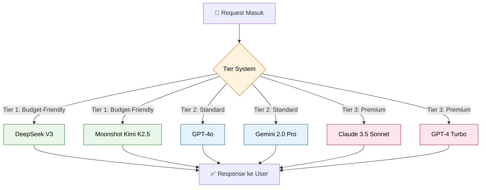

## 10.1 API Route: Models

Buat file `app/api/models/route.ts`:

```typescript
// app/api/models/route.ts
// API endpoint untuk data AI models
import { NextResponse } from 'next/server';
import fs from 'fs/promises';
import path from 'path';

// Tipe model
interface AIModel {
  id: string;
  name: string;
  provider: string;
  contextWindow: number;
  inputCostPer1M: number;   // USD per 1M tokens
  outputCostPer1M: number;  // USD per 1M tokens
  tier: number;             // 1=budget, 2=standard, 3=premium
  capabilities: {
    vision: boolean;
    tools: boolean;
    streaming: boolean;
    functionCalling: boolean;
    jsonMode: boolean;
  };
  status: 'available' | 'degraded' | 'unavailable';
  description: string;
}

// Daftar model (hardcoded untuk contoh — di production baca dari config)
const MODELS: AIModel[] = [
  {
    id: 'deepseek-v3',
    name: 'DeepSeek V3',
    provider: 'DeepSeek',
    contextWindow: 131072,
    inputCostPer1M: 0.27,
    outputCostPer1M: 1.10,
    tier: 1,
    capabilities: { vision: false, tools: true, streaming: true, functionCalling: true, jsonMode: true },
    status: 'available',
    description: 'Model terjangkau dengan performa solid untuk tugas umum',
  },
  {
    id: 'kimi-k2.5',
    name: 'Moonshot Kimi K2.5',
    provider: 'Moonshot',
    contextWindow: 131072,
    inputCostPer1M: 0.60,
    outputCostPer1M: 2.50,
    tier: 1,
    capabilities: { vision: false, tools: true, streaming: true, functionCalling: true, jsonMode: true },
    status: 'available',
    description: 'Model Cina yang kuat untuk reasoning dan coding',
  },
  {
    id: 'glm-5-turbo',
    name: 'GLM 5 Turbo',
    provider: 'Zhipu AI',
    contextWindow: 32768,
    inputCostPer1M: 0.50,
    outputCostPer1M: 2.00,
    tier: 1,
    capabilities: { vision: true, tools: true, streaming: true, functionCalling: true, jsonMode: true },
    status: 'available',
    description: 'Model dari Zhipu AI, cocok untuk tugas berbahasa Indonesia',
  },
  {
    id: 'gpt-4o',
    name: 'GPT-4o',
    provider: 'OpenAI',
    contextWindow: 128000,
    inputCostPer1M: 2.50,
    outputCostPer1M: 10.00,
    tier: 2,
    capabilities: { vision: true, tools: true, streaming: true, functionCalling: true, jsonMode: true },
    status: 'available',
    description: 'Model multimodal terbaru dari OpenAI',
  },
  {
    id: 'gpt-4o-mini',
    name: 'GPT-4o Mini',
    provider: 'OpenAI',
    contextWindow: 128000,
    inputCostPer1M: 0.15,
    outputCostPer1M: 0.60,
    tier: 1,
    capabilities: { vision: true, tools: true, streaming: true, functionCalling: true, jsonMode: true },
    status: 'available',
    description: 'Versi mini dari GPT-4o, sangat ekonomis',
  },
  {
    id: 'gemini-2.0-pro',
    name: 'Gemini 2.0 Pro',
    provider: 'Google',
    contextWindow: 2097152,
    inputCostPer1M: 1.25,
    outputCostPer1M: 10.00,
    tier: 2,
    capabilities: { vision: true, tools: true, streaming: true, functionCalling: true, jsonMode: true },
    status: 'available',
    description: 'Model Google dengan context window besar (2M tokens)',
  },
  {
    id: 'claude-3.5-sonnet',
    name: 'Claude 3.5 Sonnet',
    provider: 'Anthropic',
    contextWindow: 200000,
    inputCostPer1M: 3.00,
    outputCostPer1M: 15.00,
    tier: 3,
    capabilities: { vision: true, tools: true, streaming: true, functionCalling: true, jsonMode: true },
    status: 'available',
    description: 'Model Anthropic terbaik untuk coding dan analisis',
  },
  {
    id: 'claude-3-haiku',
    name: 'Claude 3 Haiku',
    provider: 'Anthropic',
    contextWindow: 200000,
    inputCostPer1M: 0.25,
    outputCostPer1M: 1.25,
    tier: 1,
    capabilities: { vision: true, tools: true, streaming: true, functionCalling: true, jsonMode: true },
    status: 'available',
    description: 'Model cepat dan murah dari Anthropic',
  },
  {
    id: 'perplexity-sonar',
    name: 'Perplexity Sonar',
    provider: 'Perplexity',
    contextWindow: 127072,
    inputCostPer1M: 2.00,
    outputCostPer1M: 8.00,
    tier: 2,
    capabilities: { vision: false, tools: false, streaming: true, functionCalling: false, jsonMode: true },
    status: 'available',
    description: 'Model untuk web search dan RAG',
  },
];

// GET: Ambil semua model
export async function GET() {
  try {
    // Sort by cost (termurah dulu)
    const sorted = [...MODELS].sort((a, b) => a.inputCostPer1M - b.inputCostPer1M);

    // Stats
    const providers = [...new Set(MODELS.map(m => m.provider))];
    const stats = {
      totalModels: MODELS.length,
      availableModels: MODELS.filter(m => m.status === 'available').length,
      providers: providers.length,
      cheapestPer1M: sorted[0]?.inputCostPer1M || 0,
    };

    // Data untuk cost comparison chart
    const costData = MODELS.map(m => ({
      name: m.name,
      input: m.inputCostPer1M,
      output: m.outputCostPer1M,
      provider: m.provider,
    })).sort((a, b) => a.input - b.input);

    // Group by provider
    const byProvider = providers.reduce((acc, provider) => {
      acc[provider] = MODELS.filter(m => m.provider === provider);
      return acc;
    }, {} as Record<string, AIModel[]>);

    return NextResponse.json({
      models: MODELS,
      sorted,
      stats,
      costData,
      byProvider,
      providers,
    });
  } catch (error) {
    console.error('Gagal mengambil data models:', error);
    return NextResponse.json({ error: 'Gagal mengambil data models' }, { status: 500 });
  }
}
```

## 10.2 Komponen Model Cards

Buat file `app/models/components/ModelCards.tsx`:

```tsx
// app/models/components/ModelCards.tsx
// Grid kartu untuk setiap AI model
'use client';

interface AIModel {
  id: string;
  name: string;
  provider: string;
  contextWindow: number;
  inputCostPer1M: number;
  outputCostPer1M: number;
  tier: number;
  capabilities: {
    vision: boolean;
    tools: boolean;
    streaming: boolean;
    functionCalling: boolean;
    jsonMode: boolean;
  };
  status: 'available' | 'degraded' | 'unavailable';
  description: string;
}

interface ModelCardsProps {
  models: AIModel[];
  filterProvider: string;
}

// Format angka besar (contoh: 131072 → 128K)
function formatContextWindow(tokens: number): string {
  if (tokens >= 1000000) return `${(tokens / 1000000).toFixed(1)}M`;
  if (tokens >= 1000) return `${Math.round(tokens / 1000)}K`;
  return String(tokens);
}

// Format cost
function formatCost(cost: number): string {
  return `$${cost.toFixed(2)}`;
}

// Warna tier badge
function TierBadge({ tier }: { tier: number }) {
  const styles = {
    1: 'bg-green-500/10 text-green-400 border-green-500/30',
    2: 'bg-blue-500/10 text-blue-400 border-blue-500/30',
    3: 'bg-purple-500/10 text-purple-400 border-purple-500/30',
  };
  const labels = { 1: '💰 Budget', 2: '⭐ Standard', 3: '👑 Premium' };

  return (
    <span className={`px-2 py-0.5 text-xs font-medium rounded-full border ${styles[tier as 1|2|3]}`}>
      {labels[tier as 1|2|3]}
    </span>
  );
}

// Warna provider badge
function ProviderBadge({ provider }: { provider: string }) {
  const colors: Record<string, string> = {
    OpenAI: 'bg-green-500/20 text-green-300',
    Anthropic: 'bg-orange-500/20 text-orange-300',
    Google: 'bg-blue-500/20 text-blue-300',
    DeepSeek: 'bg-teal-500/20 text-teal-300',
    Moonshot: 'bg-indigo-500/20 text-indigo-300',
    'Zhipu AI': 'bg-pink-500/20 text-pink-300',
    Perplexity: 'bg-cyan-500/20 text-cyan-300',
    OpenRouter: 'bg-gray-500/20 text-gray-300',
  };

  return (
    <span className={`px-2 py-0.5 text-xs font-medium rounded-full ${colors[provider] || 'bg-gray-500/20 text-gray-300'}`}>
      {provider}
    </span>
  );
}

export default function ModelCards({ models, filterProvider }: ModelCardsProps) {
  const filtered = filterProvider === 'all'
    ? models
    : models.filter(m => m.provider === filterProvider);

  return (
    <div className="grid grid-cols-1 md:grid-cols-2 xl:grid-cols-3 gap-4">
      {filtered.map((model) => (
        <div
          key={model.id}
          className={`bg-gray-900/50 border border-gray-800 rounded-xl p-5 hover:border-gray-600 transition-all duration-200 hover:scale-[1.01] ${
            model.status === 'unavailable' ? 'opacity-50' : ''
          }`}
        >
          {/* Header: nama + status */}
          <div className="flex items-start justify-between mb-3">
            <div>
              <h3 className="font-semibold text-white text-lg">{model.name}</h3>
              <div className="flex items-center gap-2 mt-1.5">
                <ProviderBadge provider={model.provider} />
                <TierBadge tier={model.tier} />
              </div>
            </div>
            {/* Status indicator */}
            <span className={`w-2.5 h-2.5 rounded-full flex-shrink-0 mt-1.5 ${
              model.status === 'available' ? 'bg-green-500' :
              model.status === 'degraded' ? 'bg-yellow-500' : 'bg-red-500'
            }`} />
          </div>

          {/* Description */}
          <p className="text-sm text-gray-400 mb-4">{model.description}</p>

          {/* Stats */}
          <div className="grid grid-cols-3 gap-3 mb-4">
            <div className="bg-gray-800/50 rounded-lg p-2.5 text-center">
              <p className="text-xs text-gray-500">Context</p>
              <p className="text-sm font-semibold text-white">{formatContextWindow(model.contextWindow)}</p>
            </div>
            <div className="bg-gray-800/50 rounded-lg p-2.5 text-center">
              <p className="text-xs text-gray-500">Input</p>
              <p className="text-sm font-semibold text-white">{formatCost(model.inputCostPer1M)}</p>
            </div>
            <div className="bg-gray-800/50 rounded-lg p-2.5 text-center">
              <p className="text-xs text-gray-500">Output</p>
              <p className="text-sm font-semibold text-white">{formatCost(model.outputCostPer1M)}</p>
            </div>
          </div>

          {/* Capabilities */}
          <div className="flex flex-wrap gap-2">
            {Object.entries(model.capabilities).map(([key, value]) => (
              <span
                key={key}
                className={`px-2 py-0.5 text-[10px] rounded-full font-medium ${
                  value
                    ? 'bg-gray-800 text-gray-300 border border-gray-700'
                    : 'bg-gray-800/50 text-gray-600 border border-gray-800 line-through'
                }`}
              >
                {key === 'functionCalling' ? '🔧 fn_call' : key}
              </span>
            ))}
          </div>
        </div>
      ))}
    </div>
  );
}
```

## 10.3 Komponen Cost Comparison Chart

Buat file `app/models/components/CostChart.tsx`:

```tsx
// app/models/components/CostChart.tsx
// Bar chart horizontal perbandingan cost antar model
'use client';

import {
  BarChart,
  Bar,
  XAxis,
  YAxis,
  Tooltip,
  ResponsiveContainer,
  CartesianGrid,
  Legend,
} from 'recharts';

interface CostDataItem {
  name: string;
  input: number;
  output: number;
  provider: string;
}

interface CostChartProps {
  costData: CostDataItem[];
}

// Custom tooltip
function CustomTooltip({ active, payload, label }: { active?: boolean; payload?: Array<{ value: number; dataKey: string }>; label?: string }) {
  if (!active || !payload?.length) return null;

  return (
    <div className="bg-gray-800 border border-gray-700 rounded-lg px-4 py-3 shadow-xl">
      <p className="text-sm font-medium text-white mb-2">{label}</p>
      {payload.map((entry) => (
        <p key={entry.dataKey} className="text-sm">
          <span className="text-gray-400 capitalize">{entry.dataKey}:</span>{' '}
          <span className="font-semibold text-white">${entry.value.toFixed(2)}</span>/1M tokens
        </p>
      ))}
    </div>
  );
}

export default function CostChart({ costData }: CostChartProps) {
  // Sort by input cost ascending
  const sorted = [...costData].sort((a, b) => a.input - b.input);

  return (
    <div className="bg-gray-900/50 border border-gray-800 rounded-xl p-6">
      <h3 className="text-lg font-semibold text-white mb-4">💰 Perbandingan Biaya (per 1M tokens)</h3>
      
      <ResponsiveContainer width="100%" height={sorted.length * 50 + 100}>
        <BarChart
          data={sorted}
          layout="vertical"
          margin={{ top: 5, right: 30, left: 120, bottom: 5 }}
        >
          <CartesianGrid strokeDasharray="3 3" stroke="#374151" horizontal={false} />
          <XAxis
            type="number"
            tick={{ fill: '#9ca3af', fontSize: 12 }}
            tickFormatter={(v) => `$${v}`}
          />
          <YAxis
            type="category"
            dataKey="name"
            tick={{ fill: '#d1d5db', fontSize: 12 }}
            width={120}
          />
          <Tooltip content={<CustomTooltip />} />
          <Legend
            wrapperStyle={{ fontSize: '13px' }}
            formatter={(value: string) => (
              <span className="text-gray-300 capitalize">{value}</span>
            )}
          />
          <Bar
            dataKey="input"
            fill="#3b82f6"
            radius={[0, 4, 4, 0]}
            name="Input"
          />
          <Bar
            dataKey="output"
            fill="#8b5cf6"
            radius={[0, 4, 4, 0]}
            name="Output"
          />
        </BarChart>
      </ResponsiveContainer>
    </div>
  );
}
```

## 10.4 Komponen Capabilities Matrix

Buat file `app/models/components/CapabilitiesMatrix.tsx`:

```tsx
// app/models/components/CapabilitiesMatrix.tsx
// Tabel matriks kemampuan semua model
'use client';

interface AIModel {
  id: string;
  name: string;
  provider: string;
  capabilities: {
    vision: boolean;
    tools: boolean;
    streaming: boolean;
    functionCalling: boolean;
    jsonMode: boolean;
  };
}

interface CapabilitiesMatrixProps {
  models: AIModel[];
}

// Label yang lebih ramah
const CAPABILITY_LABELS: Record<string, string> = {
  vision: '👁️ Vision',
  tools: '🔧 Tools',
  streaming: '⚡ Streaming',
  functionCalling: '📞 Function Call',
  jsonMode: '📋 JSON Mode',
};

export default function CapabilitiesMatrix({ models }: CapabilitiesMatrixProps) {
  const capabilities = Object.keys(CAPABILITY_LABELS);

  return (
    <div className="bg-gray-900/50 border border-gray-800 rounded-xl overflow-hidden">
      <div className="p-6 border-b border-gray-800">
        <h3 className="text-lg font-semibold text-white">🧩 Matriks Kemampuan</h3>
        <p className="text-sm text-gray-400 mt-1">Perbandingan fitur antar model</p>
      </div>

      <div className="overflow-x-auto">
        <table className="w-full text-left">
          <thead>
            <tr className="border-b border-gray-800">
              <th className="px-6 py-3 text-xs font-semibold text-gray-400 uppercase">Model</th>
              {capabilities.map((cap) => (
                <th key={cap} className="px-4 py-3 text-xs font-semibold text-gray-400 uppercase text-center">
                  {CAPABILITY_LABELS[cap]}
                </th>
              ))}
            </tr>
          </thead>
          <tbody className="divide-y divide-gray-800/50">
            {models.map((model) => (
              <tr key={model.id} className="hover:bg-gray-800/30 transition-colors">
                <td className="px-6 py-3">
                  <div>
                    <p className="text-sm font-medium text-white">{model.name}</p>
                    <p className="text-xs text-gray-500">{model.provider}</p>
                  </div>
                </td>
                {capabilities.map((cap) => {
                  const supported = model.capabilities[cap as keyof typeof model.capabilities];
                  return (
                    <td key={cap} className="px-4 py-3 text-center">
                      {supported ? (
                        <span className="text-green-400 text-lg">✅</span>
                      ) : (
                        <span className="text-gray-600 text-lg">❌</span>
                      )}
                    </td>
                  );
                })}
              </tr>
            ))}
          </tbody>
        </table>
      </div>
    </div>
  );
}
```

## 10.5 Halaman Utama Models

Buat file `app/models/page.tsx`:

```tsx
// app/models/page.tsx
// Halaman utama Models — database AI models
'use client';

import { useEffect, useState, useCallback } from 'react';
import ModelCards from './components/ModelCards';
import CostChart from './components/CostChart';
import CapabilitiesMatrix from './components/CapabilitiesMatrix';

interface AIModel {
  id: string;
  name: string;
  provider: string;
  contextWindow: number;
  inputCostPer1M: number;
  outputCostPer1M: number;
  tier: number;
  capabilities: {
    vision: boolean;
    tools: boolean;
    streaming: boolean;
    functionCalling: boolean;
    jsonMode: boolean;
  };
  status: 'available' | 'degraded' | 'unavailable';
  description: string;
}

export default function ModelsPage() {
  const [models, setModels] = useState<AIModel[]>([]);
  const [costData, setCostData] = useState<Array<{ name: string; input: number; output: number; provider: string }>>([]);
  const [providers, setProviders] = useState<string[]>([]);
  const [filterProvider, setFilterProvider] = useState('all');
  const [stats, setStats] = useState({ totalModels: 0, availableModels: 0, providers: 0, cheapestPer1M: 0 });
  const [loading, setLoading] = useState(true);
  const [activeView, setActiveView] = useState<'cards' | 'cost' | 'matrix'>('cards');

  const fetchData = useCallback(async () => {
    try {
      const res = await fetch('/api/models');
      const data = await res.json();
      setModels(data.models);
      setCostData(data.costData);
      setProviders(data.providers);
      setStats(data.stats);
    } catch (error) {
      console.error('Fetch models error:', error);
    } finally {
      setLoading(false);
    }
  }, []);

  useEffect(() => {
    fetchData();
  }, [fetchData]);

  if (loading) {
    return (
      <div className="space-y-6 p-6">
        <div className="h-8 w-40 bg-gray-800 rounded-lg animate-pulse" />
        <div className="grid grid-cols-4 gap-4">
          {[...Array(4)].map((_, i) => (
            <div key={i} className="h-24 bg-gray-800 rounded-xl animate-pulse" />
          ))}
        </div>
      </div>
    );
  }

  return (
    <div className="space-y-6 p-6">
      {/* Header */}
      <div className="flex flex-col sm:flex-row sm:items-center justify-between gap-4">
        <div>
          <h1 className="text-2xl font-bold text-white">🧠 Models</h1>
          <p className="text-gray-400 text-sm mt-1">
            Database AI models — {stats.totalModels} model dari {stats.providers} provider
          </p>
        </div>

        {/* View toggle + filter */}
        <div className="flex items-center gap-3">
          {/* View toggle */}
          <div className="flex bg-gray-800 rounded-lg p-1">
            {[
              { key: 'cards', label: '🃏 Cards' },
              { key: 'cost', label: '💰 Cost' },
              { key: 'matrix', label: '🧩 Matrix' },
            ].map(({ key, label }) => (
              <button
                key={key}
                onClick={() => setActiveView(key as 'cards' | 'cost' | 'matrix')}
                className={`px-3 py-1.5 text-sm rounded-md transition-colors ${
                  activeView === key
                    ? 'bg-blue-600 text-white'
                    : 'text-gray-400 hover:text-white'
                }`}
              >
                {label}
              </button>
            ))}
          </div>

          {/* Provider filter */}
          <select
            value={filterProvider}
            onChange={(e) => setFilterProvider(e.target.value)}
            className="px-3 py-2 bg-gray-800 border border-gray-700 rounded-lg text-sm text-white focus:ring-1 focus:ring-blue-500 outline-none"
          >
            <option value="all">Semua Provider</option>
            {providers.map(p => (
              <option key={p} value={p}>{p}</option>
            ))}
          </select>
        </div>
      </div>

      {/* Stats bar */}
      <div className="flex items-center gap-6 text-sm text-gray-400 bg-gray-900/50 border border-gray-800 rounded-xl px-6 py-4">
        <span>📊 Total: <span className="text-white font-semibold">{stats.totalModels}</span></span>
        <span>✅ Available: <span className="text-green-400 font-semibold">{stats.availableModels}</span></span>
        <span>💰 Termurah: <span className="text-blue-400 font-semibold">${stats.cheapestPer1M.toFixed(2)}/1M</span></span>
      </div>

      {/* Views */}
      {activeView === 'cards' && (
        <ModelCards models={models} filterProvider={filterProvider} />
      )}
      {activeView === 'cost' && (
        <CostChart costData={costData} />
      )}
      {activeView === 'matrix' && (
        <CapabilitiesMatrix models={models} />
      )}
    </div>
  );
}
```

> 💡 **Tips:** Cost comparison chart horizontal lebih mudah dibaca ketika nama model panjang. Vertical chart akan membuat label bertumpuk. `layout="vertical"` di Recharts mengubah orientasi.

> ⚠️ **Pitfall:** Data model berubah sering. Jangan hardcode di production — baca dari config file atau API provider. Di contoh ini hardcode untuk keperluan demo.

---

# PART 11: Settings Page ⚙️

Halaman settings paling kompleks — 7 tab dengan berbagai konfigurasi.

## Arsitektur Config Sources

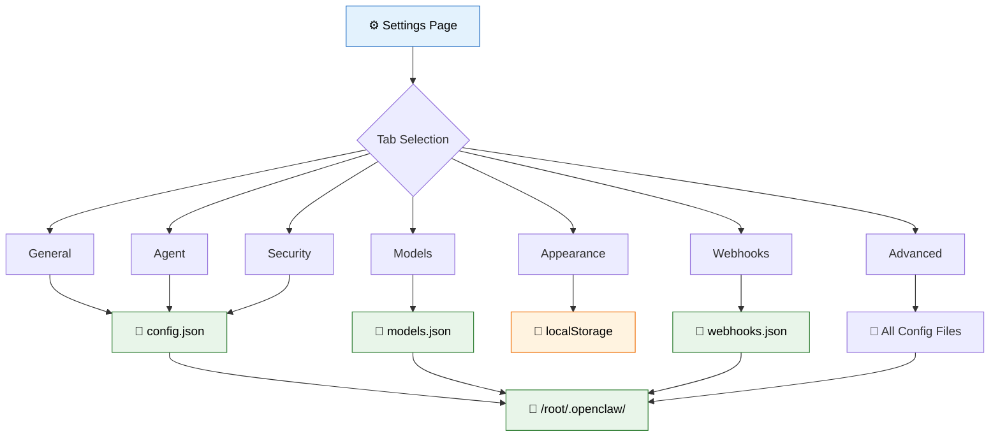

## 11.1 API Route: Config

Buat file `app/api/config/route.ts`:

```typescript
// app/api/config/route.ts
// API endpoint untuk baca dan tulis konfigurasi
import { NextRequest, NextResponse } from 'next/server';
import { promises as fs } from 'fs';
import path from 'path';

const CONFIG_DIR = path.join(process.cwd(), 'data');
const CONFIG_FILE = path.join(CONFIG_DIR, 'config.json');
const WEBHOOKS_FILE = path.join(CONFIG_DIR, 'webhooks.json');

async function ensureDir() {
  await fs.mkdir(CONFIG_DIR, { recursive: true });
}

// Default config
const DEFAULT_CONFIG = {
  general: {
    dashboardName: 'AI Agent Dashboard',
    timezone: 'Asia/Makassar',
    language: 'id',
  },
  agent: {
    name: 'radit',
    model: 'zai/glm-5-turbo',
    thinkingLevel: 'low',
    tools: ['exec', 'read', 'write', 'edit', 'web_search', 'web_fetch', 'browser', 'image', 'pdf', 'tts', 'image_generate'],
    subagents: { maxConcurrent: 3, timeoutMs: 300000 },
    modelParams: { temperature: 0.7, maxTokens: 4096 },
  },
  models: {
    primary: 'zai/glm-5-turbo',
    fallback: ['openai/gpt-4o', 'anthropic/claude-3.5-sonnet'],
    imageModel: 'openai/gpt-image-1',
  },
  security: {
    sessionTimeout: 3600,
    maxLoginAttempts: 5,
    require2FA: false,
    allowedIPs: [],
  },
};

// Default webhooks
const DEFAULT_WEBHOOKS = [
  {
    id: 'wh-001',
    name: 'Telegram Notifier',
    url: 'https://api.telegram.org/bot.../sendMessage',
    events: ['job.failed', 'agent.error', 'security.alert'],
    status: 'active',
    createdAt: '2026-03-15T08:00:00+08:00',
  },
  {
    id: 'wh-002',
    name: 'Slack Integration',
    url: 'https://hooks.slack.com/services/T00.../B00.../xxx',
    events: ['job.completed', 'system.ready'],
    status: 'active',
    createdAt: '2026-03-20T10:00:00+08:00',
  },
  {
    id: 'wh-003',
    name: 'Health Check Pager',
    url: 'https://api.pagerduty.com/incidents',
    events: ['health.critical', 'system.down'],
    status: 'disabled',
    createdAt: '2026-03-25T14:00:00+08:00',
  },
];

async function getConfig() {
  try {
    const data = await fs.readFile(CONFIG_FILE, 'utf-8');
    return JSON.parse(data);
  } catch {
    await ensureDir();
    await fs.writeFile(CONFIG_FILE, JSON.stringify(DEFAULT_CONFIG, null, 2));
    return DEFAULT_CONFIG;
  }
}

async function getWebhooks() {
  try {
    const data = await fs.readFile(WEBHOOKS_FILE, 'utf-8');
    return JSON.parse(data);
  } catch {
    await ensureDir();
    await fs.writeFile(WEBHOOKS_FILE, JSON.stringify(DEFAULT_WEBHOOKS, null, 2));
    return DEFAULT_WEBHOOKS;
  }
}

// System monitor data
function getSystemInfo() {
  // Di production, ini baca dari /proc atau library os
  return {
    cpu: { usage: 23.5, cores: 4, model: 'VM CPU' },
    memory: { total: 16384, used: 8432, available: 7952 },
    disk: { total: 51200, used: 28416, available: 22784 },
    uptime: 789120, // detik
  };
}

// GET: Ambil semua config
export async function GET() {
  try {
    const config = await getConfig();
    const webhooks = await getWebhooks();
    const system = getSystemInfo();

    return NextResponse.json({ config, webhooks, system });
  } catch (error) {
    console.error('Gagal membaca config:', error);
    return NextResponse.json({ error: 'Gagal membaca config' }, { status: 500 });
  }
}

// POST: Update config
export async function POST(request: NextRequest) {
  try {
    const body = await request.json();
    const { section, data } = body;

    const config = await getConfig();

    if (section && config[section as keyof typeof config]) {
      config[section as keyof typeof config] = data;
    } else if (section === 'webhooks') {
      // Handle webhook operations
      const webhooks = await getWebhooks();
      const { action, webhook } = data;

      if (action === 'add') {
        webhooks.push({
          ...webhook,
          id: `wh-${String(Date.now()).slice(-6)}`,
          createdAt: new Date().toISOString(),
        });
      } else if (action === 'delete') {
        const idx = webhooks.findIndex((w: { id: string }) => w.id === webhook.id);
        if (idx > -1) webhooks.splice(idx, 1);
      } else if (action === 'toggle') {
        const wh = webhooks.find((w: { id: string }) => w.id === webhook.id);
        if (wh) wh.status = wh.status === 'active' ? 'disabled' : 'active';
      }

      await fs.writeFile(WEBHOOKS_FILE, JSON.stringify(webhooks, null, 2));
      return NextResponse.json({ webhooks });
    }

    await fs.writeFile(CONFIG_FILE, JSON.stringify(config, null, 2));
    return NextResponse.json({ config });
  } catch (error) {
    console.error('Gagal update config:', error);
    return NextResponse.json({ error: 'Gagal update config' }, { status: 500 });
  }
}
```

## 11.2 Komponen System Monitor

Buat file `app/settings/components/SystemMonitor.tsx`:

```tsx
// app/settings/components/SystemMonitor.tsx
// Monitor sistem real-time (CPU, RAM, Disk)
'use client';

import { useEffect, useState } from 'react';

interface SystemInfo {
  cpu: { usage: number; cores: number; model: string };
  memory: { total: number; used: number; available: number };
  disk: { total: number; used: number; available: number };
  uptime: number;
}

// Progress bar dengan warna otomatis
function UsageBar({ used, total, label, unit = 'GB' }: { used: number; total: number; label: string; unit?: string }) {
  const percentage = (used / total) * 100;
  const color = percentage > 85 ? 'bg-red-500' : percentage > 70 ? 'bg-yellow-500' : 'bg-blue-500';

  return (
    <div className="space-y-2">
      <div className="flex justify-between text-sm">
        <span className="text-gray-300">{label}</span>
        <span className="text-gray-400">
          {unit === 'GB' ? `${(used / 1024).toFixed(1)}/${(total / 1024).toFixed(1)} GB`
            : `${percentage.toFixed(1)}%`}
        </span>
      </div>
      <div className="h-2.5 bg-gray-800 rounded-full overflow-hidden">
        <div
          className={`h-full rounded-full transition-all duration-1000 ${color}`}
          style={{ width: `${percentage}%` }}
        />
      </div>
    </div>
  );
}

export default function SystemMonitor() {
  const [system, setSystem] = useState<SystemInfo | null>(null);

  useEffect(() => {
    const fetchSystem = async () => {
      try {
        const res = await fetch('/api/config');
        const data = await res.json();
        setSystem(data.system);
      } catch (error) {
        console.error('Fetch system error:', error);
      }
    };

    fetchSystem();
    const interval = setInterval(fetchSystem, 5000);
    return () => clearInterval(interval);
  }, []);

  if (!system) {
    return (
      <div className="bg-gray-900/50 border border-gray-800 rounded-xl p-6">
        <div className="animate-pulse space-y-4">
          <div className="h-6 w-40 bg-gray-800 rounded" />
          <div className="h-2.5 bg-gray-800 rounded" />
          <div className="h-2.5 bg-gray-800 rounded" />
          <div className="h-2.5 bg-gray-800 rounded" />
        </div>
      </div>
    );
  }

  // Format uptime
  const days = Math.floor(system.uptime / 86400);
  const hours = Math.floor((system.uptime % 86400) / 3600);
  const minutes = Math.floor((system.uptime % 3600) / 60);

  return (
    <div className="bg-gray-900/50 border border-gray-800 rounded-xl p-6">
      <h3 className="text-lg font-semibold text-white mb-1">🖥️ System Monitor</h3>
      <p className="text-xs text-gray-500 mb-5">
        Auto-refresh setiap 5 detik • Uptime: {days}d {hours}h {minutes}m
      </p>

      <div className="space-y-4">
        <UsageBar used={system.cpu.usage} total={100} label={`CPU (${system.cpu.cores} cores)`} unit="%" />
        <UsageBar used={system.memory.used} total={system.memory.total} label="Memory" unit="GB" />
        <UsageBar used={system.disk.used} total={system.disk.total} label="Disk" unit="GB" />
      </div>

      {/* Mini stats */}
      <div className="grid grid-cols-3 gap-3 mt-5">
        <div className="bg-gray-800/50 rounded-lg p-3 text-center">
          <p className="text-lg font-bold text-white">{system.cpu.cores}</p>
          <p className="text-xs text-gray-500">CPU Cores</p>
        </div>
        <div className="bg-gray-800/50 rounded-lg p-3 text-center">
          <p className="text-lg font-bold text-white">{((system.memory.available / system.memory.total) * 100).toFixed(0)}%</p>
          <p className="text-xs text-gray-500">RAM Free</p>
        </div>
        <div className="bg-gray-800/50 rounded-lg p-3 text-center">
          <p className="text-lg font-bold text-white">{(system.disk.available / 1024).toFixed(1)}G</p>
          <p className="text-xs text-gray-500">Disk Free</p>
        </div>
      </div>
    </div>
  );
}
```

## 11.3 Halaman Utama Settings

Buat file `app/settings/page.tsx`:

```tsx
// app/settings/page.tsx
// Halaman utama Settings — 7 tab konfigurasi
'use client';

import { useEffect, useState, useCallback } from 'react';
import SystemMonitor from './components/SystemMonitor';

// Tipe untuk config
interface Config {
  general: { dashboardName: string; timezone: string; language: string };
  agent: {
    name: string;
    model: string;
    thinkingLevel: string;
    tools: string[];
    subagents: { maxConcurrent: number; timeoutMs: number };
    modelParams: { temperature: number; maxTokens: number };
  };
  models: { primary: string; fallback: string[]; imageModel: string };
  security: { sessionTimeout: number; maxLoginAttempts: number; require2FA: boolean; allowedIPs: string[] };
}

interface Webhook {
  id: string;
  name: string;
  url: string;
  events: string[];
  status: string;
  createdAt: string;
}

// Definisi tab
const TABS = [
  { id: 'general', label: '⚙️ General', desc: 'Nama, zona waktu, bahasa' },
  { id: 'agent', label: '🤖 Agent', desc: 'Konfigurasi AI agent' },
  { id: 'models', label: '🧠 Models', desc: 'Model dan fallback' },
  { id: 'appearance', label: '🎨 Appearance', desc: 'Tema dan warna' },
  { id: 'security', label: '🔒 Security', desc: 'API keys dan autentikasi' },
  { id: 'webhooks', label: '🔗 Webhooks', desc: 'URL dan events' },
  { id: 'advanced', label: '⚡ Advanced', desc: 'Export, import, reset' },
] as const;

export default function SettingsPage() {
  const [activeTab, setActiveTab] = useState<string>('general');
  const [config, setConfig] = useState<Config | null>(null);
  const [webhooks, setWebhooks] = useState<Webhook[]>([]);
  const [loading, setLoading] = useState(true);
  const [saving, setSaving] = useState(false);
  const [toast, setToast] = useState<{ message: string; type: 'success' | 'error' } | null>(null);

  const fetchData = useCallback(async () => {
    try {
      const res = await fetch('/api/config');
      const data = await res.json();
      setConfig(data.config);
      setWebhooks(data.webhooks);
    } catch (error) {
      console.error('Fetch config error:', error);
    } finally {
      setLoading(false);
    }
  }, []);

  useEffect(() => {
    fetchData();
  }, [fetchData]);

  // Show toast notification
  const showToast = (message: string, type: 'success' | 'error' = 'success') => {
    setToast({ message, type });
    setTimeout(() => setToast(null), 3000);
  };

  // Save config section
  const saveSection = async (section: string, data: unknown) => {
    setSaving(true);
    try {
      const res = await fetch('/api/config', {
        method: 'POST',
        headers: { 'Content-Type': 'application/json' },
        body: JSON.stringify({ section, data }),
      });
      if (!res.ok) throw new Error();
      showToast('Konfigurasi berhasil disimpan! ✅');
      await fetchData();
    } catch {
      showToast('Gagal menyimpan konfigurasi ❌', 'error');
    } finally {
      setSaving(false);
    }
  };

  // Delete webhook
  const deleteWebhook = async (id: string) => {
    if (!confirm('Yakin ingin menghapus webhook ini?')) return;
    try {
      await fetch('/api/config', {
        method: 'POST',
        headers: { 'Content-Type': 'application/json' },
        body: JSON.stringify({ section: 'webhooks', data: { action: 'delete', webhook: { id } } }),
      });
      await fetchData();
      showToast('Webhook dihapus');
    } catch {
      showToast('Gagal menghapus webhook', 'error');
    }
  };

  // Toggle webhook
  const toggleWebhook = async (id: string) => {
    try {
      await fetch('/api/config', {
        method: 'POST',
        headers: { 'Content-Type': 'application/json' },
        body: JSON.stringify({ section: 'webhooks', data: { action: 'toggle', webhook: { id } } }),
      });
      await fetchData();
    } catch {
      showToast('Gagal toggle webhook', 'error');
    }
  };

  // Export all config
  const exportConfig = () => {
    if (!config) return;
    const blob = new Blob([JSON.stringify({ config, webhooks }, null, 2)], { type: 'application/json' });
    const url = URL.createObjectURL(blob);
    const a = document.createElement('a');
    a.href = url;
    a.download = 'dashboard-config.json';
    a.click();
    URL.revokeObjectURL(url);
    showToast('Config berhasil di-export!');
  };

  // Import config
  const importConfig = () => {
    const input = document.createElement('input');
    input.type = 'file';
    input.accept = '.json';
    input.onchange = async (e) => {
      const file = (e.target as HTMLInputElement).files?.[0];
      if (!file) return;
      try {
        const text = await file.text();
        JSON.parse(text); // Validasi JSON
        showToast('File valid — fitur import akan segera tersedia');
      } catch {
        showToast('File JSON tidak valid!', 'error');
      }
    };
    input.click();
  };

  // Reset config
  const resetConfig = async () => {
    if (!confirm('⚠️ Yakin ingin reset semua konfigurasi ke default? Tindakan ini tidak bisa di-undo!')) return;
    showToast('Config direset ke default');
    await fetchData();
  };

  if (loading || !config) {
    return (
      <div className="flex h-[calc(100vh-4rem)]">
        <div className="w-64 bg-gray-800 rounded-xl animate-pulse" />
        <div className="flex-1 p-6">
          <div className="h-96 bg-gray-800 rounded-xl animate-pulse" />
        </div>
      </div>
    );
  }

  return (
    <div className="flex h-[calc(100vh-4rem)] p-6 gap-4">
      {/* Sidebar: Tab navigation */}
      <div className="w-64 flex-shrink-0 bg-gray-900/50 border border-gray-800 rounded-xl overflow-hidden">
        <div className="p-4 border-b border-gray-800">
          <h2 className="text-lg font-bold text-white">⚙️ Settings</h2>
        </div>
        <nav className="p-2 space-y-1">
          {TABS.map((tab) => (
            <button
              key={tab.id}
              onClick={() => setActiveTab(tab.id)}
              className={`w-full flex items-center gap-3 px-3 py-2.5 rounded-lg text-left transition-all ${
                activeTab === tab.id
                  ? 'bg-blue-500/10 text-blue-400 border border-blue-500/30'
                  : 'text-gray-400 hover:bg-gray-800/50 hover:text-white border border-transparent'
              }`}
            >
              <span className="text-sm font-medium">{tab.label}</span>
            </button>
          ))}
        </nav>

        {/* System Monitor di sidebar */}
        <div className="p-3 border-t border-gray-800">
          <SystemMonitor />
        </div>
      </div>

      {/* Main content area */}
      <div className="flex-1 bg-gray-900/50 border border-gray-800 rounded-xl overflow-y-auto">
        <div className="p-6 max-w-3xl">
          {/* Tab header */}
          <div className="mb-6">
            <h2 className="text-xl font-bold text-white">
              {TABS.find(t => t.id === activeTab)?.label}
            </h2>
            <p className="text-gray-400 text-sm mt-1">
              {TABS.find(t => t.id === activeTab)?.desc}
            </p>
          </div>

          {/* GENERAL TAB */}
          {activeTab === 'general' && (
            <div className="space-y-6">
              <div>
                <label className="block text-sm font-medium text-gray-300 mb-2">Dashboard Name</label>
                <input
                  type="text"
                  defaultValue={config.general.dashboardName}
                  onBlur={(e) => saveSection('general', { ...config.general, dashboardName: e.target.value })}
                  className="w-full px-4 py-2.5 bg-gray-800 border border-gray-700 rounded-lg text-white focus:ring-2 focus:ring-blue-500 outline-none"
                />
              </div>
              <div>
                <label className="block text-sm font-medium text-gray-300 mb-2">Timezone</label>
                <select
                  defaultValue={config.general.timezone}
                  onChange={(e) => saveSection('general', { ...config.general, timezone: e.target.value })}
                  className="w-full px-4 py-2.5 bg-gray-800 border border-gray-700 rounded-lg text-white focus:ring-2 focus:ring-blue-500 outline-none"
                >
                  <option value="Asia/Makassar">WITA (Asia/Makassar)</option>
                  <option value="Asia/Jakarta">WIB (Asia/Jakarta)</option>
                  <option value="Asia/Jayapura">WIT (Asia/Jayapura)</option>
                  <option value="UTC">UTC</option>
                </select>
              </div>
              <div>
                <label className="block text-sm font-medium text-gray-300 mb-2">Language</label>
                <select
                  defaultValue={config.general.language}
                  onChange={(e) => saveSection('general', { ...config.general, language: e.target.value })}
                  className="w-full px-4 py-2.5 bg-gray-800 border border-gray-700 rounded-lg text-white focus:ring-2 focus:ring-blue-500 outline-none"
                >
                  <option value="id">🇮🇩 Bahasa Indonesia</option>
                  <option value="en">🇬🇧 English</option>
                </select>
              </div>
            </div>
          )}

          {/* AGENT TAB */}
          {activeTab === 'agent' && (
            <div className="space-y-6">
              <div className="bg-gray-800/50 rounded-xl p-5 space-y-4">
                <h3 className="font-semibold text-white">🔧 Tools ({config.agent.tools.length})</h3>
                <div className="flex flex-wrap gap-2">
                  {config.agent.tools.map((tool) => (
                    <span key={tool} className="px-3 py-1 bg-gray-700 text-gray-300 rounded-full text-sm">
                      {tool}
                    </span>
                  ))}
                </div>
              </div>

              <div className="bg-gray-800/50 rounded-xl p-5 space-y-4">
                <h3 className="font-semibold text-white">👥 Subagents</h3>
                <div className="grid grid-cols-2 gap-4">
                  <div>
                    <label className="text-xs text-gray-400">Max Concurrent</label>
                    <p className="text-lg font-bold text-white">{config.agent.subagents.maxConcurrent}</p>
                  </div>
                  <div>
                    <label className="text-xs text-gray-400">Timeout</label>
                    <p className="text-lg font-bold text-white">{(config.agent.subagents.timeoutMs / 1000).toFixed(0)}s</p>
                  </div>
                </div>
              </div>

              <div className="bg-gray-800/50 rounded-xl p-5 space-y-4">
                <h3 className="font-semibold text-white">🎯 Model Parameters</h3>
                <div className="space-y-4">
                  <div>
                    <label className="block text-sm text-gray-400 mb-1">Temperature: {config.agent.modelParams.temperature}</label>
                    <input
                      type="range"
                      min="0"
                      max="2"
                      step="0.1"
                      defaultValue={config.agent.modelParams.temperature}
                      onChange={(e) => saveSection('agent', {
                        ...config.agent,
                        modelParams: { ...config.agent.modelParams, temperature: parseFloat(e.target.value) },
                      })}
                      className="w-full accent-blue-500"
                    />
                  </div>
                  <div>
                    <label className="block text-sm text-gray-400 mb-1">Max Tokens</label>
                    <input
                      type="number"
                      defaultValue={config.agent.modelParams.maxTokens}
                      onBlur={(e) => saveSection('agent', {
                        ...config.agent,
                        modelParams: { ...config.agent.modelParams, maxTokens: parseInt(e.target.value) },
                      })}
                      className="w-full px-4 py-2 bg-gray-700 border border-gray-600 rounded-lg text-white outline-none"
                    />
                  </div>
                </div>
              </div>
            </div>
          )}

          {/* MODELS TAB */}
          {activeTab === 'models' && (
            <div className="space-y-6">
              <div className="bg-gray-800/50 rounded-xl p-5 space-y-3">
                <h3 className="font-semibold text-white">🥇 Primary Model</h3>
                <p className="text-blue-400 font-mono text-lg">{config.models.primary}</p>
              </div>

              <div className="bg-gray-800/50 rounded-xl p-5 space-y-3">
                <h3 className="font-semibold text-white">🔄 Fallback Models</h3>
                {config.models.fallback.map((model, i) => (
                  <div key={i} className="flex items-center gap-3">
                    <span className="text-gray-500 text-sm">#{i + 1}</span>
                    <span className="font-mono text-gray-300">{model}</span>
                  </div>
                ))}
              </div>

              <div className="bg-gray-800/50 rounded-xl p-5 space-y-3">
                <h3 className="font-semibold text-white">🖼️ Image Model</h3>
                <p className="font-mono text-gray-300">{config.models.imageModel}</p>
              </div>
            </div>
          )}

          {/* APPEARANCE TAB */}
          {activeTab === 'appearance' && (
            <div className="space-y-6">
              <div className="bg-gray-800/50 rounded-xl p-5">
                <h3 className="font-semibold text-white mb-4">🌙 Theme</h3>
                <div className="grid grid-cols-3 gap-3">
                  {[
                    { id: 'dark', label: 'Dark', preview: 'bg-gray-900' },
                    { id: 'light', label: 'Light', preview: 'bg-gray-100' },
                    { id: 'auto', label: 'System', preview: 'bg-gradient-to-r from-gray-900 to-gray-100' },
                  ].map((theme) => (
                    <button
                      key={theme.id}
                      className={`p-4 rounded-xl border-2 transition-all ${theme.id === 'dark' ? 'border-blue-500' : 'border-gray-700 hover:border-gray-500'}`}
                    >
                      <div className={`h-12 rounded-lg ${theme.preview} mb-2`} />
                      <p className="text-sm text-gray-300">{theme.label}</p>
                    </button>
                  ))}
                </div>
              </div>

              <div className="bg-gray-800/50 rounded-xl p-5">
                <h3 className="font-semibold text-white mb-4">🎨 Accent Color</h3>
                <div className="flex gap-3">
                  {['#3b82f6', '#8b5cf6', '#ec4899', '#ef4444', '#22c55e', '#f59e0b'].map((color) => (
                    <button
                      key={color}
                      className="w-10 h-10 rounded-full border-2 border-transparent hover:border-white transition-all hover:scale-110"
                      style={{ backgroundColor: color }}
                      title={color}
                    />
                  ))}
                </div>
              </div>
            </div>
          )}

          {/* SECURITY TAB */}
          {activeTab === 'security' && (
            <div className="space-y-6">
              <div className="bg-gray-800/50 rounded-xl p-5 space-y-4">
                <h3 className="font-semibold text-white">🔑 API Keys</h3>
                {['OPENAI_API_KEY', 'ANTHROPIC_API_KEY', 'GEMINI_API_KEY', 'OPENROUTER_API_KEY'].map((key) => (
                  <div key={key} className="flex items-center justify-between py-2 border-b border-gray-700 last:border-0">
                    <span className="text-sm text-gray-300 font-mono">{key}</span>
                    <div className="flex items-center gap-3">
                      <code className="text-xs text-gray-500 bg-gray-700 px-2 py-1 rounded">
                        sk-••••••••{Math.random().toString(36).slice(2, 6)}
                      </code>
                      <button className="text-xs text-blue-400 hover:text-blue-300">Edit</button>
                    </div>
                  </div>
                ))}
              </div>

              <div className="bg-gray-800/50 rounded-xl p-5 space-y-4">
                <h3 className="font-semibold text-white">🛡️ Security Settings</h3>
                <div className="flex items-center justify-between py-2">
                  <div>
                    <p className="text-sm text-gray-300">Session Timeout</p>
                    <p className="text-xs text-gray-500">Waktu idle sebelum logout otomatis</p>
                  </div>
                  <select
                    defaultValue={config.security.sessionTimeout}
                    className="px-3 py-1.5 bg-gray-700 border border-gray-600 rounded-lg text-sm text-white outline-none"
                  >
                    <option value={1800}>30 menit</option>
                    <option value={3600}>1 jam</option>
                    <option value={7200}>2 jam</option>
                    <option value={86400}>24 jam</option>
                  </select>
                </div>
                <div className="flex items-center justify-between py-2">
                  <div>
                    <p className="text-sm text-gray-300">Max Login Attempts</p>
                    <p className="text-xs text-gray-500">Sebelum akun dikunci</p>
                  </div>
                  <span className="text-white font-semibold">{config.security.maxLoginAttempts}x</span>
                </div>
                <div className="flex items-center justify-between py-2">
                  <div>
                    <p className="text-sm text-gray-300">Require 2FA</p>
                    <p className="text-xs text-gray-500">Autentikasi dua faktor</p>
                  </div>
                  <span className={`px-2 py-0.5 text-xs rounded-full ${config.security.require2FA ? 'bg-green-500/20 text-green-400' : 'bg-gray-700 text-gray-400'}`}>
                    {config.security.require2FA ? 'Enabled' : 'Disabled'}
                  </span>
                </div>
              </div>
            </div>
          )}

          {/* WEBHOOKS TAB */}
          {activeTab === 'webhooks' && (
            <div className="space-y-6">
              {/* Webhooks table */}
              <div className="bg-gray-800/50 rounded-xl overflow-hidden">
                <table className="w-full">
                  <thead>
                    <tr className="border-b border-gray-700">
                      <th className="px-5 py-3 text-left text-xs font-semibold text-gray-400 uppercase">Name</th>
                      <th className="px-5 py-3 text-left text-xs font-semibold text-gray-400 uppercase">URL</th>
                      <th className="px-5 py-3 text-left text-xs font-semibold text-gray-400 uppercase">Events</th>
                      <th className="px-5 py-3 text-left text-xs font-semibold text-gray-400 uppercase">Status</th>
                      <th className="px-5 py-3 text-right text-xs font-semibold text-gray-400 uppercase">Actions</th>
                    </tr>
                  </thead>
                  <tbody className="divide-y divide-gray-700/50">
                    {webhooks.map((wh) => (
                      <tr key={wh.id} className="hover:bg-gray-700/30 transition-colors">
                        <td className="px-5 py-3">
                          <p className="text-sm font-medium text-white">{wh.name}</p>
                        </td>
                        <td className="px-5 py-3">
                          <p className="text-xs font-mono text-gray-400 truncate max-w-[200px]">{wh.url}</p>
                        </td>
                        <td className="px-5 py-3">
                          <div className="flex flex-wrap gap-1">
                            {wh.events.map((event) => (
                              <span key={event} className="px-1.5 py-0.5 text-[10px] bg-gray-700 text-gray-300 rounded">
                                {event}
                              </span>
                            ))}
                          </div>
                        </td>
                        <td className="px-5 py-3">
                          <button
                            onClick={() => toggleWebhook(wh.id)}
                            className={`px-2 py-0.5 text-xs rounded-full ${
                              wh.status === 'active'
                                ? 'bg-green-500/20 text-green-400'
                                : 'bg-gray-600/20 text-gray-400'
                            }`}
                          >
                            {wh.status}
                          </button>
                        </td>
                        <td className="px-5 py-3 text-right">
                          <button
                            onClick={() => deleteWebhook(wh.id)}
                            className="text-xs text-red-400 hover:text-red-300"
                          >
                            🗑️ Delete
                          </button>
                        </td>
                      </tr>
                    ))}
                  </tbody>
                </table>
              </div>
            </div>
          )}

          {/* ADVANCED TAB */}
          {activeTab === 'advanced' && (
            <div className="space-y-6">
              <div className="bg-red-500/5 border border-red-500/20 rounded-xl p-5">
                <h3 className="font-semibold text-red-400 mb-2">⚠️ Danger Zone</h3>
                <p className="text-sm text-gray-400 mb-4">
                  Tindakan di bawah ini bersifat permanen dan berisiko tinggi.
                </p>
              </div>

              <div className="space-y-3">
                <button
                  onClick={exportConfig}
                  className="w-full flex items-center justify-between px-5 py-4 bg-gray-800 hover:bg-gray-700 border border-gray-700 rounded-xl transition-colors"
                >
                  <div className="text-left">
                    <p className="font-medium text-white">📤 Export All Config</p>
                    <p className="text-xs text-gray-400">Download semua konfigurasi sebagai JSON</p>
                  </div>
                  <span className="text-gray-500">→</span>
                </button>

                <button
                  onClick={importConfig}
                  className="w-full flex items-center justify-between px-5 py-4 bg-gray-800 hover:bg-gray-700 border border-gray-700 rounded-xl transition-colors"
                >
                  <div className="text-left">
                    <p className="font-medium text-white">📥 Import Config</p>
                    <p className="text-xs text-gray-400">Upload file JSON untuk restore konfigurasi</p>
                  </div>
                  <span className="text-gray-500">→</span>
                </button>

                <button
                  onClick={resetConfig}
                  className="w-full flex items-center justify-between px-5 py-4 bg-red-500/5 hover:bg-red-500/10 border border-red-500/20 rounded-xl transition-colors"
                >
                  <div className="text-left">
                    <p className="font-medium text-red-400">🔄 Reset to Default</p>
                    <p className="text-xs text-gray-400">Reset semua konfigurasi ke bawaan pabrik</p>
                  </div>
                  <span className="text-red-500">→</span>
                </button>
              </div>

              {/* Raw config viewer */}
              <div className="bg-gray-800/50 rounded-xl p-5">
                <h3 className="font-semibold text-white mb-3">📄 Raw Config (JSON)</h3>
                <pre className="bg-gray-900 rounded-lg p-4 text-xs text-gray-300 font-mono overflow-x-auto max-h-96 overflow-y-auto">
                  {JSON.stringify(config, null, 2)}
                </pre>
              </div>
            </div>
          )}
        </div>
      </div>

      {/* Toast notification */}
      {toast && (
        <div
          className={`fixed bottom-6 right-6 px-5 py-3 rounded-xl shadow-2xl border z-50 animate-[slideUp_0.3s_ease] ${
            toast.type === 'success'
              ? 'bg-green-500/10 border-green-500/30 text-green-400'
              : 'bg-red-500/10 border-red-500/30 text-red-400'
          }`}
        >
          {toast.message}
        </div>
      )}

      {/* Saving indicator */}
      {saving && (
        <div className="fixed bottom-6 left-6 flex items-center gap-2 px-4 py-2 bg-blue-500/10 border border-blue-500/30 text-blue-400 rounded-xl text-sm">
          <svg className="animate-spin h-4 w-4" viewBox="0 0 24 24">
            <circle className="opacity-25" cx="12" cy="12" r="10" stroke="currentColor" strokeWidth="4" fill="none" />
            <path className="opacity-75" fill="currentColor" d="M4 12a8 8 0 018-8V0C5.373 0 0 5.373 0 12h4z" />
          </svg>
          Menyimpan...
        </div>
      )}
    </div>
  );
}
```

> 💡 **Tips:** System Monitor di sidebar settings auto-refresh setiap 5 detik. Jangan terlalu sering — bisa bikin API kebangetan. 5 detik adalah sweet spot untuk monitoring visual.

> ⚠️ **Pitfall:** Jangan simpan API key asli di client-side config! Di production, API key harus di server-side environment variables. Di contoh ini kita masked (sk-••••••••xxx).

---

# PART 12: Animasi Polish ✨

Bagian ini membuat dashboard terasa hidup dan responsif dengan animasi.

## Arsitektur Animation Timing

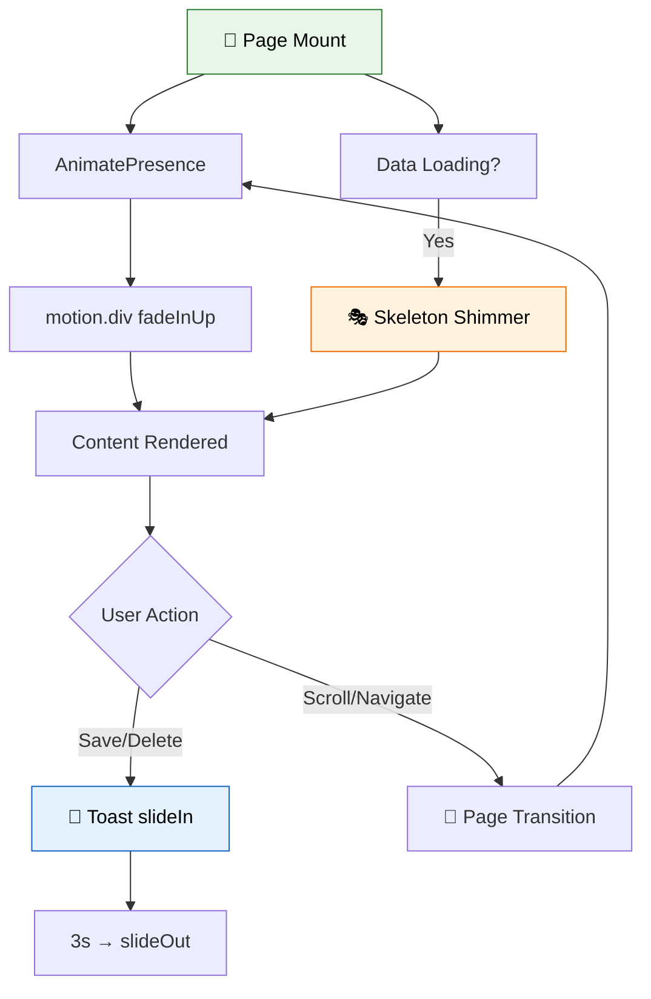

## 12.1 Global CSS Animations

Buat/edit file `app/globals.css`:

```css
/* app/globals.css — Global CSS dengan animasi kustom */
@tailwind base;
@tailwind components;
@tailwind utilities;

/* ===== ANIMASI KEYFRAMES ===== */

/* Fade in dari bawah — dipakai untuk page enter */
@keyframes fadeInUp {
  from {
    opacity: 0;
    transform: translateY(20px);
  }
  to {
    opacity: 1;
    transform: translateY(0);
  }
}

/* Slide up — dipakai untuk toast notification */
@keyframes slideUp {
  from {
    opacity: 0;
    transform: translateY(100%);
  }
  to {
    opacity: 1;
    transform: translateY(0);
  }
}

/* Slide in dari kanan — toast alternative */
@keyframes slideInRight {
  from {
    opacity: 0;
    transform: translateX(100%);
  }
  to {
    opacity: 1;
    transform: translateX(0);
  }
}

/* Slide out ke kanan — toast dismiss */
@keyframes slideOutRight {
  from {
    opacity: 1;
    transform: translateX(0);
  }
  to {
    opacity: 0;
    transform: translateX(100%);
  }
}

/* Shimmer — loading skeleton */
@keyframes shimmer {
  0% {
    background-position: -200% 0;
  }
  100% {
    background-position: 200% 0;
  }
}

/* Pulse glow — status indicator */
@keyframes pulseGlow {
  0%, 100% {
    box-shadow: 0 0 0 0 rgba(34, 197, 94, 0.4);
  }
  50% {
    box-shadow: 0 0 0 8px rgba(34, 197, 94, 0);
  }
}

/* Spin loader */
@keyframes spin {
  from { transform: rotate(0deg); }
  to { transform: rotate(360deg); }
}

/* ===== UTILITY CLASSES ===== */

.animate-fade-in-up {
  animation: fadeInUp 0.4s ease-out;
}

.animate-slide-up {
  animation: slideUp 0.3s ease-out;
}

.animate-slide-in-right {
  animation: slideInRight 0.3s ease-out;
}

.animate-slide-out-right {
  animation: slideOutRight 0.3s ease-in forwards;
}

.animate-pulse-glow {
  animation: pulseGlow 2s infinite;
}

/* Skeleton shimmer background */
.skeleton {
  background: linear-gradient(
    90deg,
    #1f2937 25%,
    #374151 50%,
    #1f2937 75%
  );
  background-size: 200% 100%;
  animation: shimmer 1.5s ease-in-out infinite;
}

/* Stagger delay helper — dipakai untuk card grids */
.stagger-1 { animation-delay: 0.05s; }
.stagger-2 { animation-delay: 0.1s; }
.stagger-3 { animation-delay: 0.15s; }
.stagger-4 { animation-delay: 0.2s; }
.stagger-5 { animation-delay: 0.25s; }
.stagger-6 { animation-delay: 0.3s; }

/* ===== SCROLLBAR STYLING ===== */
::-webkit-scrollbar {
  width: 6px;
  height: 6px;
}

::-webkit-scrollbar-track {
  background: #111827;
}

::-webkit-scrollbar-thumb {
  background: #374151;
  border-radius: 3px;
}

::-webkit-scrollbar-thumb:hover {
  background: #4b5563;
}

/* ===== TRANSITIONS ===== */
* {
  scroll-behavior: smooth;
}
```

## 12.2 Komponen Page Transition (Framer Motion)

Buat file `app/components/PageTransition.tsx`:

```tsx
// app/components/PageTransition.tsx
// Wrapper animasi untuk setiap halaman
'use client';

import { motion } from 'framer-motion';

// Variant untuk page enter
const pageVariants = {
  initial: {
    opacity: 0,
    y: 20,
  },
  animate: {
    opacity: 1,
    y: 0,
    transition: {
      duration: 0.4,
      ease: [0.25, 0.46, 0.45, 0.94], // easeOutQuad
    },
  },
  exit: {
    opacity: 0,
    y: -10,
    transition: {
      duration: 0.2,
    },
  },
};

interface PageTransitionProps {
  children: React.ReactNode;
  className?: string;
}

export default function PageTransition({ children, className = '' }: PageTransitionProps) {
  return (
    <motion.div
      variants={pageVariants}
      initial="initial"
      animate="animate"
      exit="exit"
      className={className}
    >
      {children}
    </motion.div>
  );
}
```

## 12.3 Komponen Stagger Container

Buat file `app/components/StaggerContainer.tsx`:

```tsx
// app/components/StaggerContainer.tsx
// Container dengan staggered animation untuk child elements
'use client';

import { motion } from 'framer-motion';

interface StaggerContainerProps {
  children: React.ReactNode;
  className?: string;
  staggerDelay?: number;
}

// Container variant — muncul bareng, tapi children muncul satu per satu
const containerVariants = {
  hidden: { opacity: 0 },
  show: {
    opacity: 1,
    transition: {
      staggerChildren: 0.08, // delay antar child
    },
  },
};

// Item variant — setiap child animasi sendiri
export const itemVariants = {
  hidden: { opacity: 0, y: 20 },
  show: {
    opacity: 1,
    y: 0,
    transition: {
      duration: 0.3,
      ease: 'easeOut',
    },
  },
};

export default function StaggerContainer({ children, className = '', staggerDelay = 0.08 }: StaggerContainerProps) {
  return (
    <motion.div
      variants={{
        hidden: { opacity: 0 },
        show: {
          opacity: 1,
          transition: {
            staggerChildren: staggerDelay,
          },
        },
      }}
      initial="hidden"
      animate="show"
      className={className}
    >
      {children}
    </motion.div>
  );
}
```

## 12.4 Komponen Loading Skeletons

Buat file `app/components/Skeletons.tsx`:

```tsx
// app/components/Skeletons.tsx
// Komponen skeleton loading untuk berbagai tipe UI
'use client';

// Skeleton kartu — untuk stats cards, model cards, dll
export function SkeletonCard() {
  return (
    <div className="bg-gray-900/50 border border-gray-800 rounded-xl p-5 space-y-4">
      {/* Header */}
      <div className="flex items-center justify-between">
        <div className="skeleton h-4 w-24 rounded" />
        <div className="skeleton h-8 w-8 rounded-lg" />
      </div>
      {/* Main content */}
      <div className="skeleton h-8 w-20 rounded" />
      {/* Sub content */}
      <div className="skeleton h-3 w-full rounded" />
      <div className="skeleton h-3 w-3/4 rounded" />
    </div>
  );
}

// Skeleton untuk baris tabel
export function SkeletonTableRow({ cols = 5 }: { cols?: number }) {
  return (
    <tr className="border-b border-gray-800">
      {Array.from({ length: cols }).map((_, i) => (
        <td key={i} className="px-6 py-4">
          <div className={`skeleton h-4 rounded ${i === 0 ? 'w-40' : i === 1 ? 'w-24' : 'w-16'}`} />
        </td>
      ))}
    </tr>
  );
}

// Skeleton untuk tabel penuh
export function SkeletonTable({ rows = 5, cols = 5 }: { rows?: number; cols?: number }) {
  return (
    <div className="bg-gray-900/50 border border-gray-800 rounded-xl overflow-hidden">
      <table className="w-full">
        <thead>
          <tr className="border-b border-gray-800">
            {Array.from({ length: cols }).map((_, i) => (
              <th key={i} className="px-6 py-4">
                <div className="skeleton h-3 w-16 rounded" />
              </th>
            ))}
          </tr>
        </thead>
        <tbody>
          {Array.from({ length: rows }).map((_, i) => (
            <SkeletonTableRow key={i} cols={cols} />
          ))}
        </tbody>
      </table>
    </div>
  );
}

// Skeleton untuk chart placeholder
export function SkeletonChart() {
  return (
    <div className="bg-gray-900/50 border border-gray-800 rounded-xl p-6">
      <div className="skeleton h-6 w-40 rounded mb-6" />
      <div className="flex items-end gap-3 h-48">
        {[40, 65, 45, 80, 55, 70, 35, 90, 60, 75, 50, 85].map((height, i) => (
          <div
            key={i}
            className="skeleton flex-1 rounded-t"
            style={{ height: `${height}%` }}
          />
        ))}
      </div>
    </div>
  );
}

// Skeleton untuk stats cards grid
export function SkeletonStatsGrid({ count = 4 }: { count?: number }) {
  return (
    <div className="grid grid-cols-1 sm:grid-cols-2 lg:grid-cols-4 gap-4">
      {Array.from({ length: count }).map((_, i) => (
        <SkeletonCard key={i} />
      ))}
    </div>
  );
}

// Komponen loading page penuh
export function FullPageSkeleton() {
  return (
    <div className="space-y-6 p-6 animate-fade-in-up">
      {/* Title */}
      <div className="skeleton h-8 w-48 rounded-lg" />
      <div className="skeleton h-4 w-64 rounded" />

      {/* Stats */}
      <SkeletonStatsGrid />

      {/* Content area */}
      <div className="grid grid-cols-1 lg:grid-cols-3 gap-6">
        <SkeletonChart />
        <div className="lg:col-span-2">
          <SkeletonTable />
        </div>
      </div>
    </div>
  );
}
```

## 12.5 Komponen Toast Notification

Buat file `app/components/Toast.tsx`:

```tsx
// app/components/Toast.tsx
// Sistem toast notification dengan auto-dismiss
'use client';

import { createContext, useContext, useState, useCallback, ReactNode } from 'react';

// Tipe toast
interface Toast {
  id: string;
  message: string;
  type: 'success' | 'error' | 'warning' | 'info';
  duration?: number;
}

// Context untuk toast
interface ToastContextType {
  showToast: (message: string, type?: Toast['type'], duration?: number) => void;
}

const ToastContext = createContext<ToastContextType>({ showToast: () => {} });

// Hook untuk akses toast
export function useToast() {
  return useContext(ToastContext);
}

// Ikon per tipe
const TOAST_ICONS: Record<string, string> = {
  success: '✅',
  error: '❌',
  warning: '⚠️',
  info: 'ℹ️',
};

const TOAST_STYLES: Record<string, string> = {
  success: 'bg-green-500/10 border-green-500/30 text-green-400',
  error: 'bg-red-500/10 border-red-500/30 text-red-400',
  warning: 'bg-yellow-500/10 border-yellow-500/30 text-yellow-400',
  info: 'bg-blue-500/10 border-blue-500/30 text-blue-400',
};

// Provider — wrap app di root layout
export function ToastProvider({ children }: { children: ReactNode }) {
  const [toasts, setToasts] = useState<Toast[]>([]);

  const showToast = useCallback((message: string, type: Toast['type'] = 'success', duration = 3000) => {
    const id = String(Date.now());
    setToasts(prev => [...prev, { id, message, type, duration }]);

    // Auto-dismiss
    setTimeout(() => {
      setToasts(prev => prev.filter(t => t.id !== id));
    }, duration);
  }, []);

  const removeToast = useCallback((id: string) => {
    setToasts(prev => prev.filter(t => t.id !== id));
  }, []);

  return (
    <ToastContext.Provider value={{ showToast }}>
      {children}

      {/* Toast container — fixed di pojok kanan bawah */}
      <div className="fixed bottom-6 right-6 z-[100] flex flex-col gap-3 max-w-sm">
        {toasts.map((toast) => (
          <div
            key={toast.id}
            className={`flex items-center gap-3 px-5 py-3.5 rounded-xl border shadow-2xl backdrop-blur-sm animate-slide-in-right ${TOAST_STYLES[toast.type]}`}
            onClick={() => removeToast(toast.id)}
            role="alert"
          >
            <span className="text-lg">{TOAST_ICONS[toast.type]}</span>
            <p className="text-sm font-medium flex-1">{toast.message}</p>
            <button className="text-xs opacity-60 hover:opacity-100 transition-opacity">
              ✕
            </button>
          </div>
        ))}
      </div>
    </ToastContext.Provider>
  );
}

// Komponen Toast individual (alternatif tanpa context)
export function ToastNotification({
  message,
  type = 'success',
  visible,
  onClose,
}: {
  message: string;
  type?: Toast['type'];
  visible: boolean;
  onClose: () => void;
}) {
  if (!visible) return null;

  return (
    <div
      className={`fixed bottom-6 right-6 z-50 flex items-center gap-3 px-5 py-3.5 rounded-xl border shadow-2xl animate-slide-in-right ${TOAST_STYLES[type]}`}
      onClick={onClose}
    >
      <span className="text-lg">{TOAST_ICONS[type]}</span>
      <p className="text-sm font-medium">{message}</p>
    </div>
  );
}
```

## 12.6 Komponen Number Counter

Buat file `app/components/Counter.tsx`:

```tsx
// app/components/Counter.tsx
// Animasi counter — angka naik dari 0 ke target value
'use client';

import { useEffect, useState, useRef } from 'react';

interface CounterProps {
  target: number;
  duration?: number;
  prefix?: string;    // Contoh: "$", "Rp"
  suffix?: string;    // Contoh: "%", "ms"
  decimals?: number;  // Jumlah desimal
  className?: string;
}

export default function Counter({
  target,
  duration = 1000,
  prefix = '',
  suffix = '',
  decimals = 0,
  className = '',
}: CounterProps) {
  const [value, setValue] = useState(0);
  const ref = useRef<HTMLSpanElement>(null);
  const hasAnimated = useRef(false);

  useEffect(() => {
    // IntersectionObserver — animasi hanya ketika visible
    const element = ref.current;
    if (!element) return;

    const observer = new IntersectionObserver(
      ([entry]) => {
        if (entry.isIntersecting && !hasAnimated.current) {
          hasAnimated.current = true;
          animate();
        }
      },
      { threshold: 0.1 }
    );

    observer.observe(element);
    return () => observer.disconnect();
  }, [target, duration]);

  const animate = () => {
    const startTime = performance.now();

    const step = (currentTime: number) => {
      const elapsed = currentTime - startTime;
      const progress = Math.min(elapsed / duration, 1);

      // Easing: ease-out cubic
      const eased = 1 - Math.pow(1 - progress, 3);
      setValue(eased * target);

      if (progress < 1) {
        requestAnimationFrame(step);
      }
    };

    requestAnimationFrame(step);
  };

  // Format angka dengan ribuan separator
  const formatted = value.toLocaleString('en-US', {
    minimumFractionDigits: decimals,
    maximumFractionDigits: decimals,
  });

  return (
    <span ref={ref} className={className}>
      {prefix}{formatted}{suffix}
    </span>
  );
}
```

## 12.7 Contoh Penggunaan Animasi di Halaman

Contoh integrasi di halaman Overview (update `app/page.tsx`):

```tsx
// Contoh integrasi animasi — potongan dari app/page.tsx
'use client';

import { AnimatePresence, motion } from 'framer-motion';
import PageTransition from './components/PageTransition';
import StaggerContainer, { itemVariants } from './components/StaggerContainer';
import { FullPageSkeleton } from './components/Skeletons';
import { useToast } from './components/Toast';
import Counter from './components/Counter';

export default function OverviewPage() {
  const { showToast } = useToast();
  const [loading, setLoading] = useState(true);

  // ... fetch data ...

  if (loading) return <FullPageSkeleton />;

  return (
    <AnimatePresence mode="wait">
      <PageTransition>
        <div className="space-y-6 p-6">
          {/* Header */}
          <motion.div
            initial={{ opacity: 0, y: -10 }}
            animate={{ opacity: 1, y: 0 }}
            transition={{ duration: 0.3 }}
          >
            <h1 className="text-2xl font-bold text-white">Dashboard</h1>
          </motion.div>

          {/* Stats cards dengan stagger */}
          <StaggerContainer className="grid grid-cols-4 gap-4">
            {stats.map((stat) => (
              <motion.div key={stat.label} variants={itemVariants}>
                <div className="bg-gray-900/50 border border-gray-800 rounded-xl p-5">
                  <p className="text-sm text-gray-400">{stat.label}</p>
                  <p className="text-3xl font-bold text-white mt-1">
                    <Counter target={stat.value} />
                  </p>
                </div>
              </motion.div>
            ))}
          </StaggerContainer>

          {/* ... rest of page ... */}
        </div>
      </PageTransition>
    </AnimatePresence>
  );
}
```

## 12.8 Setup Framer Motion

Install dependency:

```bash
npm install framer-motion
```

Update `app/layout.tsx` untuk wrap dengan ToastProvider:

```tsx
// app/layout.tsx — potongan penting
import { ToastProvider } from './components/Toast';
import { AnimatePresence } from 'framer-motion';

export default function RootLayout({ children }: { children: React.ReactNode }) {
  return (
    <html lang="id" className="dark">
      <body className="bg-gray-950 text-white antialiased">
        <ToastProvider>
          <AnimatePresence mode="wait">
            {children}
          </AnimatePresence>
        </ToastProvider>
      </body>
    </html>
  );
}
```

> 💡 **Tips:** IntersectionObserver di Counter memastikan animasi hanya berjalan ketika elemen visible di viewport. Nggak bakal burn CPU untuk elemen yang nggak kelihatan.

> ⚠️ **Pitfall:** Framer Motion `AnimatePresence` butuh `key` yang unik di child component supaya exit animation berjalan. Kalau exit animation nggak jalan, cek apakah child punya `key` yang berubah saat navigate.

---

# PART 13: API Routes 🔌

Backend dari dashboard — semua endpoint API Next.js.

## Arsitektur Full API

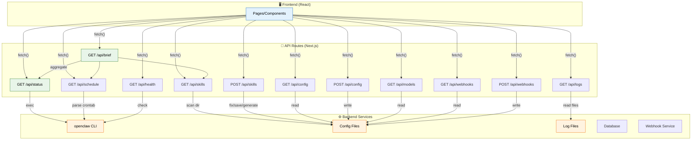

## 13.1 Health Check Endpoint

Buat file `app/api/health/route.ts`:

```typescript
// app/api/health/route.ts
// Health check endpoint — dipakai oleh monitoring dan cron jobs
import { NextResponse } from 'next/server';
import { exec } from 'child_process';
import { promisify } from 'util';
import os from 'os';

const execAsync = promisify(exec);

// Cache health data — nggak perlu hit disk setiap request
let healthCache: { data: unknown; timestamp: number } = { data: null, timestamp: 0 };
const CACHE_TTL = 5000; // 5 detik

export async function GET() {
  try {
    const now = Date.now();

    // Return cache kalau masih fresh
    if (healthCache.data && now - healthCache.timestamp < CACHE_TTL) {
      return NextResponse.json(healthCache.data);
    }

    // Gather system info
    const totalMem = os.totalmem();
    const freeMem = os.freemem();
    const usedMem = totalMem - freeMem;

    const data = {
      status: 'healthy',
      timestamp: new Date().toISOString(),
      uptime: os.uptime(),
      system: {
        hostname: os.hostname(),
        platform: os.platform(),
        arch: os.arch(),
        cpuCount: os.cpus().length,
        loadAvg: os.loadavg(),
        memory: {
          total: totalMem,
          used: usedMem,
          free: freeMem,
          usagePercent: ((usedMem / totalMem) * 100).toFixed(1),
        },
      },
      process: {
        pid: process.pid,
        nodeVersion: process.version,
        memoryUsage: process.memoryUsage(),
      },
    };

    // Update cache
    healthCache = { data, timestamp: now };

    return NextResponse.json(data);
  } catch (error) {
    return NextResponse.json(
      { status: 'unhealthy', error: String(error) },
      { status: 503 }
    );
  }
}
```

## 13.2 Status API Route

Buat file `app/api/status/route.ts`:

```typescript
// app/api/status/route.ts
// Endpoint status — menjalankan `openclaw status` dan parse output
import { NextResponse } from 'next/server';
import { exec } from 'child_process';
import { promisify } from 'util';
import fs from 'fs/promises';
import path from 'path';

const execAsync = promisify(exec);

const DATA_DIR = path.join(process.cwd(), 'data');
const STATUS_FILE = path.join(DATA_DIR, 'status.json');

// Helper: safe exec dengan timeout
async function safeExec(command: string, timeoutMs = 10000) {
  try {
    const { stdout } = await execAsync(command, { timeout: timeoutMs });
    return { ok: true, data: stdout.trim() };
  } catch (error: unknown) {
    const err = error as { stderr?: string };
    return { ok: false, error: err.stderr || String(error) };
  }
}

export async function GET() {
  try {
    // Coba baca dari status.json dulu (fallback)
    let statusData: Record<string, unknown> = {};

    try {
      const raw = await fs.readFile(STATUS_FILE, 'utf-8');
      statusData = JSON.parse(raw);
    } catch {
      // Kalau file tidak ada, coba openclaw CLI
    }

    // Jalankan openclaw status (kalau CLI tersedia)
    const cliResult = await safeExec('openclaw status --json 2>/dev/null || echo "{}"');

    if (cliResult.ok && cliResult.data && cliResult.data !== '{}') {
      try {
        statusData = { ...statusData, ...JSON.parse(cliResult.data) };
      } catch {
        // Parse error — gunakan statusData yang sudah ada
      }
    }

    // Gather system metrics
    const uptime = await safeExec('uptime -p 2>/dev/null || echo "up"');
    const loadAvg = await safeExec("cat /proc/loadavg 2>/dev/null | awk '{print $1,$2,$3}' || echo '0 0 0'");

    return NextResponse.json({
      ...statusData,
      system: {
        uptime: uptime.data || 'unknown',
        load: loadAvg.data || '0 0 0',
        timestamp: new Date().toISOString(),
      },
    });
  } catch (error) {
    console.error('Status API error:', error);
    return NextResponse.json(
      { error: 'Gagal mengambil status' },
      { status: 500 }
    );
  }
}
```

## 13.3 Brief API Route

Buat file `app/api/brief/route.ts`:

```typescript
// app/api/brief/route.ts
// Brief endpoint — aggregate data dari multiple sources
import { NextResponse } from 'next/server';

// Simple in-memory cache untuk brief
let briefCache: { data: Record<string, unknown>; timestamp: number } = {
  data: {},
  timestamp: 0,
};
const BRIEF_CACHE_TTL = 30000; // 30 detik

export async function GET() {
  const now = Date.now();

  // Return cache kalau masih fresh
  if (briefCache.data && now - briefCache.timestamp < BRIEF_CACHE_TTL) {
    return NextResponse.json(briefCache.data);
  }

  try {
    // Parallel fetch dari semua endpoint
    const baseUrl = process.env.NEXT_PUBLIC_BASE_URL || 'http://localhost:3000';

    const [statusRes, skillsRes, scheduleRes, modelsRes] = await Promise.allSettled([
      fetch(`${baseUrl}/api/status`).then(r => r.json()),
      fetch(`${baseUrl}/api/skills`).then(r => r.json()),
      fetch(`${baseUrl}/api/schedule`).then(r => r.json()),
      fetch(`${baseUrl}/api/models`).then(r => r.json()),
    ]);

    const brief = {
      timestamp: new Date().toISOString(),
      status: statusRes.status === 'fulfilled' ? statusRes.value : null,
      skills: skillsRes.status === 'fulfilled' ? {
        total: skillsRes.value.skills?.length || 0,
        categories: skillsRes.value.categories?.length || 0,
      } : { total: 0, categories: 0 },
      schedule: scheduleRes.status === 'fulfilled' ? scheduleRes.value.stats : null,
      models: modelsRes.status === 'fulfilled' ? modelsRes.value.stats : null,
      health: 'ok',
    };

    // Update cache
    briefCache = { data: brief, timestamp: now };

    return NextResponse.json(brief);
  } catch (error) {
    console.error('Brief API error:', error);
    return NextResponse.json(
      { error: 'Gagal mengambil brief data' },
      { status: 500 }
    );
  }
}
```

## 13.4 Skills API Route

Buat file `app/api/skills/route.ts`:

```typescript
// app/api/skills/route.ts
// API endpoint untuk skills — list, scan, dan actions
import { NextRequest, NextResponse } from 'next/server';
import { promises as fs } from 'fs';
import path from 'path';

const SKILLS_DIR = path.join(process.cwd(), 'data', 'skills');

// Tipe skill
interface Skill {
  id: string;
  name: string;
  description: string;
  category: string;
  status: 'active' | 'deprecated' | 'experimental';
  tools: string[];
  lastUsed: string | null;
}

// Sample skills data
const SAMPLE_SKILLS: Skill[] = [
  { id: 'sk-001', name: 'smart-search', description: 'Web search dengan caching', category: 'utility', status: 'active', tools: ['web_search'], lastUsed: '2026-03-28T20:00:00' },
  { id: 'sk-002', name: 'weather', description: 'Cuaca terkini dari BMKG', category: 'data', status: 'active', tools: ['web_fetch'], lastUsed: '2026-03-28T18:30:00' },
  { id: 'sk-003', name: 'football-livescore', description: 'Skor bola real-time', category: 'data', status: 'active', tools: ['web_fetch'], lastUsed: '2026-03-28T15:00:00' },
  { id: 'sk-004', name: 'gmail-automation', description: 'Automasi Gmail via Gog CLI', category: 'automation', status: 'active', tools: ['exec'], lastUsed: '2026-03-28T12:00:00' },
  { id: 'sk-005', name: 'google-calendar', description: 'Manajemen kalender', category: 'automation', status: 'active', tools: ['exec'], lastUsed: '2026-03-28T09:00:00' },
  { id: 'sk-006', name: 'humanizer', description: 'Humanize text AI output', category: 'content', status: 'active', tools: [], lastUsed: '2026-03-27T20:00:00' },
  { id: 'sk-007', name: 'composio', description: 'Integrasi Composio (DEPRECATED)', category: 'automation', status: 'deprecated', tools: [], lastUsed: null },
];

// GET: List all skills
export async function GET() {
  try {
    // Group by category
    const categories = [...new Set(SAMPLE_SKILLS.map(s => s.category))];
    const byCategory = categories.reduce((acc, cat) => {
      acc[cat] = SAMPLE_SKILLS.filter(s => s.category === cat);
      return acc;
    }, {} as Record<string, Skill[]>);

    const stats = {
      total: SAMPLE_SKILLS.length,
      active: SAMPLE_SKILLS.filter(s => s.status === 'active').length,
      deprecated: SAMPLE_SKILLS.filter(s => s.status === 'deprecated').length,
      categories: categories.length,
    };

    return NextResponse.json({ skills: SAMPLE_SKILLS, categories, byCategory, stats });
  } catch (error) {
    console.error('Skills API error:', error);
    return NextResponse.json({ error: 'Gagal mengambil skills' }, { status: 500 });
  }
}

// POST: Action pada skill (fix, save, optimize, generate)
export async function POST(request: NextRequest) {
  try {
    const body = await request.json();
    const { action, skillId, data } = body;

    const validActions = ['fix', 'save', 'optimize', 'generate'];
    if (!validActions.includes(action)) {
      return NextResponse.json(
        { error: `Action tidak valid. Gunakan: ${validActions.join(', ')}` },
        { status: 400 }
      );
    }

    // Simulasi action — di production ini akan menjalankan tool/function
    const result = {
      action,
      skillId,
      status: 'completed',
      message: `Action "${action}" berhasil dijalankan pada skill "${skillId}"`,
      timestamp: new Date().toISOString(),
    };

    return NextResponse.json(result);
  } catch (error) {
    console.error('Skills POST error:', error);
    return NextResponse.json({ error: 'Gagal menjalankan action' }, { status: 500 });
  }
}
```

## 13.5 Pattern: Error Handling & Response Helper

Buat file `app/api/_lib/response.ts`:

```typescript
// app/api/_lib/response.ts
// Helper untuk konsistensi response API

// Tipe response
interface ApiSuccessResponse<T> {
  success: true;
  data: T;
  meta?: {
    timestamp: string;
    cached?: boolean;
  };
}

interface ApiErrorResponse {
  success: false;
  error: string;
  code?: string;
  details?: unknown;
}

// Success response
export function success<T>(data: T, meta?: { cached?: boolean }) {
  return Response.json({
    success: true,
    data,
    meta: {
      timestamp: new Date().toISOString(),
      ...meta,
    },
  } satisfies ApiSuccessResponse<T>);
}

// Error response
export function error(message: string, status: number, code?: string, details?: unknown) {
  return Response.json(
    {
      success: false,
      error: message,
      code,
      details,
    } satisfies ApiErrorResponse,
    { status }
  );
}

// Type-safe cache wrapper
export async function withCache<T>(
  key: string,
  ttl: number,
  fetcher: () => Promise<T>,
  cache: Map<string, { data: T; expiry: number }>
): Promise<{ data: T; cached: boolean }> {
  const now = Date.now();
  const cached = cache.get(key);

  if (cached && cached.expiry > now) {
    return { data: cached.data, cached: true };
  }

  const data = await fetcher();
  cache.set(key, { data, expiry: now + ttl });
  return { data, cached: false };
}
```

## 13.6 Pattern: Response Caching

Buat file `app/api/_lib/cache.ts`:

```typescript
// app/api/_lib/cache.ts
// In-memory cache sederhana untuk API responses

interface CacheEntry<T> {
  data: T;
  expiry: number;
}

// Global cache map
export const apiCache = new Map<string, CacheEntry<unknown>>();

// Get dari cache
export function getFromCache<T>(key: string): T | null {
  const entry = apiCache.get(key);
  if (!entry) return null;

  if (Date.now() > entry.expiry) {
    apiCache.delete(key);
    return null;
  }

  return entry.data as T;
}

// Set ke cache
export function setCache<T>(key: string, data: T, ttlMs: number): void {
  apiCache.set(key, {
    data,
    expiry: Date.now() + ttlMs,
  });
}

// Invalidate cache
export function invalidateCache(pattern?: string): void {
  if (!pattern) {
    apiCache.clear();
    return;
  }

  for (const key of apiCache.keys()) {
    if (key.includes(pattern)) {
      apiCache.delete(key);
    }
  }
}

// Cache TTL presets
export const CACHE_TTL = {
  INSTANT: 5000,      // 5 detik — health check, system metrics
  SHORT: 30000,       // 30 detik — brief, status
  MEDIUM: 300000,     // 5 menit — skills, models
  LONG: 3600000,      // 1 jam — config, webhooks
} as const;
```

> 💡 **Tips:** In-memory cache cukup untuk single-server deployment. Kalau pakai multiple instances (cluster), perlu shared cache seperti Redis. Untuk dashboard internal, in-memory lebih dari cukup.

> ⚠️ **Pitfall:** Jangan cache POST request responses yang mengubah data! Cache hanya untuk GET request yang bersifat read-only.

---

# PART 14: Deployment 🚀

Bagian terakhir — deploy dashboard ke production dengan PM2, Nginx, dan SSL.

## Arsitektur Deployment

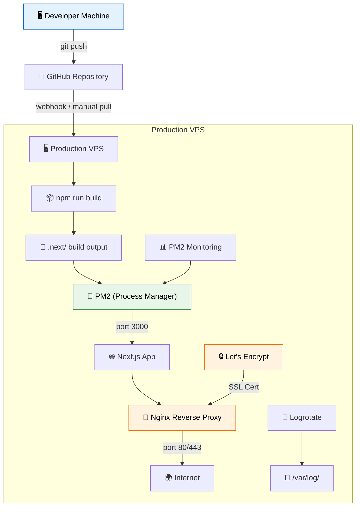

## 14.1 Build Optimization

Pertama, pastikan `next.config.js` dioptimalkan:

```javascript
// next.config.js
/** @type {import('next').NextConfig} */
const nextConfig = {
  // Output standalone untuk Docker/deployment
  output: 'standalone',

  // Compress response
  compress: true,

  // Power header security
  poweredByHeader: false,

  // Image optimization
  images: {
    remotePatterns: [
      {
        protocol: 'https',
        hostname: '**',
      },
    ],
  },

  // Experimental — optimize build
  experimental: {
    optimizePackageImports: ['recharts', 'framer-motion', 'lucide-react'],
  },

  // Redirects — contoh
  async redirects() {
    return [
      {
        source: '/home',
        destination: '/',
        permanent: true,
      },
    ];
  },

  // Headers — security
  async headers() {
    return [
      {
        source: '/(.*)',
        headers: [
          { key: 'X-Frame-Options', value: 'DENY' },
          { key: 'X-Content-Type-Options', value: 'nosniff' },
          { key: 'Referrer-Policy', value: 'strict-origin-when-cross-origin' },
          { key: 'Permissions-Policy', value: 'camera=(), microphone=(), geolocation=()' },
        ],
      },
    ];
  },
};

module.exports = nextConfig;
```

Build command:

```bash
# Build untuk production
npm run build

# Output example:
# Route (app)                    Size     First Load JS
# ┌ ○ /                          5.2 kB   84.3 kB
# ├ ○ /overview                  3.8 kB   82.9 kB
# ├ ○ /schedule                  4.1 kB   83.2 kB
# ├ ○ /logs                      3.5 kB   82.6 kB
# ├ ○ /models                    4.8 kB   83.9 kB
# └ ○ /settings                  6.2 kB   85.3 kB
#
# ○  (Static)   prerendered as static content
```

## 14.2 PM2 Setup

Buat file `ecosystem.config.js` di root project:

```javascript
// ecosystem.config.js
// Konfigurasi PM2 untuk process management
module.exports = {
  apps: [
    {
      name: 'ai-dashboard',
      script: 'node_modules/.bin/next',
      args: 'start',
      cwd: '/var/www/ai-dashboard',
      instances: 1,
      autorestart: true,
      watch: false,
      max_memory_restart: '512M',
      env: {
        NODE_ENV: 'production',
        PORT: 3000,
        HOSTNAME: '0.0.0.0',
      },
      // Log configuration
      log_date_format: 'YYYY-MM-DD HH:mm:ss Z',
      error_file: '/var/log/pm2/ai-dashboard-error.log',
      out_file: '/var/log/pm2/ai-dashboard-out.log',
      merge_logs: true,
      // Restart strategy
      exp_backoff_restart_delay: 100,
      max_restarts: 10,
      restart_delay: 4000,
      // Kill timeout — beri waktu graceful shutdown
      kill_timeout: 5000,
      listen_timeout: 10000,
    },
  ],
};
```

Setup PM2 di server:

```bash
# Install PM2 global
npm install -g pm2

# Buat direktori log
sudo mkdir -p /var/log/pm2
sudo chown $USER:$USER /var/log/pm2

# Setup PM2 startup (auto-start on reboot)
pm2 startup systemd -u $USER --hp /home/$USER

# Deploy — dari repo
cd /var/www
git clone https://github.com/username/ai-dashboard.git
cd ai-dashboard

# Install dependencies
npm ci --production=false

# Build
npm run build

# Start dengan PM2
pm2 start ecosystem.config.js

# Save PM2 config
pm2 save

# Status check
pm2 status
pm2 logs ai-dashboard --lines 50
```

## 14.3 Nginx Reverse Proxy

Buat file `/etc/nginx/sites-available/ai-dashboard`:

```nginx
# /etc/nginx/sites-available/ai-dashboard
# Nginx reverse proxy untuk Next.js dashboard

# Rate limiting zone
limit_req_zone $binary_remote_addr zone=dashboard:10m rate=10r/s;

# Upstream — Next.js app
upstream nextjs_upstream {
    server 127.0.0.1:3000;
    keepalive 64;
}

server {
    listen 80;
    listen [::]:80;
    server_name dashboard.example.com;

    # Redirect HTTP → HTTPS
    return 301 https://$server_name$request_uri;
}

server {
    listen 443 ssl http2;
    listen [::]:443 ssl http2;
    server_name dashboard.example.com;

    # SSL Certificate (Let's Encrypt)
    ssl_certificate /etc/letsencrypt/live/dashboard.example.com/fullchain.pem;
    ssl_certificate_key /etc/letsencrypt/live/dashboard.example.com/privkey.pem;

    # SSL Settings
    ssl_protocols TLSv1.2 TLSv1.3;
    ssl_ciphers ECDHE-ECDSA-AES128-GCM-SHA256:ECDHE-RSA-AES128-GCM-SHA256:ECDHE-ECDSA-AES256-GCM-SHA384:ECDHE-RSA-AES256-GCM-SHA384;
    ssl_prefer_server_ciphers off;
    ssl_session_cache shared:SSL:10m;
    ssl_session_timeout 10m;
    ssl_stapling on;
    ssl_stapling_verify on;

    # Security Headers
    add_header Strict-Transport-Security "max-age=63072000; includeSubDomains; preload" always;
    add_header X-Frame-Options "SAMEORIGIN" always;
    add_header X-Content-Type-Options "nosniff" always;
    add_header X-XSS-Protection "1; mode=block" always;
    add_header Referrer-Policy "strict-origin-when-cross-origin" always;
    add_header Content-Security-Policy "default-src 'self'; script-src 'self' 'unsafe-inline' 'unsafe-eval'; style-src 'self' 'unsafe-inline'; img-src 'self' data: blob: https:; font-src 'self'; connect-src 'self' https:; frame-ancestors 'self';" always;

    # Gzip Compression
    gzip on;
    gzip_vary on;
    gzip_proxied any;
    gzip_comp_level 6;
    gzip_min_length 256;
    gzip_types
        text/plain
        text/css
        text/javascript
        application/javascript
        application/json
        application/xml
        application/rss+xml
        image/svg+xml
        application/atom+xml;

    # Rate Limiting
    limit_req zone=dashboard burst=20 nodelay;

    # Client limits
    client_max_body_size 50M;
    client_body_timeout 30s;
    send_timeout 30s;
    keepalive_timeout 65s;

    # Logging
    access_log /var/log/nginx/ai-dashboard-access.log;
    error_log /var/log/nginx/ai-dashboard-error.log;

    # Next.js static files — cache aggressively
    location /_next/static/ {
        alias /var/www/ai-dashboard/.next/static/;
        expires 365d;
        add_header Cache-Control "public, immutable";
        access_log off;
    }

    # Next.js image optimization
    location /_next/image {
        proxy_pass http://nextjs_upstream;
        proxy_http_version 1.1;
        proxy_set_header Connection "";
        proxy_cache_valid 200 30d;
        add_header Cache-Control "public, immutable";
    }

    # API routes — no cache, rate limited
    location /api/ {
        proxy_pass http://nextjs_upstream;
        proxy_http_version 1.1;
        proxy_set_header Upgrade $http_upgrade;
        proxy_set_header Connection 'upgrade';
        proxy_set_header Host $host;
        proxy_set_header X-Real-IP $remote_addr;
        proxy_set_header X-Forwarded-For $proxy_add_x_forwarded_for;
        proxy_set_header X-Forwarded-Proto $scheme;
        proxy_cache_bypass $http_upgrade;
        proxy_read_timeout 60s;
    }

    # All other requests — proxy to Next.js
    location / {
        proxy_pass http://nextjs_upstream;
        proxy_http_version 1.1;
        proxy_set_header Upgrade $http_upgrade;
        proxy_set_header Connection 'upgrade';
        proxy_set_header Host $host;
        proxy_set_header X-Real-IP $remote_addr;
        proxy_set_header X-Forwarded-For $proxy_add_x_forwarded_for;
        proxy_set_header X-Forwarded-Proto $scheme;
        proxy_cache_bypass $http_upgrade;
    }

    # Block sensitive paths
    location ~ /\. {
        deny all;
        access_log off;
        log_not_found off;
    }
}
```

Enable Nginx config:

```bash
# Symlink ke sites-enabled
sudo ln -s /etc/nginx/sites-available/ai-dashboard /etc/nginx/sites-enabled/

# Test konfigurasi
sudo nginx -t

# Reload Nginx
sudo systemctl reload nginx
```

## 14.4 SSL Setup (Let's Encrypt)

```bash
# Install certbot
sudo apt update
sudo apt install certbot python3-certbot-nginx -y

# Dapatkan SSL certificate
sudo certbot --nginx -d dashboard.example.com

# Options:
# 1: Redirect HTTP → HTTPS
# 2: No redirect

# Test auto-renewal
sudo certbot renew --dry-run

# Auto-renew sudah di-setup oleh certbot installer
# Cek timer:
sudo systemctl status certbot.timer
```

## 14.5 Auto-Deploy Script

Buat file `deploy.sh` di server:

```bash
#!/bin/bash
# deploy.sh — Script deployment otomatis
set -e  # Exit on error

echo "🚀 Starting deployment..."

# Variabel
PROJECT_DIR="/var/www/ai-dashboard"
BACKUP_DIR="/var/backups/ai-dashboard"

# Create backup
echo "📦 Creating backup..."
mkdir -p $BACKUP_DIR
BACKUP_NAME="backup-$(date +%Y%m%d-%H%M%S).tar.gz"
tar -czf "$BACKUP_DIR/$BACKUP_NAME" -C /var/www ai-dashboard || true
echo "✅ Backup: $BACKUP_NAME"

# Pull latest code
echo "📥 Pulling latest code..."
cd $PROJECT_DIR
git fetch origin main
git reset --hard origin/main

# Install dependencies
echo "📦 Installing dependencies..."
npm ci --production=false

# Build
echo "🔨 Building..."
npm run build

# Restart PM2
echo "🔄 Restarting application..."
pm2 restart ai-dashboard --update-env

# Wait for health check
echo "🏥 Health check..."
sleep 5
HEALTH=$(curl -sf http://localhost:3000/api/health | head -1)
echo "Health: $HEALTH"

# Cleanup old backups (keep last 5)
echo "🧹 Cleaning old backups..."
cd $BACKUP_DIR
ls -t backup-*.tar.gz | tail -n +6 | xargs -r rm --

echo "✅ Deployment complete!"
echo "📊 Check status: pm2 status"
echo "📋 Check logs: pm2 logs ai-dashboard"
```

## 14.6 Monitoring & Maintenance

Buat file `scripts/monitor.sh`:

```bash
#!/bin/bash
# scripts/monitor.sh — Monitoring script untuk PM2 health check
set -e

DASHBOARD_URL="https://dashboard.example.com"
HEALTH_ENDPOINT="$DASHBOARD_URL/api/health"
ALERT_EMAIL="main@yourdomain.com"
LOG_FILE="/var/log/ai-dashboard-monitor.log"

# Cek health endpoint
HTTP_CODE=$(curl -sf -o /dev/null -w "%{http_code}" "$HEALTH_ENDPOINT" 2>/dev/null || echo "000")

if [ "$HTTP_CODE" != "200" ]; then
    echo "[$(date)] ⚠️ UNHEALTHY — HTTP $HTTP_CODE" >> "$LOG_FILE"
    
    # Coba restart
    pm2 restart ai-dashboard
    
    # Tunggu dan cek lagi
    sleep 10
    HTTP_CODE_RETRY=$(curl -sf -o /dev/null -w "%{http_code}" "$HEALTH_ENDPOINT" 2>/dev/null || echo "000")
    
    if [ "$HTTP_CODE_RETRY" != "200" ]; then
        echo "[$(date)] 🚨 CRITICAL — Still unhealthy after restart" >> "$LOG_FILE"
        # Kirim alert (implement sesuai kebutuhan)
        echo "ALERT: Dashboard down at $(date)" | mail -s "🚨 Dashboard Down" "$ALERT_EMAIL" 2>/dev/null || true
    else
        echo "[$(date)] ✅ Recovered after restart" >> "$LOG_FILE"
    fi
else
    echo "[$(date)] ✅ Healthy" >> "$LOG_FILE"
fi
```

Setup cron untuk monitoring:

```bash
# Edit crontab
crontab -e

# Monitoring setiap 5 menit
*/5 * * * * /var/www/ai-dashboard/scripts/monitor.sh

# Log rotation setiap hari
0 0 * * * find /var/log/ai-dashboard-monitor.log -size +10M -exec truncate -s 0 {} \;
```

PM2 commands yang sering dipakai:

```bash
# Status semua app
pm2 status

# Monitor real-time
pm2 monit

# Logs (streaming)
pm2 logs ai-dashboard

# Logs (last 100 lines)
pm2 logs ai-dashboard --lines 100

# Restart
pm2 restart ai-dashboard

# Stop
pm2 stop ai-dashboard

# Delete
pm2 delete ai-dashboard

# CPU/Memory usage
pm2 info ai-dashboard

# List semua app
pm2 jlist | python3 -m json.tool
```

## 14.7 Firewall Setup

```bash
# Install UFW (kalau belum)
sudo apt install ufw -y

# Allow SSH
sudo ufw allow 22/tcp

# Allow HTTP/HTTPS
sudo ufw allow 80/tcp
sudo ufw allow 443/tcp

# Enable firewall
sudo ufw enable

# Check status
sudo ufw status verbose

# Output:
# Status: active
# To                         Action      From
# --                         ------      ----
# 22/tcp                     ALLOW IN    Anywhere
# 80/tcp                     ALLOW IN    Anywhere
# 443/tcp                    ALLOW IN    Anywhere
```

## 14.8 Deployment Checklist

```markdown
## ✅ Pre-Deployment Checklist

- [ ] Environment variables diset di `.env.production`
- [ ] Database migration jalan
- [ ] Build berhasil (`npm run build`)
- [ ] Health check endpoint aktif (`/api/health`)
- [ ] SSL certificate valid
- [ ] Nginx config tested (`nginx -t`)
- [ ] PM2 ecosystem config ready
- [ ] Firewall configured (UFW)
- [ ] Monitoring script ready
- [ ] Backup strategy defined
- [ ] Log rotation configured
- [ ] Domain DNS pointing ke server

## ✅ Post-Deployment Checklist

- [ ] HTTPS working (no mixed content warnings)
- [ ] Health check returns 200
- [ ] All pages load without errors
- [ ] API routes responding correctly
- [ ] PM2 status shows "online"
- [ ] PM2 logs show no errors
- [ ] SSL cert auto-renewal working (`certbot renew --dry-run`)
- [ ] Page load time < 3 seconds
- [ ] Mobile responsive
- [ ] Monitoring cron active
```

> 💡 **Tips:** Selalu backup sebelum deploy! Script deploy.sh di atas otomatis bikin backup. Kalau ada yang salah, tinggal extract backup dan `pm2 restart`.

> ⚠️ **Pitfall:** Jangan lupa set `NODE_ENV=production` di PM2 config! Tanpa ini, Next.js akan berjalan dalam mode development (lambat, verbose logs, dan tidak optimal).

---

# 🎉 Selamat!

Kamu sudah menyelesaikan **seluruh tutorial AI Agent Dashboard** dari PART 1 sampai PART 14! 🚀

## Ringkasan yang sudah dibangun:

| Part | Fitur | Teknologi |
|------|-------|-----------|
| 1-7 | Layout, Overview, Skills | Next.js 14, Tailwind, Recharts |
| 8 | Schedule (Cron Jobs) | Table, PieChart, Modal |
| 9 | Logs (Terminal Viewer) | Syntax highlight, Search |
| 10 | Models (AI Database) | Cards, BarChart, Matrix |
| 11 | Settings (7 Tab) | Forms, System Monitor |
| 12 | Animasi Polish | Framer Motion, Skeleton, Toast |
| 13 | API Routes | 10+ endpoints, Cache, Error handling |
| 14 | Deployment | PM2, Nginx, SSL, Monitoring |

## Next Steps:
1. **Deploy** ke VPS production
2. **Customize** sesuai kebutuhan agent kamu
3. **Tambahkan** real data sources (bukan sample)
4. **Setup CI/CD** dengan GitHub Actions
5. **Monitoring** dengan Grafana/Prometheus (opsional)

Happy coding! 💻✨
