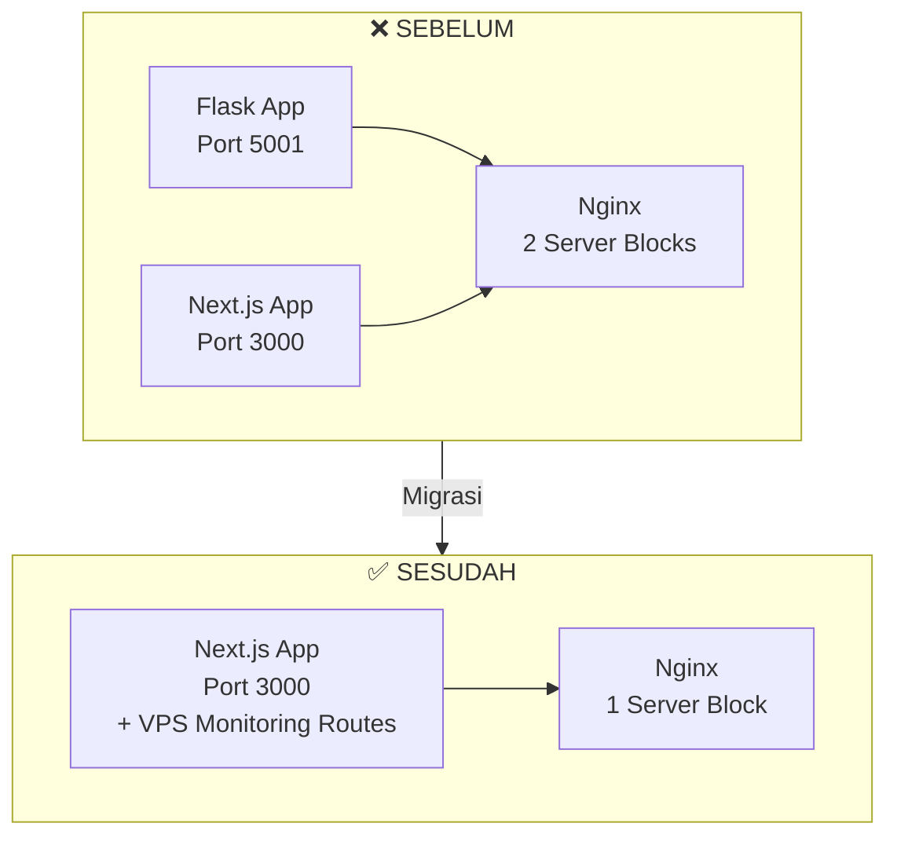

# Konsolidasi Dashboard: Dari Flask ke Next.js

> Matiin Flask dashboard terpisah, pindahin semua fitur ke Next.js. Satu codebase, satu deployment.

## Scenario

PT Contoh Engineering punya dua dashboard yang jalan berdampingan:

1. **Next.js App** — Dashboard utama buat monitoring server, log, dan metrics
2. **Flask App** — Dashboard tambahan buat VPS monitoring (bandwidth, network interfaces, speedtest)

Masalahnya? Dua codebase, dua deployment, dua nginx config, dan dua tempat buat maintain. Overhead-nya gak sebanding dengan value yang didapat.

Solusi: matiin Flask, pindahin semua fitur VPS monitoring ke Next.js.

## Kenapa Konsolidasi?



| Aspek | Sebelum (2 App) | Sesudah (1 App) |
|-------|----------------|-----------------|
| Codebase | 2 repo | 1 repo |
| Deployment | 2 proses | 1 proses |
| Nginx config | 2 server block | 1 server block |
| Authentication | 2 sistem | 1 sistem |
| Maintenance | 2x effort | 1x effort |

## Step 1 — Identifikasi Fitur yang Dipindah

Buka Flask app, lihat apa saja endpoint-nya:

```bash
cd /opt/vps-monitor-flask
grep -r "@app.route" app.py
```

Hasilnya:

```
GET  /api/bandwidth     → Tracker bandwidth harian
GET  /api/interfaces    → Daftar network interface
POST /api/speedtest     → Jalankan speedtest on-demand
GET  /                 → Dashboard HTML (Jinja2 template)
```

Tiga endpoint API dan satu halaman HTML. Semua bisa dipindah ke Next.js.

## Step 2 — Matiin Flask App

Backup dulu, baru matiin:

```bash
# Backup
cp /etc/nginx/sites-enabled/vps-monitor /etc/nginx/sites-enabled/vps-monitor.bak
cp -r /opt/vps-monitor-flask /opt/vps-monitor-flask.bak

# Stop service
systemctl stop vps-monitor
systemctl disable vps-monitor

# Hapus nginx config
rm /etc/nginx/sites-enabled/vps-monitor
nginx -t && systemctl reload nginx
```

## Step 3 — Buat API Routes di Next.js

### Bandwidth Tracker

```ts
// app/api/vps/bandwidth/route.ts
import { NextResponse } from 'next/server';
import { execSync } from 'child_process';
import { readFile, writeFile, mkdir } from 'fs/promises';
import path from 'path';

const DATA_DIR = path.join(process.cwd(), 'data');
const BANDWIDTH_FILE = path.join(DATA_DIR, 'bandwidth.json');

interface BandwidthData {
  date: string;
  rx_bytes: number;
  tx_bytes: number;
  interfaces: Record<string, { rx: number; tx: number }>;
}

function formatBytes(bytes: number): string {
  const units = ['B', 'KB', 'MB', 'GB', 'TB'];
  let i = 0;
  while (bytes >= 1024 && i < units.length - 1) {
    bytes /= 1024;
    i++;
  }
  return `${bytes.toFixed(1)} ${units[i]}`;
}

export async function GET() {
  try {
    // Baca data bandwidth dari vnstat
    const output = execSync('vnstat --json d 1', { encoding: 'utf-8' });
    const vnstat = JSON.parse(output);

    // Baca data historis
    let history: BandwidthData[] = [];
    try {
      const raw = await readFile(BANDWIDTH_FILE, 'utf-8');
      history = JSON.parse(raw);
    } catch {
      // File belum ada, abaikan
    }

    const today = new Date().toISOString().split('T')[0];
    const todayData: BandwidthData = {
      date: today,
      rx_bytes: vnstat.interfaces?.eth0?.day?.[0]?.rx ?? 0,
      tx_bytes: vnstat.interfaces?.eth0?.day?.[0]?.tx ?? 0,
      interfaces: {},
    };

    // Update history, max simpan 30 hari
    const idx = history.findIndex((d) => d.date === today);
    if (idx >= 0) history[idx] = todayData;
    else history.push(todayData);

    history = history.slice(-30);

    // Simpan ke file
    await mkdir(DATA_DIR, { recursive: true });
    await writeFile(BANDWIDTH_FILE, JSON.stringify(history, null, 2));

    return NextResponse.json({
      today: {
        ...todayData,
        rx_human: formatBytes(todayData.rx_bytes),
        tx_human: formatBytes(todayData.tx_bytes),
      },
      history,
    });
  } catch (error) {
    return NextResponse.json(
      { error: 'Failed to read bandwidth data' },
      { status: 500 }
    );
  }
}
```

### Network Interfaces

```ts
// app/api/vps/interfaces/route.ts
import { NextResponse } from 'next/server';
import { execSync } from 'child_process';

export async function GET() {
  try {
    const output = execSync("ip -j addr show", { encoding: 'utf-8' });
    const interfaces = JSON.parse(output)
      .filter((iface: any) => iface.ifname !== 'lo')
      .map((iface: any) => ({
        name: iface.ifname,
        state: iface.operstate,
        mtu: iface.mtu,
        addresses: iface.addr_info?.map((addr: any) => ({
          family: addr.family,
          local: addr.local,
          prefixlen: addr.prefixlen,
        })) ?? [],
      }));

    return NextResponse.json({ interfaces });
  } catch {
    return NextResponse.json(
      { error: 'Failed to read interfaces' },
      { status: 500 }
    );
  }
}
```

### Speedtest On-Demand

```ts
// app/api/vps/speedtest/route.ts
import { NextResponse } from 'next/server';
import { execSync } from 'child_process';

export async function POST() {
  try {
    // Timeout 60 detik soalnya speedtest butuh waktu
    const output = execSync('speedtest-cli --json', {
      encoding: 'utf-8',
      timeout: 60000,
    });

    const result = JSON.parse(output);

    return NextResponse.json({
      download: {
        bits: result.download,
        bandwidth: (result.download / 1_000_000).toFixed(2),
        unit: 'Mbps',
      },
      upload: {
        bits: result.upload,
        bandwidth: (result.upload / 1_000_000).toFixed(2),
        unit: 'Mbps',
      },
      ping: result.ping,
      server: result.server?.sponsor,
      timestamp: result.timestamp,
    });
  } catch (error: any) {
    if (error.killed) {
      return NextResponse.json(
        { error: 'Speedtest timeout (60s)' },
        { status: 504 }
      );
    }
    return NextResponse.json(
      { error: 'Speedtest failed' },
      { status: 500 }
    );
  }
}
```

## Step 4 — React Components

Tambahkan komponen VPS monitoring ke halaman sistem yang sudah ada:

```tsx
// components/vps/NetworkInterfaces.tsx
'use client';

import { useEffect, useState } from 'react';

interface InterfaceInfo {
  name: string;
  state: string;
  mtu: number;
  addresses: { family: string; local: string; prefixlen: number }[];
}

export function NetworkInterfaces() {
  const [interfaces, setInterfaces] = useState<InterfaceInfo[]>([]);
  const [loading, setLoading] = useState(true);

  useEffect(() => {
    fetch('/api/vps/interfaces')
      .then((r) => r.json())
      .then((data) => {
        setInterfaces(data.interfaces);
        setLoading(false);
      });
  }, []);

  if (loading) return <div className="animate-pulse h-24 bg-gray-800 rounded" />;

  return (
    <div className="space-y-2">
      {interfaces.map((iface) => (
        <div key={iface.name} className="bg-gray-800/50 rounded-lg p-3">
          <div className="flex items-center gap-2">
            <span className={`w-2 h-2 rounded-full ${iface.state === 'UP' ? 'bg-green-400' : 'bg-red-400'}`} />
            <span className="font-mono text-sm">{iface.name}</span>
            <span className="text-xs text-gray-400">MTU {iface.mtu}</span>
          </div>
          {iface.addresses.map((addr, i) => (
            <div key={i} className="ml-4 text-xs text-gray-300 font-mono">
              {addr.family === 'inet' ? 'IPv4' : 'IPv6'}: {addr.local}/{addr.prefixlen}
            </div>
          ))}
        </div>
      ))}
    </div>
  );
}
```

```tsx
// components/vps/SpeedtestButton.tsx
'use client';

import { useState } from 'react';

export function SpeedtestButton() {
  const [result, setResult] = useState<any>(null);
  const [running, setRunning] = useState(false);

  const runTest = async () => {
    setRunning(true);
    try {
      const res = await fetch('/api/vps/speedtest', { method: 'POST' });
      const data = await res.json();
      setResult(data);
    } catch {
      setResult({ error: 'Request failed' });
    }
    setRunning(false);
  };

  return (
    <div>
      <button
        onClick={runTest}
        disabled={running}
        className="px-4 py-2 bg-blue-600 hover:bg-blue-700 disabled:bg-gray-600 rounded-lg text-sm transition"
      >
        {running ? '⏳ Running...' : '🚀 Run Speedtest'}
      </button>

      {result && (
        <div className="mt-3 grid grid-cols-3 gap-3">
          <div className="bg-gray-800/50 rounded-lg p-3 text-center">
            <div className="text-xs text-gray-400">Download</div>
            <div className="text-lg font-bold text-green-400">
              {result.download?.bandwidth ?? '-'} Mbps
            </div>
          </div>
          <div className="bg-gray-800/50 rounded-lg p-3 text-center">
            <div className="text-xs text-gray-400">Upload</div>
            <div className="text-lg font-bold text-blue-400">
              {result.upload?.bandwidth ?? '-'} Mbps
            </div>
          </div>
          <div className="bg-gray-800/50 rounded-lg p-3 text-center">
            <div className="text-xs text-gray-400">Ping</div>
            <div className="text-lg font-bold text-yellow-400">
              {result.ping ?? '-'} ms
            </div>
          </div>
        </div>
      )}
    </div>
  );
}
```

## Step 5 — Update Nginx

Flask sudah dimatikan, sekarang Next.js handle semua:

```nginx
# /etc/nginx/sites-enabled/dashboard
server {
    listen 80;
    server_name monitor.example.com;

    location / {
        proxy_pass http://127.0.0.1:3000;
        proxy_http_version 1.1;
        proxy_set_header Upgrade $http_upgrade;
        proxy_set_header Connection 'upgrade';
        proxy_set_header Host $host;
        proxy_cache_bypass $http_upgrade;
    }

    # Timeout khusus speedtest endpoint
    location /api/vps/speedtest {
        proxy_pass http://127.0.0.1:3000;
        proxy_read_timeout 65s;
    }
}
```

```bash
nginx -t && systemctl reload nginx
```

## Checklist Sebelum Matiin Flask

- [ ] Semua endpoint sudah dipindah ke Next.js
- [ ] Tes manual semua API route (curl/browser)
- [ ] Frontend komponen sudah terintegrasi
- [ ] Nginx config sudah diupdate
- [ ] Backup Flask app tersimpan
- [ ] Service Flask sudah di-disable

## Hasil Akhir

Setelah konsolidasi:

- 🔧 **1 codebase** — Semua fitur di satu repo Next.js
- 🚀 **1 deployment** — Satu `pm2` process, satu nginx block
- 🔐 **1 auth system** — Session/token management terpusat
- 📉 **Maintainability** — Update UI/UX satu tempat, langsung ke semua fitur
- 💰 **Cost** — Kurang RAM usage, kurang overhead

Flask app bisa tetap ada di disk buat referensi, tapi production-nya sudah fully Next.js.
