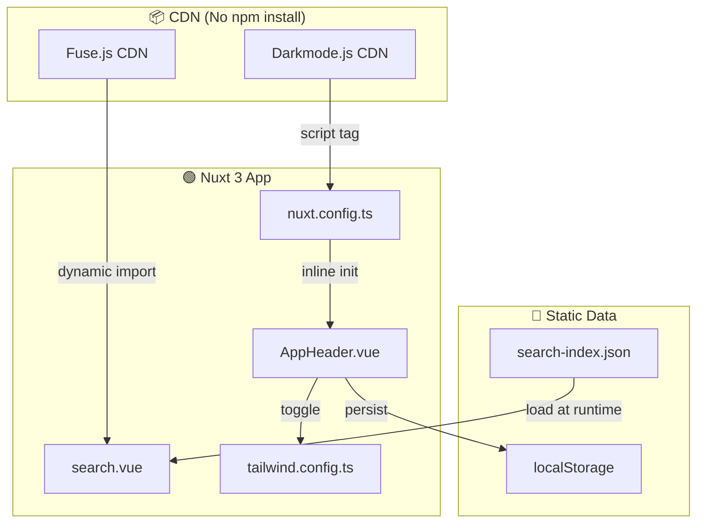
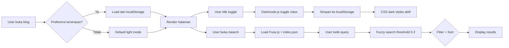

# 🌙 Dark Mode + Search dengan Library GitHub di Nuxt 3

> Tambahkan dark mode dan fuzzy search ke blog Nuxt 3 kamu — tanpa npm install, cukup pakai library dari GitHub via CDN!

---

## 📌 Library yang Digunakan

| Library | Stars | GitHub | Fungsi |
|---------|-------|--------|--------|
| [Darkmode.js](https://github.com/sandoche/Darkmode.js) | ⭐ 2.8k | [sandoche/Darkmode.js](https://github.com/sandoche/Darkmode.js) | Toggle dark/light mode dengan widget |
| [Fuse.js](https://github.com/fusejs/fuse.js) | ⭐ 20.1k | [fusejs/fuse.js](https://github.com/fusejs/fuse.js) | Fuzzy search dengan threshold customizable |

**Live demo:** [blog.fanani.co](https://blog.fanani.co)

---

## 🎯 Apa yang Akan Dibangun

- 🌙 **Dark Mode** — Toggle button di header, persist via localStorage & cookies, smooth transition
- 🔍 **Fuzzy Search** — Search bar full-width, filter by tag, sort newest/oldest/A-Z
- 📦 **Zero npm install** — Darkmode.js via CDN script tag, Fuse.js via dynamic import

---

## 🏗️ Architecture



---

## 🛠️ Step-by-Step

### Step 1: Setup Tailwind Dark Mode

Di `tailwind.config.ts`, aktifkan class-based dark mode:

```typescript
// tailwind.config.ts
export default {
  darkMode: 'class',
  content: [],
  theme: { extend: {} },
  plugins: [],
}
```

---

### Step 2: Tambahkan Darkmode.js via CDN

Buka `nuxt.config.ts` dan tambahkan di `app.head`:

```typescript
// nuxt.config.ts
export default defineNuxtConfig({
  app: {
    head: {
      script: [
        {
          src: 'https://cdn.jsdelivr.net/npm/darkmode-js@1.5.7/lib/darkmode-js.min.js',
          defer: true,
        },
        {
          innerHTML: `
            window.addEventListener('load', function() {
              new Darkmode({
                saveInCookies: true,
                label: '🌓',
                autoMatchOsTheme: true,
                time: '0.3s'
              }).showWidget();
            });
          `,
          type: 'text/javascript',
        },
      ],
      link: [
        {
          rel: 'stylesheet',
          href: 'https://cdn.jsdelivr.net/npm/darkmode-js@1.5.7/lib/darkmode-js.min.css',
        },
      ],
    },
  },
})
```

**Penjelasan:**
- `saveInCookies: true` — preferensi tersimpan di cookies
- `autoMatchOsTheme: true` — otomatis ikut tema OS
- `time: '0.3s'` — durasi transisi animasi

---

### Step 3: Styling Dark Mode Widget

Tambahkan di CSS global (`assets/css/main.css`):

```css
.darkmode-toggle {
  position: fixed;
  top: 5rem;
  right: 1rem;
  z-index: 100;
  background: transparent;
  border: none;
  cursor: pointer;
  opacity: 0.7;
  transition: opacity 0.3s;
}

.darkmode-toggle:hover { opacity: 1; }

.darkmode--activated body {
  background-color: #1a1a2e !important;
  color: #e0e0e0 !important;
}

.darkmode--activated nav,
.darkmode--activated header {
  background-color: #16213e !important;
  border-color: #2a3a5c !important;
}

.darkmode--activated a { color: #64b5f6 !important; }

.darkmode--activated code {
  background-color: #0f0f23 !important;
  color: #e0e0e0 !important;
}

html {
  transition: background-color 0.3s ease, color 0.3s ease;
}
```

---

### Step 4: Buat Search Index JSON

Buat file `public/search-index.json`:

```json
[
  {
    "title": "Setup Nuxt 3 dengan Tailwind CSS",
    "slug": "/tech/setup-nuxt3-tailwind",
    "type": "tech",
    "tags": ["nuxt3", "tailwind", "frontend"],
    "description": "Panduan lengkap setup Nuxt 3 dengan Tailwind CSS dari nol",
    "date": "2026-04-01"
  }
]
```

**Tips:** Generate otomatis saat build — buat `scripts/generate-search-index.js`:

```javascript
const fs = require('fs')
const path = require('path')
const articles = []

function scanDir(dir, type) {
  fs.readdirSync(dir).forEach(file => {
    if (!file.endsWith('.md')) return
    const content = fs.readFileSync(path.join(dir, file), 'utf8')
    const fm = content.match(/^---\n([\s\S]*?)\n---/)
    if (fm) {
      const meta = {}
      fm[1].split('\n').forEach(line => {
        const [k, ...v] = line.split(':')
        if (k && v) meta[k.trim()] = v.join(':').trim()
      })
      articles.push({
        title: meta.title || file.replace('.md', ''),
        slug: `/${type}/${file.replace('.md', '')}`,
        type,
        tags: meta.tags ? meta.tags.split(',').map(t => t.trim()) : [],
        description: meta.description || '',
        date: meta.date || ''
      })
    }
  })
}

scanDir('./content/tech', 'tech')
scanDir('./content/eng', 'eng')
fs.writeFileSync('./public/search-index.json', JSON.stringify(articles, null, 2))
console.log(`Generated ${articles.length} articles`)
```

Tambahkan ke `package.json`:

```json
{
  "scripts": {
    "generate:index": "node scripts/generate-search-index.js",
    "generate": "npm run generate:index && npx nuxi generate"
  }
}
```

---

### Step 5: Buat Halaman Search

Buat `pages/search.vue`:

```vue
<template>
  <div class="min-h-screen bg-white dark:bg-gray-900">
    <div class="max-w-3xl mx-auto px-4 py-8">
      <h1 class="text-3xl font-bold mb-6 text-gray-800 dark:text-white">
        🔍 Cari Artikel
      </h1>

      <div class="relative mb-6">
        <input v-model="query" type="text" placeholder="Ketik untuk mencari..."
          class="w-full px-4 py-3 pl-12 rounded-lg border border-gray-300 
                 focus:ring-2 focus:ring-blue-500 dark:bg-gray-800 
                 dark:border-gray-600 dark:text-white" />
      </div>

      <div class="flex flex-wrap gap-3 mb-6">
        <select v-model="selectedTag"
          class="px-3 py-2 rounded-lg border dark:bg-gray-800 dark:text-white">
          <option value="">Semua Tag</option>
          <option v-for="tag in allTags" :key="tag" :value="tag">{{ tag }}</option>
        </select>
        <select v-model="sortBy"
          class="px-3 py-2 rounded-lg border dark:bg-gray-800 dark:text-white">
          <option value="newest">Terbaru</option>
          <option value="oldest">Terlama</option>
          <option value="az">A-Z</option>
        </select>
      </div>

      <p class="text-sm text-gray-500 mb-4">{{ results.length }} artikel ditemukan</p>

      <div class="space-y-4">
        <NuxtLink v-for="article in results" :key="article.slug" :to="article.slug"
          class="block p-4 rounded-lg border hover:border-blue-400 hover:shadow-md
                 dark:bg-gray-800 dark:border-gray-700">
          <div class="flex items-center gap-2 mb-2">
            <span class="px-2 py-0.5 text-xs rounded-full bg-blue-100 text-blue-700">
              {{ article.type }}
            </span>
            <span class="text-sm text-gray-400">{{ article.date }}</span>
          </div>
          <h2 class="text-lg font-semibold text-gray-800 dark:text-white">
            {{ article.title }}
          </h2>
          <p class="text-gray-600 dark:text-gray-400 mt-1">{{ article.description }}</p>
          <div class="flex gap-2 mt-2">
            <span v-for="tag in article.tags" :key="tag"
              class="text-xs px-2 py-0.5 rounded bg-gray-100 text-gray-600">
              #{{ tag }}
            </span>
          </div>
        </NuxtLink>
      </div>

      <div v-if="query && results.length === 0" class="text-center py-12">
        <p class="text-gray-400">😕 Artikel tidak ditemukan untuk "{{ query }}"</p>
      </div>
    </div>
  </div>
</template>

<script setup>
import { ref, computed, onMounted } from 'vue'

const query = ref('')
const selectedTag = ref('')
const sortBy = ref('newest')
const articles = ref([])
let fuse = null

onMounted(async () => {
  const Fuse = await import(
    'https://cdn.jsdelivr.net/npm/fuse.js@7.0.0/dist/fuse.esm.js'
  ).then(m => m.default)
  
  const res = await fetch('/search-index.json')
  articles.value = await res.json()
  
  fuse = new Fuse(articles.value, {
    keys: [
      { name: 'title', weight: 0.4 },
      { name: 'description', weight: 0.3 },
      { name: 'tags', weight: 0.3 },
    ],
    threshold: 0.3,
    includeScore: true,
  })
})

const allTags = computed(() => {
  const tags = new Set()
  articles.value.forEach(a => a.tags?.forEach(t => tags.add(t)))
  return [...tags].sort()
})

const results = computed(() => {
  let filtered = articles.value
  if (query.value && fuse) {
    filtered = fuse.search(query.value).map(r => r.item)
  }
  if (selectedTag.value) {
    filtered = filtered.filter(a => a.tags?.includes(selectedTag.value))
  }
  return [...filtered].sort((a, b) => {
    if (sortBy.value === 'newest') return new Date(b.date) - new Date(a.date)
    if (sortBy.value === 'oldest') return new Date(a.date) - new Date(b.date)
    if (sortBy.value === 'az') return a.title.localeCompare(b.title)
    return 0
  })
})
</script>
```

---

### Step 6: Tambahkan Link Search di Header

Di `AppHeader.vue`:

```vue
<template>
  <header>
    <nav>
      <NuxtLink to="/">Home</NuxtLink>
      <NuxtLink to="/tech">Tech</NuxtLink>
      <NuxtLink to="/eng">Engineering</NuxtLink>
      <NuxtLink to="/search">🔍</NuxtLink>
    </nav>
  </header>
</template>
```

---

## 📊 Flow Diagram



---

## ✅ Hasil Akhir

| Feature | Detail |
|---------|--------|
| 🌙 Dark Mode | Toggle floating di kanan atas, smooth transition 0.3s |
| 💾 Persistence | State tersimpan di localStorage + cookies |
| 🔍 Search | Fuzzy search threshold 0.3 |
| 🏷️ Filter | Filter artikel berdasarkan tag |
| 📊 Sort | Terbaru / Terlama / A-Z |
| 📦 Bundle Size | Zero npm dependency |

---

## 🔧 Tips & Tricks

```javascript
// Adjust search sensitivity
threshold: 0.2  // Lebih strict
threshold: 0.5  // Lebih longgar

// Custom widget position
new Darkmode({ bottom: '32px', right: '32px', time: '0.5s' })
```

---

## 🆘 Troubleshooting

| Problem | Solution |
|---------|----------|
| Dark mode tidak toggle | Pastikan `defer: true` dan `window.addEventListener('load')` |
| Fuse.js import error | Gunakan ESM: `fuse.esm.js` |
| Search index 404 | File harus di `public/`, bukan `assets/` |
| Tailwind dark: tidak kerja | Pastikan `darkMode: 'class'` di tailwind.config.ts |

---

> 💡 **Pro Tip:** Darkmode.js + Fuse.js cocok banget untuk blog statis yang mau fitur dark mode dan search tanpa nambah bundle size. Semua via CDN — clean dan cepat!

**Live demo:** [blog.fanani.co](https://blog.fanani.co) 🚀
