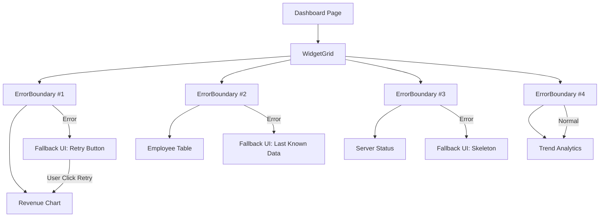

# Dashboard Widget Error Boundary Pattern untuk Next.js

> Satu widget error, seluruh dashboard tetap aman — dengan graceful fallback dan auto-recovery.

## Scenario

Dashboard PT Contoh Engineering punya 8-12 widget di satu halaman: grafik revenue, tabel karyawan, status server, chart tren, dll. Masalah klasik: kalau satu widget throw error (misalnya API timeout, data format salah), **seluruh halaman crash** dan user lihat white screen of death.

Dengan Error Boundary pattern, setiap widget dibungkus isolated wrapper. Satu error nggak ngaruh ke yang lain. User tetap bisa pakai widget lain sambil menunggu yang bermasalah di-recover.

## Arsitektur



## Step 1: Generic Error Boundary Class Component

React Error Boundary harus class component — nggak bisa pakai hooks:

```typescript
// components/error-boundary.tsx
'use client';
import React, { Component, ReactNode } from 'react';

interface ErrorBoundaryProps {
  children: ReactNode;
  fallback?: ReactNode;
  fallbackType?: 'skeleton' | 'retry' | 'message';
  widgetName?: string;
  onReset?: () => void;
}

interface ErrorBoundaryState {
  hasError: boolean;
  error: Error | null;
  retryCount: number;
}

export class ErrorBoundary extends Component<ErrorBoundaryProps, ErrorBoundaryState> {
  constructor(props: ErrorBoundaryProps) {
    super(props);
    this.state = { hasError: false, error: null, retryCount: 0 };
  }

  static getDerivedStateFromError(error: Error) {
    return { hasError: true, error };
  }

  componentDidCatch(error: Error, errorInfo: React.ErrorInfo) {
    // Log ke error tracking service
    console.error(`[ErrorBoundary] ${this.props.widgetName ?? 'Unknown'}:`, error, errorInfo);
    // Kirim ke monitoring (Sentry, LogRocket, dll)
    // Sentry.captureException(error, { contexts: { react: errorInfo } });
  }

  handleRetry = () => {
    const newCount = this.state.retryCount + 1;
    this.setState({ hasError: false, error: null, retryCount: newCount });
    this.props.onReset?.();
  };

  render() {
    if (!this.state.hasError) return this.props.children;

    // Custom fallback
    if (this.props.fallback) return this.props.fallback;

    // Built-in fallback berdasarkan type
    const type = this.props.fallbackType ?? 'retry';

    if (type === 'skeleton') {
      return (
        <div className="p-4 rounded-xl border bg-gray-50 animate-pulse">
          <div className="h-4 bg-gray-200 rounded w-1/3 mb-3" />
          <div className="h-32 bg-gray-200 rounded" />
        </div>
      );
    }

    if (type === 'message') {
      return (
        <div className="p-4 rounded-xl border bg-red-50 text-center">
          <p className="text-red-600 text-sm font-medium">
            {this.props.widgetName ?? 'Widget'} mengalami error
          </p>
          <p className="text-red-400 text-xs mt-1">{this.state.error?.message}</p>
        </div>
      );
    }

    // Default: retry button
    return (
      <div className="p-6 rounded-xl border bg-gray-50 flex flex-col items-center justify-center min-h-[200px]">
        <div className="w-12 h-12 rounded-full bg-red-100 flex items-center justify-center mb-3">
          <span className="text-red-500 text-xl">⚠️</span>
        </div>
        <p className="text-gray-600 text-sm font-medium mb-1">
          {this.props.widgetName ?? 'Widget'} gagal memuat
        </p>
        {this.state.retryCount < 3 ? (
          <>
            <p className="text-gray-400 text-xs mb-3">{this.state.error?.message}</p>
            <button
              onClick={this.handleRetry}
              className="px-4 py-1.5 bg-blue-500 text-white text-sm rounded-lg hover:bg-blue-600 transition"
            >
              Coba Lagi
            </button>
          </>
        ) : (
          <p className="text-gray-400 text-xs">
            Gagal setelah {this.state.retryCount}x percobaan.
            <button onClick={this.handleRetry} className="text-blue-500 underline ml-1">
              Coba sekali lagi?
            </button>
          </p>
        )}
      </div>
    );
  }
}
```

## Step 2: Wrapper HOC untuk Widget

Simplify penggunaan dengan Higher-Order Component:

```typescript
// components/with-error-boundary.tsx
import { ErrorBoundary } from './error-boundary';

interface WidgetConfig {
  name: string;
  fallbackType?: 'skeleton' | 'retry' | 'message';
}

export function withErrorBoundary<P extends object>(
  WidgetComponent: React.ComponentType<P>,
  config: WidgetConfig
) {
  const Wrapped = (props: P) => (
    <ErrorBoundary widgetName={config.name} fallbackType={config.fallbackType}>
      <WidgetComponent {...props} />
    </ErrorBoundary>
  );
  Wrapped.displayName = `WithErrorBoundary(${config.name})`;
  return Wrapped;
}
```

## Step 3: Pakai di Dashboard

```tsx
// app/dashboard/page.tsx
import { ErrorBoundary } from '@/components/error-boundary';
import { RevenueChart } from '@/components/widgets/revenue-chart';
import { EmployeeTable } from '@/components/widgets/employee-table';
import { ServerStatus } from '@/components/widgets/server-status';
import { withErrorBoundary } from '@/components/with-error-boundary';

// Option 1: Wrap dengan HOC
const SafeTrendChart = withErrorBoundary(TrendChart, { name: 'Trend Analytics' });

// Option 2: Manual wrap di JSX
export default function DashboardPage() {
  return (
    <div className="grid grid-cols-1 md:grid-cols-2 lg:grid-cols-3 gap-4 p-6">
      {/* Skeleton fallback — user nggak tau ada error */}
      <ErrorBoundary widgetName="Revenue Chart" fallbackType="skeleton">
        <RevenueChart />
      </ErrorBoundary>

      {/* Retry fallback — user bisa coba lagi */}
      <ErrorBoundary widgetName="Employee Table" fallbackType="retry">
        <EmployeeTable />
      </ErrorBoundary>

      {/* Message fallback — informasi error ringkas */}
      <ErrorBoundary widgetName="Server Status" fallbackType="message">
        <ServerStatus />
      </ErrorBoundary>

      {/* HOC-wrapped widget */}
      <SafeTrendChart />
    </div>
  );
}
```

## Step 4: Auto-Refresh pada Error

Buat variant yang otomatis coba lagi setelah delay:

```typescript
// components/auto-recover-boundary.tsx
'use client';
import { useEffect } from 'react';
import { ErrorBoundary, ErrorBoundaryProps } from './error-boundary';

interface AutoRecoverProps extends Omit<ErrorBoundaryProps, 'fallback'> {
  retryDelayMs?: number;
}

export function AutoRecoverBoundary({
  children,
  retryDelayMs = 10000,
  ...props
}: AutoRecoverProps & { children: React.ReactNode }) {
  const [key, setKey] = React.useReducer((x: number) => x + 1, 0);

  return (
    <ErrorBoundary
      {...props}
      fallback={
        <div className="p-4 rounded-xl border bg-yellow-50 text-center">
          <p className="text-yellow-700 text-sm">Memuat ulang otomatis...</p>
          <div className="mt-2 h-1 bg-yellow-200 rounded-full overflow-hidden">
            <div
              className="h-full bg-yellow-500 rounded-full animate-[shrink_10s_linear]"
              style={{ width: '100%' }}
            />
          </div>
        </div>
      }
      onReset={() => setKey()}
    >
      {React.cloneElement(children as React.ReactElement, { key })}
    </ErrorBoundary>
  );
}
```

## Best Practices

| Practice | Kenapa |
|----------|--------|
| Satu ErrorBoundary per widget | Isolasi error — satu crash, yang lain aman |
| `widgetName` selalu diisi | Error log readable |
| Fallback type sesuai konteks | Critical widget = retry, decorative = skeleton |
| Batasi retry 3x | Cegah infinite retry loop |
| Log ke monitoring | `componentDidCatch` wajib kirim ke Sentry/dll |
| Key-based remount untuk retry | Force React mount ulang komponen dari nol |

## Hasil

- 🛡️ Satu widget error nggak crash seluruh dashboard
- 🔄 Tiga tipe fallback: skeleton, retry button, error message
- ⏱️ Auto-recover variant untuk transient errors
- 📊 Error logging terpusat per widget
- 🧩 HOC wrapper biar setup cuma 1 baris per widget
