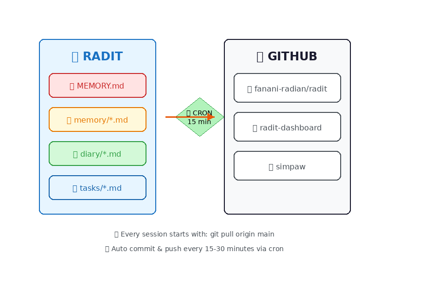
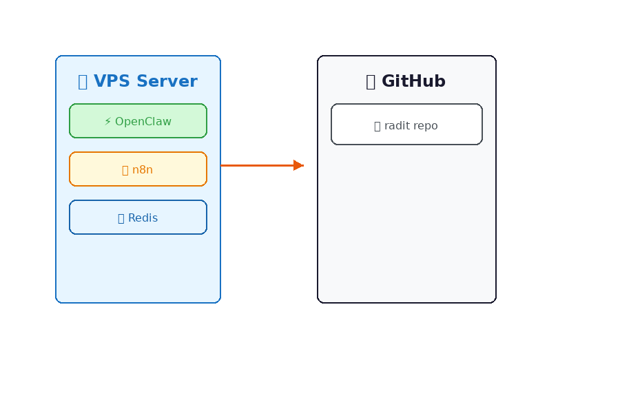
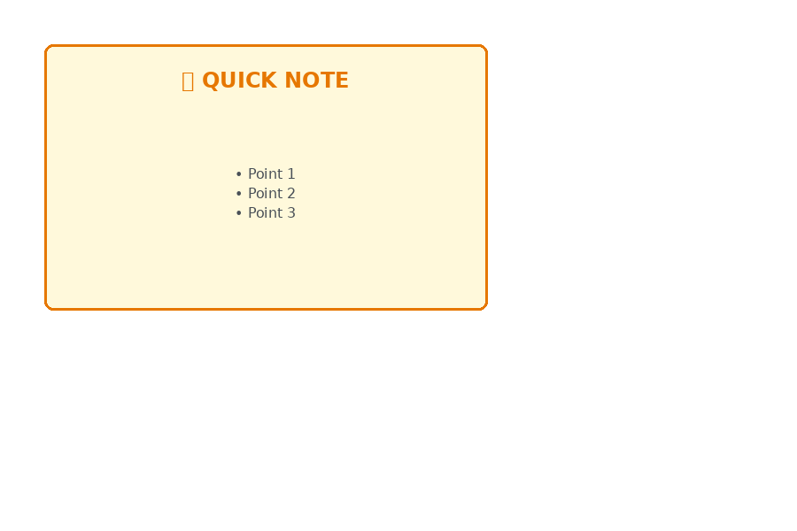

# OpenClaw + Excalidraw Tutorial

Generate beautiful hand-drawn style diagrams programmatically for documentation, reports, and presentations.

## Overview

This tutorial shows how to integrate Excalidraw diagram generation into your OpenClaw workflow. Create diagrams that look hand-sketched but are generated programmatically.

## What You'll Learn

- Generate Excalidraw diagrams from templates
- Export to PNG for GitHub, docs, slides
- Embed diagrams in various platforms

## Quick Start

### Prerequisites

```bash
pip install Pillow
```

### Generate Your First Diagram

```bash
# From your workspace
python3 skills/excalidraw/scripts/generate.py \
  --template system-architecture \
  --output my-diagram
```

### Export to PNG

```bash
python3 skills/excalidraw/scripts/export.py \
  my-diagram.excalidraw \
  my-diagram.png
```

## Example Output

Here's what generated diagrams look like:

### Memory Sync Flow

*Example: RADIT memory synchronization with GitHub*

### System Architecture

*Example: VPS server architecture overview*

### Quick Note

*Example: Simple note template*

**Characteristics:**
- ✅ Clean white background
- ✅ Hand-drawn style (rough edges)
- ✅ Solid colors (no patterns)
- ✅ Readable text
- ✅ Professional look

## Available Templates

| Template | Description | Best For |
|----------|-------------|----------|
| `system-architecture` | Server/VPS architecture | Infrastructure docs |
| `memory-sync` | Git sync workflow | Documentation |
| `data-flow` | ETL/data pipeline | Technical specs |
| `decision-tree` | Yes/No decision flow | Process docs |
| `timeline` | Project timeline | Reports |
| `swot` | SWOT analysis | Business docs |
| `mindmap` | Mind mapping | Brainstorming |

## Use Cases

### 1. GitHub Documentation

Generate architecture diagrams for README files:

```bash
python3 skills/excalidraw/scripts/generate.py \
  --template system-architecture \
  --output radit-arch

python3 skills/excalidraw/scripts/export.py \
  radit-arch.excalidraw \
  radit-arch.png
```

Embed in README.md:
```markdown

*[Edit in Excalidraw](https://excalidraw.com)*
```

### 2. Google Docs/Slides

```bash
# Generate and export
python3 skills/excalidraw/scripts/generate.py \
  --template data-flow \
  --output q1-report

python3 skills/excalidraw/scripts/export.py \
  q1-report.excalidraw \
  q1-report.png
```

1. Open Google Docs/Slides
2. Insert → Image → Upload
3. Select `q1-report.png`

### 3. Notion Pages

```bash
python3 skills/excalidraw/scripts/generate.py \
  --template timeline \
  --output project-roadmap

python3 skills/excalidraw/scripts/export.py \
  project-roadmap.excalidraw \
  project-roadmap.png
```

Upload directly to Notion or use Notion API.

### 4. Presentation Slides

Export multiple diagrams for slide deck:

```bash
for template in system-architecture data-flow timeline; do
  python3 skills/excalidraw/scripts/export.py \
    examples/${template}.excalidraw \
    slides/${template}.png
done
```

### 5. API Documentation

```bash
python3 skills/excalidraw/scripts/generate.py \
  --template api-flow \
  --output api-diagram
```

### 6. Business Analysis

```bash
python3 skills/excalidraw/scripts/generate.py \
  --template swot \
  --output company-swot
```

### 7. Process Documentation

```bash
python3 skills/excalidraw/scripts/generate.py \
  --template decision-tree \
  --output deploy-process
```

## Script Reference

### generate.py

Generate diagrams from templates.

```bash
python3 scripts/generate.py [OPTIONS]

Options:
  --template, -t    Template name (required)
  --output, -o      Output filename (required)

Examples:
  python3 scripts/generate.py -t memory-sync -o git-flow
  python3 scripts/generate.py -t quick-note -o my-notes
```

### export.py

Export Excalidraw to PNG.

```bash
python3 scripts/export.py [INPUT] [OUTPUT] [WIDTH] [HEIGHT]

Arguments:
  INPUT     Input .excalidraw file
  OUTPUT    Output .png file (optional)
  WIDTH     Image width (default: 900)
  HEIGHT    Image height (default: 600)

Examples:
  python3 scripts/export.py diagram.excalidraw
  python3 scripts/export.py diagram.excalidraw output.png 1920 1080
```

## Color Palette

| Purpose | Color | Hex |
|---------|-------|-----|
| Primary box | Blue | `#e7f5ff` |
| Success/OK | Green | `#d3f9d8` |
| Warning | Yellow | `#fff9db` |
| Error/Alert | Red | `#ffe3e3` |
| Neutral | Gray | `#f8f9fa` |
| Dark text | Dark | `#1a1a2e` |
| Accent | Orange | `#e8590c` |

## File Format

### .excalidraw (Source)
- JSON format
- Editable in excalidraw.com
- Contains all element data

### .png (Export)
- Static image
- White background
- Clean, readable text
- Perfect for embedding

## Examples

See `examples/` folder for:
- `memory-sync-flow.excalidraw` / `.png`
- `system-architecture.excalidraw` / `.png`
- `quick-note.excalidraw` / `.png`

## Creating Custom Templates

Edit `scripts/generate.py` and add to `TEMPLATES` dictionary:

```python
'my-template': {
    'width': 900,
    'height': 600,
    'elements': [
        {
            'type': 'rectangle',
            'x': 100, 'y': 100,
            'width': 200, 'height': 100,
            'strokeColor': '#1971c2',
            'backgroundColor': '#e7f5ff',
            'strokeWidth': 2
        },
        {
            'type': 'text',
            'x': 120, 'y': 130,
            'width': 160, 'height': 40,
            'text': 'My Label',
            'fontSize': 18,
            'strokeColor': '#1971c2'
        }
    ]
}
```

## Tips

1. **Always save .excalidraw source** — PNG is display-only
2. **Use descriptive filenames** — `radit-arch-v2.excalidraw`
3. **Version control** — Commit both .excalidraw and .png
4. **Consistent colors** — Follow palette for professional look
5. **Export resolution** — 900x600 for docs, 1920x1080 for slides

## Troubleshooting

**Text not rendering?**
- Install fonts: `apt-get install fonts-dejavu`

**Colors look different?**
- Use hex codes from palette
- GitHub displays sRGB colors

**PNG blurry?**
- Increase resolution: `export.py input.excalidraw output.png 1920 1080`

## Resources

- [Excalidraw](https://excalidraw.com) — Online editor
- [Excalidraw Libraries](https://libraries.excalidraw.com) — Community shapes
- [Rough.js](https://roughjs.com) — Hand-drawn graphics engine

## Next Steps

1. Try generating your first diagram
2. Export to PNG
3. Embed in your project documentation
4. Create custom templates for your needs

---

**Tutorial Version:** 1.0  
**Last Updated:** 2026-03-08  
**Compatible With:** OpenClaw 2026.2+
