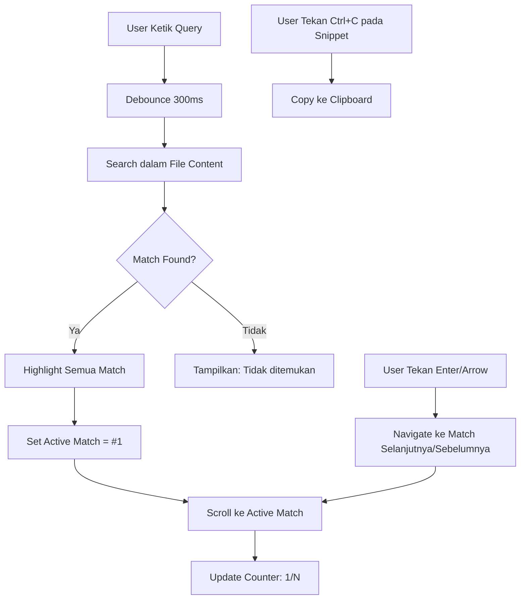

# File Manager dengan Google Docs-Style Search: Highlight, Navigate, Copy

> Implementasi fitur pencarian konten file ala Google Docs — highlight aktif, navigasi keyboard, dan copy snippet.

## Scenario

File manager di dashboard PT Contoh Engineering sudah bisa upload, delete, dan preview file. Tapi ketika user buka file teks (log, config, script), mereka nggak bisa cari isi file dengan cepat. Harus scroll manual atau download dulu baru buka di editor.

Kita tambahkan fitur search yang selevel Google Docs: ketik keyword → highlight semua match → navigasi antar match pakai keyboard → copy snippet langsung dari hasil.

## Arsitektur



## Step 1: Search Hook

Custom hook yang handle search logic, highlighting, dan navigation:

```typescript
// hooks/use-content-search.ts
import { useState, useCallback, useEffect, useRef } from 'react';

interface Match {
  index: number;
  start: number;
  end: number;
  text: string;
}

export function useContentSearch(content: string) {
  const [query, setQuery] = useState('');
  const [matches, setMatches] = useState<Match[]>([]);
  const [activeIndex, setActiveIndex] = useState(-1);

  // Debounced search
  const timerRef = useRef<NodeJS.Timeout>();

  useEffect(() => {
    if (timerRef.current) clearTimeout(timerRef.current);
    timerRef.current = setTimeout(() => {
      if (!query.trim()) {
        setMatches([]);
        setActiveIndex(-1);
        return;
      }
      const lower = content.toLowerCase();
      const q = query.toLowerCase();
      const found: Match[] = [];
      let pos = 0;
      while (true) {
        const idx = lower.indexOf(q, pos);
        if (idx === -1) break;
        found.push({
          index: found.length,
          start: idx,
          end: idx + query.length,
          text: content.slice(idx, idx + query.length),
        });
        pos = idx + 1;
      }
      setMatches(found);
      setActiveIndex(found.length > 0 ? 0 : -1);
    }, 300);
    return () => { if (timerRef.current) clearTimeout(timerRef.current); };
  }, [query, content]);

  // Keyboard navigation
  const handleKeyDown = useCallback((e: React.KeyboardEvent) => {
    if (matches.length === 0) return;
    if (e.key === 'Enter' || e.key === 'ArrowDown') {
      e.preventDefault();
      setActiveIndex(prev => (prev + 1) % matches.length);
    } else if (e.key === 'ArrowUp') {
      e.preventDefault();
      setActiveIndex(prev => (prev - 1 + matches.length) % matches.length);
    } else if (e.key === 'Escape') {
      setQuery('');
    }
  }, [matches.length]);

  return { query, setQuery, matches, activeIndex, handleKeyDown };
}
```

## Step 2: Highlighted Content Renderer

Komponen yang render konten file dengan highlight pada semua match:

```tsx
// components/highlighted-content.tsx
import { useEffect, useRef } from 'react';

interface HighlightedContentProps {
  content: string;
  query: string;
  matches: { start: number; end: number; index: number }[];
  activeIndex: number;
}

export function HighlightedContent({
  content,
  matches,
  activeIndex,
}: HighlightedContentProps) {
  const containerRef = useRef<HTMLPreElement>(null);
  const activeElRef = useRef<HTMLElement>(null);

  // Scroll ke active match
  useEffect(() => {
    if (activeElRef.current && containerRef.current) {
      activeElRef.current.scrollIntoView({
        behavior: 'smooth',
        block: 'center',
      });
    }
  }, [activeIndex]);

  if (matches.length === 0) {
    return <pre className="p-4 text-sm font-mono whitespace-pre-wrap">{content}</pre>;
  }

  // Build segments: text, highlight, text, highlight, ...
  const segments: { text: string; highlight: boolean; matchIndex: number }[] = [];
  let cursor = 0;

  for (const match of matches) {
    if (cursor < match.start) {
      segments.push({ text: content.slice(cursor, match.start), highlight: false, matchIndex: -1 });
    }
    segments.push({ text: content.slice(match.start, match.end), highlight: true, matchIndex: match.index });
    cursor = match.end;
  }
  if (cursor < content.length) {
    segments.push({ text: content.slice(cursor), highlight: false, matchIndex: -1 });
  }

  return (
    <pre ref={containerRef} className="p-4 text-sm font-mono whitespace-pre-wrap overflow-auto max-h-[70vh]">
      {segments.map((seg, i) =>
        seg.highlight ? (
          <mark
            key={i}
            ref={seg.matchIndex === activeIndex ? activeElRef : undefined}
            className={`rounded px-0.5 transition-colors ${
              seg.matchIndex === activeIndex
                ? 'bg-yellow-400 text-black'
                : 'bg-yellow-200 text-black'
            }`}
            data-match-index={seg.matchIndex}
          >
            {seg.text}
          </mark>
        ) : (
          <span key={i}>{seg.text}</span>
        )
      )}
    </pre>
  );
}
```

## Step 3: Search Bar dengan Counter dan Keyboard Hints

```tsx
// components/search-bar.tsx
import { useRef, useEffect } from 'react';

interface SearchBarProps {
  query: string;
  onQueryChange: (q: string) => void;
  matchesCount: number;
  activeIndex: number;
  onKeyDown: (e: React.KeyboardEvent) => void;
}

export function SearchBar({ query, onQueryChange, matchesCount, activeIndex, onKeyDown }: SearchBarProps) {
  const inputRef = useRef<HTMLInputElement>(null);

  // Keyboard shortcut: Ctrl/Cmd+F untuk fokus search
  useEffect(() => {
    const handler = (e: KeyboardEvent) => {
      if ((e.ctrlKey || e.metaKey) && e.key === 'f') {
        e.preventDefault();
        inputRef.current?.focus();
      }
    };
    window.addEventListener('keydown', handler);
    return () => window.removeEventListener('keydown', handler);
  }, []);

  return (
    <div className="flex items-center gap-2 border rounded-lg px-3 py-1.5 bg-white shadow-sm">
      <svg className="w-4 h-4 text-gray-400 shrink-0" fill="none" stroke="currentColor" viewBox="0 0 24 24">
        <path strokeLinecap="round" strokeLinejoin="round" strokeWidth={2} d="M21 21l-6-6m2-5a7 7 0 11-14 0 7 7 0 0114 0z" />
      </svg>
      <input
        ref={inputRef}
        type="text"
        value={query}
        onChange={(e) => onQueryChange(e.target.value)}
        onKeyDown={onKeyDown}
        placeholder="Cari dalam file..."
        className="flex-1 outline-none text-sm"
      />
      {query && matchesCount > 0 && (
        <span className="text-xs text-gray-500 whitespace-nowrap tabular-nums">
          {activeIndex + 1} / {matchesCount}
        </span>
      )}
      {query && matchesCount === 0 && (
        <span className="text-xs text-red-400 whitespace-nowrap">Tidak ditemukan</span>
      )}
      {query && (
        <button
          onClick={() => onQueryChange('')}
          className="text-gray-400 hover:text-gray-600 text-lg leading-none"
        >
          ×
        </button>
      )}
    </div>
  );
}
```

## Step 4: Gabungkan Semua di File Viewer

```tsx
// components/file-viewer.tsx
'use client';
import { useState, useEffect } from 'react';
import { useContentSearch } from '@/hooks/use-content-search';
import { HighlightedContent } from './highlighted-content';
import { SearchBar } from './search-bar';

interface FileViewerProps {
  filePath: string;
}

export function FileViewer({ filePath }: FileViewerProps) {
  const [content, setContent] = useState('');
  const [loading, setLoading] = useState(true);
  const { query, setQuery, matches, activeIndex, handleKeyDown } = useContentSearch(content);

  useEffect(() => {
    setLoading(true);
    fetch(`/api/files/content?path=${encodeURIComponent(filePath)}`)
      .then(res => res.text())
      .then(text => { setContent(text); setLoading(false); })
      .catch(() => setContent('// Gagal memuat file'));
  }, [filePath]);

  // Copy snippet: saat match aktif, user bisa tekan Ctrl+C
  const getActiveSnippet = () => {
    if (activeIndex < 0 || matches.length === 0) return null;
    const match = matches[activeIndex];
    // Ambil 50 char sebelum dan sesudah untuk context
    const start = Math.max(0, match.start - 50);
    const end = Math.min(content.length, match.end + 50);
    return content.slice(start, end);
  };

  if (loading) return <div className="p-8 text-center text-gray-400">Memuat...</div>;

  return (
    <div className="flex flex-col h-full border rounded-xl overflow-hidden bg-gray-50">
      {/* Search Bar */}
      <div className="p-2 border-b bg-white">
        <SearchBar
          query={query}
          onQueryChange={setQuery}
          matchesCount={matches.length}
          activeIndex={activeIndex}
          onKeyDown={handleKeyDown}
        />
        <div className="flex gap-3 mt-1 text-[10px] text-gray-400">
          <span>↑↓ Navigate</span>
          <span>Enter Next</span>
          <span>Esc Clear</span>
          <span>Ctrl+F Focus</span>
        </div>
      </div>

      {/* File Content dengan Highlight */}
      <HighlightedContent
        content={content}
        query={query}
        matches={matches}
        activeIndex={activeIndex}
      />

      {/* Active Snippet Preview */}
      {getActiveSnippet() && (
        <div className="px-3 py-2 border-t bg-white text-xs font-mono text-gray-600 truncate">
          <span className="text-gray-400 mr-2">Context:</span>
          {getActiveSnippet()}
        </div>
      )}
    </div>
  );
}
```

## API Endpoint untuk File Content

```typescript
// app/api/files/content/route.ts
import { NextRequest, NextResponse } from 'next/server';
import fs from 'fs/promises';
import path from 'path';

const ALLOWED_DIR = '/data/files'; //限制 akses hanya ke direktori ini

export async function GET(request: NextRequest) {
  const { searchParams } = new URL(request.url);
  const filePath = searchParams.get('path');

  if (!filePath) {
    return NextResponse.json({ error: 'Path required' }, { status: 400 });
  }

  // Security: cek path traversal
  const resolved = path.resolve(ALLOWED_DIR, filePath);
  if (!resolved.startsWith(ALLOWED_DIR)) {
    return NextResponse.json({ error: 'Access denied' }, { status: 403 });
  }

  try {
    const content = await fs.readFile(resolved, 'utf-8');
    return new Response(content, {
      headers: { 'Content-Type': 'text/plain; charset=utf-8' },
    });
  } catch {
    return NextResponse.json({ error: 'File not found' }, { status: 404 });
  }
}
```

## Tips Optimasi

- **Debounce 300ms** sudah cukup — nggak perlu faster karena file content jaral > 1MB
- **Path traversal check** wajib — jangan pernah langsung `fs.readFile(userInput)`
- **Max file size**: Tambah limit 2MB untuk preview, file lebih besar tampilkan "too large" message
- **Case insensitive search**: Sudah built-in di hook

## Hasil

- 🔍 Cari konten file dalam hitungan milidetik
- 🟡 Highlight semua match dengan counter
- ⌨️ Navigate pakai keyboard (Enter, ↑↓, Esc)
- 📍 Auto-scroll ke match aktif
- 📋 Context snippet di bawah file viewer
