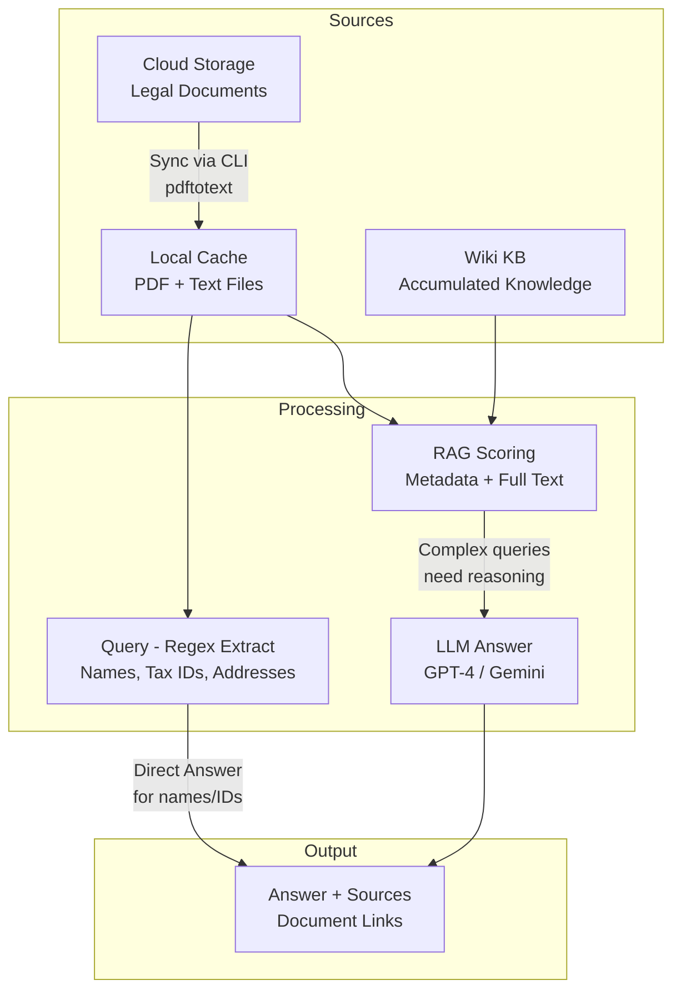
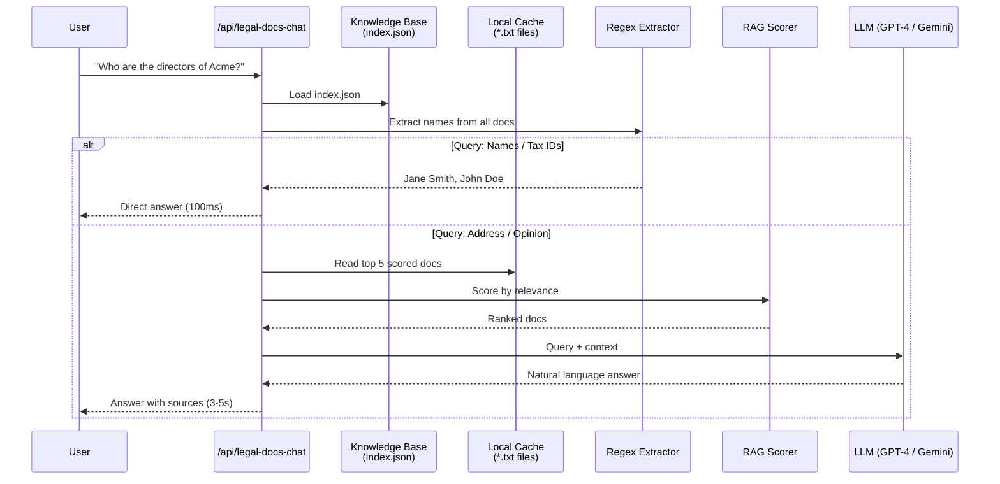

# Building a File Search Knowledge Base — Karpathy Style


> Build an AI assistant that reads your company's legal documents and answers questions like a human legal assistant. Fully offline, local-first, and scalable.

---

**Tags:** `openclaw` `knowledge-base` `rag` `legal-documents` `ai-assistant` `regex` `llm` `karpathy`

## Summary

When someone asks "Who are the directors of Acme Corp?" — you need to answer in 2 seconds across 26 legal documents scattered across cloud storage.

The solution: a **File Search Knowledge Base** inspired by Andrej Karpathy's approach. The idea is simple: cache documents locally for fast loading, find the most relevant ones, and pass them to an LLM. Use regex for structured data (names, tax IDs) for sub-100ms responses, and fall back to RAG + LLM only when reasoning is needed.

## Architecture



**Why two paths?**

| Query Type | Method | Speed |
|---|---|---|
| Person names, tax IDs, registration numbers | Regex directly | ~100ms |
| Addresses, legal opinions, summaries | RAG + LLM | ~3-5s |

## Step 1 — Folder Structure

```
/data/legal-kb/
├── index.json              # Metadata for all documents
├── cache/                  # PDF + text extraction
│   ├── ACME_-_Articles_of_Incorporation.txt
│   ├── BETA_-_Articles_of_Incorporation.txt
│   └── ...
└── wiki/                   # Auto-saved Q&A
    ├── directors_acme.md
    └── tax_ids_all_companies.md
```

`index.json` stores document metadata:

```json
[
  {
    "companyCode": "ACME",
    "documentName": "Articles of Incorporation - Acme Corp",
    "documentType": "Articles",
    "sourceLink": "https://drive.google.com/file/d/EXAMPLE",
    "localTxt": "ACME_-_Articles_of_Incorporation.txt",
    "company": "Acme Corp"
  }
]
```

## Step 2 — Download & Extract Text

Use your preferred CLI tool to download from cloud storage, then `pdftotext` for text extraction:

```bash
# Download from cloud storage
cloud-cli download FILE_ID --output /tmp/document.pdf

# Extract text from PDF
pdftotext -layout /tmp/document.pdf /tmp/document.txt
```

## Step 3 — Regex Extraction (The Karpathy Trick)

For structured data (names, numbers), regex is sufficient and 10x faster than LLM.

```typescript
const NOISE_WORDS = new Set([
  'GENERAL', 'DIRECTOR', 'ADMINISTRATION', 'LEGAL', 'PUBLIC',
  'COMMISSIONER', 'NOTARY', 'TAX', 'CORPORATION'
]);

function isRealName(name: string): boolean {
  const words = name.split(/\s+/);
  const noiseCount = words.filter(w => NOISE_WORDS.has(w.toUpperCase())).length;
  return noiseCount === 0;
}

function extractNames(text: string): string[] {
  const names = new Set<string>();

  // Pattern 1: Ms./Mr. Jane Smith followed by comma/newline
  const p1 = /(?:Ms\.|Mr\.|Mrs\.)\s+([A-Z][A-Za-z.\s]{2,35}?)(?:,|\n)/g;
  let m;
  while ((m = p1.exec(text)) !== null) {
    const clean = m[1].trim();
    if (clean.length > 2 && isRealName(clean)) names.add(clean);
  }

  // Pattern 2: JANE SMITH DIRECTOR
  const p2 = /([A-Z][A-Z.\s]{5,35}?)\s+DIRECTOR/g;
  while ((m = p2.exec(text)) !== null) {
    const clean = m[1].trim();
    if (clean.length > 5 && isRealName(clean)) names.add(clean);
  }

  return [...names];
}
```

**Why not just use LLM for everything?**
- OCR from PDFs produces garbled text with null bytes
- Regex is more robust against noise
- Response time: **100ms** vs **3-5 seconds**

## Step 4 — RAG Scoring (Full Text)

For complex queries, score documents based on metadata and full text content:

```typescript
function scoreRelevance(query: string, entry: KBEntry, fullText: string): number {
  const q = query.toLowerCase();
  const meta = [entry.documentName, entry.companyCode, entry.documentType].join(' ').toLowerCase();
  let score = 0;
  for (const word of q.split(/\s+/).filter(w => w.length > 1)) {
    if (meta.includes(word)) score += 5;      // Metadata match: +5
    if (fullText.includes(word)) score += 3;  // Full text match: +3
  }

  // Bonus if query mentions a company code
  const queryCompany = q.split(/\s+/).find(w =>
    ['acme', 'beta', 'gamma', 'delta'].includes(w)
  );
  if (queryCompany?.toUpperCase() === entry.companyCode) score += 20;

  return score;
}
```

Use **full text**, not just metadata. Addresses, phone numbers, and tax IDs often appear inside the document body.

## Step 5 — Hybrid Answer Assembly

```typescript
async function answerQuery(query: string, index: KBEntry[]) {
  // 1. Try regex direct answer first
  const directAnswer = tryDirectAnswer(query, index);
  if (directAnswer) return { answer: directAnswer, sources: [] };

  // 2. Score and rank documents
  const scored = index.map(e => ({
    entry: e,
    score: scoreRelevance(query, e, readCachedText(e.localTxt))
  })).filter(d => d.score > 0)
     .sort((a, b) => b.score - a.score);

  // 3. Read top 5 documents as context
  const context = scored.slice(0, 5)
    .map(s => readCachedText(s.entry.localTxt))
    .join('\n---\n');

  // 4. Send to LLM
  const answer = await callLLM(query, context);
  return {
    answer,
    sources: scored.slice(0, 3).map(s => s.entry.sourceLink)
  };
}
```

## Step 6 — Sync from Cloud Storage

```bash
#!/bin/bash
# sync-kb.sh — sync all documents from cloud storage

FILE_LIST=$(cat config/document-registry.json | jq -c '.[]')

for row in $FILE_LIST; do
  FILE_ID=$(echo $row | jq -r '.fileId')
  COMPANY=$(echo $row | jq -r '.company')
  DOC_NAME=$(echo $row | jq -r '.docName')

  cloud-cli download "$FILE_ID" --output "/tmp/${COMPANY}_${DOC_NAME}.pdf"
  pdftotext -layout "/tmp/${COMPANY}_${DOC_NAME}.pdf" \
    "/data/legal-kb/cache/${COMPANY}_${DOC_NAME}.txt"

  echo "Synced: $COMPANY - $DOC_NAME"
done
```

```bash
# Cron: Every Sunday at 3 AM
0 3 * * 0 /path/to/sync-kb.sh >> /var/log/sync-kb.log 2>&1
```

## Results

```
Query: "Who are the directors of Acme Corp?"
Answer: Acme Corp directors: Jane Smith, John Doe
Speed: ~150ms (regex only)

Query: "What is the registered address of Beta Inc?"
Answer: 123 Business Park, Suite 8, Jl. Main Street No. 28, Jakarta
Speed: ~3s (RAG + LLM)
```

## Why This Works

1. **Offline-first**: All documents cached locally, no internet dependency at query time
2. **Fast**: Regex for structured data, LLM only for queries that need reasoning
3. **Scalable**: Add documents by editing `index.json`, no code changes needed
4. **Accumulating**: Wiki auto-saves good answers, knowledge base grows over time

## Project Files

| File | Purpose |
|------|---------|
| `sync-kb.py` | Download from cloud, extract text, update index |
| `route.ts` | API route — regex + RAG + LLM answer |
| `index.json` | Document metadata registry |
| `cache/*.txt` | Text extraction from PDF |
| `wiki/*.md` | Auto-saved Q&A knowledge |

## Complete Flow Diagram



---

*Inspired by Andrej Karpathy's file-search pattern. Built with OpenClaw — April 2026*
