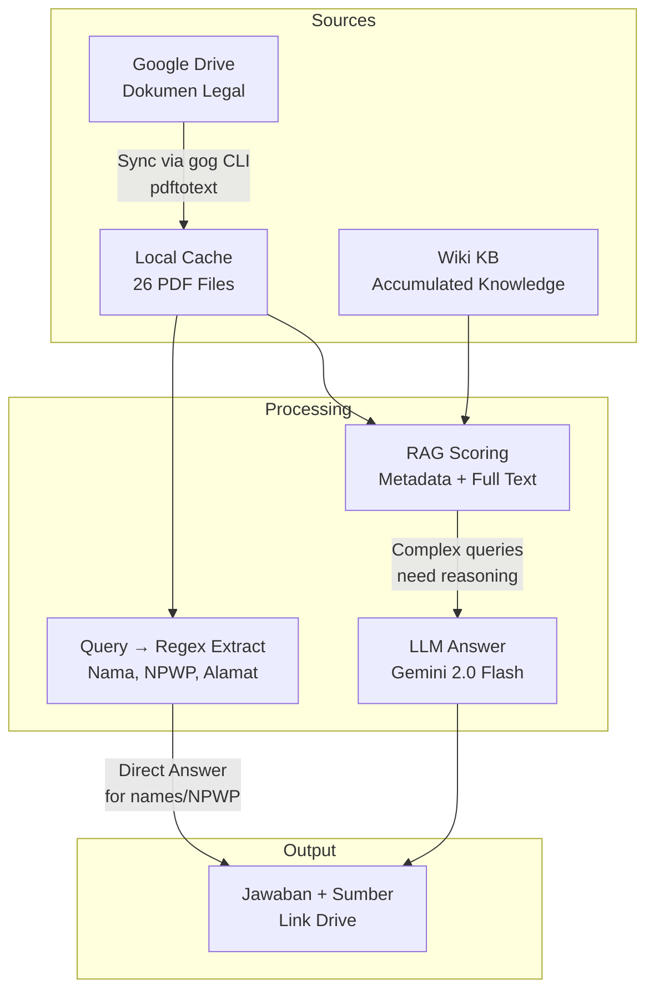
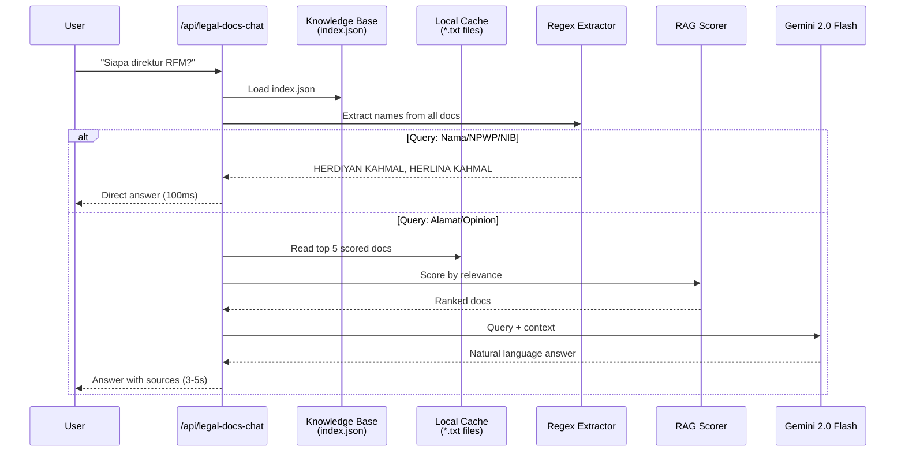

# File Search Knowledge Base — Karpathy Style


> AI yang bisa baca dokumen legal perusahaanmu, jawab pertanyaan kayak ngobrol sama asisten hukum. Semua offline, semua lokal, scalable.

## Overview

Apa yang kamu butuhkan kalau CEO bertanya "Siapa direktur PT UNO Solusi Teknik?" — dan kamu harus jawab dalam 2 detik dari 26 dokumen legal yang tersebar di Google Drive?

Solusinya: **File Search Knowledge Base** — pola yang dikembangin Andrej Karpathy (OpenAI cofounder). Idenya simpel: simpan dokumen di lokal, loading cepat, cari yang paling relevan, kasih ke LLM.

## Architecture



**Kenapa 2 path?**

| Query Type | Method | Speed |
|---|---|---|
| Nama orang, NPWP, NIB | Regex langsung | ~100ms |
| Alamat, legal opinion, ringkasan | RAG + LLM | ~3-5s |

## Step 1 — Folder Structure

```
/data/legal-kb/
├── index.json              # Metadata semua dokumen
├── cache/                  # PDF + text extraction
│   ├── RFM_-_Akta_Pendirian.txt
│   ├── UST_-_Akta_Pendirian.txt
│   └── ...
└── wiki/                   # Auto-saved Q&A
    ├── siapa_direktur_rfm.md
    └── npwp_semua_perusahaan.md
```

`index.json` menyimpan metadata dokumen:

```json
[
  {
    "companyCode": "RFM",
    "namaDokumen": "Akta Pendirian CV Radian Fokus Mandiri",
    "jenisDokumen": "Akta",
    "linkDrive": "https://drive.google.com/file/d/...",
    "localTxt": "RFM_-_Akta_Pendirian.txt",
    "perusahaan": "CV Radian Fokus Mandiri"
  }
]
```

## Step 2 — Download & Extract Text

Pakai `gog` CLI untuk download dari Google Drive, `pdftotext` buat extract text:

```bash
# Download dari Google Drive
gog drive download FILE_ID --output /tmp/akta.pdf

# Extract text dari PDF
pdftotext -layout /tmp/akta.pdf /tmp/akta.txt

# Baca text
cat /tmp/akta.txt
```

Hasilnya kayak gini (udah di-clean dari OCR noise):

```
AKTA PENDIRIAN
CV RADIAN FOKUS MANDIRI
Nomor: 04

Nyonya HERLINA KAHMAL, berikutnya disebut sebagai Pihak Pertama,
Nyonya HERDIYAN KAHMAL, berikutnya disebut sebagai Pihak Kedua,
...
```

## Step 3 — Regex Extraction (The Karpathy Trick)

Ini kunci nya. Untuk data terstruktur (nama, nomor), kita nggak perlu LLM — regex udah cukup dan 10x lebih cepat.

```typescript
// Noise words yang bukan nama orang
const NOISE_WORDS = new Set([
  'JENDERAL', 'DIREKTUR', 'ADMINISTRASI', 'HUKUM', 'UMUM',
  'KOMISARIS', 'NOTARIS', 'PAJAK', 'INDONESIA'
]);

function isRealName(name: string): boolean {
  const words = name.split(/\s+/);
  const noiseCount = words.filter(w => NOISE_WORDS.has(w.toUpperCase())).length;
  return noiseCount === 0;
}

// Extract nama dari text
function extractNames(text: string): string[] {
  const names = new Set<string>();
  
  // Pattern 1: Nyonya/Tuan HERLINA KAHMAL
  const p1 = /(?:Nyonya|Nona|Tuan)\s+([A-Z][A-Za-z.\s]{2,35}?)(?:,|\n|Warga)/g;
  let m;
  while ((m = p1.exec(text)) !== null) {
    const clean = m[1].trim();
    if (clean.length > 2 && isRealName(clean)) names.add(clean);
  }
  
  // Pattern 2: MARTHA JUNITA PASARIBU DIREKTUR
  const p2 = /([A-Z][A-Z.\s]{5,35}?)\s+DIREKTUR/g;
  while ((m = p2.exec(text)) !== null) {
    const clean = m[1].trim();
    if (clean.length > 5 && isRealName(clean)) names.add(clean);
  }
  
  return [...names];
}
```

**Kenapa nggak pakai LLM aja?**
- OCR di PDF menghasilkan text yang garbled: `H\x00E\x01R\x00L\x00I\x00N\x00A`
- Regex lebih robust terhadap noise
- Response time: **100ms** vs **3-5 detik**

## Step 4 — RAG Scoring (Full Text)

Untuk query kompleks, scoring dokumen dari 2 faktor:

```typescript
function scoreRelevance(query: string, entry: KBEntry, fullText: string): number {
  const q = query.toLowerCase();
  
  // 1. Metadata match (filename, company code, doc type)
  const meta = [entry.namaDokumen, entry.companyCode, entry.jenisDokumen].join(' ').toLowerCase();
  let score = 0;
  for (const word of q.split(/\s+/).filter(w => w.length > 1)) {
    if (meta.includes(word)) score += 5;      // Metadata match: +5
    if (fullText.includes(word)) score += 3;  // Full text match: +3
  }
  
  // 2. Bonus kalau query mention company code
  const queryCompany = q.split(/\s+/).find(w => ['rfm','ust','rfs','reforel'].includes(w));
  if (queryCompany?.toUpperCase() === entry.companyCode) score += 20;
  
  return score;
}
```

Pakai **full text**, bukan cuma metadata. Karena alamat, nomor telepon, NPWP sering muncul di dalam dokumen, bukan di filename.

## Step 5 — Hybrid Answer Assembly

```typescript
async function answerQuery(query: string, index: KBEntry[]) {
  
  // 1. Coba regex direct answer dulu (untuk nama/NPWP/NIB)
  const directAnswer = tryDirectAnswer(query, index);
  if (directAnswer) return { answer: directAnswer, sources: [] };
  
  // 2. Scoring + rank dokumen
  const scored = index.map(e => ({
    entry: e,
    score: scoreRelevance(query, e, readCachedText(e.localTxt))
  })).filter(d => d.score > 0)
     .sort((a, b) => b.score - a.score);
  
  // 3. Baca top 5 dokumen
  const context = scored.slice(0, 5).map(s => readCachedText(s.entry.localTxt)).join('\n---\n');
  
  // 4. Kirim ke Gemini
  const answer = await callGemini(query, context);
  return { answer, sources: scored.slice(0, 3).map(s => s.entry.linkDrive) };
}
```

## Step 6 — Sync dari Google Drive

```bash
#!/bin/bash
# sync-kb.sh — sync semua dokumen dari Google Drive

GOG_ACCOUNT="fanani@cvrfm.com"
export GOG_KEYRING_PASSWORD="..."

# Ambil daftar file dari Google Sheets (metadata)
FILE_LIST=$(curl -s "https://sheets.googleapis.com/.../values/A:Z" | jq -r '.rows[]')

for row in $FILE_LIST; do
  FILE_ID=$(echo $row | jq -r '.fileId')
  COMPANY=$(echo $row | jq -r '.company')
  DOC_NAME=$(echo $row | jq -r '.docName')
  
  # Download + extract
  gog drive download $FILE_ID --output "/tmp/${COMPANY}_${DOC_NAME}.pdf"
  pdftotext -layout "/tmp/${COMPANY}_${DOC_NAME}.pdf" \
    "/data/legal-kb/cache/${COMPANY}_${DOC_NAME}.txt"
  
  echo "Synced: $COMPANY - $DOC_NAME"
done
```

Jadwalkan dengan cron:

```bash
# Every Sunday at 3 AM
0 3 * * 0 /root/scripts/sync-kb.sh >> /var/log/sync-kb.log 2>&1
```

## Results

```
Query: "Siapa direktur RFM?"
Answer: RFM - CV Radian Fokus Mandiri: HERLINA KAHMAL, HERDIYAN KAHMAL
Speed: ~150ms (regex only)

Query: "Alamat kantor UST?"
Answer: Gedung Graha.Paramita Lt. 8, Jl. Jend. Sudirman No. 28, Jakarta Selatan
Speed: ~3s (RAG + LLM)
```

## Why This Works

1. **Offline-first**: Semua dokumen di lokal, nggak tergantung dari internet
2. **Fast**: Regex untuk data terstruktur, LLM cuma untuk yang butuh reasoning
3. **Scalable**: Tambah dokumen = edit `index.json`, nggak perlu ubah code
4. **Accumulating**: Wiki auto-saves jawaban bagus, knowledge base grown over time

## Files

| File | Purpose |
|------|---------|
| `sync-kb.py` | Download dari Drive, extract text, update index |
| `route.ts` | API route — regex + RAG + Gemini answer |
| `index.json` | Metadata semua dokumen |
| `cache/*.txt` | Text extraction dari PDF |
| `wiki/*.md` | Auto-saved Q&A |

## Setup di VPS Kamu

```bash
# 1. Clone repo
cd /var/www/radit-dashboard
mkdir -p data/legal-kb/cache data/legal-kb/wiki

# 2. Buat index.json (sesuaikan dengan dokumen kamu)
# Lihat contoh di atas

# 3. Jalankan sync
python3 sync-kb.py

# 4. Test
curl -X POST http://localhost:3002/api/legal-docs-chat \
  -H "Content-Type: application/json" \
  -d '{"messages":[{"role":"user","content":"Siapa direktur?"}]}'
```

## Diagram Alur Lengkap



---

*Tutorial ini dibuat otomatis dari development session Radit — 8 April 2026*
