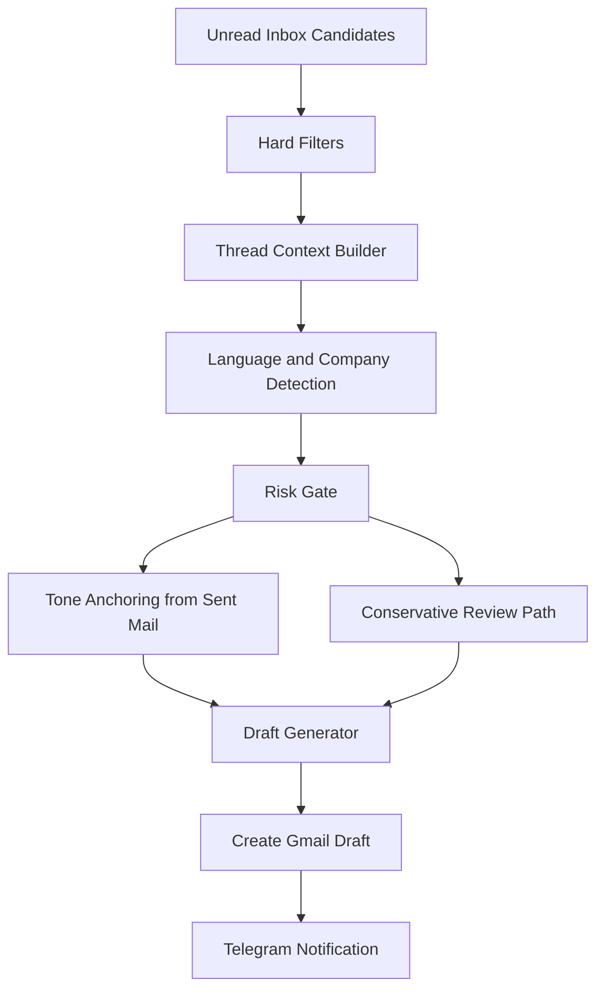
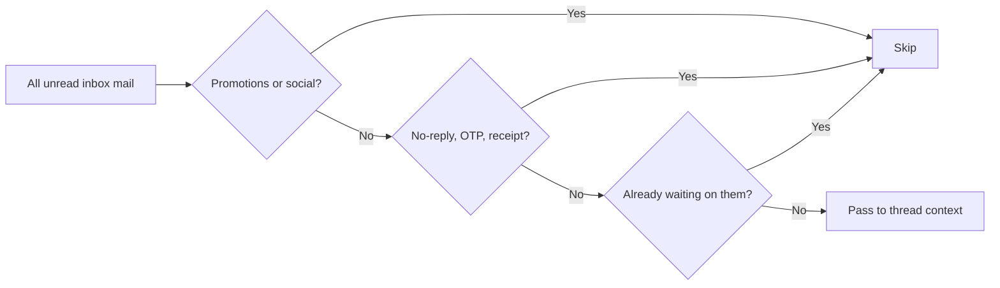
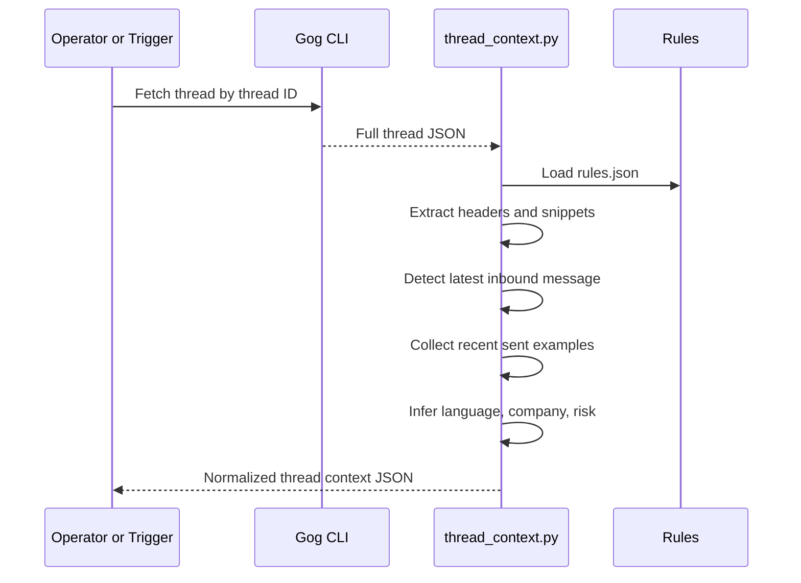
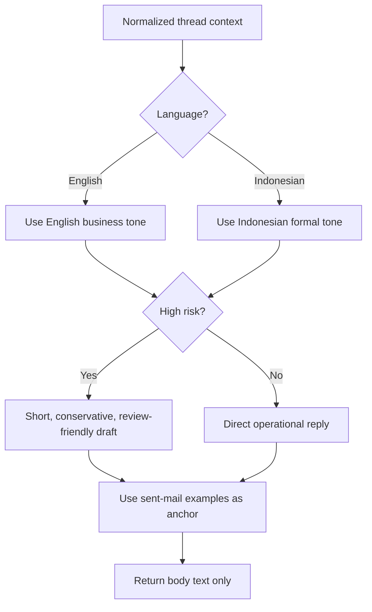
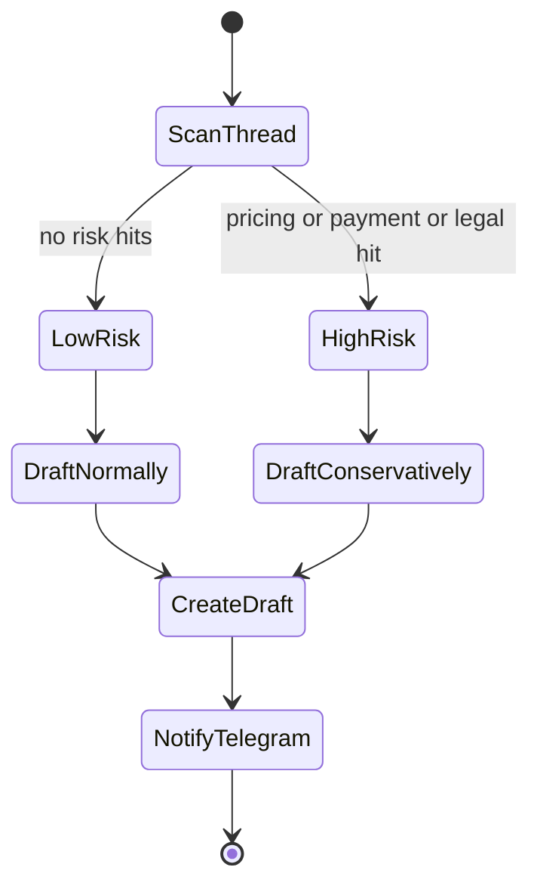
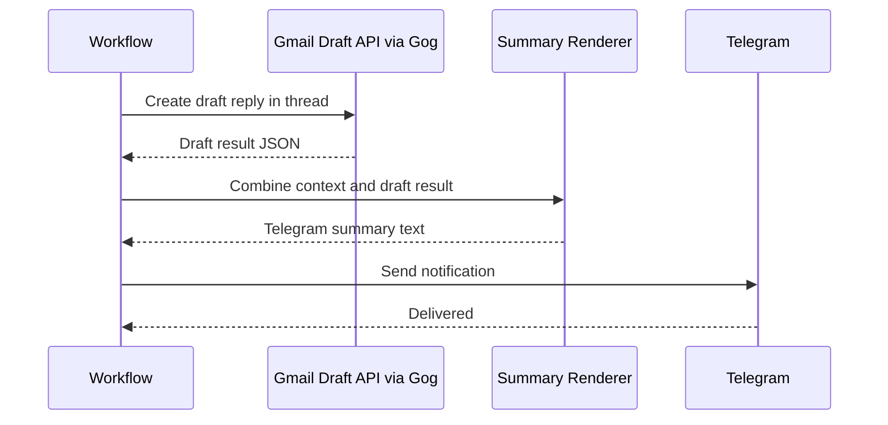
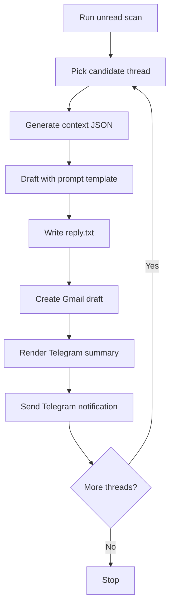

# How to Build a Gmail AI Draft Workflow That Writes in Your Real Voice
## A practical OpenClaw-style system for filtering inbox noise, reading thread context, matching tone, drafting safely, and notifying you on Telegram

> **Estimated reading time:** 28 to 34 minutes  
> **Difficulty:** Intermediate  
> **Last updated:** April 2026  
> **Best for:** founders, operators, assistants, and teams who want faster email drafting without sounding like a bot

---


## Before We Start

This is the technical version of the tutorial.

If you want the friendlier mixed Indonesian and English walkthrough, read the companion blog post here:  
**https://blog.fanani.co/tech/gmail-ai-draft-real-voice/**

If you want a VPS for OpenClaw, QwenPaw, or your own automation stack, use the affiliate link here:  
**https://blog.fanani.co/sumopod**

One more important note. This workflow is **draft only**. It does not auto-send.

That is not a missing feature. That is the design.

For business email, the expensive mistakes usually happen at the sending layer, not the drafting layer. So this guide is built around one principle: **move fast on preparation, stay careful on commitment**.

---

## Why Most AI Email Workflows Feel Wrong

A lot of AI email demos look impressive for thirty seconds.

Then you read the actual output.

It sounds like a generic assistant. The tone is too polished, too soft, too symmetrical, and strangely detached from how a real person writes under real business pressure. Worse, many setups look only at the latest message, ignore the thread, miss the language context, and happily invent things that should never be invented, such as prices, delivery timelines, payment status, or legal commitments.

That is exactly what we do **not** want.

The goal here is more grounded:

1. **Filter inbox noise before spending model tokens**
2. **Read the thread, not just one message**
3. **Infer language and company context**
4. **Use sent-mail style as the tone anchor**
5. **Draft in the same thread**
6. **Alert the operator on Telegram after draft creation**
7. **Keep high-risk emails conservative**

If you get those seven things right, the system stops feeling like a toy and starts feeling operational.

---

## What We Are Building

By the end of this tutorial, you will have a workflow that can:

- pull unread inbox candidates with **Gog CLI**
- skip obvious noise such as promotions, social, OTP, and no-reply mail
- fetch full thread context instead of guessing from one snippet
- classify **language**, **risk**, and **company context**
- anchor the tone using recent sent replies from the same account
- generate a reply body that sounds like the owner, not like a default LLM demo
- create a **Gmail draft reply in the same thread**
- send a **Telegram notification** after every successful draft

This is the high-level system shape.



The important thing is not the number of steps. The important thing is the order.

If you draft first and classify later, you will get faster garbage.

---

## The Real Stack Behind This Workflow

This tutorial is based on a working skill structure inside the OpenClaw workspace:

- `skills/gmail-ai-draft/SKILL.md`
- `skills/gmail-ai-draft/config/rules.json`
- `skills/gmail-ai-draft/references/sent-tone-notes.md`
- `skills/gmail-ai-draft/references/prompt-template.md`
- `skills/gmail-ai-draft/scripts/list-unread.sh`
- `skills/gmail-ai-draft/scripts/thread_context.py`
- `skills/gmail-ai-draft/scripts/create_draft.sh`
- `skills/gmail-ai-draft/scripts/render_telegram_summary.py`

The Gmail operations use **Gog CLI**. The orchestration logic is OpenClaw-native. Telegram notification happens after draft creation. No extra Gmail AI labels are added by default.

That last decision matters more than it sounds. A lot of people love inventing labels like `AI/Draft` or `AI/Needs Review`. In practice, that often creates more mailbox clutter than value. Gmail Drafts already exists. Your existing labels already mean something. Do not create another taxonomy unless you truly need one.

---

## Prerequisites

Keep the list short.

You need:

- a working Gmail or Google Workspace account
- **Gog CLI** authenticated for that account
- an OpenClaw environment or equivalent orchestration layer
- a model you trust for drafting
- Telegram access if you want review notifications on your phone

You do **not** need:

- n8n as the core runtime
- auto-send
- a complicated vector database for email drafting
- a giant CRM before you can get value from this pattern

If you want the Gmail CLI basics first, see this related tutorial:  
**https://github.com/fanani-radian/openclaw-sumopod/blob/main/tutorials/gog-cli-google-workspace.md**

---

## Step 1: Start With Hard Filters, Not AI

This is the first place where people waste time.

They send every unread message to a model.

That is lazy architecture.

Some messages should never reach the drafting layer at all:

- newsletters
- social feed mail
- OTPs
- receipts
- pure notifications
- no-reply senders
- threads where you already replied and are waiting on them

The point of filtering is not just saving tokens. It is protecting the workflow from bad entry points.

The current unread listing helper is intentionally boring:

```bash
#!/usr/bin/env bash
set -euo pipefail

QUERY="${1:-in:inbox is:unread -category:promotions -category:social}"
MAX="${MAX:-10}"

export GOG_ACCOUNT="${GOG_ACCOUNT:-fanani@cvrfm.com}"
/usr/local/bin/gog gmail search "$QUERY" --max="$MAX" -j --results-only
```

That script does not pretend to be smart. It just narrows the candidate set.

And that is exactly what it should do.

Here is the filter funnel.



If you want to get fancy later, fine. But get this right first.

---

## Step 2: Read the Thread, Not Just the Last Email

This is the biggest quality jump in the whole system.

Most weak auto-draft workflows read one message body, then improvise.

Real email does not work like that.

A thread contains:

- previous promises
- pricing context
- language preference
- who introduced whom
- whether the conversation is formal or relaxed
- whether the last move came from you or from them

That is why the workflow uses `thread_context.py` to normalize the thread into structured JSON.

The script reads the full Gmail thread, extracts headers, keeps recent messages, identifies the latest inbound message, and collects the last few sent examples as tone hints.

The sequence looks like this.



A simplified output shape looks like this:

```json
{
  "thread_id": "19cac5b821e40d61",
  "message_count": 7,
  "latest_inbound_message_id": "19db7786677e2e88",
  "sender": "Anang Susila <anang.susila@pertamina.com>",
  "subject": "RE: [EXTERNAL] Re: RFI 02032026 Part Air Compressor Ingersolrand (MRF 029)",
  "language": "id",
  "company_context": "rfm",
  "risk": "high",
  "risk_hits": ["quotation"],
  "messages": [...],
  "recent_sent_examples": [...]
}
```

That structure is already enough to massively improve reply quality.

Notice what it does **not** do. It does not try to summarize everything into poetry. It preserves operational context.

That is the right bias.

---

## Step 3: Infer Company Context Before You Draft

Not every mailbox message belongs to the same identity.

That matters when one person operates across multiple companies, projects, or business units.

The current context builder uses simple keyword mapping to infer a company context such as:

- `rfm`
- `ust`
- `reforel`
- `rfs`
- `personal`

That looks almost too simple, but it is useful because the company context affects:

- signature choice
- reply formality
- whether a pricing or delivery request is normal
- which side of the business the thread belongs to

If you skip this step, the model might draft a technically correct email in the wrong business identity.

That is the sort of mistake that feels small in a demo and embarrassing in production.

---

## Step 4: Use Sent Mail as the Tone Source of Truth

This is the soul of the workflow.

The drafting system should not learn tone from your blog, from public writing, or from generic “professional email style” prompts.

It should learn from your **actual sent mail**.

The observed sent-mail pattern in this workflow is simple:

- formal business tone
- direct and calm
- concise by default
- English for English business and support threads
- Indonesian for local vendor and client threads
- formal openers such as `Dear Pak ...` or `Dear Xendit Team`
- closers such as `Regards,` or `Best Regards,`
- zero fake warmth
- zero invented promises

That is more useful than any abstract style guide.

Here is the tone routing logic.



This is also why the prompt template says things like:

- follow Fanani's real sent-mail style
- do not invent prices, delivery time, legal positions, payment status, or commitments
- if context is missing, ask a short clarifying question instead
- return only the email body text

That prompt is not trying to make the model sound elegant. It is trying to make the model stay in bounds.

That is a better goal.

Here is the kind of minimal prompt skeleton that works well in practice:

```text
You are drafting an email reply for Zainul Fanani.

Rules:
- This is email, not blog.
- Follow the real sent-mail style.
- Be direct, calm, and professional.
- Use Indonesian unless the thread is clearly in English.
- Use a formal opener that matches the recipient context.
- Do not invent prices, delivery time, legal positions, payment status, or commitments.
- If key information is missing, ask one short clarifying question.
- Return only the email body text.
```

Then pass the normalized thread JSON as the user payload.

That combination does something subtle but important. It limits the model's surface area. Instead of asking for “a helpful response”, you are asking for a bounded artifact inside a known communication format.

If you are serious about quality, that distinction matters.

---

## Step 5: Add a Risk Gate Before Draft Creation

If a thread includes pricing, quotation, payment, transfer, invoice, contract, delivery, dispute, or penalty language, it should be treated as high-risk.

That does **not** mean the workflow stops.

It means the workflow changes posture.

High-risk emails should usually produce:

- a draft only
- a conservative tone
- fewer claims
- no invented facts
- an explicit operator review expectation

The risk gate in `rules.json` is intentionally keyword-based right now. You can improve that later, but even a small list already catches the most expensive categories.



This is one of those places where “simple but explicit” beats “smart but vague”.

If you later replace keyword risk with a stronger classifier, good. But do not remove the operator review mindset.

---

## Step 6: Create the Draft in the Same Gmail Thread

Once the reply body exists, the workflow creates a Gmail draft in the same thread using Gog CLI.

That detail matters.

A lot of cheap workflows generate text but do not actually place it where the human can review it naturally. Then the operator has to copy-paste from another system, which kills the convenience.

The current draft creation wrapper looks like this:

```bash
#!/usr/bin/env bash
set -euo pipefail

/usr/local/bin/gog gmail drafts create --account "$GOG_ACCOUNT" -j --results-only \
  --to "$TO" \
  --subject "$SUBJECT" \
  --body-file "$BODY_FILE" \
  --reply-to-message-id "$REPLY_TO_MESSAGE_ID"
```

Example usage:

```bash
bash skills/gmail-ai-draft/scripts/create_draft.sh \
  --reply-to-message-id 19db7786677e2e88 \
  --to "anang.susila@pertamina.com" \
  --subject "Re: [EXTERNAL] Re: RFI 02032026 Part Air Compressor Ingersolrand (MRF 029)" \
  --body-file /tmp/reply.txt
```

That gives you a real Gmail draft that sits exactly where it should, inside the thread.

Not in a side dashboard. Not in an orphaned note. In Gmail.

That is what makes the workflow actually usable.


---

## Step 7: Notify the Operator on Telegram After Every Draft

This is a non-negotiable design choice.

If the system creates a draft and then stays silent, the workflow becomes invisible. Invisible automation is often where trust goes to die.

After every successful draft creation, the workflow renders a short Telegram-ready summary with:

- sender
- subject
- language
- risk level
- draft ID
- review recommendation when high-risk

The current summary renderer is intentionally small. Good.

Operators do not need a novel. They need signal.



Example notification fields:

- From: sender name and email
- Subject: latest thread subject
- Language: EN or ID
- Risk: LOW or HIGH
- Draft ID: created draft identifier
- High-risk note: review recommended before sending

That tiny notification loop closes the trust gap.


---

## Step 8: Put the Workflow Together

At this point the building blocks are clear.

Now you need a runner that stitches them together.

A practical manual flow looks like this:

1. list unread candidates
2. pick a thread worth replying to
3. build normalized thread context
4. pass that context into your drafting prompt
5. save the returned email body to a temp file
6. create the Gmail draft in-thread
7. render and send Telegram summary

The operational loop looks like this.



If you want a pseudo-runner, here is a simple version:

```bash
#!/usr/bin/env bash
set -euo pipefail

THREAD_ID="$1"
CTX="/tmp/thread-context.json"
BODY="/tmp/reply.txt"
DRAFT="/tmp/draft-result.json"

python3 skills/gmail-ai-draft/scripts/thread_context.py --thread-id "$THREAD_ID" --out "$CTX"

# At this stage your assistant or model generates BODY from CTX + prompt-template.md
# Save only the final email body text into $BODY

bash skills/gmail-ai-draft/scripts/create_draft.sh \
  --reply-to-message-id "$(python3 -c 'import json;print(json.load(open("/tmp/thread-context.json"))["latest_inbound_message_id"])')" \
  --to "recipient@example.com" \
  --subject "Re: Original Subject" \
  --body-file "$BODY" > "$DRAFT"

python3 skills/gmail-ai-draft/scripts/render_telegram_summary.py \
  --context "$CTX" \
  --draft "$DRAFT"
```

This is enough for v1.

Do not wait for a perfect orchestrator before shipping something useful.

---

## Step 9: How to Test This Without Polluting Your Inbox

This part deserves more attention than most tutorials give it.

When people test email automation, they often mix prototype code, real threads, and real mailboxes without a clean testing habit. Then one accidental draft or one accidental send makes the whole project feel unsafe.

A better testing sequence looks like this:

1. start with `list-unread.sh` and inspect results only
2. run `thread_context.py` on one real thread and inspect the JSON carefully
3. verify that `latest_inbound_message_id`, `language`, `company_context`, and `risk` all make sense
4. generate a draft body into a temp file
5. create exactly one draft in Gmail
6. check that it landed in the correct thread
7. delete the draft if you were only testing mechanics
8. only then move to semi-automated runs

That order protects you from the two classic mistakes:

- wrong thread targeting
- false confidence from a draft body that was never checked in Gmail itself

I would also test on at least three types of threads:

- an English support or business thread
- an Indonesian vendor or client thread
- a high-risk pricing or delivery thread

If the workflow behaves well across those three, you already know a lot.

---

## Step 10: Common Failure Modes

Here are the mistakes I would avoid immediately.

### 1. Letting the model see only one message
That leads to broken continuity and bad promises.

### 2. Learning tone from generic prompts
That is how you get robotic “professional” drafts.

### 3. Auto-sending high-risk replies
Terrible idea. Draft only.

### 4. Skipping language detection
If the sender writes in Indonesian and you reply in stiff English, the workflow already lost.

### 5. Ignoring company context
One operator can represent multiple business identities. The draft must know which one applies.

### 6. Sending every unread email to the model
That is how you waste tokens on receipts and junk.

### 7. Hiding results inside an internal dashboard
Drafts belong in Gmail. Review alerts belong somewhere visible, like Telegram.

---

## Step 11: Where to Improve This Next

Once the base workflow is stable, the next upgrades I would consider are:

- better no-reply detection from sender reputation and thread patterns
- stronger risk classification beyond keywords
- signature selection by company context
- optional calendar availability check for meeting requests
- canned response library for repeat cases
- human feedback loop that remembers accepted edits
- priority routing by VIP senders or domains

But I would only build those **after** the current version is proving useful.

The trap with email automation is obvious. People keep polishing the intelligence layer while ignoring operator trust.

Trust comes from predictable behavior, not clever demos.

---

## One More Practical Recommendation: Keep the Human Review Fast

The whole point of draft automation is not to create a second inbox that needs management.

So when you add review to the loop, keep it lightweight:

- Telegram for the alert
- Gmail for the draft
- no extra dashboards unless they solve a real pain
- no giant approval form unless you are in a regulated environment

In other words, the review layer should feel like a quick glance and a quick edit, not like a mini compliance workflow.

The reason this matters is simple. The more friction you add after draft creation, the less likely the system is to be used consistently. And if it is not used consistently, it does not matter how elegant your classifier or prompt stack is.

Good automation should reduce mental load, not relocate it.

---

## Final Thoughts

A good AI email workflow should not try to replace judgment.

It should remove the boring part of judgment.

That is why this system works:

- it filters first
- reads the whole thread
- respects language and company context
- imitates real sent-mail tone instead of blog voice
- drafts in-thread
- alerts the operator after every draft
- stays conservative when risk is high

That combination is what makes it feel proven instead of gimmicky.

If you want the easier mixed Indonesian and English walkthrough, read the companion blog version here:  
**https://blog.fanani.co/tech/gmail-ai-draft-real-voice/**

If you want a VPS for this kind of stack and want to support the work, use the affiliate link here:  
**https://blog.fanani.co/sumopod**

Build the draft layer first. Keep the send button human. That is the smart split.
