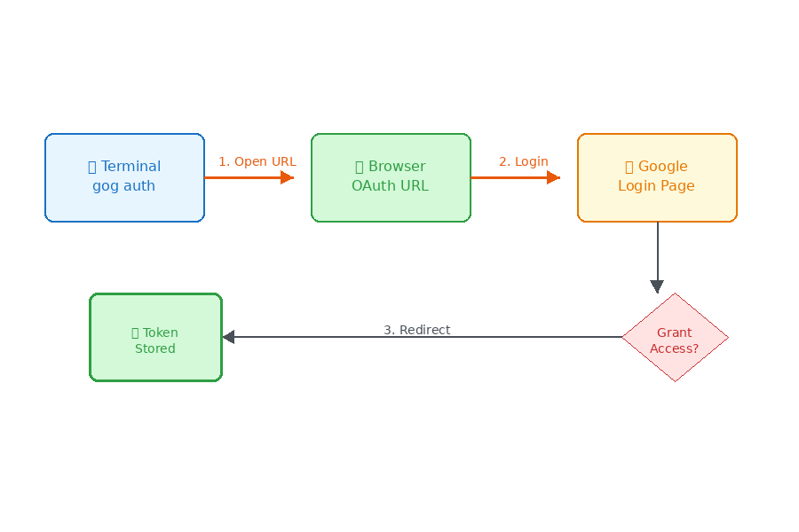
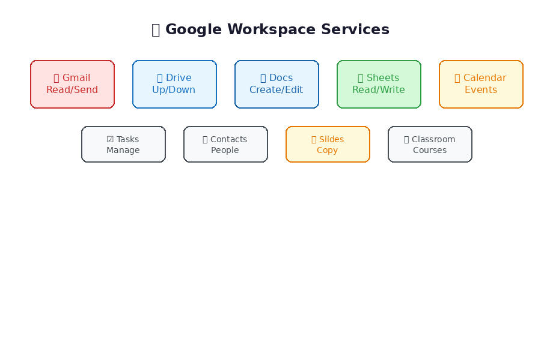

# OpenClaw + gog CLI Tutorial

Connect OpenClaw to Google Workspace (Gmail, Drive, Docs, Sheets, Calendar) via gog CLI.

## Overview

This tutorial shows how to integrate Google Workspace services into your OpenClaw workflow using the `gog` CLI tool.

## What You'll Learn

- Install and configure gog CLI
- Authenticate with Google OAuth
- Access Gmail, Drive, Docs, Sheets, Calendar
- Build automation scripts

## Example Output

Here's what you can do after setup:

### OAuth Flow

*Authentication flow from terminal to Google and back*

### Available Services

*All Google Workspace services accessible via gog CLI*

## Prerequisites

- Google Account (Gmail)
- OpenClaw installed
- Terminal access

## Step 1: Install gog CLI

### Download Binary

```bash
# Download latest release
curl -fsSL https://github.com/rubiojr/gog/releases/latest/download/gog-linux-amd64 \
  -o /usr/local/bin/gog

# Make executable
chmod +x /usr/local/bin/gog

# Verify installation
gog version
```

**Expected Output:**
```
v0.9.0 (99d9575 2026-01-22T04:15:12Z)
```

## Step 2: Google Cloud Setup

### Create OAuth Client

```
┌─────────────────────────────────────────┐
│  1. Go to Google Cloud Console          │
│     console.cloud.google.com            │
│                                         │
│  2. Create New Project                  │
│     → "My OpenClaw Project"             │
│                                         │
│  3. Enable APIs:                        │
│     ☑ Gmail API                        │
│     ☑ Drive API                        │
│     ☑ Docs API                         │
│     ☑ Sheets API                       │
│     ☑ Calendar API                     │
│                                         │
│  4. Credentials → OAuth Client          │
│     → "Desktop App"                     │
│     → Download JSON                     │
└─────────────────────────────────────────┘
```

### Required Scopes

Add these scopes in OAuth consent screen:

```
https://www.googleapis.com/auth/gmail.modify
https://www.googleapis.com/auth/drive
https://www.googleapis.com/auth/calendar
https://www.googleapis.com/auth/tasks
https://www.googleapis.com/auth/documents
https://www.googleapis.com/auth/spreadsheets
https://www.googleapis.com/auth/contacts
```

## Step 3: Authenticate

### First Login

```bash
# Set keyring password (for secure token storage)
export GOG_KEYRING_PASSWORD="your-secure-password"

# Add account
gog auth add your-email@gmail.com
```

**Flow Diagram:**

```
┌──────────────┐     ┌──────────────┐     ┌──────────────┐
│   Terminal   │────▶│  Browser     │────▶│  Google      │
│   gog auth   │     │  OAuth URL   │     │  Login       │
└──────────────┘     └──────────────┘     └──────┬───────┘
                                                  │
                       ┌──────────────────────────┘
                       ▼
              ┌────────────────┐
              │ Grant Access   │
              │ to OpenClaw    │
              └───────┬────────┘
                      │
        ┌─────────────┘
        ▼
┌──────────────┐     ┌──────────────┐
│   Token      │◀────│   Redirect   │
│   Stored     │     │   to CLI     │
└──────────────┘     └──────────────┘
```

**What Happens:**
1. CLI opens browser with Google OAuth URL
2. You login and grant permissions
3. Google redirects back to CLI
4. Token securely stored in keyring

### Verify Auth

```bash
# Check auth status
gog auth status

# List available services
gog auth services

# List connected accounts
gog auth list
```

## Step 4: Quick Start Examples

### 4.1 Gmail - Check Inbox

```bash
# Set env vars
export GOG_KEYRING_PASSWORD="your-password"
export GOG_ACCOUNT="your-email@gmail.com"

# Search unread emails
gog gmail search "is:unread" --max=5

# Send email
gog gmail send \
  --to "recipient@example.com" \
  --subject "Hello from OpenClaw" \
  --body "This email was sent via CLI"
```

### 4.2 Drive - List Files

```bash
# List files
gog drive ls --max=10

# Create folder
gog drive mkdir "OpenClaw Documents"

# Upload file
gog drive upload report.pdf --name "Q1 Report"

# Download file
gog drive download FILE_ID
```

### 4.3 Sheets - Read Data

```bash
# Read range
gog sheets get SPREADSHEET_ID "A1:D10"

# Update cell
gog sheets update SPREADSHEET_ID "A1" "New Value"

# Append row
gog sheets append SPREADSHEET_ID "Sheet1!A1" "col1,col2,col3"
```

### 4.4 Docs - Create Document

```bash
# Create new doc
gog docs create "My Document"

# Get content
gog docs get DOC_ID

# Append text
gog docs update DOC_ID --append "New paragraph here"
```

### 4.5 Calendar - Check Events

```bash
# List today's events
gog calendar list --today

# Create event
gog calendar create "Team Meeting" \
  --start "2026-03-08T14:00:00" \
  --duration 60m \
  --description "Weekly sync"
```

## Step 5: Automation Scripts

### Daily Email Summary Script

```bash
#!/bin/bash
# daily-email-check.sh

export GOG_KEYRING_PASSWORD="your-password"
export GOG_ACCOUNT="your-email@gmail.com"

# Count unread
UNREAD=$(gog gmail search "is:unread" --json | jq '. | length')

# Get today's events
echo "📧 Unread emails: $UNREAD"
echo "📅 Today's events:"
gog calendar list --today
```

### Backup to Drive Script

```bash
#!/bin/bash
# backup-to-drive.sh

export GOG_KEYRING_PASSWORD="your-password"
export GOG_ACCOUNT="your-email@gmail.com"

# Create timestamped backup folder
DATE=$(date +%Y-%m-%d)
gog drive mkdir "Backup-$DATE"

# Upload files
for file in /path/to/backup/*; do
    gog drive upload "$file" --name "$(basename $file)"
done
```

## Architecture Flow

```
┌─────────────────────────────────────────────────────────┐
│                    OpenClaw Agent                       │
│                    (Radit/Raka/Rama/Rafi)              │
└────────────────────┬────────────────────────────────────┘
                     │
                     ▼
┌─────────────────────────────────────────────────────────┐
│                    gog CLI Tool                         │
│  ┌─────────┐ ┌─────────┐ ┌─────────┐ ┌──────────────┐ │
│  │  Gmail  │ │  Drive  │ │  Sheets │ │   Calendar   │ │
│  └────┬────┘ └────┬────┘ └────┬────┘ └──────┬───────┘ │
└───────┼───────────┼───────────┼────────────┼──────────┘
        │           │           │            │
        └───────────┴───────────┴────────────┘
                     │
                     ▼
┌─────────────────────────────────────────────────────────┐
│              Google OAuth 2.0 Server                    │
│              (Token Exchange)                           │
└────────────────────┬────────────────────────────────────┘
                     │
        ┌────────────┼────────────┐
        ▼            ▼            ▼
  ┌─────────┐  ┌─────────┐  ┌─────────┐
  │ Gmail   │  │ Drive   │  │ Sheets  │
  │  API    │  │  API    │  │  API    │
  └─────────┘  └─────────┘  └─────────┘
```

## Security Best Practices

### 1. Secure Keyring Password

```bash
# Store in environment file
echo 'export GOG_KEYRING_PASSWORD="your-secure-password"' >> ~/.bashrc
source ~/.bashrc
```

### 2. Use Dedicated Service Account

For production automation, use Google Service Account instead of personal OAuth:

```bash
# Download service account JSON
gog auth service-account add service-account.json
```

### 3. Token Rotation

```bash
# Refresh token periodically
gog auth remove your-email@gmail.com
gog auth add your-email@gmail.com
```

## Troubleshooting

### "401 Unauthorized" Error

```bash
# Re-authenticate
gog auth remove your-email@gmail.com
gog auth add your-email@gmail.com
```

### "Scope not authorized"

Add missing scope in Google Cloud Console:
1. APIs & Services → Credentials
2. OAuth 2.0 Client IDs → Edit
3. Add required scope
4. Save and re-authenticate

### "Keyring locked"

```bash
# Set keyring password
export GOG_KEYRING_PASSWORD="your-password"

# Or configure keyring backend
gog auth keyring file
```

## Use Cases

### 1. Email Automation
- Auto-forward invoices to accounting
- Daily email digest
- Auto-respond to specific senders

### 2. Document Management
- Backup important files to Drive
- Auto-generate reports in Docs
- Archive old emails

### 3. Data Tracking
- Log data to Sheets
- Generate charts from Sheets
- Export Sheets to CSV

### 4. Calendar Integration
- Schedule meetings from CLI
- Check availability
- Create recurring reminders

### 5. Workflow Automation
- Email → Drive → Sheets pipeline
- Calendar → Task creation
- Document approval workflows

## Advanced: Multi-Account Setup

```bash
# Add multiple accounts
gog auth add personal@gmail.com
gog auth add work@company.com

# Switch accounts
export GOG_ACCOUNT="work@company.com"
gog gmail search "from:boss"

export GOG_ACCOUNT="personal@gmail.com"
gog drive ls
```

## Summary

| Feature | Command | Status |
|---------|---------|--------|
| Gmail Read | `gog gmail search` | ✅ |
| Gmail Send | `gog gmail send` | ✅ |
| Drive List | `gog drive ls` | ✅ |
| Drive Upload | `gog drive upload` | ✅ |
| Docs Create | `gog docs create` | ✅ |
| Docs Read | `gog docs get` | ✅ |
| Sheets Read | `gog sheets get` | ✅ |
| Sheets Write | `gog sheets update` | ✅ |
| Calendar List | `gog calendar list` | ✅ |
| Calendar Create | `gog calendar create` | ✅ |
| Tasks | `gog tasks list` | ✅ |
| Contacts | `gog contacts list` | ✅ |

## Next Steps

1. Install gog CLI
2. Create Google Cloud project
3. Authenticate your account
4. Try quick start examples
5. Build your first automation script

## Resources

- [gog CLI GitHub](https://github.com/rubiojr/gog)
- [Google Cloud Console](https://console.cloud.google.com/)
- [Google Workspace APIs](https://developers.google.com/workspace)

---

**Tutorial Version:** 1.0  
**Last Updated:** 2026-03-08  
**Compatible With:** OpenClaw 2026.2+, gog v0.9.0+
