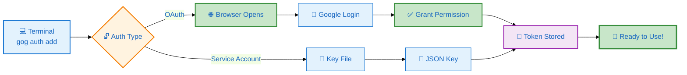
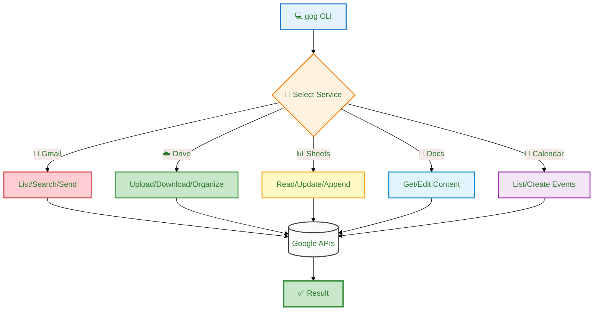

# 🔍 gog CLI — Google Workspace dari Terminal

> Kontrol Gmail, Drive, Docs, Sheets, Calendar langsung dari command line!

---

## 🎯 Apa itu gog CLI?

```
┌─────────────────────────────────────────────────────────────┐
│                    TANPA gog CLI                            │
├─────────────────────────────────────────────────────────────┤
│                                                             │
│   Buka Browser → Login Gmail → Klik-klik manual 🐢          │
│                                                             │
│   Slow, ribet, gabisa di-automate                          │
│                                                             │
└─────────────────────────────────────────────────────────────┘

                         ⬇️

┌─────────────────────────────────────────────────────────────┐
│                    DENGAN gog CLI                           │
├─────────────────────────────────────────────────────────────┤
│                                                             │
│   Terminal: gog gmail send "Hello" → ✅ Sent!              │
│                                                             │
│   Cepat, bisa script, full automation 🚀                   │
│                                                             │
└─────────────────────────────────────────────────────────────┘
```

---

## 📦 Install gog CLI

### One-Liner Install

```bash
# Download latest release (Linux/macOS/Windows)
curl -fsSL https://github.com/steipete/gogcli/releases/latest/download/gog-$(uname -s)-$(uname -m) \
  -o /usr/local/bin/gog

# Kasih permission executable
chmod +x /usr/local/bin/gog

# Cek versi
gog version
```

### Verifikasi Install

```bash
$ gog version

┌─────────────────────────────────────┐
│  gog CLI v0.12.0                    │
│  Build: 2026-03-09                  │
│  OS: Linux x86_64                   │
│  Status: ✅ Ready                   │
└─────────────────────────────────────┘
```

---

## 🔐 Setup Pertama Kali

### Step 1: Login ke Google

```bash
# Tambahin akun Gmail/Workspace
gog auth add main@yourdomain.com
```

**Yang terjadi:**

```
┌──────────────┐
│   Terminal   │
│  gog auth    │
└──────┬───────┘
       │
       ▼
┌──────────────┐     ┌──────────────┐
│  Browser     │────▶│  Google      │
│  Terbuka     │     │  Login Page  │
└──────────────┘     └──────┬───────┘
                            │
                            ▼
                     ┌──────────────┐
                     │  Izinkan     │
                     │  Akses?      │
                     └──────┬───────┘
                            │
                            ▼
                     ┌──────────────┐
                     │  Token       │
                     │  Tersimpan   │
                     └──────────────┘
```

**Klik "Allow" di browser** → Done! ✅

### 🔐 Authentication Flow Diagram



### Step 2: Cek Status

```bash
# Lihat akun yang terhubung
gog auth list

# Output:
# ✅ main@yourdomain.com (Gmail, Drive, Calendar)
```

---

## 🌐 Google Services Workflow Overview



---

## 📧 Gmail — Command Cheat Sheet

```
┌─────────────────────────────────────────────────────────────┐
│                    GMAIL COMMANDS                           │
├─────────────────────────────────────────────────────────────┤
│                                                             │
│  📖 Baca Email                                              │
│  ─────────────────                                          │
│  gog gmail list --max=10           # 10 email terakhir      │
│  gog gmail search "invoice"        # Cari invoice           │
│  gog gmail search "is:unread"      # Email belum dibaca     │
│                                                             │
│  ✉️  Kirim Email                                            │
│  ─────────────────                                          │
│  gog gmail send \\
│    --to "client@email.com" \\
│    --subject "Project Update" \\
│    --body "Halo, ini update..."
│                                                             │
│  📎 Dengan Attachment                                       │
│  ─────────────────                                          │
│  gog gmail send \\
│    --to "finance@cvrfm.com" \\
│    --subject "Invoice PO123" \\
│    --attach "invoice.pdf"
│                                                             │
└─────────────────────────────────────────────────────────────┘
```

### Contoh: Check Email Hari Ini

```bash
# Cek email masuk hari ini
gog gmail search "newer_than:1d" --json | jq '.[].subject'

# Output:
# "Meeting besok jam 9"
# "Invoice PT ABC"
# "Update project"
```

---

## ☁️ Google Drive — Command Cheat Sheet

```
┌─────────────────────────────────────────────────────────────┐
│                    DRIVE COMMANDS                           │
├─────────────────────────────────────────────────────────────┤
│                                                             │
│  📁 List File                                               │
│  ─────────────────                                          │
│  gog drive ls                      # Root folder            │
│  gog drive ls --folder FOLDER_ID   # Folder spesifik        │
│  gog drive ls --query "rfm"        # Search "rfm"           │
│                                                             │
│  ⬆️  Upload File                                            │
│  ─────────────────                                          │
│  gog drive upload report.pdf       # Upload ke root         │
│  gog drive upload *.pdf --folder FOLDER_ID                 │
│                                                             │
│  ⬇️  Download File                                          │
│  ─────────────────                                          │
│  gog drive download FILE_ID        # Download file          │
│                                                             │
│  📂 Buat Folder                                             │
│  ─────────────────                                          │
│  gog drive mkdir "Project 2026"    # Buat folder baru       │
│                                                             │
└─────────────────────────────────────────────────────────────┘
```

### Contoh: Upload ke Folder Tertentu

```bash
# 1. Cari folder dulu
gog drive ls --query "RFM Documents" --json | jq '.[0].id'
# Output: "1c6t6w9ehaBTsm9VfJPj7KwmsJ9wv4qoA"

# 2. Upload ke folder itu
gog drive upload laporan.pdf --folder "1c6t6w9ehaBTsm9VfJPj7KwmsJ9wv4qoA"

# ✅ File uploaded to RFM Documents
```

---

## 📊 Google Sheets — Command Cheat Sheet

```
┌─────────────────────────────────────────────────────────────┐
│                   SHEETS COMMANDS                           │
├─────────────────────────────────────────────────────────────┤
│                                                             │
│  📖 Baca Data                                               │
│  ─────────────────                                          │
│  gog sheets get SHEET_ID "A1:D10"  # Range A1:D10           │
│  gog sheets get SHEET_ID "Sheet1"  # Full sheet             │
│                                                             │
│  ✏️  Update Cell                                            │
│  ─────────────────                                          │
│  gog sheets update SHEET_ID "B5" "Rp 3.000.000"            │
│                                                             │
│  ➕ Tambah Baris                                            │
│  ─────────────────                                          │
│  gog sheets append SHEET_ID "Sheet1!A1" "data1,data2,data3" │
│                                                             │
└─────────────────────────────────────────────────────────────┘
```

### Contoh: Log Gold Price ke Sheets

```bash
#!/bin/bash

SHEET_ID="1bzm7vLJ2L2XPtCyIZYj3oA0obBqcJIoJp6Va3LdDOTk"
TODAY=$(date +%d/%m/%Y)
PRICE="3087000"
YESTERDAY="3047000"
CHANGE="40000"

gog sheets append "$SHEET_ID" "Sheet1!A1" \
  "$TODAY|$PRICE|$YESTERDAY|$CHANGE|UP"

echo "✅ Gold price logged to Sheets"
```

---

## 📅 Google Calendar — Command Cheat Sheet

```
┌─────────────────────────────────────────────────────────────┐
│                  CALENDAR COMMANDS                          │
├─────────────────────────────────────────────────────────────┤
│                                                             │
│  📖 Lihat Event                                             │
│  ─────────────────                                          │
│  gog calendar list --today         # Hari ini               │
│  gog calendar list --tomorrow      # Besok                  │
│  gog calendar list --week          # Minggu ini             │
│                                                             │
│  ➕ Buat Event                                              │
│  ─────────────────                                          │
│  gog calendar create "Meeting Client" \\
│    --start "2026-03-12T14:00:00" \\
│    --duration 60m \\
│    --description "Diskus project baru"
│                                                             │
└─────────────────────────────────────────────────────────────┘
```

### Contoh: Check Jadwal Hari Ini

```bash
# Morning briefing script
echo "📅 Jadwal hari ini:"
gog calendar list --today --json | jq -r '.[].summary'

# Output:
# "Meeting dengan PT ABC"
# "Site visit proyek X"
# "Review laporan keuangan"
```

---

## 🔥 Automation Script Examples

### Script 1: Email Summary Harian

```bash
#!/bin/bash
# daily-email-summary.sh

export GOG_ACCOUNT="main@yourdomain.com"

# Count unread
UNREAD=$(gog gmail search "is:unread" --json | jq '. | length')

# Get today's events
echo "📧 Email belum dibaca: $UNREAD"
echo "📅 Jadwal hari ini:"
gog calendar list --today | head -5
```

### Script 2: Auto-Backup ke Drive

```bash
#!/bin/bash
# backup-to-drive.sh

export GOG_ACCOUNT="main@yourdomain.com"

DATE=$(date +%Y-%m-%d)
FOLDER_NAME="Backup-$DATE"

# Buat folder
gog drive mkdir "$FOLDER_NAME"

# Upload semua PDF
for file in ~/Documents/*.pdf; do
    gog drive upload "$file" --name "$FOLDER_NAME/$(basename $file)"
done

echo "✅ Backup $DATE selesai!"
```

### Script 3: Gold Price Tracker

```bash
#!/bin/bash
# gold-tracker.sh

SHEET_ID="your-sheet-id"
PRICE=$(curl -s "https://hargaemas.com" | grep -oE '3\.0[0-9]{2}\.[0-9]{3}' | head -1)
TODAY=$(date +%d/%m/%Y)

gog sheets append "$SHEET_ID" "Log!A1" "$TODAY,$PRICE"
echo "✅ Harga emas tercatat: Rp $PRICE"
```

---

## 🏗️ Integrasi dengan OpenClaw

```mermaid
%%{init: {'theme': 'base', 'themeVariables': { 'primaryColor': '#e3f2fd', 'primaryTextColor': '#1565c0'}}}%%
flowchart TB
    subgraph User["👤 User Layer"]
        U["💬 'Cek email hari ini'"]
    end
    
    subgraph OpenClaw["🤖 OpenClaw Agent"]
        R["🔍 Parse Intent"]
        E["⚡ Execute Command"]
        F["📋 Format Result"]
    end
    
    subgraph gog["🔧 gog CLI"]
        G["gog gmail search"]
    end
    
    subgraph Google["☁️ Google APIs"]
        API["Gmail API"]
    end
    
    U --> R
    R --> E
    E -->|exec()| G
    G -->|HTTPS| API
    API -->|JSON| G
    G -->|Output| F
    F -->|📧 3 email baru!| U
    
    style User fill:#e3f2fd,stroke:#1976d2
    style OpenClaw fill:#fff3e0,stroke:#f57c00
    style gog fill:#c8e6c9,stroke:#388e3c
    style Google fill:#f3e5f5,stroke:#9c27b0
```

### Contoh dalam HEARTBEAT.md

```bash
# Check email setiap pagi
gog gmail search "is:unread" --json | jq '. | length' > /tmp/unread_count

# Kalau > 5 email unread, kirim alert
if [ $(cat /tmp/unread_count) -gt 5 ]; then
    echo "📧 Kamu punya $(cat /tmp/unread_count) email belum dibaca!"
fi
```

---

## 🛠️ Troubleshooting

### ❌ "401 Unauthorized"

```bash
# Token expired, re-login
gog auth remove main@yourdomain.com
gog auth add main@yourdomain.com
```

### ❌ "Command not found"

```bash
# Cek PATH
echo $PATH

# Kalau gog di /usr/local/bin tapi ga ketemu:
export PATH=$PATH:/usr/local/bin
```

### ❌ "Permission denied"

```bash
# Fix permission
sudo chmod +x /usr/local/bin/gog
```

---

## 📚 Quick Reference Card

| Service | Baca | Tulis | Cari |
|---------|------|-------|------|
| **Gmail** | `gmail list` | `gmail send` | `gmail search "query"` |
| **Drive** | `drive ls` | `drive upload` | `drive ls --query "name"` |
| **Sheets** | `sheets get` | `sheets update` | — |
| **Docs** | `docs get` | `docs update` | — |
| **Calendar** | `calendar list` | `calendar create` | — |

---

## ✅ Checklist Setup

- [ ] Download & install gog CLI
- [ ] Cek `gog version` jalan
- [ ] Run `gog auth add email@anda.com`
- [ ] Login di browser & izinkan akses
- [ ] Test `gog gmail list --max=5`
- [ ] Test `gog drive ls`
- [ ] Buat automation script pertama

---

## 🔗 Resources

- **GitHub:** https://github.com/steipete/gogcli
- **Releases:** https://github.com/steipete/gogcli/releases
- **Docs:** https://docs.gogcli.dev

---

**Version:** 2.0 (Updated 2026-03-11)  
**gog CLI:** v0.12.0+  
**Compatible:** Linux, macOS, Windows
