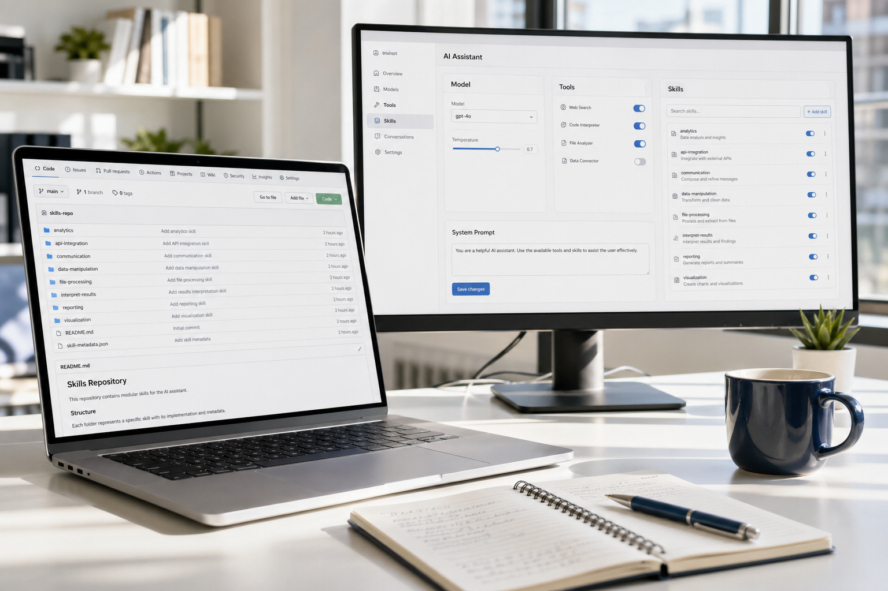
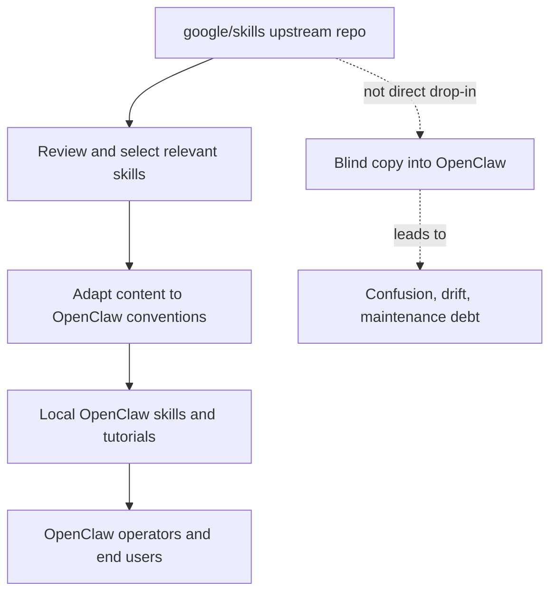
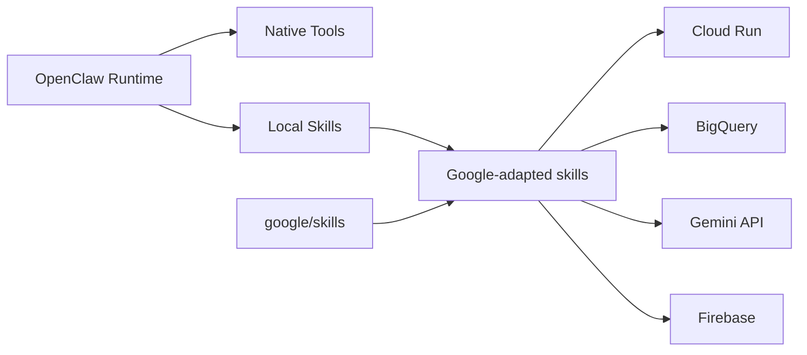
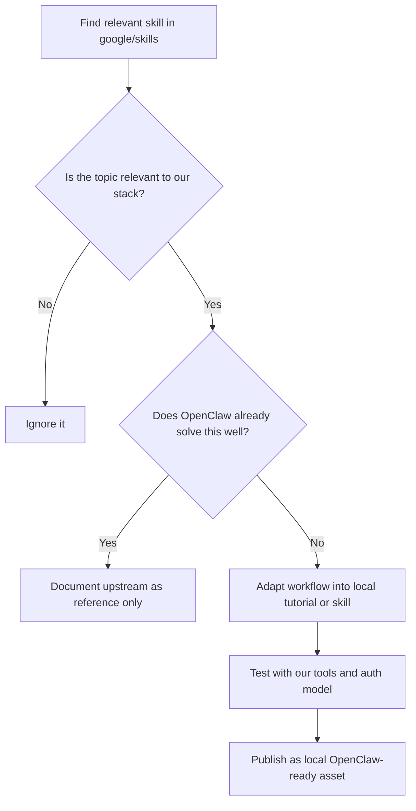
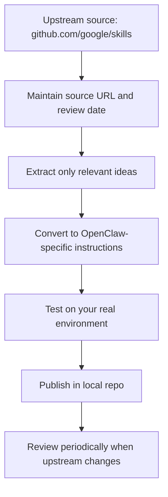
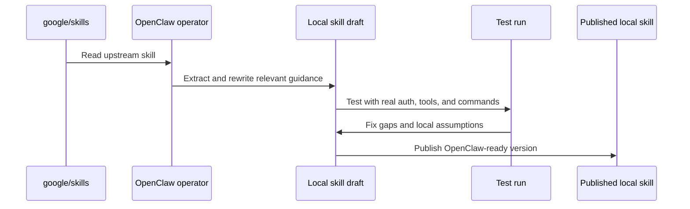

# How to Use `google/skills` as a Practical Skill Library for OpenClaw
## A technical workflow for reviewing, adapting, managing, and shipping Google-flavored agent skills without turning your OpenClaw setup into a mess

> **Estimated reading time:** 24 to 30 minutes  
> **Difficulty:** Intermediate  
> **Last updated:** April 2026  
> **Best for:** OpenClaw operators, technical writers, agent builders, and teams who want to reuse upstream skill repos the smart way

---



## Before We Start

This is the technical version.

If you want the easier mixed Indonesian and English walkthrough, read the companion blog post here:  
**https://blog.fanani.co/tech/google-skills-openclaw/**

If you want a VPS to run OpenClaw or related agent projects, and you want to support this content through our affiliate link, use Sumopod here:  
**https://blog.fanani.co/sumopod**

One important point up front: **`google/skills` is useful for OpenClaw, but not in the lazy copy-paste way.**

That is the whole point of this tutorial.

You should not clone `https://github.com/google/skills`, dump every folder into your workspace, and hope OpenClaw magically understands the whole thing. That is how people create a very expensive folder cemetery.

The better move is to treat `google/skills` as an **upstream reference library**. You review it, extract what is genuinely relevant, adapt the thinking to OpenClaw, document the source, and keep your local skill set opinionated.

That approach is slower for one hour. It is much faster for the next six months.

---

## What `google/skills` Actually Is

The repo lives here:
**https://github.com/google/skills**

It is a growing collection of **Agent Skills** for Google products and technologies, including Gemini API, Cloud Run, BigQuery, GKE, Firebase, Cloud SQL, and related Google Cloud patterns.

The project is designed for the Agent Skills ecosystem. In the repo README, the installation pattern is based on:

```bash
npx skills add google/skills
```

That tells you something important immediately.

This repo is written for a different skill runtime than OpenClaw. The structure is familiar, the idea is compatible, but the operational assumptions are not identical.

Here is the relationship in one glance.



So yes, the repo is relevant.

But the value is not, "Great, now OpenClaw has Google support for free."

The real value is, "Great, now we have a well-scoped upstream source of Google-specific procedures that we can turn into cleaner OpenClaw playbooks, tutorials, and local skills."

That is a much more useful sentence.

---

## Where `google/skills` Fits in an OpenClaw Stack

If you run OpenClaw seriously, your system usually has at least four layers:

1. **Runtime**: the agent platform itself
2. **Tools**: browser, files, messaging, execution, APIs
3. **Skills**: reusable procedural knowledge for recurring tasks
4. **Operating rules**: your local conventions, safety rules, deployment patterns, and documentation standards

`google/skills` fits at layer three.

Not layer one, not layer two.

It does not replace OpenClaw. It does not automatically provide new first-class tools. It provides **structured operational knowledge** that can be reused.



This is why the repo matters more to builders than to casual users.

If your daily work already lives in Gog CLI, Gmail, Calendar, Telegram, and a self-hosted OpenClaw workflow, then `google/skills` is not the first thing you need on Monday morning.

But if you are building anything around Google Cloud, Gemini, Cloud Run, or BigQuery, it becomes a very good reference source.

---

## The Wrong Way to Use It

Let me save you some avoidable pain.

### Wrong move number one
Clone the whole repo and treat every skill as production-ready for your OpenClaw setup.

### Wrong move number two
Assume the command examples, auth assumptions, and role requirements line up perfectly with your local environment.

### Wrong move number three
Mix upstream source material with your own adapted local skills without marking which is which.

### Wrong move number four
Forget where a procedure came from, then fail to review changes when upstream updates the skill.

That path feels fast because you moved files quickly. It is not actually fast.

It creates ambiguity around provenance, maintenance, and support.

This is the better decision tree.



The word that matters most there is **adapt**.

Not mirror. Not import blindly. Adapt.

---

## The Best Practical Model: Upstream Reference, Local Ownership

For OpenClaw, I recommend a simple operating pattern.

### Use `google/skills` for:
- topic discovery
- workflow ideas
- command scaffolding
- prerequisite checklists
- architecture cues
- Google-specific terminology and role mapping

### Keep local ownership for:
- your final skill instructions
- your exact tool calls
- your channel behavior
- your deployment assumptions
- your secrets and auth flow
- your writing style and safety rules

That pattern looks like this.



This gives you the best of both worlds.

You gain leverage from upstream work, but you still keep a clean OpenClaw-native layer.

That is how you avoid turning your system into a compatibility museum.

---

## A Clean Folder Strategy for Managing External Skill Repos

If you want this to stay manageable, separate **source material** from **production material**.

A practical layout looks like this:

```text
workspace/
├── references/
│   └── upstream/
│       └── google-skills/
│           ├── README.md
│           ├── cloud-run-basics.md
│           ├── gemini-api.md
│           └── bigquery-basics.md
├── skills/
│   ├── cloud-run-openclaw/
│   │   └── SKILL.md
│   ├── gemini-provider-ops/
│   │   └── SKILL.md
│   └── bigquery-reporting/
│       └── SKILL.md
├── tutorials/
│   └── google-skills-openclaw-management.md
└── docs/
    └── skill-sources.md
```

You do not need this exact structure, but the separation principle matters.

### Why it works

- **references/upstream** keeps raw external material easy to review
- **skills/** contains only the things your agent should actually trust and use
- **tutorials/** explains the workflow to humans
- **docs/skill-sources.md** preserves provenance and update notes

That makes reviews cleaner, especially when a teammate asks, "Is this an official OpenClaw skill, our adaptation, or copied upstream material?"

You should be able to answer that question in ten seconds.

---

## How to Convert One Google Skill into an OpenClaw-Ready Asset

Let us use **Cloud Run Basics** as the example.

In `google/skills`, that skill contains practical content like prerequisites, required roles, deployment commands, and one critical deployment rule: your app must listen on `0.0.0.0` and use the injected `$PORT` environment variable.

That is exactly the kind of information that is useful.

But you still need to convert it for OpenClaw.

### Step 1: capture the upstream facts

Keep the exact source URL and the review date.

Example:
- Source: `https://github.com/google/skills/blob/main/skills/cloud/cloud-run-basics/SKILL.md`
- Last reviewed: `2026-04-25`
- Status: `reference only`

### Step 2: strip anything runtime-specific that does not apply to OpenClaw

If the skill assumes a separate command runner, installer, or agent framework convention, remove that dependency from your local version.

### Step 3: rewrite around your real workflow

In OpenClaw, your local skill should answer questions like:
- which tool do we use first
- what credentials must already exist
- what commands are safe to run
- when do we stop and ask for approval
- how do we verify success

### Step 4: add local testing rules

This is the part too many people skip.

A local OpenClaw skill is not done when it reads well. It is done when it actually survives your environment.

Here is the conversion flow.



That sequence is boring. Good. Boring is what keeps production systems alive.

---

## When to Create a Skill vs When to Write a Tutorial

This distinction matters more than people think.

### Make a **skill** when:
- the workflow repeats often
- the decision logic is stable
- the toolchain is known
- you want the agent to reuse it during future tasks

### Make a **tutorial** when:
- the topic is still exploratory
- you are explaining tradeoffs
- you want humans to learn the concept first
- the workflow still depends on judgment or environment-specific choices

For `google/skills`, many topics are better as **tutorials first, skills second**.

Why?

Because upstream skills often contain useful procedures, but your OpenClaw environment may still have its own auth model, deployment rules, channel behaviors, and naming conventions.

The tutorial becomes the safe bridge.

Then, once the pattern stabilizes, you turn it into a local skill.

That is exactly why this article exists.

---

## The Three Google Skills Most Worth Adapting First

If you want to start small, do not import fifteen things at once.

Start with three.

### 1. Gemini API in Agent Platform
This is useful if you want a better documented Gemini workflow inside your agent operations.

### 2. Cloud Run Basics
This is the cleanest Google Cloud entry point for agent-friendly apps and webhook surfaces.

### 3. BigQuery Basics
This becomes valuable the second your OpenClaw workflows need reporting, analytics, or scheduled data summaries.

That priority order is not random.

It matches the kinds of things OpenClaw users actually build first:
- model access
- app deployment
- analytics and reporting

If you skip straight to the most advanced Google Cloud topic without having these three organized, you are probably doing theater.

---

## A Lightweight Management Checklist

Use this every time you adopt something from an external skill repo.

### Intake checklist
- confirm the source URL
- confirm the topic is relevant
- confirm OpenClaw does not already handle it cleanly
- decide whether this becomes a tutorial, a skill, or both

### Adaptation checklist
- rewrite for local tools and workflow
- remove assumptions that do not match OpenClaw
- add local verification steps
- add approval boundaries for risky commands
- add backlink to the human-friendly blog version if one exists

### Maintenance checklist
- store last-reviewed date
- note upstream repo and specific file
- review again when the upstream skill changes materially
- keep the local version shorter and clearer than the upstream source

This is the difference between a curated system and a pile of markdown.

---

## What We Are Doing in OpenClaw Sumopod

For this repo, the smart use of `google/skills` is not "install the whole thing."

The smart use is:
- review the upstream Google skill repo
- pick topics that fit OpenClaw operators
- rewrite them into OpenClaw-native tutorials
- later turn the stable patterns into local skills
- keep backlinks between the technical and blog versions so both audiences are served

That is a much stronger content and operations model.

The technical article teaches the exact mechanics. The blog version lowers the barrier for readers who want the idea without the heavier procedural detail.

That two-layer structure is underrated. It respects how people actually learn.

---

## Final Takeaway

So, is `https://github.com/google/skills` useful for OpenClaw?

**Yes, definitely.**

But it is useful as an **upstream skill library and idea source**, not as a magical drop-in OpenClaw add-on.

If you treat it as raw material, it becomes powerful.

If you treat it as a direct runtime dependency without adaptation, it becomes messy fast.

The winning move is simple:

1. **read upstream carefully**
2. **adapt only what fits your stack**
3. **publish local OpenClaw-ready versions**
4. **track the source and review date**
5. **keep human-friendly and technical versions linked together**

That is how you get leverage without inheriting chaos.

If you want the easier companion article, go here:  
**https://blog.fanani.co/tech/google-skills-openclaw/**

If you want a VPS for OpenClaw or related agent projects, use the Sumopod affiliate link here:  
**https://blog.fanani.co/sumopod**
