> [!NOTE] **Pakai OpenClaw buat monitoring industri?** Kalau belum punya, daftar dulu di [Sumopod](https://blog.fanani.co/sumopod) — harga mulai dari yang terjangkau, dan bisa langsung konek ke sistem kamu.

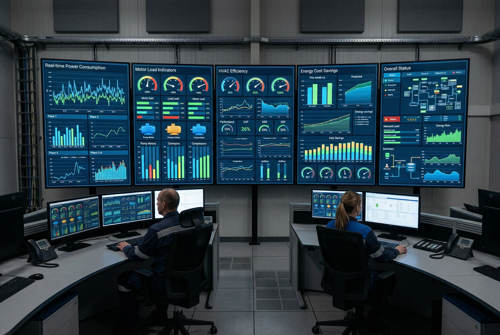

# Monitoring Listrik Industri: Cara Hemat Jutaan dari Motor, HVAC & PLC

Harga bahan bakar industri naik terus. Solar industri tembus Rp 18.000/liter, listrik industri PLN juga udah nggak murah lagi. Di tengah tekanan biaya ini, banyak pabrik dan fasilitas industri **nggak tau persis** berapa listrik yang terbuang setiap bulan.

Bukan karena mereka nggak peduli — tapi karena **nggak punya visibility**. Tanpa monitoring, kamu cuma bisa lihat tagihan PLN di akhir bulan. Tahu totalnya berapa, tapi nggak tau **siapa boros, kapan boros, dan kenapa boros**.

Artikel ini bakal ngebahas gimana cara bikin sistem monitoring listrik industri yang **nggak mahal**, tapi powerful — dari sensor CT sampai dashboard real-time, dengan OpenClaw sebagai "otak" yang ngumpulin data, analisa, dan kasih alert kalau ada yang abnormal.

---

## 📊 Kenapa Monitoring Itu Wajib, Bukan Optional

Pertama, cek fakta-fakta ini:

```
Konsumsi Listrik Industri (Typical Process Plant)

Motor Listrik     ████████████████████████████████████  60-70%
HVAC & Chiller    ██████████████                        15-25%
Lighting          ██████                                5-10%
Control Systems   █                                     1-3%
Other             █                                     1-3%
```

**Motor listrik** adalah pemboros terbesar di hampir semua pabrik. Pump, compressor, fan, conveyor — semuanya pakai motor. Dan kebanyakan motor industri dijalanin **tanpa VFD** (Variable Frequency Drive), artinya mereka selalu full speed bahkan pas load-nya cuma 30%.

**HVAC** nomor dua — terutama di pabrik yang butuh kontrol suhu (pharmaceutical, food processing, offshore platform). Chiller aja bisa menghabiskan 40% total tagihan listrik gedung komersial.

**Masalahnya:** tanpa monitoring, kamu nggak pernah tau motor mana yang jalan 24 jam tapi cuma kerja 20% kapasitas. Nggak tau chiller yang set point-nya 7°C padahal 12°C udah cukup. Nggak tau power factor kamu cuma 0.75 padahal PLN charge penalty kalau di bawah 0.85.

---

## 💸 Biaya Tersembunyi yang Gak Kelihatan

Ini yang bikin kepala saya pusing setiap kali audit energi pabrik — selalu nemu setidaknya 3 masalah ini:

### 1. Motor Jalan Tanpa Beban

```
⚠️ REAL CASE (Disamarkan):

Motor pompa 75kW jalan 24/7 di area storage tank.
Setelah dipasang power meter: rata-rata load cuma 22kW (29%).
Artinya: 53kW terbuang SETIAP JAM × 24 jam × 30 hari = 38,160 kWh/bulan.
Biaya: 38,160 × Rp 1.000/kWh = Rp 38 JUTA/bulan yang terbuang.
```

Kasus ini **sangat umum** di pabrik processing, refinery, dan bahkan hotel besar. Motor di-set "always on" karena takut sistem down, padahal bisa diotomasi pakai level switch + VFD.

### 2. Power Factor Rendah

Kalau power factor (cos φ) kamu di bawah 0.85, PLN nggak cuma charge biaya energi — tapi juga **biaya kVAR** (reactive power). Di industri besar, ini bisa nyentuh **puluhan juta per bulan**.

```
Contoh:
- Connected load: 500 kW
- PF actual: 0.72 (karena banyak motor kecil tanpa capacitor bank)
- PF target: 0.95
- kVAR yang dibutuhkan: 500 × (tan(arccos 0.72) - tan(arccos 0.95))
  = 500 × (0.964 - 0.329) = 317 kVAR
- Biaya cap bank 300 kVAR: ~Rp 15-25 juta (one-time)
- Savings: Rp 5-10 juta/bulan
- Payback: 2-5 bulan 💰
```

### 3. Chiller Overcooling

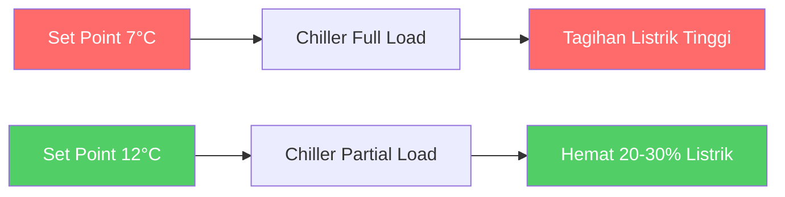

Chiller adalah equipment paling boros di sistem HVAC. Setiap 1°C penurunan set point = ~3-5% tambahan konsumsi listrik. Banyak pabrik set 7°C "biar aman" padahal process-nya cuma butuh 12-14°C.

---

## 🏗️ Arsitektur Sistem Monitoring

OK, sekarang bagian seriusnya — gimana arsitektur monitoring yang bener? Gue bagi jadi 4 layer:

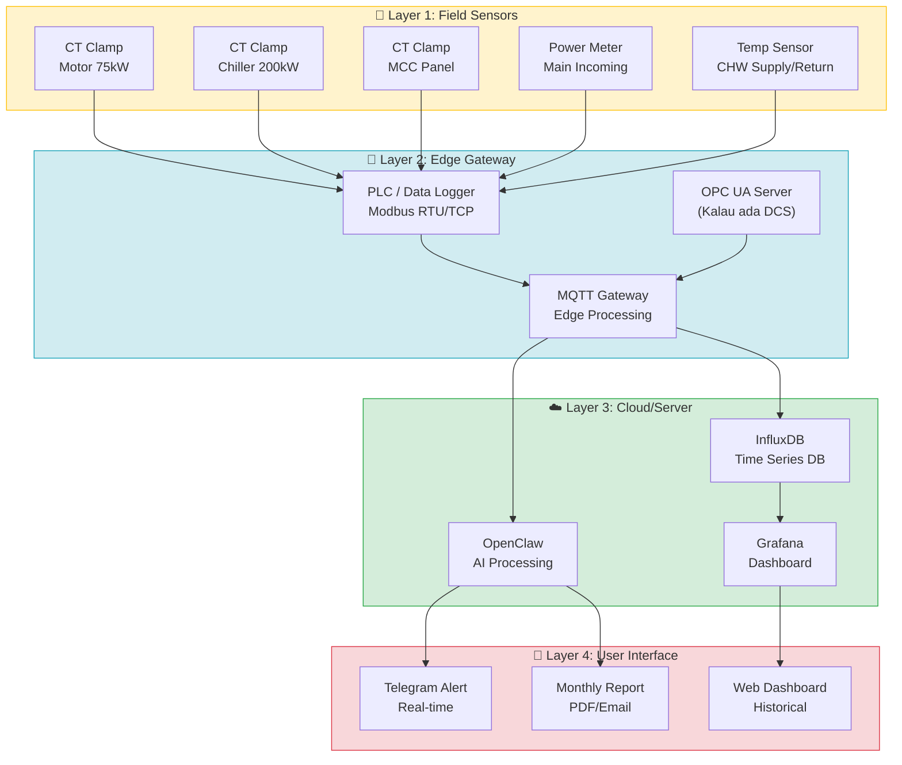

### Layer 1: Field Sensors — Mata-mata di Lapangan

Ini yang ngumpulin data dari lapangan. Komponen utamanya:

| Sensor | Fungsi | Protocol | Harga Kisaran |
|--------|--------|----------|---------------|
| **CT Clamp** | Ukur arus (AC) | Analog 0-1V / Modbus RTU | Rp 200K - 2 jt |
| **Power Meter** | V, I, kW, kVA, kVAR, PF, kWh | Modbus RTU/TCP | Rp 1-5 jt |
| **Temp Sensor** | Suhu proses / ruangan | 4-20mA / Modbus | Rp 100K - 500K |
| **Vibration Sensor** | Health monitoring motor | 4-20mA / Modbus | Rp 500K - 3 jt |

**CT Clamp** adalah hero di sini — murah, gampang pasang (nggak perlu putus kabel), dan akurasinya cukup buat monitoring. Tinggal clip di kabel tiap motor/pompa, sambung ke data logger.

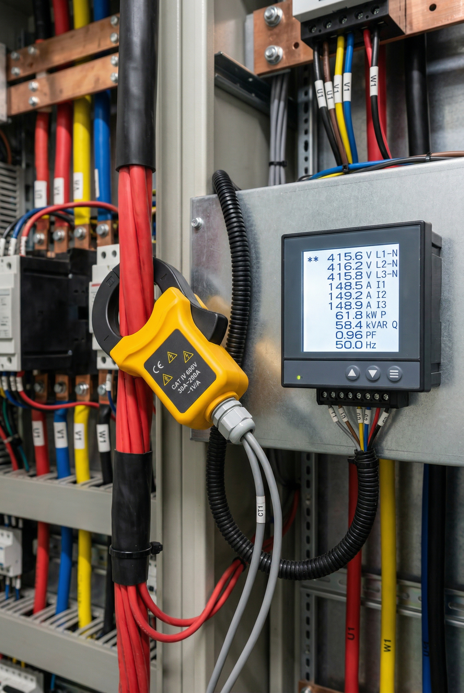

### Layer 2: Edge Gateway — Otak Lokal

Data dari sensor dikirim ke edge gateway. Pilihan:

**Budget (< Rp 5 jt):**
- ESP32 + ADS1115 ADC + custom firmware → MQTT
- Raspberry Pi + pymodbus → MQTT broker

**Mid-range (Rp 5-20 jt):**
- Siemens LOGO! + Modbus → MQTT
- Schneider Modicon M221 + Modbus → MQTT

**Industrial (Rp 20-100 jt):**
- PLC industrial (Siemens S7-1200, AB MicroLogix)
- Industrial gateway (Moxa, Anybus, Advantech)

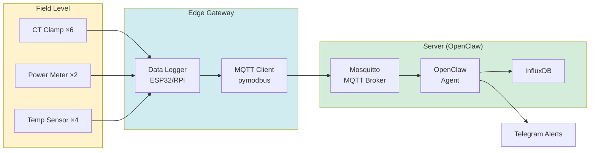

**Komunikasi dari Edge ke Server:**
- **Lokal (satu site):** MQTT over WiFi/LAN → langsung ke Mosquitto di server
- **Multi-site:** MQTT over VPN/4G → cloud broker → OpenClaw
- **Existing PLC/DCS:** Modbus TCP/OPC UA → OpenClaw skill (industrial-control)

### Layer 3: Cloud/Server — OpenClaw sebagai Otak Monitoring

Di sinilah keajaiban terjadi. OpenClaw bukan cuma chatbot — dia bisa:

1. **Subscribe ke MQTT topics** → baca data sensor real-time
2. **Simpan ke InfluxDB** → time-series database buat historical
3. **Analisa pola** → "Motor pompa #3 selalu start jam 2 pagi, tapi nggak ada proses. Kenapa?"
4. **Hitung biaya** → kWh × tarif → Rp per jam/hari/bulan per equipment
5. **Kirim alert** → "⚠️ PF drop ke 0.68! Cek capacitor bank C3"
6. **Generate report** → Weekly/monthly energy report otomatis

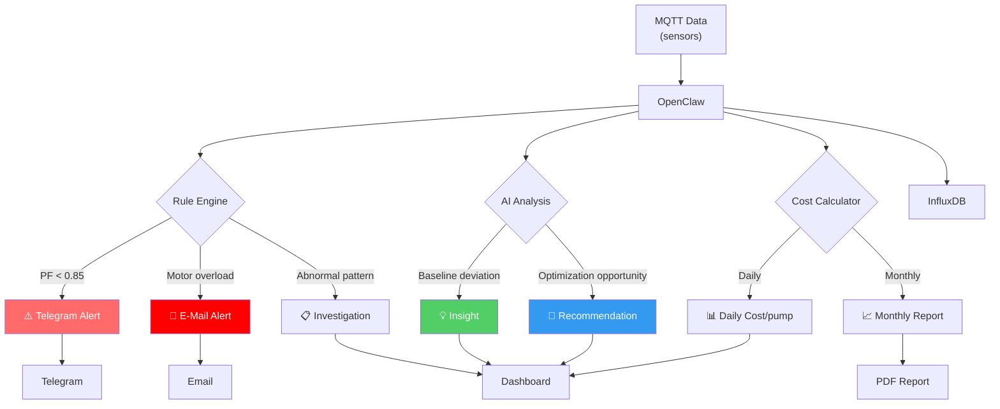

### Layer 4: User Interface — Yang Diliat User

**Telegram Alerts (real-time):**
```
⚠️ ALERT: Power Factor Drop

Waktu: Sab 04 Apr 12:30 WITA
PF: 0.68 (threshold: 0.85)
kVAR deficit: ~187 kVAR
Affected: MCC-2, MCC-3

💡 Recommendation: Cek capacitor bank unit C3-C5. 
Kemungkinan fuse putus atau contactor stuck.

Estimasi biaya penalty: Rp 2.3 jt/bulan jika tidak diperbaiki.
```

**Web Dashboard (Grafana):**
- Real-time power per motor/pump
- Energy consumption trend (hourly/daily/weekly)
- Power factor trend
- Cost breakdown per area
- Comparison: this month vs last month

**Monthly Report:**
- Total energy consumption (kWh)
- Cost per area / per equipment
- Top 5 energy consumers
- Savings from optimization
- Recommendations

---

## 🔧 Komponen yang Dibutuhkan (Budget Breakdown)

Oke, bicara soal uang. Berapa biayanya? Gue bikin 3 scenario:

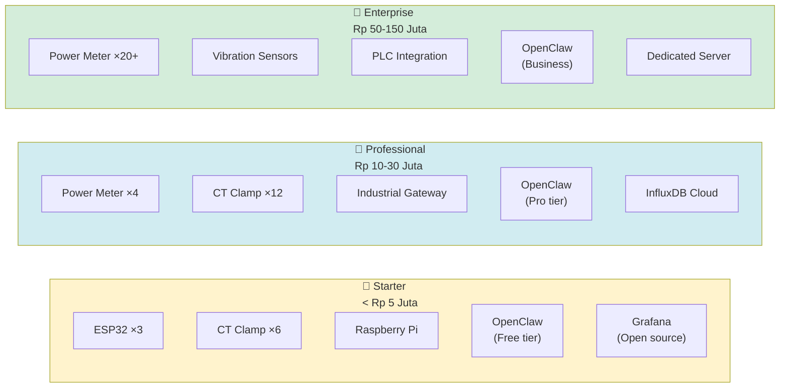

### 🥉 Starter Package (< Rp 5 Juta)

| Item | Qty | Harga | Total |
|------|-----|-------|-------|
| ESP32 DevKit | 3 | Rp 80K | Rp 240K |
| SCT-013-030 CT Clamp 30A | 6 | Rp 200K | Rp 1.2 jt |
| ADS1115 ADC Module | 3 | Rp 50K | Rp 150K |
| Raspberry Pi 4 | 1 | Rp 600K | Rp 600K |
| Kabel + enclosure | — | — | Rp 500K |
| **OpenClaw** | — | Free tier | Rp 0 |
| **Grafana** | — | Open source | Rp 0 |
| | | **TOTAL** | **~Rp 2.7 jt** |

**Bisa monitoring:** 6 motor/pump, read-only (arus saja), basic dashboard.

### 🥈 Professional Package (Rp 10-30 Juta)

| Item | Qty | Harga | Total |
|------|-----|-------|-------|
| Schneider EM4300 Power Meter | 4 | Rp 2 jt | Rp 8 jt |
| CT Clamp 150A | 12 | Rp 350K | Rp 4.2 jt |
| Moxa MGate MB3170 (Modbus→TCP) | 2 | Rp 3 jt | Rp 6 jt |
| Industrial enclosure + wiring | — | — | Rp 3 jt |
| **OpenClaw** | — | Pro tier | Rp 500K/bln |
| **InfluxDB + Grafana** | — | Self-hosted | Rp 0 |
| | | **TOTAL** | **~Rp 21 jt** |

**Bisa monitoring:** 12 circuits (V, I, kW, kVAR, PF, kWh), Modbus TCP integration, alert system.

### 🥇 Enterprise Package (Rp 50-150 Juta)

| Item | Qty | Harga | Total |
|------|-----|-------|-------|
| Yokogawa PW3336 Power Meter | 20 | Rp 5 jt | Rp 100 jt |
| CT Clamp 500A | 40 | Rp 800K | Rp 32 jt |
| Vibration Sensor (SKF CMSS 2200) | 10 | Rp 3 jt | Rp 30 jt |
| Industrial PLC + Gateway | 4 | Rp 8 jt | Rp 32 jt |
| Cabinet + wiring + commissioning | — | — | Rp 50 jt |
| **OpenClaw** | — | Business tier | Rp 2 jt/bln |
| **Server + InfluxDB + Grafana** | — | Dedicated | Rp 5 jt/bln |
| | | **TOTAL** | **~Rp 120 jt** |

**Bisa monitoring:** Full plant coverage, predictive maintenance, integration dengan DCS/SCADA yang udah ada.

---

## ⚡ Strategi Penghematan yang Terbukti

Monitoring tanpa aksi = data cuma jadi arsip. Ini strategi penghematan yang **bisa langsung diterapkan** setelah punya data:

### 1. VFD untuk Motor (Savings: 30-50%)

Ini nomor satu — paling impact, paling cepat payback.

```
Hukum Affinity:
P₂ = P₁ × (N₂/N₁)³

Kalau motor jalan di 80% speed:
P₂ = P₁ × (0.8)³ = P₁ × 0.512

Artinya: HEMAT 48.8% listrik! 💰
```

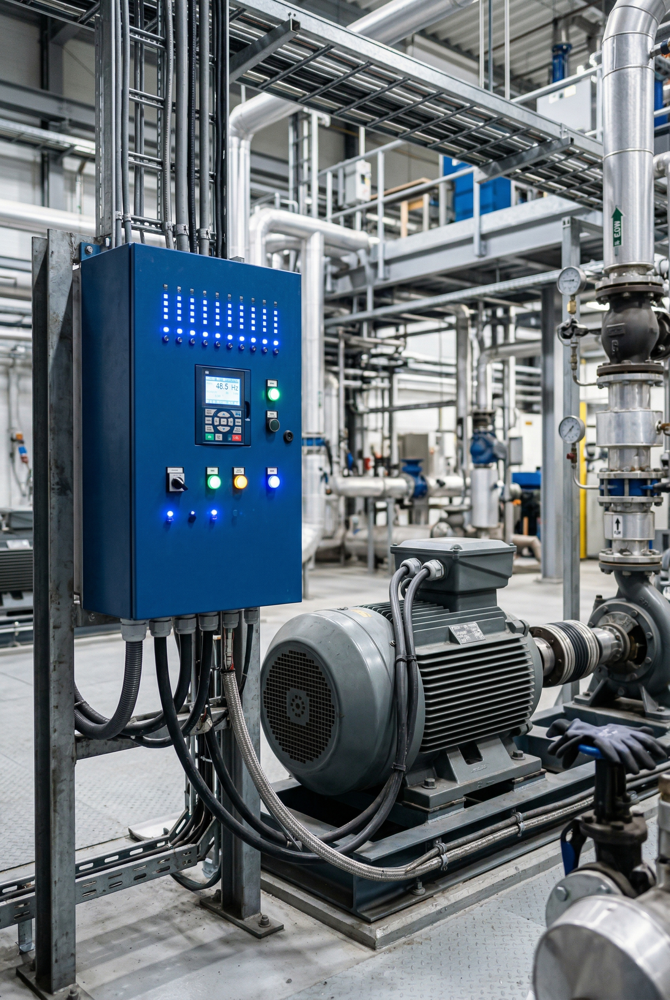

**Prioritas instalasi VFD:**
1. 🔴 Pompa sirkulasi (banyak jalan partial load)
2. 🔴 Fan blower AHU / cooling tower
3. 🟡 Compressor (kalau variabel demand)
4. 🟢 Conveyor (kalau speed perlu diatur)

**ROI contoh:**
```
Motor pompa 75kW, jalan 24/7, rata-rata load 50%
- Tanpa VFD: 75kW × 24 × 30 × Rp 1.000 = Rp 54 jt/bulan
- Pakai VFD (80% speed): 75 × 0.512 × 24 × 30 × Rp 1.000 = Rp 27.6 jt/bulan
- Savings: Rp 26.4 jt/bulan
- Harga VFD 75kW: ~Rp 15-25 jt
- Payback: < 1 BULAN 🤯
```

### 2. Load Scheduling (Savings: 10-25%)

Banyak equipment jalan 24/7 padahal cuma dibutuhkan pada jam tertentu:

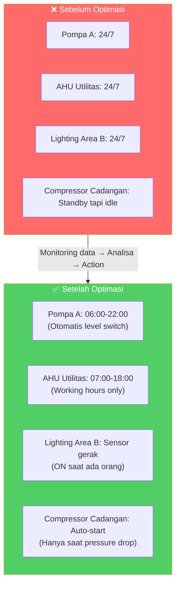

### 3. Power Factor Correction (Savings: 5-15%)

Udah gue bahas di atas — ini paling murah dan paling cepat payback. Tapi banyak pabrik yang **nggak tau** PF mereka berapa sampai dipasang monitoring.

### 4. HVAC Optimization (Savings: 15-30%)

| Optimasi | Savings | Implementasi |
|----------|---------|-------------|
| Naikkan set point chiller 1°C | 3-5% | Ubah set point |
| Enthalpy economizer | 10-20% (di iklim tropis) | Sensor + damper control |
| VFD pada AHU fan | 30-50% | Install VFD |
| DCV (Demand Controlled Ventilation) | 10-15% | CO2 sensor + VAV |
| Chiller sequencing (lead/lag) | 5-10% | BMS logic |

### 5. Predictive Maintenance (Savings: Avoid downtime)

```
Contoh: Motor pompa critical, 110kW

Downtime cost: Rp 50 jt/hour (lost production)
Motor replacement: Rp 25 jt
Vibration sensor: Rp 2 jt

Tanpa monitoring:
- Motor jalan sampai mati → emergency shutdown
- Production stop 8 jam = Rp 400 jt lost
- Total cost: Rp 425 jt

Dengan vibration monitoring:
- Sensor detect abnormal 2 minggu sebelum failure
- Motor diganti pada planned shutdown (weekend)
- Production impact: 0
- Total cost: Rp 27 jt (sensor + motor)
- SAVINGS: Rp 398 jt 😎
```

---

## 📊 OpenClaw sebagai Otak Monitoring

Ini bagian yang bikin artikel ini beda dari tutorial monitoring lainnya. OpenClaw **bukan cuma dashboard** — dia AI agent yang bisa ngerti konteks dan kasih rekomendasi.

### Setup MQTT Integration

```python
# openclaw-mqtt-bridge.py
# Bridge antara MQTT sensor data dan OpenClaw
import paho.mqtt.client as mqtt
import requests
import json

BROKER = "localhost"
OC_WEBHOOK = "http://localhost:3000/api/webhook/energy-monitor"

def on_message(client, userdata, msg):
    payload = json.loads(msg.payload)
    
    # Send to OpenClaw for analysis
    requests.post(OC_WEBHOOK, json={
        "topic": msg.topic,
        "timestamp": payload["timestamp"],
        "sensors": payload["data"]
    })

client = mqtt.Client()
client.on_message = on_message
client.connect(BROKER, 1883)
client.subscribe("industry/sensor/#")
client.loop_forever()
```

### OpenClaw Skill untuk Monitoring

Kamu bisa bikin skill khusus yang auto-trigger kalau ada anomaly:

```yaml
# skills/energy-monitoring/SKILL.md
name: energy-monitoring
trigger:
  - "cek listrik"
  - "energy report"
  - "motor load"
  - "power factor"
  
rules:
  - PF < 0.85: alert Telegram + recommend cap bank check
  - Motor load > 95% for 30min: alert overload risk
  - Motor load < 20% for >2hr: recommend VFD or scheduling
  - Energy spike > 20% vs baseline: investigate + alert
  - Daily summary: send at 18:00 WITA
  - Monthly report: auto-generate + email
```

### Contoh Alert yang Dikirim OpenClaw ke Telegram

```
📊 ENERGY SNAPSHOT — Sabtu, 4 Apr 2026 18:00 WITA

⚡ Total Plant Load: 847 kW
💰 Estimasi Biaya Hari Ini: Rp 20.3 jt
📈 vs Kemarin: -3.2% (hemat Rp 670K) 👍

🔥 Top Consumers:
1. Chiller-1: 180 kW (21.3%)
2. Motor Pompa-3: 75 kW (8.9%) ⚠️ LOW LOAD
3. AHU-2: 45 kW (5.3%)
4. Compressor-1: 110 kW (13.0%)

⚠️ Alerts:
• Motor Pompa-3: Load 22% selama 6 jam.
  💡 Rekomendasi: Pasang VFD atau auto-off saat level tank > 80%
• PF turun ke 0.78 (kemarin 0.84)
  💡 Cek capacitor bank C3 — kemungkinan perlu replacement

━━━━━━━━━━━━
📈 Bulan Ini: 612 MWh | Rp 612 jt
vs Bulan Lalu: -8.3% (hemat Rp 55 jt)
```

---

## 💰 ROI Calculation — Berapa Cepat Balik Modal?

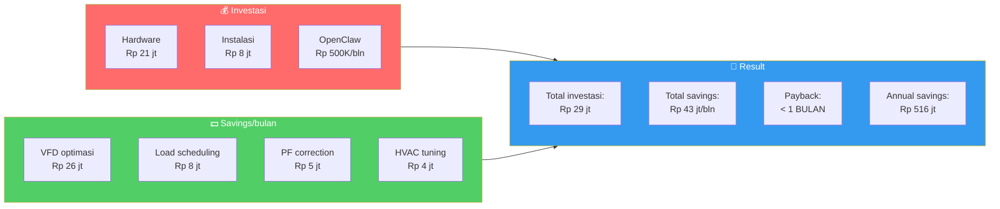

**Realistic scenario (pabrik menengah):**

| Item | Investasi | Savings/bulan | Payback |
|------|-----------|---------------|---------|
| VFD untuk 2 motor besar | Rp 30 jt | Rp 40 jt | < 1 bulan |
| Power factor correction | Rp 15 jt | Rp 5 jt | 3 bulan |
| Load scheduling (otomasi) | Rp 8 jt | Rp 8 jt | 1 bulan |
| HVAC optimization | Rp 5 jt | Rp 4 jt | 1-2 bulan |
| Monitoring system | Rp 21 jt | Prevention ROI | 2-3 bulan |
| **TOTAL** | **Rp 79 jt** | **Rp 57 jt/bln** | **~1.5 bulan** |

**Annual savings: ~Rp 684 jt** — dan itu angka konservatif!

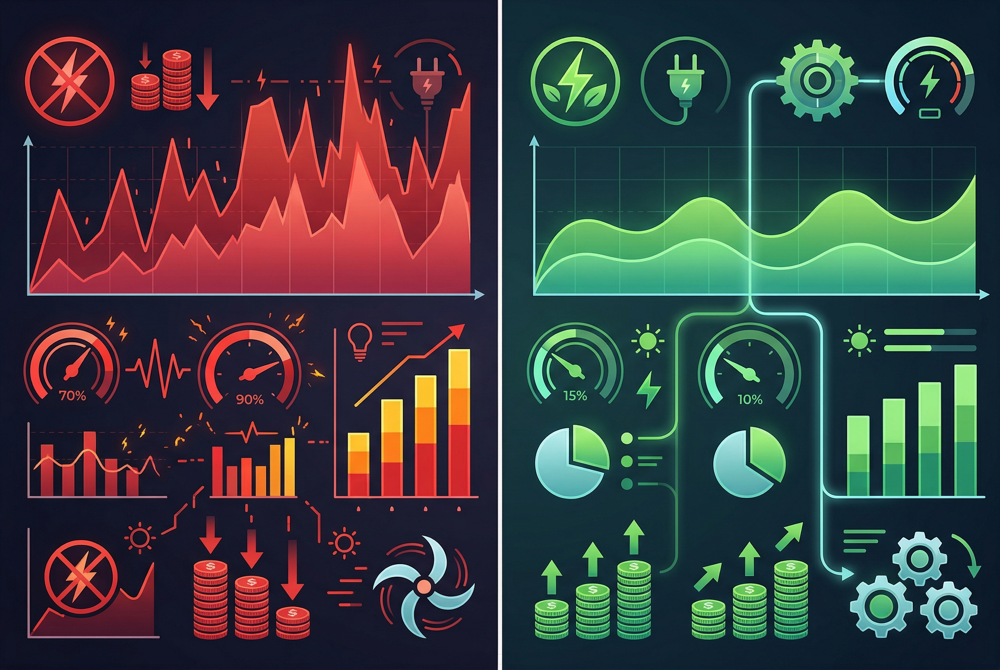

---

## 🚀 Implementation Roadmap

Jangan langsung pasang semua sekaligus. Gue sarankan phased approach:

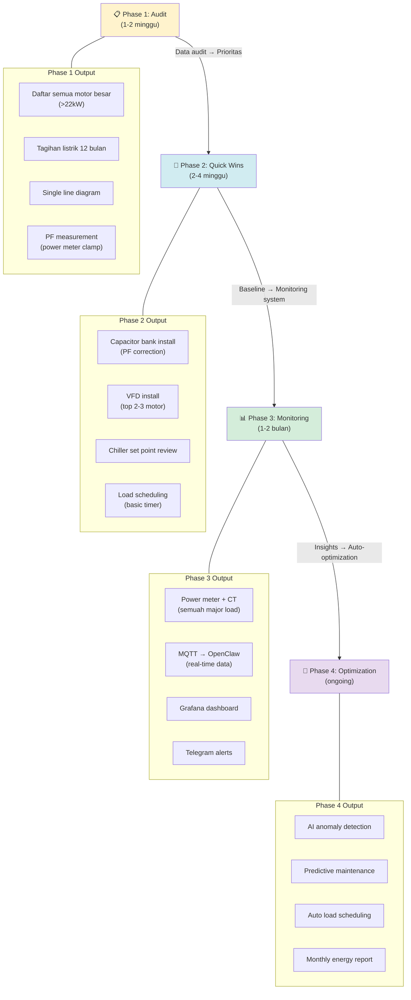

### Phase 1: Energy Audit (1-2 Minggu)

Yang perlu dilakuin:
- [ ] Daftar semua motor >22kW (nameplate data: kW, RPM, duty)
- [ ] Kumpulkan tagihan listrik 12 bulan terakhir
- [ ] Ukur PF di main incoming (pakai clamp meter)
- [ ] Cek chiller set point
- [ ] Cek apakah ada equipment yang jalan 24/7 tapi nggak perlu
- [ ] Foto single line diagram

**Tools yang dibutuhkan:** Clamp meter (Fluke / Kyoritsu), thermal camera (optional).

### Phase 2: Quick Wins (2-4 Minggu)

Langkah yang bisa langsung dikerjain dari data audit:
- [ ] Install capacitor bank kalau PF < 0.85
- [ ] Install VFD di 2-3 motor terbesar yang jalan partial load
- [ ] Naikkan chiller set point 1-2°C
- [ ] Pasang timer/scheduler untuk equipment yang nggak perlu 24/7
- [ ] Matikan lampu area yang kosong pakai occupancy sensor

### Phase 3: Monitoring System (1-2 Bulan)

Nah, ini yang bikin semua sustainable:
- [ ] Pasang power meter + CT clamp di semua major load
- [ ] Setup MQTT gateway (ESP32/RPi atau industrial gateway)
- [ ] Install InfluxDB + Grafana di server
- [ ] Setup OpenClaw skill untuk energy monitoring
- [ ] Configure Telegram alerts
- [ ] Verifikasi data accuracy (compare dengan PLN meter)

### Phase 4: Continuous Optimization (Ongoing)

Setelah monitoring jalan, baru bisa:
- [ ] AI anomaly detection (OpenClaw detect pattern yang nggak normal)
- [ ] Predictive maintenance (vibration trending)
- [ ] Auto load scheduling (berdasarkan production schedule)
- [ ] Energy benchmarking (per unit produksi)
- [ ] Monthly energy report otomatis
- [ ] Carbon footprint tracking (ESG compliance)

---

## 🔌 Integration dengan Sistem yang Udah Ada

Kalo pabrik kamu udah punya PLC/DCS/SCADA, jangan replace — **integrate**.

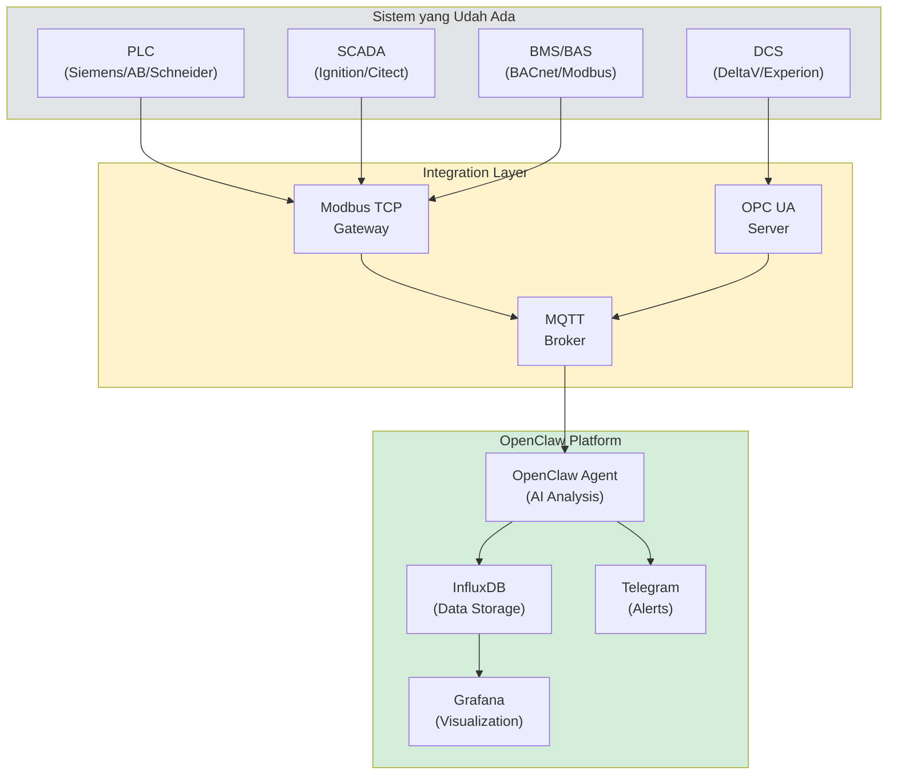

**Key points:**
- **Jangan bypass safety systems** — monitoring only, never control
- **Read-only access** ke PLC/DCS — safety first
- **Kalau udah ada HMI/SCADA** — OpenClaw complement, bukan replace
- **OPC UA** preferred untuk DCS integration (secure, standard)
- **Modbus TCP** untuk PLC yang nggak support OPC UA

---

## 📈 Real Dashboard vs Beneran Berapa Impact-nya?

Supaya gambaran makin jelas, ini contoh real scenario:

```
📊 PLANT ENERGY REPORT — Maret 2026

━━━━━━━━━━━━━━━━━━━━━━━━━━
📉 TOTAL CONSUMPTION
━━━━━━━━━━━━━━━━━━━━━━━━━━
Total: 485,200 kWh
Cost: Rp 485.2 jt
vs Feb: -12.3% (hemat Rp 68.2 jt) 🎉

⚡ TOP CONSUMERS
━━━━━━━━━━━━━━━━━━━━━━━━━━
1. Chiller Plant    ██████████████████ 168,000 kWh (34.6%)
2. Motor Pompa Area A ██████████████ 120,000 kWh (24.7%)
3. Compressor        ████████████    85,000 kWh (17.5%)
4. Motor Pompa Area B ██████          48,000 kWh (9.9%)
5. Lighting & Misc   ████            32,200 kWh (6.6%)
6. Control Systems   █              15,000 kWh (3.1%)
7. Others            █               17,000 kWh (3.5%)

💡 ACTIONS TAKEN THIS MONTH
━━━━━━━━━━━━━━━━━━━━━━━━━━
✅ VFD installed on Pompa-3 → savings Rp 18 jt
✅ Chiller set point raised 7→10°C → savings Rp 12 jt
✅ Cap bank C3 repaired → PF 0.72→0.91 → savings Rp 8 jt
✅ AHU-2 timer installed → savings Rp 4 jt
✅ Lighting area B occupancy sensor → savings Rp 2 jt

🎯 NEXT MONTH TARGETS
━━━━━━━━━━━━━━━━━━━━━━━━━━
☐ VFD for Compressor (est. savings Rp 15 jt/bln)
☐ Cross-check Pompa-2 run hours vs production
☐ Investigate Chiller COP (possible condenser cleaning)
```

---

## 🎯 Kesimpulan

Monitoring listrik industri **bukan luxury** — di harga energi sekarang, ini keharusan. Fakta-fakta:

```
Progress Monitoring Implementation

✅ Phase 1: Energy Audit         ████████████████████ 100%
✅ Phase 2: Quick Wins            ████████████████░░░░  75%
🔄 Phase 3: Monitoring System     ██████░░░░░░░░░░░░░░  30%
⏳ Phase 4: AI Optimization       ░░░░░░░░░░░░░░░░░░░░   0%
```

**Key takeaways:**
1. **Motor listrik = 60-70%** konsumsi → fokus pertama
2. **VFD = ROI tercepat** → payback < 1 bulan
3. **PF correction = paling murah** → Rp 15 jt invest, Rp 5 jt/bln savings
4. **Monitoring = sustainability** → tanpa data, optimization cuma tebakan
5. **OpenClaw = otak** → bukan cuma dashboard, tapi AI yang ngerti konteks

**Angka yang bikin mikir:**
- Pabrik menengah bisa hemat **Rp 500 jt - 1 M per tahun**
- Payback keseluruhan sistem: **1-3 bulan**
- Carbon reduction: **20-40%** (bonus ESG compliance)

---

> **Mulai dari yang kecil, tapi mulai sekarang.** Pasang satu power meter di main incoming, connect ke OpenClaw, dan liat sendiri berapa energi yang terbuang tiap hari. Data nggak pernah bohong.
>
> Dan kalau butuh platform AI yang bisa handle semua ini — dari monitoring sampai analisa — cek [Sumopod](https://blog.fanani.co/sumopod). Setup-nya gampang, dan bisa langsung konek ke MQTT, Modbus, atau API apapun.

━━━━━━━━━━━━

*Toolbox yang disebut: OpenClaw, InfluxDB, Grafana, ESP32, pymodbus, Mosquitto MQTT, ADS1115*
*Standar referensi: IEC 61511, IEC 62443, ASHRAE 90.1, ISO 50001*
*Last updated: April 2026*
