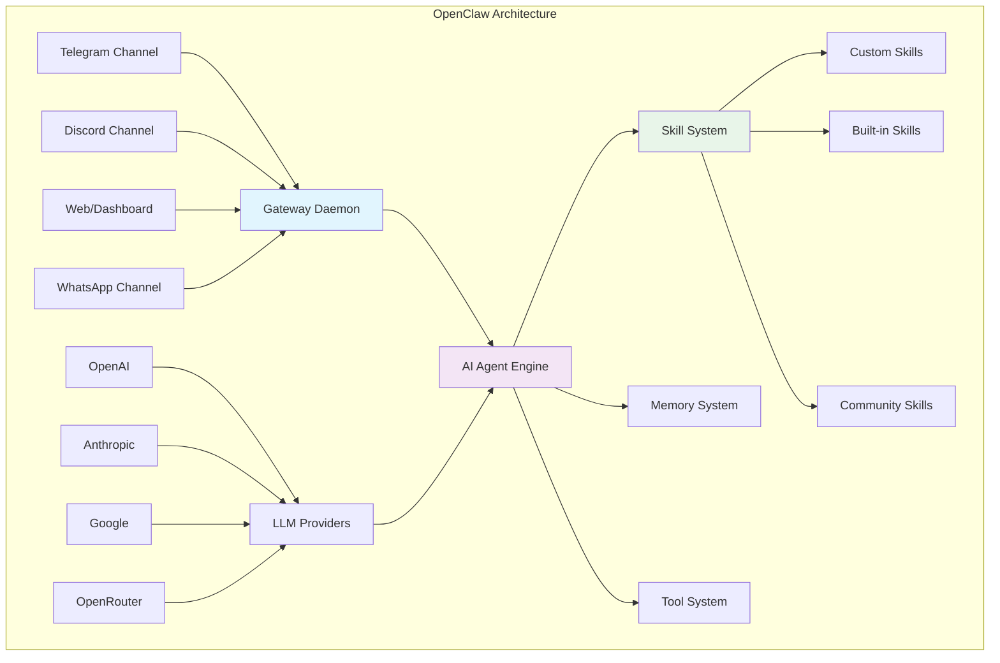
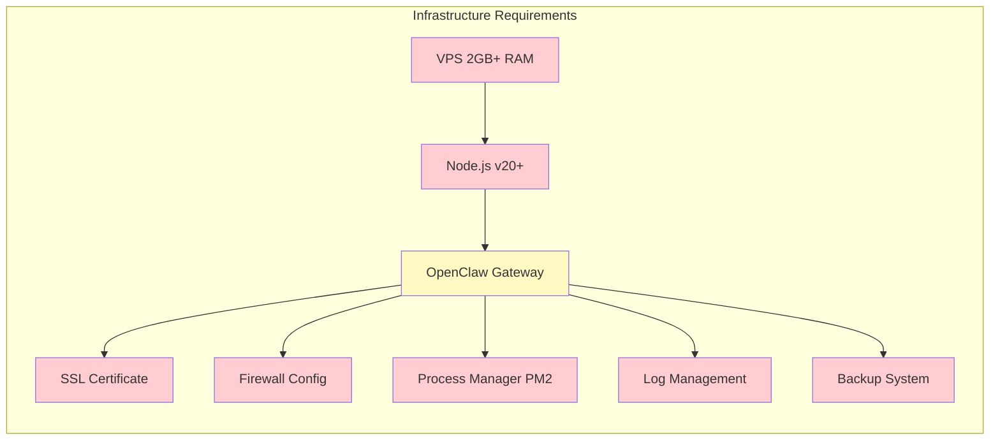
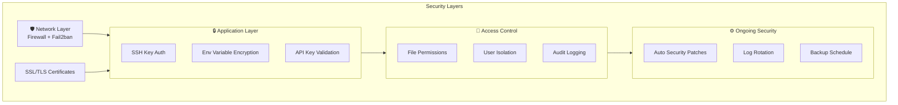
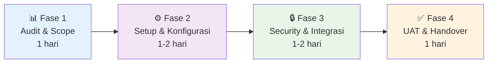
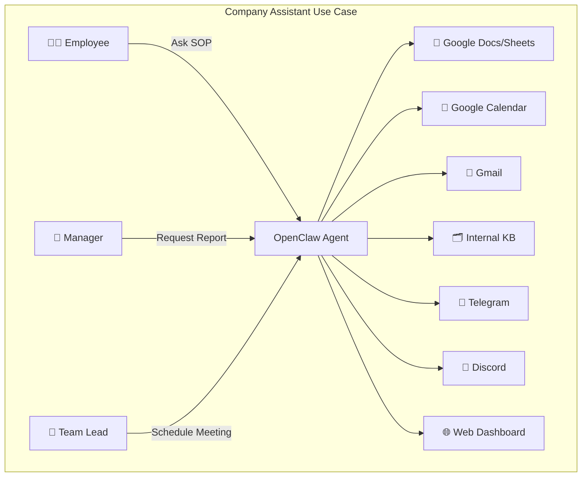
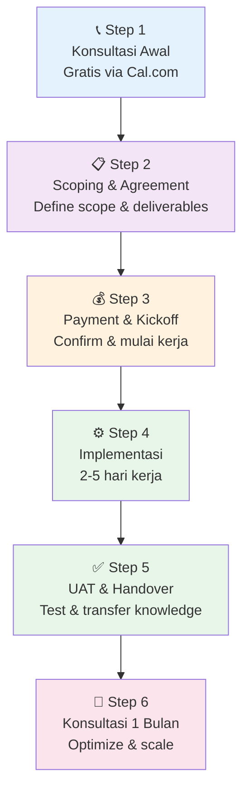

# Jasa Install OpenClaw Profesional — Panduan Lengkap 2026

> Setup OpenClaw yang benar di kali pertama. Tanpa pusing, tanpa trial-and-error, langsung production-ready dalam 2-5 hari kerja.

---

## Daftar Isi

1. [Introduction](#1-introduction)
2. [Apa Itu OpenClaw](#2-apa-itu-openclaw)
3. [Tantangan Setup OpenClaw Sendiri](#3-tantangan-setup-openclaw-sendiri)
4. [Kenapa Jasa Install OpenClaw dari Rama Digital](#4-kenapa-jasa-install-openclaw-dari-rama-digital)
5. [Apa yang Kamu Dapat](#5-apa-yang-kamu-dapat-deliverables-lengkap)
6. [Proses Implementasi 4 Langkah](#6-proses-implementasi-4-langkah)
7. [Use Case Nyata](#7-use-case-nyata)
8. [Biaya vs Value](#8-biaya-vs-value)
9. [Bonus Konsultasi 1 Bulan](#9-bonus-konsultasi-1-bulan)
10. [Testimoni & Bukti](#10-testimoni--bukti)
11. [Cara Memulai](#11-cara-memulai)
12. [Kesimpulan](#12-kesimpulan)

---

## 1. Introduction

OpenClaw sedang jadi salah satu platform AI agent paling powerful yang tersedia saat ini. Kemampuannya untuk menjalankan multi-channel AI agent — dari Telegram, Discord, sampai WhatsApp — dengan sistem skill yang modular, menjadikannya pilihan utama buat perusahaan yang mau serious di automasi AI.

Tapi ada masalah besar yang sering diabaikan: **setup-nya itu challenging banget.**

Ini bukan platform "install dan langsung jalan" kayak WordPress atau Shopify. OpenClaw butuh VPS configuration yang tepat, Node.js environment yang bener, API keys dari multiple providers, channel integration yang stabil, security hardening yang proper, dan ongoing maintenance supaya semuanya tetap jalan.

Buat tim yang sudah tech-savvy, mungkin ini nggak terlalu masalah. Tapi buat kebanyakan bisnis — terutama yang fokusnya di operasional, bukan IT — setup OpenClaw sendiri itu bisa makan waktu mingguan bahkan bulanan, dengan hasil yang seringkali masih belum optimal.

Nah, itu kenapa [Jasa Install OpenClaw dari Rama Digital](https://ramadigital.id/services/jasa-install-openclaw) ada. Jasa ini specifically designed buat bisnis yang mau pakai OpenClaw secara profesional, tanpa harus pusing dengan teknikal setup. Dalam 2-5 hari kerja, kamu bisa punya AI agent yang production-ready, aman, dan terintegrasi dengan workflow bisnis kamu.

Tutorial ini akan membahas semuanya dari A sampai Z — dari apa itu OpenClaw, kenapa setup sendiri itu risky, apa yang kamu dapat dari jasa ini, sampai bagaimana proses implementasinya. Let's dive in.

---

## 2. Apa Itu OpenClaw

OpenClaw adalah open-source AI agent platform yang memungkinkan kamu untuk menjalankan AI assistant yang terhubung ke berbagai channel komunikasi. Secara sederhana, bayangin kamu punya satu AI brain yang bisa diakses lewat Telegram, Discord, web, dan channel lainnya — semua dari satu instance yang sama.

### Komponen Utama OpenClaw



### Fitur-Fitur Kunci

- **Multi-Channel**: Satu agent bisa terhubung ke Telegram, Discord, WhatsApp, dan platform lainnya secara bersamaan
- **Skill System**: Modular skill architecture yang memungkinkan kamu extend kapabilitas agent tanpa ngoprek core system
- **Memory System**: Agent punya short-term dan long-term memory, jadi dia ingat konteks dari percakapan sebelumnya
- **Subagent Architecture**: Bisa spawn subagent untuk tugas berat tanpa nge-block conversation utama
- **Tool Integration**: Akses ke file system, browser, shell commands, dan API eksternal
- **Security**: Built-in permission system dan safety guardrails

### Perbandingan OpenClaw vs Alternatif

Sebelum masuk ke tantangan setup, worth it untuk ngelihat posisi OpenClaw di landscape AI tools yang ada saat ini:

| Aspek | ChatGPT/Claude Web | LangChain/Self-Build | OpenClaw |
|-------|-------------------|---------------------|----------|
| **Multi-Channel** | ❌ Web only | ⚠️ Custom build | ✅ Built-in |
| **Self-Hosted** | ❌ Cloud-only | ✅ Ya | ✅ Ya |
| **Skill System** | ❌ Plugin terbatas | ⚠️ Custom code | ✅ Modular ecosystem |
| **Memory** | ⚠️ Per-session | ⚠️ Custom build | ✅ Persistent multi-layer |
| **Business Integration** | ⚠️ Limited API | ✅ Full control | ✅ Native + extensible |
| **Setup Difficulty** | ★☆☆☆☆ | ★★★★★ | ★★★☆☆ |
| **Customization** | ★★☆☆☆ | ★★★★★ | ★★★★☆ |
| **Ongoing Cost** | Monthly subscription | Dev time + infra | Infra + API calls only |

Dari tabel di atas, jelas bahwa OpenClaw nongkrong di sweet spot — powerful dan customizable seperti self-build solution, tapi dengan convenience yang jauh lebih baik berkat built-in features dan skill ecosystem.

**Keunggulan spesifik OpenClaw dibanding alternatif:**

1. **Customize personality** — agent kamu bisa punya persona unik yang sesuai brand bisnis. Bukan generic assistant, tapi benar-benar "karyawan digital" yang punya karakter
2. **Connect ke internal tools** — Google Sheets, n8n workflows, database, billing system, CRM — semuanya bisa dihubungkan lewat tool dan skill system
3. **Automasi bisnis end-to-end** — bukan cuma chatbot yang jawab pertanyaan, tapi真正 business process automation yang bisa execute tasks
4. **Self-hosted & data sovereign** — data bisnis kamu tetap di server kamu, bukan di server pihak ketiga. Ini kritis untuk compliance dan data privacy
5. **Skill ecosystem** — ratusan skill tersedia di community (dari weather monitoring sampai invoice generation), dan kamu bisa buat custom skill sendiri
6. **Subagent architecture** — tugas berat bisa di-delegate ke subagent tanpa blocking conversation utama. Scalable by design
7. **Active development** — platform ini actively maintained dan improved, dengan community yang growing

Dokumentasi lengkap tersedia di [docs.openclaw.ai](https://docs.openclaw.ai) dan source code di [github.com/openclaw/openclaw](https://github.com/openclaw/openclaw). Untuk melihat skill-skill yang tersedia, kamu bisa explore repository dan community resources.

---

## 3. Tantangan Setup OpenClaw Sendiri

Oke, jadi kamu tertarik pakai OpenClaw. Kamu buka dokumentasi, mulai ikutin tutorial, dan... ternyata nggak semudah itu. Berikut adalah tantangan-tantangan yang bakal kamu hadapi kalau nyoba setup sendiri.

### 3.1 VPS dan Infrastructure Configuration

OpenClaw butuh server yang properly configured. Ini bukan sekedar "install Node.js dan jalan." Kamu perlu:

- **OS Configuration**: Linux server (Ubuntu/CentOS/debian) yang properly patched dan updated
- **Node.js Setup**: Versi yang tepat (minimum v20+), dengan npm/yarn yang compatible
- **Firewall Rules**: Port yang benar dibuka, port yang nggak perlu ditutup
- **SSL/TLS**: Certificate yang valid untuk secure connections
- **Process Management**: PM2 atau systemd untuk keep process running
- **Resource Monitoring**: CPU, RAM, dan disk usage tracking



### 3.2 API Keys dan Model Configuration

OpenClaw membutuhkan setidaknya satu LLM provider untuk berfungsi. Tapi konfigurasinya nggak sekedar "masukin API key."

- **Multiple Providers**: Mungkin kamu mau pakai OpenAI untuk reasoning, Anthropic untuk coding, dan Google untuk general tasks — masing-masing perlu setup yang berbeda
- **Model Selection**: Setiap provider punya banyak model dengan tradeoff berbeda antara kecepatan, kualitas, dan biaya
- **Rate Limiting**: Perlu ngatur rate limit supaya nggak kena overage charge
- **Fallback Configuration**: apa yang terjadi kalau provider utama down?
- **Cost Optimization**: Strategi routing model yang efficient — jangan pakai GPT-4o untuk task sederhana

### 3.3 Channel Integration

Menghubungkan OpenClaw ke channel komunikasi itu nggak trivial:

- **Telegram Bot**: Butuh BotFather setup, webhook configuration, dan permission management
- **Discord Bot**: OAuth flow, server permissions, slash commands, dan event handling
- **WhatsApp**: Business API yang complex, approval process, dan compliance requirements
- **Web Interface**: Custom deployment, CORS handling, dan authentication

Setiap channel punya quirks-nya sendiri — rate limits berbeda, message format berbeda, feature availability berbeda.

### 3.4 Security Hardening

Ini yang paling sering terlewat. Default installation OpenClaw itu **belum production-ready dari sisi security.** Kamu perlu:

- **Authentication**: Secure login mechanism untuk web interface
- **API Protection**: Rate limiting dan API key validation
- **File Permissions**: Proper Unix file permissions supaya nggak ada privilege escalation
- **Environment Variables**: API keys dan sensitive data harusnya nggak hardcoded
- **Network Security**: Firewall, fail2ban, intrusion detection
- **Audit Logging**: Siapa ngakses apa, kapan, dan dari mana
- **Regular Updates**: OpenClaw dan semua dependencies harus rutin di-update

### 3.5 Ongoing Maintenance

Setelah jalan, kerjaan belum selesai. OpenClaw butuh ongoing maintenance:

- **Monitoring**: Supaya kamu tahu kalau ada yang error sebelum user komplain
- **Log Rotation**: Supaya disk nggak penuh karena log files
- **Backup**: Database dan configuration files perlu regular backup
- **Updates**: Security patches dan feature updates dari upstream
- **Performance Tuning**: Seiring bertambahnya workload, mungkin perlu optimization

### 3.6 Skill Development dan Customization

OpenClaw powerful karena skill system-nya. Tapi mengembangkan skill yang reliable itu sendiri butuh keahlian:

- **SKILL.md structure**: Setiap skill butuh file SKILL.md yang properly formatted dengan metadata, description, dan instructions
- **Script development**: Banyak skill butuh bash scripts, Python scripts, atau integrasi dengan external APIs
- **Error handling**: Skill yang production-ready harus handle edge cases, network errors, dan invalid input gracefully
- **Testing**: Manual testing setiap skill memakan waktu dan seringkali incomplete
- **Documentation**: Skill yang baik butuh dokumentasi yang jelas supaya bisa di-maintain ke depannya

Untuk bisnis dengan workflow spesifik, mungkin kamu perlu 5-10 custom skills. Masing-masing bisa butuh 2-4 jam development time untuk yang experienced, atau 4-8 jam untuk yang baru belajar.

### 3.7 Time Cost — The Hidden Price

Buat orang yang nggak daily driver di DevOps/Linux/cloud infrastructure, estimasi waktu setup OpenClaw sendiri:

| Tugas | Estimasi Waktu (Pemula) | Estimasi Waktu (Intermediate) |
|-------|------------------------|-------------------------------|
| VPS Setup & OS Config | 4-8 jam | 1-2 jam |
| Node.js & Dependencies | 2-4 jam | 30-60 menit |
| OpenClaw Installation | 3-6 jam | 1-2 jam |
| API Key & Model Config | 2-4 jam | 1-2 jam |
| Channel Integration (1 channel) | 4-8 jam | 2-3 jam |
| Security Hardening | 6-12 jam | 3-4 jam |
| Testing & Debugging | 4-8 jam | 2-4 jam |
| Documentation & SOP | 2-4 jam | 1-2 jam |
| **TOTAL** | **27-54 jam** | **11-19 jam** |

Itu kalau semuanya berjalan lancar. Realitanya? Expect 2x dari estimasi karena troubleshooting, compatibility issues, dan learning curve.

---

## 4. Kenapa Jasa Install OpenClaw dari Rama Digital

Jadi kamu punya dua opsi: setup sendiri (dengan semua risk dan time cost di atas), atau pakai jasa profesional. Berikut kenapa [Rama Digital](https://ramadigital.id/services/jasa-install-openclaw) adalah pilihan yang masuk akal.

### 4.1 Professional Setup dengan Standard Industri

Rama Digital nggak cuma "install OpenClaw lalu selesai." Setup yang dilakukan sudah mengikuti best practice dari dunia production deployment:

- **Infrastructure as Code mindset** — konfigurasi yang reproducible dan version-controlled
- **Security-first approach** — hardening dari hari pertama, bukan afterthought
- **Monitoring built-in** — kamu tahu status sistem kamu setiap saat
- **Documentation lengkap** — SOP yang jelas, bukan catatan tersebar di chat

### 4.2 Customize untuk Use Case Kamu

Setiap bisnis berbeda. OpenClaw yang dipakai perusahaan konsultasi bakal beda konfigurasinya dengan yang dipakai e-commerce atau content agency. Rama Digital akan:

1. **Audit kebutuhan** — memahami workflow bisnis kamu sebelum mulai setup
2. **Customize personality** — agent yang sesuai dengan brand voice dan industry kamu
3. **Integrate tools** — menghubungkan ke tools yang sudah kamu pakai (Google Workspace, CRM, billing, dll)
4. **Create custom skills** — kalau ada workflow spesifik yang perlu di-automate
5. **Configure channels** — aktifkan channel yang kamu butuhkan, nggak lebih nggak kurang

### 4.3 Kenapa Rama Digital Specifically?

- **Partner resmi**: Ari Eko Praesthio, founder Rama Digital, sudah actively publish use case OpenClaw dengan audience puluhan ribu viewer. Ini bukan vendor yang baru coba-coba — mereka understand platform ini dalam-dalam
- **Experience nyata**: Sudah handle berbagai tipe client — dari startup sampai perusahaan established
- **Support berkelanjutan**: Bonus konsultasi 1 bulan setelah implementasi, jadi kamu nggak dilepas setelah handover
- **AI Consulting ecosystem**: Rama Digital punya [AI Consulting hub](https://ramadigital.id/services/ai) yang lengkap — kalau butuh sesuatu di luar scope install, bisa escalate

---

## 5. Apa yang Kamu Dapat (Deliverables Lengkap)

Dengan investasi Rp 6.000.000/project, ini yang kamu dapatkan:

### 5.1 Instalasi dan Konfigurasi OpenClaw

- Full installation di VPS kamu (atau rekomendasi VPS kalau belum punya)
- Node.js environment yang properly configured
- OpenClaw Gateway setup dengan systemd/PM2 untuk auto-restart
- Model configuration dengan optimal routing (cost vs quality)
- Memory dan workspace configuration

### 5.2 Security Baseline

Ini deliverable yang sering dianggap "invisible" tapi sebenarnya paling valuable:

- **Server Hardening**: SSH key authentication, disable password login, firewall configuration
- **SSL/TLS**: Valid certificates untuk semua endpoints
- **Environment Security**: API keys disimpan di environment variables, bukan di source code
- **File Permissions**: Proper ownership dan permission structure
- **Fail2ban**: Protection dari brute force attacks
- **Automatic Updates**: Security patches yang scheduled



### 5.3 Integrasi Channel

Minimal 1 channel utama terkonfigurasi dan tested:

- **Telegram Bot** (paling populer): Full setup dengan webhook, commands, dan group integration
- **Discord Bot**: Server setup, role permissions, dan slash commands
- **WhatsApp Business**: API integration untuk customer communication
- **Web Dashboard**: Access point untuk non-Telegram users

### 5.4 SOP dan Handover Document

Supaya tim kamu bisa manage sendiri setelah implementasi:

- **Setup Documentation**: Step-by-step apa yang sudah di-install dan kenapa
- **Configuration Guide**: Penjelasan setiap konfigurasi yang aktif
- **Troubleshooting Guide**: Common issues dan cara resolve-nya
- **Backup & Recovery**: Procedure untuk backup dan restore
- **Daily Operations**: Checklist harian dan mingguan
- **Escalation Matrix**: Kalau ada masalah, siapa yang dihubungi dan langkah apa yang diambil

### 5.5 Bonus: Konsultasi 1 Bulan

Ini value yang sering dianggap underrated tapi sebenarnya sangat valuable. Detailnya di [section 9](#9-bonus-konsultasi-1-bulan).

---

## 6. Proses Implementasi 4 Langkah

Implementasi dari Rama Digital mengikuti proses yang structured dan predictable. Berikut detail setiap fase:

### Overview Proses



### Fase 1: Audit & Scope (Hari 1)

Fase ini adalah fondasi dari seluruh implementasi. Tanpa audit yang proper, setup bisa jadi salah arah.

**Yang dilakukan:**
- Kickoff meeting dengan tim kamu untuk memahami kebutuhan
- Assessment infrastructure yang ada (VPS, domain, existing tools)
- Identifikasi use case utama — apa yang mau di-automate
- Mapping channel yang dibutuhkan dan priority-nya
- Inventory tools yang perlu di-integrate (Google Workspace, CRM, billing system, dll)
- Agreement pada scope, deliverables, dan timeline

**Output:**
- Scope document yang disepakati kedua belah pihak
- Technical requirements checklist
- Project timeline dengan milestone

**Kenapa ini penting:** Banyak implementasi AI gagal bukan karena teknis, tapi karena expectation mismatch. Fase ini memastikan semua pihak aligned sebelum kerja dimulai.

### Fase 2: Setup & Konfigurasi (Hari 1-2)

Fase eksekusi inti di mana semua infrastruktur dibangun.

**Yang dilakukan:**
- Provisioning dan konfigurasi VPS
- Installation Node.js dan dependencies
- Setup OpenClaw Gateway dengan optimal configuration
- Konfigurasi LLM providers (minimal 2 providers untuk fallback)
- Workspace dan memory system configuration
- Process management setup (PM2/systemd)
- Initial agent personality dan system prompt configuration

**Quality checkpoints:**
- ✅ Gateway running dan auto-restart on crash
- ✅ Agent bisa merespon perintah dasar
- ✅ Model routing berfungsi (primary + fallback)
- ✅ Memory system aktif dan persistent
- ✅ Log files ter-record properly

### Fase 3: Security & Integrasi (Hari 2-4)

Ini fase yang membedakan "basic setup" dari "production-ready deployment."

**Security yang diterapkan:**
- SSH hardening (key-only authentication)
- Firewall configuration (ufw/iptables)
- SSL certificate deployment
- Environment variable security
- Fail2ban installation dan configuration
- Log rotation setup
- Automatic security update schedule

**Integrasi channel:**
- Setup dan testing channel utama yang disepakati
- Webhook configuration dan verification
- Message format optimization
- Rate limit handling
- Fallback mechanism kalau channel down

**Integrasi tools:**
- Google Workspace API (kalau applicable)
- Custom tool integration sesuai scope
- n8n/automation workflow connection (kalau ada)
- Database connection (kalau dibutuhkan)

**Quality checkpoints:**
- ✅ Server hardened — port scan clean
- ✅ Channel responsive dan stable
- ✅ Tools terintegrasi dan tested
- ✅ SSL valid dan secure
- ✅ Monitoring aktif

### Fase 4: UAT & Handover (Hari 4-5)

User Acceptance Testing — fase dimana kamu verify semuanya berjalan sesuai expectation.

**Yang dilakukan:**
- Demo session — walkthrough semua fitur yang sudah di-setup
- UAT bersama tim kamu — kamu test sendiri dengan use case nyata
- Bug fixing dan adjustment berdasarkan UAT feedback
- Final documentation delivery
- Knowledge transfer session — training singkat untuk tim yang akan maintain
- Handover semua credentials dan access

**Quality checkpoints:**
- ✅ Semua use case yang disepakati berfungsi
- ✅ Tim kamu bisa operate secara mandiri
- ✅ Dokumentasi lengkap dan accessible
- ✅ Backup dan recovery procedure tested
- ✅ Konsultasi 1 bulan dijadwalkan

---

## 7. Use Case Nyata

OpenClaw itu flexible banget — bisa dipakai untuk berbagai skenario. Berikut beberapa use case nyata yang bisa kamu implementasi setelah setup profesional.

### 7.1 Company Assistant untuk Operasional Harian

Imagine punya AI assistant yang 24/7 standby untuk handle operasional bisnis. Ini bukan sci-fi — ini realitas yang sudah bisa dicapai dengan OpenClaw yang well-configured.

**Contoh workflow nyata:**

Pagi hari, manager masuk ke Telegram dan ketik: *"Radit, summary meeting kemarin dan to-do list hari ini."*

Tanpa 5 menit, assistant sudah merespon dengan:
- Ringkasan meeting dari Google Calendar kemarin (siapa yang hadir, keputusan apa yang diambil)
- Action items yang sudah dicatat
- Schedule hari ini dari calendar
- Reminder untuk deadline yang approaching

Lalu siangnya, staf baru nanya: *"Gimana SOP untuk pengajuan cuti?"* — assistant langsung jawab berdasarkan knowledge base internal perusahaan, lengkap dengan link ke form dan informasi contact HR.

 sorenya, finance team minta: *"Buatkan draft email ke vendor X tentang invoice overdue bulan lalu."* — assistant buatkan draft yang professional, tone sesuai, dengan reference ke invoice number dan amount yang tepat.

**Apa yang perlu di-setup untuk ini:**
- Google Calendar integration untuk scheduling
- Knowledge base untuk company SOP dan policy
- Gmail integration untuk email drafting dan sending
- Google Sheets integration untuk data access
- Agent personality yang sesuai dengan company culture



### 7.2 Billing dan Invoice Automation

Buat perusahaan yang masih manual handle billing — dan believe it or not, masih banyak yang manual — OpenClaw bisa automate sebagian besar proses:

**Workflow yang bisa di-automate:**

1. **Invoice Generation**: Setiap ada transaksi baru (dari CRM atau manual input), agent auto-generate invoice dengan template yang consistent. Termasuk company logo, payment terms, dan breakdown yang rapi.

2. **Invoice Distribution**: Invoice otomatis dikirim ke client lewat email atau WhatsApp, dengan format yang sesuai. Follow-up reminder bisa di-schedule kalau belum ada payment setelah due date.

3. **Payment Tracking**: Agent monitor payment status dan update ledger. Kalau ada payment masuk, otomatis update status dan notify relevant team.

4. **Financial Reporting**: Weekly atau monthly, agent compile revenue summary, outstanding invoices, aging report, dan send ke management lewat Telegram atau email.

**Impact yang bisa diharapkan:**
- Reduction manual data entry: 80-90%
- Faster invoice turnaround: dari hari ke menit
- Fewer overdue payments: karena reminder otomatis
- Better cash flow visibility: real-time reporting

### 7.3 Content Creation Pipeline

Buat marketing team atau content creator yang perlu produce konten secara consistent, OpenClaw bisa jadi game changer:

**Pipeline lengkap yang bisa di-setup:**

1. **Content Ideation**: Agent bisa analyze trending topics, competitor content, dan audience interest untuk generate content ideas yang relevant

2. **Content Drafting**: Dari outline yang disetujui, agent bisa draft full article, social media post, atau newsletter content. Dengan proper system prompt, output-nya bisa match tone dan style brand kamu

3. **Content Repurposing**: Satu blog post bisa di-repurpose jadi 5-7 social media posts, 1 newsletter edition, 1 video script outline, dan 1 podcast talking points — semua dari satu source material

4. **Scheduling & Publishing**: Dengan integrasi ke scheduling tools, konten bisa di-schedule untuk publish di waktu optimal

5. **Performance Tracking**: Agent bisa periodic check engagement metrics dan compile performance report

**Use case spesifik:** Content agency yang handle 5+ client sekaligus bisa punya satu OpenClaw instance yang manage content pipeline untuk semua client — dengan context switching yang seamless antar brand.

### 7.4 Monitoring dan Alerting

Buat tim DevOps atau IT operations yang perlu jaga sistem tetap healthy, OpenClaw bisa jadi monitoring hub yang powerful:

**Monitoring capabilities:**

1. **Server Health**: Periodic check CPU usage, RAM, disk space, dan network. Alert kalau ada threshold yang terlampaui

2. **Application Monitoring**: HTTP health checks untuk web services, API endpoints, dan microservices. Auto-detect downtime dan notify on-call team

3. **Log Analysis**: Agent bisa read dan summarize application logs, identify patterns, dan highlight anomalies yang perlu attention

4. **Scheduled Reports**: Daily morning briefing tentang system health, weekly infrastructure report, monthly cost analysis

5. **Incident Response**: Auto-create incident report, notify team, dan bahkan execute predefined remediation scripts

**Contoh nyata:** Setiap pagi jam 7, agent kirim message ke group Telegram DevOps: *"All systems operational. CPU avg 23%, disk 45%, no errors in last 24h."* Kalau ada yang abnormal, message-nya otomatis berubah jadi warning atau critical alert dengan actionable next steps.

### 7.5 Custom Business Workflow

Setiap bisnis punya workflow unik. Dengan skill system OpenClaw, kamu bisa automate practically anything:

- **Customer onboarding** — guide new customer through setup process, auto-send welcome materials
- **Project management** — update task status, assign team member, track progress
- **Procurement** — PO creation, approval workflow, vendor communication
- **HR processes** — leave request, attendance tracking, onboarding checklist
- **Quality control** — inspection checklist, non-conformance report, CAPA tracking

### 7.6 Multi-Company Management

Buat founder atau manager yang handle beberapa perusahaan (seperti group structure), OpenClaw bisa jadi centralized command center:

- **Unified dashboard** — satu agent yang bisa handle query dari semua perusahaan tanpa context pollution
- **Context switching** — agent paham konteks perusahaan mana yang sedang dibicarakan dan adjust response accordingly
- **Cross-company reporting** — compile data dari multiple entities jadi satu unified report untuk group-level decision making
- **Consolidated monitoring** — track KPI dan metrics dari semua bisnis dalam satu tempat, dengan drill-down capability per entity

Use case ini especially relevant buat holding company atau business group yang punya beberapa subsidiary dengan operasional yang berbeda-beda tapi tetap butuh visibility terpusat dari management level. Imagine bisa nanya ke satu Telegram chat: *"Gimana revenue semua company bulan ini?"* dan dapat consolidated report dalam hitungan detik.

---

## 8. Biaya vs Value

Oke, Rp 6.000.000 itu bukan angka kecil. Tapi mari kita breakdown value yang kamu dapatkan versus biaya kalau kamu kerjakan sendiri.

### 8.1 Detailed Cost Breakdown DIY

Kalau kamu breakdown biaya setup sendiri lebih detail, angka-angkanya jadi lebih jelas:

| Komponen | Estimasi Biaya (Kalau Outsource) | Estimasi Waktu DIY |
|----------|--------------------------------|-------------------|
| VPS Setup & Hardening | Rp 500.000 - 1.000.000 | 4-8 jam |
| OpenClaw Installation | Rp 1.000.000 - 2.000.000 | 3-6 jam |
| Channel Integration (per channel) | Rp 500.000 - 1.000.000 | 4-8 jam |
| Security Configuration | Rp 1.000.000 - 2.000.000 | 6-12 jam |
| Custom Skill Development (per skill) | Rp 500.000 - 1.500.000 | 2-8 jam |
| Documentation & SOP | Rp 500.000 - 1.000.000 | 2-4 jam |
| Testing & QA | Rp 500.000 - 1.000.000 | 4-8 jam |
| **TOTAL (basic setup, 1 channel, 2 skills)** | **Rp 4.500.000 - 10.000.000** | **25-54 jam** |

Dan itu belum termasuk:
- **Learning curve** — waktu untuk belajar platform (add 10-20 jam)
- **Troubleshooting time** — things WILL go wrong (add 50-100% buffer)
- **Opportunity cost** — waktu yang bisa kamu gunakan untuk revenue-generating activities
- **Risk premium** — potensi kerugian dari misconfiguration

```mermaid
graph LR
    subgraph "DIY Approach"
        D1[Waktu Setup<br/>27-54 jam] --> D2[Opportunity Cost<br/>Rp 2.7M-5.4M*]
        D3[Trial & Error<br/>Rp 1-3M**] --> D2
        D4[Security Risk<br/>Priceless] --> D2
    end
    
    subgraph "Rama Digital"
        R1[One-time Fee<br/>Rp 6.000.000] --> R2[Production-Ready<br/>2-5 hari]
        R3[1 Bulan Konsultasi<br/>Value Rp 3-5M] --> R2
        R4[Professional SOP<br/>Timeless Value] --> R2
    end
    
    style D2 fill:#ffcdd2
    style R2 fill:#c8e6c9
    
    D2 -.->|*"Berdasarkan tarif dev Rp 100-200K/jam"| 
    R2
```

*Opportunity cost calculation: Kalau waktu kamu worth Rp 100.000-200.000/jam, dan setup butuh 27-54 jam, maka opportunity cost-nya Rp 2.700.000-10.800.000.

**Risk hidden costs kalau DIY:**
- **VPS misconfiguration** → bisa kena hack, data breach, atau downtime
- **API key leak** → unexpected charges sampai jutaan rupiah
- **Incorrect model routing** → biaya AI yang jauh lebih mahal dari seharusnya
- **No monitoring** → masalah terdeteksi terlambat, impact ke business
- **No documentation** → kalau ada masalah, troubleshoot dari nol lagi

### 8.2 ROI Perspective

Cara melihat ROI dari investasi ini:

1. **Time Saved**: 27-54 jam kerja yang bisa kamu alokasikan ke core business activity
2. **Risk Mitigated**: Security incidents bisa cost jutaan bahkan puluhan juta — prevention worth every penny
3. **Faster Time-to-Value**: 2-5 hari vs 2-4 minggu kalau DIY — kamu mulai dapat benefit lebih cepat
4. **Quality Guarantee**: Setup yang proven dan tested, bukan trial-and-error
5. **Knowledge Transfer**: Tim kamu belajar best practice dari expert
6. **1 Bulan Konsultasi Gratis**: Nilai tambah yang signifikan untuk optimization dan troubleshooting

### 8.3 Perspektif Jangka Panjang

Pikirkan begini: OpenClaw itu investment, bukan expense. Setelah setup, agent kamu bisa:

- Handle routine tasks 24/7 tanpa lelah
- Reduce response time dari jam ke detik
- Scale support tanpa hire lebih banyak orang
- Automate workflows yang sebelumnya manual
- Generate insights dari data yang sebelumnya terabaikan

Dalam 3-6 bulan, efficiency gain dari AI agent yang well-configured bisa easily exceed investasi setup awal.

---

## 9. Bonus Konsultasi 1 Bulan

Ini adalah salah satu value proposition paling interesting dari [Jasa Install OpenClaw Rama Digital](https://ramadigital.id/services/jasa-install-openclaw). Setelah implementasi selesai, kamu dapat 1 bulan konsultasi gratis.

### Apa yang Bisa Kamu Diskusikan?

**Technical Topics:**
- Optimization — cara buat agent lebih cepat dan lebih murah
- New skill development — bikin skill custom untuk workflow spesifik
- Channel expansion — tambah channel baru (Discord, WhatsApp, dll)
- Model tuning — adjust model selection untuk cost-quality balance
- Troubleshooting — kalau ada issue teknis yang perlu debugging

**Strategic Topics:**
- Use case brainstorming — explore automation opportunity yang belum kepikiran
- Workflow design — rancang end-to-end automated workflow
- Team adoption — strategi supaya tim maksimalkan penggunaan OpenClaw
- Scaling plan — prepare untuk growth dan increased usage
- Integration roadmap — plan integrasi dengan tools lainnya

### Format Konsultasi

- Via [cal.com/arieko/konsultasi-jasa-install-openclaw-automasi-operasional-bisnis](https://cal.com/arieko/konsultasi-jasa-install-openclaw-automasi-operasional-bisnis) untuk booking sesi terjadwal
- Async support via chat untuk issue yang nggak urgent
- Documentation update berdasarkan pertanyaan yang sering muncul
- Best practice recommendation berdasarkan observation usage pattern

### Kenapa Ini Valuable?

Konsultasi AI itu mahal. Rate pasar untuk AI consulting bisa Rp 500.000-2.000.000 per sesi. Dengan bonus 1 bulan, kamu mendapatkan:

- Akses langsung ke expert yang understand platform ini
- Guidanced optimization berdasarkan real usage data
- Future-proofing — supaya setup kamu bisa scale seiring bisnis grow
- Peace of mind — ada someone to call kalau ada yang nggak beres

---

## 10. Testimoni & Bukti

### 10.1 Partner: Ari Eko Praesthio

Ari Eko Praesthio bukan sekadar nama. Beliau sudah actively publish use case OpenClaw ke publik dengan audience puluhan ribu viewer. Ini berarti:

1. **Deep platform knowledge** — nggak bisa publish use case berkualitas tanpa paham platform dalam-dalam
2. **Active community member** — contribute ke ecosystem, bukan cuma consume
3. **Proven track record** — konten yang ditonton puluhan ribu orang itu sendiri sudah jadi social proof

### 10.2 Bukti Nyata

Publikasi use case OpenClaw dari Ari Eko Praesthio menunjukkan bahwa:

- **Technical depth** — bukan surface-level tutorial, tapi real implementation dengan detail teknis yang bisa di-replicate
- **Business perspective** — nggak cuma teknis, tapi juga menjelaskan value dari sudut pandang bisnis dan ROI yang bisa diharapkan
- **Problem-solving approach** — mengidentifikasi real problems yang dihadapi business dan memberikan solusi yang practical, bukan theoretical
- **Ongoing commitment** — bukan one-off konten, tapi continued engagement dengan ecosystem OpenClaw yang menunjukkan deep understanding dan long-term dedication
- **Audience validation** — puluhan ribu viewer yang menunjukkan bahwa konten ini memberikan real value ke community

Ini bukan marketing claim — ini track record yang bisa diverifikasi. Publikasi use case yang mendapat engagement tinggi dari community OpenClaw adalah bukti bahwa expertise yang dimiliki Rama Digital adalah genuine, bukan fabricated.

### 10.3 Rama Digital Ecosystem

Rama Digital nggak cuma jualan "jasa install." Mereka punya [AI Consulting hub](https://ramadigital.id/services/ai) yang menunjukkan komitmen long-term di bidang AI. Ini penting karena:

- Kamu nggak cuma beli jasa sekali — tapi kamu invest di partner yang akan terus evolve seiring perkembangan teknologi AI
- Kalau butuh sesuatu di luar scope install — misalnya custom skill development yang kompleks, multi-agent architecture design, atau AI strategy consulting — ada escalation path yang jelas
- Knowledge base dan expertise yang terus grow seiring experience handle berbagai client dan use case
- Network dan community yang bisa dimanfaatkan untuk best practice sharing dan problem solving

Dalam dunia AI yang bergerak cepat, punya partner yang committed di space ini lebih valuable daripada vendor yang sekedar "do the job and disappear."

---

## 11. Cara Memulai

Siap untuk setup OpenClaw secara profesional? Berikut langkah-langkahnya:



### Step 1: Konsultasi Awal (Gratis)

Langkah pertama dan paling penting — konsultasi awal. Ini gratis dan tanpa commitment.

- **Book via Cal.com**: [https://cal.com/arieko/konsultasi-jasa-install-openclaw-automasi-operasional-bisnis](https://cal.com/arieko/konsultasi-jasa-install-openclaw-automasi-operasional-bisnis)
- **Apa yang dibahas**: Kebutuhan bisnis kamu, use case yang ingin di-automate, timeline expectation, dan budget
- **Outcome**: Kamu dapat gambaran jelas tentang apa yang bisa dicapai dan berapa lama

### Step 2: Scoping & Agreement

Kalau dari konsultasi awal semuanya cocok, langkah selanjutnya:

- Detail scope yang akan dikerjakan ditulis secara eksplisit
- Deliverables, timeline, dan kondisi-kondisi disepakati
- Kedua belah pihak sign agreement sebelum kerja dimulai

### Step 3: Payment & Kickoff

- Confirm payment sesuai yang disepakati
- Kickoff meeting untuk final alignment
- Access diberikan untuk VPS, domain, dan lainnya yang diperlukan
- Kerja dimulai

### Step 4: Implementasi (2-5 Hari Kerja)

Tim Rama Digital mulai setup sesuai proses 4 fase yang sudah dijelaskan di [section 6](#6-proses-implementasi-4-langkah). Kamu akan dapat progress update secara berkala.

### Step 5: UAT & Handover

- Demo dan UAT session
- Feedback dan adjustment
- Documentation handover
- Training untuk tim yang akan maintain

### Step 6: Konsultasi 1 Bulan

Setelah handover, kamu punya akses konsultasi gratis selama 1 bulan untuk optimization, troubleshooting, dan strategic discussion.

---

## 12. Kesimpulan

OpenClaw adalah platform yang incredibly powerful untuk AI automation. Tapi dengan kekuatan itu datang juga kompleksitas — setup yang tepat butuh waktu, expertise, dan attention to detail yang nggak semua orang punya.

Pilihanmu:

1. **Setup sendiri** — 27-54 jam kerja (atau lebih), risk security, trial-and-error, tanpa guarantee
2. **Pakai [Jasa Install OpenClaw dari Rama Digital](https://ramadigital.id/services/jasa-install-openclaw)** — 2-5 hari kerja, production-ready, security hardened, dengan bonus konsultasi 1 bulan

Untuk bisnis yang serious tentang AI automation, option kedua jelas lebih masuk akal. Rp 6.000.000 adalah investasi yang nggak signifikan dibandingkan:

- Time yang kamu hemat (worth Rp 2.7M-10.8M in opportunity cost)
- Risk yang kamu mitigate (security breach bisa cost jutaan)
- Quality yang kamu dapatkan (professional setup yang proven)
- Value tambah konsultasi 1 bulan (worth jutaan rupiah)

Jangan buang waktu dan resource trial-and-error. Biarkan yang expert handle setup, supaya kamu bisa langsung fokus ke yang penting — mengevaluasi dan optimize use case AI untuk bisnis kamu.

**Siap untuk mulai?** Book konsultasi gratis sekarang di [https://cal.com/arieko/konsultasi-jasa-install-openclaw-automasi-operasional-bisnis](https://cal.com/arieko/konsultasi-jasa-install-openclaw-automasi-operasional-bisnis) atau kunjungi [https://ramadigital.id/services/jasa-install-openclaw](https://ramadigital.id/services/jasa-install-openclaw) untuk info lengkap.

---

### Referensi

- [OpenClaw Documentation](https://docs.openclaw.ai) — Dokumentasi resmi OpenClaw
- [OpenClaw GitHub](https://github.com/openclaw/openclaw) — Source code dan issue tracker
- [Rama Digital — Jasa Install OpenClaw](https://ramadigital.id/services/jasa-install-openclaw) — Halaman layanan resmi
- [Rama Digital — AI Consulting](https://ramadigital.id/services/ai) — Hub AI consulting lengkap
- [Konsultasi Gratis via Cal.com](https://cal.com/arieko/konsultasi-jasa-install-openclaw-automasi-operasional-bisnis) — Booking konsultasi awal

---

*Last updated: April 2026 | By Rama Digital*
