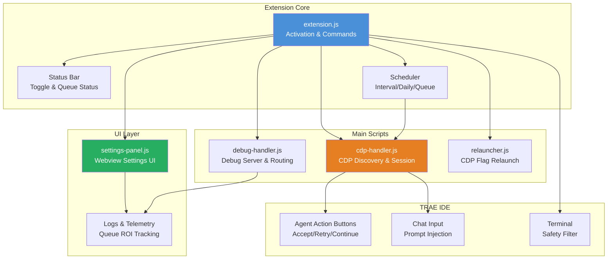
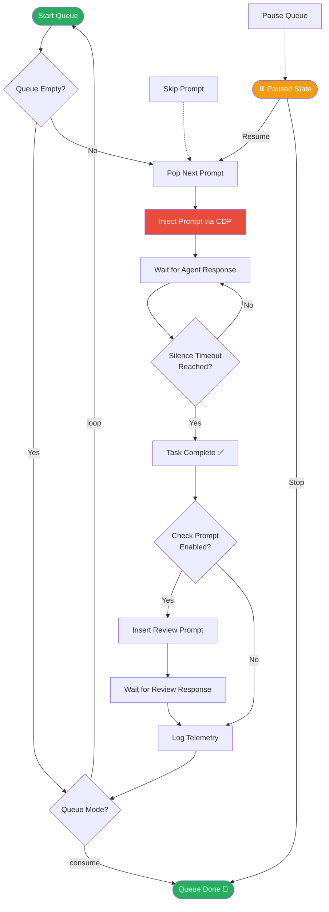

# 🤖 Multi Purpose Agent for TRAE — Tutorial Lengkap

> **Auto-accept, auto-schedule, auto-queue** untuk TRAE IDE. Bikin agent AI lo kerja 24/7 tanpa klik manual.

---

## 📌 Apa Ini?

**Multi Purpose Agent for TRAE** adalah extension VS Code-style yang dibuat khusus buat [TRAE IDE](https://www.trae.ai/) (AI IDE dari ByteDance). Intinya? Extension ini otomatisin semua hal yang biasanya lo klik manual — accept, retry, continue, bahkan kirim prompt secara scheduled.

**Repo:** [github.com/rodhayl/multi-purpose-agent-TRAE](https://github.com/rodhayl/multi-purpose-agent-TRAE)  
**Open VSX:** [open-vsx.org/extension/rodhayl/multi-purpose-agent-trae](https://open-vsx.org/extension/rodhayl/multi-purpose-agent-trae)

### ✨ Fitur Utama

| Fitur | Description |
|-------|-------------|
| 🖱️ Auto-click | Otomatis klik Accept/Retry di agent action buttons |
| 🔄 Continue banner | Auto-klik continue banner pas buka conversation |
| ⏰ Scheduled prompting | 3 mode: interval, daily, queue |
| 🎛️ Queue controls | Start, pause, resume, skip, stop |
| 🛡️ Safety filter | Block dangerous terminal commands |
| 🌐 CDP-backed | Chrome DevTools Protocol untuk prompt sending |
| 📊 Diagnostics | Logs, queue telemetry, ROI tracking |

---

## 🏗️ Architecture — Gimana Kerjanya?

Sebelum install, mending pahami dulu arsitekturnya. Extension ini punya beberapa komponen utama yang saling nyambung:



**Alur datanya gini:**
1. **extension.js** jadi entry point — nangkap activation, register commands, manage scheduler
2. **cdp-handler.js** connect ke TRAE via Chrome DevTools Protocol (CDP) — ini yang bikin bisa inject prompt dan introspect page
3. **debug-handler.js** jalanin debug server buat diagnostics dan command routing
4. **settings-panel.js** render Webview UI buat atur queue, scheduling, dan lihat logs
5. **Scheduler** nge-trigger prompt sesuai mode yang dipilih (interval/daily/queue)

---

## 📥 Cara Install

Ada 3 cara install. Pilih yang paling cocok.

### Method 1: Install dari Open VSX Marketplace *(Paling Gampang)*

```bash
# 1. Buka TRAE IDE
# 2. Buka Extensions panel (Ctrl+Shift+X atau Cmd+Shift+X)
# 3. Search: "multi-purpose-agent-trae"
# 4. Klik Install dari Open VSX
```

Done. Simple banget kan? 😏

### Method 2: Install dari Source *(Manual Build)*

Buwat yang mau custom atau contribute:

```bash
# 1. Clone repo
git clone https://github.com/rodhayl/multi-purpose-agent-TRAE.git

# 2. Masuk directory
cd multi-purpose-agent-TRAE

# 3. Install dependencies
npm install

# 4. Compile
npm run compile

# 5. Package jadi .vsix
npm run package

# 6. Di TRAE: Extensions → Install from VSIX → pilih file .vsix yang baru dibuat
```

### Method 3: Direct Build

Kalo lo sudah di directory repo:

```bash
npm run package
# Hasilnya: file .vsix di root directory
```

---

## ⚠️ CRITICAL: Launch TRAE dengan CDP Flag

Ini step yang **paling sering kelewat** dan bikin extension nggak jalan. TRAE HARUS di-launch dengan remote debugging port.

```bash
# Linux/Mac
trae --remote-debugging-port=9005

# Windows
trae.exe --remote-debugging-port=9005
```

**Port default:** `9005` (bisa diubah di settings)

Kalo lo lupa, extension bakal nampilin guidance buat relaunch. Tinggal follow aja, nggak usah panic.

---

## ⚙️ Konfigurasi Settings

Buka settings panel lewat command palette: `Ctrl+Shift+P` → `auto-accept.openSettings`

Atau edit langsung di `settings.json`:

```json
{
  // Auto-click pas buka conversation (default: true)
  "auto-accept.continue.autoClickOnOpenOrStart": true,

  // --- SCHEDULING ---
  // Aktifkan scheduling (default: false — HARUS di-on-kan dulu!)
  "auto-accept.schedule.enabled": true,

  // Mode scheduling: "interval" | "daily" | "queue"
  "auto-accept.schedule.mode": "queue",

  // Value tergantung mode:
  // - interval: jumlah menit (contoh: 30)
  // - daily: waktu HH:MM (contoh: "09:00")
  // - queue: max-wait dalam detik (contoh: 120)
  "auto-accept.schedule.value": 120,

  // Prompt text buat mode interval/daily
  "auto-accept.schedule.prompt": "Review kode di file ini dan berikan saran improvement",

  // Prompt list buat mode queue (ordered)
  "auto-accept.schedule.prompts": [
    "Review src/api/routes.ts untuk bug potensial",
    "Bikin unit test untuk auth middleware",
    "Optimize database query di user-service",
    "Check security vulnerability di dependencies"
  ],

  // Queue behavior: "consume" (sekali jalan) | "loop" (ulang terus)
  "auto-accept.schedule.queueMode": "loop",

  // Timeout: berapa detik idle sebelum task dianggap selesai
  "auto-accept.schedule.silenceTimeout": 60,

  // Sisipkan review prompt antar queue item
  "auto-accept.schedule.checkPrompt.enabled": true,

  // CDP port (default: 9005)
  "auto-accept.cdp.port": 9005
}
```

---

## 🎛️ Commands — Semua yang Bisa Lo Pakai

Buka command palette (`Ctrl+Shift+P`), ketik `auto-accept`:

| Command | Fungsi |
|---------|--------|
| `auto-accept.toggle` | ON/OFF extension |
| `auto-accept.openSettings` | Buka settings panel Webview |
| `auto-accept.startQueue` | Mulai queue execution |
| `auto-accept.pauseQueue` | Pause queue (bisa resume) |
| `auto-accept.resumeQueue` | Resume paused queue |
| `auto-accept.skipPrompt` | Skip prompt saat ini, lanjut next |
| `auto-accept.stopQueue` | Stop queue entirely |
| `auto-accept.showQueueMenu` | Tampilkan queue status menu |
| `auto-accept.resetSettings` | Reset semua ke default |
| `auto-accept.debugCommand` | Run diagnostics & lihat status |

---

## 🔄 Queue Mode — Workflow Diagram

Ini diagram alur eksekusi queue mode. Mode ini paling powerful buat automated workflow:



**Penjelasan singkat:**
1. Queue pop prompt berikutnya dari list
2. Prompt di-inject ke TRAE via CDP
3. Tunggu agent selesai (detected via silence timeout)
4. Opsional: sisipkan check/review prompt
5. Log telemetry, lalu lanjut ke prompt berikutnya
6. Loop terus atau stop setelah semua selesai

---

## 🎯 Use Case: Automated Code Review Queue

Ini contoh nyata — lo punya project dan mau TRAE review semua file penting secara otomatis, tanpa lo harus duduk di depan komputer.

### Scenario

Lo punya Express.js API project. Pengen TRAE:
1. Review semua route files
2. Bikin unit test yang missing
3. Check security issues
4. Optimize query yang lambat

### Setup

```json
{
  "auto-accept.schedule.enabled": true,
  "auto-accept.schedule.mode": "queue",
  "auto-accept.schedule.value": 120,
  "auto-accept.schedule.queueMode": "consume",
  "auto-accept.schedule.silenceTimeout": 90,
  "auto-accept.schedule.checkPrompt.enabled": true,
  "auto-accept.schedule.prompts": [
    "Review src/routes/auth.ts — cari SQL injection, XSS, dan auth bypass vulnerability. Berikan severity rating.",
    "Review src/routes/users.ts — cek input validation, error handling, dan rate limiting.",
    "Review src/routes/payments.ts — pastikan tidak ada sensitive data yang ke-expose di response.",
    "Bikin unit test untuk src/middleware/auth.ts — cover semua edge case.",
    "Bikin unit test untuk src/utils/validation.ts — minimal 5 test cases.",
    "Review package.json — check untuk known vulnerable dependencies.",
    "Review src/config/database.ts — cek connection pooling, timeout config, dan error recovery.",
    "Optimize query di src/models/User.ts — gunakan indexing dan eager loading yang tepat."
  ]
}
```

### Cara Jalankan

```bash
# 1. Pastikan TRAE launch dengan CDP flag
trae --remote-debugging-port=9005

# 2. Buka project di TRAE
# 3. Buka command palette → auto-accept.startQueue
# 4. Tinggal tinggal — bikin kopi, cek progress dari status bar
```

### Monitoring

- **Status bar** bakal nunjukin queue progress
- **Logs** bisa diakses dari settings panel
- **Skip** prompt yang stuck pakai `auto-accept.skipPrompt`
- **Pause/Resume** kalo perlu interrupt

Pas semua selesai, lo bakal punya:
- ✅ Code review report dari 3 route files
- ✅ Unit tests untuk auth middleware & validation utils
- ✅ Security audit dependencies
- ✅ Database optimization suggestions

**ROI:** Bayangin kalo lo lakuin manual — minimal 4-6 jam. Dengan queue mode? Tinggal jalanin, kerjain hal lain. 🚀

---

## 🛡️ Safety Features

Extension ini punya safety filter buat dangerous terminal commands. Jadi kalo TRAE mau execute command yang berbahaya (e.g., `rm -rf /`, `DROP TABLE`, dll), extension bakal filter itu.

Ini bikin queue mode aman buat ditinggal — nggak bakal ada "accidental nuke" pas lo nggak ngawasin.

---

## 🔧 Troubleshooting

| Masalah | Solusi |
|---------|--------|
| Extension nggak muncul | Pastikan install dari Open VSX, bukan VS Code Marketplace |
| CDP connection failed | Launch TRAE dengan `--remote-debugging-port=9005` |
| Queue stuck | Check `silenceTimeout` — mungkin terlalu pendek untuk complex task |
| Auto-click nggak jalan | Verify `auto-accept.continue.autoClickOnOpenOrStart: true` |
| Prompt nggak ke-send | Cek CDP port match antara settings dan TRAE launch flag |
| Mau debug | Jalankan `auto-accept.debugCommand` di command palette |

---

## 💡 Tips & Best Practices

1. **Mulai dari queue mode `consume`** dulu — biar lo pahami alurnya sebelum pakai `loop`
2. **Set `silenceTimeout` sesuai complexity** — task sederhana 30-60 detik, kompleks 90-180 detik
3. **Aktifkan `checkPrompt`** buat queue panjang — ini kasih lo kesempatan review intermediate results
4. **Pakai `skipPrompt`** kalo satu task stuck — jangan tunggu timeout
5. **Test dulu dengan 1-2 prompt** sebelum queue panjang — pastikan CDP connection stable

---

## 📝 Penutup

Multi Purpose Agent for TRAE ini essentially bikin TRAE IDE jadi "background worker" yang bisa lo schedule dan queue. Buat developer Indonesia yang pake TRAE buat daily coding, extension ini save banget waktu — terutama kalo lo punya workflow yang repetitive kayak code review, test generation, atau refactoring batch.

**Links penting:**
- 📦 [GitHub Repo](https://github.com/rodhayl/multi-purpose-agent-TRAE)
- 🛒 [Open VSX Marketplace](https://open-vsx.org/extension/rodhayl/multi-purpose-agent-trae)

Happy automating! 🔥
