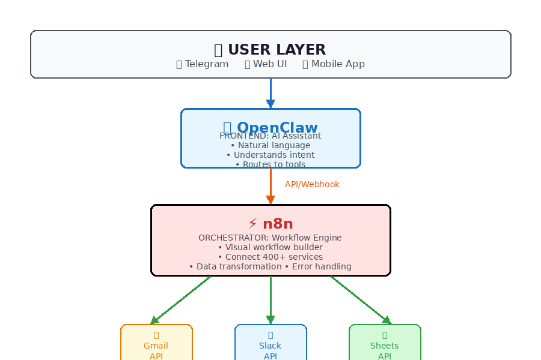
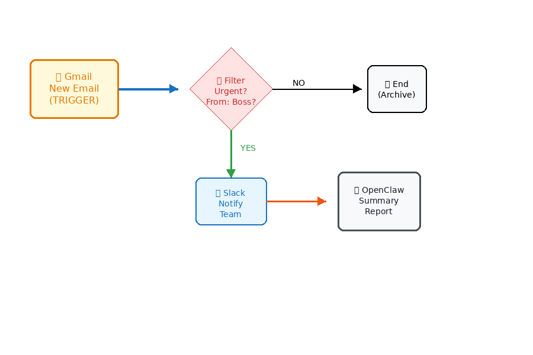

# OpenClaw + n8n Integration Tutorial

Connect OpenClaw to 400+ apps via n8n workflow automation. No coding required.

## Why n8n + OpenClaw?

### The Problem


*Without n8n: Each integration needs custom code and separate OAuth setup*

**Problems:**
- ❌ Each integration needs custom code
- ❌ OAuth setup for every service
- ❌ Maintenance nightmare
- ❌ Hard to modify workflows

### The Solution


*With n8n: One connection, unlimited integrations via visual workflow builder*

**Benefits:**
- ✅ One connection, unlimited integrations
- ✅ Visual drag-and-drop builder
- ✅ No code required
- ✅ Easy to modify

## Example Workflow: Email to Slack


*Example: Gmail → Filter → Slack → OpenClaw Summary*

## Architecture: Who's Backend, Who's Frontend?

```
┌─────────────────────────────────────────────────────────────┐
│                      USER LAYER                             │
│                                                             │
│  💬 Telegram    🌐 Web UI    📱 Mobile                      │
│       │            │            │                           │
└───────┼────────────┼────────────┼───────────────────────────┘
        │            │            │
        └────────────┼────────────┘
                     │
                     ▼
┌─────────────────────────────────────────────────────────────┐
│                  FRONTEND: OpenClaw                         │
│                                                             │
│  • Natural language interface                               │
│  • Understand user intent                                   │
│  • Route tasks to appropriate tools                         │
│  • Personal assistant experience                            │
└────────────────────────┬────────────────────────────────────┘
                         │
                         │ API Call / Webhook
                         ▼
┌─────────────────────────────────────────────────────────────┐
│                 ORCHESTRATOR: n8n                           │
│                                                             │
│  • Visual workflow engine                                   │
│  • Connect multiple services                                │
│  • Data transformation                                      │
│  • Error handling & retries                                 │
│  • Conditional logic                                        │
└────────────┬────────────────────────┬───────────────────────┘
             │                        │
             ▼                        ▼
┌──────────────────────┐  ┌──────────────────────┐
│   BACKEND SERVICES   │  │   BACKEND SERVICES   │
│                      │  │                      │
│  • Gmail API         │  │  • Slack API         │
│  • Google Drive      │  │  • Discord API       │
│  • Google Sheets     │  │  • Telegram Bot      │
│  • Notion API        │  │  • Webhook receivers │
│  • Airtable API      │  │  • Database APIs     │
│                      │  │                      │
└──────────────────────┘  └──────────────────────┘
```

**Summary:**
| Layer | Role | Example |
|-------|------|---------|
| **User Layer** | Interface | Telegram chat |
| **Frontend** | AI Assistant | OpenClaw/Radit |
| **Orchestrator** | Workflow Engine | n8n |
| **Backend** | Service APIs | Gmail, Slack, Notion |

## What You Can Build

### Example 1: Email to Slack Notification

```
┌──────────┐     ┌──────────┐     ┌──────────┐     ┌──────────┐
│  Gmail   │────▶│    n8n   │────▶│  Filter  │────▶│  Slack   │
│  (New    │     │  Trigger │     │ (AI/Key  │     │ (Notify  │
│   Email) │     │          │     │  words)  │     │  Team)   │
└──────────┘     └──────────┘     └──────────┘     └──────────┘
                                                        │
                    ┌───────────────────────────────────┘
                    ▼
            ┌──────────────┐
            │  OpenClaw    │
            │  (Summary    │
            │   Report)    │
            └──────────────┘
```

**Flow:**
1. New email arrives in Gmail
2. n8n detects it (trigger)
3. Filter: Only urgent emails (from boss, contains "ASAP")
4. Send Slack notification to team
5. OpenClaw generates daily summary

### Example 2: Form to Database to Notification

```
┌──────────┐     ┌──────────┐     ┌──────────┐     ┌──────────┐
│  Google  │────▶│    n8n   │────▶│  Google  │────▶│  Email   │
│  Form    │     │  (Parse  │     │  Sheets  │     │ (Confirm │
│(Response)│     │   Data)  │     │ (Store)  │     │  User)   │
└──────────┘     └────┬─────┘     └──────────┘     └──────────┘
                      │
                      ▼
               ┌────────────┐
               │  OpenClaw  │
               │ (Process   │
               │   Request) │
               └────────────┘
```

**Flow:**
1. User submits Google Form (RFQ/tender)
2. n8n parses form data
3. Store in Google Sheets (CRM)
4. Send confirmation email to user
5. OpenClaw reviews and drafts response

### Example 3: Multi-Step Approval Workflow

```
┌──────────┐
│  Request │
│  Created │
└────┬─────┘
     │
     ▼
┌──────────┐     ┌──────────┐
│   n8n    │────▶│ Manager  │
│  (Route  │     │ Approval │
│   Task)  │     └────┬─────┘
└──────────┘          │
                      ▼
               ┌──────────┐
               │ Approved?│
               └────┬─────┘
                    │
           ┌────────┴────────┐
           │                 │
           ▼                 ▼
     ┌──────────┐      ┌──────────┐
     │   Yes    │      │    No    │
     │          │      │          │
     ▼          │      ▼          │
┌──────────┐   │  ┌──────────┐   │
│ Execute  │   │  │  Notify  │   │
│  Task    │   │  │  User    │   │
└──────────┘   │  └──────────┘   │
               │                 │
               └────────┬────────┘
                        │
                        ▼
                 ┌────────────┐
                 │  OpenClaw  │
                 │  (Final    │
                 │   Report)  │
                 └────────────┘
```

## Step-by-Step Setup

### Step 1: Install n8n

**Option A: Self-Host (Recommended for privacy)**

```bash
# Using Docker
docker run -it --rm \
  --name n8n \
  -p 5678:5678 \
  -v ~/.n8n:/home/node/.n8n \
  n8nio/n8n
```

**Option B: Cloud (n8n.io)**
- Sign up at https://n8n.io/cloud
- Free tier: 1,000 executions/month
- No setup required

### Step 2: Create First Workflow

```
┌─────────────────────────────────────────────────────────┐
│                    n8n Editor                            │
│                                                          │
│  ┌─────────────────────────────────────────────────┐    │
│  │  1. ADD TRIGGER                                  │    │
│  │     Click [+] → Search "Webhook" → Select        │    │
│  │                                                  │    │
│  │     [Webhook] ──────►                            │    │
│  │     URL: https://n8n.yourdomain/webhook/xxx      │    │
│  └─────────────────────────────────────────────────┘    │
│                         │                                │
│                         ▼                                │
│  ┌─────────────────────────────────────────────────┐    │
│  │  2. ADD ACTION                                   │    │
│  │     Click [+] → Search "Gmail" → Send Email      │    │
│  │                                                  │    │
│  │     [Webhook] ────► [Gmail]                      │    │
│  │     (Trigger)       (Send Email)                 │    │
│  └─────────────────────────────────────────────────┘    │
│                         │                                │
│                         ▼                                │
│  ┌─────────────────────────────────────────────────┐    │
│  │  3. ADD MORE ACTIONS                             │    │
│  │     Keep adding nodes as needed                  │    │
│  │                                                  │    │
│  │     [Webhook] ────► [Gmail] ────► [Slack]       │    │
│  │     (Trigger)       (Email)       (Notify)      │    │
│  └─────────────────────────────────────────────────┘    │
│                                                          │
│  [💾 Save]  [▶️ Execute]  [🚀 Activate]                   │
└─────────────────────────────────────────────────────────┘
```

### Step 3: Connect OpenClaw to n8n

**Method A: Webhook (Simple)**

```python
# In OpenClaw, call n8n webhook
import requests

n8n_webhook_url = "https://n8n.yourdomain/webhook/abc123"

data = {
    "message": "New task from user",
    "sender": "user@example.com",
    "priority": "high"
}

response = requests.post(n8n_webhook_url, json=data)
```

**Method B: n8n Node (Advanced)**

```
┌─────────────────────────────────────────────────────────┐
│  n8n HTTP Request Node                                   │
│                                                          │
│  Method: POST                                            │
│  URL: https://api.openclaw.ai/v1/execute                │
│  Headers:                                                │
│    Authorization: Bearer YOUR_TOKEN                     │
│  Body:                                                   │
│    {                                                     │
│      "agent": "radit",                                   │
│      "task": "Analyze this email"                       │
│    }                                                     │
└─────────────────────────────────────────────────────────┘
```

### Step 4: Two-Way Communication

```
┌─────────────────────────────────────────────────────────┐
│              TWO-WAY INTEGRATION FLOW                    │
│                                                          │
│  ┌─────────┐              ┌─────────┐              ┌────┴────┐ │
│  │  User   │─────────────▶│ OpenClaw│─────────────▶│   n8n   │ │
│  │ Request │  "Send email │ Process │  "Execute   │ Workflow│ │
│  │         │   via n8n"  │ Intent  │   workflow"  │         │ │
│  └─────────┘              └────┬────┘              └────┬────┘ │
│                                │                        │       │
│                                │                        ▼       │
│                                │               ┌─────────────┐  │
│                                │               │  Call APIs  │  │
│                                │               │  (Gmail,    │  │
│                                │               │   Slack...) │  │
│                                │               └──────┬──────┘  │
│                                │                      │         │
│                                │                      ▼         │
│                                │               ┌─────────────┐  │
│                                └───────────────│   Result    │  │
│                                                │   Back      │  │
│                                                └─────────────┘  │
└─────────────────────────────────────────────────────────────────┘
```

## Popular Use Cases

### 1. Email Processing Pipeline

```
[GMail Trigger] → [AI Filter] → [Classify] → [Route]
                      │              │           │
                      ▼              ▼           ▼
               [Newsletter]   [Urgent]     [Routine]
                    │              │           │
                    ▼              ▼           ▼
               [Mark Read]   [Slack +     [Auto-
                             OpenClaw]    Reply]
```

### 2. Data Entry Automation

```
[Form Submission] → [Validate] → [Save to DB] → [Notify]
                                          │
                                          ▼
                                    [OpenClaw Summary]
```

### 3. Social Media Monitoring

```
[Twitter Mention] → [Analyze] → [Sentiment] → [Action]
                                         │
                    ┌────────────────────┼────────────────────┐
                    ▼                    ▼                    ▼
              [Positive]            [Neutral]            [Negative]
                  │                     │                     │
                  ▼                     ▼                     ▼
            [Thank You]            [Ignore]            [Alert + 
                                                          Response]
```

## Security Best Practices

```
┌─────────────────────────────────────────────────────────┐
│                    SECURITY LAYER                        │
│                                                          │
│  1. API KEYS (n8n Credentials)                          │
│     └─► Encrypted storage                                 │
│     └─► Never expose in workflows                         │
│                                                          │
│  2. WEBHOOK SECURITY                                     │
│     └─► Use random URLs                                   │
│     └─► Add authentication headers                        │
│     └─► IP whitelist                                      │
│                                                          │
│  3. DATA FLOW                                            │
│     └─► Validate all inputs                               │
│     └─► Sanitize before sending to APIs                   │
│     └─► Log for audit                                     │
│                                                          │
│  4. ACCESS CONTROL                                       │
│     └─► Restrict n8n dashboard access                     │
│     └─► Use strong passwords                              │
│     └─► Enable 2FA                                        │
└─────────────────────────────────────────────────────────┘
```

## Troubleshooting

### Webhook Not Triggering?

```
✓ Check URL is correct
✓ Verify workflow is "Active"
✓ Check n8n execution logs
✓ Test with curl:
  curl -X POST https://n8n.yourdomain/webhook/xxx \
    -H "Content-Type: application/json" \
    -d '{"test":"data"}'
```

### Authentication Errors?

```
✓ Re-connect credentials in n8n
✓ Check API scopes/permissions
✓ Verify token not expired
✓ Check service status page
```

### Data Not Passing?

```
✓ Check field names match
✓ Verify data types (string vs number)
✓ Use "Set" node to transform data
✓ Add "Function" node for custom logic
```

## Quick Reference

| Task | n8n Node | OpenClaw Role |
|------|----------|---------------|
| Send Email | Gmail / SendGrid | Trigger / Review |
| Save to Spreadsheet | Google Sheets | Analyze data |
| Post to Slack | Slack | Notify team |
| Create Task | Todoist / Asana | Prioritize |
| Store File | Google Drive / Dropbox | Organize |
| Database Query | PostgreSQL / MySQL | Query builder |
| API Call | HTTP Request | Natural language |
| Schedule Task | Cron / Schedule | Set reminders |

## Next Steps

1. **Install n8n** (self-host or cloud)
2. **Create first workflow** (webhook → email)
3. **Connect OpenClaw** (call webhook from agent)
4. **Build complex flows** (multi-step automations)
5. **Monitor & optimize** (check execution logs)

## Resources

- [n8n Documentation](https://docs.n8n.io)
- [n8n Community](https://community.n8n.io)
- [Workflow Templates](https://n8n.io/workflows)
- [OpenClaw API Docs](https://docs.openclaw.ai)

---

**Tutorial Version:** 1.0  
**Last Updated:** 2026-03-08  
**Compatible With:** OpenClaw 2026.2+, n8n 1.0+
