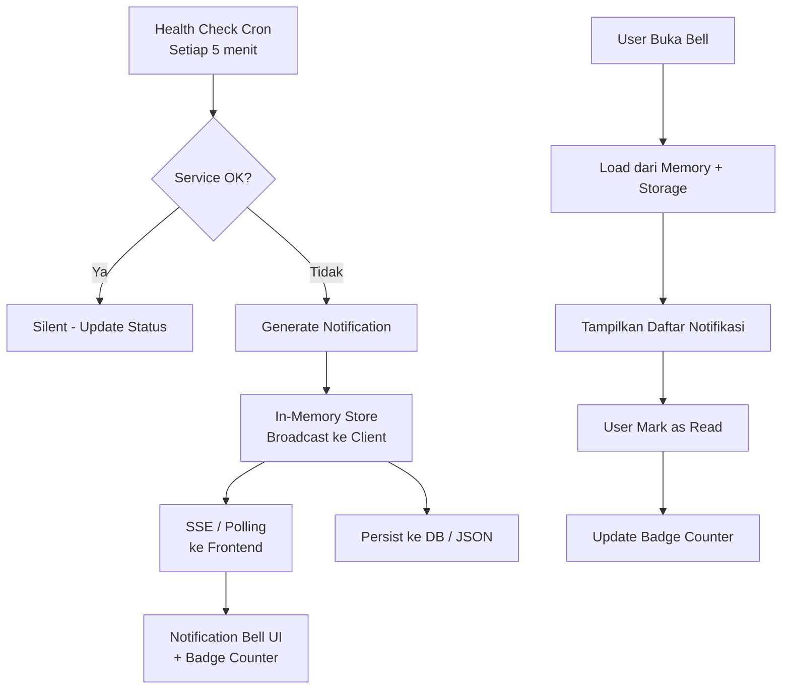

# Real-Time Notification System di Next.js dengan Auto-Health Checks

> Dari zero notification ke dashboard bell yang hidup — lengkap dengan health check otomatis dan persistence.

## Scenario

Dashboard monitoring di PT Contoh Engineering awalnya cuma menampilkan grafik dan tabel. User nggak tau kalau ada service yang down atau threshold yang terlampaui sampai mereka manually refresh halaman. Hasilnya? Insiden terdeteksi rata-rata 30 menit setelah kejadian.

Kita butuh sistem notifikasi yang: (1) muncul real-time di dashboard, (2) persisten antar session, dan (3) otomatis detect masalah lewat health check berkala.

## Arsitektur



Ada tiga layer di sini: **producer** (health check cron), **store** (in-memory + persisted), dan **consumer** (frontend via SSE/polling). Masing-masing bisa di-scale terpisah.

## Step 1: Notification Store

Buat singleton class yang handle in-memory queue plus persistence:

```typescript
// lib/notification-store.ts
interface Notification {
  id: string;
  type: 'error' | 'warning' | 'info';
  title: string;
  message: string;
  timestamp: number;
  read: boolean;
  source: string; // misal: "health-check", "system", "user"
}

class NotificationStore {
  private notifications: Notification[] = [];
  private subscribers: Set<(n: Notification[]) => void> = new Set();
  private persistPath = '/data/notifications.json';

  constructor() {
    this.load();
  }

  // Load dari file saat startup
  private async load() {
    try {
      const fs = await import('fs/promises');
      const data = await fs.readFile(this.persistPath, 'utf-8');
      this.notifications = JSON.parse(data);
    } catch {
      this.notifications = [];
    }
  }

  // Simpan ke file setiap ada perubahan
  private async persist() {
    try {
      const fs = await import('fs/promises');
      await fs.writeFile(
        this.persistPath,
        JSON.stringify(this.notifications, null, 2)
      );
    } catch (err) {
      console.error('[NotificationStore] Persist failed:', err);
    }
  }

  // Tambah notifikasi baru + broadcast
  async add(notification: Omit<Notification, 'id' | 'timestamp' | 'read'>) {
    const entry: Notification = {
      ...notification,
      id: crypto.randomUUID(),
      timestamp: Date.now(),
      read: false,
    };
    this.notifications.unshift(entry);
    // Keep max 200 notifikasi biar nggak bengkak
    this.notifications = this.notifications.slice(0, 200);
    await this.persist();
    this.broadcast();
    return entry;
  }

  // Mark single / all as read
  async markRead(id?: string) {
    if (id) {
      const n = this.notifications.find(n => n.id === id);
      if (n) n.read = true;
    } else {
      this.notifications.forEach(n => (n.read = true));
    }
    await this.persist();
    this.broadcast();
  }

  // Dapatkan unread count
  getUnreadCount() {
    return this.notifications.filter(n => !n.read).length;
  }

  // Dapatkan semua notifikasi (with pagination)
  getAll(limit = 50, offset = 0) {
    return this.notifications.slice(offset, offset + limit);
  }

  // Subscribe untuk real-time updates (SSE)
  subscribe(callback: (n: Notification[]) => void) {
    this.subscribers.add(callback);
    callback(this.notifications); // send current state immediately
    return () => this.subscribers.delete(callback);
  }

  private broadcast() {
    const snapshot = [...this.notifications];
    this.subscribers.forEach(cb => cb(snapshot));
  }
}

// Singleton — satu instance per server process
export const notificationStore = new NotificationStore();
```

## Step 2: Health Check Cron

Gunakan node-cron atau setInterval untuk periodic health check:

```typescript
// lib/health-checker.ts
import cron from 'node-cron';
import { notificationStore } from './notification-store';

interface HealthTarget {
  name: string;
  url: string;
  expectedStatus: number;
  timeoutMs?: number;
}

const targets: HealthTarget[] = [
  { name: 'API Gateway', url: 'https://api.example.com/health', expectedStatus: 200, timeoutMs: 5000 },
  { name: 'Database Proxy', url: 'https://db-proxy.example.com/ping', expectedStatus: 200, timeoutMs: 3000 },
  { name: 'CDN Origin', url: 'https://origin.example.com/alive', expectedStatus: 200, timeoutMs: 8000 },
];

async function checkTarget(target: HealthTarget): Promise<boolean> {
  try {
    const controller = new AbortController();
    const timeout = setTimeout(() => controller.abort(), target.timeoutMs ?? 5000);
    const res = await fetch(target.url, { signal: controller.signal });
    clearTimeout(timeout);
    return res.status === target.expectedStatus;
  } catch {
    return false;
  }
}

let previousFailures = new Set<string>();

async function runHealthChecks() {
  for (const target of targets) {
    const healthy = await checkTarget(target);
    if (!healthy && !previousFailures.has(target.name)) {
      // Baru gagal → kirim notifikasi
      await notificationStore.add({
        type: 'error',
        title: `${target.name} Down`,
        message: `Health check gagal untuk ${target.name}. Endpoint: ${target.url}`,
        source: 'health-check',
      });
      previousFailures.add(target.name);
    } else if (healthy && previousFailures.has(target.name)) {
      // Recovery → kirim info
      await notificationStore.add({
        type: 'info',
        title: `${target.name} Recovered`,
        message: `${target.name} kembali normal.`,
        source: 'health-check',
      });
      previousFailures.delete(target.name);
    }
  }
}

// Jalankan setiap 5 menit
export function startHealthCron() {
  // Initial check saat startup
  runHealthChecks();
  cron.schedule('*/5 * * * *', runHealthChecks);
  console.log('[HealthChecker] Cron started (every 5 minutes)');
}
```

Panggil `startHealthCron()` di layout root Next.js atau di custom server entry point.

## Step 3: API Routes

Buat endpoint untuk frontend consume:

```typescript
// app/api/notifications/route.ts
import { notificationStore } from '@/lib/notification-store';
import { NextRequest } from 'next/server';

export async function GET(request: NextRequest) {
  const { searchParams } = new URL(request.url);
  const format = searchParams.get('format');

  // SSE endpoint untuk real-time
  if (format === 'sse') {
    const encoder = new TextEncoder();
    const stream = new ReadableStream({
      start(controller) {
        const unsubscribe = notificationStore.subscribe((notifications) => {
          const data = JSON.stringify({
            count: notificationStore.getUnreadCount(),
            notifications: notifications.slice(0, 10),
          });
          controller.enqueue(encoder.encode(`data: ${data}\n\n`));
        });
        // Cleanup saat client disconnect
        request.signal.addEventListener('abort', () => {
          unsubscribe();
          controller.close();
        });
      },
    });
    return new Response(stream, {
      headers: {
        'Content-Type': 'text/event-stream',
        'Cache-Control': 'no-cache',
        'Connection': 'keep-alive',
      },
    });
  }

  // Normal REST endpoint (fallback / polling)
  const limit = parseInt(searchParams.get('limit') ?? '50');
  const offset = parseInt(searchParams.get('offset') ?? '0');
  return Response.json({
    count: notificationStore.getUnreadCount(),
    notifications: notificationStore.getAll(limit, offset),
  });
}

export async function PATCH(request: NextRequest) {
  const body = await request.json();
  await notificationStore.markRead(body.id);
  return Response.json({ success: true });
}
```

## Step 4: Frontend Notification Bell

Komponen React yang subscribe ke SSE dan render bell dengan badge:

```tsx
// components/notification-bell.tsx
'use client';
import { useEffect, useState, useRef } from 'react';

interface Notification {
  id: string;
  type: 'error' | 'warning' | 'info';
  title: string;
  message: string;
  timestamp: number;
  read: boolean;
}

export function NotificationBell() {
  const [count, setCount] = useState(0);
  const [notifications, setNotifications] = useState<Notification[]>([]);
  const [open, setOpen] = useState(false);
  const panelRef = useRef<HTMLDivElement>(null);

  useEffect(() => {
    // Coba SSE dulu, fallback ke polling
    let cancelled = false;

    async function connect() {
      try {
        const evtSource = new EventSource('/api/notifications?format=sse');
        evtSource.onmessage = (event) => {
          if (cancelled) return;
          const data = JSON.parse(event.data);
          setCount(data.count);
          setNotifications(data.notifications);
        };
        evtSource.onerror = () => {
          evtSource.close();
          // Fallback ke polling setiap 30 detik
          if (!cancelled) setInterval(poll, 30000);
        };
      } catch {
        if (!cancelled) setInterval(poll, 30000);
      }
    }

    async function poll() {
      if (cancelled) return;
      const res = await fetch('/api/notifications');
      const data = await res.json();
      setCount(data.count);
      setNotifications(data.notifications);
    }

    connect();
    return () => { cancelled = true; };
  }, []);

  // Mark as read
  const markRead = async (id?: string) => {
    await fetch('/api/notifications', {
      method: 'PATCH',
      headers: { 'Content-Type': 'application/json' },
      body: JSON.stringify({ id }),
    });
  };

  // Close panel saat klik di luar
  useEffect(() => {
    const handler = (e: MouseEvent) => {
      if (panelRef.current && !panelRef.current.contains(e.target as Node)) {
        setOpen(false);
      }
    };
    document.addEventListener('mousedown', handler);
    return () => document.removeEventListener('mousedown', handler);
  }, []);

  const typeIcon = (type: string) => {
    if (type === 'error') return '🔴';
    if (type === 'warning') return '🟡';
    return '🟢';
  };

  return (
    <div className="relative" ref={panelRef}>
      <button
        onClick={() => setOpen(!open)}
        className="relative p-2 rounded-lg hover:bg-gray-100 transition"
      >
        🔔
        {count > 0 && (
          <span className="absolute -top-1 -right-1 bg-red-500 text-white text-xs rounded-full w-5 h-5 flex items-center justify-center">
            {count > 99 ? '99+' : count}
          </span>
        )}
      </button>

      {open && (
        <div className="absolute right-0 mt-2 w-96 max-h-[500px] overflow-y-auto bg-white shadow-xl rounded-xl border z-50">
          <div className="p-3 border-b flex justify-between items-center">
            <h3 className="font-semibold">Notifikasi</h3>
            {count > 0 && (
              <button
                onClick={() => markRead()}
                className="text-xs text-blue-500 hover:underline"
              >
                Tandai semua dibaca
              </button>
            )}
          </div>
          {notifications.length === 0 ? (
            <p className="p-4 text-gray-400 text-sm text-center">Tidak ada notifikasi</p>
          ) : (
            notifications.map((n) => (
              <div
                key={n.id}
                onClick={() => markRead(n.id)}
                className={`p-3 border-b cursor-pointer hover:bg-gray-50 transition ${
                  !n.read ? 'bg-blue-50/50' : ''
                }`}
              >
                <div className="flex items-start gap-2">
                  <span>{typeIcon(n.type)}</span>
                  <div className="flex-1 min-w-0">
                    <p className="font-medium text-sm">{n.title}</p>
                    <p className="text-xs text-gray-500 mt-0.5 truncate">{n.message}</p>
                    <p className="text-xs text-gray-400 mt-1">
                      {new Date(n.timestamp).toLocaleString('id-ID')}
                    </p>
                  </div>
                  {!n.read && <span className="w-2 h-2 bg-blue-500 rounded-full mt-1.5 shrink-0" />}
                </div>
              </div>
            ))
          )}
        </div>
      )}
    </div>
  );
}
```

Taruh `<NotificationBell />` di header dashboard — done.

## Step 5: Startup Hook

Di `layout.tsx` atau custom server, pastikan cron jalan:

```typescript
// app/layout.tsx
import { startHealthCron } from '@/lib/health-checker';

// Next.js 14+: pakai instrumentation hook
// instrumentation.ts di root project
export async function register() {
  if (process.env.NEXT_RUNTIME === 'nodejs') {
    const { startHealthCron } = await import('@/lib/health-checker');
    startHealthCron();
  }
}
```

## Troubleshooting

| Masalah | Penyebab | Solusi |
|---------|----------|--------|
| Notifikasi nggak muncul | SSE koneksi drop | Fallback ke polling 30 detik |
| Duplicate notifikasi | Cron double-fire | Guard dengan `previousFailures` set |
| Notifikasi hilang setelah restart | Persist gagal | Cek write permission ke `/data/` |
| Memory leak | Subscriber nggak di-unsubscribe | Cleanup di `abort` event |

## Hasil

- ⚡ Notifikasi muncul < 1 detik setelah health check gagal
- 💾 200 notifikasi terakhir persisten antar restart
- 🔔 Badge counter auto-update via SSE
- 🔄 Recovery notification otomatis saat service balik normal
