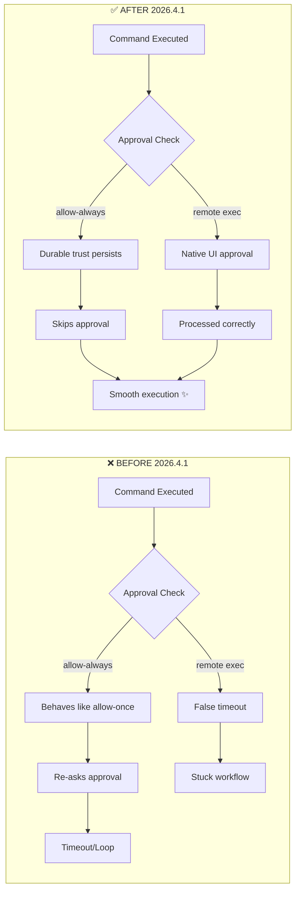
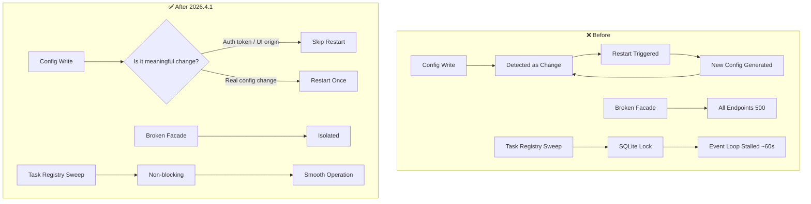
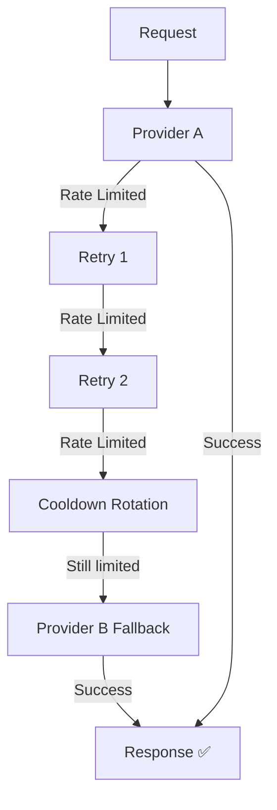

# OpenClaw 2026.4.1: Exec Approvals Fix yang Ditunggu-tunggu 💥


> **Source:** [Rama Digital — OpenClaw 2026.4.1 Exec Approvals Fix](https://ramadigital.id/blog/openclaw-2026-4-1-exec-approvals-fix) oleh Rama Aditya
> **Published:** 2 April 2026

---

## 🤔 Kenapa 2026.4.1 Ini Big Deal?

Kalo lo pake OpenClaw buat automation — apalagi yang heavy di exec commands — pasti udah familiar sama drama exec approvals. False timeout, approval loop yang nggak jelas, `allow-always` yang behave kayak `allow-once`... Basically, sistem approval yang seharusnya nge-save waktu justru bikin workflow stuck.

Nah, 2026.4.1 (release 1 April 2026) dateng sebagai update yang ngeberesin masalah ini secara total. **15+ perbaikan besar** di satu release — dari exec approvals, gateway stability, model failover, sampai channel improvements.

FYI, ini bukan April Fool ya. Fix-nya real dan impact-nya langsung terasa.

━━━━━━━━━━━━

## 🔧 Exec Approvals: 10 Fix yang Ngeberesin Semua

Ini bagian yang paling dinantikan. Exec approvals udah jadi pain point ber-release-release, dan tim OpenClaw akhirnya fix semuanya di satu update ini:

### 1. exec-approvals.json Sekarang Honor Security Defaults ✅

Sebelumnya, ada kondisi di mana inline atau configured tool policy yang belum diset bikin approval flow jatuh ke state yang salah. Sekarang `exec-approvals.json` bener-bener jadi source of truth — security defaults di-honor dengan benar.

**Artinya:** Kalau lo define policy di config, itu yang dipakai. Ngga ada lagi "kebetulan" fallback ke default yang salah.

### 2. Remote Exec False Approval Timeout Fixed (Slack/Discord) 🎯

Yang pake Slack atau Discord pasti pernah ngalamin ini: agent minta approval, lo approve, tapi tetap timeout karena inferred approvers nggak align sama channel enablement.

Sekarang native approval handling di Slack dan Discord udah align — approval yang lo berikan beneran diproses, nggak phantom timeout.

### 3. Allow-Always Sekarang Persist sebagai Durable Trust 🔒

Ini mungkin bug paling annoying. Lo pilih `allow-always` tapi behavior-nya kayak `allow-once` — command yang sama minta approval lagi di exec berikutnya.

**Fixed.** `allow-always` sekarang bener-bener persist sebagai durable user-approved trust entry. Satu kali allow, selamanya allow (kecuali lo revoke).

### 4. Static Allowlist Berhenti Bypass ask:"always" 🛡️

Kalo lo set `ask:"always"` di policy, seharusnya semua command minta approval. Tapi static allowlist entries dulu bisa silently bypass ini.

Sekarang nggak lagi. `ask:"always"` = selalu minta approval, tanpa kecuali. Expectation match dengan reality.

### 5. Shell-Wrapper Paths Reuse Exact-Command Trust 🔄

Trust yang nggak bisa persist sebagai executable allowlist entry (karena path berubah atau dynamic) sekarang ditangani dengan benar. Shell-wrapper paths bisa reuse trust dari exact-command yang udah di-approve.

### 6. Windows Approval Handling Fixed 🪟

Windows user yang ngga bisa build allowlist execution plan — sekarang nggak hard-dead-end lagi. Sistem bakal minta explicit approval, bukan silent fail.

### 7. Cron/Exec Isolated No-Route Dead-ends Resolved ⏰

Trusted automation lewat cron sekarang bisa jalan tanpa approval loop. Sebelumnya, ada kondisi di mana cron jobs yang isolated nggak punya route ke approval system — akhirnya stuck atau dead-end.

### 8. openclaw Doctor Warns Ketika Config Conflict ⚠️

Jalankan `openclaw doctor` dan sekarang dia bisa detect kalau `tools.exec` policy lebih luas dari `exec-approvals.json`. Conflict detection yang sebelumnya nggak ada — sekarang ada, dan cukup helpful buat debugging.

### 9. WebChat Exec Approvals Pakai Native Approval UI 💬

Dulu di WebChat, lo harus copy-paste manual `/approve` command. Nggak intuitive, sering gagal, dan frustrating.

Sekarang WebChat punya native approval UI — kayak di Telegram atau Discord, lo tinggal klik Approve/Deny. Way better UX.

### 10. Node Commands Pinned ke Node-Pair Record 🔗

Per-node `system.run` policy sekarang ada di exec approvals config, bukan di pairing record. Lebih centralized, lebih predictable, nggak tersebar di mana-mana.

### Diagram: Exec Approval Flow Before vs After



━━━━━━━━━━━━

## 🌐 Gateway & Infrastructure Improvements

Gateway adalah jantung OpenClaw, dan beberapa fix ini mencegah cascade failures yang dulu bisa bikin semuanya down:

### Gateway Reload Nggak Lagi Restart Loop

Startup config writes — seperti auth tokens dan Control UI origins yang di-generate — sekarang nggak dianggap sebagai perubahan yang butuh restart. Dulu, config write bisa trigger restart loop yang bikin gateway flapping.

### Broken Facade Nggak Cascade 500s

Satu facade yang broken sekarang nggak bikin semua HTTP endpoint return 500. Isolation yang bener — satu komponen down, yang lain tetap jalan.

### Task Registry Nggak Stall Gateway

Task registry maintenance sweep dulu bisa stall gateway event loop under SQLite pressure. Akibatnya, gateway hang ~1 menit setelah startup. Sekarang sudah fixed — smooth startup tanpa hang.

Stale completed background tasks juga nggak muncul lagi di `/status` dan `session_status`. Cleaner output, more accurate monitoring.



━━━━━━━━━━━━

## 🤖 Agent & Model Improvements

### /tasks — Chat-Native Background Task Board

Fitur baru `/tasks` yang jadi background task board buat current session. Lo bisa lihat recent tasks, fallback counts, dan status — semua dari dalam chat. Nggak perlu switch ke terminal atau Web UI.

### agents.defaults.params — Global Provider Parameters

Sekarang lo bisa set global default provider parameters lewat `agents.defaults.params`. Nggak perlu repeat config di setiap agent — centralized param management.

### Rate-Limit Failover yang Lebih Smart

Ini improvement yang subtle tapi penting. Dulu, rate-limit errors langsung trigger cross-provider fallback. Sekarang, ada prompt-side retry cap per provider sebelum fallback ke provider lain.

Ada knob baru: `auth.cooldowns.rateLimitedProfileRotations` — biar lo bisa kontrol berapa banyak rotation sebelum fallback.



### Anthropic Thinking Blocks Preservation

Yang pake Anthropic models — thinking blocks dan signatures sekarang preserved across replay, cache-control patching, dan context pruning. Nggak hilang di tengah jalan.

### Consistent Compaction Model Resolution

`agents.defaults.compaction.model` sekarang resolve consistently untuk manual `/compact` dan context-engine compaction paths. Dulu bisa beda behavior tergantung path yang dipakai.

━━━━━━━━━━━━

## 📱 Channel Updates

Beberapa perbaikan di channel integrations:

**Telegram:**
- `errorPolicy` dan `errorCooldownMs` buat suppress repeated delivery errors
- Non-idempotent sends ada di strict safe-send path
- Topic-aware exec approval followups lewat Telegram threading
- Local Bot API: media MIME types preserved

**WhatsApp:**
- `reactionLevel` guidance buat agent reactions
- Inbound message timestamp passed ke model context

**Discord:**
- Attachment dan sticker downloads lewat shared idle-timeout path

**LINE:**
- Fix: channels start correctly setelah global npm installs (regression dari 2026.3.31)

**Feishu:**
- Dedicated Drive comment-event flow dengan comment-thread context

━━━━━━━━━━━━

## ⚠️ Breaking Changes dari 2026.3.31

Ada beberapa breaking changes yang di-introduce di 2026.3.31 yang masih relevant:

- **Nodes/exec:** Duplicated `nodes.run` shell wrapper di-remove. Node shell execution selalu lewat `exec host=node`
- **Plugin SDK:** Legacy provider compat subpaths deprecated, migration warnings emitted
- **Skills/Plugins install:** Critical findings fail closed by default — install yang sebelumnya succeed mungkin butuh `--dangerously-force-unsafe-install`
- **Gateway/auth:** Trusted-proxy reject mixed shared-token configs
- **Gateway/node commands:** Disabled sampai node pairing approved
- **Gateway/node events:** Node-originated runs stay on reduced trusted surface

Yang paling impact: **skills/plugins install behavior**. Kalo lo punya install script yang automated, cek apakah butuh flag `--dangerously-force-unsafe-install` setelah update.

━━━━━━━━━━━━

## 📦 Cara Update

Update-nya straightforward. Ikutin step ini:

### 1. Cek Versi yang Lagi Jalan

```bash
openclaw --version
```

### 2. Backup Config (Recommended)

```bash
cp -r ~/.openclaw/config ~/.openclaw/config-backup-$(date +%Y%m%d)
```

### 3. Update ke Latest Stable

```bash
npm install -g openclaw@latest
```

Atau pake CLI:

```bash
openclaw update
```

### 4. Mau Coba Beta Channel?

```bash
openclaw update --channel beta
```

### 5. Restart Gateway

```bash
openclaw gateway restart
```

Selesai! 🎉

━━━━━━━━━━━━

## ✅ Post-Update Checklist

Setelah update, ada beberapa hal yang sebaiknya lo verify:

- [ ] **Versi sudah benar** — `openclaw --version` harus nunjukkin `2026.4.1` atau lebih baru
- [ ] **Gateway jalan normal** — `openclaw gateway status` show running, nggak flapping
- [ ] **Exec approvals working** — coba jalankan command yang perlu approval, verify native UI muncul
- [ ] **Allow-always persist** — approve sebuah command dengan allow-always, jalankan lagi, harus skip approval
- [ ] **Cron jobs jalan** — pastikan cron automation nggak stuck di dead-end
- [ ] **`openclaw doctor` bersih** — jalankan dan cek ada nggak warnings tentang tools.exec conflict
- [ ] **Channel integrasi OK** — test kirim pesan lewat Telegram/Discord/WhatsApp
- [ ] **Breaking changes checked** — review plugin install scripts, node pairing, dan trusted-proxy config

━━━━━━━━━━━━

## 🔗 Useful Links

- 📋 [Release Notes Lengkap — GitHub](https://github.com/openclaw/openclaw/releases)
- 📚 [Dokumentasi OpenClaw](https://docs.openclaw.ai)
- 📰 [Artikel Asli — Rama Digital](https://ramadigital.id/blog/openclaw-2026-4-1-exec-approvals-fix)

---

> Tutorial ini dibuat berdasarkan artikel dari [ramadigital.id](https://ramadigital.id) oleh Rama Aditya. Credit penuh untuk konten sumber dan analisis originalnya.
