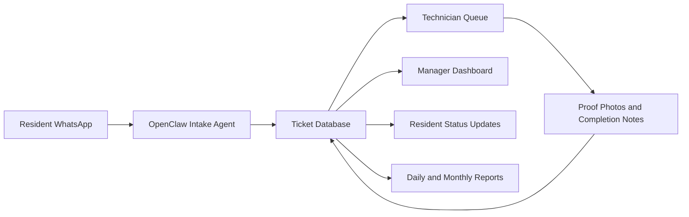
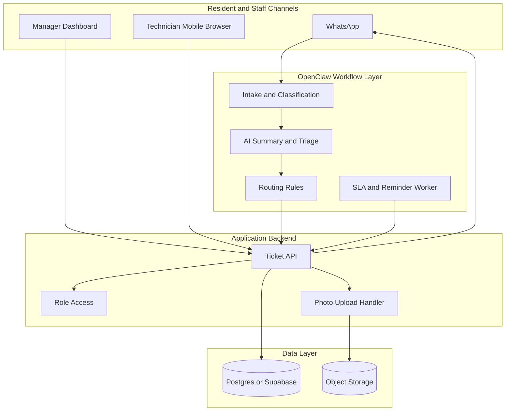
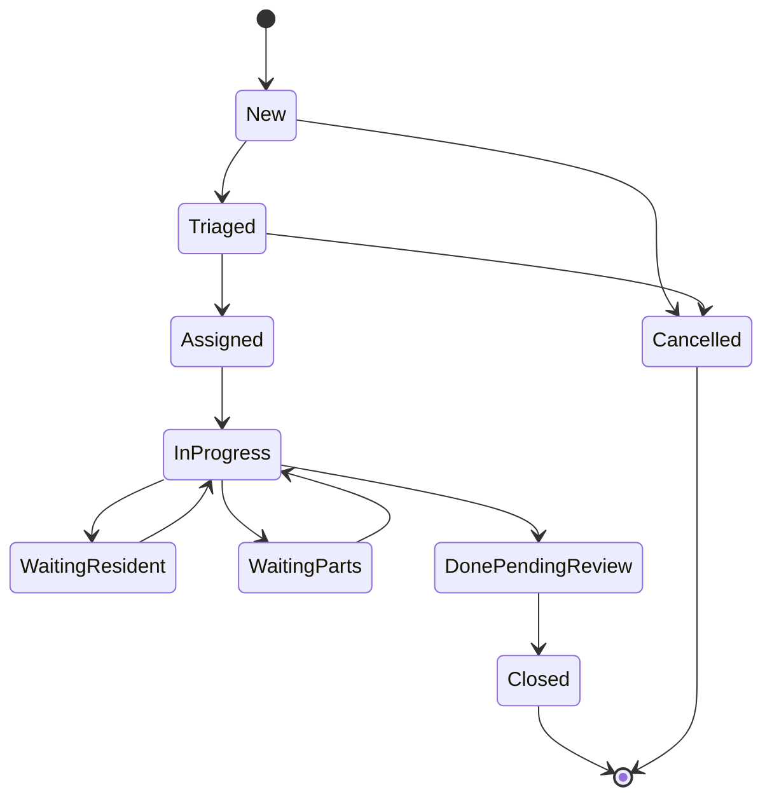
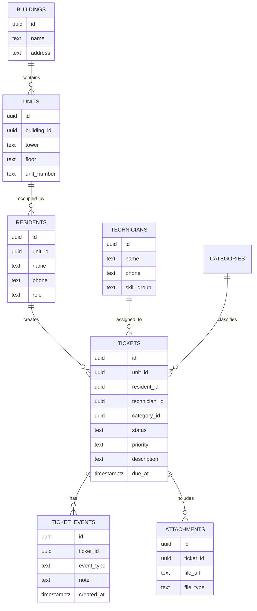
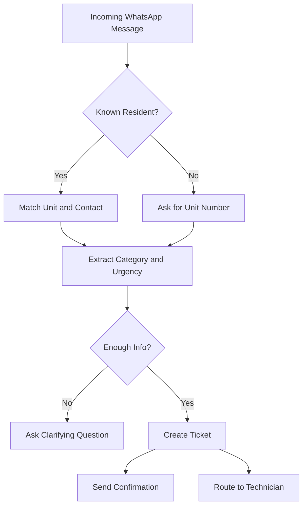
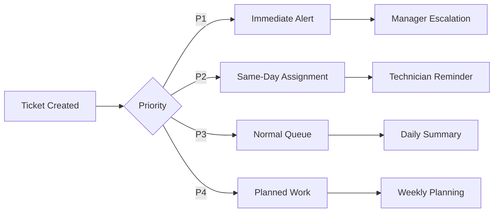
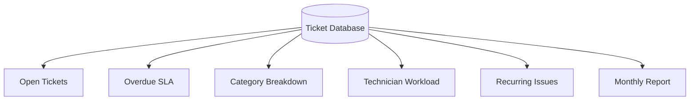
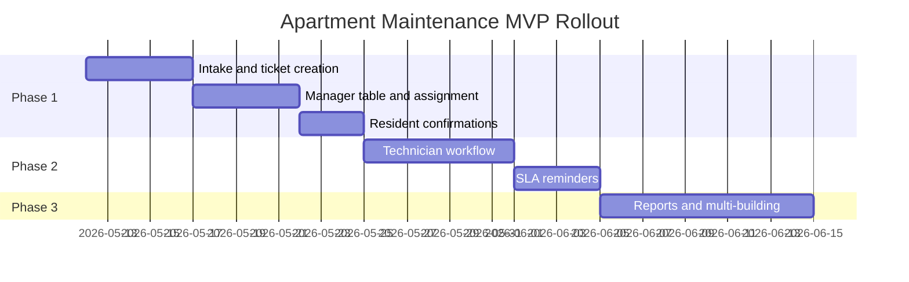

# Using OpenClaw for Apartment Maintenance Operations
## A practical pattern for resident requests, technician dispatch, SLA tracking, WhatsApp updates, and management visibility without forcing every resident into a custom app

> **Estimated reading time:** 32 to 38 minutes  
> **Difficulty:** Intermediate  
> **Best for:** Apartment operators, facility managers, property management teams, maintenance contractors, strata managers, and automation builders who need a practical resident maintenance workflow

---


## Before We Start

This is the technical English version.

If you want the easier mixed Indonesian + English walkthrough, read the companion blog post here:

**https://blog.fanani.co/tech/openclaw-apartment-maintenance/**

If you need a VPS to run OpenClaw, WhatsApp automation, ticket workers, dashboards, scheduled reports, and AI-assisted summaries, use our affiliate link here:

**https://blog.fanani.co/sumopod**

If you want a custom apartment maintenance or property operations system like this for your own building, you can contact:

- **fanani@cvrfm.com**
- **+628115443456**

Consultation is available.

---

## 1. Pain Point Real

Apartment maintenance looks simple from the outside.

A resident reports a leaking pipe. A staff member creates a work order. A technician visits the unit. The issue is fixed. Everyone moves on.

In real operations, it is rarely that clean.

The request arrives in WhatsApp, then another request arrives by phone, then a tenant tells the security guard, then the owner messages the building manager directly. Photos are scattered. Unit numbers are typed in different formats. A technician says the job is done, but there is no photo proof. A resident says nobody came. Management asks for monthly maintenance statistics, but the data is trapped in chat history.

This is where apartment maintenance becomes a workflow problem, not just a repair problem.

Common pain points include:

- maintenance requests arrive through too many channels
- unit numbers are missing or inconsistent
- urgent requests are mixed with minor complaints
- technicians get assignments through informal chat
- no consistent SLA tracking exists
- residents keep asking for status updates
- managers cannot easily see open, overdue, and completed tasks
- proof-of-work photos are not linked to the original request
- recurring issues are invisible until they become expensive

OpenClaw is useful here because it can act as the operational layer above WhatsApp, a database, dashboards, scheduled reports, and human approvals.

It is not trying to replace a full enterprise property management system on day one.

It gives you a practical starting point that fits how people already communicate.

---

## 2. Why WhatsApp and OpenClaw Fit This Well

For apartment buildings, the best interface is often the one residents already use.

That is usually WhatsApp.

Residents do not want to install another app just to report a broken faucet. Technicians do not want a complex mobile system for a simple task. Management does not want to manually copy chat messages into spreadsheets.

OpenClaw helps connect those pieces.



The practical role of OpenClaw is to:

- receive maintenance messages
- classify request type
- extract unit number, contact, photos, and urgency
- create a ticket
- route it to the right person
- send status updates back to the resident
- remind technicians about pending work
- summarize open and overdue jobs for management

That is a strong fit because OpenClaw is good at messaging, workflows, tool calls, scheduling, and human-in-the-loop automation.

---

## 3. High-Level Architecture

A simple apartment maintenance stack can be built with five layers.

1. **Resident channel** — WhatsApp intake for requests and updates.
2. **OpenClaw workflow layer** — classification, routing, reminders, escalation, reports.
3. **Backend API** — ticket CRUD, authentication, file uploads, role permissions.
4. **Database and storage** — tickets, units, residents, technicians, proof photos.
5. **Dashboard** — manager view for open tasks, SLA, categories, and history.



This design keeps the building staff workflow simple.

Residents talk through WhatsApp. Technicians can open a lightweight web page. Managers get a dashboard. OpenClaw sits in the middle and keeps the process moving.

---

## 4. Ticket Lifecycle

Every maintenance request should move through predictable states.

A simple lifecycle is enough for most buildings:

- **new** — request received, not yet validated
- **triaged** — category and urgency assigned
- **assigned** — technician or vendor selected
- **in_progress** — technician accepted or started work
- **waiting_resident** — need access, confirmation, or additional information
- **waiting_parts** — spare part or vendor material needed
- **done_pending_review** — work done, waiting for management or resident confirmation
- **closed** — ticket finished and archived
- **cancelled** — invalid, duplicate, or withdrawn request



This lifecycle matters because it makes status updates easier.

Instead of saying “we will check,” the system can send a clear update:

> Your maintenance request for Unit B-1205 has been assigned to the electrical team. Current status: assigned. Estimated visit: today before 16:00.

That kind of message reduces repeated follow-ups.

---

## 5. Data Model

The data model should be boring.

Boring data models survive real operations.

Start with these core tables:



You can add more later, but do not start with too many tables.

The first goal is reliable operations:

- who reported it
- which unit
- what category
- how urgent
- who owns it
- what status
- what proof exists
- when it was closed

That is enough to create accountability.

---

## 6. Intake and Classification

The intake flow is where OpenClaw provides a lot of value.

A resident may send:

> Pak, AC kamar utama bocor. Unit A-1708. Ini foto airnya netes terus.

OpenClaw should extract:

- unit: A-1708
- category: air conditioning
- urgency: medium or high depending on keywords
- description: AC leak in master bedroom
- attachments: photo list
- resident phone: sender number
- suggested team: HVAC technician



Use AI for natural-language extraction, but keep hard validation rules.

For example:

- unit number must match existing unit records
- emergency categories should trigger a fast path
- duplicate requests from the same unit within a short window should be checked
- photo attachments should be stored before ticket confirmation

AI should help, not blindly decide everything.

---

## 7. Priority and SLA Rules

Not every request is equal.

A broken light in a corridor and water leaking into an electrical panel should not get the same SLA.

A simple priority model:

| Priority | Examples | Target Response | Escalation |
|---|---|---:|---|
| P1 Emergency | flooding, electrical hazard, fire alarm issue, lift trapped passenger | 5 to 15 minutes | notify manager immediately |
| P2 High | no water in unit, AC leak, door lock failure | 1 to 2 hours | remind technician and supervisor |
| P3 Normal | minor plumbing, light replacement, noisy fan | same day or next day | daily queue reminder |
| P4 Low | cosmetic issue, suggestion, non-urgent request | planned schedule | weekly report |



OpenClaw can run scheduled checks every few minutes:

- find overdue P1 tickets
- find P2 tickets not assigned within target time
- find technician jobs stuck in progress
- send daily digest to managers
- send resident update if ticket is delayed

That is the operational magic.

---

## 8. Technician Workflow

Technicians need a low-friction workflow.

Do not make them fill a complex form for every small repair.

A practical technician flow:

1. receive assignment via WhatsApp or technician dashboard
2. open ticket details
3. view resident contact, unit number, description, photos
4. tap **Start Work**
5. add notes and proof photo
6. tap **Mark Done**
7. system sends resident confirmation message

Technician actions should create audit events.

Example events:

- `ticket_assigned`
- `technician_started`
- `photo_uploaded`
- `status_changed`
- `resident_notified`
- `ticket_closed`

This makes monthly reporting easier.

It also helps when there is a dispute.

If a resident says nobody came, management can check timestamped events and proof photos.

---

## 9. Resident Updates

Residents mostly want clarity.

They want to know:

- was my request received?
- who is handling it?
- when will someone come?
- is it delayed?
- is it done?

OpenClaw can send controlled templates.

Examples:

**Confirmation**

> Thank you. Your maintenance request has been recorded as Ticket MT-2026-0511-0042 for Unit A-1708. Category: AC leak. We will update you after assignment.

**Assignment**

> Ticket MT-2026-0511-0042 has been assigned to the HVAC team. Estimated visit: today between 13:00 and 15:00.

**Delay**

> Update for Ticket MT-2026-0511-0042: the technician needs a replacement part. We will update you again after the part is ready.

**Completion**

> Ticket MT-2026-0511-0042 has been marked done. Please reply if the issue still needs attention.

Keep the tone short and factual.

Do not over-automate apologies or promise a time unless the system has a real schedule.

---

## 10. Manager Dashboard

The manager dashboard should answer operational questions quickly.

Useful widgets:

- open tickets by priority
- overdue tickets
- tickets by category
- average response time
- average completion time
- technician workload
- recurring units or recurring issue categories
- daily closed ticket count
- resident satisfaction follow-up



Start with simple views:

- **Today** — what needs attention now
- **Open** — all active tickets
- **Overdue** — SLA risk
- **Closed** — history and proof
- **Reports** — weekly and monthly summary

Do not build a beautiful dashboard before the ticket workflow works.

The workflow creates data. The dashboard visualizes the data.

That order matters.

---

## 11. MVP Rollout

A good apartment maintenance MVP should be small enough to deploy fast.

Phase 1:

- WhatsApp intake
- ticket creation
- manual assignment
- resident confirmation
- simple manager table
- proof photo upload

Phase 2:

- technician dashboard
- SLA reminders
- category-based routing
- daily manager digest
- duplicate request detection

Phase 3:

- recurring issue analysis
- vendor workflows
- resident satisfaction check
- monthly PDF report
- multi-building support



This rollout avoids the common mistake of building too much before testing the real communication pattern.

---

## 12. Hosting on SUMOPOD

This system needs a small but reliable always-on server.

A typical stack:

- OpenClaw gateway
- WhatsApp connector
- backend API
- Postgres or Supabase client
- storage integration
- dashboard frontend
- scheduled reminder worker

A VPS is a clean fit for this.

If you want to try this architecture on a VPS, use the SUMOPOD affiliate link:

**https://blog.fanani.co/sumopod**

For a small building, start modestly. For multiple towers or many properties, separate the database, storage, and worker services more carefully.

The important part is not raw server power.

The important part is uptime, backups, logs, and a deployment routine you trust.

---

## 13. How to Productize This for Clients

Apartment maintenance automation can become a repeatable service package.

Possible packages:

**Starter**

- WhatsApp intake
- ticket database
- manual assignment
- basic dashboard

**Operations**

- technician workflow
- SLA reminders
- proof photos
- daily digest

**Portfolio**

- multi-building support
- reports
- recurring issue analytics
- vendor routing
- role-based dashboards

Good client discovery questions:

- How many units are in the building?
- How many maintenance requests arrive per day?
- What channels do residents use today?
- Who assigns technicians?
- How do you prove work completion?
- Which categories are emergency?
- What report does management ask for every month?

Those answers shape the workflow more than the technology stack.

---

## Real-World Design Principle

Do not force residents, technicians, and managers into one heavy system.

Use the right interface for each role.

- residents use WhatsApp
- technicians use a lightweight mobile workflow
- managers use a dashboard
- OpenClaw coordinates the automation
- the database keeps the truth

That boundary keeps the system usable.

---

<!-- EXPANDED-3000 -->

## 14. Resident Intake Design

The intake flow is the most important part of an apartment maintenance system. If residents cannot report issues easily, the rest of the workflow does not matter.

Do not start with a complicated form. Start with the communication channel residents already use. In Indonesia, that usually means WhatsApp. A resident should be able to send:

```text
AC kamar utama bocor, air netes ke lantai. Unit 12B. Bisa dicek hari ini?
```

OpenClaw should convert that messy message into structured data:

| Field | Example |
|---|---|
| Unit | 12B |
| Category | AC / HVAC |
| Issue | Water leakage from indoor unit |
| Priority | Medium or High depending on severity |
| Requested time | Today |
| Resident contact | WhatsApp sender |
| Attachment | Photo if provided |

The resident should not need to know categories, ticket codes, or SLA rules. The system can infer those. But the system should ask follow-up questions when key data is missing.

For example:

```text
Terima kasih. Untuk laporan AC bocor, boleh kirim nomor unit dan foto kondisi saat ini?
```

This keeps the flow human. It also prevents incomplete tickets.

## 15. Technician Assignment Rules

Technician routing can start simple. You do not need a complex workforce optimization engine on day one.

Common routing rules:

- Plumbing issues go to plumbing technician or general maintenance
- Electrical issues go to electrical technician only
- AC issues go to HVAC technician
- Access card and door issues go to security or building admin
- Structural leaks go to supervisor review first
- Emergency issues notify both technician and supervisor

A practical assignment table:

| Category | Default Team | Escalation |
|---|---|---|
| Plumbing | Maintenance Team A | Supervisor after 4 hours |
| Electrical | Electrical Technician | Supervisor immediately if safety risk |
| AC | HVAC Vendor / Technician | Building manager if repeated issue |
| Lift | Lift Vendor | Supervisor immediately |
| Security access | Security desk | Building admin |
| Civil / leak | Maintenance Team B | Supervisor if water damage |

The goal is not perfect routing. The goal is to stop tickets from sitting in the wrong chat group.

If technician availability is unknown, round-robin assignment is acceptable for MVP. Later, add workload balancing, shift schedules, skill tags, and vendor SLA rules.

## 16. SLA That Does Not Lie

SLA rules should reflect real operational capacity. Do not promise response in 15 minutes if the building has one technician covering three towers.

Start with categories:

| Priority | Example | Response Target | Resolution Target |
|---|---|---:|---:|
| Critical | Electrical hazard, major leak, lift trapped passenger | 10 minutes | Immediate handling |
| High | AC leak, pipe leak, access failure | 30 minutes | Same day |
| Medium | Minor repair, noisy fixture, small seepage | 4 hours | 2 working days |
| Low | Cosmetic issue, scheduled inspection | 1 working day | Scheduled |

Track two different things: first response and resolution. Many teams confuse them. A technician saying “received” is not the same as fixing the problem.

OpenClaw can send reminders:

- Ticket created
- Technician assigned
- First response due soon
- SLA breached
- Resident update required
- Ticket waiting for resident confirmation
- Ticket closed

This makes SLA visible without needing everyone to open a dashboard.

## 17. Photo Evidence and Closure Discipline

Maintenance tickets need evidence. Not because you distrust technicians, but because property operations need accountability.

For each ticket, require:

- Before photo if possible
- Technician note
- Parts used if any
- After photo
- Closure category: fixed, temporary fix, vendor needed, resident unavailable, duplicate, rejected
- Resident confirmation if required

A good closure message to resident:

```text
Update ticket MT-2405-018
Issue: AC leak at Unit 12B
Status: Completed
Technician note: Drain line cleaned and water test completed.
Please reply OK if the issue is resolved, or REOPEN if the problem continues.
```

This is much better than “done.” It gives the resident a clear next action.

For management, photo evidence reduces disputes. If a resident says the team never came, there is a timestamped record. If the same issue repeats, the history helps diagnose root cause.

## 18. Vendor and Spare Part Handling

Not all maintenance work is internal. Lift, fire alarm, access control, pumps, and HVAC may involve vendors.

OpenClaw can still manage the workflow:

- Create ticket from resident or staff report
- Classify as vendor-required
- Notify vendor contact
- Track vendor response
- Store quotation or service report
- Remind building team if vendor is late
- Update resident with realistic status

For spare parts, keep it lightweight:

| Field | Example |
|---|---|
| Part name | AC drain hose |
| Quantity | 2 meters |
| Source | Internal stock / purchase |
| Approval required | Yes or No |
| Estimated cost | Optional |
| Status | requested, approved, purchased, installed |

This is not a full ERP. It is enough to stop tickets from disappearing because “waiting spare part” was only mentioned in a chat.

## 19. Monthly Operations Review

Once data is structured, apartment management gets a useful monthly review.

Useful metrics:

- Tickets created by category
- Average first response time
- Average resolution time
- SLA breach count
- Repeat issues by unit
- Repeat issues by asset
- Technician workload
- Vendor delay count
- Tickets reopened by resident
- Most common complaint category

Example summary:

```text
Apartment Maintenance Monthly Review
Total tickets: 184
Top category: Plumbing, 42 tickets
Average first response: 22 minutes
Average resolution: 1.4 days
SLA breaches: 9
Repeat unit issue: Unit 18C, bathroom leak repeated 3 times
Vendor delay: Lift vendor, 2 late responses
Recommendation: inspect vertical plumbing line for Tower B floors 16-20
```

This is where the system becomes strategic. The building team can stop only reacting and start seeing patterns.

## Final Take

OpenClaw is a strong fit for apartment maintenance operations because it can sit between real human communication and structured operational data.

It turns scattered messages into tickets.

It turns ticket states into resident updates.

It turns technician actions into audit history.

It turns messy daily operations into reports management can actually use.

If you want the easier mixed Indonesian + English version, read it here:

**https://blog.fanani.co/tech/openclaw-apartment-maintenance/**

If you need VPS infrastructure to host the automation stack, use our affiliate link here:

**https://blog.fanani.co/sumopod**

And if you want a custom apartment maintenance system for your own facility, you can contact:

- **fanani@cvrfm.com**
- **+628115443456**

Consultation is available.

---

## Related Links

- Companion blog version: **https://blog.fanani.co/tech/openclaw-apartment-maintenance/**
- OpenClaw Sumopod repo: **https://github.com/fanani-radian/openclaw-sumopod**
- OpenClaw official repo: **https://github.com/openclaw/openclaw**
