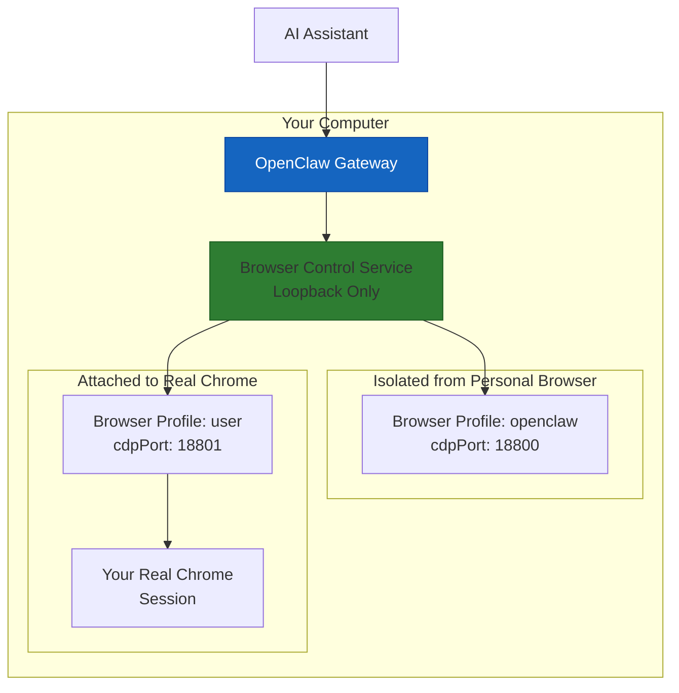
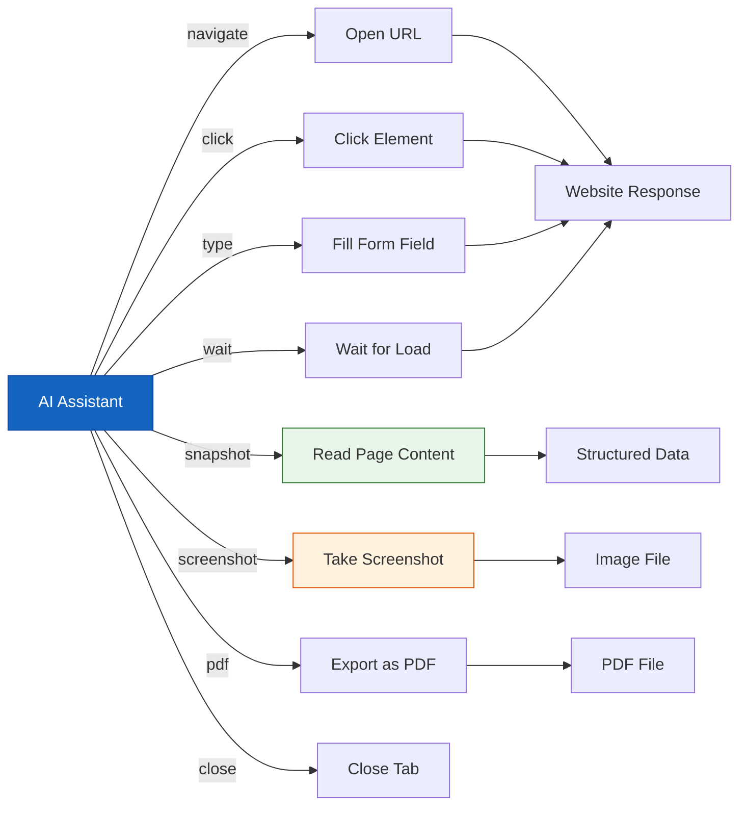
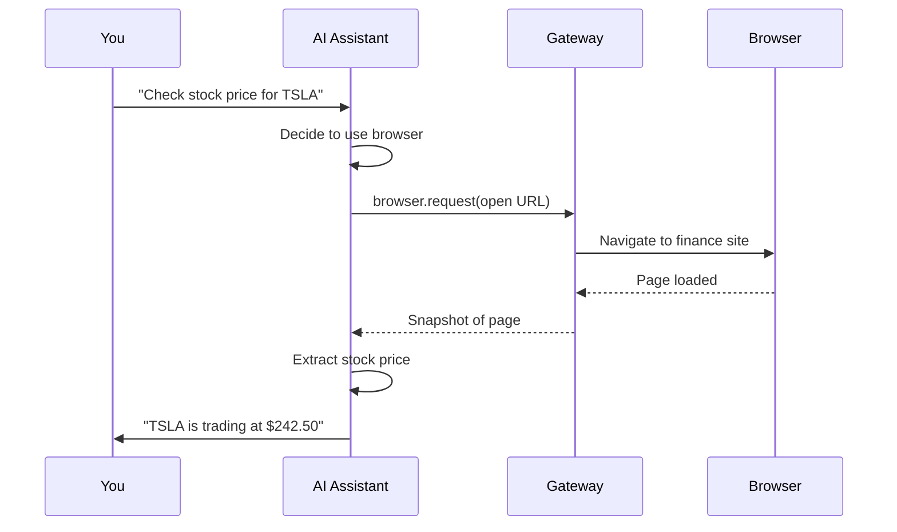

# OpenClaw Browser Control Automation
## Let Your AI Assistant Control a Browser Like a Human, But Faster

> **Reading Time:** 25 minutes
> **Difficulty:** Beginner to Intermediate
> **Prerequisite:** OpenClaw Gateway installed and running
> **Version:** OpenClaw v2025+

---

## The Problem With Traditional Web Automation

You probably know the feeling. You have a task that involves a website. It should be simple, but it is not. The website does not have an API. It does not have a mobile app. The only way to interact with it is through a web browser, which means someone has to sit there and click buttons, wait for pages to load, copy information, paste it somewhere else.

Sound familiar?

This is exactly the problem OpenClaw Browser Control was built to solve. Instead of you manually operating a browser, your AI assistant does it for you. The AI opens tabs, reads pages, clicks buttons, fills in forms, and takes screenshots, all under your supervision.

Think of it as having a robot intern that can use any website without needing an API key or developer access.

---

## What Is OpenClaw Browser Control

OpenClaw Browser Control gives your AI assistant its own dedicated browser. This browser is completely separate from your personal browser. It runs in an isolated environment, managed by the Gateway, and your AI assistant controls it through structured commands.

Here is what makes it different from other browser automation tools.

**No website can tell.** The OpenClaw browser uses a standard Chrome/Brave/Edge/Chromium profile that looks like a normal browser to websites. It runs with a real rendering engine, executes JavaScript, and maintains proper session cookies. Websites cannot easily distinguish it from a human browsing.

**Isolated from your personal browser.** The `openclaw` browser profile does not touch your personal browser data. Your logged-in Gmail session, your saved passwords, your cookies all stay safe in your personal browser. The AI operates a completely separate browser instance.

**Structured actions, not fragile selectors.** Instead of writing CSS selectors that break the moment a website redesigns, you describe what you want in plain language. Click the login button. Fill in the email field. Wait for the results table to load. The AI figures out how to do it.

**Multi-profile support.** You can run multiple browser profiles simultaneously. The `openclaw` profile is the default managed browser. The `user` profile attaches to your real signed-in Chrome session when you need to access accounts that have 2FA or session verification.



---

## Browser Profiles Explained

OpenClaw supports two types of browser profiles.

### The Managed Browser (openclaw Profile)

This is the default. The Gateway spawns a fresh Chrome/Brave/Edge/Chromium instance with its own empty profile directory. It runs completely isolated from your personal browser.

Benefits:
- No saved passwords or sessions that could leak
- Clean slate every time you start fresh
- Can run headless or with a visible window
- Fully controlled by the Gateway with no user interaction required

### The Attached Browser (user Profile)

This profile attaches to your real, currently-running Chrome session. When you need the AI to access accounts with strict 2FA or session validation, this is the profile to use.

Requirements:
- Chrome must be running with a remote debugging port enabled
- You need to be at your computer to approve the connection
- MCP Chrome extension must be installed and connected

The `user` profile is for when the managed browser gets blocked by anti-bot detection or needs access to an account that requires your physical presence to approve.

---

## Quick Start: Your First Browser Command

Make sure your Gateway is running, then try these commands.

```bash
# Check if the browser is enabled
openclaw browser --browser-profile openclaw status

# Start the browser if it is not running
openclaw browser --browser-profile openclaw start

# Open a website
openclaw browser --browser-profile openclaw open https://example.com

# Take a screenshot
openclaw browser --browser-profile openclaw screenshot

# Get a snapshot of the current page
openclaw browser --browser-profile openclaw snapshot
```

If you get "Browser disabled", you need to enable it in your config file.

---

## Configuration: Enabling the Browser

Open your OpenClaw config file at `~/.openclaw/openclaw.json`.

Look for the `browser` section. If it is not there, add it.

```json5
{
  browser: {
    enabled: true,
    defaultProfile: "openclaw",
    headless: false,
    noSandbox: false,
    color: "#FF4500",
    profiles: {
      openclaw: {
        cdpPort: 18800,
        color: "#FF4500"
      }
    }
  }
}
```

After making changes, restart the Gateway:

```bash
openclaw gateway restart
```

### The browser Command Is Missing

If `openclaw browser` is not recognized as a command, the most common cause is a restrictive plugin allowlist in your config.

Check your config for this pattern:

```json5
{
  plugins: {
    allow: ["telegram"],
  },
}
```

If `browser` is not in the list, add it:

```json5
{
  plugins: {
    allow: ["telegram", "browser"],
  },
}
```

The `browser.enabled=true` setting alone is not enough when `plugins.allow` is configured. Both are required.

---

## Browser Actions You Can Use

Once the browser is running, your AI assistant can perform these actions.



### Navigation

Open a URL in a new tab or the current tab:

```
openclaw browser --browser-profile openclaw open https://news.ycombinator.com
```

Navigate back and forward:

```
openclaw browser --browser-profile openclaw back
openclaw browser --browser-profile openclaw forward
```

Reload the current page:

```
openclaw browser --browser-profile openclaw reload
```

### Taking Snapshots

A snapshot reads the current page and returns structured data about every element on the page. It is how the AI sees what is on the screen.

```
openclaw browser --browser-profile openclaw snapshot
```

The output includes:
- All buttons, links, form fields, and their positions
- Text content of headings, paragraphs, and list items
- Table data and grid content
- Image alt text and src attributes

### Taking Screenshots

Take a screenshot of the current viewport:

```
openclaw browser --browser-profile openclaw screenshot
```

Take a full-page screenshot that scrolls through the entire document:

```
openclaw browser --browser-profile openclaw screenshot --full-page
```

Save with a custom filename:

```
openclaw browser --browser-profile openclaw screenshot --output my-screenshot.png
```

### Clicking and Typing

The AI assistant can click on elements by their text content or position. Instead of fragile CSS selectors, you describe what to click.

Example: Click the "Sign In" button on a page.

The AI would call the browser tool with:

```javascript
{
  action: "click",
  selector: "button:has-text('Sign In')"
}
```

Or click by position if the text is ambiguous:

```javascript
{
  action: "click",
  ref: "e12",
  button: "left"
}
```

### Filling Forms

Fill in text fields by their label or placeholder text:

```javascript
{
  action: "fill",
  ref: "e15",
  text: "hello@example.com"
}
```

Submit forms by clicking the submit button or pressing Enter.

### Waiting for Pages to Load

Many websites are single-page applications that load content dynamically. The AI can wait for specific elements to appear:

```javascript
{
  action: "wait",
  selector: ".results-table tr",
  timeoutMs: 10000
}
```

Or wait for network requests to settle:

```javascript
{
  action: "wait",
  loadState: "networkidle"
}
```

### Exporting as PDF

Save the current page as a PDF document:

```
openclaw browser --browser-profile openclaw pdf
```

This is useful for generating reports from web-based dashboards or saving article archives.

---

## Real-World Automation Examples

Here are practical ways to use browser automation in your daily workflow.

### Example 1: Research a Company

Ask your AI assistant to research a company by visiting their website, extracting key information, and summarizing findings.

The AI would:
1. Open the company website
2. Take a snapshot to read the content
3. Navigate to the About page
4. Extract leadership names, founded date, mission statement
5. Navigate to the Careers page to check job openings
6. Take a screenshot of the office locations
7. Compile everything into a summary

No API needed. No web scraping code to write. Just describe what you want.

### Example 2: Monitor Competitor Pricing

Track a competitor's pricing page and alert you when prices change.

The AI would:
1. Open the competitor pricing page
2. Take a snapshot of the pricing table
3. Compare against the previous snapshot stored in memory
4. If anything changed, send you a Telegram message with the update
5. Store the new snapshot for next time

You can schedule this to run daily with a cron job.

### Example 3: Fill Out Web Forms

Need to submit the same form repeatedly? Let the AI do it.

Tell your assistant: "Fill out the contact form on example.com with my name, email, and message from my profile."

The AI reads your profile information, opens the form, fills each field, and submits.

### Example 4: Scrape Job Listings

Collect job listings from multiple job boards into a single spreadsheet.

The AI visits each job board, searches for your target role and location, extracts job titles, companies, salaries, and posting dates, then compiles everything into a CSV file.

### Example 5: Check Website Availability

Monitor whether your critical websites are up and responding correctly.

The AI opens each website, checks that the expected content is present, and alerts you if something is wrong. More reliable than simple HTTP checks because it verifies the actual rendered page, not just the HTTP status code.

---

## Advanced: Multiple Browser Profiles

You can run multiple profiles simultaneously for different use cases.

```json5
{
  browser: {
    defaultProfile: "openclaw",
    profiles: {
      openclaw: {
        cdpPort: 18800,
        color: "#FF4500"
      },
      work: {
        cdpPort: 18801,
        color: "#0066CC"
      },
      remote: {
        cdpUrl: "http://10.0.0.42:9222",
        color: "#00AA00"
      }
    }
  }
}
```

Each profile gets its own browser context with isolated cookies and local storage.

Switch between profiles when you need different sessions:

```bash
# Use the work profile
openclaw browser --browser-profile work open https://work.example.com

# Use the remote profile for a different machine
openclaw browser --browser-profile remote open https://internal.dashboard.local
```

---

## Security Considerations

Browser automation handles sensitive data, so keep these points in mind.

**SSRF protection.** OpenClaw includes SSRF guards that prevent the browser from navigating to private network addresses by default. This stops an AI instruction from accidentally navigating to `http://localhost`, `http://192.168.1.1`, or other internal resources.

If you need private network access, you must explicitly enable it:

```json5
{
  browser: {
    ssrfPolicy: {
      dangerouslyAllowPrivateNetwork: true
    }
  }
}
```

Only enable this for trusted setups where you control the network.

**Sandbox mode.** The browser runs in sandboxed mode by default for security. If you encounter permission errors, you might need to adjust this on Linux systems:

```json5
{
  browser: {
    noSandbox: false
  }
}
```

Set `noSandbox: true` only if you understand the security implications and are running in a container environment where sandboxing is handled by the container runtime.

**Do not let the AI browse untrusted sites without supervision.** The browser is designed for the AI to operate under your oversight. Do not set up scenarios where the AI is browsing arbitrary websites unattended without approval workflows.

---

## Troubleshooting Common Issues

### Browser Will Not Start

If the browser fails to start, check these things in order.

First, verify browser support is enabled:

```bash
openclaw browser --browser-profile openclaw status
```

If it says "Browser disabled", check your config has `browser.enabled: true` and restart the Gateway.

Second, check that a Chromium-based browser is installed. OpenClaw supports Chrome, Brave, Edge, and Chromium. Install one if none is available.

Third, check for port conflicts. The browser control service uses a port derived from your Gateway port. Make sure those ports are not in use by other applications.

### Pages Load But AI Cannot Interact

If the page loads but the AI cannot click or fill fields, the issue is usually with the selector.

Try using the `snapshot` action to see what elements the AI can see. If the element you want is not in the snapshot, it might be inside an iframe, loaded dynamically after the snapshot was taken, or hidden by CSS.

For dynamic content, add a `wait` action before interacting:

```javascript
{
  action: "wait",
  selector: "#dynamic-content",
  timeoutMs: 5000
}
```

### Anti-Bot Detection

Some websites actively block automated browsers. If you encounter this, try these approaches.

Use the `user` profile to attach to your real Chrome session. This uses your actual browser fingerprint and logged-in sessions, which are harder to detect as automated.

Use screenshot-only mode where the AI reads content from screenshots rather than HTML snapshots. Some anti-bot tools detect HTML inspection but not visual content.

Try different timing. Add random delays between actions to mimic human browsing patterns.

Switch user agents. Some websites block known bot user agents.

---

## Headless vs Visible Mode

The browser can run in two modes.

**Headless mode** runs the browser without any visible window. It is faster and uses less memory, but you cannot see what the AI is doing. Good for background automation tasks.

**Visible mode** shows the browser window on your screen. You can watch the AI work and intervene if something goes wrong. Good for development and debugging.

Toggle headless mode in your config:

```json5
{
  browser: {
    headless: true   // true = headless, false = visible
  }
}
```

Or use the `openclaw browser` command with `--no-headless`:

```bash
openclaw browser --browser-profile openclaw start --no-headless
```

---

## Integrating With the AI Agent

The browser becomes most powerful when your AI agent knows how to use it. Here is the typical flow.



The AI sees the browser as just another tool, similar to how it uses file read, shell commands, or API calls. You do not need to write any code to make this work.

---

## Checklist: Browser Automation Setup

| Step | Task | Done? |
|------|------|-------|
| 1 | Check OpenClaw version (need latest) | [ ] |
| 2 | Verify Chromium-based browser installed | [ ] |
| 3 | Enable browser in config | [ ] |
| 4 | Restart Gateway | [ ] |
| 5 | Test `openclaw browser status` | [ ] |
| 6 | Test `openclaw browser open` a URL | [ ] |
| 7 | Test `openclaw browser snapshot` | [ ] |
| 8 | Test `openclaw browser screenshot` | [ ] |
| 9 | Configure multiple profiles if needed | [ ] |
| 10 | Set up SSRF policy for your network | [ ] |
| 11 | Test clicking and filling a form | [ ] |
| 12 | Set up headless automation for cron jobs | [ ] |

---

## For More Information

- [Official OpenClaw Browser Documentation](https://docs.openclaw.ai/tools/browser.md)
- [OpenClaw Browser CLI Reference](https://docs.openclaw.ai/cli/browser.md)
- [Browser Configuration Options](https://docs.openclaw.ai/tools/browser.md#configuration)
- [Plugin System Documentation](https://docs.openclaw.ai/cli/plugins.md)

Want to run your OpenClaw Gateway 24/7 on a VPS so browser automation runs even when your computer is off?

**[Get SumoPod VPS](https://blog.fanani.co/sumopod)** - Reliable, affordable VPS hosting perfect for running browser automation tasks on a schedule, monitoring competitor websites, and scraping data while you sleep.

For the easy-to-follow version of this guide in mixed Indonesian and English:

**[Baca versi Bahasa Indonesia](https://blog.fanani.co/tech/openclaw-browser-automation/)** - Same content, casual Indonesian style, easier to follow.

---

## Related Tutorials

- [OpenClaw Gateway Setup From Scratch](/tutorials/openclaw-gateway-setup-from-scratch.md) - Install and configure your Gateway first
- [OpenClaw MCP Server Setup](/tutorials/openclaw-mcp-server-setup.md) - Connect Google Workspace and Notion to complement browser automation
- [OpenClaw Channel Integration Guide](/tutorials/openclaw-channel-integration-guide.md) - Connect Telegram and WhatsApp to receive browser automation results
- [OpenClaw Session Maintenance Guide](/tutorials/openclaw-session-maintenance.md) - Keep your browser automation running smoothly over time

---

*This guide is verified against the official OpenClaw documentation at docs.openclaw.ai.*

**Last Updated:** April 2026
**Version:** 1.0
**Author:** Radian IT Team
