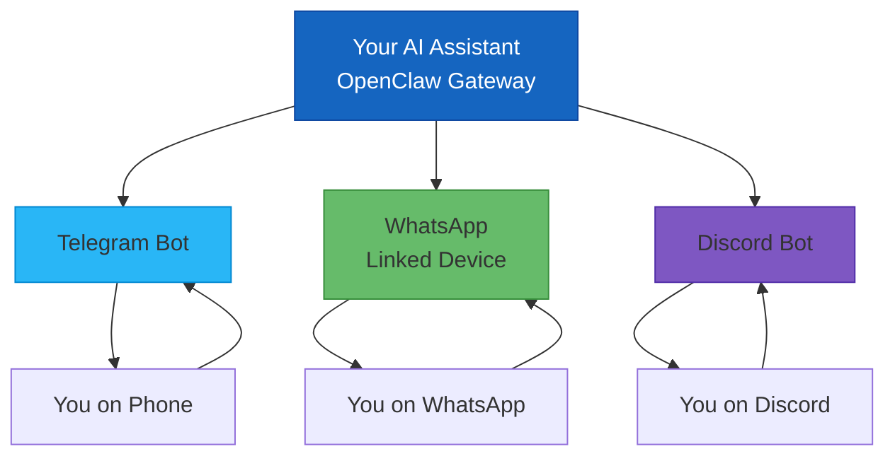
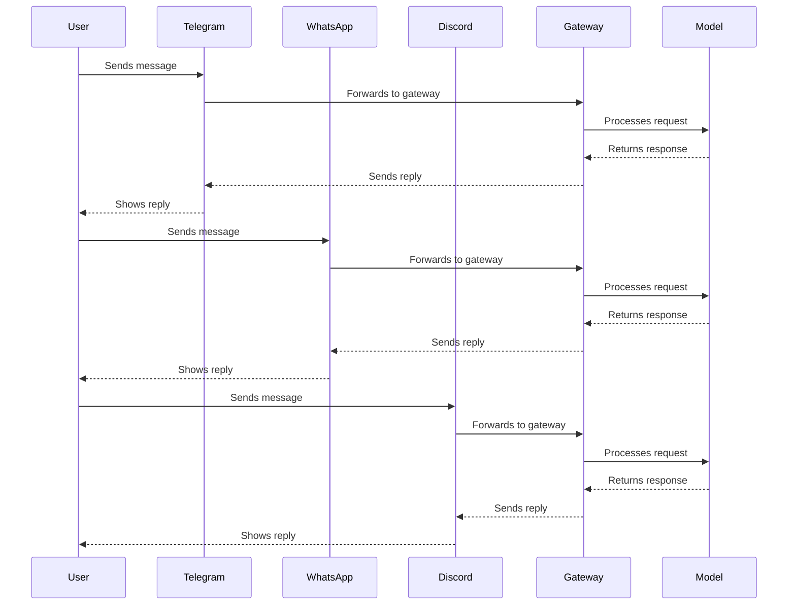
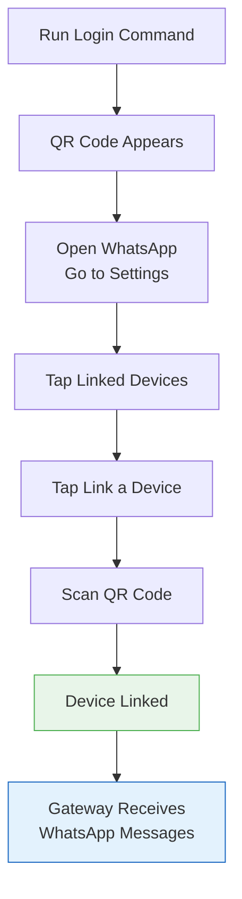
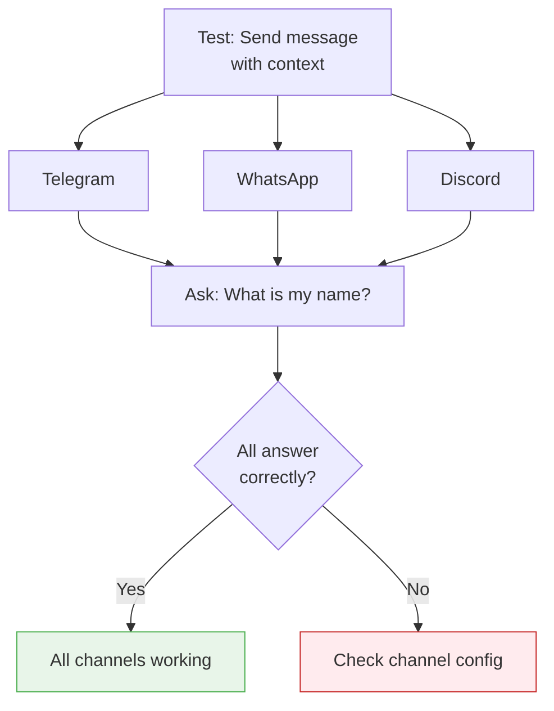
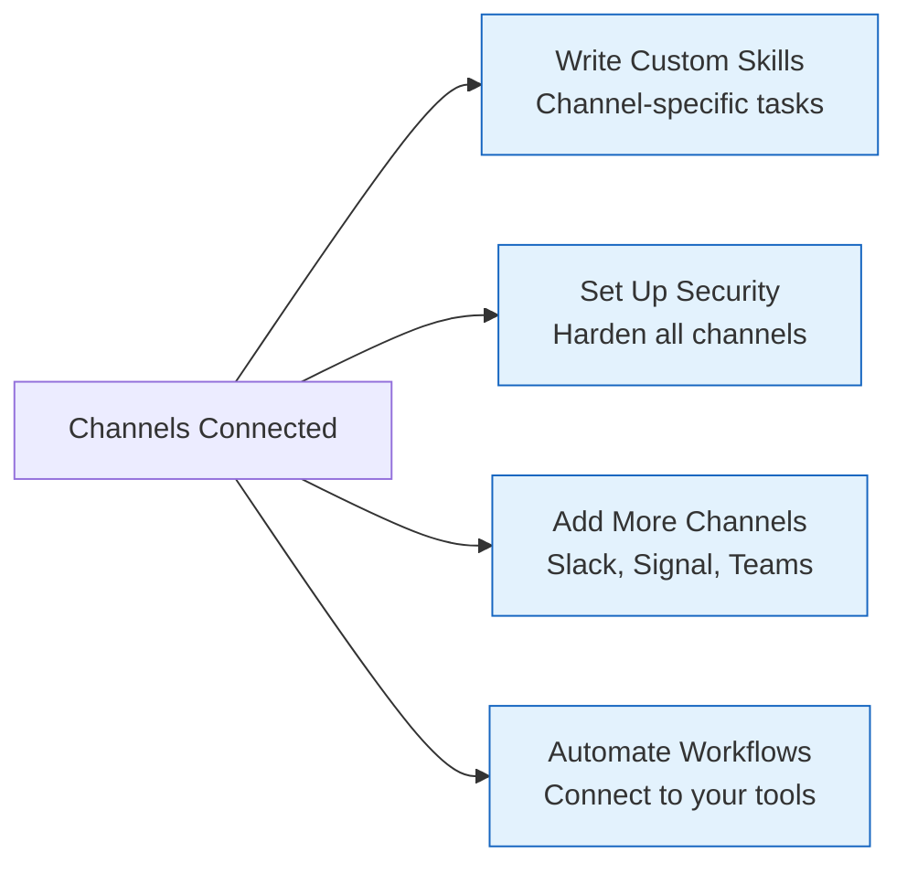

# OpenClaw Channel Integration Guide
## Connect Telegram, WhatsApp, and Discord to Your AI Assistant

> **Reading Time:** 20 minutes
> **Difficulty:** Beginner to Intermediate
> **Channels Covered:** Telegram, WhatsApp, Discord
> **Gateway Version:** OpenClaw v2025+

---

## What We Are Building

By the end of this guide you will have your AI assistant connected to three popular chat platforms at the same time. You can message it from Telegram, WhatsApp, or Discord and get the same intelligent response from your AI assistant regardless of which app you used.

This is one of the best things about OpenClaw. The AI assistant is platform-agnostic. You talk to the same brain whether you are on your phone or at your desk.



---

## How Channels Work in OpenClaw

Before we start connecting things, it helps to understand the architecture.

OpenClaw Gateway sits in the middle. It receives messages from any connected channel, processes them through your AI model, and sends the response back through the same channel.

Each channel is configured separately in your config file. You can enable or disable any channel without affecting the others.



All three channels share the same AI brain and memory. Whether you ask something on Discord at work and follow up on Telegram while commuting, your assistant remembers the context.

---

## Channel Comparison

Here is a quick look at what each channel offers:

| Channel | Setup Difficulty | Features | Best For |
|---------|-----------------|----------|----------|
| **Telegram** | Easiest | Bot tokens, groups, slash commands | Fastest setup, public bots |
| **WhatsApp** | Medium | Real phone number, QR pairing | Personal use, customer messaging |
| **Discord** | Easy | Servers, channels, slash commands | Developer communities, team groups |

Telegram is the fastest to set up. You just need a bot token from BotFather. WhatsApp requires linking your actual phone number via QR code. Discord needs a bot application from the Developer Portal.

---

## Step 1: Connect Telegram

This is the fastest channel to get running. It uses bot tokens which means you do not need to link a phone number.

### Create a Telegram Bot

Open Telegram and search for **@BotFather**. This is the official bot from Telegram that lets you create and manage bots.

Send the message `/newbot`. BotFather will ask you a few questions:

1. **Name your bot** - This is the display name users will see (example: "My AI Assistant")
2. **Choose a username** - This must end in `bot` (example: `myassistant_bot`)

BotFather will give you a token that looks like this:

```
123456789:ABCdefGhIJKlmNoPQRsTUVwxYZ123456789
```

Save this token. You will need it in the next step.

### Configure Telegram in OpenClaw

Open your OpenClaw config file at `~/.openclaw/openclaw.json` and add the Telegram channel:

```json5
{
  channels: {
    telegram: {
      enabled: true,
      botToken: "YOUR_BOT_TOKEN_HERE",
      dmPolicy: "pairing",
      groups: {
        "*": {
          requireMention: true
        }
      }
    }
  }
}
```

The `dmPolicy: "pairing"` setting means that when someone new sends your bot a direct message, they need to be approved first. This is a security feature so strangers cannot just message your assistant.

For groups, the `requireMention: true` setting means the bot only responds when someone explicitly mentions it with the @ symbol.

### Pair Your Account

Start the gateway:

```bash
openclaw gateway
```

Send a direct message to your bot on Telegram. You will get a pairing code back.

Check for pending pairing requests:

```bash
openclaw pairing list telegram
```

Approve your own account:

```bash
openclaw pairing approve telegram YOUR_CODE_HERE
```

Pairing codes expire after 1 hour. Once approved, you can chat with your AI assistant directly from Telegram.


### Optional: Add the Bot to a Group

You can add your bot to Telegram groups. When you do, you need to configure the group access policy.

```json5
{
  channels: {
    telegram: {
      enabled: true,
      botToken: "YOUR_BOT_TOKEN_HERE",
      dmPolicy: "pairing",
      groups: {
        "-1001234567890": {
          allowFrom: ["220924719"]
        }
      },
      groupPolicy: "allowlist"
    }
  }
}
```

The number `-1001234567890` is your group's chat ID. You can find it from the Telegram API or through the gateway logs when the bot joins a group.

---

## Step 2: Connect WhatsApp

WhatsApp uses your actual phone number instead of a bot token. This means you link your WhatsApp account to OpenClaw via a QR code scan, similar to WhatsApp Web.

### Install the WhatsApp Plugin

If you did not add WhatsApp during initial onboarding, install it now:

```bash
openclaw channels add --channel whatsapp
```

Or use the login command which will offer to install the plugin if it is missing:

```bash
openclaw channels login --channel whatsapp
```

### Configure WhatsApp in OpenClaw

```json5
{
  channels: {
    whatsapp: {
      dmPolicy: "pairing",
      allowFrom: ["+6281234567890"],
      groupPolicy: "allowlist",
      groupAllowFrom: ["+6281234567890"]
    }
  }
}
```

Replace `+6281234567890` with your actual phone number in international format. The `dmPolicy: "pairing"` setting works the same way as Telegram, requiring approval for new contacts.

### Link Your WhatsApp Account

Run the login command:

```bash
openclaw channels login --channel whatsapp
```

You will see a QR code appear in your terminal. Open WhatsApp on your phone, go to **Settings > Linked Devices**, and tap **Link a Device**. Scan the QR code on your screen.

The QR code expires quickly. If it expires before you scan, just run the command again.



Your WhatsApp now shows as a linked device, just like WhatsApp Web. Messages sent to your WhatsApp are forwarded to the OpenClaw Gateway.

### Multiple WhatsApp Accounts

If you want to connect a second WhatsApp number (for example, a business number):

```bash
openclaw channels login --channel whatsapp --account business
```

This creates a separate session for the business account.

---

## Step 3: Connect Discord

Discord bots work differently from Telegram bots. You create an application in the Discord Developer Portal, add a bot user to it, and then invite that bot to your server.

### Create a Discord Application

Go to the [Discord Developer Portal](https://discord.com/developers/applications) and click **New Application**.

Give it a name (this will be the bot's display name) and click **Create**.

On the left sidebar, click **Bot**. Then click **Add Bot** and confirm.

Under the **Token** section, click **Reset Token** to get your bot token. Copy and save this token. You will not be able to see it again after you navigate away.

### Enable Necessary Permissions

Still in the Developer Portal, go to **OAuth2 > URL Generator**.

Check the following scopes:
- `bot`
- `applications.commands`

Under **Bot Permissions**, check:
- **Send Messages**
- **Read Message History**
- **Use Slash Commands**

Scroll down and copy the generated URL.

### Invite the Bot to Your Server

Open the URL you just copied in your browser. Select your own server from the dropdown and click **Authorize**.

Discord will ask you to complete a captcha. After that, the bot appears in your server with the specified permissions.

### Configure Discord in OpenClaw

```json5
{
  channels: {
    discord: {
      enabled: true,
      botToken: "YOUR_DISCORD_BOT_TOKEN",
      dmPolicy: "pairing",
      guilds: {
        "SERVER_ID": {
          requireMention: false
        }
      }
    }
  }
}
```

Find your server ID by enabling Developer Mode in Discord settings, then right-clicking your server name and selecting **Copy Server ID**.

### Pair Your Discord Account

Send a direct message to your bot in Discord. You will get a pairing code back.

```bash
openclaw pairing list discord
openclaw pairing approve discord YOUR_CODE_HERE
```

Now you can chat with your AI assistant directly through Discord DMs or in servers where the bot is present.

---

## Step 4: Verify All Channels Are Working

After configuring all three channels, restart the gateway to load the new configuration:

```bash
openclaw gateway restart
```

Check the status:

```bash
openclaw gateway status
```

You should see all three channels listed as active.

### Test Each Channel

Try sending a message through each platform. Ask the same question on all three to confirm they share the same context and memory.

For example, send: "My name is Alex and I love coffee." Then a minute later, on a different channel, ask "What is my name?" The AI should remember correctly on all channels.



---

## Managing Multiple Channels Together

One of the powerful features of OpenClaw is that all channels share the same session and memory. But you might want different behavior per channel.

### Channel-Specific Responses

You can configure different tool permissions or behavior per channel. For example, maybe you want the WhatsApp bot to have access to your calendar but not the Discord bot.

```json5
{
  channels: {
    telegram: {
      enabled: true,
      botToken: "YOUR_TELEGRAM_TOKEN",
      dmPolicy: "pairing"
    },
    whatsapp: {
      enabled: true,
      dmPolicy: "pairing",
      allowFrom: ["+6281234567890"],
      tools: {
        allowed: ["google-calendar", "gmail", "google-drive"]
      }
    },
    discord: {
      enabled: true,
      botToken: "YOUR_DISCORD_TOKEN",
      dmPolicy: "pairing",
      guilds: {
        "SERVER_ID": {
          requireMention: false
        }
      }
    }
  }
}
```

### Pairing and Allowlists

By default, all channels use `dmPolicy: "pairing"` which means unknown users must be approved before chatting. This prevents strangers from using your AI assistant.

To allow specific users without pairing:

```json5
{
  channels: {
    telegram: {
      enabled: true,
      botToken: "YOUR_TOKEN",
      dmPolicy: "allowlist",
      allowFrom: ["220924719", "123456789"]
    }
  }
}
```

User IDs vary by channel. For Telegram, this is your numeric user ID. For Discord, it is your snowflake user ID.

---

## Troubleshooting Common Channel Issues

### Telegram Bot Not Responding

1. Make sure you sent `/start` to the bot first
2. Check that the bot token is correct in your config
3. Verify the gateway is running: `openclaw gateway status`
4. Check the pairing: `openclaw pairing list telegram`

### WhatsApp QR Code Not Scanning

1. Make sure your phone's WhatsApp is up to date
2. Try closing other WhatsApp Web sessions
3. The QR code expires in about 60 seconds. Run the command again if it expires before you scan.
4. Make sure your phone has a stable internet connection when scanning.

### Discord Bot Shows Offline

1. Check that the bot token is correct
2. Make sure you invited the bot with the correct permissions
3. The bot needs to be able to read message history to respond in channels
4. If the bot was added by someone other than the server owner, permissions might be restricted

### Pairing Code Expired

Pairing codes expire after 1 hour for security reasons. If your code expires, just send another message to the bot and approve the new code.

### Messages Not Routing Between Channels

Each channel operates independently for routing. If you send a message on Telegram, the response comes back on Telegram. The shared context is stored in the gateway session, not in the channel itself.

---

## Security Considerations

When connecting chat platforms to your AI assistant, keep these security points in mind:

**Pairing and Allowlists:** Always use `dmPolicy: "pairing"` or `dmPolicy: "allowlist"` to prevent strangers from accessing your assistant.

**Bot Tokens:** Treat them like passwords. Do not share them in public places. If a token is compromised, reset it immediately in the platform's developer portal.

**WhatsApp Phone Number:** Your real phone number is exposed when using WhatsApp channel. Consider using a dedicated business number.

**Discord Server Access:** Only add the bot to servers you control or trust. Bot permissions in public servers can be a risk.

**Group Chats:** In group chats, the bot only responds when mentioned by default. This prevents it from responding to every single message.

---

## Running Multiple Channels Simultaneously

OpenClaw supports running all channels at the same time. The configuration is additive:

```json5
{
  channels: {
    telegram: {
      enabled: true,
      botToken: "TELEGRAM_TOKEN"
    },
    whatsapp: {
      enabled: true
    },
    discord: {
      enabled: true,
      botToken: "DISCORD_TOKEN"
    }
  }
}
```

Each channel runs as part of the same gateway process. You do not need separate gateway instances.

---

## Keeping Channels Running 24/7

On a VPS or server, make sure the gateway restarts automatically if it crashes:

```bash
pm2 install pm2-logrotate
pm2 start "openclaw gateway" --name openclaw-assistant
pm2 save
pm2 startup
```

This keeps your assistant available on all channels even after server reboots.

For systemd-based systems:

```bash
sudo systemctl enable openclaw
sudo systemctl start openclaw
```

---

## What Comes Next

Now that you have three channels connected, here are natural next steps:



- **Write custom skills** that work differently per channel
- **Set up security hardening** for all connected channels
- **Add more channels** like Slack, Signal, or Microsoft Teams
- **Connect to your tools** like Google Calendar, Gmail, or your company systems

---

## Channel Setup Checklist

| Channel | Step | Done? |
|---------|------|-------|
| Telegram | Created bot via @BotFather | [ ] |
| Telegram | Added bot token to config | [ ] |
| Telegram | Approved pairing | [ ] |
| Telegram | Sent test message, got reply | [ ] |
| WhatsApp | Installed WhatsApp plugin | [ ] |
| WhatsApp | Scanned QR code | [ ] |
| WhatsApp | Approved pairing | [ ] |
| WhatsApp | Sent test message, got reply | [ ] |
| Discord | Created Discord application | [ ] |
| Discord | Added bot to server | [ ] |
| Discord | Added bot token to config | [ ] |
| Discord | Approved pairing | [ ] |
| Discord | Sent test message, got reply | [ ] |
| All | Gateway running with all channels | [ ] |
| All | Tested context across channels | [ ] |

---

## For More Information

- [Official OpenClaw Channels Documentation](https://docs.openclaw.ai/channels)
- [Telegram Channel Setup](https://docs.openclaw.ai/channels/telegram)
- [WhatsApp Channel Setup](https://docs.openclaw.ai/channels/whatsapp)
- [Discord Channel Setup](https://docs.openclaw.ai/channels/discord)
- [Channel Troubleshooting](https://docs.openclaw.ai/channels/troubleshooting)
- [Pairing and Allowlists](https://docs.openclaw.ai/channels/pairing)

Want to run your OpenClaw Gateway 24/7 on a VPS? We recommend SumoPod:

**[Get SumoPod VPS](https://blog.fanani.co/sumopod)** - Reliable, affordable VPS hosting perfect for keeping your AI assistant online around the clock.

For the easy-to-follow version of this guide in mixed Indonesian and English:

**[Baca versi Bahasa Indonesia](https://blog.fanani.co/tech/openclaw-channel-integration/)** - Same content, casual Indonesian style, easier to follow.

---

## Related Tutorials

- [OpenClaw Gateway Setup From Scratch](/tutorials/openclaw-gateway-setup-from-scratch.md) - Get your gateway running first before adding channels
- [OpenClaw Security Hardening Checklist](/tutorials/openclaw-security-hardening.md) - Lock down all your channels with proper security settings
- [WhatsApp Customer Care Bot Setup](/tutorials/whatsapp-customer-care-umkm.md) - Build a customer service bot with WhatsApp
- [OpenClaw Session Maintenance Guide](/tutorials/openclaw-session-maintenance.md) - Keep your gateway running smoothly with multiple channels

---

*This guide is verified against the official OpenClaw documentation at docs.openclaw.ai. All configuration examples are based on the official channel documentation.*

**Last Updated:** April 2026
**Version:** 1.0
**Author:** Radian IT Team
