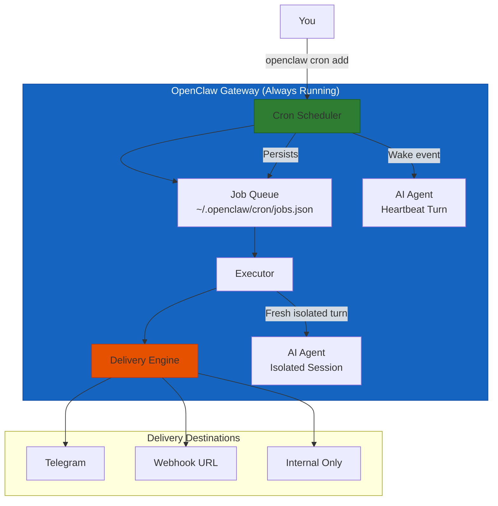
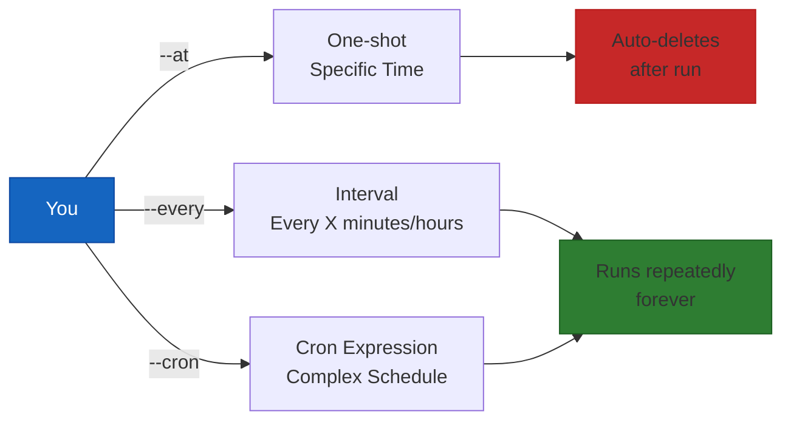
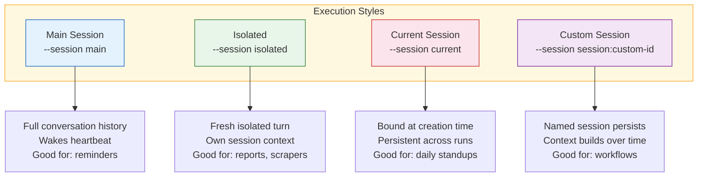
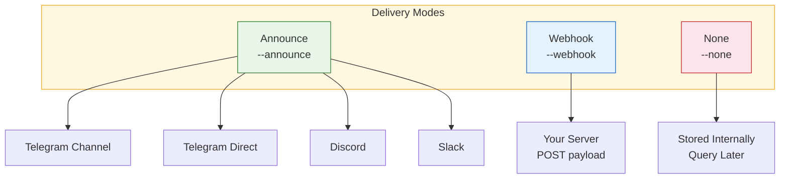

# OpenClaw Cron Job Automation
## Schedule Tasks, Reports, and Alerts That Run While You Sleep

> **Reading Time:** 22 minutes
> **Difficulty:** Beginner to Intermediate
> **Prerequisite:** OpenClaw Gateway installed and running
> **Version:** OpenClaw v2025+

---

## Why You Need Scheduled Automation

Think about the things you do every day that could be automated.

Every morning you check your email and flag the urgent ones. Every evening you send a status report to your team. Every hour you check if your server is still alive. Every Monday morning you compile a list of what happened over the weekend.

These tasks are predictable. They follow a schedule. They do not require human creativity. But they still eat up your time, day after day.

This is exactly what OpenClaw Cron Jobs solve. Instead of doing these tasks yourself, you tell your AI assistant when to run them. It schedules the work, executes it automatically, and delivers the results back to you.

No more remembering to send that weekly report. No more checking your dashboard at 2 AM. Your AI assistant handles it while you focus on work that actually matters.

---

## How OpenClaw Cron Works

OpenClaw runs cron jobs inside the Gateway process itself. This is important because it means your scheduled tasks survive restarts, keep running even when you are not at your computer, and do not depend on any external service.



Key things to understand about how cron works in OpenClaw.

**Jobs persist in a JSON file.** Your scheduled jobs are stored at `~/.openclaw/cron/jobs.json`. This means if the Gateway restarts, your schedules do not disappear. When it comes back up, it reads the file and resumes all pending jobs.

**Jobs can run in different contexts.** Some jobs need the full context of your main conversation. Others are better run in isolation so they do not clutter your main session. OpenClaw supports both.

**Delivery is flexible.** Results can go to a Telegram channel, a webhook endpoint, or nowhere at all if you only need the data stored internally.

**One-shot jobs auto-delete.** If you schedule a reminder for a specific time, the job deletes itself after it runs successfully. Recurring jobs stay until you delete them.

---

## Quick Start: Five Commands to Memorize

Here are the five most important cron commands. Learn these and you can set up almost any automation.

```bash
# Add a one-shot reminder
openclaw cron add \
  --name "Daily Standup" \
  --at "2026-04-20T09:00:00+08:00" \
  --session isolated \
  --message "Send team a standup summary" \
  --announce

# Add a recurring job that runs every hour
openclaw cron add \
  --name "Server Health Check" \
  --cron "0 * * * *" \
  --session isolated \
  --message "Check server health, alert if down" \
  --channel telegram

# List all your scheduled jobs
openclaw cron list

# See run history for a job
openclaw cron runs --id <job-id>

# Delete a job when you no longer need it
openclaw cron delete --id <job-id>
```

That is the entire surface area you need to get started. Everything else in this guide is details.

---

## Schedule Types: Three Ways to Trigger

OpenClaw supports three types of schedules. Each one fits a different use case.



### One-Shot Scheduling with --at

Use this for tasks that happen once at a specific time.

```bash
# Remind me in 20 minutes
openclaw cron add \
  --name "Break Reminder" \
  --at "20m" \
  --session main \
  --system-event "Take a 5-minute break" \
  --wake now \
  --delete-after-run

# Schedule for a specific date and time
openclaw cron add \
  --name "Meeting Reminder" \
  --at "2026-04-25T14:00:00+08:00" \
  --session main \
  --system-event "Team meeting starts in 15 minutes" \
  --wake now \
  --delete-after-run
```

The `--wake now` flag tells the Gateway to interrupt whatever it is doing and deliver the reminder immediately. Without it, the event gets queued for the next heartbeat turn.

### Interval Scheduling with --every

Use this for tasks that repeat at a fixed interval.

```bash
# Check email every 30 minutes
openclaw cron add \
  --name "Email Check" \
  --every "30m" \
  --session isolated \
  --message "Check inbox, flag urgent emails, summarize for me"

# Heartbeat health check every 5 minutes
openclaw cron add \
  --name "Service Health" \
  --every "5m" \
  --session isolated \
  --message "Run health check on all services" \
  --announce
```

The interval resets after each run finishes. So a job with `--every "1h"` that takes 5 minutes to run will fire again 65 minutes after it started, not 60 minutes after it finished.

### Cron Expression Scheduling with --cron

For complex schedules, use standard 5-field cron expressions.

```bash
# Every day at 9 AM
openclaw cron add \
  --name "Morning Digest" \
  --cron "0 9 * * *" \
  --tz "Asia/Makassar" \
  --session isolated \
  --message "Send me a morning briefing" \
  --announce

# Every Monday at 8 AM
openclaw cron add \
  --name "Weekly Kickoff" \
  --cron "0 8 * * 1" \
  --tz "Asia/Makassar" \
  --session isolated \
  --message "Compile last week's metrics and send summary"

# Every weekday at 6 PM
openclaw cron add \
  --name "End of Day" \
  --cron "0 18 * * 1-5" \
  --session isolated \
  --message "Generate daily status report and send to team"

# Every 15 minutes during work hours
openclaw cron add \
  --name "Hourly Sweep" \
  --cron "0 8-17 * * 1-5/15" \
  --tz "Asia/Makassar" \
  --session isolated \
  --message "Check dashboards and alert on anomalies"
```

Cron expressions follow the standard format: `minute hour day-of-month month day-of-week`.

Important note: OpenClaw uses Croner's default behavior where day-of-month and day-of-week use OR logic, not AND. If you specify both fields as non-wildcard, the job fires when either field matches. This is standard Vixie cron behavior.

---

## Execution Styles: Where Your Job Runs

When you create a cron job, you choose where it runs. This choice affects how much context the job has access to.



### Main Session

Jobs run in your main conversation thread. They see your full conversation history and wake the heartbeat immediately if `--wake now` is set.

Best for: reminders, notifications, system events that need immediate attention.

```bash
openclaw cron add \
  --name "Reminder" \
  --at "2026-04-20T16:00:00Z" \
  --session main \
  --system-event "Check the cron docs draft" \
  --wake now \
  --delete-after-run
```

### Isolated Session

Jobs run in a dedicated session with no prior context. The session is named after the job and cleaned up when done.

Best for: reports, data collection, web scraping, background tasks that do not need your conversation history.

```bash
openclaw cron add \
  --name "Weekly Report" \
  --cron "0 9 * * 1" \
  --session isolated \
  --message "Generate a weekly sales report and send to analytics@company.com" \
  --announce --channel telegram --to "-1001234567890"
```

### Current Session

Jobs run in whatever session was active when you created the job. The session persists across runs, so the job builds context over time.

Best for: daily recurring work that needs to reference previous results.

### Custom Session

Jobs run in a named session you specify. The session persists indefinitely and accumulates context with each run.

Best for: workflows that span multiple days, like a week-long research project that adds to a growing document.

---

## Delivery: How Results Reach You

Jobs produce output. That output has to go somewhere. OpenClaw gives you three delivery modes.



### Channel Delivery (Announce)

Send results directly to a messaging channel.

```bash
# Send to a Telegram channel
openclaw cron add \
  --name "Daily Summary" \
  --cron "0 18 * * *" \
  --session isolated \
  --message "Compile today's metrics and send summary" \
  --announce --channel telegram --to "-1001234567890"

# Send to a Telegram topic
openclaw cron add \
  --name "DevOps Alerts" \
  --cron "*/5 * * * *" \
  --session isolated \
  --message "Check server health, alert if issues found" \
  --announce --channel telegram --to "-1001234567890:topic:123"
```

For Slack and Discord, use explicit prefixes: `channel:<id>` or `user:<id>`.

### Webhook Delivery

POST the results to your own server.

```bash
openclaw cron add \
  --name "Pipeline Status" \
  --cron "0 * * * *" \
  --session isolated \
  --message "Check CI/CD pipeline status" \
  --webhook "https://your-server.com/cron/pipeline-status"
```

The webhook receives a JSON payload with the job results, run timestamp, and metadata.

### Internal Only

Keep results stored but do not send them anywhere.

```bash
openclaw cron add \
  --name "Data Collector" \
  --cron "0 */2 * * *" \
  --session isolated \
  --message "Scrape competitor prices and store in database" \
  --none
```

Query the results later using `openclaw cron runs --id <job-id>`.

---

## Payload Options for Isolated Jobs

When running in isolated mode, you can customize how the job runs.

```bash
# Use a specific model
openclaw cron add \
  --name "Deep Analysis" \
  --cron "0 2 * * *" \
  --session isolated \
  --message "Run deep analysis on this week's data" \
  --model "claude-3-opus"

# Enable verbose thinking
openclaw cron add \
  --name "Careful Research" \
  --cron "0 9 * * *" \
  --session isolated \
  --message "Research competitor products and compile report" \
  --thinking "high"

# Light context mode (skip workspace bootstrap)
openclaw cron add \
  --name "Quick Check" \
  --every "15m" \
  --session isolated \
  --message "Check system metrics" \
  --light-context

# Restrict available tools
openclaw cron add \
  --name "Read Only Monitor" \
  --every "5m" \
  --session isolated \
  --message "Monitor service health" \
  --tools "read,exec"
```

Model selection follows a clear precedence. If you specify `--model`, that takes priority. If the requested model is not allowed, it falls back to the job session model. If that is also not set, it falls back to the agent default.

---

## Real-World Automation Examples

Here are practical automation patterns you can set up today.

### Example 1: Morning Briefing at 7 AM

Every weekday morning, get a briefing delivered to Telegram before you start work.

```bash
openclaw cron add \
  --name "Morning Briefing" \
  --cron "0 7 * * 1-5" \
  --tz "Asia/Makassar" \
  --session isolated \
  --message "Send me a morning briefing covering: today's calendar events, any urgent emails, server health status, and yesterday's key metrics" \
  --announce --channel telegram --to "220924719"
```

The AI agent runs in isolation, compiles information from your calendar, email, and monitoring tools, and sends you a clean summary. You arrive at work knowing what matters.

### Example 2: Hourly Server Health Check

Monitor your server every 5 minutes and alert if something goes wrong.

```bash
openclaw cron add \
  --name "Health Monitor" \
  --cron "*/5 * * * *" \
  --session isolated \
  --message "Run a health check on all services. If any service is down or degraded, send an alert to Telegram with details. If everything is fine, stay silent." \
  --announce --channel telegram --to "220924719"
```

The conditional logic is built into the prompt. The job only talks to you when there is a problem. No spam when things are healthy.

### Example 3: Weekly Report Every Monday

Generate a summary of the past week and send it to your analytics channel.

```bash
openclaw cron add \
  --name "Weekly Report" \
  --cron "0 9 * * 1" \
  --tz "Asia/Makassar" \
  --session isolated \
  --message "Compile a weekly report covering: total sales, new customer signups, support tickets resolved, server uptime percentage, and any incidents. Format as a clean markdown table." \
  --announce --channel telegram --to "-1001234567890"
```

### Example 4: Reminder With Exact Timing

Set a one-shot reminder for a specific meeting.

```bash
openclaw cron add \
  --name "Meeting Reminder" \
  --at "2026-04-25T13:45:00+08:00" \
  --session main \
  --system-event "Team sync meeting starts in 15 minutes. Join link: https://meet.example.com/sync" \
  --wake now \
  --delete-after-run
```

### Example 5: Daily Backup Verification

Every night, verify that backups ran successfully and report any failures.

```bash
openclaw cron add \
  --name "Backup Check" \
  --cron "0 3 * * *" \
  --session isolated \
  --message "Check backup logs for today. Verify database backup and file backups completed successfully. If any backup failed, send alert with log excerpt." \
  --announce --channel telegram --to "220924719"
```

---

## Cron Expression Reference

A quick reference for the most common cron patterns.

| Expression | Meaning |
|------------|---------|
| `0 * * * *` | Every hour at minute 0 |
| `*/15 * * * *` | Every 15 minutes |
| `0 9 * * *` | Every day at 9 AM |
| `0 9 * * 1-5` | Every weekday at 9 AM |
| `0 9 * * 1` | Every Monday at 9 AM |
| `0 9 1 * *` | First day of every month at 9 AM |
| `*/5 8-18 * * 1-5` | Every 5 minutes during work hours |
| `0 18 * * 1-5` | Every weekday at 6 PM |
| `0 */2 * * *` | Every 2 hours |
| `30 23 * * *` | Every day at 11:30 PM |

The format is: `minute hour day-of-month month day-of-week`

---

## Common Pitfalls and Gotchas

**Timezones.** Timestamps without a timezone are treated as UTC. If you want local time, use the `--tz` flag: `--tz "Asia/Makassar"` for WITA (UTC+8).

**Day-of-month and day-of-week OR logic.** If you specify both non-wildcard values, the job fires when either matches. This catches many people off guard. `0 9 15 * 1` fires on every 15th of any month AND every Monday at 9 AM, not just Mondays that fall on the 15th.

**Interval timing drift.** Jobs with `--every` restart the timer after the job finishes, not after it starts. A 30-minute job with `--every "1h"` actually takes 90 minutes between runs if it takes 30 minutes to complete.

**Main session waking.** Jobs with `--session main` and `--wake now` interrupt the heartbeat immediately. If your agent is in the middle of something important, this might not be ideal. Use `--wake next-heartbeat` for less disruptive delivery.

**Model availability.** If you specify a model with `--model` that is not in your allowed list, the job falls back silently. Check `openclaw cron list` after creation to verify the job is configured correctly.

---

## Security Considerations

Cron jobs execute automatically without prompting for approval. Keep these points in mind.

**Scope permissions carefully.** If a cron job gets compromised or its prompt gets injection-attacked, what can it do? Use `--tools` to restrict the available tools to only what the job needs.

**Isolated execution is safer.** Jobs running in `isolated` session cannot access your main conversation history. If the job only needs to read data and send a report, keep it isolated.

**Webhook URLs are sensitive.** If your webhook URL contains an API key or authentication token, treat it like a password. Do not put it in scripts that get committed to version control. Use environment variables instead.

**Delivery targets matter.** Jobs that send to public channels or webhook endpoints should only contain information you are comfortable sharing with that audience.

---

## Troubleshooting

### My job is not running

First, verify the job exists.

```bash
openclaw cron list
```

If the job is listed, check its status and recent run history.

```bash
openclaw cron runs --id <job-id>
```

If the job has never run, check the Gateway logs for errors.

```bash
openclaw logs --lines 50
```

### The Gateway restarted and my jobs disappeared

They should not disappear. Jobs are stored in `~/.openclaw/cron/jobs.json` and persist across restarts. If jobs are disappearing, there might be a file permission issue or the jobs file might be getting overwritten.

Check that the Gateway has write access to its config directory.

### Results are not being delivered

If you set up announce delivery but nothing arrives, check these things.

First, verify the channel ID or user ID is correct. A wrong channel ID silently drops messages.

Second, confirm the bot has permission to post in that channel. For Telegram channels, the bot must be an admin or at least have message posting rights.

Third, for webhook delivery, check your server is accessible from the Gateway and returns a 2xx status code.

### The job runs but produces no output

For isolated jobs, the agent is prompted to return a plain-text summary. If the summary is empty, the prompt might need to be more specific about what output to produce.

Try adding explicit instructions in the `--message` field: "Format the output as a markdown table with columns X, Y, Z."

---

## Checklist: Setting Up Your First Cron Job

| Step | Task | Done? |
|------|------|-------|
| 1 | Identify a recurring task you do manually | [ ] |
| 2 | Write the prompt for the automated version | [ ] |
| 3 | Choose the right schedule type (at, every, cron) | [ ] |
| 4 | Choose the right execution style (main, isolated, current) | [ ] |
| 5 | Set the delivery target (channel, webhook, internal) | [ ] |
| 6 | Add timezone flag if needed | [ ] |
| 7 | Test with a near-term `--at` first | [ ] |
| 8 | Verify delivery works | [ ] |
| 9 | Switch to recurring schedule | [ ] |
| 10 | Monitor first few runs and adjust prompt | [ ] |
| 11 | Set up monitoring for the cron job itself | [ ] |

---

## For More Information

- [Official OpenClaw Cron Documentation](https://docs.openclaw.ai/automation/cron-jobs.md)
- [Automation and Tasks Overview](https://docs.openclaw.ai/automation/index.md)
- [Background Tasks](https://docs.openclaw.ai/automation/tasks.md)
- [Task Flow](https://docs.openclaw.ai/automation/taskflow.md)
- [Hooks](https://docs.openclaw.ai/automation/hooks.md)

Want to run your OpenClaw Gateway 24/7 so cron jobs execute even when your computer is asleep?

**[Get SumoPod VPS](https://blog.fanani.co/sumopod)** - Reliable, affordable VPS hosting that keeps your automation running around the clock, starting from affordable promo plans.

For the easy-to-follow version of this guide in mixed Indonesian and English:

**[Baca versi Bahasa Indonesia](https://blog.fanani.co/tech/openclaw-cron-job-automation/)** - Same content, casual Indonesian style, easier to understand.

---

## Related Tutorials

- [OpenClaw Gateway Setup From Scratch](/tutorials/openclaw-gateway-setup-from-scratch.md) - Get your Gateway running before scheduling jobs
- [OpenClaw Session Maintenance Guide](/tutorials/openclaw-session-maintenance.md) - Keep your scheduled tasks running smoothly over time
- [OpenClaw Browser Control Automation](/tutorials/openclaw-browser-automation.md) - Combine browser automation with cron for scheduled scraping and monitoring
- [OpenClaw MCP Server Setup](/tutorials/openclaw-mcp-server-setup.md) - Connect data sources that feed into your cron job reports

---

*This guide is verified against the official OpenClaw documentation at docs.openclaw.ai.*

**Last Updated:** April 2026
**Version:** 1.0
**Author:** Radian IT Team
