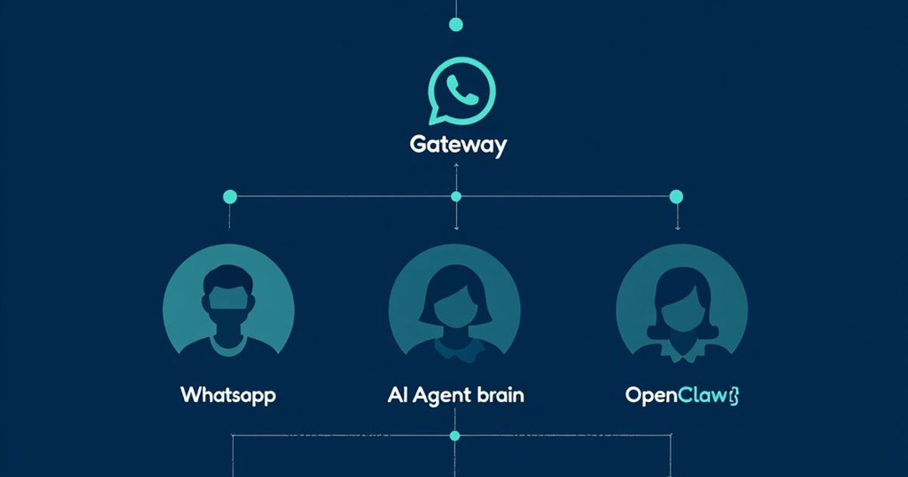
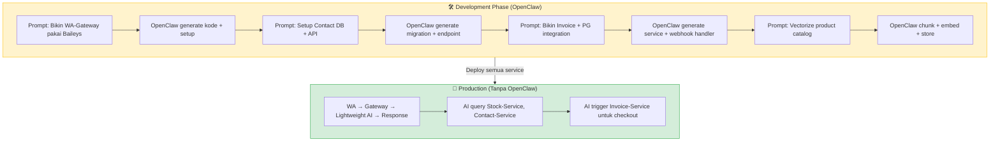
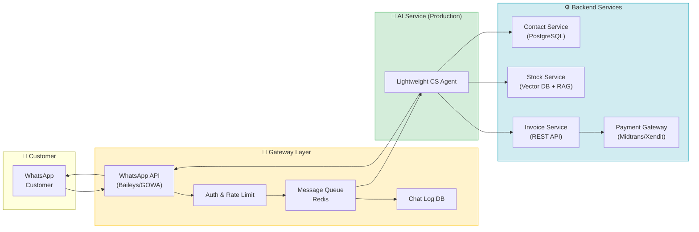
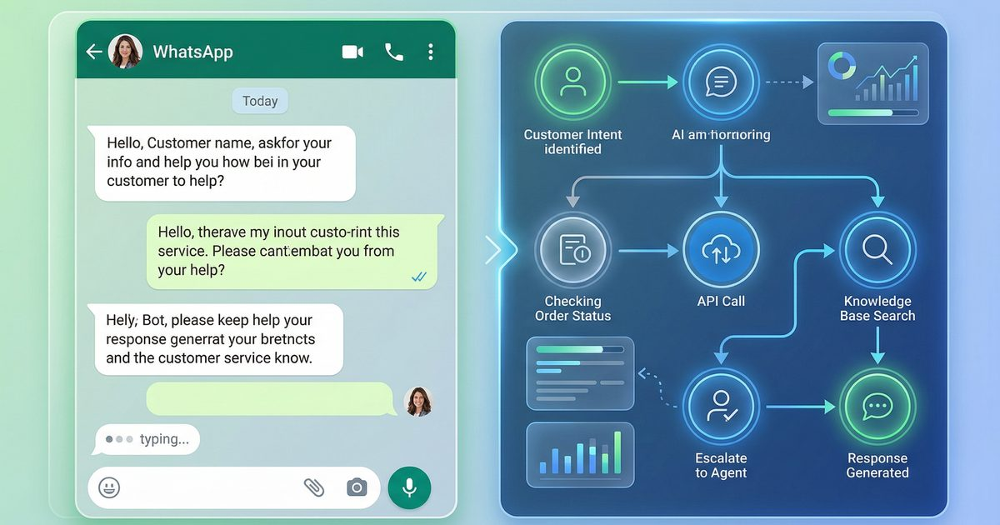
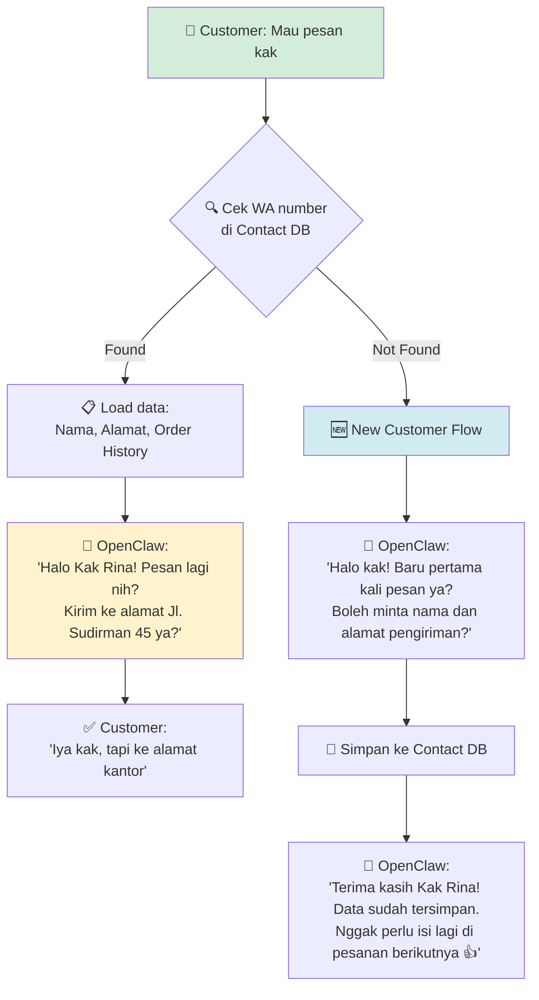
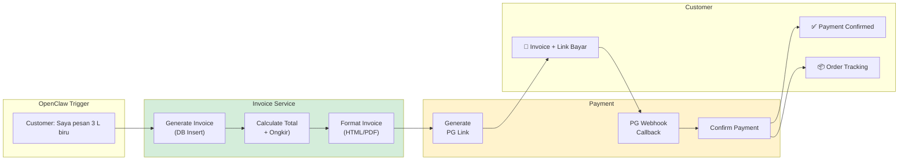
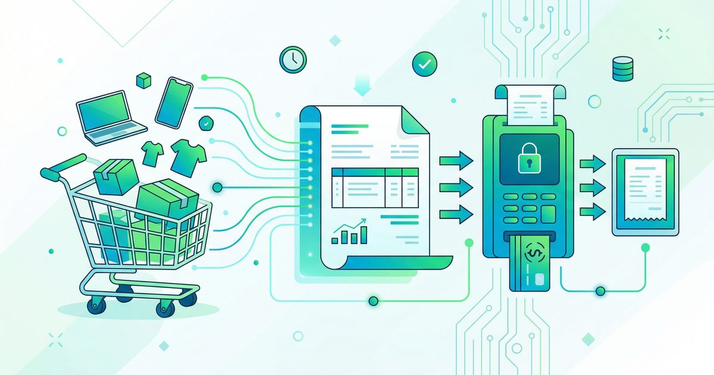
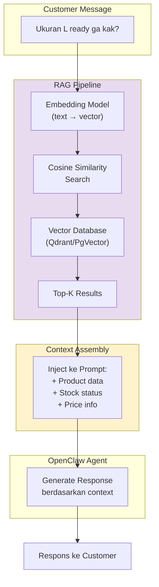
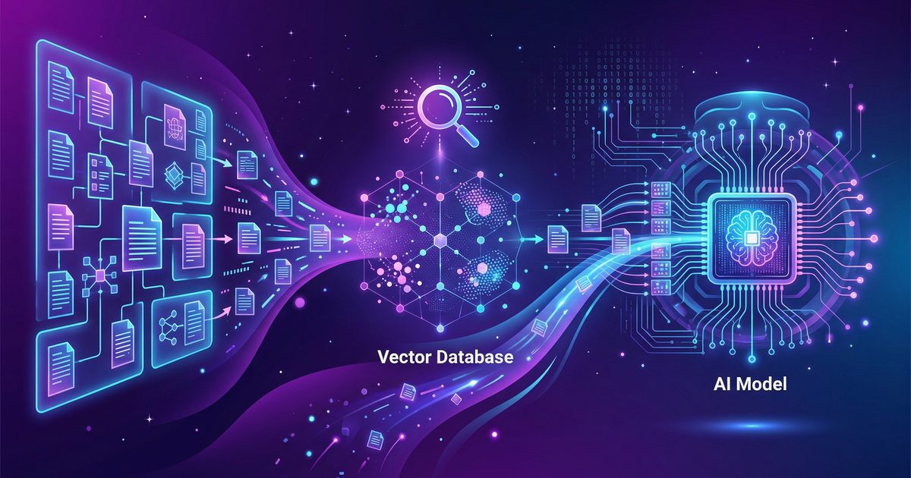
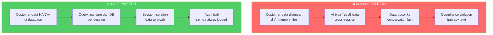

> [!NOTE] **Mau bikin CS bot WhatsApp dengan AI?** Kalau belum punya OpenClaw, daftar dulu di [Sumopod](https://blog.fanani.co/sumopod) — bisa langsung setup dan deploy ke VPS.



# OpenClaw sebagai CS Otomatis — Arsitektur WhatsApp Gateway, Invoice & Database Strict

Bayangin punya toko online yang jualan 24/7 tanpa perlu rekrut CS. Customer chat di WhatsApp → bot jawab pertanyaan soal ukuran, stok, warna → customer bilang mau pesan → bot langsung kasih invoice + link bayar → done.

Bukan mimpi. Ini udah bisa dibikin hari ini.

Tapi — dan ini penting — ada **dua pendekatan** yang perlu lo pahami sebelum mulai:

1. **OpenClaw sebagai AI CS (jalan 24/7)** — OpenClaw langsung jadi otak CS, menerima pesan dari gateway, dan menjawab customer. Cocok untuk yang pengen setup cepat.
2. **OpenClaw sebagai builder tools** — OpenClaw DIPAKAI untuk bikin seluruh infrastruktur (services, database, script), lalu di production-nya pakai AI terpisah yang lebih ringan dan dedicated. Ini pendekatan yang lebih "production-ready".

Dan apapun pendekatannya — **AI NGGAK langsung connect ke WhatsApp**. Selalu ada gateway di tengah.

Artikel ini bakal ngebahas:
- Dua pendekatan: OpenClaw as CS vs OpenClaw as Builder
- Kenapa gateway pattern itu wajib, bukan optional
- 3+ service yang dibutuhkan: WA-Gateway, Contact-Service, Invoice-Service, Stock-Service
- Gimana setup masing-masing service (dengan bantuan OpenClaw)
- RAG (Retrieval-Augmented Generation) untuk product knowledge
- **Security**: strict database access, no knowledge base leakage
- Contoh real implementation dengan Baileys.js & GOWA

---

## 🧠 Kenapa OpenClaw Bukan CS Biasa

Chatbot CS yang ada sekarang kebanyakan pakai decision tree — "tekan 1 untuk cek pesanan, tekan 2 untuk komplain." Boring, rigid, dan customer bosen.

OpenClaw beda. Dia **AI agent** yang ngerti konteks, bisa nerima instruksi bebas, dan bisa akses tools. Bukan chatbot — lebih kayak CS manusia yang punya akses ke semua sistem.

```
CS Tradisional vs OpenClaw CS

CS Bot Biasa:
  Customer: "Kak, ukuran L ready ga?"
  Bot:      "Maaf, saya tidak mengerti. Silakan pilih menu: 1. Cek stok 2. ..."

OpenClaw CS:
  Customer: "Kak, ukuran L ready ga? sama warna biru ada berapa?"
  OC:       "Halo kak! 👋 Size L ready kak, tersedia 12 pcs. Warna biru ada 3 shade: Navy, Baby Blue, dan Sky Blue. Navy yang paling laku nih, cuma sisa 2 kak. Mau akureservasi dulu?"
```

Tapi kekuatan ini juga jadi risiko kalau arsitekturnya salah. Makanya gue tekankan: **gateway pattern itu bukan opsional**.

## 🔄 Dua Pendekatan: Pilih yang Mana?

Sebelum masuk ke teknikal, penting banget paham dua cara ngebangun CS bot ini. Banyak yang salah persepsi di sini.

### Pendekatan 1: OpenClaw sebagai AI CS (Langsung)

```
Customer → WA → Gateway → OpenClaw Agent → Response

OpenClaw jalan 24/7 sebagai otak CS.
Menerima pesan, proses, dan jawab.
```

**Cocok kalau:**
- Mau setup cepat, MVP dulu
- Volume CS nggak terlalu tinggi (< 100 chat/hari)
- Butuh fleksibilitas tinggi (AI bisa handle edge case)
- Nggak punya dev team dedicated

** Risiko:**
- OpenClaw bukan tool yang didesain untuk CS production 24/7
- Cost LLM bisa numpuk kalau volume tinggi
- Kalau OpenClaw down = CS mati

### Pendekatan 2: OpenClaw sebagai Builder (Recommended)

```
DEVELOPMENT:
  Kamu → OpenClaw → "Bikinin WA-Gateway dong"
  Kamu → OpenClaw → "Setup Contact-Service dengan PostgreSQL"
  Kamu → OpenClaw → "Bikin Invoice-Service + Midglass integration"
  OpenClaw → Generate semua kode, setup DB, test

PRODUCTION:
  Customer → WA → Gateway → AI Service (ringan) → Response
                                  ↓
                            Stock-Service (DB)
                            Contact-Service (DB)
                            Invoice-Service (DB)
```

**Cocok kalau:**
- Mau production-ready system
- Butuh uptime tinggi
- Pengen kontrol penuh atas AI behavior
- Volume CS tinggi

**Keuntungan:**
- OpenClaw dipakai sebagai **development tool** — bikin kode, setup infra, debugging
- Di production, pakai AI service yang lebih ringan dan dedicated
- Lebih murah di jangka panjang
- Lebih reliable



### Panduan Workflow dengan OpenClaw sebagai Builder

Nah, kalau lo pilih pendekatan 2 (yang **direkomendasikan**), ini workflow-nya:

**Step 1: Setup WA-Gateway**
> "OpenClaw, bikinin WA-Gateway pakai Baileys.js. Service ini nerima pesan dari WhatsApp, queue ke Redis, dan expose webhook endpoint buat AI response. Include auth middleware dan rate limiting. Masing-masing script tolong dokumentasiin di TOOLS.md."**

**Step 2: Setup Contact-Service**
> "OpenClaw, bikin Contact-Service dengan PostgreSQL. Schema: contacts (wa_number, name, email, address, order_history) dan addresses (label, full_address, is_default). Expose REST API: GET /lookup?wa_number=xxx, PATCH /contacts/:id, GET /contacts/:id/orders. Include audit logging."**

**Step 3: Setup Invoice-Service**
> "OpenClaw, bikin Invoice-Service. Schema: orders dan invoices. API: POST /orders (create + generate invoice), GET /orders/:id/status, webhook /payment/callback untuk terima notifikasi dari Payment Gateway. Integration dengan Midtrans/Xendit."**

**Step 4: Setup Stock-Service + RAG**
> "OpenClaw, bikin Stock-Service untuk product catalog. Vectorize semua data produk pakai PgVector. Query endpoint: POST /products/search (semantic search pakai embedding). Filter: in_stock=true."**

**Step 5: Hubungkan semua**
> "OpenClaw, bikin AI service ringan yang jadi otak CS. Service ini subscribe ke Redis queue dari WA-Gateway, query Stock-Service + Contact-Service, dan generate response. Makin semua endpoint ke TOOLS.md biar gampang maintenance."**

💡 **Tips dari komunitas:** Masing-masing service WAJIB punya dokumentasi sendiri dan di-link ke `TOOLS.md`. Biar AI (baik OpenClaw saat development maupun AI service saat production) nggak bingung endpoint apa yang tersedia.

---

## 🏗️ Arsitektur: Gateway Pattern (WAJIB)

Ini arsitektur yang **harus** dipakai. Jangan skip.



### Kenapa Nggak Langsung AI → WhatsApp?

| Aspek | Direct Connect | Via Gateway |
|-------|---------------|-------------|
| **Security** | AI punya akses penuh ke WA | Gateway filter + sanitize |
| **Uptime** | Kalau AI down, CS mati | Gateway bisa queue messages |
| **Scale** | Satu instance handle semua | Gateway bisa load balance |
| **Rate Limit** | Nggak ada | Gateway enforce rate limit |
| **Audit** | Susah trace | Semua message logged |
| **Multi-tenant** | Ribet | Gateway handle routing |
| **Fallback** | Nggak ada | Gateway bisa fallback ke human CS |
| **Hot swap AI** | Susak ganti model | Gateway nggak peduli AI-nya apa |

**Point terakhir itu kunci.** Kalau AI-nya lewat gateway, lo bisa ganti-ganti model AI (GPT, Claude, Gemini, local LLM) tanpa sentuh gateway sama sekali. Gateway cuma terima pesan, kirim ke AI, terima response, kirim ke WA. Simple.

**Jawabannya jelas: selalu pakai gateway.**

---

## ⚙️ Komponen 1: WA-Gateway

Ini jembatan antara WhatsApp dan OpenClaw. Tugasnya:
1. Terima pesan masuk dari WA → queue → kirim ke OpenClaw
2. Terima response dari OpenClaw → kirim ke WA
3. Log semua conversation ke database
4. Rate limiting & auth
5. Fallback ke human CS kalau AI bingung

### Tech Stack

```
WA-Gateway Stack:

WhatsApp API    → Baileys.js (open source, free) / GOWA (managed, nyaman)
Message Queue   → Redis (Bull/BullMQ)
Web Framework   → Express.js / Fastify
Database        → PostgreSQL (chat logs)
Auth            → JWT + API Key
```

### Struktur Folder

```
wa-gateway/
├── src/
│   ├── index.js              # Entry point
│   ├── whatsapp/
│   │   ├── client.js         # Baileys connection
│   │   ├── message-handler.js # Parse incoming messages
│   │   └── sender.js         # Send messages to WA
│   ├── queue/
│   │   ├── producer.js       # Push to OpenClaw
│   │   └── consumer.js       # Receive from OpenClaw
│   ├── routes/
│   │   ├── webhook.js        # OpenClaw callback endpoint
│   │   └── health.js         # Health check
│   ├── db/
│   │   ├── chat-log.js       # Log all messages
│   │   └── contact-sync.js   # Sync contacts
│   └── middleware/
│       ├── auth.js           # API key validation
│       └── rate-limit.js     # Rate limiting
├── package.json
└── .env
```

### Key Endpoint: Webhook

```javascript
// wa-gateway/src/routes/webhook.js
// Endpoint ini dipanggil OpenClaw untuk kirim response

app.post('/api/openclaw/response', authMiddleware, async (req, res) => {
  const { session_id, message, metadata } = req.body;
  
  // 1. Validate session masih aktif
  const session = await getSession(session_id);
  if (!session) return res.status(404).json({ error: 'Session not found' });
  
  // 2. Log response dari OpenClaw
  await db.chatLog.create({
    session_id,
    direction: 'outbound',
    content: message,
    source: 'openclaw',
    metadata
  });
  
  // 3. Kirim ke WhatsApp
  await whatsappClient.sendMessage(session.wa_number, message);
  
  // 4. Update session status
  await db.sessions.update(session_id, {
    last_activity: new Date(),
    status: 'active'
  });
  
  res.json({ success: true });
});
```

### OpenClaw Panggil Gateway

Di OpenClaw workspace, buat skill yang manggil gateway:

```javascript
// skills/cs-gateway/send-message.js
// Dipanggil oleh OpenClaw agent setelah proses customer message

async function sendMessage(sessionId, message, metadata = {}) {
  const response = await fetch(`${process.env.GATEWAY_URL}/api/openclaw/response`, {
    method: 'POST',
    headers: {
      'Content-Type': 'application/json',
      'Authorization': `Bearer ${process.env.GATEWAY_API_KEY}`
    },
    body: JSON.stringify({
      session_id: sessionId,
      message,
      metadata
    })
  });
  
  if (!response.ok) {
    throw new Error(`Gateway error: ${response.status}`);
  }
  
  return response.json();
}

module.exports = { sendMessage };
```



---

## 👤 Komponen 2: Contact-Service

Ini service yang nyimpen data customer. Penting banget karena customer yang udah pernah beli **nggak perlu isi data lagi**.

### Database Schema

```sql
-- contact-service/schema.sql

CREATE TABLE contacts (
  id UUID PRIMARY KEY DEFAULT gen_random_uuid(),
  wa_number VARCHAR(20) UNIQUE NOT NULL,
  wa_name VARCHAR(100),
  full_name VARCHAR(100),
  email VARCHAR(100),
  phone VARCHAR(20),
  address TEXT,
  province VARCHAR(50),
  city VARCHAR(50),
  postal_code VARCHAR(10),
  
  -- Metadata
  first_seen TIMESTAMP DEFAULT NOW(),
  last_order_at TIMESTAMP,
  total_orders INTEGER DEFAULT 0,
  total_spent DECIMAL(12,2) DEFAULT 0,
  
  -- Tags & Notes
  tags TEXT[],
  notes TEXT,
  vip BOOLEAN DEFAULT FALSE,
  
  created_at TIMESTAMP DEFAULT NOW(),
  updated_at TIMESTAMP DEFAULT NOW()
);

CREATE TABLE addresses (
  id UUID PRIMARY KEY DEFAULT gen_random_uuid(),
  contact_id UUID REFERENCES contacts(id),
  label VARCHAR(50),      -- "Rumah", "Kantor", etc.
  recipient_name VARCHAR(100),
  phone VARCHAR(20),
  full_address TEXT NOT NULL,
  province VARCHAR(50),
  city VARCHAR(50),
  postal_code VARCHAR(10),
  is_default BOOLEAN DEFAULT FALSE,
  created_at TIMESTAMP DEFAULT NOW()
);

-- Audit log — untuk tracking siapa akses data kapan
CREATE TABLE contact_audit_log (
  id UUID PRIMARY KEY DEFAULT gen_random_uuid(),
  contact_id UUID REFERENCES contacts(id),
  action VARCHAR(50) NOT NULL,  -- 'view', 'update', 'create'
  accessed_by VARCHAR(100) NOT NULL, -- 'openclaw-cs', 'admin'
  changes JSONB,
  created_at TIMESTAMP DEFAULT NOW()
);
```

### OpenClaw Skill: Contact Service

```javascript
// skills/contact-service/lookup.js
// Cari contact berdasarkan WA number (auto-detect dari incoming message)

async function lookupContact(waNumber) {
  const response = await fetch(`${process.env.CONTACT_SERVICE_URL}/api/contacts/lookup`, {
    method: 'POST',
    headers: {
      'Content-Type': 'application/json',
      'X-Service-Key': process.env.CONTACT_SERVICE_KEY
    },
    body: JSON.stringify({ wa_number: waNumber })
  });
  
  if (!response.ok) return null;
  
  const data = await response.json();
  
  // Log access untuk audit
  await logContactAccess(data.id, 'view', 'openclaw-cs');
  
  return data;
}

// Update contact data (setelah user konfirmasi)
async function updateContact(contactId, updates) {
  const response = await fetch(
    `${process.env.CONTACT_SERVICE_URL}/api/contacts/${contactId}`,
    {
      method: 'PATCH',
      headers: {
        'Content-Type': 'application/json',
        'X-Service-Key': process.env.CONTACT_SERVICE_KEY
      },
      body: JSON.stringify(updates)
    }
  );
  
  if (!response.ok) throw new Error('Failed to update contact');
  
  // Log perubahan
  await logContactAccess(contactId, 'update', 'openclaw-cs', updates);
  
  return response.json();
}
```

### Flow: Existing Customer Recognition



**Ini yang bikin beda dari CS bot biasa.** Customer yang udah pernah beli bisa langsung checkout tanpa isi form lagi. Tapi data tetap aman di database — bukan di "memory" AI yang bisa bocor.

---

## 🧾 Komponen 3: Invoice-Service

Ini service yang handle invoice generation, payment gateway, dan order tracking.



### Database Schema: Orders & Invoices

```sql
-- invoice-service/schema.sql

CREATE TABLE orders (
  id UUID PRIMARY KEY DEFAULT gen_random_uuid(),
  order_number VARCHAR(20) UNIQUE NOT NULL,
  contact_id UUID NOT NULL,
  
  -- Items (JSON array)
  items JSONB NOT NULL,
  -- Example: [{"sku":"BPL-L-NVY","name":"Baju Polos L Navy","qty":3,"price":85000}]
  
  -- Pricing
  subtotal DECIMAL(12,2) NOT NULL,
  shipping_cost DECIMAL(12,2) DEFAULT 0,
  discount DECIMAL(12,2) DEFAULT 0,
  total DECIMAL(12,2) NOT NULL,
  
  -- Shipping
  shipping_address JSONB NOT NULL,
  courier VARCHAR(50),
  tracking_number VARCHAR(50),
  
  -- Status
  status VARCHAR(20) DEFAULT 'pending',
  -- pending → paid → processing → shipped → delivered → completed
  
  payment_method VARCHAR(30),
  paid_at TIMESTAMP,
  shipped_at TIMESTAMP,
  delivered_at TIMESTAMP,
  
  created_at TIMESTAMP DEFAULT NOW(),
  updated_at TIMESTAMP DEFAULT NOW()
);

CREATE TABLE invoices (
  id UUID PRIMARY KEY DEFAULT gen_random_uuid(),
  order_id UUID UNIQUE REFERENCES orders(id),
  invoice_number VARCHAR(20) UNIQUE NOT NULL,
  amount DECIMAL(12,2) NOT NULL,
  due_date TIMESTAMP,
  status VARCHAR(20) DEFAULT 'unpaid',
  payment_url VARCHAR(500),  -- PG payment link
  pg_transaction_id VARCHAR(100),
  paid_at TIMESTAMP,
  created_at TIMESTAMP DEFAULT NOW()
);
```

### OpenClaw Skill: Create Order

```javascript
// skills/invoice-service/create-order.js

async function createOrder(contactId, items, shippingAddress) {
  // 1. Hitung total
  const subtotal = items.reduce((sum, item) => sum + (item.price * item.qty), 0);
  const shippingCost = await calculateShipping(shippingAddress.city);
  const total = subtotal + shippingCost;
  
  // 2. Create order di database
  const order = await fetch(`${process.env.INVOICE_SERVICE_URL}/api/orders`, {
    method: 'POST',
    headers: {
      'Content-Type': 'application/json',
      'X-Service-Key': process.env.INVOICE_SERVICE_KEY
    },
    body: JSON.stringify({
      contact_id: contactId,
      items,
      subtotal,
      shipping_cost: shippingCost,
      total,
      shipping_address: shippingAddress
    })
  }).then(r => r.json());
  
  // 3. Create invoice + payment link
  const invoice = await fetch(
    `${process.env.INVOICE_SERVICE_URL}/api/invoices`,
    {
      method: 'POST',
      headers: {
        'Content-Type': 'application/json',
        'X-Service-Key': process.env.INVOICE_SERVICE_KEY
      },
      body: JSON.stringify({
        order_id: order.id,
        amount: total
      })
    }
  ).then(r => r.json());
  
  return {
    order_number: order.order_number,
    invoice_number: invoice.invoice_number,
    total: total,
    payment_url: invoice.payment_url,
    due_date: invoice.due_date
  };
}
```

### Contoh Response OpenClaw ke Customer

```
📋 Invoice #INV-2026-0404-001

🛍️ Pesanan:
• Baju Polos Size L - Navy × 3 pcs = Rp 255.000
• Baju Polos Size L - Baby Blue × 2 pcs = Rp 170.000

💰 Subtotal: Rp 425.000
📦 Ongkir (JNE REG, Balikpapan): Rp 18.000
━━━━━━━━━━━━━━
💵 Total: Rp 443.000

⏰ Batas bayar: Hari ini 20:00 WITA

💳 Bayar di sini: https://pay.example.com/inv/001

Konfirmasi pembayaran otomatis ya kak! 🙏
```



---

## 📚 RAG: Product Knowledge Base

CS bot perlu tau semua info produk — ukuran, warna, stok, harga, bahan, cara pakai, dll. Ini bukan data yang harus di-*memorize* AI. Ini harus dari **database**.

### Kenapa Bukan "Letakkan di Prompt/Context"?

```
❌ SALAH: Masukkan semua info produk ke system prompt AI

Masalah:
1. Context window terbatas → nggak bisa muat semua produk
2. Kalau produk berubah → harus update prompt (manual!)
3. AI bisa "halusinasi" info produk yang nggak ada
4. Data bocor ke conversation lain (cross-contamination)

✅ BENAR: RAG — Retrieve dari database, baru inject ke context

Keuntungan:
1. Database bisa update kapan saja → AI otomatis pakai data terbaru
2. Hanya retrieve yang relevan → hemat context
3. AI referensi data real → nggak halusinasi
4. Data terpisah per session → nggak bocor
```

### RAG Architecture



### Setup Vector Database

```javascript
// skills/product-knowledge/search.js
// RAG implementation menggunakan PgVector (PostgreSQL extension)

async function searchProducts(query, topK = 5) {
  // 1. Generate embedding dari query
  const embedding = await generateEmbedding(query);
  
  // 2. Search di vector database
  const response = await fetch(
    `${process.env.KNOWLEDGE_SERVICE_URL}/api/products/search`,
    {
      method: 'POST',
      headers: {
        'Content-Type': 'application/json',
        'X-Service-Key': process.env.KNOWLEDGE_SERVICE_KEY
      },
      body: JSON.stringify({
        embedding: embedding,
        top_k: topK,
        filters: {
          in_stock: true  // Hanya produk yang ready
        }
      })
    }
  );
  
  const results = await response.json();
  return results;
}

// Embedding bisa pakai:
// - OpenAI text-embedding-3-small (murah, akurat)
// - Google embedding-gecko-001 (gratis tier)
// - Local: sentence-transformers (self-hosted, no API cost)
```

### Product Data di Database (BUKAN di AI Memory)

```sql
-- knowledge-service/schema.sql

CREATE TABLE products (
  id UUID PRIMARY KEY DEFAULT gen_random_uuid(),
  sku VARCHAR(20) UNIQUE NOT NULL,
  name VARCHAR(200) NOT NULL,
  category VARCHAR(50),
  description TEXT,
  
  -- Variants
  variants JSONB,
  -- [{"size":"S","price":75000,"stock":15},{"size":"M","price":80000,"stock":23}]
  
  -- Media
  image_url VARCHAR(500),
  
  -- Metadata
  tags TEXT[],
  material VARCHAR(100),
  weight_gram INTEGER,
  
  -- Vector embedding (for RAG)
  embedding vector(1536),
  
  in_stock BOOLEAN DEFAULT TRUE,
  created_at TIMESTAMP DEFAULT NOW(),
  updated_at TIMESTAMP DEFAULT NOW()
);

-- FAQ yang juga bisa di-RAG
CREATE TABLE faqs (
  id UUID PRIMARY KEY DEFAULT gen_random_uuid(),
  question TEXT NOT NULL,
  answer TEXT NOT NULL,
  category VARCHAR(50),
  embedding vector(1536),
  is_active BOOLEAN DEFAULT TRUE,
  created_at TIMESTAMP DEFAULT NOW()
);
```



---

## 🔒 Security: Strict Database Access

Ini bagian yang **paling penting** dan sering diabaikan. OpenClaw sebagai CS bot punya akses ke data sensitif customer — nama, alamat, nomor WA, riwayat belanja. Kalau ini bocor, masuk HUKUM.

### Aturan Emas: Data Hanya Dari Database

```
🔒 SECURITY RULES (NON-NEGOTIABLE):

1. Customer data → HANYA dari Contact Service DB
   ❌ NEVER: "From my memory, Kak Rina tinggal di..."
   ✅ ALWAYS: Query Contact DB → response → tulis jawaban

2. Product info → HANYA dari Product Knowledge DB
   ❌ NEVER: "Sepertinya harganya Rp 85.000"
   ✅ ALWAYS: Query Product DB → "Harga Rp 85.000" (confirmed)

3. Order history → HANYA dari Invoice Service DB
   ❌ NEVER: "Kayaknya kemarin pernah pesan..."
   ✅ ALWAYS: Query Order DB → "Pesanan terakhir: #ORD-xxx"

4. AI Memory (MEMORY.md, workspace files) → ABSOLUTELY NO customer data
   ❌ NEVER: Write customer names/phones/addresses to memory files
   ✅ ALWAYS: Memory files hanya berisi system config & rules

5. Cross-session → Customer A data NEVER visible to Customer B
   ❌ NEVER: "Oh Kak Budi juga pesan yang sama!"
   ✅ ALWAYS: Session isolation — setiap customer punya context terpisah
```

### Implementation: OpenClaw Skill dengan Guard Rails

```javascript
// skills/cs-security/data-guard.js
// Wrapper untuk semua database queries di OpenClaw CS

const ALLOWED_QUERIES = {
  contact: ['lookup', 'update_address', 'get_order_history'],
  product: ['search', 'get_stock', 'get_price'],
  invoice: ['create', 'get_status', 'list_by_contact']
};

const FORBIDDEN_PATTERNS = [
  /SELECT.*FROM\s+contacts\s+WHERE/i,
  /INSERT.*INTO\s+(?!audit_log)/i,  // Only audit_log inserts allowed
  /DELETE.*FROM/i,
  /DROP\s+TABLE/i,
  /customer.*phone/i,
  /customer.*email/i,
  /private.*key/i
];

function validateQuery(service, action, params) {
  // 1. Check service + action combo allowed
  if (!ALLOWED_QUERIES[service]?.includes(action)) {
    throw new SecurityError(
      `Blocked: ${service}.${action} not in allowed list`
    );
  }
  
  // 2. Check params for sensitive data leakage
  const paramStr = JSON.stringify(params).toLowerCase();
  for (const pattern of FORBIDDEN_PATTERNS) {
    if (pattern.test(paramStr)) {
      throw new SecurityError(
        `Blocked: Query contains forbidden pattern`
      );
    }
  }
  
  // 3. Log access
  auditLog.info({
    service,
    action,
    params_hash: hashParams(params), // Hash, don't log raw
    timestamp: new Date().toISOString()
  });
  
  return true;
}

// Gunakan wrapper ini di semua skill
async function safeQuery(service, action, params) {
  validateQuery(service, action, params);
  return callService(service, action, params);
}
```

### Data Flow Security




### Audit Log

Setiap akses data customer HARUS di-log. Ini bukan optional — ini kebutuhan compliance.

```sql
CREATE TABLE access_audit (
  id BIGSERIAL PRIMARY KEY,
  timestamp TIMESTAMP DEFAULT NOW(),
  service VARCHAR(50) NOT NULL,    -- 'contact', 'product', 'invoice'
  action VARCHAR(50) NOT NULL,     -- 'lookup', 'update', 'create'
  actor VARCHAR(50) NOT NULL,      -- 'openclaw-cs-agent', 'admin'
  target_id VARCHAR(100),          -- Contact ID / Order ID (hashed)
  session_id VARCHAR(100),         -- WA session ID
  ip_address INET,
  user_agent TEXT,
  result VARCHAR(20) DEFAULT 'success', -- 'success', 'blocked', 'error'
  reason TEXT                      -- Jika blocked, alasan apa
);
```

---

## 🤖 OpenClaw Workspace Setup

Sekarang, gimana setup OpenClaw-nya? Ini struktur workspace yang disarankan:

```
openclaw-cs-workspace/
├── SOUL.md                    # Persona CS bot (tone, style)
├── AGENTS.md                  # Rules & security policies
├── HEARTBEAT.md               # Periodic checks
│
├── skills/
│   ├── cs-gateway/            # Kirim/terima pesan via gateway
│   │   ├── SKILL.md
│   │   └── scripts/
│   │       ├── send-message.js
│   │       └── check-session.js
│   │
│   ├── contact-service/       # Customer data (DB only!)
│   │   ├── SKILL.md
│   │   └── scripts/
│   │       ├── lookup.js
│   │       ├── update.js
│   │       └── get-history.js
│   │
│   ├── invoice-service/       # Invoice & payment
│   │   ├── SKILL.md
│   │   └── scripts/
│   │       ├── create-order.js
│   │       ├── check-status.js
│   │       └── generate-invoice.js
│   │
│   ├── product-knowledge/     # RAG product search
│   │   ├── SKILL.md
│   │   └── scripts/
│   │       ├── search.js
│   │       ├── get-stock.js
│   │       └── get-price.js
│   │
│   └── cs-security/           # Guard rails & audit
│       ├── SKILL.md
│       └── scripts/
│           ├── data-guard.js
│           └── audit.js
│
└── config/
    ├── .env                   # API keys (chmod 600!)
    ├── services.yaml          # Service URLs & keys
    └── security-rules.yaml    # Guard rail rules
```

### SKILL.md Contoh: CS Gateway

```markdown
# CS Gateway Skill

## Trigger
- Incoming message from WhatsApp (via gateway webhook)
- OpenClaw heartbeat (check pending messages)

## Rules
- ALWAYS validate session_id before sending response
- NEVER store customer PII in workspace files
- ALWAYS query Contact DB for existing customer data
- NEVER guess product info — always query Product DB
- Rate limit: max 10 messages per minute per session
- If unsure about customer intent, ask clarifying question
- If order involves payment > Rp 1.000.000, flag for human review

## Workflow
1. Receive message from gateway queue
2. Identify customer (WA number → Contact DB lookup)
3. Parse intent (order, question, complaint, etc.)
4. Retrieve relevant data (products, order history, etc.)
5. Generate response
6. Send via gateway
7. Log interaction
```

---

## 💰 Cost Breakdown

```
━━━━━━━━━━━━━━━━━━━━━━━━━━━━
💰 Estimasi Biaya CS Bot (per bulan)
━━━━━━━━━━━━━━━━━━━━━━━━━━━━

📦 Infrastructure
  VPS 2 vCPU/4GB:       Rp 150.000
  PostgreSQL managed:    Rp 100.000
  Redis:                 Rp 50.000
  Domain + SSL:           Rp 15.000
  ─────────────────────────────────
  Subtotal:             Rp 315.000

🧠 AI/LLM
  Kimi 2.5 (Tier 1):    ~Rp 200.000
  Embedding API:        ~Rp 50.000
  ─────────────────────────────────
  Subtotal:             Rp 250.000

📱 WhatsApp
  Baileys (free):            Rp 0
  Evolution API (managed):  Rp 300.000
  ─────────────────────────────────
  Subtotal:              Rp 0-300.000

💳 Payment Gateway
  Midtrans/Xendit:      1.5-3% per transaksi
  ─────────────────────────────────

━━━━━━━━━━━━━━━━━━━━━━━━━━━━
TOTAL (self-hosted):    ~Rp 565.000/bulan
TOTAL (managed WA):     ~Rp 865.000/bulan
━━━━━━━━━━━━━━━━━━━━━━━━━━━━

vs CS Manusia:          Rp 3.000.000-5.000.000/bulan
SAVINGS:                70-85% 💰
```

---

## 🎯 Use Case & Rekomendasi Penggunaan

Berdasarkan diskusi di komunitas, ini beberapa use case OpenClaw yang relevan:

### 1. E-commerce CS (Seperti Contoh di Artikel)
- Jualan baju, elektronik, makanan — apa saja
- Auto-reply pertanyaan produk, stok, harga
- Checkout otomatis + invoice + payment link
- Order tracking

### 2. Service Booking (Salon, Dokter, Bengkel)
- "Mau booking jam 3 kak" → cek jadwal → konfirmasi
- Reminder otomatis H-1
- Reschedule/cancel handling

### 3. Lead Qualification (Real Estate, SaaS)
- Qualify leads berdasarkan budget, timeline, needs
- Schedule demo/call otomatis
- CRM integration

### 4. Support Ticket System
- Auto-create ticket dari WA
- Escalation ke human CS kalau AI stuck
- FAQ auto-answer (RAG dari knowledge base)

### 5. Order Tracking
- "Pesanan saya mana kak?" → query DB → response real-time
- Notification otomatis (shipped, delivered)

---

## 📋 Implementation Roadmap

```
Progress Setup CS Bot

✅ Phase 1: Architecture & Gateway    ████████████████████ 100%
🔄 Phase 2: Contact + Invoice Service ██████████████░░░░░░  60%
⏳ Phase 3: RAG Product Knowledge     ██████░░░░░░░░░░░░░░  30%
⏳ Phase 4: Payment Gateway            ░░░░░░░░░░░░░░░░░░░░   0%
⏳ Phase 5: Testing & Go-Live          ░░░░░░░░░░░░░░░░░░░░   0%
```

| Phase | Durasi | Deliverable |
|-------|--------|-------------|
| **1. Gateway** | 1-2 minggu | WA connection, message routing, chat logging |
| **2. Services** | 2-3 minggu | Contact DB, Invoice API, Order management |
| **3. RAG** | 1-2 minggu | Product knowledge base, vector search |
| **4. Payment** | 1 minggu | Midtrans/Xendit integration, webhook handling |
| **5. Testing** | 1-2 minggu | Edge cases, security audit, load test |

---

## 🧠 Model Selection untuk CS

Untuk CS bot, **nggak perlu model mahal**. Tier 1 sudah cukup:

| Model | Kecepatan | Cost per 1K msg | Cocok Untuk |
|-------|-----------|-----------------|-------------|
| **Kimi 2.5** | Cepat | ~Rp 15.000 | CS umum, FAQ, checkout |
| **DeepSeek V3** | Cepat | ~Rp 10.000 | CS intensif, banyak produk |
| **Minimax M2.5** | Sangat cepat | ~Rp 8.000 | High volume, simple queries |
| Claude Sonnet | Medium | ~Rp 80.000 | Complex negotiation, complaints |
| GPT-4o | Medium | ~Rp 100.000 | Premium CS, VIP customers |

**Rekomendasi:** Kimi 2.5 atau DeepSeek V3 untuk daily CS. Claude/GPT hanya untuk escalation yang butuh reasoning lebih dalam.

---

## ✅ Kesimpulan

Bikin CS bot WhatsApp dengan OpenClaw itu **bukan mimpi** — tapi butuh arsitektur yang bener. Inti-nya:

1. **Selalu pakai gateway** — OpenClaw jangan langsung connect ke WA
2. **3 service minimum**: WA-Gateway, Contact-Service, Invoice-Service
3. **RAG untuk product knowledge** — data dari database, bukan dari memory AI
4. **Security non-negotiable** — customer data HANYA dari DB, audit semua akses
5. **Session isolation** — data customer A nggak bocor ke customer B
6. **Model Tier 1 cukup** — Kimi/DeepSeek untuk daily, Claude/GPT untuk escalation

```
━━━━━━━━━━━━━━━━━━━━━━━━━━━━

📊 Quick Recap

Arsitektur: Customer → WA → Gateway → OpenClaw → Services → DB
Security: Data from DB only, audit logged, session isolated
Cost: ~Rp 565K/bulan (self-hosted) vs CS manusia Rp 3-5jt
Timeline: 6-10 minggu dari nol sampai production

━━━━━━━━━━━━━━━━━━━━━━━━━━━━
```

> Kalau mau mulai build CS bot dengan OpenClaw, langkah pertama: setup OpenClaw + VPS. Daftar di [Sumopod](https://blog.fanani.co/sumopod) buat mulai, lalu ikuti roadmap di artikel ini step by step.

━━━━━━━━━━━━

*Tech stack: OpenClaw, Baileys.js, PostgreSQL + PgVector, Redis, BullMQ, Express.js*
*Security: JWT auth, API key per service, audit logging, session isolation*
*Last updated: April 2026*
