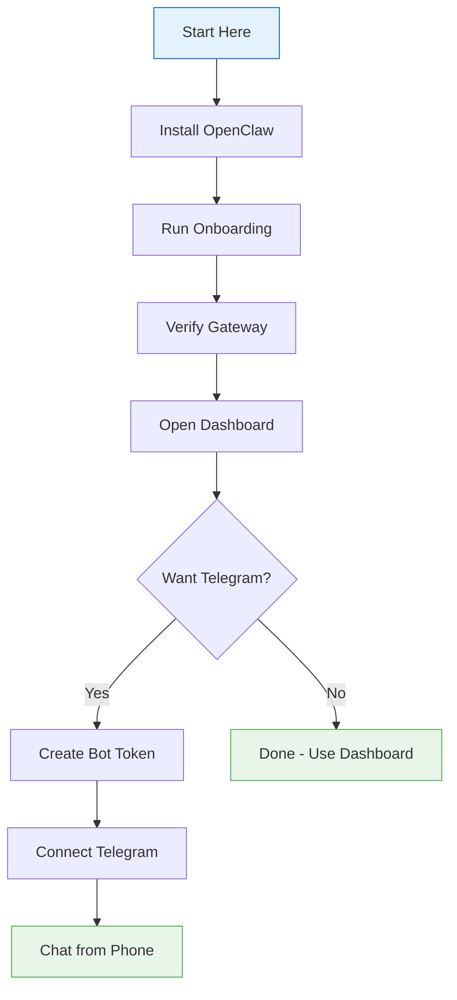
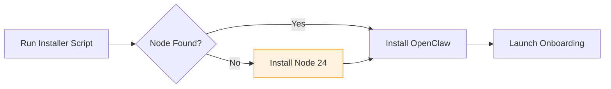
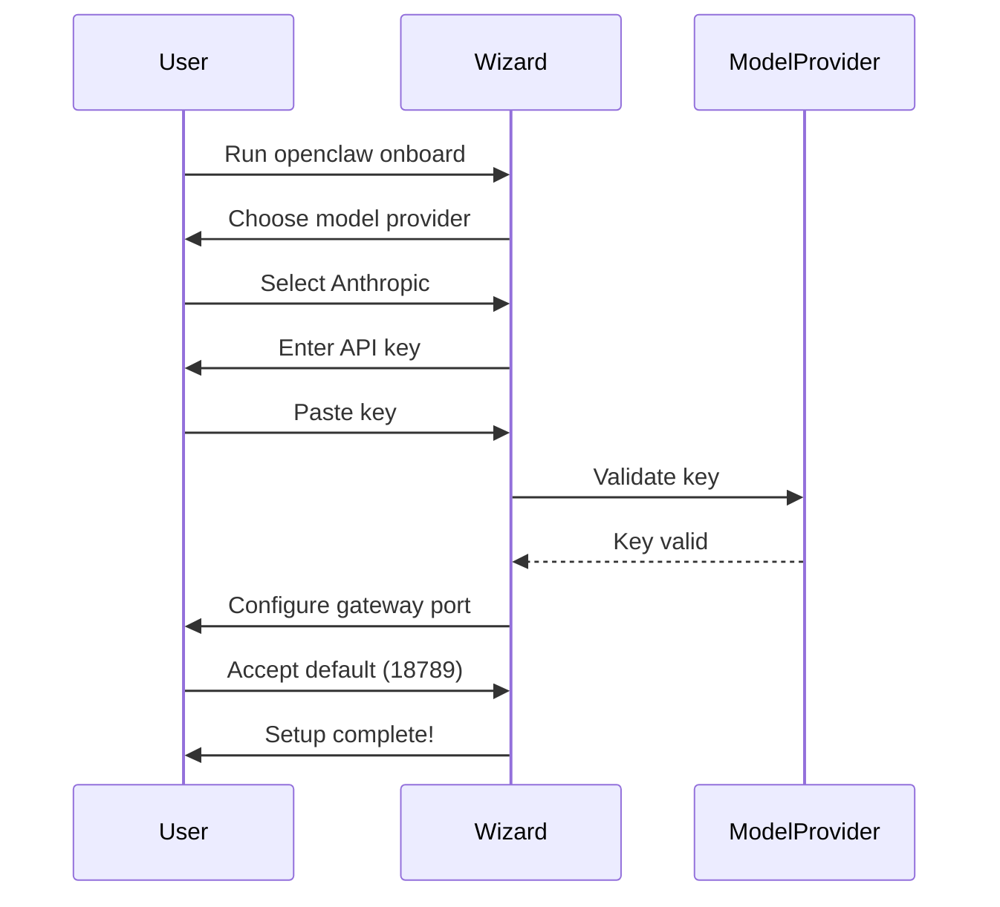
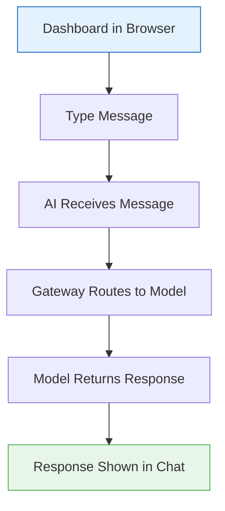
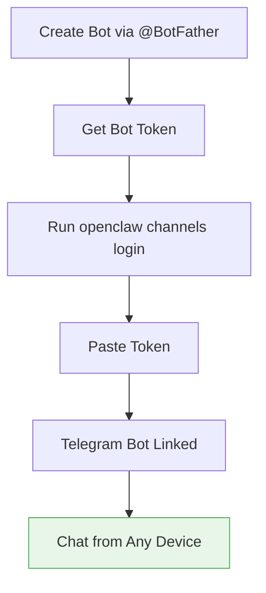
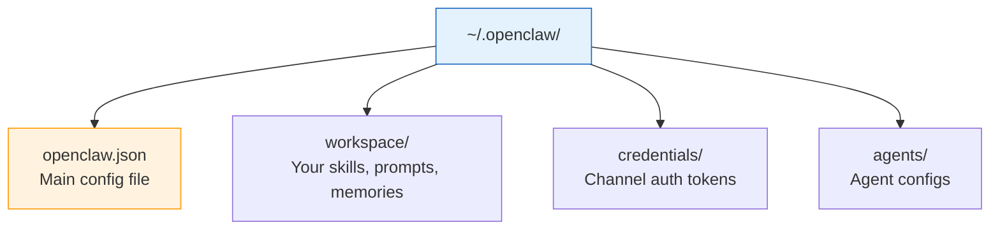
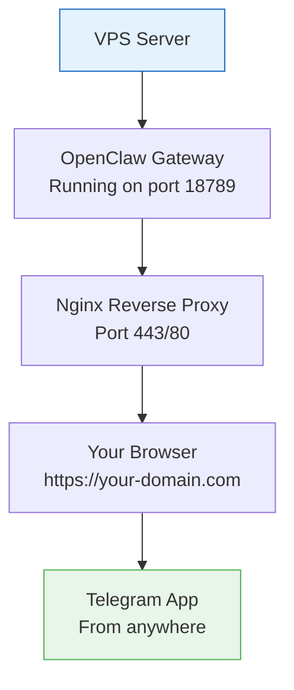
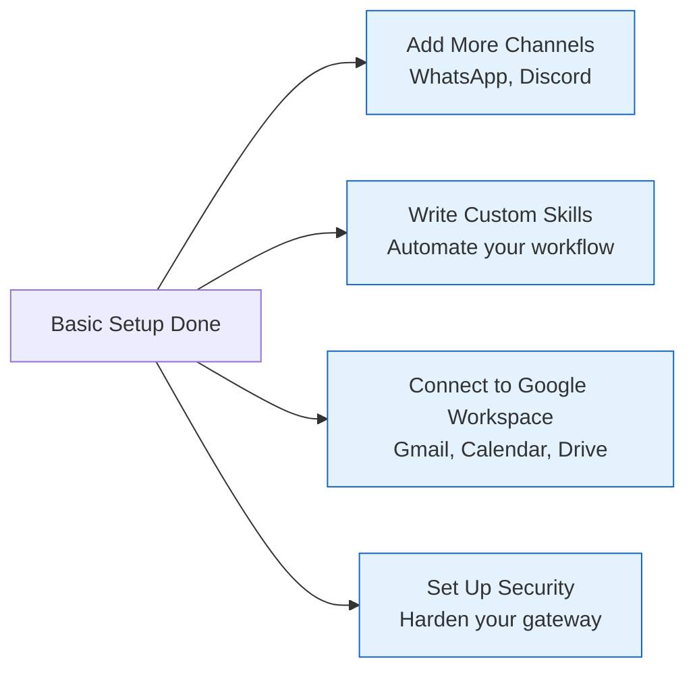

# OpenClaw Gateway Setup From Scratch
## Get Your AI Assistant Running in 10 Minutes or Less

> **Reading Time:** 15 minutes
> **Difficulty:** Beginner
> **OS:** macOS, Linux, Windows (WSL2 recommended)
> **Gateway Version:** OpenClaw v2025+

---

## What We Are Building

By the end of this guide you will have:

- OpenClaw Gateway installed and running on your machine or VPS
- A working AI chat session in your browser
- Optional: Connect Telegram so you can chat with your AI from your phone
- A solid foundation to add more channels and integrations later

This is the most straightforward path into OpenClaw. No fluff, no complex setup. Just install, answer a few questions, and start chatting.



---

## What You Need Before Starting

The official docs say you need:

- **Node.js** version 24 (recommended) or at least version 22.14
- **An API key** from a model provider like Anthropic, OpenAI, or Google

That is basically it. Everything else gets handled by the installer.

Check your Node version first. Open a terminal and type:

```bash
node --version
```

If you see a number below 22.14, you need to update Node first.

For Windows users: WSL2 is strongly recommended over native Windows. It is more stable and plays better with the rest of the tooling. The official docs themselves say this.

---

## Step 1: Install OpenClaw in 30 Seconds

The fastest way is the official installer script. It detects your operating system, installs Node if needed, sets up OpenClaw, and kicks off the onboarding wizard automatically.

### macOS, Linux, or WSL2

Paste this into your terminal and hit enter:

```bash
curl -fsSL https://openclaw.ai/install.sh | bash
```

### Windows (PowerShell)

Open PowerShell as administrator and run:

```powershell
iwr -useb https://openclaw.ai/install.ps1 | iex
```

The installer will do several things. It checks for Node, installs it if missing, then installs OpenClaw itself. Depending on your internet speed and whether Node needs to be installed, this takes 1 to 5 minutes.



If you want to install without running the onboarding wizard right away (maybe you want to prepare first), use:

```bash
curl -fsSL https://openclaw.ai/install.sh | bash -s -- --no-onboard
```

---

## Step 2: Run the Onboarding Wizard

After installation finishes, the wizard launches automatically. If you skipped it with `--no-onboard`, start it manually:

```bash
openclaw onboard --install-daemon
```

The wizard asks you a few things:

1. **Choose a model provider** - Anthropic, OpenAI, Google, and others
2. **Enter your API key** - paste the key from your provider
3. **Gateway configuration** - mostly defaults work fine

It takes about 2 minutes to get through everything.



For the model provider, here is a quick breakdown of the main options:

| Provider | Good For | Notes |
|----------|----------|-------|
| Anthropic (Claude) | General conversation, coding, reasoning | Best overall quality |
| OpenAI (GPT-4o) | Fast responses, function calling | Well-supported |
| Google (Gemini) | Long context, multimodal | Good value |
| DeepSeek | Budget-friendly, strong reasoning | Emerging option |

If you do not have an API key yet, the wizard explains where to get one from each provider. Getting one typically takes 5 minutes and you usually get free credits to start.

---

## Step 3: Verify the Gateway is Running

After onboarding finishes, check that everything started properly:

```bash
openclaw gateway status
```

You should see the Gateway listening on port 18789. If it says something is wrong, the wizard normally tells you exactly what to fix.

If the status command is not finding anything, try:

```bash
openclaw health
```

This runs a more thorough check and tells you exactly what is missing or misconfigured.

---

## Step 4: Open the Dashboard

The dashboard (also called the Control UI) is a web interface where you can chat with your AI assistant and manage settings.

Open it with:

```bash
openclaw dashboard
```

This opens your default browser to the dashboard. If it loads and you can type a message and get an AI reply, you are done with the basic setup.



---

## Step 5: Connect Telegram (Optional but Worth It)

This is the fastest way to make your AI assistant available from your phone. Telegram bots are free, and the setup takes about 5 minutes.

### Create a Telegram Bot

1. Open Telegram and search for **@BotFather**
2. Send the message `/newbot`
3. BotFather asks for a name - give your bot any name you like
4. BotFather asks for a username - it must end in `bot` (example: `myassistant_bot`)
5. BotFather gives you a **bot token** that looks like `123456789:ABCdefGhIJKlmNoPQRsTUVwxYZ`

Save that token somewhere. You will paste it in the next step.

### Connect the Bot to OpenClaw

Back in your terminal, run:

```bash
openclaw channels login
```

This walks you through linking your Telegram bot. When it asks for the bot token, paste the one from BotFather.

After linking, you should be able to open Telegram, find your bot by its username, and send it a message. Your AI assistant should reply.



Now you can message your AI from anywhere, even when your computer is asleep. The gateway keeps running in the background.

---

## Alternative Installation Methods

The installer script is the recommended path, but there are other ways if you prefer them.

### Using npm (If You Manage Node Yourself)

If you already have Node 22+ installed and prefer npm:

```bash
npm install -g openclaw@latest
openclaw onboard --install-daemon
```

### Using pnpm

```bash
pnpm add -g openclaw@latest
pnpm approve-builds -g
openclaw onboard --install-daemon
```

Note: pnpm requires explicit approval for packages with build scripts. The `approve-builds` step handles that.

### Using bun

```bash
bun add -g openclaw@latest
openclaw onboard --install-daemon
```

Bun is supported for the global CLI install path. For the Gateway runtime itself, Node remains the recommended daemon runtime.

### Troubleshooting: Sharp Build Errors

If `sharp` (an image processing library) fails during npm install due to a globally installed libvips conflict:

```bash
SHARP_IGNORE_GLOBAL_LIBVIPS=1 npm install -g openclaw@latest
```

### From Source (For Developers)

If you want to run the development version or contribute:

```bash
git clone https://github.com/openclaw/openclaw.git
cd openclaw
pnpm install && pnpm ui:build && pnpm build
pnpm link --global
openclaw onboard --install-daemon
```

Or skip the linking step and run directly from the repo with `pnpm openclaw ...`.

---

## Where Things Live on Your Machine

Once installed, OpenClaw keeps its files in predictable locations. Knowing these helps when you need to debug or back up data.



| Path | What It Contains |
|------|-----------------|
| `~/.openclaw/openclaw.json` | Main configuration file |
| `~/.openclaw/workspace` | Your skills, prompts, and memories |
| `~/.openclaw/credentials/` | Channel authentication (WhatsApp, Telegram, etc.) |
| `~/.openclaw/agents/<agentId>/sessions/` | Chat session histories |
| `/tmp/openclaw/` | Runtime logs |

The official docs recommend keeping your customizations in `~/.openclaw/workspace` and `~/.openclaw/openclaw.json` so that updates do not overwrite your changes.

---

## Running on a VPS (Headless Server)

So far we have looked at running OpenClaw on your local machine. But you probably want it running 24/7 on a VPS so you can access it anytime.

The setup is mostly the same. SSH into your VPS and run the installer:

```bash
curl -fsSL https://openclaw.ai/install.sh | bash
```

Then run onboarding:

```bash
openclaw onboard --install-daemon
```

When it asks which interface to bind to, choose **all interfaces** or **0.0.0.0** instead of the default localhost. This lets you access the dashboard from outside the server.

After setup, start the gateway:

```bash
openclaw gateway start
```

Check status:

```bash
openclaw gateway status
```



You will want to set up nginx as a reverse proxy with SSL (using Let is Encrypt) so you can access the dashboard over HTTPS. You also want to configure a firewall to only allow traffic on ports 80, 443, and your SSH port.

For a complete security hardening guide after setup, see our companion tutorial: [OpenClaw Security Hardening Checklist](/tutorials/openclaw-security-hardening.md).

---

## Keeping the Gateway Running in the Background

On a VPS or Mac, you want the gateway to keep running even after you close the terminal. The `--install-daemon` flag during onboarding sets up a background service.

On Linux with systemd:

```bash
openclaw gateway start
openclaw gateway stop
openclaw gateway restart
```

On macOS, the installer sets up a launch agent.

If you are on a VPS without systemd, use `pm2` to keep it alive:

```bash
npm install -g pm2
pm2 start "openclaw gateway" --name openclaw
pm2 save
pm2 startup
```

This makes sure the gateway restarts automatically if the server reboots.

---

## Updating OpenClaw

OpenClaw releases updates regularly. To update to the latest version:

```bash
npm install -g openclaw@latest
```

Then restart the gateway:

```bash
openclaw gateway restart
```

Your configuration and workspace files are kept intact. Only the core application gets updated.

---

## Common First-Time Issues

Here are the most frequent problems people hit and how to fix them.

### Gateway Will Not Start

```bash
openclaw gateway status
```

If it shows nothing, try starting manually:

```bash
openclaw gateway start
```

Check the logs for errors:

```bash
tail -f /tmp/openclaw/gateway.log
```

### Onboarding Hangs or Freezes

Press Ctrl+C to cancel, then run:

```bash
openclaw onboard --install-daemon
```

### Telegram Bot Not Responding

1. Make sure you started the bot with `/start` in Telegram
2. Check that the bot token is correct in your config
3. Run `openclaw channels login` again to re-link

### Dashboard Will Not Load

Make sure the gateway is actually running:

```bash
openclaw health
```

If health check passes but dashboard still will not load, clear your browser cache and try again.

---

## What Comes Next

Once you have the basic setup working, here are natural next steps:



- **Add WhatsApp** - Connect your WhatsApp number so you can chat from there too
- **Write custom skills** - Automate repetitive tasks with your own skill scripts
- **Connect Google Workspace** - Access Gmail, Calendar, Drive through your AI
- **Security hardening** - Lock down the gateway before exposing it online

---

## Complete Setup Checklist

| Step | Done? |
|------|-------|
| Installed OpenClaw | [ ] |
| Ran onboarding wizard | [ ] |
| Gateway status shows running | [ ] |
| Dashboard loads in browser | [ ] |
| Sent first message, got reply | [ ] |
| Telegram bot connected (optional) | [ ] |
| Gateway set to start on boot (VPS) | [ ] |

---

## For More Information

- [Official OpenClaw Installation Docs](https://docs.openclaw.ai/install)
- [Official Getting Started Guide](https://docs.openclaw.ai/start/getting-started)
- [Gateway Setup Reference](https://docs.openclaw.ai/start/setup)
- [OpenClaw GitHub Repository](https://github.com/openclaw/openclaw)
- [Channel Integration Docs](https://docs.openclaw.ai/channels)

Need a VPS to run your OpenClaw Gateway 24/7? We recommend SumoPod:

**[Get SumoPod VPS](https://blog.fanani.co/sumopod)** - Fast, affordable, and perfect for running OpenClaw around the clock with proper security.

Want this guide in Indonesian? We have a version written in mixed Bahasa Indonesia and English:

**[Baca versi Bahasa Indonesia](https://blog.fanani.co/tech/openclaw-gateway-setup/)** - Same content, written in a more casual Indonesian style.

---

## Related Tutorials

- [OpenClaw Security Hardening Checklist](/tutorials/openclaw-security-hardening.md) - Lock down your gateway after setup
- [OpenClaw Session Maintenance Guide](/tutorials/openclaw-session-maintenance.md) - Keep your gateway running smoothly
- [WhatsApp Customer Care Bot Setup](/tutorials/whatsapp-customer-care-umkm.md) - Add WhatsApp to your setup
- [WordPress Security Scanner Skill](/tutorials/wordpress-security-scanner-skill.md) - Scan your WordPress sites automatically

---

*This guide is verified against the official OpenClaw documentation at docs.openclaw.ai. All commands and steps confirmed against the official source.*

**Last Updated:** April 2026
**Version:** 1.0
**Author:** Radian IT Team
