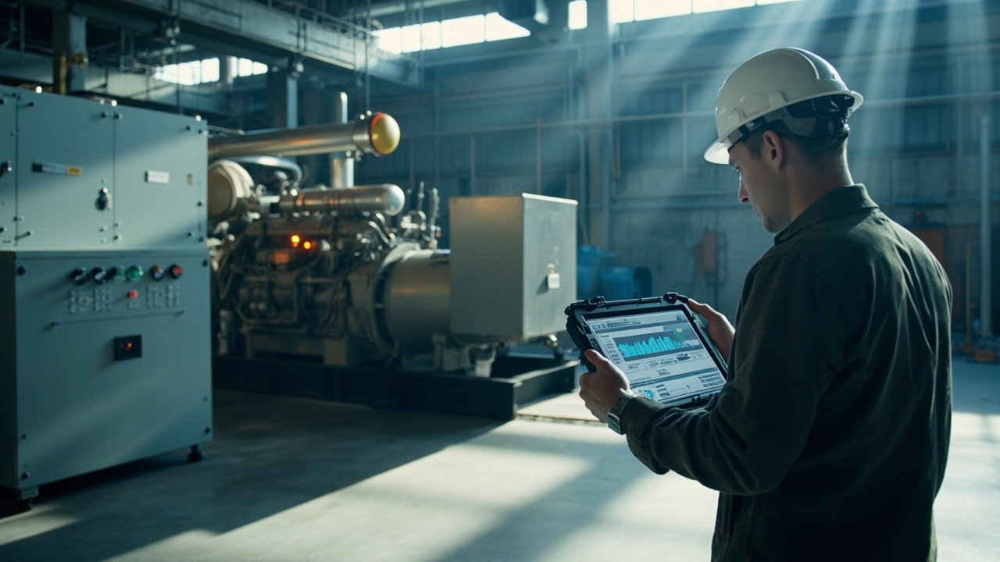
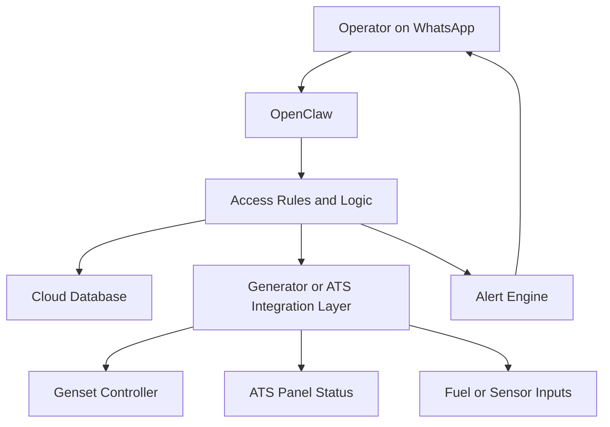
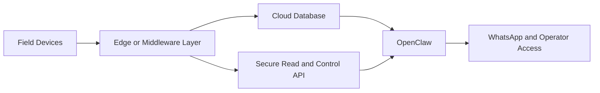
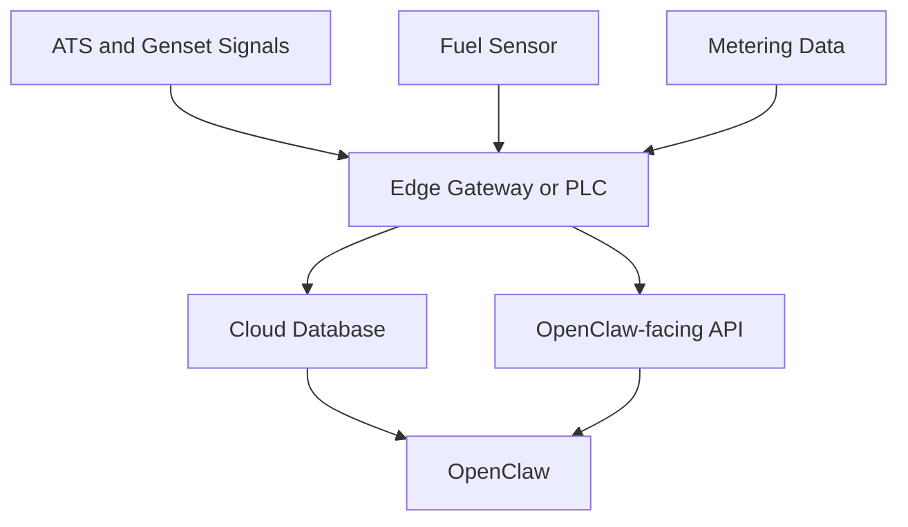
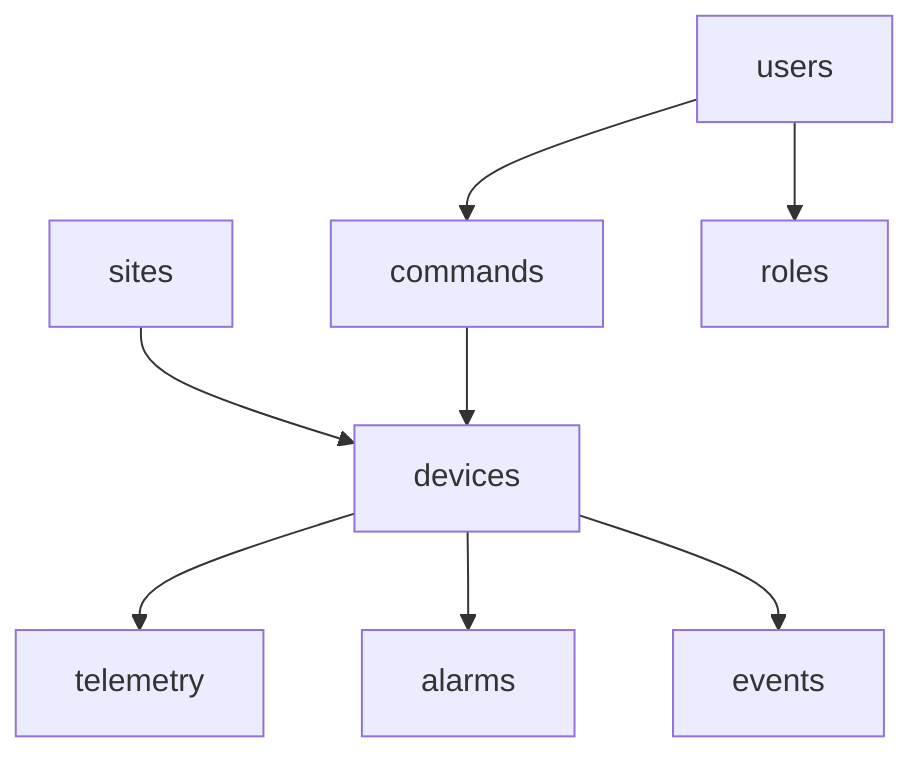
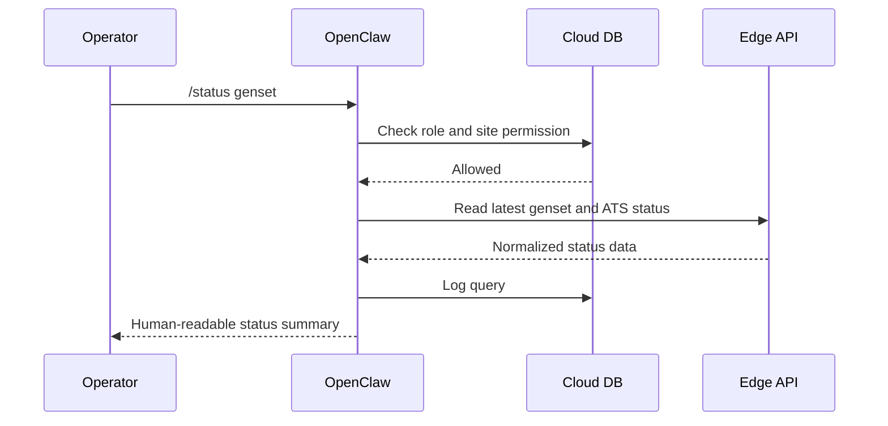
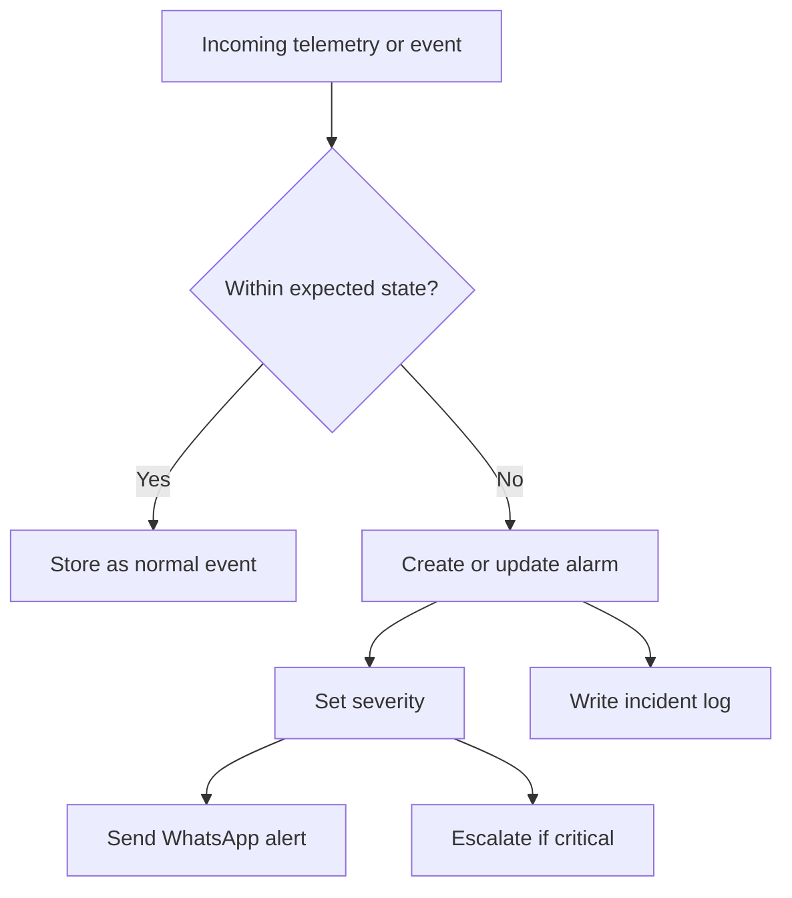
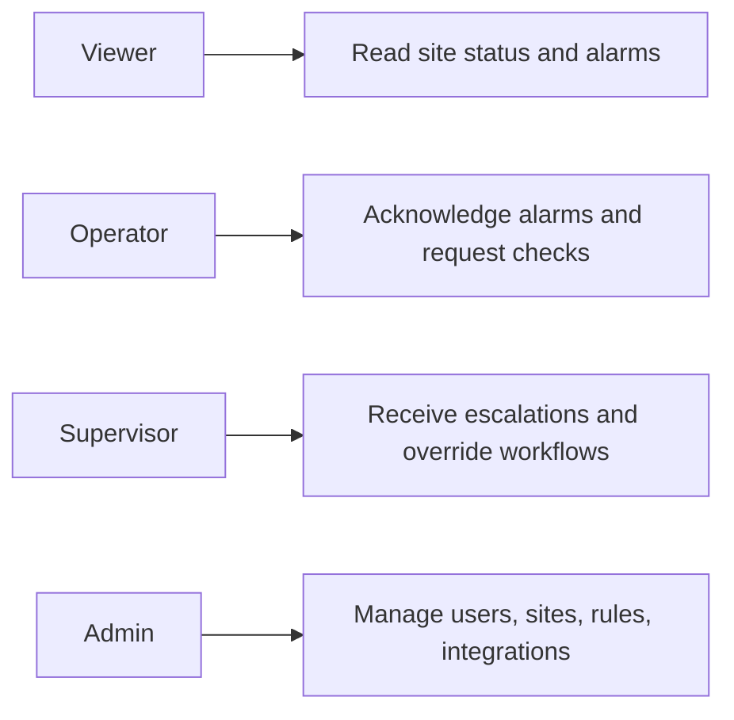
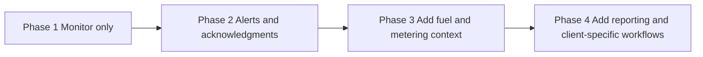

# Using OpenClaw for Generator and ATS Monitoring
## A practical pattern for backup power status, alarm workflows, WhatsApp visibility, and operator-friendly monitoring without building a full SCADA system first

> **Estimated reading time:** 32 to 38 minutes  
> **Difficulty:** Intermediate  
> **Best for:** Industrial operators, building owners, facilities teams, electrical contractors, system integrators, and anyone who needs real-world backup power monitoring with human-friendly workflows

---



## Before We Start

This is the technical English version.

If you want the easier mixed Indonesian + English walkthrough, read the companion blog post here:

**https://blog.fanani.co/tech/openclaw-genset-ats-monitoring/**

If you need a VPS to host OpenClaw, alerting flows, dashboards, and supporting automation, use our affiliate link here:

**https://blog.fanani.co/sumopod**

If you want a custom monitoring system like this for a real site, you can contact:

- **fanani@cvrfm.com**
- **+628115443456**

Consultation is available.

---

## 1. Pain Point Real

Let us start with the part that matters.

Backup power systems are usually treated like they are “there if needed,” but operationally they are often under-observed.

That creates a dangerous gap.

Many sites have a generator, an ATS panel, and some combination of alarms, but the actual visibility layer is weak.

People only discover problems when one of these happens:

- the mains power fails and the generator does not start properly
- the ATS does not transfer as expected
- the generator starts but trips under load
- fuel is low but nobody notices until too late
- the site team has no fast way to know what happened unless they are physically present
- alarm information exists, but it is buried inside a panel and not delivered to the right person

This is especially painful in:

- buildings with critical tenants
- hotels
- workshops
- industrial sites
- ports
- warehouses
- remote branches

The real operational pain is not just technical failure.

It is **slow awareness**.

If the right person cannot see the right status at the right time, the system may as well be silent.

That is exactly where OpenClaw becomes useful.

Not as a replacement for generator controllers or ATS hardware.

As the **operational orchestration layer** above them.

---

## 2. Why WhatsApp and OpenClaw Fit This Well

A lot of teams do not need a massive new control room application on day one.

They need a simpler way to:

- see status remotely
- receive alerts immediately
- ask for the current state in natural language
- log incidents and responses
- escalate only when something really matters

WhatsApp is a good fit because people already use it.

That matters more than many engineers want to admit.

An elegant system nobody opens is worse than a practical system everyone checks.

OpenClaw fits because it can act as the bridge between:

- site hardware
- cloud data
- user roles
- alert rules
- messaging
- summaries and reports

Instead of forcing the operator to read raw panel states, OpenClaw can answer things like:

```text
/status genset
/ats status
/genset alarm list
/fuel status
/power source sekarang apa?
```

And the reply can be human-friendly.

That is the real win.



---

## 3. High-Level Architecture

OpenClaw should sit above the field equipment, not inside it.

That sounds obvious, but it matters a lot.

You want the generator controller and ATS hardware to continue doing the critical electrical work.

You want OpenClaw to handle:

- monitoring
- visibility
- command workflows where safe
- alerting
- logging
- summaries
- escalation

That separation is healthy.

A clean architecture can look like this.



Field devices might include:

- generator controller
- ATS digital status points
- fuel level sensor
- current or energy meter
- mains fail / restore signals
- breaker trip status if exposed

OpenClaw should not be the first layer touching relay coils or safety-critical sequences.

It should be the layer that makes the system understandable and operationally useful.

---

## 4. Hardware and Backend Options

This is where most bad tutorials become too rigid.

Let us not do that.

The exact hardware can vary a lot. The architecture still works.

### Option A: Generator controller + Modbus TCP

Common in more serious installations.

- controller exposes run state, alarm codes, mode, engine hours, voltage, frequency
- ATS status may be available through digital I/O or gateway mapping
- edge service reads values and publishes them upward

### Option B: PLC or RTU as intermediary

If a site already has a PLC, this can be the cleanest approach.

- PLC collects discrete status points
- PLC or gateway publishes data to API or MQTT
- OpenClaw reads through the middleware

### Option C: Smart edge gateway + mixed inputs

For smaller sites:

- digital inputs for mains fail, genset running, ATS transferred
- analog input or telemetry for fuel level
- optional meter data via RS-485
- small backend service normalizes everything

The pattern still holds.



The better your normalization layer is, the easier the OpenClaw experience becomes.

---

## 5. Database Model

The schema should be practical, boring, and easy to query.

That is a compliment.

Here is a good starting model.



Meaning:

- `sites` = building, plant, warehouse, branch, port area
- `devices` = generator, ATS, fuel sensor, meter, gateway
- `telemetry` = status values, timestamps, readings
- `alarms` = active and historical alarm records
- `commands` = any manual operator action that should be logged
- `users` = operators, supervisors, managers
- `roles` = access boundaries
- `events` = system transitions like mains fail, genset start, ATS transfer, restore

This is enough to support real operations and reporting without becoming a monster.

---

## 6. Command and Interaction Flow

The conversation layer should not be random.

It should be designed.

A few very useful operator interactions:

```text
/status genset
/ats status
/fuel status
/alarm list
/source sekarang
/report genset hari ini
```

If the site allows some controlled manual actions, then maybe:

```text
/test alert
/ack alarm genset-1
/request inspection genset-1
```

A typical read interaction might look like this.



That is what makes the system pleasant to use.

Not raw register dumps. Not vague generic answers.

Clear summaries tied to actual site state.

---

## 7. Alert Logic

This is where the system becomes genuinely useful instead of decorative.

There are a few real alerts that matter a lot.

### Alert type 1: Mains fail, genset did not start in expected time

This is critical.

### Alert type 2: Genset running, ATS did not transfer

Also critical.

### Alert type 3: Genset trip or shutdown during backup operation

Extremely important.

### Alert type 4: Low fuel level

Important because it is predictable and preventable.

### Alert type 5: Controller offline or telemetry lost

This matters because no data is itself a problem.

Alert logic can look like this.



This is where OpenClaw shines.

It can turn status transitions into useful operator messages like:

> Utility power lost at Site A. Generator start signal detected, but ATS has not transferred after 20 seconds. Please inspect immediately.

That is infinitely better than “Alarm Code 17.”

---

## 8. Role Access

Do not let everyone do everything.

Even if the system is mostly read-only, access boundaries matter.

A clean role model:



This becomes especially important once you support multiple sites or multiple clients.

OpenClaw should always know:

- who is asking
- what site they belong to
- what they are allowed to see
- whether the requested action is informational or operational

That is how you keep the system trustworthy.

---

## 9. MVP Rollout

Do not overbuild the first version.

A good MVP would be:

1. monitor mains available / fail
2. monitor genset running / stopped
3. monitor ATS source status
4. send WhatsApp alerts for fail-to-start, fail-to-transfer, trip, and low fuel
5. store telemetry and events in cloud database
6. allow role-based status queries from WhatsApp
7. allow basic alarm acknowledgment flow

That alone already creates a major improvement over “wait until someone notices.”

A staged rollout can look like this.



That is the sensible path.

---

## 10. How to Productize This for Clients

This is where the business opportunity appears.

Once you have the pattern working for one site, you can package it for others.

The reason this works commercially is because many clients do not actually want to build their own monitoring stack.

They want outcomes.

They want:

- WhatsApp alerts
- clean summaries
- better visibility
- logs they can review later
- faster awareness during power incidents

A productized offer could include:

- site survey and signal mapping
- OpenClaw workflow setup
- cloud database setup
- WhatsApp channel integration
- alert rules per client
- role configuration
- monthly support and refinement

You can customize it for:

- office buildings
- hotels
- industrial workshops
- warehouses
- ports
- remote utility facilities

That makes the system reusable, not one-off.

---

## Real-World Design Principle

Let me be direct.

OpenClaw is not there to replace the generator controller.

It is there to make the operational layer smarter.

That means:

- the hard electrical logic stays in hardware and proper control systems
- the human workflow layer becomes much better through OpenClaw

That is the right split.

If you respect that boundary, the system becomes both safer and more useful.

---

## Final Take

OpenClaw is a very good fit for generator and ATS monitoring when you use it in the right role.

Not as the first layer of electrical protection.

As the layer that improves visibility, alert delivery, role-based access, history, summaries, and remote operator interaction.

That is how a backup power system becomes easier to manage in the real world.

If you want the easier mixed Indonesian + English version, read it here:

**https://blog.fanani.co/tech/openclaw-genset-ats-monitoring/**

If you need infrastructure to host the bot and automation stack, use our affiliate VPS link here:

**https://blog.fanani.co/sumopod**

And if you want a custom monitoring system like this for your own site, you can contact:

- **fanani@cvrfm.com**
- **+628115443456**

Consultation is available.

---

## Related Links

- Companion blog version: **https://blog.fanani.co/tech/openclaw-genset-ats-monitoring/**
- OpenClaw Sumopod repo: **https://github.com/fanani-radian/openclaw-sumopod**
- OpenClaw official repo: **https://github.com/openclaw/openclaw**
