# Using OpenClaw as the Backbone of a Simple IoT Port Lighting System
## Monitor, switch, alert, and manage 16 x 1000W floodlights from WhatsApp with cloud data, role-based access, and hardware-flexible architecture

> **Estimated reading time:** 26 to 32 minutes  
> **Difficulty:** Intermediate  
> **Best for:** System integrators, port operators, electrical teams, industrial automation builders, and anyone who wants a practical OpenClaw + IoT pattern without overcomplicating the stack

---

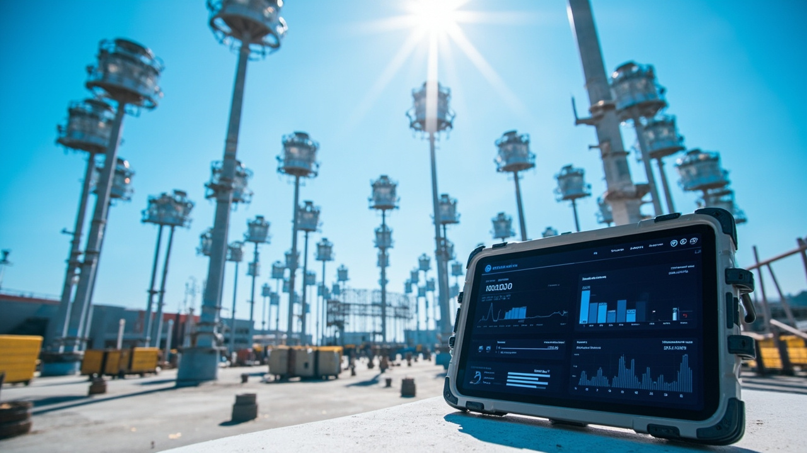

## Before We Start

This is the technical English version.

If you want the easier mixed Indonesian + English walkthrough, read the companion blog post here:

**https://blog.fanani.co/tech/openclaw-iot-port-lighting-whatsapp/**

If you want a VPS for OpenClaw, dashboards, bots, and cloud automation, use our affiliate link here:

**https://blog.fanani.co/sumopod**

---

## Why This Use Case Matters

A lot of IoT content online is either too vague or too expensive-looking.

You get one of two extremes.

Either it is a toy demo with one relay and one LED. Cute, but not useful.

Or it is a giant enterprise architecture diagram full of vendor branding, proprietary gateways, and enough acronyms to make a normal operator close the tab.

Real teams usually want something in the middle.

They want a system that can:

- monitor whether important lights are on or off
- measure power usage
- let authorized users switch circuits on and off remotely
- send alerts if a lamp fails or a feeder behaves abnormally
- store logs in the cloud
- be checked from anywhere, at any time
- work through a channel people already use, like WhatsApp

That is where **OpenClaw** becomes more interesting than a normal chatbot.

OpenClaw is not the electrical hardware controller. It is the **orchestration backbone**.

It becomes the layer that connects:

- field hardware
- telemetry ingestion
- cloud database
- user permissions
- messaging interface
- alerting and automation logic

This tutorial uses a concrete scenario:

**16 units of 1000W floodlights at a port**, used to illuminate the harbor area and nearby operations zone.

The exact hardware can vary. That is actually the point.

The pattern stays useful whether you use:

- PLC + Modbus TCP
- smart relay modules
- ESP32-based field devices
- industrial power meters
- contactor panels with status feedback
- or a hybrid of all of the above

If the hardware can provide status data and receive control commands safely, OpenClaw can sit above it as the brain that people actually interact with.

---

## What We Are Building

By the end of this guide, you will have a practical reference architecture for:

- monitoring 16 floodlights remotely
- reading power usage from each circuit or grouped feeder
- switching lights ON and OFF from WhatsApp
- enforcing user access rules
- saving logs to a cloud database
- generating alerts when something fails or behaves strangely

Here is the big picture.

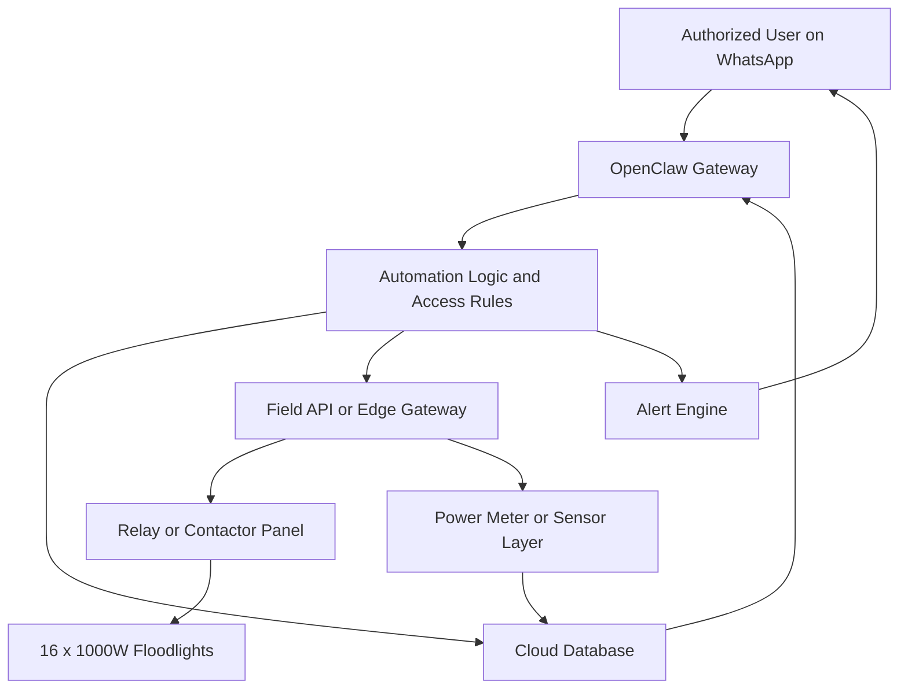

That is the core architecture.

Humans do not talk directly to Modbus addresses or raw MQTT topics.

They talk to **OpenClaw over WhatsApp**.

OpenClaw then decides what to read, what to write, whether the user is allowed, what should be logged, and whether an alert should be triggered.

---

## Why WhatsApp Is a Smart Front End for This

In industrial settings, the best interface is not always the fanciest one.

Sometimes the best interface is the one people will actually use at 2 AM.

WhatsApp has some very practical strengths here:

- operators already know how to use it
- supervisors already have it on their phone
- it works well during movement and field checks
- it is fast for simple command-and-response workflows
- it avoids forcing everyone into a separate custom app on day one

A good OpenClaw-powered interaction can look like this:

```text
/status lampu pelabuhan

/light on zone-a

/light off mast-03

/power today

/alarm list
```

And the assistant can return human-readable responses like:

- 14 lights online, 2 fault
- Mast-03 switched OFF successfully
- Zone A power usage: 11.8 kW
- Alert: Lamp 12 failed to draw expected current after ON command

That is already useful.

You do not need a huge SCADA replacement before you can deliver value.

---

## The Electrical Reality of the Example System

Let us ground this in a believable scenario.

### Example load

- **16 floodlights**
- **1000W each**
- total connected lighting load = **16 kW**

In reality, current draw and inrush depend on lamp type and driver/ballast behavior. That matters for hardware sizing. But for the software and OpenClaw architecture, the important part is that each lighting point or feeder has:

1. a control path
2. a status path
3. optional power telemetry

Here is one practical grouping pattern.

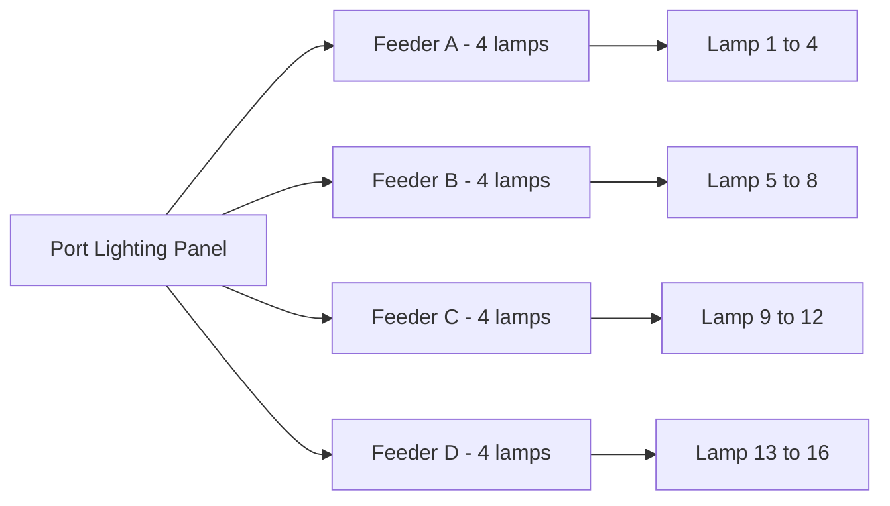

This is often more realistic than pretending every single lamp has a fully isolated smart channel from day one.

You can start with feeder-level control and feeder-level metering.

Then, if the site demands better granularity later, you can add per-lamp or per-mast feedback.

That is the nice part of using OpenClaw as the software backbone. The conversational layer does not need to be rewritten every time hardware detail changes.

---

## Hardware Can Vary, the Pattern Stays Valid

This matters a lot.

Do not overfit the architecture to one exact device.

Here are a few hardware patterns that still fit the same OpenClaw backbone.

### Option A: PLC + industrial meter

- PLC handles control logic
- power meter exposes values via Modbus TCP
- local network gateway exposes safe API endpoints for OpenClaw

### Option B: Smart relay controller + sensors

- relay outputs drive contactors
- digital feedback reads lamp or contactor state
- meter data sent via MQTT or HTTP

### Option C: Edge microcontroller + cloud sync

- ESP32 or similar device reads status
- edge service publishes data to cloud database
- OpenClaw talks only to cloud + secure edge control endpoint

The stack can look like this.

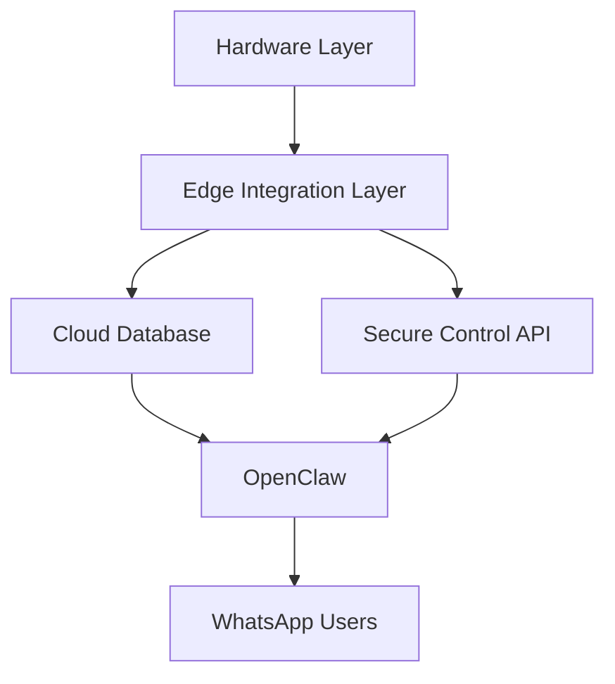

The clean principle is simple:

**OpenClaw should orchestrate, not impersonate a PLC.**

Let the field layer do hard real-time device control.

Let OpenClaw handle human interaction, workflow logic, permissions, logging, summaries, alerts, and escalation.

That division keeps the system sane.

---

## Core System Components

A production-friendly version of this setup usually has five layers.

### 1. Field control layer

This includes:

- contactors or relays
- panel wiring
- overload and protection devices
- lamp feedback signals if available

### 2. Telemetry layer

This includes:

- power meters
- current sensors
- voltage and energy counters
- digital status inputs

### 3. Edge or middleware layer

This is where raw hardware becomes structured data and safe commands.

Examples:

- Modbus polling service
- PLC bridge API
- MQTT broker + small backend
- Node or Python service running on local gateway

### 4. Cloud persistence layer

This stores:

- device list
- user roles
- commands
- event history
- alarms
- telemetry snapshots

Supabase, PostgreSQL, Firebase, or another managed database can work here.

### 5. OpenClaw interaction layer

This is the part users actually feel.

It handles:

- WhatsApp commands
- role checks
- command confirmation
- report generation
- automated alerts
- summaries and natural language explanations

---

## Recommended Database Model

Keep the schema boring.

Boring is good.

A practical schema can look like this.

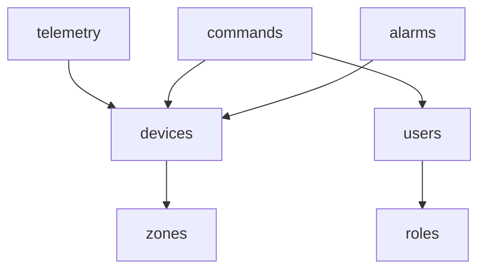

And conceptually:

- `users` = who can issue commands
- `roles` = viewer, operator, supervisor, admin
- `devices` = floodlights, feeders, meters, panels
- `telemetry` = power, current, state, heartbeat, timestamp
- `commands` = ON/OFF requests, actor, result, acknowledgment
- `alarms` = faults, offline events, no-current-after-on, overcurrent, communication loss
- `zones` = port sections, mast groups, or feeder areas

If you keep names and relationships clean, reporting gets much easier later.

---

## Role-Based Access Matters More Than People Think

If you expose control over WhatsApp, you need authorization discipline.

Not everyone should be able to switch every light.

A simple role model:

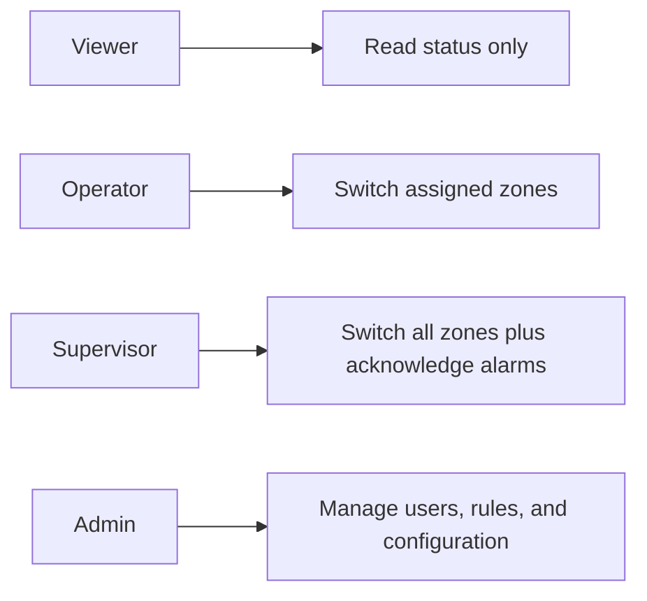

That already gives you a sane operating boundary.

OpenClaw should check:

- who sent the message
- what role they have
- which zone or feeder they are allowed to control
- whether the command requires confirmation

For example, `/light off all` should not be treated the same as `/status zone-b`.

One is low risk. The other can affect operations and safety.

---

## Example WhatsApp Command Flow

Here is a simple interaction flow for a manual control command.

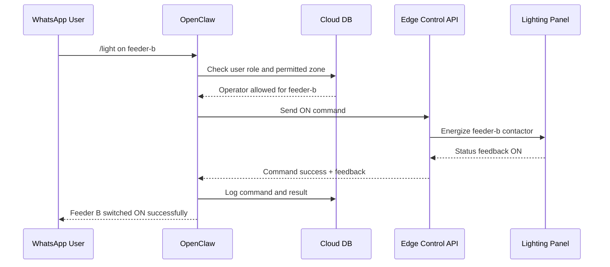

This is the sort of flow that makes the system feel reliable.

Not just “command sent,” but “command confirmed and logged.”

---

## Fault Detection Logic That Actually Helps

A useful system does more than switch lights.

It should also tell you when reality does not match expectation.

Examples of useful alarm logic:

### Scenario 1: Commanded ON but no current rise

Meaning:

- command was accepted
- relay or contactor may have closed
- but the load did not draw expected current

Possible causes:

- lamp failed
- breaker tripped
- cable fault
- contactor issue

### Scenario 2: Device heartbeat lost

Meaning:

- telemetry source offline
- communication issue
- gateway down

### Scenario 3: Power draw abnormal

Meaning:

- unusually low current on active feeder
- unusually high load compared to baseline
- imbalance between expected and actual usage

A simple alert logic model can look like this.

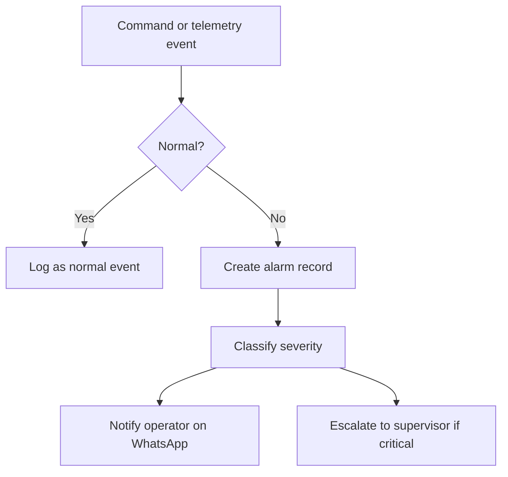

This is where OpenClaw shines.

It can turn raw telemetry anomalies into human-readable alerts.

Instead of dumping numbers, it can say:

> Feeder C is ON by command, but current stayed below expected threshold for 90 seconds. Possible lamp failure or supply interruption.

That is way more useful than “current = 0.2A.”

---

## Monitoring Power Usage

This is another strong use case.

You do not just want switch control. You want visibility.

Power reporting can answer questions like:

- how much load is active right now?
- which feeder used the most energy today?
- did night usage match expected schedule?
- are some lights drawing less than normal?

An example reporting flow:

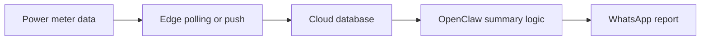

And example user prompts:

```text
/power now
/power today
/power feeder-c
/report lampu tadi malam
```

OpenClaw can translate those into structured queries and return short operational summaries.

---

## Cloud Access Means the System Is Not Tied to One Room

This matters operationally.

If the system only works from one local HMI or one laptop on the same LAN, it is useful but limited.

With a cloud-backed database and messaging layer, authorized people can:

- check status from home
- acknowledge alarms during off-hours
- review logs while off-site
- confirm whether a lighting issue is electrical or only perceptual

That does not remove the need for safe field procedures.

It just makes information and command workflows available from anywhere.

A cloud-first interaction model looks like this.

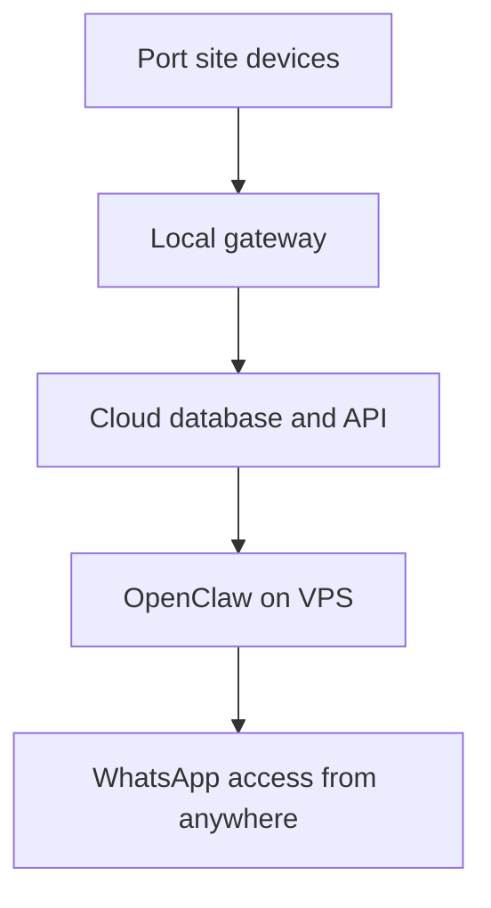

If you host the OpenClaw stack on a VPS, this is a good place to mention Sumopod again:

**https://blog.fanani.co/sumopod**

---

## Practical Safety Boundaries

Let me be blunt here.

Do not let a chatbot directly become your only protection layer.

OpenClaw should not replace electrical interlocks, overload protection, breaker coordination, or basic control safety.

The right model is:

- **hard safety** stays in hardware and electrical design
- **operational logic** stays in PLC/edge layer where needed
- **interaction, visibility, and workflow orchestration** go to OpenClaw

That is the professional boundary.

If switching a feeder could create unsafe conditions, use:

- interlocks
- confirmation flows
- maintenance lockout flags
- role restrictions
- command windows or schedule rules

OpenClaw can enforce some of that at the workflow layer, but hardware safety must still exist independently.

---

## Suggested OpenClaw Command Design

Keep commands predictable.

Bad design tries to be too clever.

Good design is boring and clear.

Examples:

### Read operations

- `/status lampu`
- `/status feeder-a`
- `/power now`
- `/power today`
- `/alarm list`
- `/device mast-07`

### Control operations

- `/light on feeder-a`
- `/light off feeder-a`
- `/light on zone-east`
- `/light off mast-03`

### Admin operations

- `/user list`
- `/grant operator feeder-c @name`
- `/mute alarm feeder-b 30m`

That separation helps a lot with permissions and logging.

---

## Example OpenClaw Workflow Logic

At a high level, the assistant logic can be structured like this.

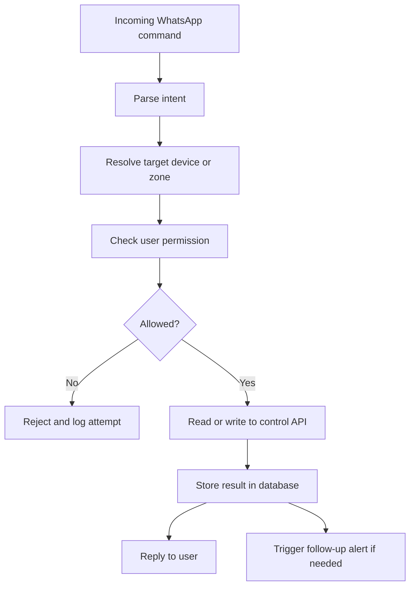

That is the kind of workflow OpenClaw is very comfortable handling.

---

## Why OpenClaw Is a Better Backbone Than a Single-Purpose Bot

A single-purpose bot can reply to commands.

But OpenClaw gives you more headroom because it can combine:

- memory
- tools
- routing
- sessions
- cloud integrations
- structured workflows
- proactive messaging

So later, this same system can grow into:

- shift handover summaries
- daily power reports
- predictive maintenance hints
- abnormal usage notifications
- escalation to different roles
- cross-site asset visibility

You start with “turn lights on and off.”

But the backbone is ready for a lot more.

---

## A Reasonable MVP

Do not try to build the perfect smart port on day one.

A smart MVP would be:

1. feeder-level ON/OFF control
2. feeder status feedback
3. total or feeder-level power monitoring
4. WhatsApp access with role restrictions
5. command logs in cloud database
6. alerts for OFFLINE, NO CURRENT AFTER ON, and OVERCURRENT

That is already real value.

A staged rollout might look like this.

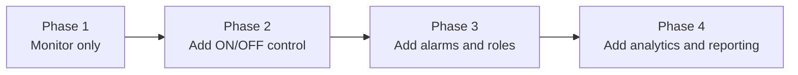

That is a sane delivery model.

---

## Final Take

If you treat OpenClaw as the **conversation and orchestration layer**, this use case becomes surprisingly practical.

You do not need to force it into being a PLC.

You use it to make industrial control systems easier for humans to interact with.

For a port lighting setup with **16 x 1000W floodlights**, OpenClaw can act as the backbone that ties together:

- remote status
- power monitoring
- ON/OFF control
- cloud database history
- WhatsApp access
- fault notifications
- user-based permissions

And because the architecture is hardware-flexible, you are not trapped by one device vendor or one exact meter model.

That is the real win.

Not a flashy demo.

A system people can actually use.

If you want the simpler mixed Indonesian + English version, read it here:

**https://blog.fanani.co/tech/openclaw-iot-port-lighting-whatsapp/**

If you need VPS infrastructure for OpenClaw, bots, dashboards, and cloud workflows, use our affiliate link here:

**https://blog.fanani.co/sumopod**

---

## Related Links

- Companion blog version: **https://blog.fanani.co/tech/openclaw-iot-port-lighting-whatsapp/**
- OpenClaw Sumopod repo: **https://github.com/fanani-radian/openclaw-sumopod**
- OpenClaw official repo: **https://github.com/openclaw/openclaw**
