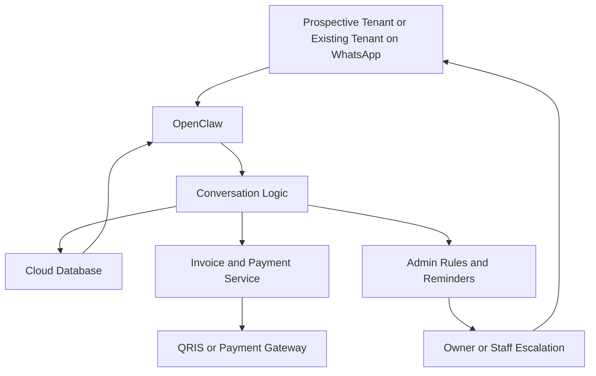
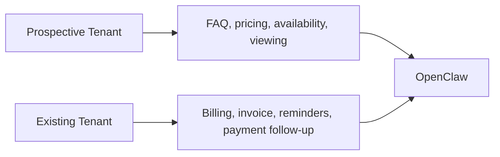
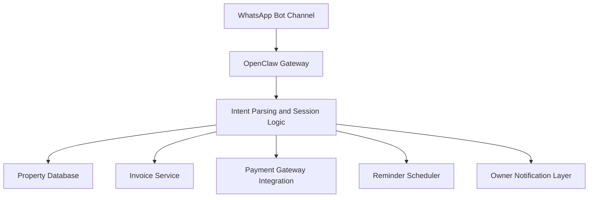
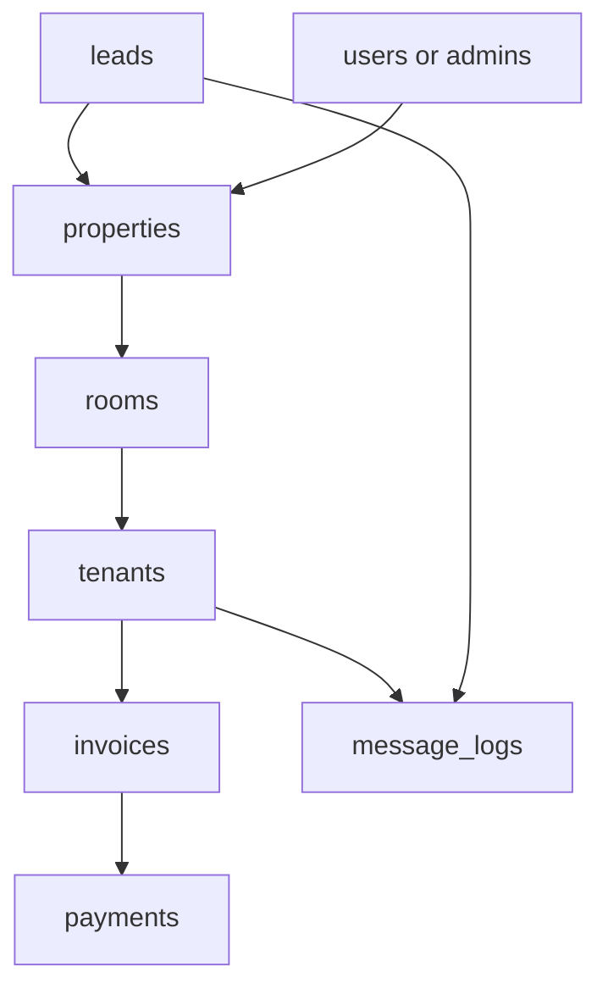
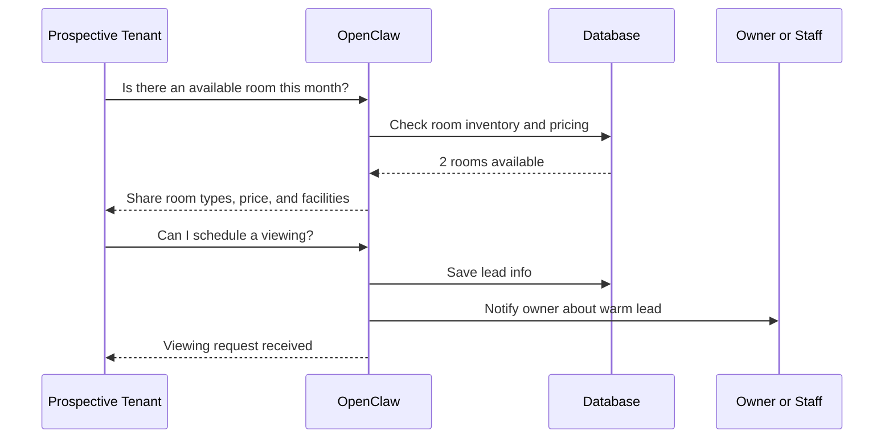
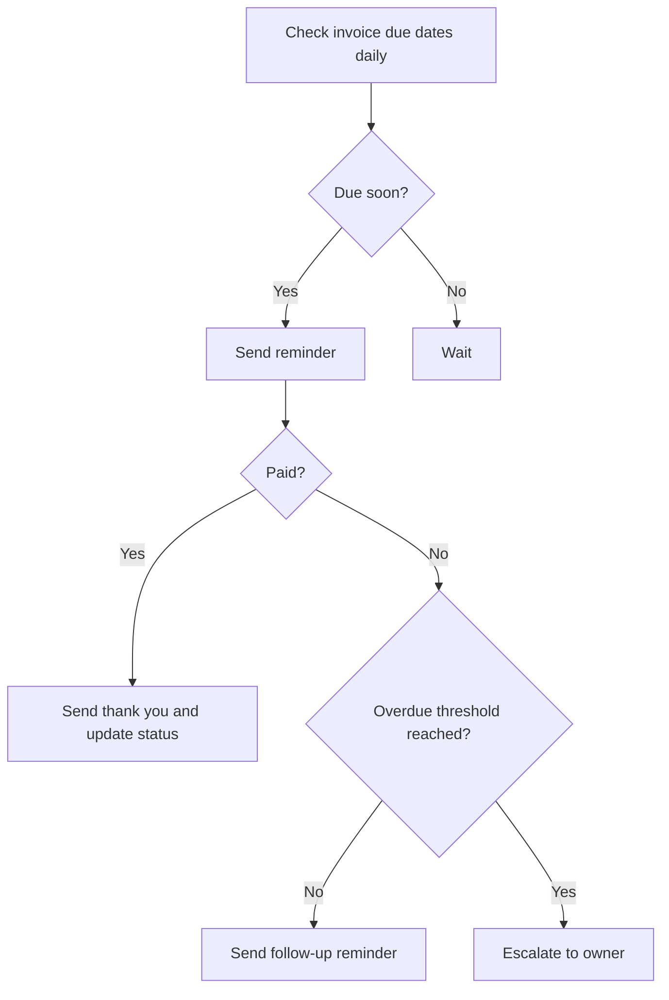
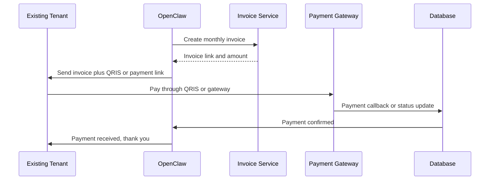
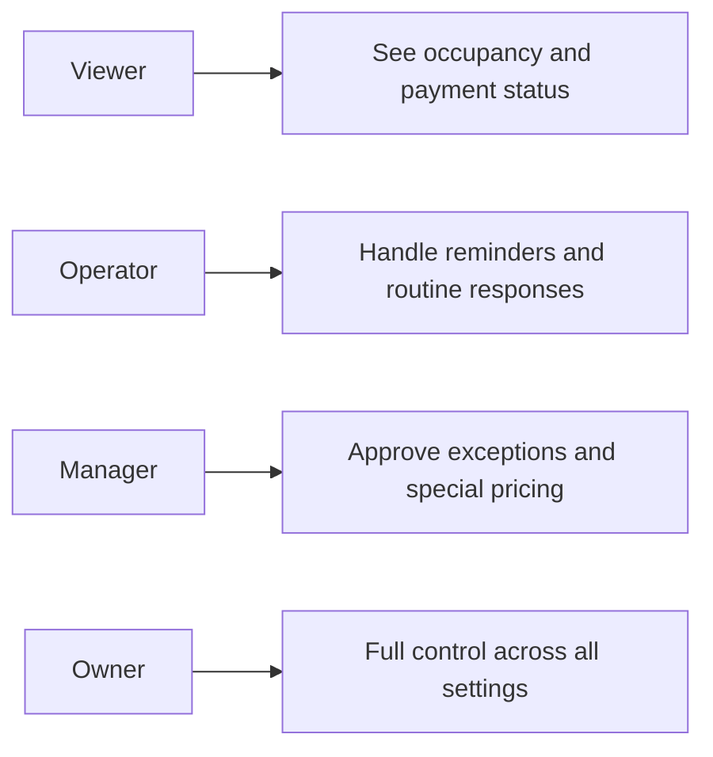
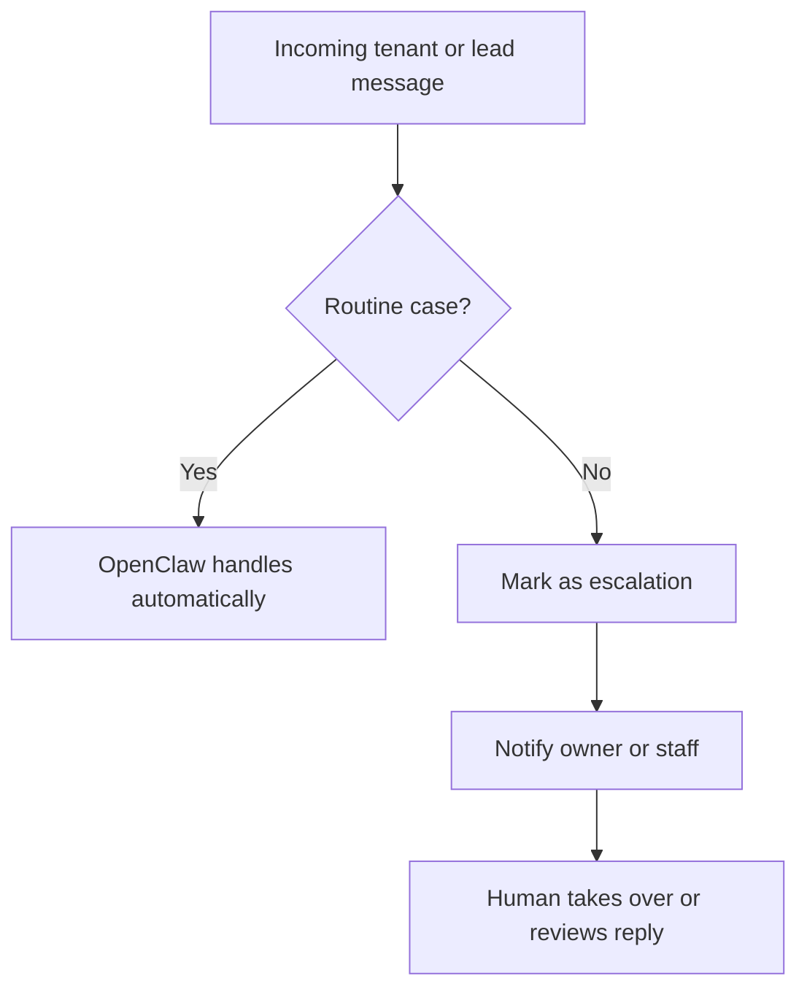
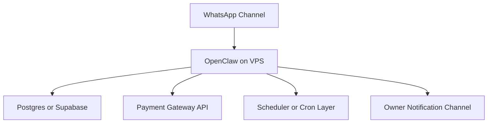

# Building a Boarding House Operations System on OpenClaw
## Use one WhatsApp bot for inquiries, pricing, payment reminders, invoices, QRIS checkout, and tenant support without forcing everyone into a custom app

> **Estimated reading time:** 24 to 31 minutes  
> **Difficulty:** Beginner to Intermediate  
> **Best for:** Property owners, boarding house operators, automation builders, and agencies who want a practical OpenClaw business system for rentals and recurring payments

---


## Before We Start

This is the technical English version.

If you want the easier mixed Indonesian + English walkthrough, read the companion blog post here:

**https://blog.fanani.co/tech/openclaw-kost-whatsapp-billing/**

If you need a VPS for the bot, database workers, automation services, or admin dashboards, use our affiliate link here:

**https://blog.fanani.co/sumopod**

---

## Why This Use Case Is So Practical

A lot of small rental businesses do not really need “AI” in the abstract.

They need fewer repetitive conversations.

They need fewer missed payments.

They need fewer late-night admin tasks.

And they need one communication channel that actually fits how people behave.

For boarding houses, WhatsApp is often that channel.

Prospective tenants already ask through WhatsApp.

Existing tenants already expect reminders there.

Owners already coordinate there.

So instead of forcing users into a separate app on day one, the smarter move is often this:

**use OpenClaw as the backend brain, and use WhatsApp as the operational front end.**

That means one bot number can help with:

- answering pricing and facility questions
- filtering serious leads from casual inquiries
- tracking room availability
- sending payment due reminders
- generating invoices
- sharing QRIS or payment links
- logging payment status
- escalating to the owner when needed

And if another boarding house owner wants the same setup, the system can be packaged and deployed specifically for them.

That is not just a nice chatbot demo.

That is a useful business workflow.

---

## What We Are Building

The target system is simple to describe.

One WhatsApp bot number becomes the main operational channel for a boarding house.

From the tenant side, the experience feels like messaging a smart admin.

From the owner side, the system becomes a compact back office.

Here is the big picture.



That architecture is what makes the system practical.

Users only see WhatsApp.

OpenClaw handles the hard part behind the scenes.

---

## The Two Big Journeys

This whole system really serves two different user journeys.

### Journey 1: Prospective tenant

They want answers like:

- how much is the rent?
- what facilities are included?
- is there Wi-Fi?
- is electricity included?
- are rooms available right now?
- can I schedule a visit?

### Journey 2: Existing tenant

They need things like:

- payment due reminders
- invoice access
- QRIS payment instructions
- payment confirmation flow
- follow-up if overdue

OpenClaw can handle both journeys cleanly if the logic is structured well.



That split is important. Do not treat all users the same.

The conversation style, permissions, and data lookups are different.

---

## Why WhatsApp Works Better Than a Traditional Mini Portal

You can absolutely build a web portal.

But for many small and medium boarding house businesses, that is not the best first step.

The friction is too high.

People do not want to register, log in, remember passwords, and click through dashboards just to ask whether a room still has AC and private bathroom.

WhatsApp works because it is already where the behavior exists.

That gives you a few strong advantages:

- easier lead capture
- lower friction for support
- better open rate for reminders
- faster owner response when escalation is needed
- fewer drop-offs during payment collection

For the right audience, convenience beats complexity.

---

## Core Features of the System

A good MVP for this use case usually has six modules.

### 1. Lead inquiry module

Handles:

- pricing questions
- room type questions
- facilities
- house rules
- availability
- location info

### 2. Room inventory module

Tracks:

- available rooms
- occupied rooms
- room categories
- monthly pricing
- promo or seasonal rates

### 3. Tenant database module

Stores:

- tenant profile
- room assignment
- contact number
- billing cycle
- payment status
- reminder history

### 4. Billing and invoice module

Handles:

- monthly invoice generation
- due date tracking
- overdue flags
- payment references
- invoice links or PDF delivery

### 5. Payment integration module

Handles:

- QRIS display or link
- payment gateway integration
- status callback or manual verification
- payment confirmation messages

### 6. Escalation and owner control module

Handles:

- special cases
- negotiation requests
- manual override
- staff notifications
- custom replies when the bot should step back

---

## System Architecture That Stays Manageable

A clean version of the architecture can look like this.



That is enough to support the full workflow without turning the system into a monster.

OpenClaw becomes the orchestrator.

Database stores truth.

Payment service handles billing mechanics.

WhatsApp becomes the user-friendly interface.

---

## Suggested Database Model

Keep the schema practical.

Not fancy. Practical.



Meaning:

- `properties` = the boarding house entity
- `rooms` = inventory, room type, occupancy, pricing
- `tenants` = current residents
- `leads` = prospective tenants not yet converted
- `invoices` = monthly rent bills and due dates
- `payments` = paid, pending, overdue, gateway references
- `message_logs` = useful for audit and support context
- `users/admins` = owner or staff with operational permissions

Once this is structured cleanly, OpenClaw can answer questions and trigger workflows without getting messy.

---

## Lead Handling for Prospective Tenants

This is where the bot first proves its value.

A prospect can message the bot and ask something simple like:

```text
Halo, harga kamar berapa?
Ada kamar kosong?
Fasilitasnya apa aja?
```

OpenClaw should not answer with a robotic wall of text.

It should answer like a helpful property admin.

Example flow:



This is already useful because it filters repetitive questions before the owner needs to step in.

---

## Payment Reminder Logic for Existing Tenants

This is the second major win.

Instead of chasing people manually every month, the system can handle reminders automatically.

A healthy reminder flow can be:

- reminder 3 days before due date
- reminder on due date
- reminder 1 day after overdue
- escalation to owner after a threshold

That logic can be modeled like this.



This gives owners back a surprising amount of time.

And more importantly, it standardizes communication.

No more forgetting to remind one tenant while repeatedly messaging another.

---

## Invoices, QRIS, and Payment Gateway Flow

The payment experience should be easy.

If the tenant has to ask manually, wait for a transfer number, then ask again for confirmation, the process feels old immediately.

A better flow is:

1. invoice generated automatically
2. invoice delivered through WhatsApp
3. QRIS or payment link included
4. payment status updated automatically if gateway supports callbacks
5. confirmation sent back to the tenant

Like this.



That is the kind of flow people actually appreciate.

Everything happens inside the same conversational channel.

---

## Why QRIS Is Especially Useful Here

For Indonesian users, QRIS makes a lot of sense because:

- it is familiar
- it works across many banking apps and e-wallets
- it reduces manual bank-transfer friction
- it feels modern without adding app complexity

For the tenant, the experience is simple:

- receive invoice
- tap link or scan QRIS
- pay
- get confirmation

No special portal required.

That is exactly the kind of practicality that keeps adoption high.

---

## Role Separation for the Owner Side

Even if one owner runs the whole place, it is better to design the system as if there may eventually be staff.

A simple role model:



That helps if the system grows from one boarding house to multiple locations.

And if you later offer this setup to paying clients, having clean role separation already in the product design makes you look much more serious.

---

## Conversation Design Matters More Than Features

This is worth saying clearly.

The difference between a useful bot and an annoying bot is often not the database.

It is the tone and flow.

For example, if a prospect asks about price, the reply should be straightforward, not AI-flavored nonsense.

Good:

- room type
- monthly rate
- included facilities
- current availability
- next step if interested

Bad:

- vague salesy fluff
- overexplaining
- answering three unrelated things at once
- sounding like a generic chatbot

OpenClaw is capable of much more than that. Use it well.

---

## Escalation Logic for Edge Cases

No matter how good the automation is, some cases should go to a human.

Examples:

- tenant asks for payment extension
- prospect wants special pricing
- room complaint involves maintenance or safety
- payment is marked pending too long
- someone sends a message the bot should not answer confidently

A clean escalation model can look like this.



That keeps the system helpful without making it arrogant.

---

## Example WhatsApp Commands and Flows

Even if the main interface is conversational, a few structured commands are extremely useful.

### For leads

- `/harga`
- `/fasilitas`
- `/kamar tersedia`
- `/jadwal survey`

### For tenants

- `/invoice saya`
- `/status pembayaran`
- `/cara bayar`
- `/tagihan bulan ini`

### For owner or staff

- `/kamar kosong`
- `/jatuh tempo hari ini`
- `/penghuni telat bayar`
- `/ringkasan pembayaran`

These can sit alongside natural-language interaction.

That combination usually works well.

---

## A Good MVP for the First Real Deployment

Do not overbuild this on day one.

A strong MVP is:

1. FAQ and lead handling for prospective tenants
2. room availability lookup
3. tenant database and room assignment
4. monthly invoice generation
5. WhatsApp reminder automation
6. QRIS or payment link delivery
7. payment status tracking
8. escalation to the owner for exceptions

That is already a serious product.

And it can be delivered without pretending to be a giant property management suite.

---

## This Can Become a Productized Service

This is where it gets commercially interesting.

Once you have the architecture working for one boarding house, you can package it for others.

That means if another boarding house owner is interested, the setup can be customized specifically for them.

For example:

- their room types
- their pricing rules
- their payment gateway setup
- their reminder schedule
- their bot number
- their facility information
- their escalation preferences

So this is not just internal automation.

It can become a service offering.

That is important.

Because a good OpenClaw system should not only solve one workflow once. It should be reusable.

---

## Suggested Deployment Stack

A realistic deployment setup might be:



If you are hosting this for production or client work, again, this is a natural place to mention Sumopod:

**https://blog.fanani.co/sumopod**

You want stable hosting, easy scaling for the bot backend, and enough flexibility to run OpenClaw, webhooks, workers, and supporting services together.

---

## Final Take

This is exactly the kind of business system where OpenClaw makes a lot of sense.

Not because “AI is cool.”

Because the workflow is repetitive, message-based, time-sensitive, and operationally annoying if done manually.

For a boarding house business, OpenClaw can become the backend backbone for:

- tenant inquiry handling
- pricing and facility Q and A
- room availability checks
- invoice generation
- payment reminders
- QRIS or payment gateway flow
- payment confirmation
- owner escalation

And because everything can be driven through WhatsApp, the whole experience stays inside something people already use every day.

That is what makes it practical.

If you want the easier mixed Indonesian + English version, read it here:

**https://blog.fanani.co/tech/openclaw-kost-whatsapp-billing/**

If you need infrastructure to host the bot and backend stack, use our affiliate link here:

**https://blog.fanani.co/sumopod**

And if any boarding house operator is interested in deploying this specifically for their property, that can absolutely be built as a tailored implementation.

---

## Related Links

- Companion blog version: **https://blog.fanani.co/tech/openclaw-kost-whatsapp-billing/**
- OpenClaw Sumopod repo: **https://github.com/fanani-radian/openclaw-sumopod**
- OpenClaw official repo: **https://github.com/openclaw/openclaw**
