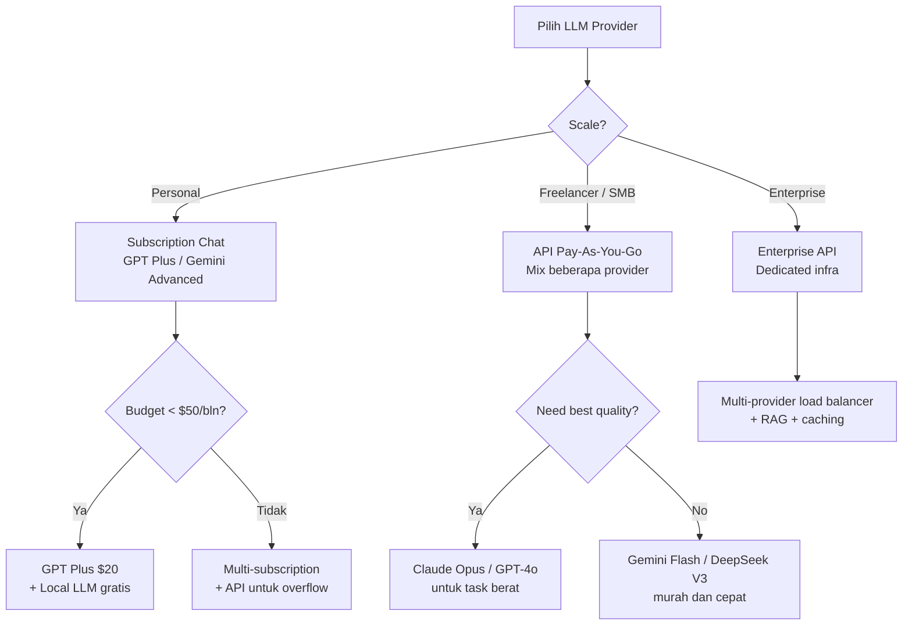
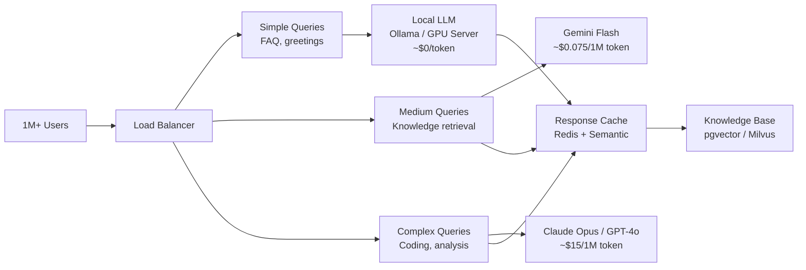

# Panduan Lengkap Pilih LLM Provider untuk OpenClaw — Dari Personal Sampai 1 Juta User

_Pertanyaan paling sering di komunitas AI agent: "Provider mana yang harus saya pakai?" Jawabannya ternyata nggak sesederhana yang dipikirkan._

---

Sebelum masuk ke pembahasan, satu disclosure: **semua infrastructure yang gue pakai — VPS, AI model access, deployment — jalan di Sumopod VPS.** Kalau lo mau setup OpenClaw yang production-ready tanpa ribet, [daftar lewat link ini](https://blog.fanani.co/sumopod) buat mulai.

---

Gue nulis artikel ini karena ada diskusi yang cukup seru di komunitas tentang pilihan LLM provider. Dari pertanyaan klasik "GPT Pro vs GPT Plus bedanya apa?" sampai "Buat 1 juta user pakai apa?" — semua muncul dan gue rasa butuh satu panduan yang lengkap.

Di dunia OpenClaw dan AI agent pada umumnya, pilihan provider itu bukan sekadar " mana yang paling smart" — tapi tentang **cost, reliability, rate limit, dan use case lo.** Model terpintar di dunia pun nggak berguna kalau lo kehabisan quota di tengah production.

Artikel ini bakal cover semuanya dari personal user sampai skala enterprise. Siap? Let's go.

**TL;DR:**
- 🗺️ Peta lengkap LLM provider 2026 dengan rate limit & harga
- 💰 Tier comparison — Pro vs Plus, worth it atau buang-buang uang?
- ⚠️ Risiko akun 3rd party yang jarang orang bahas
- 🏠 Local LLM — Ollama, Mac Mini, dan realitanya
- 💻 Mac Mini vs VPS — hitungan BEP yang bikin mikir dua kali
- 🔄 Multi-provider setup di OpenClaw + fallback chain
- 🏢 Skala 1 juta user — arsitektur dan cost estimation
- 🛡️ Backup strategy dan VPS specs minimum
- 💡 Cost optimization tips yang langsung bisa dipraktekin

---

## 🗺️ Peta LLM Provider 2026 — Siapa Pemain Utamanya?

Ini peta lengkap provider yang bisa lo pakai dengan OpenClaw. Gue urutin dari yang paling populer:



### Tabel Provider Lengkap

| Provider | Model Utama | Free Tier | Harga | Rate Limit* | Strength |
|----------|------------|-----------|-------|-------------|----------|
| **OpenAI** | GPT-4o, o3, o4-mini | GPT-4o mini (limited) | Plus $20, Pro $200 | Plus: ~80 msg/3hr GPT-4o | All-rounder terbaik |
| **Anthropic** | Claude Opus 4, Sonnet 4 | Tidak ada (API only) | API pay-as-you-go | ~1000 RPM (tier 1) | Coding & reasoning terbaik |
| **Google** | Gemini 2.5 Pro, Flash | Gemini Flash (generous) | Advanced $20, Ultra TBD | Flash: 50 RPM, Pro: 15 RPM | Free tier paling generous |
| **xAI** | Grok 3 | Limited free | SuperGrok $30 | ~40 msg/2hr | Real-time data, X integration |
| **DeepSeek** | V3, R1 | DeepSeek V3 (limited) | API: ~$0.27/1M input token | 500 RPM (free), higher paid | Harga termurah per token |
| **Minimax** | M2.5 | Limited | API: ~$0.15/1M input token | 300 RPM | Budget king, Bahasa China |
| **Meta** | Llama 4 Scout/Maverick | Open source (self-host) | Via API providers bervariasi | Tergantung host | Open source, bisa lokal |
| **Mistral** | Large, Medium, Small | Mistral Le Chat (free) | API pay-as-you-go | 60 RPM (free) | European, good multilingual |

*\*Rate limit bisa berubah sewaktu-waktu. Data per April 2026.*

**Satu hal yang penting:** OpenClah mendukung **hampir semua provider ini** lewat konfigurasi sederhana. Lo bisa mix-and-match sesuai kebutuhan — yang gue bahas detail di section Multi-Provider.

---

## 💰 Tier Comparison — Pro vs Plus, Worth It atau Nggak?

Ini pertanyaan yang muncul terus di komunitas: "Kok orang beli GPT Pro $200/bulan? Apa bedanya sama Plus $20?"

Jawabannya simpel dan gue tekankan sekali lagi:

> **TIDAK ADA BEDA KUALITAS OUTPUT. Bedanya KUANTITAS — alias rate limit.**

Model yang dipakai di Plus dan Pro itu persis sama. GPT-4o di Plus = GPT-4o di Pro. Yang beda adalah **berapa kali lo bisa nge-chat dalam periode tertentu** sebelum ke-throttle.

### Rate Limit per Tier (OpenAI)

| Tier | Harga | GPT-4o Limit | o3 Limit | o4-mini Limit |
|------|-------|-------------|----------|---------------|
| **Free** | $0 | ~15 msg/3hr | ❌ | ~50 msg/3hr |
| **Plus** | $20/mo | ~80 msg/3hr | ~25 msg/3hr | ~200 msg/3hr |
| **Pro** | $200/mo | ~500 msg/3hr | ~120 msg/3hr | Unlimited |
| **Team** | $25/user/mo | ~80 msg/3hr | ~25 msg/3hr | ~200 msg/3hr |
| **Enterprise** | Custom | Unlimited | Unlimited | Unlimited |

### Kapan Naik Tier?

```
Fase Bangun Workflow → BUTUH BANYAK TOKEN
├── Awal setup skill, test prompt, debug
├── 1-3 akun Plus bisa cukup
└── Ini fase paling mahal

Fase Steady State → 1 AKUN CUKUP
├── Workflow udah stabil
├── Prompt udah optimized
├── Nggak perlu testing berkali-kali
└── 1 akun Plus bisa handle daily usage
```

**Kesimpulan gue:** Kalau lo lagi aktif banget ngebangun workflow dan testing prompt, 1-2 akun Plus sudah cukup. Pro $200 itu worth it kalau lo literally nge-chat nonstop sepanjang hari sebagai power user — tapi untuk kebanyakan orang, Plus sudah more than enough.

**Google Gemini Advanced ($20):** Ini value for money yang gila. Lo dapat Gemini 2.5 Pro (model flagship Google), Gemini Flash (untuk speed), plus integrasi dengan Google Workspace. Free tier-nya sendiri sudah generous banget — kalau lo nggak heavy user, free tier Gemini Flash bisa jadi daily driver.

---

## ⚠️ Risiko Akun 3rd Party — Murah tapi Berbahaya

Ada yang nanya di komunitas: "Kalau beli akun GPT Pro dari 3rd party yang lebih murah, bijak nggak?"

**Short answer: Tidak. Terutama untuk production.**

Kenapa orang jual murah? Beberapa kemungkinan:

| Metode | Cara Kerja | Risiko |
|--------|-----------|--------|
| Shared account | Satu akun dipakai banyak orang | Rate limit habis duluan, privacy zero |
| Stolen card | Bayar pakai kartu kredit curian | Bisa kena chargeback, akun hilang |
| Reseller margin | Beli bulk, jual satuan dengan markup kecil | Stabil tapi TOS violation |
| Trial abuse | Buat banyak akun trial | Lifetime pendek, ban |

**Realitas yang harus lo hadapi:**
- Akun bisa di-suspend **di tengah production** tanpa warning
- Data lo ada di tangan pihak ketiga — privacy? Zero
- Kalau untuk bisnis/client, ini liability besar
- Support dari provider? Nggak ada — lo bukan pemilik akun resmi

**Verdict gue:**
- 🟢 **Coba-coba / eksperimen:** Boleh saja, risiko sendiri
- 🟡 **Side project yang nggak kritis:** Masih oke, selama ada backup plan
- 🔴 **Production / bisnis / client work:** **HINDARI.** Langganan resmi atau API langsung

---

## 🏠 Local LLM — Ollama dan Realitanya

Banyak yang nanya: "Bisa nggak jalanin model lokal biar nggak bayar API?"

Jawabannya: **Bisa. Tapi ada trade-off yang signifikan.**

OpenClaw support local LLM lewat **Ollama** integration. Lo install Ollama, download model, dan langsung bisa dipakai sebagai provider di OpenClaw.

### Hardware Minimum yang Realistis

| Hardware | RAM | Model Max | Kualitas | TPS* |
|----------|-----|-----------|----------|------|
| Laptop biasa | 8GB | ~7B (Llama 3, Phi-3) | Simple task aja | 5-15 |
| Mac Mini M2 16GB | 16GB unified | ~30B (Mixtral, Qwen) | Decent | 30-50 |
| Mac Mini M2 32GB | 32GB unified | ~70B (Llama 3.1) | Approaching good | 20-40 |
| Desktop + RTX 4090 | 24GB VRAM | ~70B (quantized) | Good | 40-80 |
| Server + A100 80GB | 80GB HBM | Full 70B+ (unquantized) | Production grade | 1000+ |

*\*TPS = Tokens Per Second. Makin tinggi makin cepat respons.*

### Reality Check: TPS itu Penting

Kalau lo pernah pakai ChatGPT dan responsnya instan, itu karena server OpenAI punya TPS ribuan. Kalau lo jalanin model lokal di laptop biasa, 5-15 TPS artinya:

- Generate 1000 token → butuh ~70-200 detik
- itu seperti nunggu loading dial-up era 2000
- Untuk chatbot real-time? Nggak viable
- Untuk background processing? Bisa, tapi lambat

**Mac Mini sebagai "people's server":** Banyak yang recommend Mac Mini buat self-hosting. Dan gue nggak bilang salah — Apple Silicon itu efficient banget untuk inference. Tapi:

- **M2 16GB:** Mentok-mentok 30-50 TPS. Untuk 1-2 user personal, ini oke.
- **M2 32GB:** Lebih baik, tapi harga naik signifikan.
- **Problem:** Tetap shared dengan OS dan aplikasi lain. Nggak dedicated.

---

## 💻 Mac Mini vs VPS — Hitungan yang Bikin Mikir Dua Kali

Ini bagian yang paling sering diperdebatkan. Gue bikin perbandingan hitungan yang real:

### Tabel Perbandingan Real

| Item | Mac Mini M2 16GB | Mac Mini M2 32GB | VPS 100rb/bln | VPS 500rb/bln |
|------|-----------------|-----------------|---------------|---------------|
| **Harga awal** | ~Rp 12-15 juta | ~Rp 18-22 juta | ~Rp 1.2 jt/thn | ~Rp 6 jt/thn |
| **Listrik/bln** | ~Rp 80-120rb | ~Rp 80-120rb | Termasuk | Termasuk |
| **Internet** | Lo bayar sendiri | Lo bayar sendiri | Termasuk | Termasuk |
| **Maintenance** | Lo sendiri | Lo sendiri | Zero | Zero |
| **Uptime SLA** | Best effort | Best effort | 99.9% | 99.9% |
| **Skalabilitas** | Fixed | Fixed | Upgrade instant | Upgrade instant |
| **Akses remote** | Manual setup | Manual setup | Instant SSH | Instant SSH |
| **Data center** | Rumah lo | Rumah lo | Tier 3+ | Tier 3+ |

### BEP (Break Even Point) Calculation

```
Mac Mini 16GB @ Rp 13 juta vs VPS 100rb/bln:
- Selisih listrik: ~100rb/bln (Mac butuh listrik, VPS termasuk)
- Total biaya Mac Mini pertahun: 13jt + 1.2jt (listrik) = 14.2jt
- Total biaya VPS pertahun: 1.2jt
- BEP: 13jt / (1.2jt - 1.2jt) = ... 10+ TAHUN

Mac Mini 16GB @ Rp 9 juta (harga second/diskon) vs VPS 100rb/bln:
- BEP: 9jt / 0 = ... 7.5 TAHUN (tanpa hitung listrik, internet, maintenance)
```

**Even at Rp 9 juta (second/diskon), BEP-nya 7.5 tahun vs VPS 100rb/bulan.** Itu tanpa hitung listrik, internet, risiko hardware failure, dan waktu maintenance lo.

### Maintenance Risks yang Orang Sering Lupakan

Ini yang sering nggak kepikiran saat beli Mac Mini buat server:

| Risiko | Probabilitas | Impact |
|--------|-------------|--------|
| Kecipratan air / kelembaban | Medium | DEAD — data hilang kalau nggak backup |
| Hardware failure (HDD, RAM, fan) | Low-medium | Downtime sampai beli parts & repair |
| Listrik mati / naik turun | High (Indonesia) | Corrupt data, unexpected shutdown |
| Internet down | Medium | Service unreachable |
| Update macOS restart | Periodic | Planned downtime |
| Cat / anak mainin | Depends | LOLL but real risk |

**Data center punya standard** yang rumah lo nggak punya: UPS, redundant power, cooling system, physical security, fire suppression. Itu bukan overkill — itu necessary untuk production.

### Kapan Mac Mini Masuk Akal?

```
Mac Mini cocok kalau:
✅ Lo butuh power komputasi lokal yang besar (GPU)
✅ Privacy absolut — data nggak boleh keluar sama sekali
✅ Lo punya backup internet & UPS di rumah
✅ Ini hobi / learning, bukan production
✅ Lo enjoy tinkering hardware

VPS cocok kalau:
✅ Lo mau setup dan lupa
✅ Production / bisnis / client work
✅ Butuh akses dari mana saja
✅ Butuh reliability tinggi
✅ Budget predictable per bulan
```

**Verdict gue:** Untuk production OpenClah — **VPS, no question.** Murah, stabil, dan lo bisa fokus ke workflow bukan ke infrastructure. Mac Mini untuk personal/hobi yang enjoy tinkering.

---

## 🔧 OpenClaw vs Alternatives — "Semua Cuma Tools"

Ada pertanyaan bagus di komunitas: "OpenClaw vs Hermes, mana yang lebih bagus?"

Dan jawaban yang paling jujur adalah:

> **Semua AI agent tools — OpenClaw, Hermes, KimiClaw, KiloClaw, ZeroClaw, atau apapun namanya — itu CUMA TOOLS.**

Kaya analogi desain:
- Orang bisa bikin desain bagus pakai **Paint**
- Orang bisa bikin desain jelek pakai **Adobe Illustrator**

**Tools nggak bikin lo jago. Skill lo yang bikin hasilnya bagus.**

Tapi kenapa gue pilih OpenClaw?

| Kriteria | OpenClaw | Alternatif |
|----------|----------|------------|
| **Open source** | ✅ Full open source | Varies (beberapa proprietary) |
| **Developer base** | Global, ratusan contributor | Terbatas |
| **Update frequency** | 2-3x per minggu | Varies |
| **Provider support** | 20+ providers | 5-10 providers |
| **Channel integration** | Telegram, Discord, Slack, WhatsApp, dll | Varies |
| **Self-hosting** | ✅ Full control | Some cloud-only |
| **Community** | Active Discord, GitHub | Smaller |

Yang paling penting: **OpenClaw dikembangkan oleh banyak developer dari seluruh dunia dan terus di-improve.** Ini bukan produk satu orang atau satu perusahaan — ini ekosistem. Bug ditemukan hari ini, fix-nya bisa merge minggu depan.

Tapi sekali lagi — **fokus ke workflow, bukan tool.** OpenClaw itu enabler, bukan tujuan.

---

## 🏢 Skala Besar — 1 Juta User, Pakai Apa?

Ini pertanyaan yang interesting. Kalau lo punya chatbot atau AI agent yang harus serve 1 juta user, arsitekturnya beda total dari setup personal.

### Realitas Skala 1 Juta User

```
1 juta user × 10 request/hari × 500 token average
= 5 miliar token/hari
= ~$5,000-15,000/hari di OpenAI API
= $150,000-450,000/bulan
```

Angka itu bisa turun drastis dengan optimization:

| Strategi | Pengurangan Cost | Implementasi |
|----------|-----------------|--------------|
| **Gemini Flash** (budget) | 60-80% vs GPT-4o | Ganti model untuk task sederhana |
| **Caching** | 30-50% | Redis / semantic cache |
| **RAG optimization** | 20-40% | Chunking + reranking yang efisien |
| **Prompt compression** | 15-25% | Shorter system prompt |
| **Local LLM filter** | 40-60% | Ollama handle simple query, cloud handle complex |

### Arsitektur yang Realistis



**Gemini Flash adalah budget champion di sini.** Murah banget, cukup smart untuk 80% use case, dan rate limit-nya generous. Untuk task yang butuh reasoning berat, baru escalate ke Claude Opus atau GPT-4o.

**Local LLM di skala ini** butuh GPU server dedicated (bukan Mac Mini). A100 atau H100 — itu investment yang serius. Beberapa opsi:
- **RunPod / Lambda Labs:** On-demand GPU cloud, mulai ~$1.50/jam
- **Own GPU server:** $10,000-50,000 investment, tapi TCO bisa lebih murah long-term
- **Hybrid:** Local untuk bulk, cloud untuk overflow

---

## 🔄 Multi-Provider Setup di OpenClaw

Ini salah satu fitur paling powerful di OpenClaw — lo bisa setup **multiple LLM providers** dan define routing logic.

### Konsep Fallback Chain

```
Request masuk
    ↓
Provider utama (Kimi 2.5 — cheap)
    ↓ gagal / rate limit?
Fallback 1 (DeepSeek V3 — cheap backup)
    ↓ gagal / rate limit?
Fallback 2 (GPT-4o — reliable tapi mahal)
    ↓ gagal / rate limit?
Fallback 3 (Gemini Flash — always available, generous free tier)
```

### Tier System yang Gue Pakai

| Tier | Model | Kegunaan | Cost |
|------|-------|----------|------|
| **Tier 1** | Kimi 2.5 / DeepSeek V3 | Daily driver, chat, format data | ~$0.001-0.005 |
| **Tier 1b** | Ollama Local | Background task, heartbeat, simple | $0 |
| **Tier 2** | Claude Sonnet / GPT-4o | Coding kompleks, analisis mendalam | ~$0.01+ |
| **Tier 3** | Claude Opus 4 | Task yang butuh maximum reasoning | ~$0.03+ |

### Contoh Konfigurasi OpenClaw

```yaml
# ~/.openclaw/config.json (simplified)
{
  "agents": {
    "defaults": {
      "model": "kimi/kimi-2.5",
      "thinking": "auto"
    }
  },
  "providers": {
    "openai": {
      "apiKey": "${OPENAI_API_KEY}",
      "models": ["gpt-4o", "o3", "o4-mini"]
    },
    "anthropic": {
      "apiKey": "${ANTHROPIC_API_KEY}",
      "models": ["claude-opus-4", "claude-sonnet-4"]
    },
    "google": {
      "apiKey": "${GEMINI_API_KEY}",
      "models": ["gemini-2.5-pro", "gemini-2.5-flash"]
    },
    "ollama": {
      "baseUrl": "http://localhost:11434",
      "models": ["llama3.1", "phi3"]
    }
  }
}
```

Dengan setup ini, OpenClaw bisa route setiap request ke model yang paling appropriate berdasarkan task complexity dan budget.

---

## 🛡️ Backup Strategy di VPS

Salah satu keuntungan VPS vs lokal: backup bisa diotomasi dengan reliable. Ini strategy yang gue pakai:

### Backup Matrix

| Data | Target | Frekuensi | Tool |
|------|--------|-----------|------|
| **Workspace / Memory** | GitHub | Setiap 15 menit | `git add -A && git push` |
| **Database (Supabase)** | Google Drive | Auto daily | pg_dump + gog drive upload |
| **Cloudflare D1** | Per minute | Auto backup | D1 built-in |
| **Config files** | GitHub | Setiap commit | Termasuk di workspace repo |
| **VPS snapshot** | Provider | Weekly | Provider dashboard |
| **Nginx / SSL** | Git + backup | On change | certbot + git |

### Setup Git Auto-Sync (Cron)

```bash
# Crontab entry — sync setiap 15 menit
*/15 * * * * cd ~/.openclaw/workspace && git add -A && git commit -m "auto-sync $(date +\%Y-\%m-\%d_\%H:\%M)" && git push origin main
```

**Kenapa GitHub?** Karena versi control. Bukan cuma backup — lo bisa track perubahan, revert kalau ada yang salah, dan clone ke machine lain kalau VPS down.

### Database Backup ke Google Drive

```bash
# Daily database dump → Google Drive
0 2 * * * pg_dump radit_db | gzip > /tmp/radit_backup.sql.gz && \
  GOG_KEYRING_PASSWORD="xxx" gog drive upload /tmp/radit_backup.sql.gz --folder "Backups"
```

**Key insight:** Dengan VPS, semua ini bisa diotomasi via cron. Di lokal (Mac Mini), lo harus jaga PC tetap nyala, internet tetap up, dan script tetap jalan. Di VPS, that's just... how it works.

---

## 💻 Full Stack Development dengan OpenClaw

Satu pertanyaan yang sering muncul: "Bisa nggak OpenClaw bikin web dari nol?"

Jawabannya: **Bisa. Dari FE sampai BE, DevOps, sampai QA.**

### Apa Bisa Dikerjakan OpenClaw?

| Capability | Bisa? | Contoh |
|-----------|-------|--------|
| Frontend (React, Vue, Next.js) | ✅ | Bikin component, styling, responsive |
| Backend (Node, Python, Go) | ✅ | API, database, auth |
| DevOps | ✅ | Docker, CI/CD, deployment |
| QA / Testing | ✅ | Unit test, e2e, bug fix |
| Database design | ✅ | Schema, migration, optimization |
| Documentation | ✅ | README, API docs, changelog |

### Workflow Tanpa n8n

Banyak yang nanya: "Harus pakai n8n?"

**Nggak harus.** OpenClah bisa bikin workflow sendiri tanpa n8n. Skill system + exec tool + API calls = workflow engine sendiri.

Tapi n8n tetap useful untuk:
- Visual workflow builder (drag & drop)
- Complex integration dengan 400+ apps
- Monitoring & error handling UI

**Vector Database Choices:**

| DB | Use Case | Complexity |
|----|----------|------------|
| **GitHub (markdown)** | Memory, notes, knowledge base | ⭐ Simplest |
| **Obsidian** | Personal knowledge management | ⭐⭐ Simple |
| **pgvector** | Production RAG with PostgreSQL | ⭐⭐⭐ Medium |
| **Milvus** | Large-scale vector search | ⭐⭐⭐⭐ Complex |

Untuk kebanyakan setup, **pgvector** sudah cukup. Integrated dengan PostgreSQL yang lo mungkin udah punya, dan OpenClaw bisa langsung query.

---

## 🚀 Use Cases OpenClaw untuk Bisnis

Ini bagian yang paling exciting. OpenClaw bukan cuma chatbot — ini **automation platform** yang bisa handle berbagai business workflow.

### Content Factory — End-to-End

```
Brief / Topic
    ↓
AI Research (web search, competitor analysis)
    ↓
AI Write (draft artikel, caption, script)
    ↓
Human Review (approve / revise)
    ↓
AI Generate Visual (image, thumbnail)
    ↓
Schedule & Auto-Post
    ↓
Analytics & Optimization
```

**OpenClaw bisa handle SEMUA langkah ini.** Dari research sampai publish, termasuk generate visual dan schedule posting.

### Ads Automation

- **Research audience:** Scrap demographic data, competitor ads, trending topics
- **Generate creative:** Image, copy, video script — semua bisa AI-generate
- **A/B testing:** Create multiple variants, track performance
- **Optimization:** Analyze metrics, suggest improvements, auto-adjust budget allocation

### Chatbot Customer Service

- 24/7 availability dengan knowledge base
- Auto-classify tickets: billing, technical, complaint, FAQ
- Escalate complex issues ke human
- Learn dari conversation history untuk improve

### Email Automation

- Classify incoming emails: invoice, project, spam, urgent
- Extract key data (amounts, dates, action items)
- Draft replies dengan persona yang sesuai
- Auto-forward ke relevant stakeholder

---

## 💡 Cost Optimization Tips

Ini tips yang langsung bisa lo praktekin hari ini:

### 1. Mix Providers — The Golden Rule

```
Simple task (80% volume) → Cheap model (Gemini Flash, DeepSeek)
Medium task (15% volume) → Mid-range (GPT-4o, Claude Sonnet)  
Complex task (5% volume) → Premium (Claude Opus, o3)
```

Dengan strategi ini, lo bisa **kurangi cost 60-80%** dibanding pakai satu provider premium untuk semua.

### 2. Caching yang Efektif

- **Redis cache** untuk response yang sering ditanya
- **Semantic cache** — kalau pertanyaan mirip, return cached answer
- OpenClaw punya built-in response caching

### 3. Prompt Optimization

```
❌ "Please analyze this document thoroughly and provide a comprehensive summary 
    of all the key points, insights, and recommendations..."
    (45 words — 60 tokens)

✅ "Summarize key points + recommendations from this doc"
    (9 words — 12 tokens)
```

System prompt yang shorter = less token per request = significant savings di scale.

### 4. Local LLM sebagai First Filter

```
User Query → Local LLM (Ollama) 
    ↓ simple? → Return local response ($0)
    ↓ complex? → Forward to cloud API ($)
```

Ini bisa **filter 50-70% query** yang nggak butuh model premium.

### 5. Batch Processing

Daripada proses satu-satu, batch beberapa task sekaligus. Mengurangi overhead koneksi dan bisa negotiate rate limit lebih efisien.

---

## 📐 VPS Specs Minimum — Berapa yang Cukup?

Ini pertanyaan yang sering muncul. Gue kasih guideline realistis:

| Specs | Use Case | OpenClaw Performance |
|-------|----------|---------------------|
| **2 vCPU, 4GB RAM** | Mulai, learning, light automation | ✅ Stabil untuk 1 cycle workflow |
| **2 vCPU, 8GB RAM** | Daily driver, multi-agent | ✅ Cukup untuk 1 cycle + sub-agents |
| **4 vCPU, 16GB RAM** | Heavy automation, content factory | ✅ Smooth multi-agent parallel |
| **8 vCPU, 32GB RAM** | Production, 1M+ potential scale | ✅ Full power, many agents |

**Kenapa VPS > lokal untuk dev?**

1. **Akses dari mana saja** — nggak terikat satu lokasi
2. **Reliable** — uptime 99.9%, nggak bergantung listrik rumah
3. **Murah** — mulai dari Rp 100rb/bulan, nggak ada investment awal
4. **Scalable** — upgrade RAM/CPU dalam hitungan menit
5. **Managed** — security patch, monitoring, network handled

**Rekomendasi gue untuk mulai:** 2 vCPU, 8GB RAM, ~Rp 200rb-300rb/bulan. Itu sweet spot untuk OpenClaw daily use dengan beberapa agent.

---

## 🎯 Verdict & Rekomendasi — Pilih Apa?

Gue bikin rekomendasi berdasarkan profil user:

### Personal / Hobi
```
Budget: Rp 0-300rb/bulan
Setup: 1 akun Gemini (free/Advanced) + Ollama lokal untuk simple task
VPS: Optional — kalau mau 24/7
```

### Freelancer / Solo Worker
```
Budget: Rp 300rb-1jt/bulan
Setup: 1-2 akun Plus (GPT/Gemini) + API pay-as-you-go untuk overflow
VPS: 8GB RAM, ~200rb/bulan
```

### Startup Kecil
```
Budget: Rp 1-5jt/bulan
Setup: Multi-provider API + tier system
VPS: 16GB RAM, ~500rb-1jt/bulan
Backup: Git + cloud auto-backup
```

### Skala Besar / Enterprise
```
Budget: Rp 5jt+ /bulan
Setup: Enterprise API + dedicated GPU server
VPS: 32GB+ RAM, load balanced
Architecture: Multi-provider, RAG, caching, monitoring
```

---

## ━━━━━━━━━━━━

## Penutup

Pilih LLM provider itu nggak tentang "siapa yang paling smart" — tapi tentang **siapa yang paling cocok dengan kebutuhan dan budget lo.** Model terpintar di dunia nggak berguna kalau lo kehabisan quota, dan model termurah nggak berguna kalau output-nya jelek buat use case lo.

**Strategi yang paling effective:** Mix beberapa provider sesuai complexity task. Simple task pakai yang murah, complex task pakai yang premium. Dengan OpenClaw, setup ini bisa dikonfigurasi sekali dan jalan otomatis.

Dan satu lagi — **tool itu cuma tool.** OpenClaw, Hermes, atau apapun namanya, yang bikin hasil bagus adalah **workflow dan skill lo dalam memberikan instruksi.** Investasi terbaik lo bukan di tool — tapi di belajar prompt engineering, memahami use case, dan membangun workflow yang efficient.

---

Seperti biasa, semua setup gue jalan di **Sumopod VPS** — VPS, AI model, deployment, semuanya satu paket. Kalau lo mau mulai setup OpenClah yang production-ready, [daftar lewat link ini](https://blog.fanani.co/sumopod) buat mulai.

> 📎 **Source:** [openclaw-llm-provider-guide.md](https://github.com/fanani-radian/openclaw-sumopod/blob/main/tutorials/openclaw-llm-provider-guide.md) — view on GitHub & star ⭐

**Referensi:**
- [OpenClaw Documentation](https://docs.openclaw.ai)
- [OpenClaw GitHub](https://github.com/openclaw/openclaw)
- [OpenAI Pricing](https://openai.com/pricing)
- [Anthropic Pricing](https://www.anthropic.com/pricing)
- [Google AI Pricing](https://ai.google.dev/pricing)
- [DeepSeek Pricing](https://platform.deepseek.com/api-docs/pricing)
- [Ollama Documentation](https://github.com/ollama/ollama)
