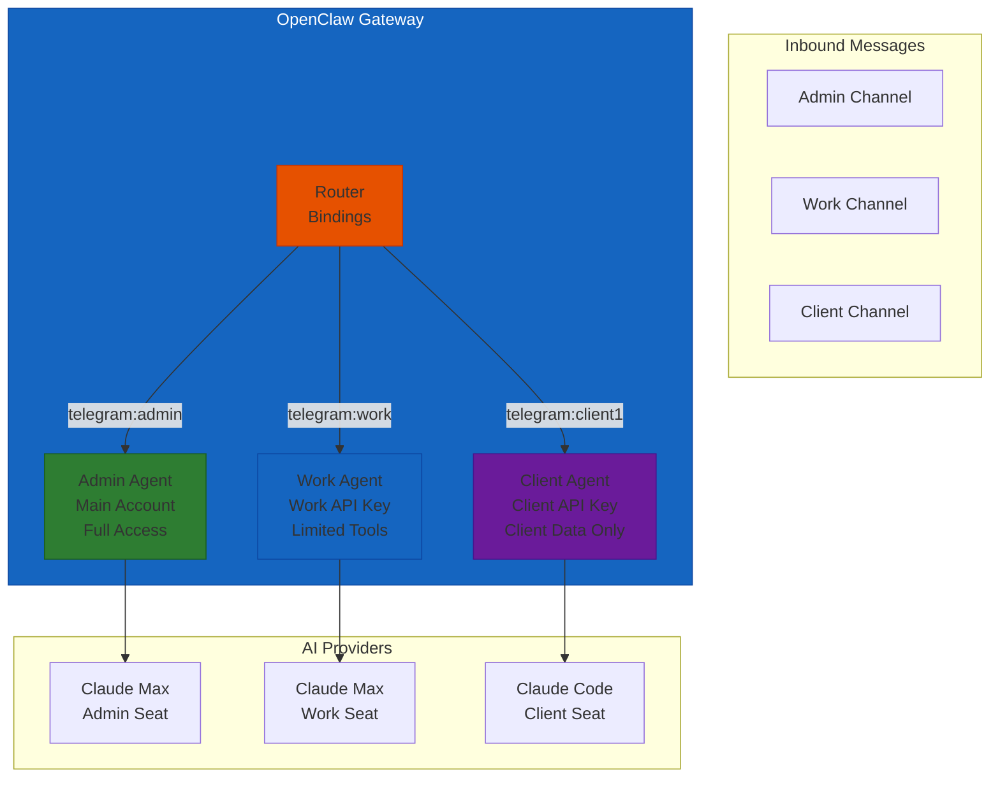
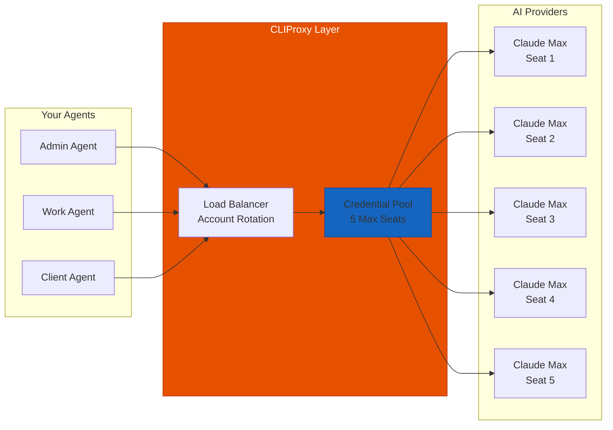

# OpenClaw Multi-Account Routing
## Run Multiple AI Personas on Multiple Accounts Without Paying for Multiple Subscriptions

> **Reading Time:** 18 minutes
> **Difficulty:** Intermediate
> **Prerequisite:** OpenClaw Gateway installed and running
> **Version:** OpenClaw v2025+

---

## The Problem Nobody Talks About

You have a Claude Code Max subscription. It comes with 5 seats. You are using 1.

Your team has 4 people. Instead of buying 4 separate API plans, you want all of them to access Claude Max through your existing subscription.

Or maybe you run multiple businesses. Each business needs its own AI assistant with its own personality, its own conversation history, its own tools. But you do not want to pay for 4 separate AI accounts.

Or you are an agency. You manage 12 clients. Each client needs their own AI assistant. Every AI assistant needs to be isolated from the others. None of them should see each other's data.

OpenClaw solves all of this with its built-in multi-agent system.

---

## What Multi-Account Routing Actually Means

There are two separate problems people mix up.

**Problem 1: Multiple AI Personas.** You want different AI assistants for different purposes. A coding assistant. A marketing assistant. A research assistant. Each with its own personality and memory.

**Problem 2: Multiple AI Accounts.** You have multiple subscription seats and you want to distribute load across them. Or you have different API keys for different clients and you need to keep billing separate.

OpenClaw handles both.



The router sits inside the Gateway. Every message that comes in gets inspected. Based on the channel and account it came from, the Gateway decides which agent handles it.

Each agent has:
- Its own workspace (files, memory, persona)
- Its own auth profiles (API keys)
- Its own session history
- Its own skills and tools

Agents do not see each other. They are fully isolated.

---

## How It Works: Agents, Accounts, and Bindings

### Agents

An agent is a complete AI brain. When you install OpenClaw, you get one agent called `main` by default. That is the main agent handling all your messages.

But you can create more agents.

```bash
# See what agents you have
openclaw agents list

# Add a new agent for work tasks
openclaw agents add work \
  --workspace ~/.openclaw/workspace-work

# Add an agent for client work
openclaw agents add client1 \
  --workspace ~/.openclaw/workspace-client1
```

Each agent gets its own workspace directory. Inside that workspace you can put:
- `SOUL.md` - the agent personality
- `AGENTS.md` - its operating rules
- `USER.md` - context about who it serves
- Skills specific to that agent
- Memory files

The workspaces are completely separate. Even if you accidentally expose a file in one workspace, the other agents cannot read it.

### Channel Accounts

Each messaging channel (Telegram, Discord, WhatsApp) can have multiple accounts.

For Telegram, you create multiple bot tokens through BotFather. Each bot token becomes an account.

```bash
# Set up a work Telegram bot
openclaw channels login --channel telegram --account work

# Set up a client Telegram bot
openclaw channels login --channel telegram --account client1
```

Now you have two Telegram accounts running at the same time, on the same Gateway.

### Bindings

Bindings connect a channel account to an agent.

```bash
# Route work Telegram bot to the work agent
openclaw agents bind \
  --agent work \
  --bind telegram:work

# Route client Telegram bot to the client1 agent
openclaw agents bind \
  --agent client1 \
  --bind telegram:client1
```

When someone sends a message to your work bot, the work agent handles it. When someone messages your client bot, the client1 agent handles it.

Verify your bindings:

```bash
openclaw agents list --bindings
```

You should see a table showing which channels are connected to which agents.

---

## Real Setup Example: Agency Use Case

Here is how a small agency might set this up.

### Step 1: Create Agent Workspaces

```bash
# Main agent - agency owner
# Already exists as 'main'

# Agent for client work
openclaw agents add client-ops \
  --workspace ~/.openclaw/workspace-client-ops

# Agent for internal tasks
openclaw agents add internal \
  --workspace ~/.openclaw/workspace-internal
```

### Step 2: Set Up Channel Accounts

```bash
# Client-facing Telegram bot
openclaw channels login --channel telegram --account client-ops

# Internal team bot
openclaw channels login --channel telegram --account internal

# Discord for community
openclaw channels login --channel discord --account community
```

### Step 3: Configure Bindings

```bash
openclaw agents bind --agent client-ops --bind telegram:client-ops
openclaw agents bind --agent internal --bind telegram:internal
openclaw agents bind --agent main --bind discord:community
```

### Step 4: Configure Per-Agent Auth Profiles

Each agent needs its own API credentials.

For the client-ops agent, you set up API keys that belong to that client. When the client-ops agent makes an AI request, it uses the client API key. Billing stays separate.

```bash
# Configure API key for the client-ops agent
# Edit the agent auth profiles
openclaw agents set-auth --agent client-ops \
  --provider openai \
  --api-key "sk-..."
```

The auth profiles live in:
```
~/.openclaw/agents/<agentId>/agent/auth-profiles.json
```

These files are per-agent. They do not share credentials unless you explicitly copy one to another.

### Step 5: Configure Per-Agent Skills

You might want different skills available to different agents.

```bash
# In openclaw.json
{
  "agents": {
    "defaults": {
      "skills": ["gmail-automation", "google-calendar-automation"]
    },
    "list": [
      {
        "id": "client-ops",
        "skills": ["crm-integration", "client-reporting", "gmail-automation"]
      },
      {
        "id": "internal",
        "skills": ["gitlab-automation", "jira-automation", "gmail-automation"]
      }
    ]
  }
}
```

The `defaults.skills` defines what all agents get. Each agent in `list` gets those plus its own additions.

---

## Multi-Account AI Routing: Using Subscription Seats

The section above covers channel account routing. But what about the AI provider side?

If you have a Claude Code Max subscription with 5 seats, you want all 5 seats in use. Here is where a proxy layer helps.

### CLIProxy: Rotate Across Multiple Subscription Accounts

CLIProxy sits between OpenClaw and the AI providers. It accepts requests and distributes them across multiple accounts.



How CLIProxy works in practice:

1. You configure it with 5 Claude Code accounts from your Max subscription
2. Each account gets an API endpoint (localhost:3001, localhost:3002, etc.)
3. CLIProxy rotates requests across endpoints, or routes by API key hash
4. OpenClaw points to CLIProxy as its AI backend
5. Your single Max subscription serves all 5 agents

Setup:

```bash
# Install CLIProxy
npm install -g cliproxy

# Configure with 5 Claude Code accounts
cliproxy add-account --name seat1 --api-key "sk-ant-..."
cliproxy add-account --name seat2 --api-key "sk-ant-..."
cliproxy add-account --name seat3 --api-key "sk-ant-..."
cliproxy add-account --name seat4 --api-key "sk-ant-..."
cliproxy add-account --name seat5 --api-key "sk-ant-..."

# Start the proxy
cliproxy start --port 8080 --strategy round-robin
```

Then point OpenClaw at it:

```bash
# Set the API base URL to CLIProxy
export OPENAI_BASE_URL="http://localhost:8080/v1"
# Or for Claude
export ANTHROPIC_BASE_URL="http://localhost:8080/v1"
```

Now every OpenClaw agent routes through CLIProxy. The proxy distributes load across your 5 subscription seats automatically.

### Using Different API Keys for Different Clients

If you handle billing for multiple clients, you probably need to keep each clients API costs separate.

```bash
# Set up CLIProxy with client-specific endpoints
cliproxy add-pool --name client-a \
  --endpoint http://localhost:3001 \
  --api-key "sk-ant-client-a..."

cliproxy add-pool --name client-b \
  --endpoint http://localhost:3002 \
  --api-key "sk-ant-client-b..."
```

Then in your OpenClaw config, each agent points to a different pool:

```json
{
  "agents": {
    "list": [
      {
        "id": "client-a-ops",
        "model": "anthropic/claude-sonnet-4",
        "apiKey": "sk-ant-client-a..."
      },
      {
        "id": "client-b-ops", 
        "model": "anthropic/claude-sonnet-4",
        "apiKey": "sk-ant-client-b..."
      }
    ]
  }
}
```

Client A never touches client B's API key. Clean separation.

---

## Troubleshooting Multi-Agent Setups

### Messages going to the wrong agent

Run `openclaw agents list --bindings` and check your bindings. The most common issue is that a binding is missing or points to the wrong agent.

Also check that your Telegram bot token is correct. If you set up the channel with the wrong bot token, the binding will route correctly but the bot will not respond.

### Agent not responding at all

Check that the agent workspace exists and has the required files.

```bash
# Check if workspace exists
ls ~/.openclaw/workspace-<agent-name>/

# Check agent status
openclaw agents list
```

If the workspace is empty, the agent might be failing to initialize. Check the logs:

```bash
openclaw logs --lines 50
```

### Auth errors from AI provider

Each agent reads from its own auth profiles. If you copied auth profiles from one agent to another, make sure the API key is valid and has not expired.

```bash
# Check which auth profile an agent is using
openclaw agents list --json | jq '.[] | select(.id=="work")'
```

### Channel accounts not routing correctly

For Telegram, make sure the bot token matches the account name you used in the binding.

```bash
# Check channel accounts
openclaw channels status
```

If the account shows as disconnected, re-run the login:

```bash
openclaw channels login --channel telegram --account work
```

---

## Security Considerations

**Isolate workspaces completely.** Each agent workspace should be on a separate filesystem path if possible. Do not share directories between agents.

**Per-agent API keys are not shared by default.** You must explicitly copy `auth-profiles.json` to share credentials. Do not do this unless you intentionally want agents sharing an identity.

**Channel bindings are additive.** If you bind an agent to `telegram:work` and also to `telegram:default`, messages on both accounts go to that agent. Audit your bindings regularly.

**CLIProxy credentials are sensitive.** The credential pool in CLIProxy contains all your API keys. Store the CLIProxy config file securely. Do not commit it to version control.

---

## Checklist: Setting Up Multi-Account Routing

| Step | Task | Done? |
|------|------|-------|
| 1 | Define your agent structure (how many agents, what each does) | [ ] |
| 2 | Create workspaces for each agent | [ ] |
| 3 | Configure SOUL.md and persona for each agent | [ ] |
| 4 | Set up channel accounts for each messaging platform | [ ] |
| 5 | Create bindings between channel accounts and agents | [ ] |
| 6 | Configure per-agent API keys and auth profiles | [ ] |
| 7 | Set up per-agent skills (or shared baseline) | [ ] |
| 8 | Test each channel account routes to correct agent | [ ] |
| 9 | Verify agents cannot access each other workspaces | [ ] |
| 10 | Set up CLIProxy if using multiple subscription seats | [ ] |
| 11 | Configure billing separation if handling multiple clients | [ ] |
| 12 | Document the setup for future reference | [ ] |

---

## For More Information

- [Official OpenClaw Multi-Agent Routing Docs](https://docs.openclaw.ai/concepts/multi-agent.md)
- [Agents CLI Reference](https://docs.openclaw.ai/cli/agents.md)
- [Model Providers Configuration](https://docs.openclaw.ai/concepts/model-providers.md)
- [Channel Routing](https://docs.openclaw.ai/channels/channel-routing.md)
- [Auth Credential Semantics](https://docs.openclaw.ai/auth-credential-semantics.md)

Want to run multiple AI agents 24/7 without managing infrastructure?

**[Get SumoPod VPS](https://blog.fanani.co/sumopod)** - VPS hosting that keeps all your agents running, with support for multi-agent setups and API proxy configuration.

For the easy-to-follow version of this guide in mixed Indonesian and English:

**[Baca versi Bahasa Indonesia](https://blog.fanani.co/tech/openclaw-multi-account-routing/)** - Same content, casual style, easier to understand.

---

## Related Tutorials

- [OpenClaw Gateway Setup From Scratch](/tutorials/openclaw-gateway-setup-from-scratch.md) - Set up your Gateway before configuring multi-agent routing
- [OpenClaw Session Maintenance Guide](/tutorials/openclaw-session-maintenance.md) - Keep multiple agents running smoothly over time
- [OpenClaw MCP Server Setup](/tutorials/openclaw-mcp-server-setup.md) - Connect data sources to your multi-agent setup
- [OpenClaw Cron Job Automation](/tutorials/openclaw-cron-job-automation.md) - Schedule tasks across multiple agents

---

*This guide is verified against the official OpenClaw documentation at docs.openclaw.ai.*

**Last Updated:** April 2026
**Version:** 1.0
**Author:** Radian IT Team
