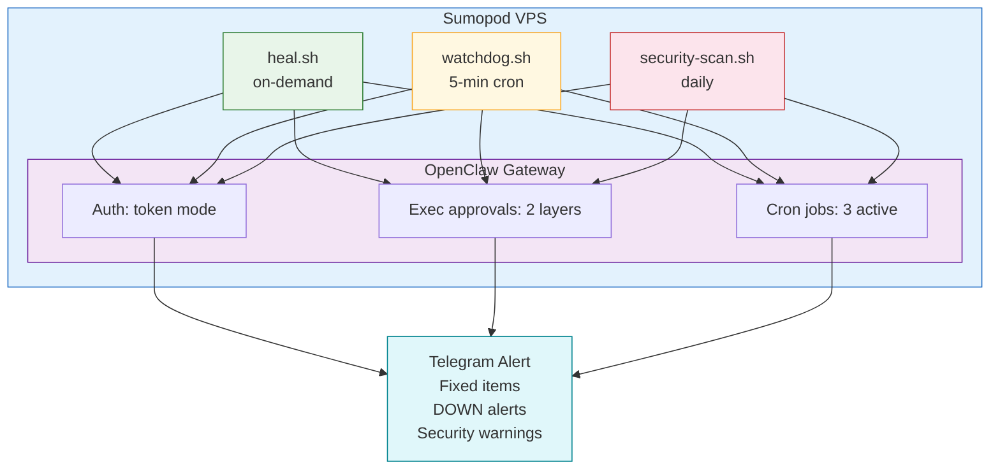

# OpenClaw Ops — Self-Healing Gateway + Security Hardening

Self-healing operations for OpenClaw — auto-detect, auto-fix, auto-log.

## Overview

[openclaw-ops](https://github.com/cathrynlavery/openclaw-ops) by Cathryn Lavery provides automated repair, monitoring, and security hardening for OpenClaw gateways.

**What it does:**
- Auto-repair after OpenClaw updates (auth, exec approval, cron jobs)
- Watchdog auto-restart every 5 minutes
- 4-layer security scanning
- Pre-install skill vetting
- Version drift detection

## Architecture



## What Gets Repaired Automatically

| Check | Problem | Fix |
|-------|---------|-----|
| Gateway Process | Crashes after update | Auto-start via systemd/launchd |
| Auth Config | `auth: "none"` removed in v2026.1.29 | Restore token mode |
| Exec Approvals | Two independent layers both reset | Restore allowlist + exec policy |
| Cron Jobs | Auto-disabled after 3 errors | Re-enable and clear error count |
| Sessions | Bloat >10MB, rapid-fire loops | Archive old, kill loop agents |

## Installation

```bash
openclaw skills install https://github.com/cathrynlavery/openclaw-ops
cd ~/.openclaw/skills/openclaw-ops
bash scripts/heal.sh
```

Expected output:

```
OpenClaw Self-Heal
────────────────────────────────
[1] Gateway process     ✓ Running
[2] Auth config        ✓ Token mode
[3] Exec approvals     ✓ Layer 1 & 2 OK
[4] Cron jobs          ✓ 3 jobs active
[5] Agent sessions     ✓ No bloat

Summary
────────────────────────────────
✅ All checks passed — nothing to fix
```

## Watchdog Setup

For 24/7 monitoring without manual intervention:

```bash
# Linux — systemd service
sudo cp scripts/openclaw-watchdog.service /etc/systemd/system/
sudo systemctl enable openclaw-watchdog
sudo systemctl start openclaw-watchdog

# macOS — LaunchAgent (survives reboot)
ln -sf ~/.openclaw/skills/openclaw-ops/scripts/openclaw-watchdog.plist \
  ~/Library/LaunchAgents/
launchctl load ~/Library/LaunchAgents/openclaw-watchdog.plist
```

**3-Tier Escalation:**

```
Tier 1: HTTP ping every 5 min
   ↓ (failure detected)
Tier 2: Restart + run heal.sh
   ↓ (3 failures = 15 min)
Tier 3: macOS notification + Telegram alert
```

## Security Scanning

### Pre-Install Vetting

Before installing any skill from ClawHub:

```bash
bash scripts/skill-audit.sh <skill-name>
# Output: LOW / MEDIUM / HIGH risk
```

Scans for: API keys, suspicious network calls, dangerous commands.

### Config Hardening

```bash
bash scripts/security-scan.sh --harden
```

Hardens: config file permissions, exec policy enforcement, fail2ban setup.

### Drift Detection

Detect unauthorized changes to skill files:

```bash
bash scripts/security-scan.sh --drift
```

Creates SHA-256 baseline, compares on each run. Alerts if files are added/modified/removed.

## Version Change Detection

After OpenClaw updates:

```bash
bash scripts/check-update.sh
```

Compares current vs previous version, explains what broke, suggests config fixes.

## Incident Logging

All heal runs write to JSONL:

```bash
cat ~/.openclaw/logs/heal-incidents.jsonl | python3 -m json.tool
```

```json
{
  "ts": "2026-04-03T02:00:00Z",
  "outcome": "fixed",
  "fixed": [
    "Cron re-enabled: email-digest",
    "Exec approval wildcard added for: raka"
  ],
  "broken": [],
  "manual": []
}
```

After 1 month, patterns emerge — "cron email-digest keeps disabling" or "exec approval resets after every update."

## Requirements

- **Minimum version:** v2026.2.12 (CVE-2026-25253 patched)
- **Node.js v22+** — NOT Bun (causes WhatsApp/Telegram issues)
- **Two exec approval layers** — both must be correct
- **Watchdog** is insurance, not replacement for monitoring

## Scripts Reference

| Script | Purpose | Frequency |
|--------|---------|-----------|
| `heal.sh` | One-shot auto-fix | On-demand |
| `watchdog.sh` | 5-minute guardian + auto-restart | Cron */5 |
| `security-scan.sh` | Hardening + drift + credentials | Daily |
| `skill-audit.sh` | Pre-install vetting | Before install |
| `check-update.sh` | Version change detector | After update |

## Deploy on Sumopod VPS

Get a pre-configured OpenClaw VPS with openclaw-ops built-in:

- **Sumopod**: https://blog.fanani.co/sumopod
- **Blog Tutorial**: https://blog.fanani.co/tech/openclaw-ops-self-healing/
- **GitHub Repo**: https://github.com/cathrynlavery/openclaw-ops
