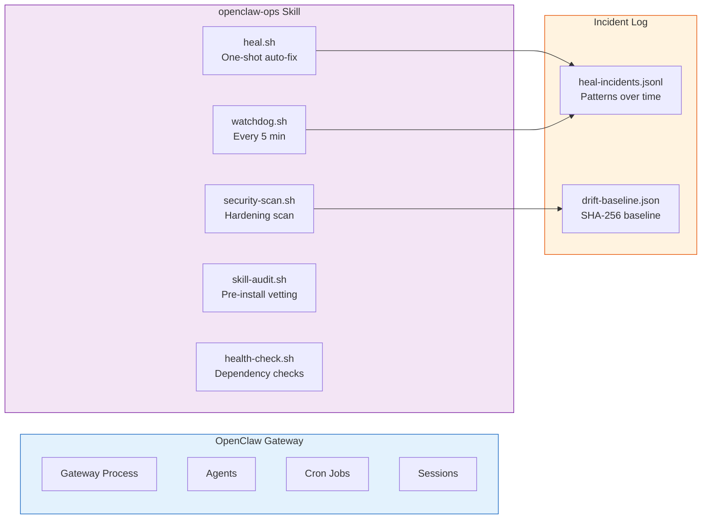
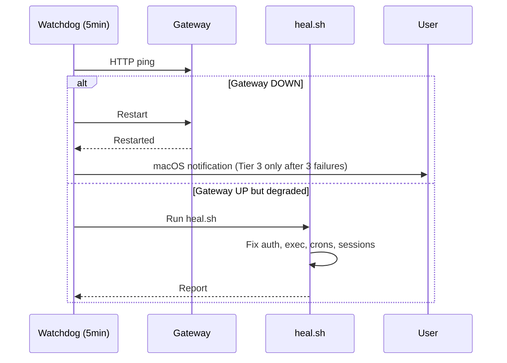
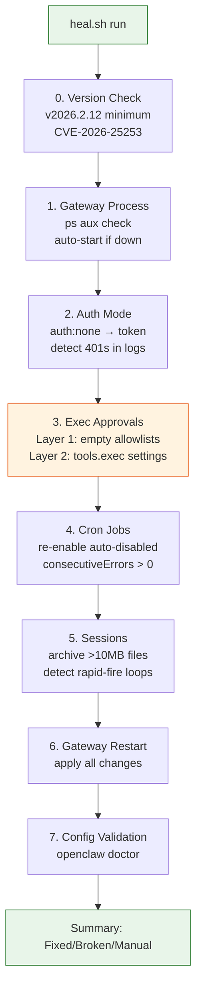
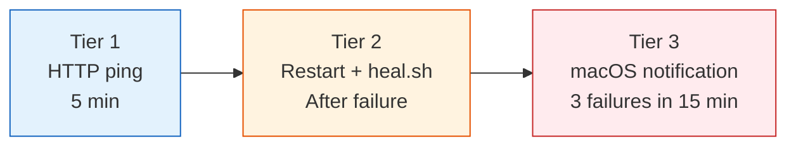
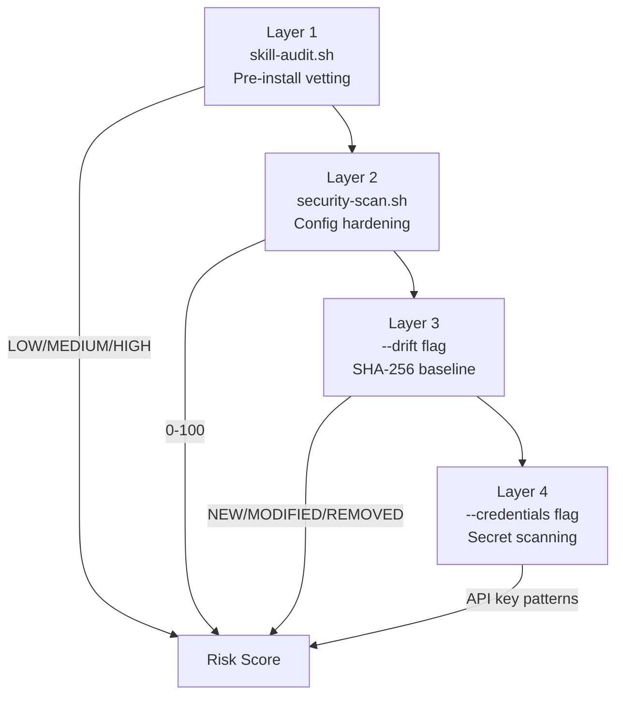

# OpenClaw Ops — Self-Healing Gateway + Security Hardening

> Every OpenClaw update breaks something. Your agents go quiet, exec approvals start blocking commands, config gets silently reset to new defaults. You don't notice until you've missed something critical.
>
> This is the ops layer that handles it automatically.

**Skill:** [cathrynlavery/openclaw-ops](https://github.com/cathrynlavery/openclaw-ops)  
**Tested on:** OpenClaw v2026.2.12+  
**Author:** Cathryn Lavery (with additions from the OpenClaw community)  
**Clone:**

```bash
git clone https://github.com/cathrynlavery/openclaw-ops.git ~/.openclaw/skills/openclaw-ops
```

---

## Table of Contents

1. [Why This Exists](#why-this-exists)
2. [What Gets Broken After Updates](#what-gets-broken-after-updates)
3. [Quick Start](#quick-start)
4. [Architecture](#architecture)
5. [Scripts Reference](#scripts-reference)
6. [Self-Heal Script Deep Dive](#self-heal-script-deep-dive)
7. [Watchdog: Always-On Guardian](#watchdog-always-on-guardian)
8. [Security Scanning](#security-scanning)
9. [Exec Approvals: The Two-Layer Problem](#exec-approvals-the-two-layer-problem)
10. [Channel Troubleshooting](#channel-troubleshooting)
11. [Installation](#installation)
12. [Sumopod Referral](#sumopod-referral)

---

## Why This Exists

OpenClaw's update cadence is aggressive — and each update has a habit of breaking production setups:

- `auth: "none"` silently removed in v2026.1.29 → gateway exits immediately after upgrade
- `tools.exec.security` gets reset by update defaults → complex commands blocked
- `exec-approvals.json` agent entries get empty allowlists auto-scaffolded → agents stall silently
- Cron jobs auto-disable after consecutive errors → silent, easy to miss for days
- Session files bloat past 10MB → gateway performance degrades
- Discord WebSocket disconnects + stuck typing indicator in v2026.2.24

The `openclaw-ops` skill gives you an **auto-repair layer** that runs on-demand or continuously. It detects, fixes, and logs every incident so patterns surface over time.

---

## What Gets Broken After Updates

### Gateway
- Gateway goes down (overnight or after an update)
- Port conflict blocking startup
- `auth: "none"` removed in v2026.1.29 — gateway exits immediately after upgrade
- Discord WebSocket disconnects + stuck typing indicator (v2026.2.24)

### Exec Approvals (Most Common Post-Update Breakage)
- Named agent entries with empty allowlists silently shadow the `*` wildcard — agents stall even though the global rule looks correct
- `tools.exec.ask` and `tools.exec.security` reset by update defaults — complex commands blocked even after allowlists are fixed
- **Both layers must be correct** or agents keep sending `/approve allow-always` requests

### Auth
- No API key / broken auth — blocks all agent activity
- Anthropic OAuth token rejected (policy block — must switch to direct API key)
- Non-Anthropic provider token expired

### Cron Jobs
- Jobs auto-disabled after consecutive errors — silent, easy to miss for days

### Sessions
- Agents stuck in a rapid-fire loop
- Session files bloated past 10MB
- Dead sessions that appear to be running (0 tokens, empty content)

### Channels
- **Slack:** bot receives but can't reply (missing_scope); token expired (invalid_auth)
- **WhatsApp:** disconnection loop (usually Bun instead of Node)
- **Telegram:** bot token not set or not responding
- **iMessage:** Full Disk Access not granted
- **BlueBubbles:** private network fetch blocked; null message body from tapbacks crashing gateway
- **Discord:** WebSocket 1005/1006, goes offline for 30+ min
- **Teams:** not available until the plugin is installed (moved to plugin in v2026.1.15)

### Security
- Config hardening gaps — scored 0-100 with specific fixes
- `config.get` leaking unredacted secrets via sourceConfig
- Unauthorized skill file changes detected via SHA-256 drift
- Credential patterns leaked into `~/.openclaw/` files or wrong file permissions
- Third-party ClawHub skills with hardcoded secrets, suspicious network calls, or prompt injection

### Updates
- Version change detection — explains what config broke and why after a specific bump
- CVE-2026-25253 (one-click RCE via token leakage) + 40+ SSRF, path traversal, and prompt injection fixes in v2026.2.12

---

## Quick Start

```bash
# Clone into your skills folder
git clone https://github.com/cathrynlavery/openclaw-ops.git ~/.openclaw/skills/openclaw-ops

# Run a one-shot heal pass now
cd ~/.openclaw/skills/openclaw-ops
bash scripts/heal.sh

# Install the always-on watchdog (macOS)
bash scripts/watchdog-install.sh

# Linux: add to crontab instead
echo '*/5 * * * * bash /root/.openclaw/skills/openclaw-ops/scripts/watchdog.sh >> /root/.openclaw/logs/watchdog.log 2>&1' | crontab -

# View watchdog log
tail -f ~/.openclaw/logs/watchdog.log

# View incident history
cat ~/.openclaw/logs/heal-incidents.jsonl | python3 -m json.tool

# Run security scan
bash scripts/security-scan.sh --verbose
```

---

## Architecture



**Escalation model (watchdog):**



---

## Scripts Reference

| Script | When | What it does |
|--------|------|-------------|
| `heal.sh` | On-demand or triggered | One-shot auto-fix: gateway, auth, exec approvals (both layers), crons, stuck sessions |
| `watchdog.sh` | Every 5 min via cron | HTTP health check, auto-restart, escalate after 3 failures |
| `watchdog-install.sh` | Once (macOS) | Install watchdog as LaunchAgent (survives reboots) |
| `health-check.sh` | On-demand | Declarative URL/process checks for gateway-adjacent dependencies |
| `security-scan.sh` | On-demand | Config hardening (0-100 score), drift detection, credential scan |
| `skill-audit.sh` | Before installing any skill | Pre-install security vetting: secrets, injection, dangerous commands |
| `check-update.sh` | After OpenClaw update | Detect version changes, explain breaking changes, auto-fix with `--fix` |

### Requirements

| Tool | Required for |
|------|-------------|
| `openclaw` | everything |
| `python3` | heal.sh, check-update.sh, watchdog.sh |
| `curl` | watchdog.sh HTTP health check |
| `openssl` | heal.sh auth token generation |
| `launchctl` + macOS | watchdog-install.sh (LaunchAgent) |
| `osascript` | watchdog.sh macOS notifications (optional) |

---

## Self-Heal Script Deep Dive

`heal.sh` is the core auto-fix engine. Run it anytime agents go quiet or after an update.

### What it checks and fixes (in order):



### Step 0: Version Gate

```bash
openclaw --version
```

If below v2026.2.12 → critical security vulnerabilities. Upgrade immediately:

```bash
curl -fsSL https://openclaw.ai/install.sh | bash
openclaw gateway restart
```

### Step 1: Gateway Process

```bash
ps aux | grep openclaw-gateway | grep -v grep
tail -100 ~/.openclaw/logs/gateway.err.log
```

Auto-starts if not running.

### Step 2: Auth Mode

`auth: "none"` was removed in v2026.1.29. If detected, automatically switches to token mode:

```bash
openclaw config set gateway.auth.mode token
openclaw config set gateway.auth.token "$(openssl rand -hex 32)"
```

Also detects recent 401s in logs.

### Step 3: Exec Approvals — The Two-Layer Problem

This is the most common post-update breakage. Two independent layers must both be correct.

**Layer 1: Per-agent allowlists** (`~/.openclaw/exec-approvals.json`)

Named agent entries with empty allowlists `[]` shadow the `*` wildcard. Gateway matches agent-specific entries first and blocks execution — it never falls through to the wildcard.

```bash
# Diagnose
openclaw approvals get
cat ~/.openclaw/exec-approvals.json

# Fix: add wildcard to each named agent
openclaw approvals allowlist add --agent <agent-name> "*"
openclaw gateway restart
```

**Prevention:** After adding any new agent, always run:
```bash
openclaw approvals allowlist add --agent <new-agent-name> "*"
```

**Layer 2: Exec policy settings** (often reset by updates)

`~/.openclaw/exec-approvals.json` defaults block:
```json
{
  "defaults": {
    "security": "full",
    "ask": "off",
    "askFallback": "full"
  }
}
```

`~/.openclaw/openclaw.json` exec tool settings:
```json
{
  "tools": {
    "exec": {
      "security": "full",
      "strictInlineEval": false
    }
  }
}
```

Fix via CLI:
```bash
openclaw config set tools.exec.security full
openclaw config set tools.exec.strictInlineEval false
openclaw gateway restart
```

**Symptoms when broken:** Agents message user with `/approve <id> allow-always` requests, logs show `exec.approval.waitDecision` timeouts (1800s), heartbeats fail silently, complex commands blocked even though simple commands work.

### Step 4: Cron Jobs

```bash
openclaw cron list
```

Auto-disabled jobs (consecutiveErrors > 0) are re-enabled automatically.

### Step 5: Sessions

- Archives session files >10MB (preserves history, doesn't delete)
- Detects rapid-fire loops (same content 10+ times in last 20 messages)
- Resets session pointers for stuck agents

### Step 7: Incident Logging

Every heal run appends a JSONL record to `~/.openclaw/logs/heal-incidents.jsonl`:

```json
{
  "ts": "2026-04-03T02:00:00Z",
  "outcome": "fixed",
  "fixed": ["Cron re-enabled: email-digest", "Exec approval wildcard added for: raka"],
  "broken": [],
  "manual": ["Version v2026.1.29 is below minimum — upgrade recommended"]
}
```

---

## Watchdog: Always-On Guardian

The watchdog runs every 5 minutes and escalates through 3 tiers:



### macOS Installation

```bash
cd ~/.openclaw/skills/openclaw-ops
bash scripts/watchdog-install.sh
```

Installs as a `LaunchAgent` — survives reboots automatically.

### Linux: Cron Setup

```bash
# Add to crontab
crontab -l | { cat; echo '*/5 * * * * bash /root/.openclaw/skills/openclaw-ops/scripts/watchdog.sh >> /root/.openclaw/logs/watchdog.log 2>&1'; } | crontab -
```

### Configuration

Copy and edit the targets file:

```bash
cp ~/.openclaw/skills/openclaw-ops/templates/health-targets.conf.example ~/.openclaw/health-targets.conf
nano ~/.openclaw/health-targets.conf
```

Example:
```ini
[targets]
gateway=https://localhost:18789/health
n8n=https://n8n.example.com/health
supabase=https://xxx.supabase.co/functions/v1/health
```

### Watchdog State

State is tracked in `~/.openclaw/watchdog-state.json` — records version changes so heal.sh knows when an update may have introduced breaking config.

---

## Security Scanning

`security-scan.sh` provides four layers of active defense:



### Layer 1: Pre-Install Skill Vetting

Before installing any skill from ClawHub:

```bash
bash ~/.openclaw/skills/openclaw-ops/scripts/skill-audit.sh /path/to/skill
```

Outputs risk score: **LOW / MEDIUM / HIGH**

Scans for:
- Hardcoded API keys or tokens
- Suspicious network calls (non-standard ports, IP addresses)
- Dangerous commands (`rm -rf`, `dd`, `:(){:|:&};:`)
- Prompt injection patterns

### Layer 2: Config Hardening

```bash
# Check compliance (0-100 score)
bash ~/.openclaw/skills/openclaw-ops/scripts/security-scan.sh

# Auto-fix low-risk issues
bash ~/.openclaw/skills/openclaw-ops/scripts/security-scan.sh --fix
```

Checks: gateway binding, auth mode, sandbox, DM policy, tool denials, version.

**Recommended settings:**
| Setting | Recommended Value |
|---------|-----------------|
| `gateway.bind` | `loopback` |
| `gateway.auth.mode` | `token` |
| `gateway.mdns.mode` | `minimal` |
| `dmPolicy` | `pairing` |
| `groupPolicy` | `allowlist` |
| `sandbox.mode` | `all` |
| `sandbox.scope` | `agent` |
| `tools.deny` | `["gateway", "cron", "sessions_spawn", "sessions_send"]` |

### Layer 3: Runtime Drift Detection

```bash
bash ~/.openclaw/skills/openclaw-ops/scripts/security-scan.sh --drift
```

Creates SHA-256 baseline on first run. Compares on subsequent runs. Reports **NEW / MODIFIED / REMOVED** skill files.

### Layer 4: Credential Scanning

```bash
bash ~/.openclaw/skills/openclaw-ops/scripts/security-scan.sh --credentials
```

Scans `~/.openclaw/` for:
- API key patterns (Bearer tokens, hex strings, UUIDs)
- File permissions (credentials dir should be 700, config files 600)

---

## Exec Approvals: The Two-Layer Problem

This deserves its own section because it's the most commonly missed post-update issue.

### The Silent Shadowing Bug

```mermaid
flowchart TD
    A[Agent: raka<br/>allowlist: []] --> B{gateway checks<br/>agent-specific<br/>entry FIRST}
    B -->|match| C[Block all commands<br/>🦘🦘🦘]
    D[Agent: *<br/>allowlist: [*]] --> B
    C -->|never reaches here| D

    style C fill:#ffebee,stroke:#c62828
    style B fill:#fff3e0,stroke:#e65100
```

The gateway matches agent-specific entries **before** falling through to the `*` wildcard. If `raka` has an empty allowlist `[]`, it shadows the global `*` rule — even though the global rule has `"*"` (allow everything).

### Symptoms

- Agent messages you with `/approve <id> allow-always`
- Logs show `exec.approval.waitDecision` timeouts (1800s)
- Heartbeats fail with "exec approval timed out"
- Simple commands work; complex multi-step commands blocked
- After fixing allowlists, problem persists

### The Second Layer (Often Missed)

Even with correct allowlists, a second policy layer gates complex commands independently. Check both files:

```bash
# Layer 1
cat ~/.openclaw/exec-approvals.json | python3 -m json.tool | grep -A5 '"agents"'
# Should NOT have any agent with "allowlist": []

# Layer 2
openclaw config get tools.exec.security   # should be "full"
openclaw config get tools.exec.strictInlineEval  # should be "false"
```

---

## Channel Troubleshooting

### Slack: missing_scope Error

Bot receives messages but can't reply.

```bash
tail -20 ~/.openclaw/logs/gateway.err.log | grep -i "slack\|socket-mode\|invalid_auth"
```

Fix: Refresh bot token in Slack API settings.

### WhatsApp: Disconnection Loop

Usually Bun instead of Node. Check:

```bash
which node && node --version  # Should be v22+
# If Bun: curl -fsSL https://bun.sh/install | bash
```

### Discord: WebSocket 1005/1006 (v2026.2.24)

Known issue. Workaround:

```bash
openclaw gateway restart
```

### Telegram: Bot Not Responding

```bash
openclaw channels status
openclaw config get channels.telegram.botToken
```

---

## Installation

### Requirements

- **Node.js:** v22+ (NOT Bun — causes WhatsApp/Telegram issues)
- **macOS** or **Linux** (WSL2 for Windows)
- **OpenClaw:** v2026.2.12+ (required for security fixes)

### Steps

```bash
# 1. Clone the skill
git clone https://github.com/cathrynlavery/openclaw-ops.git ~/.openclaw/skills/openclaw-ops

# 2. Verify minimum version
openclaw --version

# 3. Run one-shot heal
cd ~/.openclaw/skills/openclaw-ops
bash scripts/heal.sh

# 4. Install watchdog
# macOS:
bash scripts/watchdog-install.sh
# Linux:
echo '*/5 * * * * bash /root/.openclaw/skills/openclaw-ops/scripts/watchdog.sh >> /root/.openclaw/logs/watchdog.log 2>&1' | crontab -

# 5. Run security scan
bash scripts/security-scan.sh --verbose
```

---

## Sumopod Referral

Want to run your own AI agent dashboard on a VPS? I use **Sumopod** — it makes the whole setup stupidly simple.

👉 [blog.fanani.co/sumopod](https://blog.fanani.co/sumopod)

---

## Related Tutorials

- [Build AI Agent Dashboard dengan OpenClaw + Sumopod VPS](https://github.com/fanani-radian/openclaw-sumopod/blob/main/tutorials/ai-agent-dashboard-openclaw-sumopod-vps.md) — Full dashboard setup with this ops layer integrated
- [n8n Integration dengan OpenClaw](https://github.com/fanani-radian/openclaw-sumopod/blob/main/tutorials/n8n-integration.md) — Automation layer for OpenClaw
- [Gog CLI untuk Google Workspace](https://github.com/fanani-radian/openclaw-sumopod/blob/main/tutorials/gog-cli-google-workspace.md) — CLI tool for Gmail, Calendar, Drive
